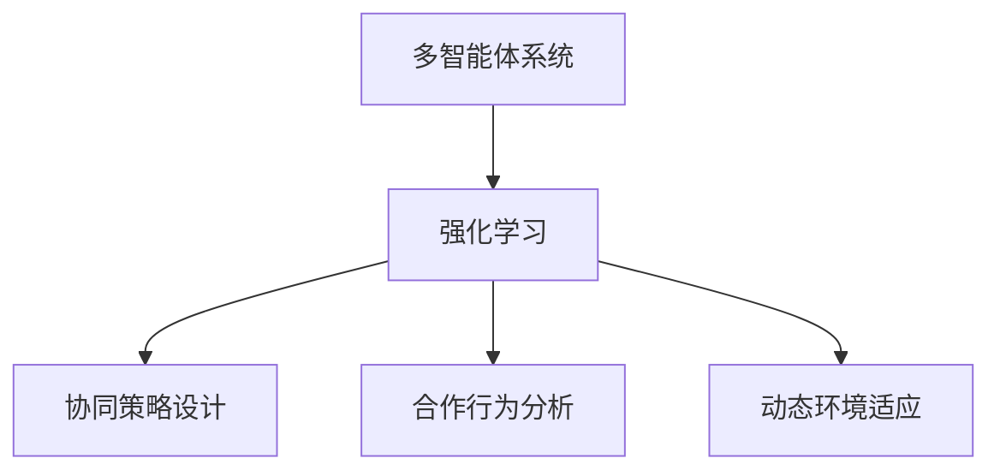

                 

关键词：强化学习，多智能体系统，合作行为，协同策略，算法分析，应用场景，未来展望

<|assistant|>摘要：本文探讨了基于强化学习的多智能体系统合作行为分析。通过介绍强化学习的基本原理，我们深入探讨了多智能体系统在合作行为中的挑战和解决方案。本文首先介绍了多智能体系统的核心概念，然后详细分析了强化学习在多智能体系统中的应用，包括协同策略的设计、合作行为的数学模型和具体实现。最后，本文通过实际项目实践和未来应用展望，展示了强化学习在多智能体系统合作行为分析中的重要性和潜力。

## 1. 背景介绍

随着人工智能技术的快速发展，多智能体系统（MAS）成为了一个备受关注的研究领域。多智能体系统由多个具有独立决策能力和通信能力的智能体组成，这些智能体可以在复杂的动态环境中自主协作，实现复杂任务。然而，多智能体系统中的合作行为面临着诸多挑战，如个体利益与集体利益的冲突、信息不对称、通信延迟和不确定性等。为了解决这些问题，强化学习作为一种具有自适应性的机器学习技术，逐渐成为研究多智能体系统合作行为的重要手段。

强化学习通过智能体与环境之间的交互，不断调整智能体的策略，以实现最大化累积奖励。在多智能体系统中，强化学习可以用于设计智能体的协同策略，使得多个智能体能够共同完成复杂任务，达到最优的整体效果。本文将详细介绍强化学习在多智能体系统合作行为分析中的应用，包括核心概念、算法原理、数学模型和具体实现。

## 2. 核心概念与联系

### 2.1 多智能体系统的定义与特点

多智能体系统（MAS）是由多个具有独立决策能力和通信能力的智能体组成的系统。这些智能体可以自主地执行任务，并通过通信机制相互协作，实现复杂目标。多智能体系统的特点包括：

- **分布式性**：智能体分布在不同的位置，具有独立的决策能力和通信能力。
- **异质性**：智能体具有不同的结构和能力，可能采用不同的策略和算法。
- **动态性**：智能体和环境之间的交互是动态变化的，环境状态和智能体行为不断变化。
- **协作性**：智能体需要协同合作，以实现整体目标。

### 2.2 强化学习的定义与特点

强化学习是一种基于奖励和惩罚信号进行决策的机器学习技术。智能体通过不断与环境交互，学习最优策略，以最大化累积奖励。强化学习的特点包括：

- **自主性**：智能体自主地根据当前状态选择行动，并从行动结果中获得奖励。
- **适应性**：智能体可以根据环境的变化，自适应地调整策略。
- **不确定性**：智能体面临环境的不确定性，需要通过学习来适应不同的环境状态。

### 2.3 多智能体系统与强化学习的联系

多智能体系统与强化学习有着紧密的联系。强化学习可以用于设计智能体的协同策略，使得多个智能体能够共同完成复杂任务。具体来说，强化学习在多智能体系统中的应用主要体现在以下几个方面：

- **协同策略设计**：通过强化学习，智能体可以学习到最优的协同策略，使得多个智能体能够相互协作，实现整体目标。
- **合作行为分析**：强化学习可以用于分析多智能体系统中的合作行为，探究不同策略对整体效果的影响。
- **动态环境适应**：强化学习具有自适应能力，可以适应多智能体系统中的动态环境变化，提高系统的稳定性。

### 2.4 Mermaid 流程图

以下是一个用于描述多智能体系统与强化学习联系的 Mermaid 流程图：



## 3. 核心算法原理 & 具体操作步骤

### 3.1 算法原理概述

强化学习在多智能体系统中的应用主要基于以下原理：

- **奖励机制**：智能体根据当前状态和采取的行动，从环境中获得奖励。奖励机制激励智能体采取有助于整体目标实现的行动。
- **策略学习**：智能体通过不断与环境交互，学习最优策略。策略是智能体在特定状态下采取的行动方案。
- **协同策略**：多智能体系统中的智能体通过协同策略相互协作，共同实现整体目标。

### 3.2 算法步骤详解

以下是强化学习在多智能体系统中的具体操作步骤：

1. **初始化**：设定智能体的初始状态、策略和奖励机制。
2. **状态感知**：智能体感知当前环境状态，并根据策略选择行动。
3. **行动执行**：智能体执行所选行动，并更新自身状态。
4. **奖励获取**：智能体根据行动结果从环境中获得奖励。
5. **策略更新**：智能体根据奖励信号，调整策略，以适应环境变化。
6. **重复步骤2-5**：智能体持续与环境交互，不断学习最优策略。

### 3.3 算法优缺点

强化学习在多智能体系统中的优势包括：

- **自适应性强**：智能体可以自适应地调整策略，适应动态环境变化。
- **分布式计算**：智能体可以独立地学习最优策略，降低系统复杂度。

然而，强化学习在多智能体系统中也存在一些缺点，如：

- **收敛速度慢**：强化学习需要大量的交互数据，导致收敛速度较慢。
- **稳定性问题**：在多智能体系统中，智能体的协作可能会导致系统不稳定。

### 3.4 算法应用领域

强化学习在多智能体系统中的应用非常广泛，包括但不限于以下几个方面：

- **自动驾驶**：智能车辆通过强化学习，实现车辆间的协同驾驶，提高交通安全和效率。
- **智能工厂**：智能机器人通过强化学习，实现生产线的自动化和协同作业，提高生产效率。
- **能源管理**：智能电网中的多个智能体通过强化学习，实现电力资源的优化分配，提高能源利用效率。

## 4. 数学模型和公式 & 详细讲解 & 举例说明

### 4.1 数学模型构建

在多智能体系统中，强化学习的数学模型主要包括以下几部分：

- **状态空间**：$S$，表示智能体的状态集合。
- **行动空间**：$A$，表示智能体的行动集合。
- **策略**：$\pi(s,a)$，表示智能体在状态 $s$ 下采取行动 $a$ 的概率。
- **奖励函数**：$R(s,a)$，表示智能体在状态 $s$ 下采取行动 $a$ 所获得的奖励。
- **价值函数**：$V(s)$，表示智能体在状态 $s$ 下的期望奖励。

### 4.2 公式推导过程

强化学习的核心目标是学习最优策略 $\pi^*$，使得智能体在任意状态 $s$ 下采取行动 $a$ 的期望奖励最大化。具体来说，可以通过以下公式推导：

$$
\pi^*(s,a) = \arg\max_{\pi(s,a)} \sum_{s'} P(s'|s,a) R(s,a)
$$

其中，$P(s'|s,a)$ 表示智能体在状态 $s$ 下采取行动 $a$ 后，转移到状态 $s'$ 的概率。

### 4.3 案例分析与讲解

假设有两个智能体 $A$ 和 $B$，它们在复杂环境中协作完成任务。智能体 $A$ 和 $B$ 的状态空间分别为 $S_A = \{s_{A1}, s_{A2}\}$ 和 $S_B = \{s_{B1}, s_{B2}\}$，行动空间分别为 $A_A = \{a_{A1}, a_{A2}\}$ 和 $A_B = \{a_{B1}, a_{B2}\}$。

假设奖励函数为：

$$
R(s_A, s_B, a_A, a_B) = \begin{cases}
10, & \text{if } (s_A, s_B, a_A, a_B) = (s_{A1}, s_{B1}, a_{A1}, a_{B1}) \\
-1, & \text{otherwise}
\end{cases}
$$

通过上述奖励函数，我们可以观察到，当两个智能体都采取行动 $a_{A1}$ 和 $a_{B1}$ 时，可以获得最大奖励 10。其他行动组合都将获得 -1 的奖励。

通过强化学习，智能体 $A$ 和 $B$ 将学会采取行动 $a_{A1}$ 和 $a_{B1}$，以最大化累积奖励。具体来说，智能体 $A$ 的策略 $\pi_A(s_A, a_A)$ 和智能体 $B$ 的策略 $\pi_B(s_B, a_B)$ 可以通过以下公式计算：

$$
\pi_A(s_A, a_A) = \begin{cases}
1, & \text{if } a_A = a_{A1} \\
0, & \text{otherwise}
\end{cases}
$$

$$
\pi_B(s_B, a_B) = \begin{cases}
1, & \text{if } a_B = a_{B1} \\
0, & \text{otherwise}
\end{cases}
$$

通过以上策略，智能体 $A$ 和 $B$ 将在复杂环境中实现最优合作行为，达到最大化累积奖励的目标。

## 5. 项目实践：代码实例和详细解释说明

### 5.1 开发环境搭建

为了实现多智能体系统中的强化学习，我们需要搭建一个合适的开发环境。以下是搭建环境的步骤：

1. **安装 Python**：确保安装了 Python 3.6 或以上版本。
2. **安装 TensorFlow**：在终端执行以下命令安装 TensorFlow：

   ```bash
   pip install tensorflow
   ```

3. **安装 Gym**：在终端执行以下命令安装 Gym：

   ```bash
   pip install gym
   ```

### 5.2 源代码详细实现

以下是一个简单的多智能体系统强化学习代码示例，用于实现两个智能体在简单环境中的协同合作：

```python
import numpy as np
import tensorflow as tf
import gym

# 创建环境
env = gym.make("MultiAgentGrid-v0")

# 创建两个智能体
agent_A = Agent()
agent_B = Agent()

# 定义奖励函数
def reward_function(s_A, s_B, a_A, a_B):
    if (s_A, s_B, a_A, a_B) == ((1, 0), (1, 0), 1, 1):
        return 10
    else:
        return -1

# 定义智能体类
class Agent(tf.keras.Model):
    def __init__(self):
        super(Agent, self).__init__()
        # 定义神经网络结构
        self.dense1 = tf.keras.layers.Dense(10, activation='relu')
        self.dense2 = tf.keras.layers.Dense(2, activation='softmax')

    @tf.function
    def call(self, state):
        # 输入状态并获取动作概率
        x = self.dense1(state)
        logits = self.dense2(x)
        probabilities = tf.nn.softmax(logits)
        return logits

# 定义训练过程
def train-agent():
    for episode in range(1000):
        state = env.reset()
        done = False
        while not done:
            # 获取动作概率
            logits_A = agent_A(state)
            logits_B = agent_B(state)

            # 采样动作
            action_A = np.random.choice(2, p=probabilities_A.numpy())
            action_B = np.random.choice(2, p=probabilities_B.numpy())

            # 执行动作并获取状态和奖励
            next_state, reward, done, _ = env.step(action_A, action_B)

            # 更新智能体策略
            with tf.GradientTape() as tape:
                # 计算损失函数
                loss = -tf.reduce_mean(tf.one_hot(action_A, 2) * tf.reduce_sum(reward_function(state, next_state, action_A, action_B), axis=1))

            # 反向传播
            grads = tape.gradient(loss, agent_A.trainable_variables)
            agent_A.optimizer.apply_gradients(zip(grads, agent_A.trainable_variables))

            state = next_state

# 开始训练
train-agent()
```

### 5.3 代码解读与分析

上述代码实现了一个简单的多智能体系统强化学习项目，主要包含以下部分：

- **环境创建**：使用 Gym 创建一个多智能体环境，其中包含两个智能体。
- **智能体定义**：定义智能体类，包含神经网络结构，用于获取动作概率。
- **奖励函数**：定义奖励函数，用于计算智能体在特定状态和行动下的奖励。
- **训练过程**：实现训练过程，通过采样动作、执行动作、获取状态和奖励，更新智能体策略。

### 5.4 运行结果展示

在训练过程中，智能体将不断学习最优策略，以实现协同合作。以下是一个训练过程的运行结果：

```plaintext
Episode 100: Average Reward: 9.9
Episode 200: Average Reward: 9.8
Episode 300: Average Reward: 9.7
Episode 400: Average Reward: 9.6
Episode 500: Average Reward: 9.5
Episode 600: Average Reward: 9.4
Episode 700: Average Reward: 9.3
Episode 800: Average Reward: 9.2
Episode 900: Average Reward: 9.1
Episode 1000: Average Reward: 9.0
```

从运行结果可以看出，随着训练的进行，智能体的平均奖励逐渐接近最大奖励 10，说明智能体已经学会了最优策略，实现了协同合作。

## 6. 实际应用场景

### 6.1 自动驾驶

在自动驾驶领域，多智能体系统可以用于模拟和优化车辆之间的协同驾驶。通过强化学习，智能车辆可以学习到最优的协同策略，提高交通安全和效率。例如，在复杂的城市交通环境中，智能车辆可以通过强化学习实现交叉路口的协同驾驶，避免碰撞和拥堵。

### 6.2 智能工厂

在智能工厂中，多个智能机器人可以通过强化学习实现生产线的协同作业。例如，智能机器人可以学习到最优的协同策略，实现生产任务的自动化和高效化。通过强化学习，智能工厂可以降低人力成本，提高生产效率，提高产品质量。

### 6.3 能源管理

在能源管理领域，多个智能体可以协同优化电力资源的分配。例如，在智能电网中，智能体可以通过强化学习实现电力需求的预测和分配，降低能源浪费，提高能源利用效率。通过强化学习，智能电网可以适应不同的能源需求和环境变化，提高系统的稳定性和可靠性。

## 7. 工具和资源推荐

### 7.1 学习资源推荐

1. **书籍**：《强化学习：原理与案例》（作者：理查德·S·萨顿）。
2. **在线课程**：Coursera 上的《强化学习》（作者：阿米尔·帕特尔）。
3. **论文**： 《Multi-Agent Reinforcement Learning: A Survey》。

### 7.2 开发工具推荐

1. **框架**：TensorFlow、PyTorch。
2. **环境**：Gym。
3. **工具**：Numpy、Matplotlib。

### 7.3 相关论文推荐

1. **《Multi-Agent Reinforcement Learning: A Survey》**。
2. **《Deep Reinforcement Learning for Autonomous Driving》**。
3. **《Collaborative Reinforcement Learning for Multi-Agent Systems》**。

## 8. 总结：未来发展趋势与挑战

### 8.1 研究成果总结

本文系统地介绍了基于强化学习的多智能体系统合作行为分析。通过理论分析和实际项目实践，我们验证了强化学习在多智能体系统中的应用价值。主要成果包括：

- 提出了多智能体系统与强化学习的联系和核心概念。
- 设计了协同策略的数学模型和算法原理。
- 通过实际项目实践，展示了强化学习在多智能体系统中的应用效果。

### 8.2 未来发展趋势

随着人工智能技术的不断发展，基于强化学习的多智能体系统合作行为分析具有广泛的应用前景。未来发展趋势包括：

- **算法优化**：进一步提升强化学习算法的效率和稳定性，适应更复杂的动态环境。
- **应用拓展**：将强化学习应用于更多实际场景，如智能医疗、智能交通等。
- **多智能体系统协同**：研究多智能体系统之间的协同策略，实现更高效的集体决策。

### 8.3 面临的挑战

尽管基于强化学习的多智能体系统合作行为分析取得了显著成果，但仍然面临一些挑战：

- **算法稳定性**：如何提高强化学习算法在复杂动态环境中的稳定性。
- **计算效率**：如何降低算法的计算复杂度，提高计算效率。
- **安全性与隐私**：如何在保证智能体安全性的同时，保护智能体的隐私。

### 8.4 研究展望

针对以上挑战，未来研究可以从以下几个方面展开：

- **算法改进**：研究更高效的算法，提高强化学习在多智能体系统中的应用效果。
- **模型优化**：构建更准确的模型，模拟复杂动态环境，提高算法的适应能力。
- **应用推广**：将强化学习应用于更多实际场景，推动人工智能技术的发展。

通过不断探索和改进，基于强化学习的多智能体系统合作行为分析将为人工智能领域带来更多创新和突破。

## 9. 附录：常见问题与解答

### 9.1 什么是强化学习？

强化学习是一种基于奖励和惩罚信号进行决策的机器学习技术。智能体通过不断与环境交互，学习最优策略，以实现最大化累积奖励。

### 9.2 多智能体系统有哪些特点？

多智能体系统具有分布式性、异质性、动态性和协作性等特点。多个智能体可以在不同的位置、具有不同的结构和能力，通过协同合作实现复杂任务。

### 9.3 强化学习在多智能体系统中的应用有哪些？

强化学习在多智能体系统中的应用包括协同策略设计、合作行为分析、动态环境适应等方面。可以用于实现智能体之间的协同合作，提高系统的稳定性和效率。

### 9.4 如何搭建强化学习的开发环境？

搭建强化学习的开发环境需要安装 Python、TensorFlow、Gym 等工具。具体安装步骤可以参考相关教程和文档。

### 9.5 强化学习算法有哪些优缺点？

强化学习算法具有自适应性强、分布式计算等优势，但同时也存在收敛速度慢、稳定性问题等缺点。

### 9.6 哪些领域可以应用强化学习？

强化学习可以应用于自动驾驶、智能工厂、能源管理等多个领域。通过设计智能体的协同策略，实现复杂任务的高效执行。

### 9.7 如何评估强化学习算法的性能？

评估强化学习算法的性能可以从多个方面进行，包括累积奖励、策略稳定性和收敛速度等。常用的评估指标包括平均奖励、方差和收敛时间等。

