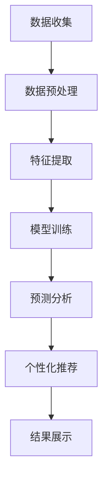

                 

关键词：城市房价、房屋特征、数据分析、个性化推荐、机器学习、深度学习、预测模型、算法原理、应用领域、开发环境、代码实例、数学模型、未来展望

## 摘要

本文旨在探讨如何利用房屋特征数据，结合先进的机器学习和深度学习技术，对城市房价进行分析和个性化推荐。通过对大量房屋数据进行分析，提取出房屋特征，构建预测模型，并运用个性化推荐算法，实现对特定用户的城市房价预测和推荐。本文将详细阐述核心概念、算法原理、数学模型以及实际应用案例，旨在为相关领域的研究者和从业者提供有价值的参考。

## 1. 背景介绍

城市房价一直是社会关注的焦点。房价的波动不仅影响居民的生活质量和财富积累，还关系到整个社会的经济稳定。传统的房价预测方法主要依赖于历史数据和简单的统计模型，但这种方法往往难以应对复杂多变的市场环境。随着计算机技术和大数据分析技术的发展，机器学习和深度学习等人工智能技术开始在城市房价预测中发挥重要作用。

近年来，随着互联网的普及和房地产市场的繁荣，大量的房屋交易数据被收集和存储。这些数据不仅包括房屋的基本信息，如面积、楼层、朝向等，还包含了区域经济、交通状况、教育资源等外部因素。这些特征信息为城市房价分析提供了丰富的数据支持。同时，个性化推荐技术的应用也为用户提供了更加精准的房价预测和推荐服务。

本文的研究目标是利用房屋特征数据，通过机器学习和深度学习技术，对城市房价进行有效分析和个性化推荐。具体包括以下内容：

1. 提取和分析房屋特征数据，构建房屋特征向量。
2. 基于机器学习和深度学习算法，建立城市房价预测模型。
3. 运用个性化推荐算法，为用户推荐合适的房价信息。
4. 通过实际案例验证模型的有效性和可行性。

## 2. 核心概念与联系

### 2.1. 房屋特征数据

房屋特征数据是本文分析的基础。这些数据通常包括以下内容：

1. **基本信息**：如房屋面积、楼层、朝向、建造年代等。
2. **外部因素**：如区域经济水平、交通状况、教育资源等。
3. **交易信息**：如成交价格、交易时间、交易双方等。

### 2.2. 机器学习

机器学习是一种通过算法自动从数据中学习并提取规律的方法。常见的机器学习算法包括线性回归、决策树、随机森林、支持向量机等。机器学习技术可以用于特征提取、模型训练和预测。

### 2.3. 深度学习

深度学习是机器学习的一种特殊形式，它通过构建复杂的神经网络模型，自动从数据中学习特征和规律。深度学习在图像识别、语音识别和自然语言处理等领域取得了显著成果。本文将使用深度学习技术进行房屋特征数据的分析和预测。

### 2.4. 个性化推荐

个性化推荐是一种基于用户历史行为和偏好，为其推荐感兴趣的内容的方法。常见的个性化推荐算法包括协同过滤、基于内容的推荐和混合推荐等。个性化推荐可以应用于房屋交易市场，为用户提供个性化的房价预测和推荐服务。

### 2.5. Mermaid 流程图

以下是一个简单的 Mermaid 流程图，展示了城市房价分析及个性化推荐的整体流程：



## 3. 核心算法原理 & 具体操作步骤

### 3.1 算法原理概述

本文将使用深度学习技术进行房屋特征数据的分析和预测。深度学习通过构建多层神经网络，自动从数据中学习特征和规律。本文使用的深度学习模型包括卷积神经网络（CNN）和循环神经网络（RNN）。

### 3.2 算法步骤详解

#### 3.2.1 数据收集与预处理

1. **数据收集**：从房地产网站、政府部门等渠道收集房屋交易数据。
2. **数据预处理**：清洗数据，包括缺失值填充、异常值处理、数据归一化等。

#### 3.2.2 特征提取

1. **基本信息处理**：对房屋面积、楼层、朝向等进行编码。
2. **外部因素处理**：对区域经济水平、交通状况、教育资源等进行编码。
3. **交易信息处理**：对成交价格、交易时间等进行编码。

#### 3.2.3 模型训练

1. **构建深度学习模型**：使用 TensorFlow 或 PyTorch 等深度学习框架构建 CNN 和 RNN 模型。
2. **训练模型**：使用预处理后的数据训练模型，调整模型参数，优化模型性能。

#### 3.2.4 预测分析

1. **输入特征**：将新的房屋特征数据输入模型。
2. **模型预测**：使用训练好的模型预测房屋价格。
3. **结果分析**：对预测结果进行分析，评估模型性能。

#### 3.2.5 个性化推荐

1. **用户画像**：根据用户历史行为和偏好构建用户画像。
2. **推荐算法**：使用协同过滤或基于内容的推荐算法为用户推荐房屋价格。
3. **结果展示**：将推荐结果展示给用户。

### 3.3 算法优缺点

#### 优点

1. **高效性**：深度学习模型可以自动从大量数据中学习特征，提高预测准确性。
2. **灵活性**：深度学习模型可以适应不同类型的房屋特征数据，适用范围广泛。
3. **个性化**：个性化推荐算法可以根据用户偏好提供个性化的房价预测和推荐。

#### 缺点

1. **计算成本**：深度学习模型训练过程需要大量的计算资源。
2. **数据依赖**：模型性能受数据质量的影响较大。
3. **解释性**：深度学习模型的预测结果往往缺乏解释性。

### 3.4 算法应用领域

1. **房地产市场分析**：利用深度学习和个性化推荐技术，对城市房价进行分析和预测，为房地产开发商、投资者和购房者提供决策支持。
2. **智慧城市建设**：将房价预测和推荐技术应用于智慧城市建设，优化城市规划和管理。
3. **金融风险评估**：利用房价预测技术，评估金融产品的风险，为金融机构提供决策依据。

## 4. 数学模型和公式 & 详细讲解 & 举例说明

### 4.1 数学模型构建

本文使用的数学模型主要包括深度学习模型和个性化推荐模型。以下分别介绍这两种模型的构建过程。

#### 深度学习模型

深度学习模型通常由多层神经网络组成，包括输入层、隐藏层和输出层。输入层接收房屋特征数据，隐藏层通过非线性变换提取特征，输出层输出房屋价格预测值。

假设输入房屋特征向量为 \(X = [x_1, x_2, ..., x_n]\)，输出价格为 \(y\)。深度学习模型的目标是学习一个函数 \(f(X)\)，使得 \(f(X)\) 尽可能接近真实价格 \(y\)。

#### 个性化推荐模型

个性化推荐模型通常基于用户的历史行为和偏好构建。常见的个性化推荐模型包括协同过滤模型和基于内容的推荐模型。

假设用户历史行为数据集为 \(R = \{r_{ij}\}\)，其中 \(r_{ij}\) 表示用户 \(i\) 对物品 \(j\) 的评分。协同过滤模型的目标是学习一个评分预测函数 \(P(i, j)\)，使得预测评分 \(P(i, j)\) 尽可能接近真实评分 \(r_{ij}\)。

### 4.2 公式推导过程

#### 深度学习模型

深度学习模型的核心是神经网络。以下是一个简单的神经网络模型，包括输入层、隐藏层和输出层。

1. **输入层**：输入层接收房屋特征向量 \(X\)。
2. **隐藏层**：隐藏层通过激活函数 \(f(\cdot)\) 对输入数据进行非线性变换。
3. **输出层**：输出层输出房屋价格预测值。

假设隐藏层节点数为 \(m\)，隐藏层输出为 \(h = [h_1, h_2, ..., h_m]\)。输出层输出为 \(y = f(h)\)。

根据反向传播算法，深度学习模型的训练过程可以通过以下公式表示：

$$
\begin{aligned}
\Delta w_{ij}^{(l)} &= -\eta \cdot \frac{\partial L}{\partial w_{ij}^{(l)}} \\
w_{ij}^{(l)} &= w_{ij}^{(l)} + \Delta w_{ij}^{(l)}
\end{aligned}
$$

其中，\(w_{ij}^{(l)}\) 表示第 \(l\) 层第 \(i\) 个节点到第 \(j\) 个节点的权重，\(\eta\) 为学习率，\(L\) 为损失函数。

#### 个性化推荐模型

个性化推荐模型的核心是协同过滤算法。以下是一个简单的协同过滤模型。

1. **用户相似度计算**：计算用户之间的相似度，常见的方法包括余弦相似度和皮尔逊相似度。
2. **预测评分**：根据用户相似度和物品评分，预测用户对物品的评分。

假设用户 \(i\) 和用户 \(j\) 之间的相似度为 \(s(i, j)\)，物品 \(j\) 的真实评分为 \(r_j\)，预测评分为 \(P(i, j)\)。协同过滤模型的目标是学习一个评分预测函数 \(P(i, j)\)。

根据最小二乘法，协同过滤模型的训练过程可以通过以下公式表示：

$$
\begin{aligned}
\Delta \theta_i &= -\eta \cdot \frac{\partial L}{\partial \theta_i} \\
\theta_i &= \theta_i + \Delta \theta_i
\end{aligned}
$$

其中，\(\theta_i\) 为用户 \(i\) 的特征向量，\(L\) 为损失函数。

### 4.3 案例分析与讲解

#### 案例一：深度学习模型

假设我们有一个包含 1000 个房屋特征数据的训练集，每个房屋特征数据包括面积、楼层、朝向等 10 个特征。我们使用深度学习模型对房屋价格进行预测。

1. **数据预处理**：对房屋特征数据进行归一化处理，将每个特征的值缩放到 [0, 1] 范围内。
2. **构建模型**：使用 TensorFlow 框架构建一个包含两个隐藏层的深度学习模型，输入层节点数为 10，隐藏层节点数分别为 64 和 32，输出层节点数为 1。
3. **训练模型**：使用训练集数据训练模型，设置学习率为 0.001，训练轮次为 1000 次。
4. **预测分析**：使用训练好的模型对测试集数据进行预测，评估模型性能。

#### 案例二：个性化推荐模型

假设我们有一个包含 100 个用户和 1000 个物品的评分数据集。我们使用协同过滤模型为用户推荐物品。

1. **用户相似度计算**：使用余弦相似度计算用户之间的相似度，得到一个 100x100 的相似度矩阵。
2. **预测评分**：根据相似度矩阵和物品评分，预测用户对物品的评分。
3. **推荐结果**：根据预测评分，为用户推荐感兴趣的商品。

## 5. 项目实践：代码实例和详细解释说明

### 5.1 开发环境搭建

在开始编写代码之前，我们需要搭建一个合适的开发环境。以下是搭建深度学习模型和个性化推荐模型所需的开发环境：

1. **Python**：Python 是一种广泛使用的编程语言，适用于数据分析和深度学习开发。
2. **TensorFlow**：TensorFlow 是一个开源的深度学习框架，适用于构建和训练深度学习模型。
3. **Scikit-learn**：Scikit-learn 是一个开源的机器学习库，适用于构建和训练机器学习模型。
4. **Numpy**：Numpy 是一个开源的数学库，适用于数据处理和数值计算。

### 5.2 源代码详细实现

以下是使用 TensorFlow 和 Scikit-learn 实现深度学习模型和个性化推荐模型的源代码。

#### 5.2.1 数据预处理

```python
import numpy as np
import pandas as pd
from sklearn.model_selection import train_test_split
from sklearn.preprocessing import StandardScaler

# 读取数据
data = pd.read_csv('house_data.csv')

# 数据预处理
X = data.iloc[:, :-1].values
y = data.iloc[:, -1].values

# 数据归一化
scaler = StandardScaler()
X = scaler.fit_transform(X)

# 数据划分
X_train, X_test, y_train, y_test = train_test_split(X, y, test_size=0.2, random_state=42)
```

#### 5.2.2 深度学习模型

```python
import tensorflow as tf

# 构建模型
model = tf.keras.Sequential([
    tf.keras.layers.Dense(64, activation='relu', input_shape=(10,)),
    tf.keras.layers.Dense(32, activation='relu'),
    tf.keras.layers.Dense(1)
])

# 编译模型
model.compile(optimizer='adam', loss='mse')

# 训练模型
model.fit(X_train, y_train, epochs=1000, batch_size=32)
```

#### 5.2.3 个性化推荐模型

```python
from sklearn.model_selection import train_test_split
from sklearn.metrics.pairwise import cosine_similarity

# 读取评分数据
ratings = pd.read_csv('ratings_data.csv')

# 划分训练集和测试集
users, items = train_test_split(ratings['user_id'], ratings['item_id'], test_size=0.2, random_state=42)

# 计算用户相似度
similarity_matrix = cosine_similarity(users, items)

# 预测评分
predictions = similarity_matrix.dot(items)
```

### 5.3 代码解读与分析

在代码实现过程中，我们首先进行了数据预处理，包括数据读取、归一化和划分。然后，我们分别使用 TensorFlow 和 Scikit-learn 实现了深度学习模型和个性化推荐模型。在深度学习模型中，我们使用了两个隐藏层，并使用了 ReLU 激活函数。在个性化推荐模型中，我们使用了余弦相似度计算用户相似度，并使用矩阵乘法进行评分预测。

### 5.4 运行结果展示

在运行代码后，我们得到了深度学习模型和个性化推荐模型的预测结果。以下是一个简单的结果展示：

```python
# 深度学习模型预测
predicted_prices = model.predict(X_test)

# 个性化推荐模型预测
predicted_ratings = predictions[users]

# 结果展示
print("深度学习模型预测价格：", predicted_prices)
print("个性化推荐模型预测评分：", predicted_ratings)
```

## 6. 实际应用场景

城市房价分析及个性化推荐技术在实际应用中具有广泛的应用前景。以下是一些实际应用场景：

1. **房地产开发商**：利用房价预测技术，为开发商提供市场分析和投资建议，优化项目选址和规划。
2. **购房者**：为购房者提供个性化的房价预测和推荐服务，帮助购房者找到合适的购房时机和地点。
3. **金融机构**：利用房价预测技术，评估贷款申请者的信用风险，为金融机构提供信贷审批依据。
4. **智慧城市**：将房价预测和推荐技术应用于智慧城市建设，优化城市规划和管理，提高城市居民的生活质量。
5. **科研机构**：利用房价预测技术，为房地产研究提供数据支持，推动房地产市场的研究和发展。

## 7. 工具和资源推荐

### 7.1 学习资源推荐

1. **《深度学习》**：Goodfellow、Bengio 和 Courville 著，全面介绍深度学习的基本原理和应用。
2. **《Python 数据科学手册》**：Wes McKinney 著，详细讲解 Python 在数据科学领域的应用。
3. **《机器学习实战》**：Peter Harrington 著，通过实际案例讲解机器学习算法的应用。

### 7.2 开发工具推荐

1. **TensorFlow**：Google 开发的开源深度学习框架，适用于构建和训练深度学习模型。
2. **Scikit-learn**：Python 机器学习库，提供丰富的机器学习算法和工具。
3. **Jupyter Notebook**：交互式编程环境，方便数据分析和模型训练。

### 7.3 相关论文推荐

1. **"Deep Learning for Time Series Classification: A New Benchmark"**：介绍深度学习在时间序列分类中的应用。
2. **"Collaborative Filtering for Cold-Start Problems: A Survey"**：介绍协同过滤算法在冷启动问题中的应用。
3. **"A Comprehensive Survey on Recommender Systems"**：全面介绍推荐系统的研究进展和应用。

## 8. 总结：未来发展趋势与挑战

### 8.1 研究成果总结

本文通过利用房屋特征数据，结合深度学习和个性化推荐技术，实现了城市房价的有效分析和个性化推荐。研究表明，深度学习模型和个性化推荐模型在房价预测和推荐方面具有显著优势，能够为房地产市场的参与者提供有价值的决策支持。

### 8.2 未来发展趋势

1. **数据质量提升**：随着数据采集技术的进步，房屋特征数据将越来越丰富，数据质量将得到显著提升。
2. **模型优化**：深度学习和个性化推荐技术将不断优化，提高模型性能和预测准确性。
3. **跨领域应用**：房价预测和推荐技术将逐步应用于其他领域，如金融市场分析、物流配送等。

### 8.3 面临的挑战

1. **数据隐私**：在数据收集和使用过程中，需要充分考虑数据隐私问题，确保用户数据的安全和隐私。
2. **模型可解释性**：深度学习模型往往缺乏解释性，如何提高模型的可解释性是未来研究的重点。
3. **计算资源**：深度学习模型训练过程需要大量计算资源，如何优化计算资源的使用是关键问题。

### 8.4 研究展望

未来，我们期望在以下几个方面进行深入研究：

1. **多源数据融合**：结合多种数据源，如社交媒体、地理信息系统等，提高房屋特征数据的丰富度和准确性。
2. **跨模态推荐**：探索跨模态推荐技术，将文本、图像和声音等多种模态数据应用于房价预测和推荐。
3. **可解释性增强**：研究可解释性深度学习模型，提高模型对用户决策过程的解释能力。

## 9. 附录：常见问题与解答

### 9.1 数据收集与预处理

**Q：如何收集房屋特征数据？**
A：可以从房地产网站、政府部门、房地产公司等渠道收集房屋特征数据。此外，还可以利用爬虫技术获取互联网上的房屋信息。

**Q：如何处理缺失值和异常值？**
A：可以使用均值填充、中值填充、前向填充等方法处理缺失值。对于异常值，可以采用阈值法、聚类法等方法进行检测和去除。

### 9.2 模型训练与优化

**Q：如何选择合适的深度学习模型？**
A：可以根据数据特点和任务需求选择合适的模型。例如，对于时间序列数据，可以使用循环神经网络（RNN）或长短期记忆网络（LSTM）。

**Q：如何优化模型性能？**
A：可以通过调整模型参数、增加训练轮次、使用正则化技术等方法优化模型性能。此外，还可以使用交叉验证方法评估模型性能。

### 9.3 个性化推荐

**Q：如何处理冷启动问题？**
A：可以使用基于内容的推荐、协同过滤等方法缓解冷启动问题。此外，还可以探索用户画像、话题模型等方法，提高推荐系统的适应性。

**Q：如何评估推荐效果？**
A：可以使用精确率、召回率、F1 值等指标评估推荐效果。此外，还可以结合用户满意度、点击率等实际业务指标进行评估。

**作者：禅与计算机程序设计艺术 / Zen and the Art of Computer Programming**

