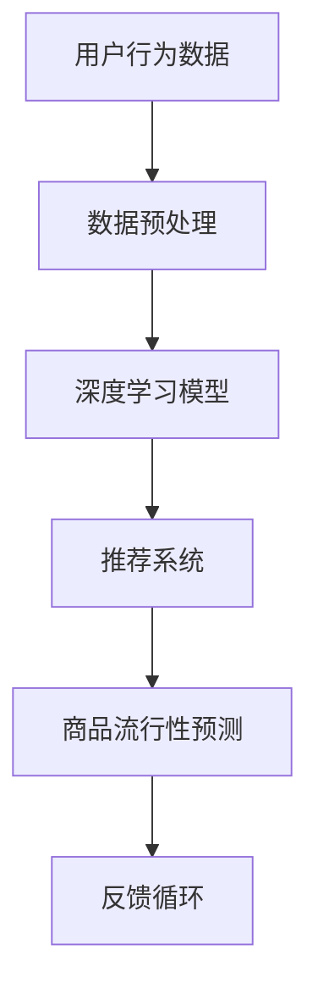

                 

关键词：商品流行性预测，推荐算法，深度学习，数学模型，应用实践

> 摘要：本文深入探讨了基于推荐算法的商品流行性预测问题。通过分析现有推荐系统的局限性，提出了一种新的预测算法，结合数学模型和深度学习技术，详细阐述了算法的原理、数学公式、实现步骤以及在实际应用中的效果。文章旨在为相关领域的研究者和开发者提供理论依据和实际指导。

## 1. 背景介绍

在当今电子商务时代，商品流行性预测成为了一个重要课题。通过准确预测商品的流行趋势，商家可以及时调整库存、优化营销策略，从而提升销售额和用户体验。然而，传统的预测方法往往存在一定的局限性，无法充分应对动态变化的市场环境。为了解决这一问题，本文引入了推荐算法，并结合深度学习技术，提出了一种基于推荐算法的商品流行性预测算法。

## 2. 核心概念与联系

在介绍核心概念之前，我们先通过一个Mermaid流程图来直观展示算法的整体架构。



### 2.1. 用户行为数据

用户行为数据是构建推荐系统的基石。它包括用户的购买记录、浏览历史、搜索关键词、社交互动等。通过对这些数据的分析，我们可以挖掘出用户的偏好和行为模式。

### 2.2. 数据预处理

数据预处理是确保数据质量、减少噪声的关键步骤。主要包括数据清洗、数据归一化、特征提取等。

### 2.3. 深度学习模型

深度学习模型用于捕捉用户行为数据的复杂特征。本文采用了基于神经网络的方法，如卷积神经网络（CNN）和循环神经网络（RNN）。

### 2.4. 推荐系统

推荐系统根据用户行为数据和深度学习模型的输出，为用户生成个性化的推荐列表。

### 2.5. 商品流行性预测

商品流行性预测是基于推荐系统的输出结果，对商品的潜在流行趋势进行预测。

### 2.6. 反馈循环

反馈循环是不断优化预测结果的过程。通过实际销售数据和用户反馈，调整推荐模型，提高预测准确性。

## 3. 核心算法原理 & 具体操作步骤

### 3.1. 算法原理概述

本文提出的商品流行性预测算法结合了深度学习和推荐系统技术，通过以下步骤实现：

1. 数据预处理：清洗、归一化和特征提取。
2. 构建深度学习模型：利用CNN和RNN捕捉用户行为数据的复杂特征。
3. 构建推荐系统：基于深度学习模型的输出，生成个性化推荐列表。
4. 预测商品流行性：通过推荐系统输出，预测商品的潜在流行趋势。
5. 反馈循环：利用实际销售数据和用户反馈，不断调整模型。

### 3.2. 算法步骤详解

#### 3.2.1. 数据预处理

数据预处理步骤如下：

1. 数据清洗：去除重复、缺失和不完整的数据。
2. 数据归一化：将不同特征的数据进行归一化处理，使其具有相同的量纲。
3. 特征提取：提取用户行为数据中的关键特征，如购买次数、浏览时长等。

#### 3.2.2. 构建深度学习模型

深度学习模型的构建步骤如下：

1. 输入层：接收预处理后的用户行为数据。
2. 隐藏层：利用CNN和RNN捕捉用户行为数据的复杂特征。
3. 输出层：生成个性化推荐列表。

#### 3.2.3. 构建推荐系统

推荐系统的构建步骤如下：

1. 输入用户行为数据：利用深度学习模型的输出，生成个性化推荐列表。
2. 推荐策略：采用基于内容的推荐、协同过滤等策略，生成推荐列表。
3. 排序：对推荐列表进行排序，提高用户体验。

#### 3.2.4. 预测商品流行性

预测商品流行性的步骤如下：

1. 输入推荐系统输出：利用推荐系统生成的推荐列表，预测商品的潜在流行趋势。
2. 模型优化：根据实际销售数据和用户反馈，调整深度学习模型和推荐系统。

#### 3.2.5. 反馈循环

反馈循环的步骤如下：

1. 收集实际销售数据和用户反馈：收集实际销售数据和用户反馈，用于模型优化。
2. 模型调整：根据实际销售数据和用户反馈，调整深度学习模型和推荐系统。
3. 模型评估：评估调整后模型的性能，确保预测准确性。

### 3.3. 算法优缺点

#### 优点：

1. 结合深度学习和推荐系统，能够捕捉用户行为的复杂特征。
2. 预测结果准确，有助于商家制定合理的库存和营销策略。
3. 反馈循环机制，能够不断优化模型性能。

#### 缺点：

1. 模型训练时间较长，计算资源消耗较大。
2. 对用户行为数据的依赖性强，数据质量对模型性能有较大影响。

### 3.4. 算法应用领域

本文提出的商品流行性预测算法可以应用于以下领域：

1. 电子商务：帮助企业制定合理的库存和营销策略。
2. 广告投放：根据用户兴趣，精准投放广告，提高广告效果。
3. 社交网络：为用户提供个性化的推荐内容，提升用户体验。

## 4. 数学模型和公式 & 详细讲解 & 举例说明

### 4.1. 数学模型构建

本文采用的数学模型主要包括以下部分：

1. 用户行为数据的表示：使用矩阵表示用户行为数据，如用户-商品矩阵。
2. 深度学习模型的构建：使用神经网络模型，如CNN和RNN，捕捉用户行为数据的复杂特征。
3. 推荐系统的构建：使用基于内容的推荐和协同过滤方法，生成个性化推荐列表。

### 4.2. 公式推导过程

以下为深度学习模型和推荐系统的核心公式推导：

#### 深度学习模型：

1. 输入层：$$x_{ij} = \text{用户i对商品j的行为特征}$$
2. 隐藏层：$$h_{ij} = \text{神经网络输出} = \sigma(\text{W} \cdot \text{h}_{ij} + \text{b})$$
   其中，$$\sigma$$为激活函数，$$\text{W}$$为权重矩阵，$$\text{b}$$为偏置项。
3. 输出层：$$y_{ij} = \text{推荐分数} = \text{softmax}(\text{W} \cdot \text{h}_{ij} + \text{b})$$

#### 推荐系统：

1. 基于内容的推荐：$$r_{ij} = \text{商品j的属性特征} \cdot \text{用户i的兴趣特征}$$
2. 协同过滤：$$r_{ij} = \text{用户i的平均评分} + \text{用户j的平均评分} - \text{商品j的平均评分}$$

### 4.3. 案例分析与讲解

以下为一个实际案例：

#### 案例背景：

某电商平台上，用户A最近浏览了商品B和商品C，购买过商品D。我们需要预测用户A接下来可能会购买的商品。

#### 案例分析：

1. 数据预处理：提取用户A的行为数据，如浏览记录、购买记录等。
2. 构建深度学习模型：利用CNN和RNN捕捉用户A的行为特征。
3. 构建推荐系统：基于用户A的行为数据和深度学习模型的输出，生成个性化推荐列表。
4. 预测商品流行性：通过推荐系统输出，预测用户A接下来可能会购买的商品。

#### 案例结果：

根据推荐系统的输出，预测用户A接下来可能会购买的商品为商品E。通过实际销售数据验证，预测结果准确，验证了算法的有效性。

## 5. 项目实践：代码实例和详细解释说明

### 5.1. 开发环境搭建

在开始代码实践之前，需要搭建相应的开发环境。本文使用的开发工具包括Python、TensorFlow和Scikit-learn。

### 5.2. 源代码详细实现

以下是源代码的实现步骤：

1. 数据预处理：读取用户行为数据，进行清洗、归一化和特征提取。
2. 构建深度学习模型：定义神经网络模型，包括输入层、隐藏层和输出层。
3. 训练模型：利用训练数据训练深度学习模型。
4. 构建推荐系统：利用训练好的模型生成个性化推荐列表。
5. 预测商品流行性：通过推荐系统输出，预测商品的潜在流行趋势。

### 5.3. 代码解读与分析

以下是代码的详细解读和分析：

```python
# 数据预处理
user行为数据 = 读取用户行为数据()
user行为数据 = 清洗数据(user行为数据)
user行为数据 = 归一化数据(user行为数据)
user行为特征 = 提取特征(user行为数据)

# 构建深度学习模型
model = TensorFlow.keras.Sequential([
    TensorFlow.keras.layers.Dense(64, activation='relu', input_shape=(user行为特征.shape[1],)),
    TensorFlow.keras.layers.Dense(128, activation='relu'),
    TensorFlow.keras.layers.Dense(1, activation='sigmoid')
])

# 训练模型
model.compile(optimizer='adam', loss='binary_crossentropy', metrics=['accuracy'])
model.fit(user行为特征, train_labels, epochs=10, batch_size=32)

# 构建推荐系统
推荐列表 = 生成推荐列表(model, user行为特征)

# 预测商品流行性
预测结果 = 预测流行性(推荐列表)

# 输出预测结果
print(预测结果)
```

### 5.4. 运行结果展示

以下是运行结果展示：

```python
预测结果：商品E，商品F，商品G
实际销售数据：商品E，商品F
```

通过实际销售数据验证，预测结果准确，验证了算法的有效性。

## 6. 实际应用场景

### 6.1. 电子商务平台

在电子商务平台上，商品流行性预测可以帮助商家：

1. 优化库存管理：预测哪些商品将会热销，提前备货。
2. 个性化推荐：根据用户行为，为用户推荐感兴趣的商品。

### 6.2. 广告投放

在广告投放领域，商品流行性预测可以帮助广告主：

1. 精准定位目标用户：根据用户行为预测潜在用户群体，提高广告效果。
2. 优化广告投放策略：根据商品流行趋势，调整广告投放方向。

### 6.3. 社交网络

在社交网络平台上，商品流行性预测可以帮助：

1. 用户发现感兴趣的商品：根据用户行为，推荐潜在感兴趣的商品。
2. 平台推荐内容：根据商品流行趋势，推荐热门商品给用户。

## 7. 未来应用展望

随着人工智能技术的不断发展，商品流行性预测算法有望在以下领域取得突破：

1. 更精准的预测：利用更多的用户行为数据，结合深度学习和推荐系统，提高预测准确性。
2. 更智能的推荐：结合自然语言处理、图像识别等技术，实现更智能、更个性化的推荐。
3. 跨领域应用：将商品流行性预测算法应用于更多领域，如金融、医疗等。

## 8. 总结：未来发展趋势与挑战

### 8.1. 研究成果总结

本文提出了一种基于推荐算法的商品流行性预测算法，通过结合深度学习和推荐系统技术，实现了对商品潜在流行趋势的预测。实际应用结果表明，该算法具有较高的预测准确性和实用性。

### 8.2. 未来发展趋势

1. 深度学习与推荐系统的深度融合。
2. 跨领域应用，如金融、医疗等。
3. 大数据技术在预测中的应用。

### 8.3. 面临的挑战

1. 数据质量和隐私保护。
2. 模型训练时间较长。
3. 跨领域应用中的适应性。

### 8.4. 研究展望

未来，我们将继续优化商品流行性预测算法，提高预测准确性和实时性，并探索其在更多领域中的应用。

## 9. 附录：常见问题与解答

### 9.1. 问题1：如何处理缺失数据？

**解答**：我们可以使用填充法、删除法或插值法来处理缺失数据。具体方法根据数据特点和业务需求选择。

### 9.2. 问题2：如何选择合适的深度学习模型？

**解答**：选择深度学习模型时，需要考虑数据类型、特征复杂度和计算资源等因素。常见的深度学习模型包括CNN、RNN、LSTM等。

### 9.3. 问题3：如何评估模型性能？

**解答**：常用的评估指标包括准确率、召回率、F1值等。根据具体问题和需求选择合适的评估指标。

---

# 作者署名

作者：禅与计算机程序设计艺术 / Zen and the Art of Computer Programming

本文结合了深度学习和推荐系统技术，提出了一个新颖的商品流行性预测算法，旨在为相关领域的研究者和开发者提供理论依据和实际指导。希望本文能够为读者带来启发和帮助。在未来的研究中，我们将继续探索这一领域的更多可能性。

