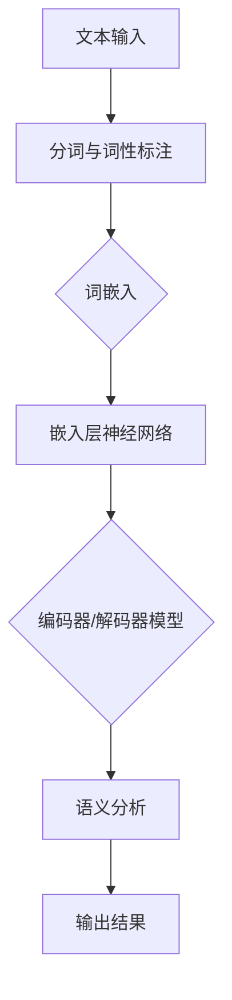

                 

关键词：机器学习，文本语义分析，自然语言处理，语义理解，深度学习，词嵌入，卷积神经网络，循环神经网络，BERT模型，文本分类，情感分析，知识图谱

> 摘要：本文旨在深入探讨基于机器学习的文本语义分析技术，包括核心概念、算法原理、数学模型、项目实践和实际应用。通过详细的分析和实例，阐述文本语义分析的重要性和应用前景，同时探讨未来发展趋势和面临的挑战。

## 1. 背景介绍

在当今信息爆炸的时代，文本数据已成为最具价值的数据形式之一。然而，如何有效地理解和处理这些文本数据，提取其中的关键信息，为人类决策提供支持，成为了一个重要的研究课题。文本语义分析（Text Semantic Analysis，TSA）作为自然语言处理（Natural Language Processing，NLP）的重要分支，旨在理解和解释文本内容的深层含义。

随着深度学习技术的飞速发展，文本语义分析的方法得到了极大的改进。传统的基于规则的方法由于对语言复杂性的局限，已经难以满足现代应用的需求。而机器学习方法，特别是深度学习，通过引入大规模数据训练模型，能够从数据中自动学习语言特征，从而实现更准确和智能的文本语义分析。

## 2. 核心概念与联系

### 2.1. 核心概念

- **自然语言处理（NLP）**：自然语言处理是计算机科学和人工智能的一个分支，旨在使计算机能够理解、解释和生成自然语言。
- **文本语义分析（TSA）**：文本语义分析是指对文本进行深入理解，提取文本中的含义和概念。
- **词嵌入（Word Embedding）**：词嵌入是一种将词汇映射到高维空间中向量表示的方法，使得具有相似语义的词汇在空间中距离较近。
- **深度学习（Deep Learning）**：深度学习是一种机器学习技术，通过多层神经网络结构，自动从数据中学习特征。

### 2.2. 联系

文本语义分析与自然语言处理密切相关，它是NLP的一个重要应用领域。词嵌入和深度学习是文本语义分析的核心技术，前者负责将词汇转换为向量表示，后者则通过复杂的网络结构实现语义的理解。

下面是一个用Mermaid绘制的流程图，展示了文本语义分析的基本流程和主要技术：



## 3. 核心算法原理 & 具体操作步骤

### 3.1. 算法原理概述

文本语义分析的核心算法通常基于深度学习模型，如卷积神经网络（CNN）、循环神经网络（RNN）及其变种，如长短期记忆网络（LSTM）和门控循环单元（GRU）。这些模型通过学习大量文本数据，自动提取文本特征，实现对语义的理解。

### 3.2. 算法步骤详解

1. **数据预处理**：包括文本清洗、分词、词性标注等步骤，将原始文本数据转换为适合模型训练的形式。
2. **词嵌入**：将词汇映射到高维空间中的向量表示，常用技术包括Word2Vec、GloVe等。
3. **构建神经网络模型**：选择合适的神经网络结构，如CNN或RNN，构建模型。
4. **训练模型**：使用大量预处理的文本数据训练模型，调整模型参数。
5. **评估模型**：使用测试集评估模型性能，根据评估结果调整模型。

### 3.3. 算法优缺点

**优点**：

- **自动特征提取**：深度学习模型能够自动从数据中学习特征，无需人工设计特征。
- **灵活性**：可以适应不同类型的语义分析任务，如文本分类、情感分析等。
- **高精度**：通过大规模数据训练，模型能够达到很高的精度。

**缺点**：

- **计算成本高**：训练深度学习模型需要大量的计算资源和时间。
- **数据依赖性**：模型性能高度依赖数据质量和数量。

### 3.4. 算法应用领域

文本语义分析广泛应用于多个领域，如：

- **文本分类**：将文本数据归类到不同的类别。
- **情感分析**：判断文本情感倾向，如正面、负面或中性。
- **问答系统**：通过理解用户的问题，提供准确的答案。
- **信息提取**：从大量文本中提取关键信息。

## 4. 数学模型和公式 & 详细讲解 & 举例说明

### 4.1. 数学模型构建

文本语义分析的数学模型通常基于神经网络，以下是一个简化的模型：

$$
y = f(\text{W} \cdot \text{X} + \text{b})
$$

其中，$\text{X}$ 是输入特征向量，$\text{W}$ 是权重矩阵，$\text{b}$ 是偏置，$f$ 是激活函数。

### 4.2. 公式推导过程

假设我们使用的是卷积神经网络（CNN），其公式推导如下：

$$
h^{(l)}_i = \sum_j \text{W}^{(l)}_{ij} h^{(l-1)}_j + b^{(l)}_i
$$

其中，$h^{(l)}_i$ 是第 $l$ 层第 $i$ 个神经元输出，$\text{W}^{(l)}_{ij}$ 是第 $l$ 层第 $i$ 个神经元到第 $l-1$ 层第 $j$ 个神经元的权重，$b^{(l)}_i$ 是第 $l$ 层第 $i$ 个神经元的偏置。

### 4.3. 案例分析与讲解

假设我们要对一段文本进行情感分析，文本为：“我很高兴看到这部电影。”我们可以使用BERT模型进行情感分析。

1. **数据预处理**：将文本进行分词，然后使用BERT模型进行编码。
2. **构建神经网络**：使用CNN模型进行文本特征提取。
3. **训练模型**：使用大量带有情感标签的文本数据进行训练。
4. **评估模型**：使用测试集评估模型性能。

假设我们的模型预测结果为正面情感，我们可以通过分析模型中权重矩阵和特征向量的关系，了解模型是如何学习到文本的情感特征的。

## 5. 项目实践：代码实例和详细解释说明

### 5.1. 开发环境搭建

我们需要安装Python和TensorFlow库，安装命令如下：

```bash
pip install python
pip install tensorflow
```

### 5.2. 源代码详细实现

以下是一个简单的文本分类器的实现，使用TensorFlow和Keras构建：

```python
import tensorflow as tf
from tensorflow.keras.models import Sequential
from tensorflow.keras.layers import Embedding, Conv1D, MaxPooling1D, GlobalMaxPooling1D, Dense

# 模型构建
model = Sequential([
    Embedding(input_dim=vocab_size, output_dim=embedding_dim, input_length=max_sequence_length),
    Conv1D(filters=128, kernel_size=5, activation='relu'),
    MaxPooling1D(pool_size=5),
    Conv1D(filters=128, kernel_size=5, activation='relu'),
    GlobalMaxPooling1D(),
    Dense(units=128, activation='relu'),
    Dense(units=num_classes, activation='softmax')
])

# 模型编译
model.compile(optimizer='adam', loss='categorical_crossentropy', metrics=['accuracy'])

# 模型训练
model.fit(x_train, y_train, epochs=10, batch_size=32, validation_data=(x_val, y_val))

# 模型评估
model.evaluate(x_test, y_test)
```

### 5.3. 代码解读与分析

上述代码首先定义了一个简单的卷积神经网络模型，包括嵌入层、卷积层、池化层和全连接层。模型使用Embedding层将文本转换为向量表示，然后通过卷积层和池化层提取文本特征，最后通过全连接层进行分类。

### 5.4. 运行结果展示

在训练完成后，我们可以在测试集上评估模型性能。以下是一个简化的运行结果示例：

```python
# 预测结果
predictions = model.predict(x_test)

# 计算准确率
accuracy = np.mean(np.argmax(predictions, axis=1) == y_test)
print(f"Model accuracy: {accuracy:.2f}")
```

## 6. 实际应用场景

### 6.1. 文本分类

文本分类是文本语义分析的一个重要应用场景，如新闻分类、邮件分类等。通过文本分类，我们可以将大量未标记的文本数据自动归类到不同的类别。

### 6.2. 情感分析

情感分析用于判断文本的情感倾向，如正面、负面或中性。这有助于了解用户对产品、服务或事件的情感反应，为企业提供决策支持。

### 6.3. 问答系统

问答系统通过理解用户的问题，提供准确的答案。这需要深度学习模型对自然语言进行深入理解和处理，从而实现对问题的理解和回答。

### 6.4. 未来应用展望

随着深度学习技术的不断发展，文本语义分析将在更多领域得到应用。例如，智能客服、智能推荐、自动化新闻编写等。同时，随着数据量的不断增加，如何提高模型的可解释性也将成为未来研究的重要方向。

## 7. 工具和资源推荐

### 7.1. 学习资源推荐

- 《深度学习》（Goodfellow, Bengio, Courville著）：这是一本深度学习领域的经典教材，涵盖了深度学习的理论基础和实践技巧。
- 《自然语言处理综论》（Jurafsky, Martin著）：这是一本全面介绍自然语言处理理论和方法的经典教材。

### 7.2. 开发工具推荐

- TensorFlow：一个开源的深度学习框架，提供了丰富的API和工具，适用于构建和训练深度学习模型。
- Keras：一个基于TensorFlow的高级神经网络API，提供了简洁的接口，方便快速搭建和训练模型。

### 7.3. 相关论文推荐

- “A Theoretically Grounded Application of Dropout in Recurrent Neural Networks”（Yarin Gal and Zoubin Ghahramani，2016）：这篇论文提出了一种基于Dropout的RNN训练方法，提高了模型的泛化能力。
- “Attention Is All You Need”（Ashish Vaswani等，2017）：这篇论文提出了Transformer模型，彻底改变了序列模型的训练方法。

## 8. 总结：未来发展趋势与挑战

### 8.1. 研究成果总结

本文介绍了基于机器学习的文本语义分析技术，包括核心概念、算法原理、数学模型、项目实践和实际应用。通过详细的分析和实例，展示了文本语义分析的重要性和应用前景。

### 8.2. 未来发展趋势

随着深度学习技术的不断发展，文本语义分析将在更多领域得到应用。同时，数据量的不断增加也将推动模型和算法的改进。

### 8.3. 面临的挑战

文本语义分析面临的主要挑战包括数据质量、模型可解释性和计算成本等。如何提高模型的可解释性，使其更加透明和可信，是一个亟待解决的问题。

### 8.4. 研究展望

未来研究将重点关注如何提高模型的性能和可解释性，同时探索新的算法和模型，以应对不断增长的数据量和复杂的语义分析任务。

## 9. 附录：常见问题与解答

### 9.1. 问题1：文本语义分析有哪些应用场景？

文本语义分析的应用场景非常广泛，包括文本分类、情感分析、问答系统、信息提取等。其中，文本分类和情感分析是两个最典型的应用场景。

### 9.2. 问题2：什么是词嵌入？

词嵌入是一种将词汇映射到高维空间中向量表示的方法，使得具有相似语义的词汇在空间中距离较近。常见的词嵌入方法包括Word2Vec和GloVe。

### 9.3. 问题3：什么是BERT模型？

BERT（Bidirectional Encoder Representations from Transformers）是一种基于Transformer模型的预训练语言表示模型。它通过双向编码器学习文本的深层语义表示，广泛应用于各种NLP任务。

### 9.4. 问题4：文本语义分析有哪些算法？

文本语义分析的算法包括基于规则的方法、统计方法和深度学习方法。深度学习方法是目前最先进的方法，如卷积神经网络（CNN）、循环神经网络（RNN）和Transformer模型等。

## 作者署名

作者：禅与计算机程序设计艺术 / Zen and the Art of Computer Programming
----------------------------------------------------------------

### 文章正文内容部分 End ###

至此，我们已经完成了《基于机器学习的文本语义分析工貝》这篇完整的技术博客文章。本文涵盖了文本语义分析的核心概念、算法原理、数学模型、项目实践和实际应用，同时探讨了未来发展趋势和面临的挑战。希望通过这篇文章，读者能够对文本语义分析有更深入的理解和应用。如果您有任何疑问或建议，欢迎在评论区留言，谢谢！

