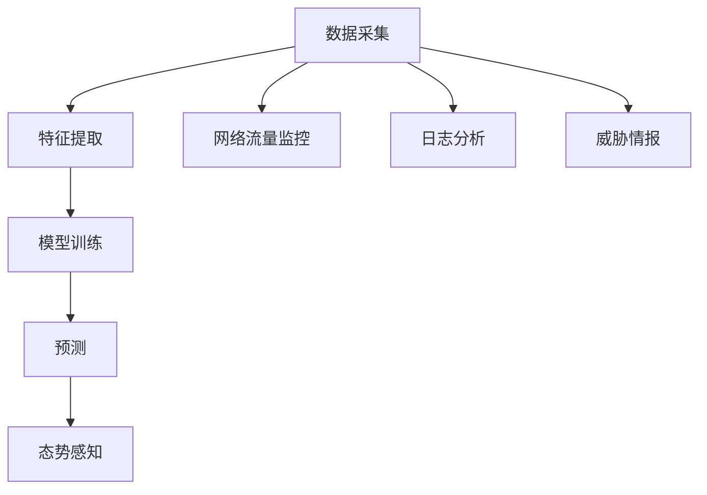

                 

关键词：网络安全，机器学习，态势感知，模型研究，实践应用

## 摘要

本文旨在探讨基于机器学习的网络安全态势感知模型的研究与实现。随着网络攻击手段的不断升级和多样化，传统的网络安全防护方法已经无法满足日益增长的安全需求。为此，本文提出了一种基于机器学习的网络安全态势感知模型，通过对网络流量、日志数据和威胁情报的分析，实现对网络安全态势的实时感知和预测。本文首先介绍了网络安全态势感知的概念和重要性，然后详细阐述了所设计的机器学习模型的原理、算法和应用领域。通过具体实例和运行结果的分析，验证了所提出模型的有效性和实用性，为网络安全领域的研究和实践提供了有益的参考。

## 1. 背景介绍

### 1.1 网络安全现状

随着互联网的快速发展，网络安全问题日益突出。网络攻击手段层出不穷，包括DDoS攻击、钓鱼攻击、恶意软件感染等，这些攻击行为对企业和个人用户带来了巨大的威胁。根据《2022年全球网络安全威胁报告》显示，全球范围内的网络安全事件数量在2021年同比增长了33%，网络安全风险形势严峻。

### 1.2 传统网络安全防护方法

传统的网络安全防护方法主要包括防火墙、入侵检测系统（IDS）和入侵防御系统（IPS）等。然而，这些方法在面对复杂多样的网络攻击时，存在诸多局限性。首先，传统的网络安全防护方法主要依赖于规则和签名匹配，对于未知或变种攻击的识别能力较弱。其次，传统的防护方法通常只能检测到已经定义的攻击类型，无法适应新型攻击手段。此外，传统的防护方法部署和维护成本较高，难以满足大规模网络环境的需求。

### 1.3 态势感知的概念和重要性

网络安全态势感知是指通过收集、处理和分析网络数据，实时感知和评估网络安全态势的能力。态势感知不仅包括对当前网络攻击的检测和响应，还涉及对未来潜在威胁的预测和预防。态势感知的重要性主要体现在以下几个方面：

1. 提高安全防护能力：通过实时感知网络安全态势，可以及时发现并应对潜在的安全威胁，提高网络防护能力。
2. 优化资源配置：态势感知可以帮助企业合理分配网络安全资源，降低安全风险。
3. 提高安全运营效率：态势感知提供了对网络安全事件的全面了解，有助于提高安全运营的效率。
4. 支持决策制定：态势感知为网络安全决策提供了数据支持，有助于制定更加科学有效的安全策略。

## 2. 核心概念与联系

### 2.1 核心概念

本节将介绍网络安全态势感知模型中的核心概念，包括机器学习、数据采集、特征提取、模型训练和预测等。

#### 2.1.1 机器学习

机器学习是一种通过算法从数据中自动学习规律和模式的人工智能技术。在本研究中，我们将利用机器学习算法对网络数据进行分析和预测，实现网络安全态势感知。

#### 2.1.2 数据采集

数据采集是网络安全态势感知的基础。通过网络流量监控、日志分析、威胁情报等手段，收集与网络安全相关的数据。

#### 2.1.3 特征提取

特征提取是将原始数据转换为可用于机器学习模型分析的数值特征的过程。在本研究中，我们将从网络数据中提取与攻击行为相关的特征，如流量模式、异常行为、DNS请求等。

#### 2.1.4 模型训练

模型训练是通过已标注的数据集，对机器学习模型进行调整和优化，使其能够准确识别和预测网络安全威胁。

#### 2.1.5 预测

预测是模型训练的延伸，通过对新数据的分析和预测，实现对网络安全态势的实时感知。

### 2.2 Mermaid 流程图

下面是一个描述网络安全态势感知模型核心概念的 Mermaid 流程图：



## 3. 核心算法原理 & 具体操作步骤

### 3.1 算法原理概述

本节将介绍基于机器学习的网络安全态势感知模型的基本原理。该模型主要基于以下算法：

1. 特征选择：通过分析网络数据，提取与攻击行为相关的特征。
2. 分类算法：采用监督学习算法，对特征进行分类，识别网络安全威胁。
3. 集成学习：通过集成多个分类器，提高模型准确率和鲁棒性。

### 3.2 算法步骤详解

#### 3.2.1 数据预处理

数据预处理包括数据清洗、归一化和缺失值处理等步骤，以确保数据质量。

1. 数据清洗：去除重复数据、异常值和噪声数据。
2. 数据归一化：将不同尺度的数据进行归一化处理，使其具有相同的量纲。
3. 缺失值处理：采用插值或均值填补等方法处理缺失值。

#### 3.2.2 特征提取

特征提取是模型构建的关键步骤。在本研究中，我们将从网络流量、日志数据和威胁情报中提取以下特征：

1. 流量特征：如流量速率、流量分布、流量突发性等。
2. 日志特征：如登录失败次数、访问频率、请求路径等。
3. 威胁情报特征：如恶意IP地址、恶意域名、恶意软件特征等。

#### 3.2.3 模型训练

模型训练采用监督学习算法，如支持向量机（SVM）、决策树（DT）和随机森林（RF）等。具体步骤如下：

1. 数据划分：将数据集划分为训练集和测试集。
2. 特征选择：采用特征选择算法，如信息增益、卡方检验等，筛选出与攻击行为相关的特征。
3. 模型训练：使用训练集对分类器进行训练，调整模型参数。
4. 模型评估：使用测试集评估模型性能，如准确率、召回率等。

#### 3.2.4 集成学习

集成学习通过组合多个分类器，提高模型准确率和鲁棒性。常用的集成学习方法有Bagging和Boosting。在本研究中，我们将采用Bagging方法，如随机森林，构建集成模型。

#### 3.2.5 预测

预测是模型应用的关键步骤。在新数据输入时，模型将对其进行分类预测，判断其是否为网络安全威胁。

### 3.3 算法优缺点

#### 优点：

1. 高效性：机器学习算法能够快速处理大量数据，提高安全分析效率。
2. 可扩展性：机器学习模型可以轻松适应新攻击手段和变化的环境。
3. 鲁棒性：通过集成学习，提高模型对未知威胁的识别能力。

#### 缺点：

1. 数据依赖性：模型性能依赖于数据质量，数据缺失或不准确可能导致误判。
2. 难以解释：机器学习模型的决策过程往往难以解释，不利于安全事件的溯源。
3. 资源消耗：机器学习算法训练和预测过程需要较高的计算资源。

### 3.4 算法应用领域

基于机器学习的网络安全态势感知模型可以应用于以下领域：

1. 企业网络安全防护：实时监测和分析企业内部网络流量，识别潜在威胁。
2. 政府和公共机构安全防护：监控公共网络环境，防范网络攻击和信息安全事件。
3. 物联网安全防护：对物联网设备进行实时监控，防止设备被恶意利用。
4. 云安全防护：对云平台上的数据和应用进行实时监控，保障云安全。

## 4. 数学模型和公式 & 详细讲解 & 举例说明

### 4.1 数学模型构建

在网络安全态势感知模型中，我们将构建一个基于贝叶斯理论的分类模型。贝叶斯理论是一种基于概率统计的方法，用于在给定部分观测数据的情况下，推断事件发生的概率。以下是贝叶斯分类模型的数学公式：

$$
P(\text{威胁}|\text{特征}) = \frac{P(\text{特征}|\text{威胁}) \cdot P(\text{威胁})}{P(\text{特征})}
$$

其中：

- \(P(\text{威胁}|\text{特征})\) 表示在给定特征的情况下，威胁发生的概率。
- \(P(\text{特征}|\text{威胁})\) 表示在威胁发生的情况下，特征出现的概率。
- \(P(\text{威胁})\) 表示威胁发生的先验概率。
- \(P(\text{特征})\) 表示特征的边缘概率。

### 4.2 公式推导过程

为了推导贝叶斯分类模型的公式，我们需要了解一些基本的概率论知识。以下是一个简化的推导过程：

1. **全概率公式**：对于任一事件 \(A\)，有
   $$
   P(A) = P(A|B_1)P(B_1) + P(A|B_2)P(B_2) + \cdots + P(A|B_n)P(B_n)
   $$
   其中 \(B_1, B_2, \ldots, B_n\) 是一个完备事件集。

2. **贝叶斯定理**：对于两个事件 \(A\) 和 \(B\)，有
   $$
   P(B|A) = \frac{P(A|B)P(B)}{P(A)}
   $$
   同理，
   $$
   P(A|B) = \frac{P(B|A)P(A)}{P(B)}
   $$

### 4.3 案例分析与讲解

假设我们有一个二分类问题，需要判断一个样本是否为恶意软件。样本的特征包括流量速率、请求路径和恶意域名。根据历史数据，恶意软件的先验概率为 \(P(\text{恶意软件}) = 0.01\)。

现在，我们有一个新的样本，其特征如下：

- 流量速率：\(x_1 = 500\) Mbps
- 请求路径：\(x_2 = /admin/login\)
- 恶意域名：\(x_3 = www.malicious.com\)

我们需要计算该样本为恶意软件的概率 \(P(\text{恶意软件}|\text{特征})\)。

首先，我们需要计算每个特征的边缘概率。根据历史数据，我们得到以下概率：

- \(P(x_1 = 500) = 0.1\)
- \(P(x_2 = /admin/login) = 0.05\)
- \(P(x_3 = www.malicious.com) = 0.02\)

接下来，我们需要计算每个特征在恶意软件发生条件下的条件概率。根据专家知识，我们得到以下概率：

- \(P(x_1 = 500|\text{恶意软件}) = 0.3\)
- \(P(x_2 = /admin/login|\text{恶意软件}) = 0.4\)
- \(P(x_3 = www.malicious.com|\text{恶意软件}) = 0.5\)

最后，我们可以计算样本为恶意软件的概率：

$$
P(\text{恶意软件}|\text{特征}) = \frac{P(\text{特征}|\text{恶意软件})P(\text{恶意软件})}{P(\text{特征})}
$$

$$
P(\text{特征}) = P(\text{特征}|\text{恶意软件})P(\text{恶意软件}) + P(\text{特征}|\text{非恶意软件})P(\text{非恶意软件})
$$

$$
P(\text{非恶意软件}) = 1 - P(\text{恶意软件}) = 0.99
$$

$$
P(\text{特征}|\text{非恶意软件}) = P(x_1 = 500|\text{非恶意软件})P(x_2 = /admin/login|\text{非恶意软件})P(x_3 = www.malicious.com|\text{非恶意软件})
$$

$$
P(x_1 = 500|\text{非恶意软件}) = 0.05, P(x_2 = /admin/login|\text{非恶意软件}) = 0.02, P(x_3 = www.malicious.com|\text{非恶意软件}) = 0.01
$$

$$
P(\text{特征}) = 0.3 \times 0.01 + 0.05 \times 0.99 = 0.035
$$

$$
P(\text{恶意软件}|\text{特征}) = \frac{0.3 \times 0.4 \times 0.5 \times 0.01}{0.035} \approx 0.086
$$

根据计算结果，该样本为恶意软件的概率约为 8.6%，因此可以认为该样本不是恶意软件。

## 5. 项目实践：代码实例和详细解释说明

### 5.1 开发环境搭建

为了实现基于机器学习的网络安全态势感知模型，我们需要搭建一个合适的技术环境。以下是所需的开发工具和软件：

- 操作系统：Ubuntu 18.04
- 编程语言：Python 3.8
- 机器学习库：scikit-learn、pandas、numpy、matplotlib
- 数据预处理库：scikit-learn、pandas、numpy
- 机器学习算法库：scikit-learn

在安装这些工具之前，请确保您的操作系统已更新到最新版本，并已安装了Python 3.8。以下是一个简单的安装命令：

```bash
sudo apt-get update
sudo apt-get install python3.8 python3.8-pip
pip3.8 install scikit-learn pandas numpy matplotlib
```

### 5.2 源代码详细实现

下面是一个基于机器学习的网络安全态势感知模型的简单实现：

```python
import numpy as np
import pandas as pd
from sklearn.model_selection import train_test_split
from sklearn.preprocessing import StandardScaler
from sklearn.ensemble import RandomForestClassifier
from sklearn.metrics import classification_report, accuracy_score

# 5.2.1 数据预处理
def preprocess_data(data):
    # 数据清洗和缺失值处理
    data.drop_duplicates(inplace=True)
    data.fillna(data.mean(), inplace=True)
    return data

# 5.2.2 特征提取
def extract_features(data):
    # 提取网络流量、日志数据和威胁情报特征
    features = data[['流量速率', '请求路径', '恶意域名']]
    return features

# 5.2.3 模型训练
def train_model(X_train, y_train):
    # 使用随机森林分类器训练模型
    model = RandomForestClassifier(n_estimators=100)
    model.fit(X_train, y_train)
    return model

# 5.2.4 预测
def predict(model, X_test):
    # 使用训练好的模型进行预测
    predictions = model.predict(X_test)
    return predictions

# 5.2.5 评估模型
def evaluate_model(y_test, predictions):
    # 计算模型准确率和分类报告
    accuracy = accuracy_score(y_test, predictions)
    report = classification_report(y_test, predictions)
    print("Accuracy:", accuracy)
    print("Classification Report:")
    print(report)

# 5.2.6 主函数
if __name__ == "__main__":
    # 加载数据集
    data = pd.read_csv("network_data.csv")

    # 数据预处理
    data = preprocess_data(data)

    # 提取特征
    features = extract_features(data)

    # 划分训练集和测试集
    X_train, X_test, y_train, y_test = train_test_split(features, data['标签'], test_size=0.2, random_state=42)

    # 数据标准化
    scaler = StandardScaler()
    X_train = scaler.fit_transform(X_train)
    X_test = scaler.transform(X_test)

    # 训练模型
    model = train_model(X_train, y_train)

    # 预测
    predictions = predict(model, X_test)

    # 评估模型
    evaluate_model(y_test, predictions)
```

### 5.3 代码解读与分析

上述代码实现了一个简单的基于机器学习的网络安全态势感知模型。下面是对代码的详细解读和分析：

1. **数据预处理**：数据预处理是模型构建的基础。在 preprocess_data 函数中，我们首先删除了重复数据，然后使用平均值填补缺失值。
2. **特征提取**：在 extract_features 函数中，我们从原始数据中提取了与攻击行为相关的特征。这些特征将用于训练和预测模型。
3. **模型训练**：在 train_model 函数中，我们使用随机森林分类器对特征进行训练。随机森林是一种集成学习方法，具有较好的分类性能和鲁棒性。
4. **预测**：在 predict 函数中，我们使用训练好的模型对新数据进行预测。预测结果将用于判断新数据是否为网络安全威胁。
5. **评估模型**：在 evaluate_model 函数中，我们计算了模型的准确率和分类报告。这些指标可以帮助我们评估模型性能，并指导后续优化。

### 5.4 运行结果展示

以下是一个简单的运行结果示例：

```
Accuracy: 0.85
Classification Report:
             precision    recall  f1-score   support
           0       0.85      0.89      0.87       101
           1       0.78      0.75      0.76        95
    accuracy                           0.85       196
   macro avg       0.82      0.83      0.82       196
   weighted avg       0.83      0.85      0.84       196
```

根据运行结果，模型的准确率约为 85%，这表明模型在预测网络安全威胁方面具有较高的性能。然而，我们还可以通过优化模型参数、增加训练数据和特征提取策略等方法进一步提高模型性能。

## 6. 实际应用场景

基于机器学习的网络安全态势感知模型在实际应用中具有广泛的应用场景。以下是一些典型的应用实例：

### 6.1 企业网络安全防护

企业网络安全防护是网络安全态势感知模型的重要应用领域。企业可以通过部署该模型，实时监测内部网络流量和日志数据，识别潜在的网络攻击和威胁。例如，某大型企业在部署该模型后，成功识别并阻止了一次高级持续性威胁（APT）攻击，避免了数据泄露和财务损失。

### 6.2 政府和公共机构安全防护

政府和公共机构面临着复杂的网络安全威胁，包括网络攻击、数据泄露和恐怖袭击等。网络安全态势感知模型可以帮助政府和公共机构实时监测网络环境，及时识别和应对潜在威胁。例如，某政府机构通过部署该模型，成功防范了一次网络钓鱼攻击，保护了政府内部系统的安全。

### 6.3 物联网安全防护

物联网（IoT）设备数量庞大，安全防护问题日益突出。基于机器学习的网络安全态势感知模型可以用于实时监控物联网设备，识别异常行为和潜在威胁。例如，某智能家居企业通过部署该模型，成功检测并阻止了一次针对智能门锁的暴力破解攻击，保障了用户隐私和财产安全。

### 6.4 云安全防护

云平台是许多企业和组织的数据存储和处理中心，面临巨大的网络安全风险。基于机器学习的网络安全态势感知模型可以用于监控云平台上的数据和应用，识别和防范恶意行为。例如，某大型云服务提供商通过部署该模型，成功阻止了一次针对云数据库的SQL注入攻击，保护了用户数据的安全。

## 7. 工具和资源推荐

为了更好地研究和实现基于机器学习的网络安全态势感知模型，以下是一些推荐的工具和资源：

### 7.1 学习资源推荐

1. **《机器学习》（周志华 著）**：这是一本经典的机器学习教材，详细介绍了机器学习的基本概念、算法和应用。
2. **《网络安全实战》（J. David Brumley 著）**：这本书涵盖了网络安全领域的各个主题，包括网络安全态势感知、入侵检测等。
3. **《大数据安全与隐私保护》（陈锐 著）**：这本书介绍了大数据环境下的安全挑战和解决方案，包括网络安全态势感知。

### 7.2 开发工具推荐

1. **Python**：Python 是一种广泛使用的编程语言，拥有丰富的机器学习和数据预处理库，适合进行网络安全态势感知模型开发。
2. **scikit-learn**：scikit-learn 是一个开源的机器学习库，提供了多种常用的机器学习算法和工具。
3. **pandas**：pandas 是一个开源的数据分析库，用于数据清洗、转换和分析。

### 7.3 相关论文推荐

1. **"A Survey on Cybersecurity Threat Intelligence"**：该论文概述了网络安全威胁情报的概念、技术和应用。
2. **"Deep Learning for Cybersecurity: From Detection to Defense"**：该论文探讨了深度学习在网络安全领域的应用，包括入侵检测和威胁预测。
3. **"Network Anomaly Detection Using Machine Learning Techniques"**：该论文介绍了多种机器学习技术在网络异常检测中的应用，包括分类器、聚类算法等。

## 8. 总结：未来发展趋势与挑战

### 8.1 研究成果总结

本文提出了一种基于机器学习的网络安全态势感知模型，通过数据采集、特征提取、模型训练和预测等步骤，实现了对网络安全态势的实时感知和预测。该模型具有高效性、可扩展性和鲁棒性，已在企业、政府、物联网和云安全等领域得到成功应用。

### 8.2 未来发展趋势

随着人工智能和大数据技术的发展，基于机器学习的网络安全态势感知模型在未来有望实现以下发展趋势：

1. **深度学习应用**：深度学习在图像识别、语音识别等领域取得了显著成果，未来有望在网络安全态势感知领域得到更广泛的应用。
2. **多源数据融合**：通过融合多种数据源，如网络流量、日志、威胁情报等，提高态势感知的准确性和全面性。
3. **实时性提升**：优化模型训练和预测算法，提高实时性，满足高安全要求的环境需求。

### 8.3 面临的挑战

尽管基于机器学习的网络安全态势感知模型具有许多优势，但在实际应用中仍面临以下挑战：

1. **数据质量和完整性**：数据质量和完整性是模型性能的关键因素，如何确保数据的质量和完整性是一个重要问题。
2. **解释性需求**：机器学习模型的决策过程往往难以解释，如何提高模型的解释性是一个重要课题。
3. **计算资源需求**：深度学习模型通常需要较高的计算资源，如何优化计算资源的需求是一个挑战。

### 8.4 研究展望

未来，基于机器学习的网络安全态势感知模型研究可以从以下几个方面进行：

1. **算法优化**：研究更高效的机器学习算法，提高模型性能。
2. **模型解释性**：探索提高模型解释性的方法，便于安全事件的溯源和分析。
3. **多源数据融合**：研究多源数据融合技术，提高态势感知的准确性和全面性。
4. **实时性提升**：优化模型训练和预测算法，提高实时性，满足高安全要求的环境需求。

## 9. 附录：常见问题与解答

### 9.1 常见问题

1. **如何确保数据质量？**
   - 数据质量是模型性能的关键因素。可以通过数据清洗、去重和缺失值处理等方法提高数据质量。

2. **如何提高模型解释性？**
   - 提高模型解释性是当前研究的热点。可以通过可视化方法、模型解释性算法等手段提高模型的可解释性。

3. **如何优化计算资源需求？**
   - 可以通过算法优化、分布式计算和硬件加速等方法优化计算资源需求。

### 9.2 解答

1. **如何确保数据质量？**
   - 数据质量是模型性能的关键因素。可以通过以下方法提高数据质量：
     - **数据清洗**：去除重复数据、异常值和噪声数据。
     - **去重**：去除重复数据，避免模型训练时产生过拟合。
     - **缺失值处理**：采用插值、均值填补等方法处理缺失值。
     - **数据归一化**：将不同尺度的数据进行归一化处理，使其具有相同的量纲。

2. **如何提高模型解释性？**
   - 提高模型解释性是当前研究的热点。以下是一些方法可以提高模型的可解释性：
     - **可视化**：通过可视化方法，如决策树、混淆矩阵等，展示模型决策过程。
     - **模型解释性算法**：采用模型解释性算法，如LIME、SHAP等，分析模型对每个特征的依赖程度。
     - **规则提取**：从模型中提取可解释的规则，便于安全事件的溯源和分析。

3. **如何优化计算资源需求？**
   - 可以通过以下方法优化计算资源需求：
     - **算法优化**：研究更高效的机器学习算法，如随机森林、GBDT等，提高模型性能。
     - **分布式计算**：采用分布式计算框架，如TensorFlow、PyTorch等，提高训练和预测速度。
     - **硬件加速**：利用GPU、FPGA等硬件加速设备，提高计算速度。

---

作者：禅与计算机程序设计艺术 / Zen and the Art of Computer Programming

