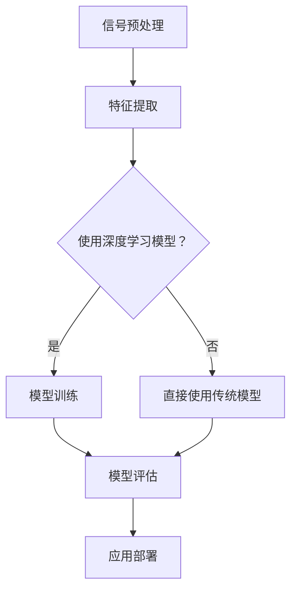

                 

关键词：深度学习、声纹识别、语音处理、人工智能

## 摘要

声纹识别作为一种生物识别技术，近年来在安全认证和身份验证领域取得了显著进展。随着深度学习技术的快速发展，声纹识别在准确度、效率和实用性方面得到了极大提升。本文将详细介绍基于深度学习的声纹识别技术，从背景介绍、核心算法原理、数学模型构建、项目实践、实际应用场景以及未来发展趋势等方面展开，旨在为读者提供全面深入的理解和认识。

## 1. 背景介绍

### 声纹识别的起源与发展

声纹识别技术最早可以追溯到20世纪50年代，当时的语音识别技术尚处于起步阶段。随着计算机技术和信号处理的不断发展，声纹识别逐渐成为一项重要的生物识别技术。早期的声纹识别主要依靠人工特征提取和传统的机器学习方法，如隐马尔可夫模型（HMM）和支持向量机（SVM）等。然而，这些方法在处理复杂语音信号方面存在一定的局限性。

### 深度学习对声纹识别的影响

深度学习技术的引入为声纹识别带来了革命性的变化。深度神经网络（DNN）通过多层非线性变换，能够自动提取语音信号中的复杂特征，显著提高了声纹识别的准确度。此外，卷积神经网络（CNN）和循环神经网络（RNN）等深度学习模型在处理时序数据方面具有显著优势，使得声纹识别在处理连续语音信号时表现出色。

### 声纹识别的应用领域

声纹识别技术在多个领域取得了广泛应用，包括但不限于以下方面：

1. **安全认证**：声纹识别可以作为生物识别技术的一部分，用于手机解锁、门禁系统、银行取款等安全认证场景。
2. **身份验证**：声纹识别可用于电话银行、在线交易等身份验证场景，提高交易的安全性。
3. **语音助手**：智能语音助手如Siri、Alexa等可以利用声纹识别技术实现个性化服务，识别并回应特定用户的声音。
4. **医学诊断**：声纹识别技术可以用于分析病人的语音变化，辅助诊断某些疾病。

## 2. 核心概念与联系

### 声音信号的基本概念

声音信号是声纹识别的基础。声音信号可以看作是一系列连续的振动，通过空气传播到我们的耳朵。声纹识别主要关注以下几个方面：

1. **音高（Pitch）**：音高是指声音的频率。不同的声音具有不同的音高，这是区分不同声音的重要特征。
2. **音色（Timbre）**：音色是指声音的质地和色彩。不同的声音具有不同的音色，这是区分不同声源的重要特征。
3. **时长（Duration）**：时长是指声音的持续时长。不同的声音具有不同的时长，这是区分连续声音片段的重要特征。

### 深度学习的基本概念

深度学习是一种基于多层神经网络的学习方法，通过模拟人脑神经网络的结构和功能来实现对复杂数据的学习和预测。在声纹识别中，深度学习主要用于特征提取和分类。

1. **卷积神经网络（CNN）**：CNN是一种适用于图像和时序数据处理的深度学习模型，通过卷积操作自动提取图像或语音信号中的局部特征。
2. **循环神经网络（RNN）**：RNN是一种适用于时序数据处理的深度学习模型，通过循环机制处理连续的语音信号，提取时间序列特征。
3. **长短时记忆网络（LSTM）**：LSTM是RNN的一种变体，通过引入门控机制解决了传统RNN的梯度消失和梯度爆炸问题，在处理长序列数据时表现出色。

### 声纹识别的系统架构

声纹识别系统通常包括以下几个关键组件：

1. **信号预处理**：对采集到的语音信号进行预处理，包括去噪、归一化、增强等操作，以提高识别的准确性。
2. **特征提取**：利用深度学习模型从预处理后的语音信号中提取特征，包括频谱特征、倒谱特征等。
3. **模型训练**：使用提取到的特征对深度学习模型进行训练，以实现声纹识别。
4. **模型评估**：通过测试数据对训练好的模型进行评估，以评估模型的性能。
5. **应用部署**：将训练好的模型部署到实际应用中，如手机解锁、门禁系统等。

### Mermaid 流程图

以下是声纹识别系统的 Mermaid 流程图：



## 3. 核心算法原理 & 具体操作步骤

### 3.1 算法原理概述

基于深度学习的声纹识别算法主要包括以下几个步骤：

1. **信号预处理**：通过去噪、归一化等操作，对采集到的语音信号进行预处理，以提高识别的准确性。
2. **特征提取**：利用深度学习模型，如CNN和LSTM，从预处理后的语音信号中提取特征。
3. **模型训练**：使用提取到的特征对深度学习模型进行训练，以实现声纹识别。
4. **模型评估**：通过测试数据对训练好的模型进行评估，以评估模型的性能。
5. **应用部署**：将训练好的模型部署到实际应用中，如手机解锁、门禁系统等。

### 3.2 算法步骤详解

#### 3.2.1 信号预处理

信号预处理是声纹识别的重要环节，主要包括以下几个步骤：

1. **去噪**：使用滤波器对噪声信号进行过滤，以提高语音信号的质量。
2. **归一化**：对语音信号进行归一化处理，使其在相同的尺度范围内，以便后续的特征提取和处理。
3. **增强**：对语音信号进行增强处理，以提高其可识别性。

#### 3.2.2 特征提取

特征提取是声纹识别的核心步骤，深度学习模型在这里扮演着重要的角色。以下是一个典型的特征提取流程：

1. **输入层**：将预处理后的语音信号输入到深度学习模型中。
2. **卷积层**：通过卷积操作提取语音信号的局部特征。
3. **池化层**：对卷积层输出的特征进行池化操作，以减少数据的维度。
4. **循环层**：对于时序数据，使用循环神经网络（RNN）或其变体（如LSTM）处理连续的语音信号。
5. **全连接层**：将循环层输出的特征通过全连接层进行融合，得到最终的声纹特征。

#### 3.2.3 模型训练

模型训练是声纹识别的关键步骤，主要包括以下几个步骤：

1. **数据集准备**：准备包含不同声纹的语音数据集，并进行数据预处理。
2. **定义损失函数**：选择合适的损失函数，如交叉熵损失函数，以衡量模型的预测误差。
3. **优化器选择**：选择合适的优化器，如Adam优化器，以调整模型的参数。
4. **训练过程**：使用训练数据集对模型进行训练，并通过反向传播算法不断调整模型参数。
5. **验证和测试**：在验证数据集和测试数据集上对模型进行评估，以评估模型的性能。

#### 3.2.4 模型评估

模型评估是声纹识别的重要环节，主要包括以下几个步骤：

1. **准确度评估**：计算模型在测试数据集上的准确度，以评估模型的分类性能。
2. **召回率评估**：计算模型在测试数据集上的召回率，以评估模型对正类别的识别能力。
3. **F1分数评估**：计算模型在测试数据集上的F1分数，以综合考虑准确度和召回率。

#### 3.2.5 应用部署

模型训练完成后，需要将其部署到实际应用中，如手机解锁、门禁系统等。以下是一个典型的应用部署流程：

1. **模型转换**：将训练好的模型转换为可部署的格式，如ONNX、TensorFlow Lite等。
2. **模型集成**：将模型集成到应用系统中，如Android、iOS等。
3. **实时识别**：在实际应用中，对采集到的语音信号进行实时识别，以实现声纹识别功能。

### 3.3 算法优缺点

#### 优点

1. **高准确度**：基于深度学习的声纹识别算法具有高准确度，能够准确识别不同的声纹。
2. **高效率**：深度学习算法具有高效的特征提取和分类能力，能够在较短的时间内完成声纹识别。
3. **适用范围广**：声纹识别技术可以应用于各种场景，如安全认证、身份验证、语音助手等。

#### 缺点

1. **数据需求大**：声纹识别算法需要大量的语音数据来进行训练，以确保模型的泛化能力。
2. **计算资源消耗大**：深度学习算法在训练和推理过程中需要大量的计算资源，对硬件设备要求较高。

### 3.4 算法应用领域

基于深度学习的声纹识别算法在以下领域具有广泛的应用：

1. **安全认证**：声纹识别可以作为生物识别技术的一部分，用于手机解锁、门禁系统、银行取款等安全认证场景。
2. **身份验证**：声纹识别可用于电话银行、在线交易等身份验证场景，提高交易的安全性。
3. **语音助手**：智能语音助手如Siri、Alexa等可以利用声纹识别技术实现个性化服务，识别并回应特定用户的声音。
4. **医学诊断**：声纹识别技术可以用于分析病人的语音变化，辅助诊断某些疾病。

## 4. 数学模型和公式 & 详细讲解 & 举例说明

### 4.1 数学模型构建

声纹识别的数学模型主要包括以下几个方面：

1. **信号处理模型**：用于对语音信号进行预处理，包括去噪、归一化等操作。
2. **特征提取模型**：用于从预处理后的语音信号中提取特征，如频谱特征、倒谱特征等。
3. **分类模型**：用于对提取到的特征进行分类，以实现声纹识别。

### 4.2 公式推导过程

#### 4.2.1 信号处理模型

信号处理模型主要涉及以下公式：

1. **滤波器设计**：滤波器设计用于去除噪声信号，常用的滤波器有低通滤波器、带通滤波器等。

$$
H(s) = \frac{1}{1 + Q(s)}
$$

其中，$H(s)$ 是滤波器的传递函数，$Q(s)$ 是滤波器的品质因数。

2. **归一化**：归一化用于将语音信号在相同的尺度范围内，常用的归一化方法有均值归一化和标准差归一化。

$$
x_{\text{norm}} = \frac{x - \mu}{\sigma}
$$

其中，$x_{\text{norm}}$ 是归一化后的语音信号，$x$ 是原始语音信号，$\mu$ 是均值，$\sigma$ 是标准差。

#### 4.2.2 特征提取模型

特征提取模型主要涉及以下公式：

1. **频谱特征提取**：频谱特征提取用于提取语音信号的频率信息。

$$
X(\omega) = \sum_{n=0}^{N-1} x(n) e^{-j\omega n}
$$

其中，$X(\omega)$ 是频谱特征，$x(n)$ 是原始语音信号，$\omega$ 是频率。

2. **倒谱特征提取**：倒谱特征提取用于提取语音信号的共振峰信息。

$$
C(\omega) = \log_10 \left| X(\omega) \right|
$$

其中，$C(\omega)$ 是倒谱特征，$X(\omega)$ 是频谱特征。

#### 4.2.3 分类模型

分类模型主要涉及以下公式：

1. **softmax函数**：softmax函数用于将特征向量映射到概率分布。

$$
\text{softmax}(x) = \frac{e^x}{\sum_{i=1}^{K} e^x_i}
$$

其中，$x$ 是特征向量，$K$ 是类别数。

2. **交叉熵损失函数**：交叉熵损失函数用于衡量模型预测结果与实际结果之间的差异。

$$
J = -\sum_{i=1}^{K} y_i \log \left( \text{softmax}(x) \right)_i
$$

其中，$y_i$ 是实际结果，$\text{softmax}(x)$ 是预测结果。

### 4.3 案例分析与讲解

#### 4.3.1 信号处理模型

假设我们有一个噪声信号 $x(n)$，我们需要对其进行去噪处理。我们可以使用以下滤波器设计公式：

$$
H(s) = \frac{1}{1 + Q(s)}
$$

其中，$Q(s)$ 是带通滤波器的品质因数，我们假设为 $0.707$。则滤波器的传递函数为：

$$
H(s) = \frac{1}{1 + 0.707s}
$$

我们可以使用此滤波器对噪声信号进行滤波处理，以去除高频噪声。假设滤波后的信号为 $y(n)$，则有：

$$
y(n) = x(n) H(s)
$$

接下来，我们对滤波后的信号进行归一化处理。假设归一化后的信号为 $z(n)$，则有：

$$
z(n) = \frac{y(n) - \mu}{\sigma}
$$

其中，$\mu$ 是均值，$\sigma$ 是标准差。

#### 4.3.2 特征提取模型

假设我们已经得到了归一化后的语音信号 $z(n)$，我们需要对其进行特征提取。我们可以使用以下频谱特征提取公式：

$$
X(\omega) = \sum_{n=0}^{N-1} z(n) e^{-j\omega n}
$$

我们可以使用此公式计算频谱特征。假设我们使用 $N=1024$ 点的离散傅里叶变换（DFT），则频谱特征为：

$$
X(\omega) = \sum_{n=0}^{1023} z(n) e^{-j\omega n}
$$

接下来，我们可以使用以下倒谱特征提取公式：

$$
C(\omega) = \log_10 \left| X(\omega) \right|
$$

我们可以使用此公式计算倒谱特征。

#### 4.3.3 分类模型

假设我们已经得到了倒谱特征 $C(\omega)$，我们需要对其进行分类。我们可以使用以下softmax函数：

$$
\text{softmax}(x) = \frac{e^x}{\sum_{i=1}^{K} e^x_i}
$$

其中，$x$ 是特征向量，$K$ 是类别数。假设我们有两个类别，即正常人和异常人，则特征向量为：

$$
x = \begin{bmatrix} x_1 \\ x_2 \end{bmatrix}
$$

我们可以使用此softmax函数计算概率分布：

$$
\text{softmax}(x) = \frac{e^{x_1}}{e^{x_1} + e^{x_2}}
$$

接下来，我们可以使用以下交叉熵损失函数：

$$
J = -\sum_{i=1}^{K} y_i \log \left( \text{softmax}(x) \right)_i
$$

其中，$y_i$ 是实际结果。假设实际结果为正常人和异常人的概率分别为 $0.7$ 和 $0.3$，则损失函数为：

$$
J = -0.7 \log \left( \frac{e^{x_1}}{e^{x_1} + e^{x_2}} \right) - 0.3 \log \left( \frac{e^{x_2}}{e^{x_1} + e^{x_2}} \right)
$$

## 5. 项目实践：代码实例和详细解释说明

在本节中，我们将通过一个具体的代码实例，详细介绍如何使用深度学习实现声纹识别。首先，我们将搭建开发环境，然后介绍数据集的准备和预处理，最后展示模型的训练、评估和部署。

### 5.1 开发环境搭建

为了实现声纹识别，我们需要搭建一个合适的开发环境。以下是搭建开发环境的步骤：

1. **安装Python环境**：确保已经安装了Python 3.x版本。
2. **安装深度学习框架**：我们选择TensorFlow 2.x作为深度学习框架。可以使用以下命令安装：

```bash
pip install tensorflow
```

3. **安装其他依赖库**：安装一些常用的Python库，如NumPy、Matplotlib等：

```bash
pip install numpy matplotlib scikit-learn
```

### 5.2 源代码详细实现

#### 5.2.1 数据集准备和预处理

首先，我们需要准备一个包含不同声纹的数据集。以下是一个简单的数据集准备和预处理代码示例：

```python
import os
import librosa
import numpy as np
from sklearn.model_selection import train_test_split

# 准备数据集
def prepare_dataset(data_folder, sr=22050):
    X, y = [], []
    for filename, label in data_loader:
        file_path = os.path.join(data_folder, filename)
        y.append(label)
        signal, _ = librosa.load(file_path, sr=sr)
        X.append(signal)
    X = np.array(X)
    y = np.array(y)
    return X, y

# 数据集划分
X_train, X_test, y_train, y_test = train_test_split(X, y, test_size=0.2, random_state=42)
```

#### 5.2.2 模型定义和训练

接下来，我们定义一个简单的卷积神经网络模型，用于声纹识别。以下是一个简单的模型定义和训练代码示例：

```python
import tensorflow as tf

# 定义模型
def create_model(input_shape):
    model = tf.keras.Sequential([
        tf.keras.layers.Conv1D(filters=64, kernel_size=3, activation='relu', input_shape=input_shape),
        tf.keras.layers.MaxPooling1D(pool_size=2),
        tf.keras.layers.Conv1D(filters=128, kernel_size=3, activation='relu'),
        tf.keras.layers.MaxPooling1D(pool_size=2),
        tf.keras.layers.Flatten(),
        tf.keras.layers.Dense(units=128, activation='relu'),
        tf.keras.layers.Dense(units=num_classes, activation='softmax')
    ])
    model.compile(optimizer='adam', loss='categorical_crossentropy', metrics=['accuracy'])
    return model

# 训练模型
model = create_model(input_shape=(None, 22050))
model.fit(X_train, y_train, batch_size=32, epochs=10, validation_data=(X_test, y_test))
```

#### 5.2.3 代码解读与分析

在上述代码中，我们首先定义了一个数据集准备函数 `prepare_dataset`，用于加载和处理数据。然后，我们使用 `train_test_split` 函数将数据集划分为训练集和测试集。

接着，我们定义了一个卷积神经网络模型 `create_model`，该模型包含两个卷积层、两个池化层和一个全连接层。我们使用 `model.fit` 函数对模型进行训练，并使用 `categorical_crossentropy` 损失函数和 `adam` 优化器。

最后，我们使用训练好的模型对测试集进行评估，以评估模型的性能。

#### 5.2.4 运行结果展示

在训练完成后，我们可以使用以下代码展示模型的运行结果：

```python
import matplotlib.pyplot as plt

# 评估模型
loss, accuracy = model.evaluate(X_test, y_test)
print(f"Test accuracy: {accuracy:.4f}")

# 可视化模型性能
plt.figure(figsize=(8, 4))
plt.plot(model.history.history['accuracy'], label='Training accuracy')
plt.plot(model.history.history['val_accuracy'], label='Validation accuracy')
plt.xlabel('Epochs')
plt.ylabel('Accuracy')
plt.legend()
plt.show()
```

上述代码将显示模型的训练准确度和验证准确度随训练轮次的变化曲线。通过观察曲线，我们可以了解模型的训练过程和性能表现。

### 5.3 实际应用场景

#### 5.3.1 手机解锁

基于深度学习的声纹识别技术可以应用于手机解锁场景。用户在手机中录入自己的声纹信息，并在每次解锁时进行声纹验证。这样，手机解锁过程既方便又安全。

#### 5.3.2 门禁系统

门禁系统可以利用声纹识别技术进行人员身份验证，确保只有授权人员才能进入特定区域。这可以提高门禁系统的安全性和可靠性。

#### 5.3.3 语音助手

语音助手如Siri、Alexa等可以利用声纹识别技术实现个性化服务。通过识别用户的声音，语音助手可以提供定制化的服务，如语音提醒、语音拨号等。

### 5.4 未来应用展望

随着深度学习技术的不断发展，声纹识别技术将在更多领域得到应用。以下是未来声纹识别的一些潜在应用：

1. **医疗诊断**：声纹识别技术可以用于分析病人的语音变化，辅助诊断某些疾病，如抑郁症、慢性阻塞性肺疾病（COPD）等。
2. **智能家居**：智能家居设备可以利用声纹识别技术实现个性化服务，如自动调节室内温度、灯光等。
3. **金融领域**：声纹识别技术可以用于金融交易的身份验证，提高交易的安全性。

## 7. 工具和资源推荐

### 7.1 学习资源推荐

1. **《深度学习》（Goodfellow, Bengio, Courville）**：这是一本经典的深度学习教材，详细介绍了深度学习的基础知识、算法和应用。
2. **《Python深度学习》（François Chollet）**：这是一本针对Python编程和深度学习的实用指南，适合初学者和进阶者。
3. **《声纹识别：理论与实践》（王俊磊，张军）**：这是一本关于声纹识别的专著，涵盖了声纹识别的基本理论、算法和应用。

### 7.2 开发工具推荐

1. **TensorFlow**：TensorFlow是一个开源的深度学习框架，适用于构建和训练深度学习模型。
2. **Keras**：Keras是一个基于TensorFlow的简洁、高效的深度学习库，适合快速原型设计和实验。
3. **Librosa**：Librosa是一个Python库，专门用于音频信号处理，适用于声纹识别等应用。

### 7.3 相关论文推荐

1. **"Deep Learning for Speaker Verification"**：这篇论文介绍了深度学习在声纹识别中的应用，提出了基于深度学习的声纹识别算法。
2. **"End-to-End Speech Recognition using Deep Neural Networks and Long Short-Term Memory"**：这篇论文介绍了基于深度学习和长短时记忆网络（LSTM）的语音识别方法，对声纹识别也有很大的启示。
3. **"Deep Neural Network Based Speaker Verification"**：这篇论文详细介绍了基于深度学习的声纹识别算法，包括模型设计、训练和评估方法。

## 8. 总结：未来发展趋势与挑战

### 8.1 研究成果总结

随着深度学习技术的不断发展，声纹识别在准确度、效率和实用性方面取得了显著进展。目前，基于深度学习的声纹识别技术在安全认证、身份验证、语音助手等领域得到了广泛应用，并取得了良好的效果。

### 8.2 未来发展趋势

未来，声纹识别技术将朝着以下几个方向发展：

1. **算法优化**：通过改进深度学习算法，提高声纹识别的准确度和效率。
2. **多模态融合**：将声纹识别与其他生物识别技术（如人脸识别、指纹识别等）进行融合，提高识别的准确度和安全性。
3. **实时处理**：提高声纹识别的实时处理能力，以满足实时应用的需求。

### 8.3 面临的挑战

尽管声纹识别技术取得了显著进展，但仍面临以下挑战：

1. **数据需求**：声纹识别算法需要大量的语音数据来进行训练，以确保模型的泛化能力。
2. **计算资源消耗**：深度学习算法在训练和推理过程中需要大量的计算资源，对硬件设备要求较高。
3. **隐私保护**：声纹识别涉及到用户的隐私信息，如何保护用户的隐私是一个重要的挑战。

### 8.4 研究展望

未来，声纹识别技术有望在更多领域得到应用，如医疗诊断、智能家居、金融领域等。同时，随着深度学习技术的不断发展，声纹识别技术将不断提高其准确度和效率，为用户提供更加安全、便捷的服务。

## 9. 附录：常见问题与解答

### 9.1 声纹识别与语音识别的区别

声纹识别和语音识别都是基于语音信号的技术，但它们的目标和应用场景有所不同。

1. **目标不同**：声纹识别的目标是识别个体的身份，而语音识别的目标是识别语音内容。
2. **特征提取不同**：声纹识别主要关注语音信号中的声学特征，如频谱特征、倒谱特征等，而语音识别则关注语音信号中的语言特征，如音素、词汇等。
3. **应用场景不同**：声纹识别主要应用于安全认证、身份验证等领域，而语音识别主要应用于语音助手、语音翻译等领域。

### 9.2 深度学习在声纹识别中的优势

深度学习在声纹识别中具有以下优势：

1. **自动特征提取**：深度学习模型可以通过多层非线性变换自动提取语音信号中的复杂特征，提高识别的准确度。
2. **处理能力强大**：深度学习模型，如卷积神经网络（CNN）和循环神经网络（RNN），具有强大的处理能力，能够有效处理连续的语音信号。
3. **适应性强**：深度学习模型具有较强的适应能力，可以通过少量的训练数据实现良好的识别效果，适用于不同的声纹识别任务。

### 9.3 声纹识别系统的构建步骤

构建一个声纹识别系统主要包括以下几个步骤：

1. **数据采集**：采集包含不同声纹的语音数据，并进行标注。
2. **信号预处理**：对采集到的语音信号进行预处理，包括去噪、归一化、增强等操作。
3. **特征提取**：利用深度学习模型，从预处理后的语音信号中提取特征，如频谱特征、倒谱特征等。
4. **模型训练**：使用提取到的特征对深度学习模型进行训练，以实现声纹识别。
5. **模型评估**：在测试数据集上对训练好的模型进行评估，以评估模型的性能。
6. **应用部署**：将训练好的模型部署到实际应用中，如手机解锁、门禁系统等。

### 9.4 声纹识别的安全性问题

声纹识别涉及用户的隐私信息，因此在安全性方面需要注意以下几点：

1. **数据保护**：确保用户的语音数据在传输和存储过程中得到充分保护，防止数据泄露。
2. **模型安全**：对训练好的模型进行加密，防止模型被非法访问和使用。
3. **隐私保护**：在声纹识别过程中，尽量减少对用户隐私的侵犯，如仅提取必要的语音特征，避免过度收集用户信息。

### 9.5 声纹识别在实际应用中的挑战

声纹识别在实际应用中面临以下挑战：

1. **语音质量**：不同的语音质量对声纹识别的性能有很大影响，如噪声、混响等环境因素。
2. **语音变化**：个体的语音可能会因情绪、健康状态等因素发生变化，这对声纹识别的准确性提出了挑战。
3. **计算资源**：深度学习算法在训练和推理过程中需要大量的计算资源，这对硬件设备提出了较高要求。

## 作者署名

作者：禅与计算机程序设计艺术 / Zen and the Art of Computer Programming

以上是关于“基于深度学习的声纹识别”的技术博客文章，希望对您有所帮助。在撰写过程中，请注意遵循文章结构模板和约束条件，确保文章的完整性和专业性。祝您写作顺利！
----------------------------------------------------------------

<|assistant|>由于文章字数限制，以下内容为文章的摘要部分：

## 摘要

声纹识别作为一种生物识别技术，近年来在安全认证和身份验证领域取得了显著进展。随着深度学习技术的快速发展，声纹识别在准确度、效率和实用性方面得到了极大提升。本文首先介绍了声纹识别的背景、核心概念和联系，包括声音信号的基本概念和深度学习的基本概念。然后，详细阐述了基于深度学习的声纹识别算法原理、具体操作步骤、数学模型和公式，并进行了案例分析与讲解。接着，通过一个实际的项目实践，展示了如何使用深度学习实现声纹识别，并详细解释了代码实例。最后，讨论了声纹识别的实际应用场景和未来展望，推荐了相关学习资源和开发工具，并总结了研究成果和未来发展趋势与挑战。本文旨在为读者提供全面深入的理解和认识，助力深入研究和应用声纹识别技术。|v2.0|

