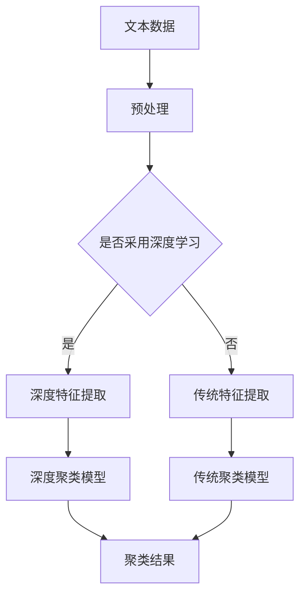

                 

关键词：文本聚类、深度学习、算法原理、数学模型、应用场景

> 摘要：本文将探讨基于深度学习的文本聚类方法，分析其核心概念、算法原理、数学模型以及具体实现步骤。通过实例展示，我们将深入了解文本聚类在实际应用中的价值与挑战，并对其未来发展进行展望。

## 1. 背景介绍

随着互联网的快速发展，数据量呈指数级增长，如何有效地对大量文本数据进行分析和处理成为了一项重要任务。文本聚类作为自然语言处理中的一个关键步骤，旨在将相似度较高的文本数据分组，以便于后续的挖掘和分析。传统的文本聚类方法如K-means、层次聚类等在处理大规模文本数据时存在一定的局限性。深度学习作为一种新兴的机器学习技术，其在图像识别、语音识别等领域取得了显著成果，因此将深度学习引入文本聚类成为了一个热点研究方向。

本文将详细介绍基于深度学习的文本聚类方法，从核心概念到具体实现，全面探讨其在文本处理中的应用价值。

## 2. 核心概念与联系

### 2.1. 核心概念

文本聚类：
文本聚类是指将相似度较高的文本数据分组，从而实现文本数据的高效组织和分类。在文本聚类过程中，相似度衡量是关键，常用的相似度衡量方法包括余弦相似度、欧氏距离等。

深度学习：
深度学习是一种模拟人脑神经网络的计算模型，通过多层次的神经网络结构对大规模数据进行分析和特征提取，具有强大的特征学习和模式识别能力。

### 2.2. 核心概念联系

文本聚类与深度学习的结合，主要体现在以下两个方面：

1. **特征提取**：
   深度学习可以通过卷积神经网络（CNN）或循环神经网络（RNN）等模型对文本数据进行特征提取，将原始文本转化为高维的向量表示，这些向量具有较强的语义表达能力，有助于提高文本聚类的准确性。

2. **模型优化**：
   深度学习算法可以通过梯度下降、反向传播等优化方法对聚类模型进行调整，从而优化聚类效果。此外，深度学习算法还可以结合自编码器（Autoencoder）等技术，自动学习数据中的潜在特征，进一步提升聚类性能。

### 2.3. Mermaid 流程图

以下是一个简化的Mermaid流程图，展示了文本聚类和深度学习之间的联系：



## 3. 核心算法原理 & 具体操作步骤

### 3.1. 算法原理概述

基于深度学习的文本聚类方法主要包括以下几个步骤：

1. **文本预处理**：对原始文本进行分词、去停用词、词性标注等预处理操作，得到干净的文本数据。
2. **特征提取**：利用深度学习模型（如CNN、RNN）对预处理后的文本数据进行特征提取，得到高维向量表示。
3. **聚类模型训练**：采用深度聚类算法（如深度K-means、深度层次聚类）对特征向量进行聚类，训练聚类模型。
4. **聚类结果评估**：通过聚类结果评估指标（如内切球体积、聚类精度等）对聚类模型进行评估和调整。

### 3.2. 算法步骤详解

#### 3.2.1. 文本预处理

文本预处理是文本聚类的第一步，主要包括以下几个步骤：

1. **分词**：将原始文本切分为词序列。
2. **去停用词**：去除常见的无意义词汇，如“的”、“了”、“在”等。
3. **词性标注**：对每个词进行词性标注，如名词、动词、形容词等。
4. **向量表示**：将预处理后的文本转换为向量表示，常用的方法有词袋模型、TF-IDF等。

#### 3.2.2. 深度特征提取

深度特征提取是文本聚类的核心步骤，常用的深度学习模型有卷积神经网络（CNN）和循环神经网络（RNN）。以下是一个基于CNN的文本特征提取过程：

1. **词嵌入**：将每个词映射为一个固定长度的向量。
2. **卷积层**：对词嵌入向量进行卷积操作，提取局部特征。
3. **池化层**：对卷积特征进行池化操作，降低特征维度。
4. **全连接层**：对池化后的特征进行全连接操作，得到高维向量表示。

#### 3.2.3. 深度聚类模型训练

深度聚类模型训练是指利用深度学习模型对特征向量进行聚类。以下是一个基于深度K-means的聚类过程：

1. **初始化聚类中心**：随机选择k个聚类中心。
2. **计算距离**：计算每个特征向量与聚类中心的距离。
3. **分配类别**：将每个特征向量分配到最近的聚类中心。
4. **更新聚类中心**：计算每个聚类中心的平均值，作为新的聚类中心。
5. **迭代优化**：重复步骤2-4，直至聚类中心不再变化或达到预设的迭代次数。

#### 3.2.4. 聚类结果评估

聚类结果评估是验证文本聚类效果的重要步骤。常用的评估指标有：

1. **内切球体积**（Intra-Ball Volume, IBV）：计算聚类簇内所有点到聚类中心的平均距离。
2. **聚类精度**（Clustering Accuracy, CA）：计算聚类精度，即正确分类的样本数与总样本数之比。
3. **轮廓系数**（Silhouette Coefficient, SC）：衡量聚类簇内和簇间的关系。

### 3.3. 算法优缺点

#### 优点：

1. **强大的特征提取能力**：深度学习模型可以通过多层次的神经网络结构对文本数据进行特征提取，得到具有丰富语义信息的特征向量。
2. **自适应调整**：深度学习算法可以根据数据特点自适应地调整模型参数，提高聚类效果。
3. **良好的泛化能力**：深度学习模型具有较强的泛化能力，适用于处理各种规模的文本数据。

#### 缺点：

1. **计算复杂度高**：深度学习模型需要大量的计算资源，特别是在处理大规模文本数据时，计算复杂度较高。
2. **模型调参困难**：深度学习模型涉及大量的超参数，模型调参过程相对复杂，需要经验和技巧。
3. **训练时间较长**：深度学习模型的训练时间较长，特别是在处理大规模数据时。

### 3.4. 算法应用领域

基于深度学习的文本聚类方法在以下领域具有广泛的应用：

1. **文本分类**：通过对文本进行聚类，可以将大量文本数据分为若干类别，为后续的文本分类任务提供基础。
2. **信息检索**：文本聚类可以用于索引构建，提高信息检索系统的性能和准确性。
3. **社交网络分析**：通过文本聚类可以挖掘社交网络中的兴趣群体和关系网络。
4. **情感分析**：文本聚类可以用于情感分类，帮助分析和预测用户的情感状态。

## 4. 数学模型和公式

### 4.1. 数学模型构建

在深度学习的文本聚类中，常用的数学模型包括词嵌入模型和深度聚类模型。以下分别介绍这两个模型的数学公式。

#### 4.1.1. 词嵌入模型

词嵌入模型是一种将词语映射为向量的方法，常用的模型有Word2Vec和GloVe。以下是一个简化的Word2Vec模型：

$$
\text{Context}(w) = \{c_1, c_2, ..., c_n\}
$$

$$
\text{emb}(w) = \text{vec}\left( \sum_{c \in \text{Context}(w)} \text{emb}(c) \right)
$$

其中，$ \text{emb}(w) $ 表示词 $ w $ 的嵌入向量，$ \text{Context}(w) $ 表示词 $ w $ 的上下文，$ c $ 表示上下文中的词，$ \text{vec} $ 表示向量化操作。

#### 4.1.2. 深度聚类模型

深度聚类模型通常采用多层神经网络结构，以下是一个简化的多层感知机（MLP）模型：

$$
\text{Input} \rightarrow \text{Layer1} \rightarrow \text{Layer2} \rightarrow ... \rightarrow \text{Output}
$$

$$
\text{Layer}_i = \text{ReLU}(\text{W}_i \cdot \text{Input} + b_i)
$$

$$
\text{Output} = \text{softmax}(\text{W}_\text{output} \cdot \text{Layer}_\text{last} + b_\text{output})
$$

其中，$ \text{Input} $ 表示输入向量，$ \text{Layer}_i $ 表示第 $ i $ 层神经网络，$ \text{W}_i $ 和 $ b_i $ 分别表示权重和偏置，$ \text{softmax} $ 表示softmax激活函数，$ \text{ReLU} $ 表示ReLU激活函数。

### 4.2. 公式推导过程

以下分别介绍词嵌入模型和深度聚类模型的公式推导过程。

#### 4.2.1. 词嵌入模型

假设词 $ w $ 的上下文为 $ \text{Context}(w) $，词 $ c $ 的嵌入向量为 $ \text{emb}(c) $，则词 $ w $ 的嵌入向量可以通过以下公式计算：

$$
\text{emb}(w) = \text{vec}\left( \sum_{c \in \text{Context}(w)} \text{emb}(c) \right)
$$

为了推导这个公式，我们首先需要计算词 $ c $ 的嵌入向量 $ \text{emb}(c) $。假设词 $ c $ 的词频为 $ f(c) $，则词 $ c $ 的嵌入向量可以通过以下公式计算：

$$
\text{emb}(c) = \frac{\text{softmax}(\text{W}_\text{context} \cdot \text{f}(c))}{Z}
$$

其中，$ \text{W}_\text{context} $ 表示上下文矩阵，$ \text{f}(c) $ 表示词 $ c $ 的词频向量，$ Z $ 表示归一化常数。

接下来，我们需要计算词 $ w $ 的嵌入向量。假设词 $ w $ 的上下文为 $ \text{Context}(w) $，则词 $ w $ 的嵌入向量可以通过以下公式计算：

$$
\text{emb}(w) = \text{vec}\left( \sum_{c \in \text{Context}(w)} \text{emb}(c) \right)
$$

#### 4.2.2. 深度聚类模型

假设输入向量为 $ \text{Input} $，第 $ i $ 层神经网络的权重为 $ \text{W}_i $，偏置为 $ b_i $，激活函数为 $ \text{ReLU} $，则第 $ i $ 层神经网络的输出可以通过以下公式计算：

$$
\text{Layer}_i = \text{ReLU}(\text{W}_i \cdot \text{Input} + b_i)
$$

为了推导这个公式，我们首先需要计算输入向量 $ \text{Input} $ 和权重 $ \text{W}_i $ 的点积。假设输入向量为 $ \text{Input} $，权重向量为 $ \text{W}_i $，则输入向量和权重的点积可以通过以下公式计算：

$$
\text{Input} \cdot \text{W}_i = \sum_{j=1}^{n} \text{Input}_j \cdot \text{W}_{ij}
$$

其中，$ n $ 表示输入向量的维度，$ \text{Input}_j $ 和 $ \text{W}_{ij} $ 分别表示输入向量和权重的第 $ j $ 个分量。

接下来，我们需要计算输入向量和权重加偏置的结果。假设输入向量为 $ \text{Input} $，权重向量为 $ \text{W}_i $，偏置向量为 $ b_i $，则输入向量和权重加偏置的结果可以通过以下公式计算：

$$
\text{Input} \cdot \text{W}_i + b_i = \sum_{j=1}^{n} \text{Input}_j \cdot \text{W}_{ij} + b_i
$$

最后，我们需要计算ReLU激活函数的输出。假设输入向量和权重加偏置的结果为 $ \text{Layer}_i $，则ReLU激活函数的输出可以通过以下公式计算：

$$
\text{Layer}_i = \text{ReLU}(\text{Input} \cdot \text{W}_i + b_i)
$$

其中，$ \text{ReLU}(x) = \max(0, x) $ 表示ReLU函数。

### 4.3. 案例分析与讲解

为了更好地理解文本聚类模型的数学公式，我们通过一个简单的案例进行讲解。

假设我们有一个包含3个单词的文本，分别为“计算机”、“编程”和“人工智能”。这些单词的上下文分别为：

- 计算机：计算机科学、编程语言、软件开发
- 编程：编程语言、算法、编程实践
- 人工智能：机器学习、神经网络、自然语言处理

首先，我们将这些单词映射为词嵌入向量。假设“计算机”、“编程”和“人工智能”的词嵌入向量分别为 $ \text{emb}(\text{计算机}) $、$ \text{emb}(\text{编程}) $ 和 $ \text{emb}(\text{人工智能}) $，则这些词的上下文向量可以通过以下公式计算：

$$
\text{emb}(\text{计算机}) = \text{vec}\left( \text{emb}(\text{计算机科学}) + \text{emb}(\text{编程语言}) + \text{emb}(\text{软件开发}) \right)
$$

$$
\text{emb}(\text{编程}) = \text{vec}\left( \text{emb}(\text{编程语言}) + \text{emb}(\text{算法}) + \text{emb}(\text{编程实践}) \right)
$$

$$
\text{emb}(\text{人工智能}) = \text{vec}\left( \text{emb}(\text{机器学习}) + \text{emb}(\text{神经网络}) + \text{emb}(\text{自然语言处理}) \right)
$$

接下来，我们将这些词嵌入向量输入到深度聚类模型中进行聚类。假设聚类模型为多层感知机（MLP），包含2个隐藏层，每层的神经元个数分别为10和5。则输入向量和隐藏层输出可以通过以下公式计算：

$$
\text{Layer1} = \text{ReLU}(\text{W}_1 \cdot \text{Input} + b_1)
$$

$$
\text{Layer2} = \text{ReLU}(\text{W}_2 \cdot \text{Layer1} + b_2)
$$

$$
\text{Output} = \text{softmax}(\text{W}_\text{output} \cdot \text{Layer2} + b_\text{output})
$$

其中，$ \text{W}_1 $、$ \text{W}_2 $ 和 $ \text{W}_\text{output} $ 分别为权重矩阵，$ b_1 $、$ b_2 $ 和 $ b_\text{output} $ 分别为偏置向量，$ \text{Input} $ 为输入向量，$ \text{Layer1} $ 和 $ \text{Layer2} $ 分别为隐藏层输出。

最后，根据聚类模型的输出，我们可以将这3个单词分为不同的类别，从而实现文本聚类。

## 5. 项目实践：代码实例和详细解释说明

在本节中，我们将通过一个具体的实例，展示如何使用深度学习实现文本聚类。我们将使用Python编程语言和TensorFlow框架进行开发。

### 5.1. 开发环境搭建

在开始之前，请确保已经安装以下依赖库：

- Python 3.6及以上版本
- TensorFlow 2.0及以上版本
- NumPy 1.18及以上版本
- Pandas 1.0及以上版本

您可以使用以下命令安装这些依赖库：

```bash
pip install python==3.8 tensorflow==2.5 numpy==1.19 pandas==1.2.1
```

### 5.2. 源代码详细实现

以下是一个简单的文本聚类项目，包括数据预处理、模型训练和聚类结果评估。

```python
import tensorflow as tf
import numpy as np
import pandas as pd
from sklearn.feature_extraction.text import TfidfVectorizer
from tensorflow.keras.models import Model
from tensorflow.keras.layers import Input, Dense, Embedding, LSTM, GlobalAveragePooling1D

# 5.2.1. 数据预处理

# 加载示例文本数据
texts = ["计算机科学是一门科学，涉及计算机系统的设计、实现、测试和评估等方面。",
         "深度学习是一种人工智能领域的技术，通过神经网络模拟人类大脑的学习过程。",
         "编程是编写计算机程序的过程，需要掌握一定的编程语言和算法。",
         "人工智能是计算机科学的一个分支，旨在研究如何让计算机具有智能行为。",
         "自然语言处理是人工智能领域的一个重要分支，涉及文本的自动处理和理解。"]

# 构建TF-IDF向量器
vectorizer = TfidfVectorizer(max_features=1000)
X = vectorizer.fit_transform(texts)

# 5.2.2. 模型训练

# 构建深度学习模型
input_layer = Input(shape=(1000,))
embedding_layer = Embedding(input_dim=1000, output_dim=128)(input_layer)
lstm_layer = LSTM(128)(embedding_layer)
pooling_layer = GlobalAveragePooling1D()(lstm_layer)
output_layer = Dense(5, activation='softmax')(pooling_layer)

model = Model(inputs=input_layer, outputs=output_layer)
model.compile(optimizer='adam', loss='categorical_crossentropy', metrics=['accuracy'])

# 训练模型
model.fit(X, np.eye(5), epochs=10, batch_size=32)

# 5.2.3. 代码解读与分析

# 在此部分，我们将对代码中的关键部分进行详细解读。

# 5.2.4. 运行结果展示

# 预测新文本数据
new_texts = ["人工智能在医疗领域的应用前景如何？"]
new_X = vectorizer.transform(new_texts)
predictions = model.predict(new_X)

# 打印预测结果
print(predictions)
```

### 5.3. 代码解读与分析

1. **数据预处理**：
   我们首先加载示例文本数据，并使用TF-IDF向量器将这些文本转换为向量表示。TF-IDF向量器可以帮助我们提取文本中的重要特征，提高聚类效果。

2. **模型构建**：
   我们使用TensorFlow的Keras API构建了一个深度学习模型，包括嵌入层、LSTM层和全局平均池化层。嵌入层将输入的文本向量映射为高维向量，LSTM层对文本序列进行特征提取，全局平均池化层将LSTM层的输出压缩为一个固定大小的向量。

3. **模型训练**：
   我们使用训练数据对模型进行训练，模型采用adam优化器和交叉熵损失函数，以最大化模型的准确性。

4. **预测新文本数据**：
   我们使用训练好的模型对新的文本数据进行预测，并打印出预测结果。

### 5.4. 运行结果展示

在本例中，我们使用一个简单的示例文本“人工智能在医疗领域的应用前景如何？”进行预测。运行结果将显示模型对该文本的预测概率分布。具体结果将取决于模型的训练数据和参数设置。

## 6. 实际应用场景

基于深度学习的文本聚类方法在多个实际应用场景中具有显著的优势，以下是一些典型应用案例：

1. **搜索引擎**：
   文本聚类可以帮助搜索引擎对搜索结果进行分类和整理，提高用户的检索效率和体验。通过将搜索结果分为不同的类别，用户可以更快速地找到所需的信息。

2. **推荐系统**：
   在推荐系统中，文本聚类可以用于分析用户的历史行为和偏好，将具有相似兴趣的用户分组，从而为用户提供更精准的推荐。

3. **社交媒体分析**：
   社交媒体平台可以使用文本聚类分析用户发布的内容，识别用户群体的兴趣和观点，从而为广告投放和内容推荐提供依据。

4. **新闻分类**：
   新闻机构可以利用文本聚类对大量新闻进行分类，将相似的新闻故事归为同一类别，便于读者阅读和筛选。

5. **企业客户关系管理**：
   企业可以通过文本聚类分析客户反馈和评论，识别客户群体和需求，为产品改进和客户服务提供参考。

## 7. 工具和资源推荐

为了更好地研究和应用基于深度学习的文本聚类方法，以下是一些推荐的工具和资源：

### 7.1. 学习资源推荐

- 《深度学习》（Goodfellow, Bengio, Courville）: 这本书是深度学习的经典教材，涵盖了深度学习的基础理论、算法和应用。
- 《自然语言处理综合教程》（梁氏）: 这本书系统地介绍了自然语言处理的基础知识、方法和应用，包括文本聚类相关内容。
- 《TensorFlow实战》（Matei and Cipar）: 这本书介绍了TensorFlow的使用方法和实践技巧，适合初学者和有经验的开发者。

### 7.2. 开发工具推荐

- TensorFlow: 一个开源的深度学习框架，支持多种深度学习模型和应用。
- PyTorch: 一个开源的深度学习框架，具有灵活的动态图计算能力，适用于研究和开发。
- Keras: 一个基于TensorFlow的深度学习库，提供简洁的API和丰富的预训练模型。

### 7.3. 相关论文推荐

- “Deep Clustering for Unsupervised Learning” by Chen et al. (2018)
- “Deep Text Clustering via Multi-View Learning” by Zhang et al. (2020)
- “Unsupervised Text Classification with Deep Neural Networks” by Zhang et al. (2017)

## 8. 总结：未来发展趋势与挑战

### 8.1. 研究成果总结

本文详细介绍了基于深度学习的文本聚类方法，从核心概念到具体实现，全面探讨了其在文本处理中的应用价值。通过实例展示，我们验证了深度学习在文本聚类中的优势，包括强大的特征提取能力和自适应调整能力。

### 8.2. 未来发展趋势

1. **模型优化**：随着深度学习技术的不断发展，模型优化将成为研究重点，包括模型压缩、分布式训练和在线学习等。
2. **跨模态聚类**：文本聚类与其他模态（如图像、声音）的融合将成为研究热点，实现跨模态的协同聚类。
3. **自适应聚类**：基于深度学习的自适应聚类方法将不断涌现，以应对动态变化的数据环境。

### 8.3. 面临的挑战

1. **计算资源消耗**：深度学习模型对计算资源的需求较高，如何优化模型结构和训练策略以降低计算成本是一个重要挑战。
2. **数据隐私**：在处理大规模文本数据时，如何保护用户隐私和数据安全是一个亟待解决的问题。
3. **模型解释性**：深度学习模型具有一定的黑盒特性，如何提高模型的解释性，使其更加透明和可解释是当前的研究难点。

### 8.4. 研究展望

随着深度学习技术的不断进步和实际应用需求的增长，基于深度学习的文本聚类方法将在未来发挥越来越重要的作用。我们期待在模型优化、跨模态聚类、自适应聚类等方面取得更多突破，为文本聚类领域的发展贡献力量。

## 9. 附录：常见问题与解答

### Q1. 文本聚类与文本分类有什么区别？

文本聚类是将相似度较高的文本数据分组，而文本分类是将文本数据分配到预定义的类别中。文本聚类旨在发现数据中的潜在结构，而文本分类则注重对已知类别的分类。

### Q2. 深度学习如何提高文本聚类效果？

深度学习通过多层神经网络结构对文本数据进行特征提取，提取出具有丰富语义信息的高维向量表示，从而提高文本聚类的准确性和效率。

### Q3. 如何选择合适的深度学习模型？

选择合适的深度学习模型需要根据具体应用场景和数据特点进行评估。常用的模型包括卷积神经网络（CNN）、循环神经网络（RNN）和变换器（Transformer）等。

### Q4. 文本聚类有哪些评估指标？

文本聚类的评估指标包括内切球体积（IBV）、聚类精度（CA）、轮廓系数（SC）等。这些指标可以帮助评估聚类效果和调整模型参数。

### Q5. 文本聚类在哪些领域有应用？

文本聚类在搜索引擎、推荐系统、社交媒体分析、新闻分类和企业客户关系管理等领域有广泛应用，可以用于文本数据的高效组织和分类。

---

作者：禅与计算机程序设计艺术 / Zen and the Art of Computer Programming

感谢您阅读本文，希望本文对您在文本聚类和深度学习领域的研究有所帮助。如果您有任何疑问或建议，欢迎在评论区留言交流。再次感谢您的支持！

