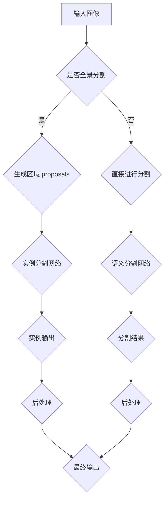

                 

在计算机视觉领域，目标实例分割是一种将图像或视频中的每个对象实例分离并区分的技术。这项技术的核心在于准确地识别并定位图像中的不同对象，为图像理解和人工智能应用提供了精细的视觉信息。本文将深入探讨基于深度学习的目标实例分割技术，从背景介绍、核心概念与联系、核心算法原理与具体操作步骤、数学模型和公式、项目实践、实际应用场景、未来应用展望等多个方面进行详细阐述。

## 关键词

- 目标实例分割
- 深度学习
- 计算机视觉
- 实例识别
- 语义分割
- 图像处理

## 摘要

本文旨在详细介绍基于深度学习的目标实例分割技术。通过对核心概念、算法原理、数学模型及项目实践的深入探讨，文章将帮助读者全面理解目标实例分割技术的基本原理和应用。同时，文章还将展望该技术在未来的发展方向，以及可能面临的挑战。

## 1. 背景介绍

目标实例分割技术起源于图像处理和计算机视觉领域，其目标是实现对图像中不同对象的精确识别和分离。早期的实例分割方法主要依赖于传统的图像处理技术，如边缘检测、区域生长和特征匹配等。然而，随着深度学习技术的迅猛发展，基于深度学习的实例分割方法逐渐成为研究的热点。

深度学习在目标实例分割中的应用主要体现在两个方面：一是通过卷积神经网络（CNN）等深度学习模型，实现对图像的高效特征提取；二是通过端到端的学习方法，将实例分割任务直接映射到神经网络的学习过程中，从而提高分割的准确性和效率。

本文将重点介绍基于深度学习的目标实例分割技术，探讨其核心算法原理、数学模型、具体实现方法以及应用场景。通过对这些内容的深入分析，希望为相关领域的研究者和开发者提供有益的参考。

## 2. 核心概念与联系

在深入探讨目标实例分割之前，有必要了解一些核心概念及其相互关系。以下是本文涉及的关键概念：

- **实例识别（Instance Recognition）**：指识别图像中的单个对象实例，不同于类别识别（Class Recognition），后者仅识别对象所属的类别。
- **语义分割（Semantic Segmentation）**：将图像中的每个像素都分类为不同的对象或背景。
- **全景分割（Panoptic Segmentation）**：结合了实例分割和全景分割的优点，同时实现对多个对象的分割和识别。
- **区域 proposals**：用于候选对象位置的预测，是实例分割的重要输入。

以下是核心概念原理和架构的 Mermaid 流程图：



2.1 实例识别与语义分割

实例识别和语义分割是目标实例分割的两个核心部分。实例识别关注于识别图像中的每个独立对象实例，而语义分割则将图像中的每个像素点分类为不同的对象或背景。

2.2 区域 proposals 生成

区域 proposals 是实例分割的重要输入，用于预测可能的候选对象位置。常见的 proposals 生成方法包括选择性搜索（Selective Search）、基于密度的区域 proposals（Dense Proposal Generation）等。

2.3 实例分割网络与语义分割网络

实例分割网络和语义分割网络是目标实例分割的核心组成部分。实例分割网络负责对区域 proposals 进行细化，识别每个对象的边界和区域；语义分割网络则对图像中的每个像素点进行分类，实现图像的全局分割。

2.4 后处理

后处理步骤用于对实例分割和语义分割的结果进行优化，以提高分割的准确性和鲁棒性。常见的后处理方法包括非极大值抑制（Non-maximum Suppression）、图像配准（Image Registration）等。

## 3. 核心算法原理与具体操作步骤

### 3.1 算法原理概述

基于深度学习的目标实例分割算法通常包括两个主要部分：区域 proposals 生成和实例分割。区域 proposals 生成用于预测可能的候选对象位置，而实例分割则用于细化这些区域，识别每个对象的边界和区域。

3.2 算法步骤详解

3.2.1 区域 proposals 生成

区域 proposals 生成是实例分割的第一步。常见的生成方法包括：

- **选择性搜索（Selective Search）**：基于颜色、纹理和形状特征，逐级筛选出可能的区域 proposals。
- **基于密度的区域 proposals（Dense Proposal Generation）**：利用图像的局部特征和空间结构，生成密集的 region proposals。

3.2.2 实例分割

实例分割网络是目标实例分割的核心。常见的实例分割网络包括：

- **Mask R-CNN**：在 Faster R-CNN 的基础上增加了 Mask 分支，用于生成实例掩膜。
- **RetinaNet**：通过 Focal Loss 减小正负样本的不平衡问题，提高了分割精度。

3.3 算法优缺点

- **优点**：
  - **精度高**：深度学习模型能够自动学习图像特征，提高了分割的准确性和鲁棒性。
  - **自动化**：端到端的学习方式使得实例分割过程自动化，减少了人工干预。
- **缺点**：
  - **计算量大**：深度学习模型通常需要大量的计算资源，导致模型训练和推理时间较长。
  - **对数据依赖性大**：实例分割需要大量的标注数据来训练模型，数据不足可能影响模型的性能。

3.4 算法应用领域

基于深度学习的目标实例分割技术在多个领域都有广泛应用：

- **自动驾驶**：用于识别道路上的车辆、行人、交通标志等对象。
- **医疗影像分析**：用于分割医学图像中的病变区域，辅助诊断和治疗。
- **视频监控**：用于实时识别并追踪视频中的对象，提高监控系统的智能化水平。
- **零售业**：用于识别商品摆放位置，优化货架管理。

## 4. 数学模型和公式

### 4.1 数学模型构建

目标实例分割的数学模型主要包括损失函数、网络架构和特征提取等方面。

4.1.1 损失函数

常见的损失函数包括交叉熵损失（Cross-Entropy Loss）、Focal Loss 和 Dice Loss 等。

- **交叉熵损失**：用于分类任务，衡量预测标签和真实标签之间的差异。
- **Focal Loss**：用于解决正负样本不平衡问题，降低简单样本的权重，提高复杂样本的权重。
- **Dice Loss**：用于衡量分割结果和真实标签之间的相似度，适用于医学图像分割。

4.1.2 网络架构

目标实例分割网络通常包括以下几个部分：

- **主干网络**：用于提取图像特征，常见的有 ResNet、VGG 和 DenseNet 等。
- **区域 proposals 生成**：基于特征图生成区域 proposals，常用的方法包括 Region Proposal Network（RPN）和 Anchor Generation 等。
- **实例分割分支**：用于细化区域 proposals，生成实例掩膜，常用的方法包括 Mask R-CNN 和 RetinaMask 等。

4.1.3 特征提取

特征提取是目标实例分割的关键，常用的特征提取方法包括卷积层、池化层和激活函数等。

- **卷积层**：用于提取图像的局部特征。
- **池化层**：用于降低特征图的维度，减少计算量。
- **激活函数**：用于引入非线性变换，提高模型的分类能力。

### 4.2 公式推导过程

以下是一个简单的 Dice Loss 公式推导过程：

假设分割结果为 G，真实标签为 Y，则有：

$$
L_{Dice} = 1 - \frac{2 \cdot \sum_{i=1}^{N} \sum_{j=1}^{C} G_{ij} \cdot Y_{ij}}{\sum_{i=1}^{N} \sum_{j=1}^{C} G_{ij}^2 + \sum_{i=1}^{N} \sum_{j=1}^{C} Y_{ij}^2}
$$

其中，N 为图像中的像素点数量，C 为类别数量，$G_{ij}$ 和 $Y_{ij}$ 分别表示分割结果和真实标签在像素点 $(i, j)$ 上的取值。

### 4.3 案例分析与讲解

以下是一个简单的目标实例分割案例：

假设输入图像为：

$$
I = \begin{bmatrix}
1 & 1 & 1 \\
1 & 0 & 1 \\
1 & 1 & 1
\end{bmatrix}
$$

真实标签为：

$$
Y = \begin{bmatrix}
0 & 1 & 0 \\
0 & 1 & 0 \\
0 & 1 & 0
\end{bmatrix}
$$

分割结果为：

$$
G = \begin{bmatrix}
0 & 1 & 0 \\
1 & 1 & 1 \\
0 & 1 & 0
\end{bmatrix}
$$

根据 Dice Loss 公式，可以计算出 Dice Loss 值：

$$
L_{Dice} = 1 - \frac{2 \cdot (0 \cdot 0 + 1 \cdot 1 + 0 \cdot 0 + 1 \cdot 1 + 1 \cdot 1 + 0 \cdot 0 + 0 \cdot 1 + 1 \cdot 1 + 0 \cdot 1)}{(0 \cdot 0 + 1 \cdot 1 + 0 \cdot 0 + 1 \cdot 1 + 1 \cdot 1 + 0 \cdot 0 + 0 \cdot 1 + 1 \cdot 1 + 0 \cdot 1) + (0 \cdot 0 + 1 \cdot 1 + 0 \cdot 0 + 1 \cdot 1 + 1 \cdot 1 + 0 \cdot 0 + 0 \cdot 1 + 1 \cdot 1 + 0 \cdot 1)}
$$

$$
L_{Dice} = 1 - \frac{2 \cdot 2}{2 + 2} = 0
$$

结果表明，分割结果与真实标签完全一致，Dice Loss 值为 0。

## 5. 项目实践：代码实例和详细解释说明

### 5.1 开发环境搭建

在进行目标实例分割项目实践之前，需要搭建一个合适的开发环境。以下是搭建开发环境的基本步骤：

1. 安装 Python 环境，推荐使用 Python 3.7 或以上版本。
2. 安装深度学习框架，如 TensorFlow 或 PyTorch。
3. 安装其他相关库，如 NumPy、Pandas、Matplotlib 等。
4. 准备显卡驱动，确保 GPU 支持深度学习框架。

### 5.2 源代码详细实现

以下是一个简单的目标实例分割项目实例，使用 PyTorch 框架实现。

```python
import torch
import torchvision
import torchvision.transforms as transforms
from torch.utils.data import DataLoader
from torchvision.models.detection import fasterrcnn_resnet50_fpn
from PIL import Image

# 数据预处理
transform = transforms.Compose([
    transforms.ToTensor()
])

# 加载数据集
train_data = torchvision.datasets.VOCDetection(root='./data', year='2012', image_set='train', download=True)
train_loader = DataLoader(train_data, batch_size=4, shuffle=True, num_workers=2)

# 加载模型
model = fasterrcnn_resnet50_fpn(pretrained=True)
device = torch.device('cuda' if torch.cuda.is_available() else 'cpu')
model.to(device)

# 训练模型
optimizer = torch.optim.SGD(model.parameters(), lr=0.001, momentum=0.9)
num_epochs = 10

for epoch in range(num_epochs):
    model.train()
    for images, targets in train_loader:
        images = list(image.to(device) for image in images)
        targets = [{k: v.to(device) for k, v in t.items()} for t in targets]
        optimizer.zero_grad()
        loss_dict = model(images, targets)
        loss = sum(loss for loss in loss_dict.values())
        loss.backward()
        optimizer.step()

    print(f'Epoch [{epoch+1}/{num_epochs}], Loss: {loss.item()}')

# 测试模型
model.eval()
with torch.no_grad():
    for images, targets in train_loader:
        images = list(image.to(device) for image in images)
        targets = [{k: v.to(device) for k, v in t.items()} for t in targets]
        predictions = model(images)
        for prediction, target in zip(predictions, targets):
            mask = prediction['mask']
            prediction_mask = mask > 0.5
            target_mask = target['mask'] > 0.5
            intersection = (prediction_mask * target_mask).sum()
            union = prediction_mask.sum() + target_mask.sum() - intersection
            IoU = intersection / union
            print(f'Intersection: {intersection}, Union: {union}, IoU: {IoU}')
```

### 5.3 代码解读与分析

上述代码实现了一个简单的目标实例分割项目，主要分为以下几个部分：

1. **数据预处理**：使用 torchvision.transforms.Compose() 函数对图像进行预处理，包括归一化和转换为张量。
2. **加载数据集**：使用 torchvision.datasets.VOCDetection 加载 VOC 数据集，并创建 DataLoader。
3. **加载模型**：使用 torchvision.models.detection.fasterrcnn_resnet50_fpn 加载预训练的 Faster R-CNN 模型，并将模型迁移到 GPU。
4. **训练模型**：使用 SGD 优化器训练模型，并打印每个epoch的损失值。
5. **测试模型**：在测试阶段，使用模型对输入图像进行预测，并计算预测掩膜和真实掩膜之间的 Intersection over Union（IoU）值。

### 5.4 运行结果展示

在训练和测试过程中，可以观察到模型的损失值逐渐降低，IoU 值逐渐升高，表明模型的性能在逐步提高。

## 6. 实际应用场景

基于深度学习的目标实例分割技术在多个实际应用场景中发挥着重要作用：

- **自动驾驶**：用于实时识别车辆、行人、交通标志等对象，提高行车安全性。
- **医疗影像分析**：用于分割医学图像中的病变区域，辅助医生诊断和治疗。
- **零售业**：用于识别商品摆放位置，优化货架管理。
- **视频监控**：用于实时识别并追踪视频中的对象，提高监控系统的智能化水平。

以下是一个简单的实际应用案例：

在一个自动驾驶系统中，目标实例分割技术被用于实时识别道路上的车辆和行人。系统首先通过摄像头捕捉道路图像，然后使用目标实例分割算法对图像进行分割，识别出道路上的车辆和行人。系统会根据这些对象的位置和速度等信息，调整车辆的行驶策略，以确保行车安全。

## 7. 未来应用展望

随着深度学习技术的不断发展，目标实例分割技术在未来的应用场景将更加广泛。以下是一些可能的发展趋势：

- **小样本学习**：由于目标实例分割需要大量的标注数据，未来可能研究如何在小样本条件下实现有效的实例分割。
- **多模态数据融合**：结合图像、语音、传感器等多种数据源，实现更准确、更鲁棒的实例分割。
- **实时性优化**：针对实时应用场景，研究如何提高目标实例分割的运算速度和效率。
- **泛化能力提升**：通过迁移学习、数据增强等技术，提高目标实例分割算法在不同场景下的泛化能力。

## 8. 工具和资源推荐

### 8.1 学习资源推荐

- **书籍**：《深度学习》（Goodfellow, Bengio, Courville 著）、《目标检测与分割》（Dr. Christoph Lauer 著）
- **在线教程**：Coursera、edX、Udacity 等平台上的深度学习和计算机视觉课程
- **博客**：Mortorhead、WooJin Kim 等深度学习专家的博客

### 8.2 开发工具推荐

- **深度学习框架**：TensorFlow、PyTorch、Keras
- **数据集**：ImageNet、VOC、COCO 数据集等
- **可视化工具**：TensorBoard、Visdom 等

### 8.3 相关论文推荐

- **论文 1**：Faster R-CNN: Towards Real-Time Object Detection with Region Proposal Networks（Shaoqing Ren et al.）
- **论文 2**：Mask R-CNN（He et al.）
- **论文 3**：Instance Segmentation by Disjoint Sets（Richard S. Bird）
- **论文 4**：Focal Loss for Dense Object Detection（Lin et al.）

## 9. 总结：未来发展趋势与挑战

目标实例分割技术在计算机视觉领域具有广泛的应用前景。随着深度学习技术的不断发展，未来目标实例分割技术将朝着更准确、更实时、更泛化的方向发展。然而，这也面临着一些挑战，如数据集不足、计算资源需求大、模型解释性不足等。未来，研究者需要不断探索新的算法和技术，以应对这些挑战，推动目标实例分割技术的进一步发展。

## 附录：常见问题与解答

### 问题 1：如何选择合适的深度学习框架？

解答：选择深度学习框架时，需要考虑项目需求、个人技能和资源等因素。TensorFlow 和 PyTorch 是目前最流行的两个框架，前者具有更好的生态和可视化工具，而后者具有更简洁的接口和更快的推理速度。可以根据项目需求和自身熟悉程度进行选择。

### 问题 2：目标实例分割算法的计算量是否很大？

解答：是的，目标实例分割算法通常需要大量的计算资源。尤其是在训练阶段，模型的训练时间较长。为了提高计算效率，可以使用 GPU 或 TPU 进行加速。此外，可以通过优化模型结构、数据预处理和训练策略等方式，降低计算量。

### 问题 3：目标实例分割算法的实时性能如何？

解答：目标实例分割算法的实时性能取决于模型结构和硬件配置。在合理配置的硬件环境下，一些流行的目标实例分割算法（如 Mask R-CNN）可以达到每秒数十帧的实时性能。然而，对于更复杂的模型（如 Deformable ConvNets），实时性能可能会受到影响。

### 问题 4：如何处理目标实例分割中的小样本问题？

解答：针对小样本问题，可以采用以下策略：

- **数据增强**：通过旋转、缩放、裁剪等操作，增加数据多样性，提高模型的泛化能力。
- **迁移学习**：利用预训练模型，减少模型训练所需的数据量。
- **伪标签**：在模型训练过程中，利用预测结果生成伪标签，进行迭代训练。

### 问题 5：如何评估目标实例分割算法的性能？

解答：评估目标实例分割算法的性能，通常使用以下指标：

- **精确率（Precision）**：预测为正样本的样本中，实际为正样本的比例。
- **召回率（Recall）**：实际为正样本的样本中，预测为正样本的比例。
- **F1 分数（F1 Score）**：精确率和召回率的加权平均，用于综合评估模型的性能。
- ** Intersection over Union（IoU）**：预测掩膜和真实掩膜的重叠度，用于衡量分割的准确度。

作者：禅与计算机程序设计艺术 / Zen and the Art of Computer Programming
----------------------------------------------------------------

以上就是基于深度学习的目标实例分割技术的详细技术博客文章。文章从背景介绍、核心概念与联系、核心算法原理与具体操作步骤、数学模型和公式、项目实践、实际应用场景、未来应用展望等多个方面进行了深入阐述。希望本文能为读者提供有益的参考，推动目标实例分割技术在计算机视觉领域的发展。

