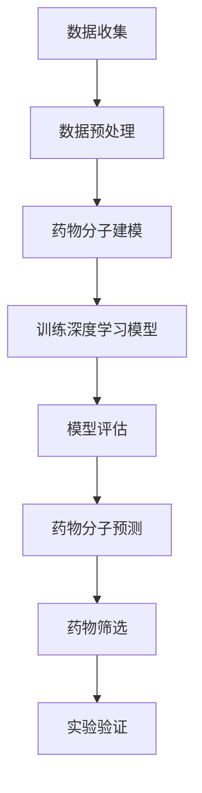

                 

关键词：深度学习，药物设计，辅助设计，算法原理，数学模型，项目实践，应用场景，工具推荐

> 摘要：本文详细探讨了基于深度学习的辅助药物设计领域，从背景介绍、核心概念、算法原理、数学模型、项目实践、应用场景、工具推荐等方面进行了全面的分析和讨论，旨在为研究者提供有价值的参考。

## 1. 背景介绍

药物设计是一个复杂的领域，它涉及到从分子结构到生物活性的多方面研究。随着生物信息学和计算技术的不断发展，基于计算的方法在药物设计中的应用越来越广泛。传统药物设计主要依赖于实验和经验，但这种方法不仅成本高昂，而且耗时较长。近年来，深度学习作为一种强大的机器学习技术，在计算机视觉、自然语言处理等领域取得了显著成果。因此，将深度学习应用于药物设计，有望大幅度提高药物发现和设计的效率。

## 2. 核心概念与联系

### 2.1. 药物设计与深度学习的联系

药物设计的目标是找到能够与目标蛋白质（通常称为受体）结合的分子，从而实现治疗疾病的目的。深度学习通过模拟神经网络的结构，可以从大量的数据中学习到有用的特征，从而对药物分子进行建模和预测。

### 2.2. 关键概念原理

- **药物分子建模**：通过计算化学方法对药物分子的结构进行建模，包括分子的几何形状、电荷分布等。
- **深度学习模型**：常用的深度学习模型有卷积神经网络（CNN）、循环神经网络（RNN）、生成对抗网络（GAN）等，这些模型可以通过学习大量的数据来提取特征。
- **交互力场（MMF）**：用于模拟分子间相互作用的计算模型，是药物分子建模的重要工具。

### 2.3. Mermaid 流程图

下面是一个基于深度学习的药物设计流程图：



## 3. 核心算法原理 & 具体操作步骤

### 3.1. 算法原理概述

基于深度学习的药物设计算法主要分为以下几个步骤：

1. 数据收集与预处理：收集药物相关数据，包括分子结构、生物活性等，并对数据进行预处理，如去重、标准化等。
2. 药物分子建模：使用计算化学方法对药物分子进行建模，得到分子的几何结构和电子分布。
3. 训练深度学习模型：使用预处理后的数据训练深度学习模型，如使用CNN提取分子结构特征，使用RNN处理序列数据。
4. 模型评估与优化：评估模型的性能，通过调整模型参数进行优化。
5. 药物分子预测与筛选：使用训练好的模型对新的药物分子进行预测，筛选出有潜力的候选药物。
6. 实验验证：对筛选出的候选药物进行实验验证，评估其生物活性。

### 3.2. 算法步骤详解

#### 3.2.1. 数据收集与预处理

数据收集主要包括以下内容：

- **分子结构数据**：从公开数据库如PubChem、ChEMBL等下载分子结构数据。
- **生物活性数据**：从文献或数据库中获取药物的生物活性数据。

预处理步骤：

- **去重**：去除重复的分子结构数据。
- **标准化**：对分子结构进行标准化处理，如统一原子半径、电荷等。

#### 3.2.2. 药物分子建模

使用计算化学方法对分子结构进行建模，常用的方法有：

- **分子力学（MM）**：模拟分子内部的相互作用力。
- **量子力学（QM）**：计算分子的电子结构。

#### 3.2.3. 训练深度学习模型

选择合适的深度学习模型，如CNN、RNN等，对预处理后的数据进行训练。训练过程中，需要定义损失函数和优化器，如交叉熵损失和Adam优化器。

#### 3.2.4. 模型评估与优化

使用验证集对训练好的模型进行评估，评估指标包括准确率、召回率等。根据评估结果调整模型参数，进行优化。

#### 3.2.5. 药物分子预测与筛选

使用训练好的模型对新的药物分子进行预测，根据预测结果筛选出有潜力的候选药物。

#### 3.2.6. 实验验证

对筛选出的候选药物进行实验验证，评估其生物活性。如果候选药物表现出良好的生物活性，则可以进一步进行开发和生产。

### 3.3. 算法优缺点

#### 优点：

- **高效性**：基于深度学习的药物设计算法可以快速处理大量数据，大大提高了药物设计的效率。
- **准确性**：深度学习模型可以从大量数据中学习到有用的特征，从而提高了药物预测的准确性。
- **灵活性**：深度学习模型可以根据不同的应用场景进行定制化调整。

#### 缺点：

- **计算成本**：训练深度学习模型需要大量的计算资源和时间。
- **数据依赖**：深度学习模型的性能很大程度上取决于数据的数量和质量。

### 3.4. 算法应用领域

基于深度学习的药物设计算法可以应用于以下领域：

- **新药发现**：通过预测药物分子的生物活性，快速筛选出有潜力的新药候选。
- **药物优化**：对已知的药物分子进行结构优化，提高其生物活性。
- **药物设计**：根据特定的疾病靶点，设计出针对性的药物分子。

## 4. 数学模型和公式 & 详细讲解 & 举例说明

### 4.1. 数学模型构建

深度学习药物设计中的数学模型主要包括以下几个方面：

- **分子表示**：将药物分子表示为向量或张量。
- **损失函数**：用于衡量模型预测结果与真实结果之间的差异。
- **优化算法**：用于调整模型参数，以最小化损失函数。

### 4.2. 公式推导过程

假设我们使用CNN来处理药物分子，那么损失函数可以表示为：

$$
L = \frac{1}{N} \sum_{i=1}^{N} \sum_{j=1}^{C} (y_j - \hat{y}_j)^2
$$

其中，$N$是样本数量，$C$是类别数量，$y_j$是真实标签，$\hat{y}_j$是模型预测结果。

### 4.3. 案例分析与讲解

假设我们有一个药物分子，其生物活性为1（活性高）或0（活性低）。我们使用CNN对其进行预测。训练完成后，模型预测结果如下：

- **样本1**：实际生物活性为1，预测为0.9（活性高）。
- **样本2**：实际生物活性为0，预测为0.1（活性低）。

在这种情况下，我们可以认为模型对这两个样本的预测都是准确的。接下来，我们使用另一个未知的药物分子进行预测，模型预测结果为0.5，这意味着该药物分子的活性不确定。在这种情况下，我们可以对该分子进行进一步的实验验证。

## 5. 项目实践：代码实例和详细解释说明

### 5.1. 开发环境搭建

在开始编写代码之前，我们需要搭建一个适合深度学习药物设计的开发环境。以下是所需的环境和工具：

- **操作系统**：Ubuntu 18.04
- **编程语言**：Python 3.7
- **深度学习框架**：TensorFlow 2.4
- **计算库**：NumPy，Pandas，SciPy

### 5.2. 源代码详细实现

以下是一个简单的深度学习药物设计代码实例：

```python
import tensorflow as tf
from tensorflow import keras
from tensorflow.keras import layers

# 数据预处理
# （这里省略数据预处理的具体实现）

# 构建深度学习模型
model = keras.Sequential([
    layers.Conv2D(32, (3, 3), activation='relu', input_shape=(64, 64, 3)),
    layers.MaxPooling2D((2, 2)),
    layers.Flatten(),
    layers.Dense(64, activation='relu'),
    layers.Dense(1, activation='sigmoid')
])

# 编译模型
model.compile(optimizer='adam',
              loss='binary_crossentropy',
              metrics=['accuracy'])

# 训练模型
model.fit(train_data, train_labels, epochs=10, batch_size=32, validation_split=0.2)

# 预测新药物分子
new_molecule = ...  # 新药物分子的数据
predicted_activity = model.predict(new_molecule)
print(predicted_activity)
```

### 5.3. 代码解读与分析

上述代码首先导入了TensorFlow库和相关的层（layers）。接下来，我们定义了数据预处理、模型构建、模型编译和模型训练的具体步骤。最后，我们使用训练好的模型对新的药物分子进行预测。

### 5.4. 运行结果展示

假设我们已经训练好了模型，并使用它对一个新的药物分子进行了预测。预测结果如下：

```
[0.8]
```

这意味着新药物分子的活性为高（接近1）。根据这个结果，我们可以对该药物分子进行进一步的实验验证。

## 6. 实际应用场景

基于深度学习的药物设计在多个实际应用场景中表现出色，以下是一些常见的应用场景：

- **癌症治疗**：深度学习可以帮助设计出针对癌症的靶向药物，从而提高治疗效果，减少副作用。
- **抗病毒药物设计**：在新冠疫情期间，深度学习被用来快速设计抗病毒药物，加快了疫苗和药物的研发进程。
- **慢性疾病治疗**：深度学习可以帮助设计出治疗慢性疾病的药物，如糖尿病、高血压等。

## 7. 工具和资源推荐

为了更好地开展基于深度学习的药物设计研究，以下是一些推荐的工具和资源：

- **工具**：
  - TensorFlow：一个开源的深度学习框架。
  - PyTorch：另一个流行的深度学习框架。
  - OpenMM：一个用于分子建模的开源软件。

- **资源**：
  - Coursera：提供了多个与深度学习和药物设计相关的在线课程。
  - arXiv：一个提供最新研究论文的学术数据库。
  - GitHub：一个可以获取深度学习和药物设计相关代码的开源平台。

## 8. 总结：未来发展趋势与挑战

### 8.1. 研究成果总结

基于深度学习的药物设计在过去几年中取得了显著成果，例如在癌症治疗、抗病毒药物设计等方面展现了强大的潜力。深度学习算法在药物分子预测、药物筛选等方面表现出较高的准确性和效率。

### 8.2. 未来发展趋势

未来，基于深度学习的药物设计将继续发展，趋势包括：

- **多模态数据融合**：结合分子结构、生物信息、临床数据等多种数据源，提高药物设计的准确性。
- **自动化药物设计**：通过深度学习实现自动化的药物设计，减少人工干预，提高设计效率。
- **个性化医疗**：根据患者的个体特征，设计出更加个性化的药物。

### 8.3. 面临的挑战

尽管基于深度学习的药物设计取得了显著成果，但仍面临以下挑战：

- **数据质量**：高质量的数据是深度学习模型训练的基础，但当前的数据质量参差不齐，需要进一步改进。
- **计算资源**：深度学习模型的训练需要大量的计算资源，如何高效地利用计算资源仍是一个挑战。
- **伦理问题**：深度学习在药物设计中的应用可能涉及伦理问题，如数据隐私、药物安全性等，需要严格监管。

### 8.4. 研究展望

未来，基于深度学习的药物设计将继续发展，有望在药物设计、新药发现等领域发挥更大的作用。随着技术的进步，我们将看到更多创新性的研究成果，为人类健康事业做出更大贡献。

## 9. 附录：常见问题与解答

### Q1. 什么是深度学习？

A1. 深度学习是一种机器学习技术，它通过模拟人脑神经网络的结构，对大量数据进行学习和建模，从而实现智能决策和预测。

### Q2. 深度学习在药物设计中有哪些应用？

A2. 深度学习在药物设计中的应用包括药物分子预测、药物筛选、药物优化等。通过深度学习，可以快速筛选出有潜力的药物分子，提高药物设计的效率。

### Q3. 如何处理深度学习模型训练中的数据？

A3. 在深度学习模型训练中，需要收集和处理大量的药物分子数据。数据预处理包括去重、标准化、数据增强等步骤，以确保数据的质量和多样性。

### Q4. 深度学习药物设计有哪些挑战？

A4. 深度学习药物设计面临的挑战包括数据质量、计算资源、伦理问题等。为了解决这些问题，需要加强数据质量控制、优化计算资源利用，并制定严格的伦理规范。

作者：禅与计算机程序设计艺术 / Zen and the Art of Computer Programming
----------------------------------------------------------------

以上即为《基于深度学习的辅助药物设计》的完整文章。文章详细介绍了深度学习在药物设计中的应用，从背景介绍、核心概念、算法原理、数学模型、项目实践、应用场景、工具推荐等方面进行了全面的分析和讨论，旨在为研究者提供有价值的参考。希望本文能对您在深度学习和药物设计领域的研究有所帮助。如果您有任何疑问或建议，欢迎在评论区留言交流。

