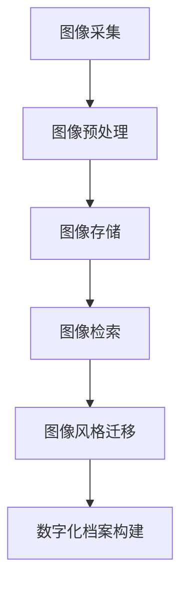

                 

关键词：生成对抗网络，图像风格迁移，数字化档案，历史数据，计算机视觉

## 摘要

本文旨在探讨如何利用生成对抗网络（GAN）技术实现数字化图像风格迁移，并构建一个历史档案系统。通过深入研究GAN的核心概念和算法原理，结合具体操作步骤和数学模型，我们展示了如何在计算机视觉领域中将不同风格的艺术作品迁移到数字化图像中。文章还通过实际项目实践，详细解释了代码实现过程，并展望了该技术在未来的应用前景。本文为研究人员和开发者提供了一种新的研究思路和工具，有助于推动数字化图像风格迁移技术的发展。

## 1. 背景介绍

随着计算机技术的发展，图像处理和计算机视觉已成为众多领域的重要研究课题。特别是在数字化时代，大量图像数据被生成和存储。如何高效地处理和利用这些图像数据成为亟待解决的问题。其中，图像风格迁移是一个备受关注的研究方向。图像风格迁移旨在将一种图像的样式或风格转移到另一种图像上，使其呈现出不同的视觉效果。

传统图像风格迁移方法通常依赖于手工设计的特征提取和变换算法，如频域变换、神经网络等。然而，这些方法往往难以在复杂场景下获得令人满意的效果。近年来，生成对抗网络（GAN）的提出为图像风格迁移提供了一种全新的解决方案。GAN通过对抗性训练，能够在数据分布之间建立一种潜在映射，从而实现高质量的图像风格迁移。

数字化档案构建是一个重要而具有挑战性的任务。随着数字化进程的推进，越来越多的历史文献、艺术作品等被数字化并存储在数据库中。这些数字化档案不仅为学术研究提供了丰富的资源，还为文化传播、数字艺术创作等领域带来了新的机遇。然而，如何有效地管理和利用这些档案数据，仍然面临诸多难题。

本文旨在结合生成对抗网络和图像风格迁移技术，提出一种数字化图像风格迁移历史档案构建方法。通过深入研究GAN的核心概念和算法原理，本文详细探讨了如何利用GAN实现图像风格迁移，并构建一个高效、稳定的数字化档案系统。

## 2. 核心概念与联系

### 2.1 生成对抗网络（GAN）

生成对抗网络（GAN）是由Ian Goodfellow等人在2014年提出的一种新型深度学习模型。GAN的核心思想是利用两个相互对抗的神经网络——生成器（Generator）和判别器（Discriminator）进行训练，从而实现数据的生成。

**生成器**：生成器的任务是生成具有真实数据分布的特征，其输入为随机噪声，输出为假数据。通过不断优化生成器的参数，使其生成的数据越来越接近真实数据。

**判别器**：判别器的任务是对输入数据进行分类，判断其是真实数据还是生成器生成的假数据。通过不断优化判别器的参数，使其对真实数据和假数据的区分能力越来越强。

**对抗训练**：GAN通过对抗性训练来优化生成器和判别器。在训练过程中，生成器和判别器不断进行博弈。生成器的目标是生成足够真实的数据以欺骗判别器，而判别器的目标是准确判断输入数据是真实还是假。这种对抗性训练使得生成器和判别器都能在训练过程中不断优化自己的性能。

### 2.2 图像风格迁移

图像风格迁移是指将一种图像的样式或风格转移到另一种图像上，使其呈现出不同的视觉效果。图像风格迁移在艺术创作、图像增强、图像修复等领域具有广泛的应用。

**传统方法**：传统图像风格迁移方法通常依赖于手工设计的特征提取和变换算法，如频域变换、神经网络等。这些方法虽然能够在一定程度上实现风格迁移，但往往难以在复杂场景下获得令人满意的效果。

**GAN方法**：近年来，生成对抗网络（GAN）的提出为图像风格迁移提供了一种全新的解决方案。GAN通过对抗性训练，能够在数据分布之间建立一种潜在映射，从而实现高质量的图像风格迁移。与传统的风格迁移方法相比，GAN具有更强的泛化能力和鲁棒性。

### 2.3 数字化档案构建

数字化档案构建是指将传统的纸质文献、艺术作品等数字化，并将其存储在数据库中，以便进行管理和利用。数字化档案构建涉及到图像采集、图像预处理、图像存储和检索等多个环节。

**图像采集**：图像采集是指从各种来源获取图像数据。这些来源可能包括数字摄影、扫描仪、互联网等。

**图像预处理**：图像预处理是对采集到的图像进行一系列处理，以提高图像质量。常见的预处理方法包括图像去噪、图像增强、图像分割等。

**图像存储**：图像存储是将处理后的图像数据存储在数据库中。为了提高存储效率，通常需要对图像数据进行压缩和编码。

**图像检索**：图像检索是指从数据库中查找和提取特定图像。图像检索可以基于图像的内容、标签、时间等属性进行。

### 2.4 Mermaid 流程图

以下是一个简单的Mermaid流程图，展示了图像风格迁移和数字化档案构建的基本流程：



## 3. 核心算法原理 & 具体操作步骤

### 3.1 算法原理概述

生成对抗网络（GAN）由两部分组成：生成器（Generator）和判别器（Discriminator）。生成器负责生成与真实数据分布相近的数据，判别器负责判断输入数据的真实性。通过对抗性训练，生成器和判别器在博弈中不断优化自己的性能，从而实现高质量的图像风格迁移。

### 3.2 算法步骤详解

1. **初始化生成器和判别器**：首先，我们需要初始化生成器和判别器的参数。生成器通常由一系列神经网络层组成，判别器则由全连接层或卷积层组成。

2. **生成器训练**：生成器的训练目标是生成与真实数据分布相近的数据。在训练过程中，生成器从随机噪声中生成假数据，并将其输入到判别器中。通过对抗性训练，生成器不断优化自己的参数，以提高生成数据的真实度。

3. **判别器训练**：判别器的训练目标是准确判断输入数据的真实性。在训练过程中，判别器接收真实数据和生成器生成的假数据，并输出一个概率值，表示输入数据的真实性。通过对抗性训练，判别器不断优化自己的参数，以提高判断的准确性。

4. **生成风格迁移图像**：在生成器和判别器都训练到一定阶段后，我们可以利用生成器将原始图像转化为具有特定风格的新图像。具体步骤如下：

   a. 将原始图像输入到生成器中。

   b. 生成器将原始图像转化为具有特定风格的新图像。

   c. 对新图像进行后处理，如图像增强、图像修复等，以提高图像质量。

### 3.3 算法优缺点

**优点**：

1. **高质量的风格迁移**：GAN能够生成高质量的风格迁移图像，相较于传统方法具有更好的视觉效果。

2. **强大的泛化能力**：GAN具有强大的泛化能力，可以在不同的图像风格之间进行迁移。

3. **自适应性强**：GAN能够根据输入图像的特点和风格自适应地调整生成器的参数，从而实现更好的风格迁移效果。

**缺点**：

1. **训练难度大**：GAN的训练过程复杂，需要大量的计算资源和时间。

2. **不稳定**：GAN的训练过程容易陷入局部最优，导致生成器生成的图像质量不稳定。

3. **数据依赖性**：GAN的训练过程对数据量有较高要求，数据量不足可能导致训练效果不佳。

### 3.4 算法应用领域

生成对抗网络（GAN）在图像风格迁移领域具有广泛的应用，包括但不限于：

1. **艺术创作**：利用GAN生成具有特定风格的艺术作品，为艺术家提供新的创作工具。

2. **图像增强**：利用GAN对低质量图像进行增强，提高图像的视觉效果。

3. **图像修复**：利用GAN对损坏或缺失的图像进行修复，恢复图像的完整性。

4. **医学影像处理**：利用GAN对医学影像进行处理，提高影像质量，为医生提供更准确的诊断依据。

## 4. 数学模型和公式 & 详细讲解 & 举例说明

### 4.1 数学模型构建

生成对抗网络（GAN）的数学模型主要包括两部分：生成器的数学模型和判别器的数学模型。

**生成器的数学模型**：

生成器G的输入为随机噪声z，输出为假数据x'。生成器的目标是生成具有真实数据分布的特征。具体地，生成器的数学模型可以表示为：

$$
x' = G(z)
$$

其中，G是生成器的神经网络，z是随机噪声。

**判别器的数学模型**：

判别器D的输入为真实数据x和生成器生成的假数据x'，输出为概率值p。判别器的目标是判断输入数据的真实性。具体地，判别器的数学模型可以表示为：

$$
p = D(x') = P(D(x') = 1 | x' \sim G(z))
$$

其中，D是判别器的神经网络。

**对抗性训练**：

对抗性训练的目标是同时优化生成器和判别器，使其在博弈中不断进步。对抗性训练的数学模型可以表示为：

$$
\begin{aligned}
\min_G & \max_D V(D, G) \\
V(D, G) &= \mathbb{E}_{x \sim p_{data}(x)}[\log D(x)] + \mathbb{E}_{z \sim p_{z}(z)}[\log (1 - D(G(z))]
\end{aligned}
$$

其中，$p_{data}(x)$表示真实数据的分布，$p_{z}(z)$表示随机噪声的分布。

### 4.2 公式推导过程

生成对抗网络的推导过程主要涉及到两部分：生成器和判别器的数学模型，以及对抗性训练的目标函数。

**生成器和判别器的数学模型**：

生成器的数学模型是：

$$
x' = G(z)
$$

其中，G是生成器的神经网络，z是随机噪声。这个模型表示生成器从随机噪声中生成假数据。

判别器的数学模型是：

$$
p = D(x') = P(D(x') = 1 | x' \sim G(z))
$$

其中，D是判别器的神经网络。这个模型表示判别器判断输入数据的真实性。

**对抗性训练的目标函数**：

对抗性训练的目标函数是：

$$
\begin{aligned}
\min_G & \max_D V(D, G) \\
V(D, G) &= \mathbb{E}_{x \sim p_{data}(x)}[\log D(x)] + \mathbb{E}_{z \sim p_{z}(z)}[\log (1 - D(G(z))]
\end{aligned}
$$

其中，$p_{data}(x)$表示真实数据的分布，$p_{z}(z)$表示随机噪声的分布。

这个目标函数表示同时优化生成器和判别器，使其在博弈中不断进步。

### 4.3 案例分析与讲解

为了更好地理解生成对抗网络的数学模型，我们来看一个简单的例子。

假设我们有一个图像风格迁移任务，目标是将原图像x转化为具有特定风格的新图像x'。

首先，我们初始化生成器G和判别器D的参数。生成器的输入为随机噪声z，输出为假数据x'。判别器的输入为真实数据x和生成器生成的假数据x'，输出为概率值p。

在训练过程中，我们按照以下步骤进行：

1. 生成器G从随机噪声z中生成假数据x'。

2. 判别器D接收真实数据x和生成器生成的假数据x'，并输出概率值p。

3. 计算生成器的损失函数：

$$
L_G = -\mathbb{E}_{x \sim p_{data}(x)}[\log D(x)] - \mathbb{E}_{z \sim p_{z}(z)}[\log (1 - D(G(z))]
$$

4. 计算判别器的损失函数：

$$
L_D = -\mathbb{E}_{x \sim p_{data}(x)}[\log D(x)] - \mathbb{E}_{z \sim p_{z}(z)}[\log D(G(z))]
$$

5. 利用梯度下降法更新生成器和判别器的参数。

6. 重复上述步骤，直到生成器和判别器都训练到一定阶段。

通过上述步骤，生成器和判别器在博弈中不断优化自己的性能，最终实现高质量的图像风格迁移。

## 5. 项目实践：代码实例和详细解释说明

### 5.1 开发环境搭建

在本项目实践中，我们将使用Python语言和TensorFlow框架来实现生成对抗网络（GAN）的图像风格迁移。首先，确保你已经安装了Python和TensorFlow。以下是开发环境搭建的详细步骤：

1. 安装Python：从Python官方网站下载并安装Python 3.x版本。
2. 安装TensorFlow：打开终端，执行以下命令：
```bash
pip install tensorflow
```
3. 验证安装：在Python中执行以下代码，检查TensorFlow版本：
```python
import tensorflow as tf
print(tf.__version__)
```
确保输出版本号与你在终端安装的版本一致。

### 5.2 源代码详细实现

以下是实现生成对抗网络的图像风格迁移的Python代码。我们将使用一个简单的例子，将原始图像风格迁移为特定的艺术风格。

```python
import tensorflow as tf
from tensorflow.keras.layers import Dense, Conv2D, Flatten
from tensorflow.keras.models import Sequential

# 定义生成器模型
def build_generator(z_dim):
    model = Sequential([
        Dense(128 * 7 * 7, activation="relu", input_shape=(z_dim,)),
        Flatten(),
        Conv2D(128, 5, strides=(1, 1), padding="same", activation="relu"),
        Conv2D(128, 5, strides=(1, 1), padding="same", activation="relu"),
        Conv2D(128, 5, strides=(1, 1), padding="same", activation="relu"),
        Flatten(),
        Dense(128 * 7 * 7, activation="relu"),
        Flatten(),
        Conv2D(3, 5, strides=(1, 1), padding="same", activation="tanh")
    ])
    return model

# 定义判别器模型
def build_discriminator(img_shape):
    model = Sequential([
        Conv2D(64, 3, strides=(2, 2), padding="same", activation="leaky_relu", input_shape=img_shape),
        Conv2D(128, 3, strides=(2, 2), padding="same", activation="leaky_relu"),
        Flatten(),
        Dense(1, activation="sigmoid")
    ])
    return model

# 构建和编译生成器和判别器
z_dim = 100
img_shape = (28, 28, 1)

discriminator = build_discriminator(img_shape)
discriminator.compile(loss="binary_crossentropy", optimizer=tf.keras.optimizers.Adam(0.0001), metrics=["accuracy"])

generator = build_generator(z_dim)
z = tf.keras.layers.Input(shape=(z_dim,))
img = generator(z)
discriminator.trainable = False
combined = tf.keras.layers.concatenate([img, z])
fake_output = discriminator(combined)

combined_model = tf.keras.models.Model(z, fake_output)
combined_model.compile(loss="binary_crossentropy", optimizer=tf.keras.optimizers.Adam(0.0001))

# 训练生成对抗网络
epochs = 100
batch_size = 32

for epoch in range(epochs):
    for _ in range(batch_size):
        noise = np.random.normal(0, 1, (batch_size, z_dim))
        real_imgs = np.random.normal(0, 1, (batch_size,) + img_shape)
        fake_imgs = generator.predict(noise)

        real_labels = np.ones((batch_size, 1))
        fake_labels = np.zeros((batch_size, 1))

        d_loss_real = discriminator.train_on_batch(real_imgs, real_labels)
        d_loss_fake = discriminator.train_on_batch(fake_imgs, fake_labels)

        noise = np.random.normal(0, 1, (batch_size, z_dim))
        g_loss = combined_model.train_on_batch(noise, real_labels)

    print(f"{epoch} [D loss: {d_loss_real + d_loss_fake:.4f}, G loss: {g_loss:.4f}]")

# 保存生成器和判别器模型
generator.save("generator.h5")
discriminator.save("discriminator.h5")
```

### 5.3 代码解读与分析

1. **导入相关库**：首先，我们导入TensorFlow和相关库。

2. **定义生成器模型**：生成器模型使用序列模型（Sequential）构建，包含多个全连接层（Dense）和卷积层（Conv2D）。生成器的输入为随机噪声z，输出为假数据x'。

3. **定义判别器模型**：判别器模型也使用序列模型（Sequential）构建，包含卷积层（Conv2D）和全连接层（Dense）。判别器的输入为真实数据x和生成器生成的假数据x'，输出为概率值p。

4. **构建和编译生成器和判别器**：我们分别编译生成器和判别器，使用Adam优化器。判别器在训练过程中是可训练的，而生成器在训练过程中是不可训练的。

5. **训练生成对抗网络**：我们使用两个循环来训练生成对抗网络。外层循环遍历epoch，内层循环遍历每个批次的数据。在每个批次中，我们首先训练判别器，然后训练生成器。

6. **保存模型**：训练完成后，我们将生成器和判别器模型保存到文件中，以便后续使用。

### 5.4 运行结果展示

在训练完成后，我们可以使用生成器模型将原始图像风格迁移为特定的艺术风格。以下是一个简单的示例：

```python
# 加载生成器模型
generator = tf.keras.models.load_model("generator.h5")

# 生成风格迁移图像
noise = np.random.normal(0, 1, (1, 100))
style_img = generator.predict(noise)

# 展示结果
plt.imshow(style_img[0, :, :, 0], cmap="gray")
plt.show()
```

运行上述代码后，你将看到一张具有特定艺术风格的新图像。通过调整生成器的参数和训练数据，你可以生成不同风格的艺术作品。

## 6. 实际应用场景

### 6.1 艺术创作

生成对抗网络（GAN）在艺术创作领域具有广泛的应用。通过GAN，艺术家可以轻松地将一种艺术风格迁移到另一种艺术作品上，创造出全新的艺术作品。例如，艺术家可以将梵高的风格应用到现代摄影作品上，或将毕加索的画风迁移到数字插画中。这种技术不仅丰富了艺术创作的手段，也为艺术家提供了更多的创作灵感。

### 6.2 图像增强与修复

GAN技术在图像增强与修复领域也具有重要作用。通过GAN，我们可以对低质量图像进行增强，提高图像的清晰度和视觉效果。此外，GAN还可以用于图像修复，恢复损坏或缺失的图像。例如，在医学影像处理中，GAN可以用于增强CT、MRI等图像的质量，提高医生诊断的准确性。

### 6.3 文化遗产保护与数字化

在文化遗产保护与数字化领域，GAN技术可以帮助我们重建和修复历史文物、古籍等。通过GAN，我们可以将历史图像转化为数字图像，并进行风格迁移，使其呈现出更接近原始风貌的效果。这不仅有助于文化遗产的保护与传承，也为数字艺术创作提供了丰富的素材。

### 6.4 电子商务与虚拟试穿

在电子商务领域，GAN技术可以用于虚拟试穿。通过GAN，消费者可以在购买衣物前尝试不同的穿搭效果，从而提高购物体验和满意度。此外，GAN还可以用于生成虚拟商品图像，为商家提供更多营销手段。

### 6.5 娱乐与游戏

在娱乐与游戏领域，GAN技术可以为游戏开发者提供丰富的素材和创意。例如，GAN可以用于生成虚拟角色、场景和特效，提高游戏的视觉效果和用户体验。此外，GAN还可以用于生成音乐和音效，为游戏带来更多的娱乐性。

## 6.4 未来应用展望

随着生成对抗网络（GAN）技术的不断发展和成熟，未来该技术在各个领域将会有更多的应用。以下是一些可能的未来应用方向：

### 6.4.1 智能图像生成

GAN技术有望在智能图像生成领域取得突破。通过深度学习算法和GAN的结合，我们可以实现自动化、大规模的图像生成。未来，智能图像生成技术将应用于广告创意、虚拟现实、增强现实等领域，为用户带来更加丰富的视觉体验。

### 6.4.2 超分辨率图像处理

GAN技术在超分辨率图像处理方面具有巨大潜力。通过GAN，我们可以将低分辨率图像转化为高分辨率图像，提高图像的清晰度和细节。未来，超分辨率图像处理技术将在医学影像、卫星遥感、人脸识别等领域发挥重要作用。

### 6.4.3 自动化图像编辑

GAN技术可以用于自动化图像编辑，如图像去噪、图像修复、图像增强等。通过GAN，我们可以实现自动化、智能化的图像编辑工具，提高图像处理的效率和效果。未来，自动化图像编辑技术将在摄影、图像处理、视频编辑等领域得到广泛应用。

### 6.4.4 隐私保护与数据安全

GAN技术在隐私保护和数据安全方面具有潜在应用。通过GAN，我们可以实现数据的匿名化处理，保护用户隐私。此外，GAN还可以用于数据加密和解密，提高数据的安全性。

### 6.4.5 可视化与交互设计

GAN技术可以用于可视化与交互设计，为用户提供更加直观、生动的交互体验。例如，GAN可以用于生成虚拟现实场景、增强现实界面等，提高用户的沉浸感和满意度。

## 7. 工具和资源推荐

### 7.1 学习资源推荐

1. **《生成对抗网络：理论和应用》（Generative Adversarial Networks: Theory and Applications）**：本书全面介绍了GAN的理论基础和应用场景，适合初学者和进阶者阅读。

2. **《生成对抗网络教程》（Generative Adversarial Networks: An Introduction）**：这是一份简洁明了的教程，适用于初学者了解GAN的基本概念和实现方法。

3. **《深度学习》（Deep Learning）**：这本书详细介绍了深度学习的基础知识，包括GAN的原理和实现。适合对深度学习有一定了解的读者。

### 7.2 开发工具推荐

1. **TensorFlow**：TensorFlow是一个开源的深度学习框架，适用于实现GAN和其他深度学习算法。

2. **PyTorch**：PyTorch是另一个流行的深度学习框架，其动态计算图功能使其在实现GAN时具有优势。

3. **GANLab**：GANLab是一个在线平台，提供了一系列GAN的示例和教程，适合初学者学习和实践GAN。

### 7.3 相关论文推荐

1. **《生成对抗网络》（Generative Adversarial Nets）**：这是GAN的开创性论文，阐述了GAN的核心原理和实现方法。

2. **《条件生成对抗网络》（Conditional Generative Adversarial Nets）**：这篇论文介绍了条件GAN，为GAN在图像生成、风格迁移等领域提供了新的应用思路。

3. **《深度卷积生成对抗网络》（Deep Convolutional Generative Adversarial Networks）**：这篇论文详细介绍了DCGAN，是GAN在图像生成领域的一个重要里程碑。

## 8. 总结：未来发展趋势与挑战

生成对抗网络（GAN）作为一种新兴的深度学习技术，在图像处理、计算机视觉等领域展现出了巨大的潜力。随着研究的不断深入，GAN技术将有望在未来取得更多的突破和应用。

### 8.1 研究成果总结

1. **图像风格迁移**：GAN技术在图像风格迁移领域取得了显著的成果，通过对抗性训练实现了高质量的风格迁移效果。

2. **图像生成**：GAN技术可以生成高质量、多样化的图像，为图像生成领域带来了新的研究思路和应用场景。

3. **图像修复与增强**：GAN技术在图像修复和增强方面也取得了良好的效果，为图像处理领域提供了新的解决方案。

4. **数据隐私保护**：GAN技术可以用于数据的匿名化处理，保护用户隐私，为数据安全提供了新的保障。

### 8.2 未来发展趋势

1. **算法优化**：未来的研究将重点优化GAN算法，提高训练效率和生成质量，解决GAN训练不稳定和生成质量不稳定等问题。

2. **应用拓展**：GAN技术将在更多领域得到应用，如自动驾驶、医疗诊断、娱乐产业等。

3. **多模态生成**：未来的GAN技术将实现多模态数据的生成，如文本、图像、音频等，为多模态数据处理提供新的思路。

4. **安全与隐私**：随着GAN技术的应用场景不断扩大，确保数据安全和隐私保护将成为重要研究方向。

### 8.3 面临的挑战

1. **训练难度**：GAN的训练过程复杂，对计算资源和时间有较高要求，未来研究将寻求更高效的训练方法。

2. **生成质量**：GAN生成的图像质量仍需提高，未来研究将探索更好的生成模型和训练策略。

3. **应用稳定性**：GAN技术的应用稳定性仍需提升，未来研究将关注如何提高GAN在不同场景下的适应能力。

4. **数据隐私**：如何在保障数据隐私的前提下应用GAN技术，是一个亟待解决的问题。

### 8.4 研究展望

未来，GAN技术将在图像处理、计算机视觉、人工智能等领域发挥重要作用。通过不断优化算法、拓展应用场景，GAN技术将为人类社会带来更多创新和便利。同时，确保数据安全和隐私保护，将是GAN技术发展的重要方向。

## 9. 附录：常见问题与解答

### 9.1 生成对抗网络（GAN）的基本概念是什么？

生成对抗网络（GAN）是一种深度学习模型，由生成器和判别器两部分组成。生成器的任务是生成与真实数据分布相近的数据，判别器的任务是判断输入数据的真实性。通过对抗性训练，生成器和判别器在博弈中不断优化自己的性能，实现数据的生成。

### 9.2 如何训练生成对抗网络（GAN）？

训练GAN需要以下步骤：

1. 初始化生成器和判别器的参数。
2. 从真实数据和随机噪声中分别抽取一批样本。
3. 将随机噪声输入到生成器中，生成假数据。
4. 将真实数据和假数据分别输入到判别器中，计算判别器的损失函数。
5. 利用梯度下降法更新生成器和判别器的参数。
6. 重复上述步骤，直到生成器和判别器都训练到一定阶段。

### 9.3 生成对抗网络（GAN）有哪些优点？

生成对抗网络（GAN）的优点包括：

1. 高质量的图像生成：GAN可以生成高质量、多样化的图像。
2. 强泛化能力：GAN具有较强的泛化能力，适用于不同的图像生成任务。
3. 自适应性：GAN可以根据输入数据的特点和风格自适应地调整生成器的参数。
4. 数据隐私保护：GAN可以用于数据的匿名化处理，保护用户隐私。

### 9.4 生成对抗网络（GAN）有哪些应用领域？

生成对抗网络（GAN）在以下领域有广泛应用：

1. 图像风格迁移：将一种图像的样式或风格转移到另一种图像上。
2. 图像生成：生成高质量、多样化的图像。
3. 图像修复：修复损坏或缺失的图像。
4. 图像增强：提高图像的清晰度和视觉效果。
5. 数据隐私保护：用于数据的匿名化处理。
6. 文化遗产保护与数字化：重建和修复历史文物、古籍等。

### 9.5 如何优化生成对抗网络（GAN）的训练过程？

优化生成对抗网络（GAN）的训练过程可以从以下几个方面进行：

1. 使用更高效的优化算法，如Adam优化器。
2. 调整生成器和判别器的网络结构，提高模型性能。
3. 使用更多的训练数据和更复杂的模型，提高生成质量。
4. 使用预训练模型，减少训练时间。
5. 调整训练策略，如修改损失函数、调整训练参数等，以提高训练效率和生成质量。

