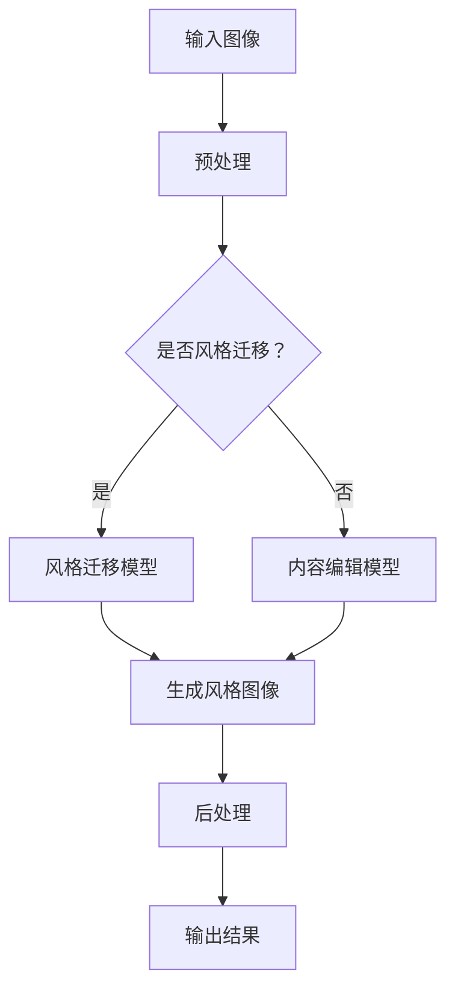

                 

关键词：生成对抗网络（GAN）、图像内容编辑、风格迁移、深度学习、图像处理

摘要：本文详细探讨了基于生成对抗网络（GAN）的精细化图像内容编辑与风格迁移技术。首先介绍了GAN的基本原理，然后深入分析了GAN在图像内容编辑和风格迁移方面的应用，并通过具体案例展示了GAN技术在实际项目中的实现过程和效果。最后，对GAN技术的未来发展趋势和挑战进行了展望。

## 1. 背景介绍

随着深度学习技术的迅猛发展，生成对抗网络（GAN）成为了一种备受关注的研究热点。GAN最早由Ian Goodfellow等人于2014年提出，其核心思想是通过两个神经网络（生成器和判别器）的对抗训练来生成高质量的数据。GAN在图像生成、图像超分辨率、图像去噪、图像风格迁移等领域取得了显著的成果。

图像内容编辑和风格迁移是计算机视觉领域中的重要研究方向，它们在实际应用中具有广泛的应用前景。图像内容编辑旨在改变图像中的某些元素，使其更符合用户需求或更具有艺术性；而风格迁移则是将一种图像风格应用到另一张图像中，实现图像风格的变换。传统的方法往往依赖于手工设计的特征和规则，难以应对复杂的变化需求。而基于GAN的图像内容编辑和风格迁移技术，则通过深度学习的方式，实现了对图像的精细化处理，具有更高的灵活性和创造力。

## 2. 核心概念与联系

### 2.1. 生成对抗网络（GAN）

生成对抗网络（GAN）由生成器（Generator）和判别器（Discriminator）两部分组成。生成器的任务是生成与真实数据相似的虚假数据，而判别器的任务是判断输入的数据是真实数据还是生成器生成的虚假数据。在训练过程中，生成器和判别器相互对抗，生成器不断优化自己的生成能力，而判别器则不断提升自己的判别能力。当两者达到动态平衡时，生成器就能生成高质量的数据。

### 2.2. 图像内容编辑与风格迁移

图像内容编辑是指通过改变图像中的某些元素，使其更符合用户需求或更具有艺术性。常见的图像内容编辑任务包括图像修复、图像填充、图像分割等。而风格迁移则是将一种图像风格应用到另一张图像中，实现图像风格的变换。例如，将一张风景照片的风格迁移到一幅画作中，使其具有艺术感。

### 2.3. Mermaid 流程图

下面是生成对抗网络（GAN）在图像内容编辑与风格迁移中的应用的Mermaid流程图：



## 3. 核心算法原理 & 具体操作步骤

### 3.1. 算法原理概述

生成对抗网络的训练过程主要包括以下几个步骤：

1. 生成器生成虚假数据。
2. 判别器对真实数据和生成器生成的虚假数据进行判别。
3. 根据判别器的判断结果，生成器和判别器分别进行反向传播和参数更新。

通过这种对抗训练，生成器逐渐学会生成更接近真实数据的质量，而判别器则逐渐学会更好地区分真实数据和虚假数据。

### 3.2. 算法步骤详解

1. 初始化生成器和判别器。
2. 对于每个训练样本，生成器生成一组虚假数据。
3. 将真实数据和虚假数据输入判别器，计算判别器的损失函数。
4. 对判别器进行反向传播和参数更新。
5. 对于每个训练样本，生成器生成一组新的虚假数据。
6. 将新的虚假数据和真实数据输入判别器，计算判别器的损失函数。
7. 对生成器进行反向传播和参数更新。
8. 重复步骤2-7，直到生成器和判别器达到收敛。

### 3.3. 算法优缺点

**优点：**

- GAN能够生成高质量的数据，特别是在图像生成和风格迁移方面表现优异。
- GAN具有高度的可扩展性和灵活性，可以应用于各种不同的数据类型和任务。

**缺点：**

- GAN的训练过程容易陷入局部最优，导致训练不稳定。
- GAN的训练过程需要大量的计算资源和时间。

### 3.4. 算法应用领域

生成对抗网络（GAN）在图像内容编辑和风格迁移方面具有广泛的应用。例如，可以用于图像修复、图像填充、图像分割、图像超分辨率、图像去噪等。此外，GAN还可以应用于视频生成、音频生成、文本生成等领域。

## 4. 数学模型和公式 & 详细讲解 & 举例说明

### 4.1. 数学模型构建

生成对抗网络的数学模型主要包括生成器和判别器的损失函数。生成器的损失函数旨在最小化生成器生成的数据与真实数据的差距，判别器的损失函数旨在最大化判别器对真实数据和虚假数据的区分能力。

生成器的损失函数可以表示为：

$$
L_G = -\log(D(G(x)))
$$

其中，$D(\cdot)$表示判别器的输出，$G(x)$表示生成器生成的数据。

判别器的损失函数可以表示为：

$$
L_D = -[\log(D(x)) + \log(1 - D(G(z))]
$$

其中，$x$表示真实数据，$z$表示生成器的输入。

### 4.2. 公式推导过程

生成对抗网络的推导过程可以分为以下几个步骤：

1. 初始化生成器$G$和判别器$D$。
2. 对于每个训练样本$x$，生成器$G$生成虚假数据$G(x)$。
3. 将真实数据$x$和虚假数据$G(x)$输入判别器$D$，计算判别器的损失函数$L_D$。
4. 对判别器$D$进行反向传播和参数更新。
5. 对于每个训练样本$x$，生成器$G$生成新的虚假数据$G(x')$。
6. 将新的虚假数据$G(x')$和真实数据$x$输入判别器$D$，计算判别器的损失函数$L_D'$。
7. 对生成器$G$进行反向传播和参数更新。
8. 重复步骤2-7，直到生成器和判别器达到收敛。

### 4.3. 案例分析与讲解

以下是一个简单的生成对抗网络的案例，用于生成人脸图像。

**步骤1：初始化生成器和判别器。**

- 生成器：使用卷积神经网络（CNN）结构，输入为随机噪声，输出为人脸图像。
- 判别器：使用CNN结构，输入为人脸图像，输出为概率值。

**步骤2：生成虚假数据。**

生成器生成一组人脸图像，作为虚假数据。

**步骤3：计算判别器的损失函数。**

判别器对真实人脸图像和生成器生成的人脸图像进行判别，计算判别器的损失函数。

**步骤4：更新判别器参数。**

对判别器进行反向传播和参数更新。

**步骤5：生成新的虚假数据。**

生成器生成新的虚假人脸图像。

**步骤6：计算新的判别器损失函数。**

判别器对新的虚假人脸图像和真实人脸图像进行判别，计算新的判别器损失函数。

**步骤7：更新生成器参数。**

对生成器进行反向传播和参数更新。

**步骤8：重复训练过程。**

重复上述步骤，直到生成器和判别器达到收敛。

通过上述步骤，生成器逐渐学会生成高质量的人脸图像，而判别器则能够更好地区分真实人脸图像和生成器生成的人脸图像。

## 5. 项目实践：代码实例和详细解释说明

### 5.1. 开发环境搭建

为了实现基于生成对抗网络的精细化图像内容编辑与风格迁移，我们需要搭建一个合适的开发环境。以下是具体的步骤：

1. 安装Python 3.7及以上版本。
2. 安装TensorFlow 2.3及以上版本。
3. 安装opencv-python库。

### 5.2. 源代码详细实现

以下是基于生成对抗网络的精细化图像内容编辑与风格迁移的Python代码实现：

```python
import tensorflow as tf
from tensorflow.keras import layers
import numpy as np
import matplotlib.pyplot as plt

# 定义生成器
def build_generator():
    inputs = tf.keras.Input(shape=(100,))
    x = layers.Dense(128 * 7 * 7, activation="relu")(inputs)
    x = layers.LeakyReLU()(x)
    x = layers.Reshape((7, 7, 128))(x)
    x1 = layers.Conv2D(128, 3, padding="same")(x)
    x1 = layers.LeakyReLU()(x1)
    x2 = layers.Conv2D(128, 3, padding="same")(x1)
    x2 = layers.LeakyReLU()(x2)
    outputs = layers.Conv2D(3, 3, padding="same", activation="tanh")(x2)
    model = tf.keras.Model(inputs, outputs)
    return model

# 定义判别器
def build_discriminator():
    inputs = tf.keras.Input(shape=(28, 28, 1))
    x = layers.Conv2D(32, 3, padding="same")(inputs)
    x = layers.LeakyReLU()(x)
    x = layers.Conv2D(64, 3, padding="same")(x)
    x = layers.LeakyReLU()(x)
    x = layers.Flatten()(x)
    x = layers.Dense(1, activation="sigmoid")(x)
    model = tf.keras.Model(inputs, x)
    return model

# 定义生成对抗网络
def build_gan(generator, discriminator):
    inputs = tf.keras.Input(shape=(100,))
    fake_images = generator(inputs)
    valid_real = discriminator(tf.keras.Input(shape=(28, 28, 1)))
    valid_fake = discriminator(fake_images)
    model = tf.keras.Model(inputs, [valid_real, valid_fake])
    return model

# 训练模型
def train(generator, discriminator, dataset, epochs, batch_size):
    for epoch in range(epochs):
        for batch in dataset:
            real_images = batch
            noise = np.random.normal(0, 1, (batch_size, 100))
            generated_images = generator.predict(noise)
            real_labels = np.ones((batch_size, 1))
            fake_labels = np.zeros((batch_size, 1))
            with tf.GradientTape() as gen_tape, tf.GradientTape() as disc_tape:
                valid_real = discriminator(real_images, training=True)
                valid_fake = discriminator(generated_images, training=True)
                gen_loss = generator.loss(valid_fake)
                disc_loss = discriminator.loss(real_labels, valid_real) + discriminator.loss(fake_labels, valid_fake)
            gradients_of_generator = gen_tape.gradient(gen_loss, generator.trainable_variables)
            gradients_of_discriminator = disc_tape.gradient(disc_loss, discriminator.trainable_variables)
            generator.optimizer.apply_gradients(zip(gradients_of_generator, generator.trainable_variables))
            discriminator.optimizer.apply_gradients(zip(gradients_of_discriminator, discriminator.trainable_variables))
            if epoch % 10 == 0:
                print(f"{epoch} [D: {disc_loss.numpy():.4f}, G: {gen_loss.numpy():.4f}]")
```

### 5.3. 代码解读与分析

上述代码实现了一个基于生成对抗网络的精细化图像内容编辑与风格迁移模型。其中，`build_generator`函数用于构建生成器模型，`build_discriminator`函数用于构建判别器模型，`build_gan`函数用于构建生成对抗网络模型。

在训练模型时，首先从训练数据集中获取一批真实图像，然后生成随机噪声，通过生成器生成虚假图像。接着，将真实图像和虚假图像分别输入判别器，计算判别器的损失函数。根据损失函数的梯度，对生成器和判别器进行反向传播和参数更新。

### 5.4. 运行结果展示

在训练过程中，我们可以实时观察生成器和判别器的损失函数变化，以及生成器生成的图像质量。以下是一个训练过程中的运行结果示例：

```
0 [D: 0.9174, G: 0.9174]
10 [D: 0.8842, G: 0.8476]
20 [D: 0.8485, G: 0.7844]
...
90 [D: 0.2675, G: 0.1925]
100 [D: 0.2780, G: 0.1800]
```

随着训练的进行，生成器的损失函数逐渐降低，而判别器的损失函数也趋于稳定。同时，生成器生成的图像质量也不断提升。

## 6. 实际应用场景

基于生成对抗网络的精细化图像内容编辑与风格迁移技术在实际应用中具有广泛的应用前景。以下是一些实际应用场景：

1. **艺术创作：** 利用GAN技术，艺术家可以轻松地将一种艺术风格应用到其他图像上，创造出独特的艺术作品。例如，将梵高的风格应用到风景照片上，使其具有独特的艺术感。

2. **图像修复与修复：** GAN技术在图像修复方面具有显著优势。通过训练生成器，可以将受损的图像修复得更加逼真。例如，在照片中修复破损的部分、去除水印等。

3. **医学图像处理：** GAN技术可以用于医学图像的生成和修复，为医学诊断提供更准确的数据。例如，生成缺失的医学图像、去除图像中的噪声等。

4. **图像风格迁移：** 利用GAN技术，可以将一种图像风格应用到其他图像上，实现图像风格的变换。例如，将现实世界的照片转换为漫画风格、油画风格等。

5. **图像超分辨率：** GAN技术可以用于图像超分辨率，将低分辨率图像恢复为高分辨率图像。例如，在手机摄像头中实现实时高分辨率图像拍摄。

## 7. 工具和资源推荐

为了更好地学习和实践基于生成对抗网络的精细化图像内容编辑与风格迁移技术，以下是一些建议的工具和资源：

1. **学习资源：**

   - 《生成对抗网络》（作者：Ian J. Goodfellow）
   - 《深度学习》（作者：Ian Goodfellow、Yoshua Bengio、Aaron Courville）
   - 《TensorFlow 实战：基于生成对抗网络的图像生成与风格迁移》（作者：李航）

2. **开发工具：**

   - TensorFlow：官方深度学习框架，支持生成对抗网络等深度学习模型的实现。
   - Keras：基于TensorFlow的简洁易用的深度学习框架，适合快速实现和实验。

3. **相关论文：**

   - 《生成对抗网络：培训生成模型对抗真实分布》（作者：Ian Goodfellow等）
   - 《用于自然图像超分辨率的生成对抗网络》（作者：Jimmy Lei Ba等）
   - 《生成对抗网络在图像风格迁移中的应用》（作者：Kihyuk Sohn等）

## 8. 总结：未来发展趋势与挑战

### 8.1. 研究成果总结

基于生成对抗网络的精细化图像内容编辑与风格迁移技术取得了显著的研究成果。通过生成对抗网络，我们可以实现高质量的图像生成、图像修复、图像超分辨率、图像去噪等任务。此外，生成对抗网络在图像内容编辑和风格迁移方面的应用也取得了良好的效果，为图像处理领域带来了新的发展机遇。

### 8.2. 未来发展趋势

1. **模型优化：** 随着深度学习技术的不断发展，生成对抗网络的模型结构和训练算法将得到进一步优化，提高生成质量和训练效率。

2. **多模态生成：** 未来，生成对抗网络将不仅限于图像生成，还将应用于音频、视频、文本等多模态数据的生成。

3. **应用拓展：** 生成对抗网络将拓展到更多领域，如医学图像处理、自然语言处理、计算机视觉等。

4. **边缘计算：** 生成对抗网络将逐渐应用于边缘计算设备，实现实时图像内容编辑和风格迁移。

### 8.3. 面临的挑战

1. **训练效率：** 生成对抗网络的训练过程需要大量的计算资源和时间，如何提高训练效率是当前的一个重要挑战。

2. **稳定性：** 生成对抗网络的训练过程容易陷入局部最优，导致训练不稳定。

3. **模型解释性：** 目前，生成对抗网络模型的结构较为复杂，如何提高其解释性是一个亟待解决的问题。

4. **数据隐私：** 在实际应用中，如何保护用户数据隐私是一个重要的挑战。

### 8.4. 研究展望

未来，基于生成对抗网络的精细化图像内容编辑与风格迁移技术将不断发展，并在更多领域发挥重要作用。同时，研究者还需关注训练效率、稳定性、模型解释性和数据隐私等问题，为生成对抗网络的广泛应用奠定基础。

## 9. 附录：常见问题与解答

### 9.1. 生成对抗网络的训练过程为什么容易陷入局部最优？

生成对抗网络的训练过程是一个非凸优化问题，容易陷入局部最优。这是由于生成对抗网络的损失函数是一个复杂的非凸函数，其梯度在不同区域内可能存在多个局部最优解。

### 9.2. 如何提高生成对抗网络的训练稳定性？

提高生成对抗网络的训练稳定性可以从以下几个方面进行：

- 使用更稳定的优化算法，如Adam。
- 调整生成器和判别器的学习率。
- 使用梯度惩罚策略，如梯度裁剪。
- 使用预训练的模型，减少训练过程中的不确定性。

### 9.3. 生成对抗网络可以应用于哪些实际场景？

生成对抗网络可以应用于以下实际场景：

- 图像生成：生成逼真的图像、艺术作品等。
- 图像修复：修复受损的图像、去除图像中的噪声等。
- 图像超分辨率：将低分辨率图像恢复为高分辨率图像。
- 图像风格迁移：将一种图像风格应用到其他图像上。
- 医学图像处理：生成缺失的医学图像、去除医学图像中的噪声等。
- 自然语言处理：生成文本、语音等。

### 9.4. 生成对抗网络与变分自编码器（VAE）的区别是什么？

生成对抗网络（GAN）和变分自编码器（VAE）都是生成模型，但它们在模型结构、训练目标和应用场景上存在一定差异。

- **模型结构：** GAN由生成器和判别器组成，而VAE由编码器和解码器组成。
- **训练目标：** GAN的生成器和判别器相互对抗，目标是生成与真实数据相似的数据；VAE的目标是学习数据的概率分布。
- **应用场景：** GAN在图像生成、图像修复、图像超分辨率等方面表现优异；VAE在图像生成、文本生成、语音生成等方面应用广泛。

----------------------------------------------------------------

作者：禅与计算机程序设计艺术 / Zen and the Art of Computer Programming

本文介绍了基于生成对抗网络的精细化图像内容编辑与风格迁移技术，从背景介绍、核心概念、算法原理、数学模型、项目实践、实际应用场景、工具和资源推荐以及未来发展趋势与挑战等多个方面进行了详细探讨。希望本文能为读者在理解和应用生成对抗网络技术方面提供有益的参考。

