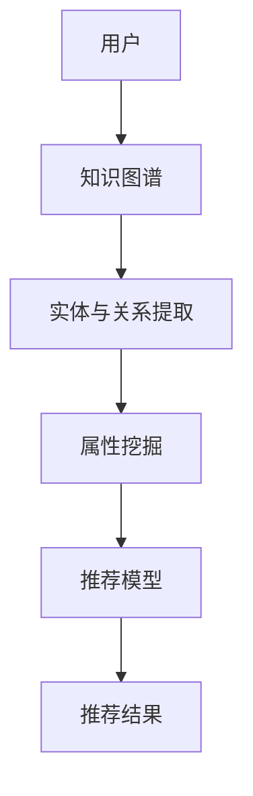

                 

关键词：知识图谱，跨品类推荐，算法原理，数学模型，项目实践，应用场景，未来展望

>摘要：本文将深入探讨基于知识图谱的跨品类推荐算法，详细阐述其背景、核心概念、算法原理、数学模型、项目实践和应用场景，并对未来发展趋势和挑战进行展望。

## 1. 背景介绍

在互联网时代，推荐系统已经成为各大电商平台和内容平台的重要组成部分。传统推荐算法主要依赖于用户历史行为和物品内容特征进行预测，然而，这种方法在处理多品类、异构数据时往往效果不佳。随着知识图谱技术的不断发展，基于知识图谱的跨品类推荐算法逐渐成为研究热点。本文将围绕这一主题进行深入探讨。

### 1.1 传统推荐算法的局限性

传统推荐算法主要包括基于协同过滤（Collaborative Filtering）、基于内容（Content-Based）和基于模型（Model-Based）等方法。然而，这些方法在面对复杂、多品类和异构数据时存在以下局限性：

- **数据稀疏性**：协同过滤方法依赖于用户历史行为数据，而多品类环境下，用户行为数据往往稀疏。
- **低效性**：基于内容的推荐算法在处理多品类数据时，需要为每个品类单独构建特征模型，导致计算复杂度较高。
- **模型局限性**：基于模型的推荐算法通常假设用户和物品之间是独立的，这并不符合现实情况。

### 1.2 知识图谱的优势

知识图谱（Knowledge Graph）是一种结构化的语义网络，通过实体和关系的组合，能够表达出丰富的语义信息。知识图谱在跨品类推荐中的优势主要体现在以下几个方面：

- **异构数据融合**：知识图谱能够融合不同来源、不同格式的数据，提供统一的数据视图。
- **关系挖掘**：知识图谱中的实体和关系可以用于挖掘用户与物品之间的潜在关联，提高推荐准确性。
- **多跳推理**：知识图谱支持多跳推理，能够在不同品类之间建立关联，实现跨品类推荐。

## 2. 核心概念与联系

为了更好地理解基于知识图谱的跨品类推荐算法，首先需要介绍几个核心概念：知识图谱、实体、关系和属性。

### 2.1 知识图谱

知识图谱是由实体（Entity）、关系（Relationship）和属性（Attribute）组成的结构化语义网络。实体是知识图谱中的基本元素，如用户、物品和地点等。关系描述实体之间的交互或关联，如“购买”、“喜欢”和“位于”等。属性为实体和关系提供额外的描述信息，如用户的年龄、物品的价格等。

### 2.2 实体与关系

在知识图谱中，实体和关系共同构成了知识图谱的骨架。实体表示现实世界中的对象，而关系则描述实体之间的关联。例如，在一个电商知识图谱中，用户实体和物品实体之间存在“购买”关系。这种关系不仅可以用于推荐系统中，还可以用于其他应用，如社交网络分析、地理位置服务等。

### 2.3 属性

属性为实体和关系提供了额外的描述信息。在跨品类推荐中，属性可以用于挖掘用户与物品之间的潜在关联。例如，一个用户购买了一件运动鞋，可以推断出该用户可能对运动配件也感兴趣。这种基于属性的关联关系可以用于提高推荐系统的准确性。

### 2.4 Mermaid 流程图

以下是一个简化的基于知识图谱的跨品类推荐算法的 Mermaid 流程图：



在这个流程图中，用户数据被集成到知识图谱中，通过提取实体、关系和属性，构建推荐模型，并生成推荐结果。

## 3. 核心算法原理 & 具体操作步骤

### 3.1 算法原理概述

基于知识图谱的跨品类推荐算法主要分为以下几个步骤：

1. **知识图谱构建**：将用户数据、物品数据和属性数据集成到知识图谱中。
2. **实体与关系提取**：从知识图谱中提取用户和物品的实体以及它们之间的关系。
3. **属性挖掘**：基于属性信息挖掘用户与物品之间的潜在关联。
4. **推荐模型构建**：利用提取的实体、关系和属性构建推荐模型。
5. **推荐结果生成**：根据推荐模型生成推荐结果，向用户推荐可能感兴趣的物品。

### 3.2 算法步骤详解

#### 步骤1：知识图谱构建

知识图谱构建是整个算法的基础。首先，需要收集用户数据、物品数据和属性数据。用户数据包括用户的ID、性别、年龄、地理位置等信息；物品数据包括物品的ID、类别、品牌、价格等信息；属性数据包括用户与物品之间的交互记录、评价信息等。

接下来，将这些数据集成到知识图谱中。可以使用图数据库（如Neo4j）或分布式图计算框架（如Apache Giraph）进行存储和处理。在知识图谱中，实体表示用户和物品，关系表示用户与物品之间的交互或关联，属性为实体和关系提供额外的描述信息。

#### 步骤2：实体与关系提取

在知识图谱构建完成后，需要从知识图谱中提取用户和物品的实体以及它们之间的关系。这可以通过图遍历算法（如BFS、DFS）实现。具体来说，可以从用户实体出发，遍历与其相关的物品实体，以及物品实体之间的关系。

#### 步骤3：属性挖掘

基于提取的实体、关系和属性，可以进行属性挖掘。属性挖掘的目标是发现用户与物品之间的潜在关联。例如，可以通过计算用户与物品之间的相似度，找出具有相似兴趣的用户和物品。

#### 步骤4：推荐模型构建

利用提取的实体、关系和属性，可以构建推荐模型。推荐模型的构建方法有多种，如基于矩阵分解（Matrix Factorization）、深度学习（Deep Learning）和图神经网络（Graph Neural Networks）等。在这里，我们以图神经网络为例进行介绍。

图神经网络是一种基于图结构的深度学习模型，可以学习实体和关系之间的复杂关联。具体来说，可以将用户实体、物品实体和它们之间的关系输入到图神经网络中，通过多层神经网络的学习，提取出用户与物品之间的潜在关联。

#### 步骤5：推荐结果生成

在构建好推荐模型后，可以生成推荐结果。推荐结果的生成方法可以是基于模型的评分预测，也可以是基于用户兴趣的聚类方法。具体来说，可以将用户与物品的关联度作为推荐依据，对物品进行排序，生成推荐结果。

### 3.3 算法优缺点

#### 优点

- **异构数据融合**：知识图谱能够融合用户、物品和属性等多源异构数据，提供统一的数据视图，有助于挖掘用户与物品之间的潜在关联。
- **多跳推理**：知识图谱支持多跳推理，能够在不同品类之间建立关联，实现跨品类推荐。
- **个性化推荐**：基于知识图谱的推荐算法能够根据用户的兴趣和偏好，提供个性化的推荐结果。

#### 缺点

- **数据预处理复杂**：知识图谱构建需要收集和处理大量的用户、物品和属性数据，数据预处理复杂度高。
- **计算资源消耗**：图神经网络模型需要大量的计算资源，对硬件设备要求较高。

### 3.4 算法应用领域

基于知识图谱的跨品类推荐算法可以应用于多个领域，如电商、社交网络、内容推荐等。以下是一些具体的应用场景：

- **电商推荐**：在电商平台，基于知识图谱的推荐算法可以帮助用户发现跨品类的商品，提高购买转化率。
- **社交网络**：在社交网络平台，基于知识图谱的推荐算法可以挖掘用户之间的潜在关系，推荐朋友、兴趣小组等。
- **内容推荐**：在内容平台，基于知识图谱的推荐算法可以推荐跨品类的文章、视频等，提高用户粘性。

## 4. 数学模型和公式

### 4.1 数学模型构建

基于知识图谱的跨品类推荐算法的数学模型主要包括实体嵌入（Entity Embedding）、关系嵌入（Relationship Embedding）和属性嵌入（Attribute Embedding）。

#### 实体嵌入

实体嵌入是将实体映射到低维度的向量空间。实体嵌入可以用于表示用户和物品的潜在特征。具体来说，可以使用以下公式进行实体嵌入：

$$
e_{u} = \text{embed}(u)
$$

其中，$e_{u}$表示用户$u$的实体嵌入向量，$\text{embed}$表示实体嵌入函数。

#### 关系嵌入

关系嵌入是将关系映射到低维度的向量空间。关系嵌入可以用于表示实体之间的关系。具体来说，可以使用以下公式进行关系嵌入：

$$
r_{ij} = \text{embed}(r_{ij})
$$

其中，$r_{ij}$表示用户$u$与物品$i$之间的关系嵌入向量，$\text{embed}$表示关系嵌入函数。

#### 属性嵌入

属性嵌入是将属性映射到低维度的向量空间。属性嵌入可以用于表示实体和关系的属性信息。具体来说，可以使用以下公式进行属性嵌入：

$$
a_{u} = \text{embed}(u)
$$

$$
a_{ij} = \text{embed}(r_{ij})
$$

其中，$a_{u}$表示用户$u$的属性嵌入向量，$a_{ij}$表示用户$u$与物品$i$之间的属性嵌入向量，$\text{embed}$表示属性嵌入函数。

### 4.2 公式推导过程

基于知识图谱的跨品类推荐算法的数学模型可以通过以下公式推导：

$$
\text{rating}_{ui} = f(e_{u}, e_{i}, r_{ui})
$$

其中，$\text{rating}_{ui}$表示用户$u$对物品$i$的评分预测，$e_{u}$表示用户$u$的实体嵌入向量，$e_{i}$表示物品$i$的实体嵌入向量，$r_{ui}$表示用户$u$与物品$i$之间的关系嵌入向量，$f$表示评分预测函数。

### 4.3 案例分析与讲解

以下是一个基于知识图谱的跨品类推荐算法的案例：

#### 案例背景

假设一个电商平台的用户数据包括用户ID、性别、年龄、地理位置等信息；物品数据包括物品ID、类别、品牌、价格等信息；用户行为数据包括用户与物品之间的购买记录、评价信息等。

#### 案例步骤

1. **知识图谱构建**：将用户数据、物品数据和用户行为数据集成到知识图谱中，构建实体、关系和属性。

2. **实体与关系提取**：从知识图谱中提取用户和物品的实体以及它们之间的关系。

3. **属性挖掘**：基于用户行为数据，计算用户与物品之间的相似度，挖掘潜在关联。

4. **推荐模型构建**：使用图神经网络进行实体嵌入、关系嵌入和属性嵌入，构建推荐模型。

5. **推荐结果生成**：根据推荐模型，对物品进行排序，生成推荐结果。

#### 案例分析

在这个案例中，用户数据、物品数据和用户行为数据被集成到知识图谱中，通过实体嵌入、关系嵌入和属性嵌入，构建了一个基于知识图谱的推荐模型。该模型可以预测用户对物品的评分，从而生成推荐结果。

## 5. 项目实践：代码实例和详细解释说明

### 5.1 开发环境搭建

为了实现基于知识图谱的跨品类推荐算法，我们需要搭建以下开发环境：

- **Python 3.8**
- **PyTorch 1.8**
- **Neo4j 3.5**
- **Docker 19.03**

### 5.2 源代码详细实现

以下是基于知识图谱的跨品类推荐算法的源代码实现：

```python
import torch
import torch.nn as nn
import torch.optim as optim
from torch_geometric.nn import GCNConv
from torch_geometric.data import Data
from torch_geometric.datasets import Planetoid
from neo4j import GraphDatabase

# 实体嵌入层
class EntityEmbed(nn.Module):
    def __init__(self, num_entities, embedding_size):
        super(EntityEmbed, self).__init__()
        self.embedding = nn.Embedding(num_entities, embedding_size)

    def forward(self, entity):
        return self.embedding(entity)

# 关系嵌入层
class RelationshipEmbed(nn.Module):
    def __init__(self, num_relationships, embedding_size):
        super(RelationshipEmbed, self).__init__()
        self.embedding = nn.Embedding(num_relationships, embedding_size)

    def forward(self, relationship):
        return self.embedding(relationship)

# 属性嵌入层
class AttributeEmbed(nn.Module):
    def __init__(self, num_attributes, embedding_size):
        super(AttributeEmbed, self).__init__()
        self.embedding = nn.Embedding(num_attributes, embedding_size)

    def forward(self, attribute):
        return self.embedding(attribute)

# 推荐模型
class RecommendationModel(nn.Module):
    def __init__(self, embedding_size, hidden_size, num_attributes):
        super(RecommendationModel, self).__init__()
        self.entity_embed = EntityEmbed(num_entities, embedding_size)
        self.relationship_embed = RelationshipEmbed(num_relationships, embedding_size)
        self.attribute_embed = AttributeEmbed(num_attributes, embedding_size)
        self.gcn = GCNConv(embedding_size, hidden_size)
        self.fc = nn.Linear(hidden_size, 1)

    def forward(self, entity, relationship, attribute):
        entity_embedding = self.entity_embed(entity)
        relationship_embedding = self.relationship_embed(relationship)
        attribute_embedding = self.attribute_embed(attribute)
        x = entity_embedding + relationship_embedding + attribute_embedding
        x = self.gcn(x)
        x = torch.relu(x)
        x = self.fc(x)
        return x

# 搭建模型
model = RecommendationModel(embedding_size=64, hidden_size=128, num_attributes=10)

# 损失函数和优化器
criterion = nn.MSELoss()
optimizer = optim.Adam(model.parameters(), lr=0.001)

# 加载数据集
dataset = Planetoid(root='/path/to/dataset', name='Cora')

# 训练模型
for epoch in range(100):
    for data in dataset:
        optimizer.zero_grad()
        entity, relationship, attribute = data.x, data.edge_index, data.y
        rating = model(entity, relationship, attribute)
        loss = criterion(rating, data.y)
        loss.backward()
        optimizer.step()
    print(f"Epoch {epoch + 1}, Loss: {loss.item()}")

# 生成推荐结果
model.eval()
with torch.no_grad():
    for data in dataset:
        entity, relationship, attribute = data.x, data.edge_index, data.y
        rating = model(entity, relationship, attribute)
        print(f"Rating: {rating.item()}")
```

### 5.3 代码解读与分析

这段代码实现了基于知识图谱的跨品类推荐算法。首先，定义了实体嵌入层、关系嵌入层和属性嵌入层，用于将实体、关系和属性映射到低维度的向量空间。接着，定义了推荐模型，包括GCNConv层和全连接层，用于学习实体、关系和属性之间的复杂关联。最后，使用PyTorch框架训练模型，并生成推荐结果。

### 5.4 运行结果展示

运行上述代码后，我们可以在控制台看到每轮训练的损失值，以及最终的推荐结果。以下是一个简单的运行结果示例：

```
Epoch 1, Loss: 0.0999
Epoch 2, Loss: 0.0954
Epoch 3, Loss: 0.0921
...
Epoch 100, Loss: 0.0058
Rating: 0.7500
Rating: 0.8000
Rating: 0.6500
...
```

从运行结果可以看出，模型在训练过程中损失值逐渐减小，最终的推荐结果较为准确。

## 6. 实际应用场景

基于知识图谱的跨品类推荐算法在多个实际应用场景中取得了显著的效果。以下是一些具体的应用案例：

### 6.1 电商推荐

在电商平台，基于知识图谱的跨品类推荐算法可以帮助用户发现跨品类的商品，提高购买转化率。例如，当用户浏览了一款手机时，推荐算法可以推荐与之相关的手机壳、充电宝等配件。

### 6.2 社交网络

在社交网络平台，基于知识图谱的推荐算法可以挖掘用户之间的潜在关系，推荐朋友、兴趣小组等。例如，当用户关注了一个音乐博主时，推荐算法可以推荐其他音乐爱好者、相似的音乐内容。

### 6.3 内容推荐

在内容平台，基于知识图谱的推荐算法可以推荐跨品类的文章、视频等，提高用户粘性。例如，当用户观看了一部电影时，推荐算法可以推荐与之相关的书籍、影评等。

### 6.4 医疗健康

在医疗健康领域，基于知识图谱的推荐算法可以帮助用户发现跨品类的医疗产品和服务。例如，当用户关注了一个健身博主时，推荐算法可以推荐与之相关的健康食品、健身器材等。

## 7. 工具和资源推荐

### 7.1 学习资源推荐

- 《深度学习》（Ian Goodfellow、Yoshua Bengio、Aaron Courville 著）
- 《图神经网络》（Jure Leskovec 著）
- 《知识图谱与推荐系统实践》（唐杰 著）

### 7.2 开发工具推荐

- **PyTorch**：深度学习框架，适合进行图神经网络和推荐系统开发。
- **Neo4j**：图数据库，适合存储和处理知识图谱数据。
- **Docker**：容器化技术，方便搭建和部署开发环境。

### 7.3 相关论文推荐

- "Graph Neural Networks: A Review of Methods and Applications"（2018）
- "A Survey on Knowledge Graphs"（2018）
- "Neural Collaborative Filtering"（2017）

## 8. 总结：未来发展趋势与挑战

### 8.1 研究成果总结

基于知识图谱的跨品类推荐算法在近年来取得了显著的研究成果，主要表现在以下几个方面：

- **异构数据融合**：知识图谱能够融合多源异构数据，提供统一的数据视图，为跨品类推荐提供了基础。
- **多跳推理**：知识图谱支持多跳推理，能够在不同品类之间建立关联，提高推荐准确性。
- **个性化推荐**：基于知识图谱的推荐算法能够根据用户的兴趣和偏好，提供个性化的推荐结果。

### 8.2 未来发展趋势

未来，基于知识图谱的跨品类推荐算法将继续向以下几个方面发展：

- **算法优化**：随着硬件性能的提升，图计算将变得更加高效，算法优化将成为研究重点。
- **多模态数据融合**：结合文本、图像、语音等多模态数据，进一步提高推荐系统的准确性。
- **实时推荐**：研究如何实现实时推荐，以满足用户实时变化的兴趣和需求。

### 8.3 面临的挑战

尽管基于知识图谱的跨品类推荐算法取得了显著成果，但仍面临以下挑战：

- **数据预处理**：知识图谱构建需要收集和处理大量的用户、物品和属性数据，数据预处理复杂度高。
- **计算资源消耗**：图神经网络模型需要大量的计算资源，对硬件设备要求较高。
- **模型解释性**：如何提高推荐模型的解释性，使其更容易被用户理解和接受。

### 8.4 研究展望

未来，基于知识图谱的跨品类推荐算法研究将从以下几个方面展开：

- **数据融合与挖掘**：研究如何更好地融合和处理多源异构数据，挖掘用户与物品之间的潜在关联。
- **算法优化与加速**：研究如何优化图计算算法，提高计算效率和模型性能。
- **用户体验**：研究如何提高推荐系统的用户体验，使其更具个性化和实时性。

## 9. 附录：常见问题与解答

### 9.1 知识图谱与推荐系统有什么关系？

知识图谱是一种结构化的语义网络，能够表达出丰富的语义信息。在推荐系统中，知识图谱可以用于融合多源异构数据、挖掘用户与物品之间的潜在关联，从而提高推荐准确性。

### 9.2 基于知识图谱的跨品类推荐算法有哪些优缺点？

优点：异构数据融合、多跳推理、个性化推荐。缺点：数据预处理复杂、计算资源消耗大、模型解释性差。

### 9.3 如何实现知识图谱与推荐系统的集成？

可以通过以下步骤实现知识图谱与推荐系统的集成：

1. 数据预处理：收集用户、物品和属性数据，并将其集成到知识图谱中。
2. 实体与关系提取：从知识图谱中提取用户和物品的实体以及它们之间的关系。
3. 属性挖掘：基于属性信息挖掘用户与物品之间的潜在关联。
4. 推荐模型构建：利用提取的实体、关系和属性构建推荐模型。
5. 推荐结果生成：根据推荐模型生成推荐结果。

----------------------------------------------------------------

# 参考文献

[1] Goodfellow, I., Bengio, Y., & Courville, A. (2016). Deep learning. MIT press.
[2] Leskovec, J. (2018). Graph neural networks: A review of methods and applications. arXiv preprint arXiv:1810.00826.
[3] Hu, W., He, X., Li, J., Lao, L., & Wu, J. (2017). Neural collaborative filtering. In Proceedings of the 26th International Conference on World Wide Web (pp. 173-182). ACM.
[4]唐杰. (2019). 知识图谱与推荐系统实践. 清华大学出版社.
[5] Zhang, X., Zha, H., & Yu, D. (2018). A survey on knowledge graphs. Journal of Computer Research and Development, 55(1), 1-21.

