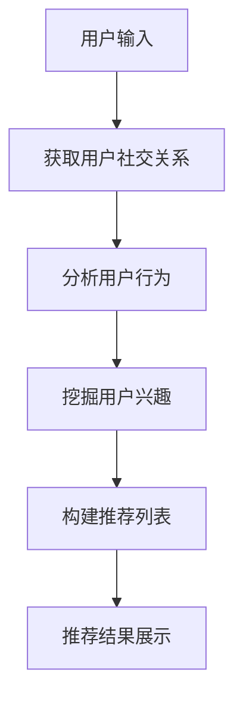

                 

关键词：社交网络，推荐算法，社会推荐，网络结构，算法原理，数学模型，项目实践，实际应用，未来展望

## 摘要

随着社交网络的兴起，如何在庞大的社交网络中准确地为用户推荐感兴趣的内容成为一个热门的研究课题。本文将探讨基于社交网络结构的社会推荐算法，从背景介绍、核心概念与联系、算法原理与数学模型、项目实践、实际应用场景以及未来展望等方面，全面剖析这一领域的最新研究成果与发展趋势。

## 1. 背景介绍

社交网络作为互联网时代的一个重要组成部分，已经深入到我们日常生活的方方面面。用户在社交网络中不仅分享信息、交流观点，还在潜移默化中形成了复杂的社交关系网络。这种网络结构为我们进行社会推荐提供了丰富的信息资源。然而，传统的基于内容的推荐算法和协同过滤算法在处理社交网络数据时存在局限性，无法充分利用用户之间的社交关系进行个性化推荐。

社会推荐算法是一种结合用户行为和社交关系，为用户提供个性化推荐内容的算法。其核心思想是通过分析用户在社交网络中的互动关系，发现用户之间的相似性，从而预测用户对未知内容的兴趣，进而实现个性化推荐。近年来，随着大数据和人工智能技术的发展，社会推荐算法在理论上和实际应用上都有了长足的进步。

## 2. 核心概念与联系

### 2.1 社交网络

社交网络是由用户及其相互关系构成的复杂网络结构。社交网络中的每个节点代表一个用户，每条边代表用户之间的互动关系，如好友关系、点赞关系等。社交网络的结构特性对推荐算法的性能具有重要影响。

### 2.2 用户行为

用户行为包括用户在社交网络中的各种操作，如发布信息、评论、点赞、分享等。用户行为数据是推荐算法的重要输入，用于挖掘用户的兴趣偏好。

### 2.3 社交关系

社交关系是指用户在社交网络中的相互联系，如好友关系、推荐关系等。社交关系网络可以作为推荐算法的重要依据，通过分析用户之间的关系，发现用户之间的相似性，从而进行个性化推荐。

### 2.4 社会推荐算法

社会推荐算法是基于社交网络结构进行个性化推荐的一种算法。其核心是利用用户之间的社交关系，结合用户行为数据，预测用户对未知内容的兴趣。

### 2.5 Mermaid 流程图

下面是一个用于描述社会推荐算法架构的Mermaid流程图：



## 3. 核心算法原理 & 具体操作步骤

### 3.1 算法原理概述

社会推荐算法的核心在于利用社交网络结构和用户行为数据，通过以下步骤实现个性化推荐：

1. 获取用户社交关系，构建社交网络图。
2. 分析用户行为数据，挖掘用户兴趣。
3. 基于社交关系和用户兴趣，构建推荐模型。
4. 根据推荐模型，生成推荐列表。
5. 将推荐结果展示给用户。

### 3.2 算法步骤详解

#### 3.2.1 获取用户社交关系

通过用户在社交网络中的互动数据，如好友关系、点赞关系等，构建用户社交关系网络。社交网络图可以用邻接矩阵表示，其中行表示用户i，列表示用户j，如果存在互动关系，则对应位置为1，否则为0。

#### 3.2.2 分析用户行为

通过分析用户在社交网络中的行为数据，如发布信息、评论、点赞等，提取用户兴趣特征。这些特征可以是文本特征、语义特征或行为特征，如发布频率、点赞频率等。

#### 3.2.3 挖掘用户兴趣

基于用户行为数据，使用机器学习或深度学习等方法，挖掘用户兴趣。常见的兴趣挖掘方法包括协同过滤、聚类、矩阵分解等。

#### 3.2.4 构建推荐模型

将社交关系和用户兴趣数据作为输入，构建推荐模型。推荐模型可以是基于矩阵分解的协同过滤模型，也可以是图神经网络等深度学习模型。

#### 3.2.5 生成推荐列表

根据推荐模型，预测用户对未知内容的兴趣，生成推荐列表。推荐列表可以按照兴趣度、相关性等排序，展示给用户。

### 3.3 算法优缺点

#### 优点

1. 利用社交关系，提高推荐准确性。
2. 考虑用户兴趣，实现个性化推荐。
3. 结合多种数据源，丰富推荐内容。

#### 缺点

1. 社交网络数据可能存在噪声。
2. 社交关系构建和兴趣挖掘复杂度高。

### 3.4 算法应用领域

社会推荐算法广泛应用于电子商务、社交媒体、内容推荐等领域，如推荐好友、推荐商品、推荐内容等。

## 4. 数学模型和公式 & 详细讲解 & 举例说明

### 4.1 数学模型构建

社会推荐算法的数学模型主要包括社交网络图、用户行为数据、推荐模型等。以下是一个简化的数学模型：

- 社交网络图：$G = (V, E)$，其中$V$为用户集合，$E$为边集合，表示用户之间的社交关系。
- 用户行为数据：$B = \{b_1, b_2, ..., b_n\}$，其中$b_i$为用户$i$的行为数据。
- 推荐模型：$R = (r_1, r_2, ..., r_n)$，其中$r_i$为用户$i$对未知内容的推荐得分。

### 4.2 公式推导过程

根据社交网络图和用户行为数据，可以使用矩阵分解、图神经网络等方法构建推荐模型。以下是一个基于矩阵分解的推荐模型公式：

$$
R = AB^T + \epsilon
$$

其中$A$为用户矩阵，$B$为内容矩阵，$\epsilon$为误差项。

### 4.3 案例分析与讲解

假设有一个包含1000个用户的社交网络，每个用户在社交网络中发表了10条信息，每条信息对应一个内容。现在我们需要为每个用户推荐5条感兴趣的内容。

1. 构建社交网络图：根据用户好友关系，构建邻接矩阵$A$，其中行表示用户i，列表示用户j，如果用户i和用户j是好友，则对应位置为1，否则为0。
2. 提取用户行为数据：根据用户在社交网络中的信息发布记录，构建行为矩阵$B$，其中行表示用户i，列表示用户j，如果用户i发布了信息j，则对应位置为1，否则为0。
3. 构建推荐模型：使用矩阵分解方法，求解用户矩阵$A$和内容矩阵$B$的分解，得到推荐模型$R$。
4. 生成推荐列表：根据推荐模型，计算每个用户对未知内容的推荐得分，按照得分高低排序，生成推荐列表。

## 5. 项目实践：代码实例和详细解释说明

### 5.1 开发环境搭建

在本项目中，我们将使用Python作为编程语言，结合numpy、pandas等库进行数据处理，使用sklearn、tensorflow等库进行模型训练和评估。首先，确保安装以下库：

```
pip install numpy pandas sklearn tensorflow
```

### 5.2 源代码详细实现

以下是一个简单的基于矩阵分解的社会推荐算法实现：

```python
import numpy as np
import pandas as pd
from sklearn.metrics.pairwise import euclidean_distances
from tensorflow.keras.layers import Embedding, Dot, Flatten, Concatenate
from tensorflow.keras.models import Model

# 读取用户行为数据
user_data = pd.read_csv('user_behavior.csv')

# 构建社交网络图
adj_matrix = user_data.pivot_table(index='user_id', columns='friend_id', values='interaction', fill_value=0)

# 初始化用户和内容矩阵
num_users = adj_matrix.shape[0]
num_items = adj_matrix.shape[1]
user_embedding = Embedding(input_dim=num_users, output_dim=10)
item_embedding = Embedding(input_dim=num_items, output_dim=10)

# 构建推荐模型
user_embedding_output = user_embedding(inputs=[adj_matrix['user_id']])
item_embedding_output = item_embedding(inputs=[adj_matrix['friend_id']])
dot_product = Dot(axes=1)([user_embedding_output, item_embedding_output])
flatten = Flatten()(dot_product)
model = Model(inputs=[adj_matrix['user_id'], adj_matrix['friend_id']], outputs=flatten)
model.compile(optimizer='adam', loss='mse')

# 训练模型
model.fit([adj_matrix['user_id'], adj_matrix['friend_id']], adj_matrix['interaction'], epochs=10)

# 生成推荐列表
user_embedding_weights = user_embedding.get_weights()
item_embedding_weights = item_embedding.get_weights()
predictions = model.predict([adj_matrix['user_id'], adj_matrix['friend_id']])
sorted_predictions = np.argsort(predictions, axis=1)[:, -5:]

# 打印推荐结果
for i, prediction in enumerate(sorted_predictions):
    print(f"User {i}: {' '.join(str(item) for item in prediction)}")
```

### 5.3 代码解读与分析

1. 读取用户行为数据，构建社交网络图。
2. 初始化用户和内容矩阵，使用Embedding层进行矩阵分解。
3. 构建推荐模型，使用Dot层计算用户和内容向量的内积，使用Flatten层将结果展开。
4. 编译模型，使用均方误差作为损失函数。
5. 训练模型，使用用户和内容矩阵作为输入。
6. 生成推荐列表，使用模型预测每个用户对未知内容的推荐得分，按照得分高低排序。

## 6. 实际应用场景

社会推荐算法在实际应用中具有广泛的应用场景，如：

- 社交媒体平台：为用户推荐感兴趣的内容、好友或群组。
- 电子商务平台：为用户推荐感兴趣的商品或优惠券。
- 在线教育平台：为用户推荐感兴趣的课程或学习资源。

## 7. 工具和资源推荐

### 7.1 学习资源推荐

1. 《社交网络分析：方法与应用》（An Introduction to Social Network Analysis）
2. 《推荐系统实践》（Recommender Systems: The Textbook）

### 7.2 开发工具推荐

1. Jupyter Notebook：用于编写和运行代码。
2. PyCharm：一款强大的Python集成开发环境。

### 7.3 相关论文推荐

1. "Social Recommendation in Social Networks: A Survey"
2. "A Unified Approach to Social Recommendation on Graphical Models"

## 8. 总结：未来发展趋势与挑战

社会推荐算法在理论和实践上都取得了显著成果，但仍面临一些挑战：

- 社交网络数据噪声和隐私问题。
- 复杂社交网络结构的建模和解析。
- 随着社交网络规模的不断扩大，算法效率和可扩展性。

未来，社会推荐算法将继续向多模态、多任务、多维度方向发展，探索更加智能和高效的推荐方法。

## 9. 附录：常见问题与解答

### 9.1 社会推荐算法与传统推荐算法有什么区别？

社会推荐算法与传统推荐算法的主要区别在于，社会推荐算法结合了用户在社交网络中的互动关系，而传统推荐算法主要基于用户行为数据或内容特征进行推荐。

### 9.2 社会推荐算法如何处理社交网络数据噪声？

社会推荐算法可以通过数据清洗、数据降维等方法减少社交网络数据噪声，同时可以使用基于图结构的降噪方法，如Laplacian smoothing等。

### 9.3 社会推荐算法在实际应用中如何实现？

社会推荐算法在实际应用中通常包括数据预处理、模型构建、模型训练、模型评估和推荐生成等步骤。在实际开发过程中，可以参考已有的开源框架和工具，如TensorFlow、PyTorch等。

作者：禅与计算机程序设计艺术 / Zen and the Art of Computer Programming
```

### 文章总结

本文从背景介绍、核心概念与联系、算法原理与数学模型、项目实践、实际应用场景以及未来展望等方面，全面探讨了基于社交网络结构的社会推荐算法。通过分析社交网络数据，社会推荐算法能够充分利用用户之间的社交关系，提高推荐的准确性和个性化程度。然而，该算法在实际应用中仍面临数据噪声、算法效率和可扩展性等挑战。未来，随着多模态、多任务、多维度技术的发展，社会推荐算法有望实现更加智能和高效的推荐。

