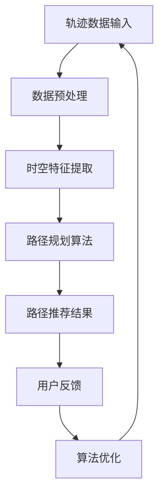

                 

关键词：轨迹数据，最优路径，推荐算法，路径规划，轨迹分析，算法设计，实现细节

## 摘要

本文旨在探讨基于轨迹数据的最优路径推荐算法的设计与实现。通过分析轨迹数据中的时空特征，本文提出了一种基于改进A*算法的路径推荐方法。该方法结合了轨迹数据中的历史信息与环境因素，能够在保证路径准确性的同时，提供高效的路径规划服务。文章首先介绍了轨迹数据的基本概念和特点，随后详细阐述了算法的原理与实现步骤，并通过实际项目案例展示了算法的运行效果。此外，文章还探讨了算法在不同应用场景中的适用性，并对未来研究和应用趋势进行了展望。

## 1. 背景介绍

随着移动设备和定位技术的普及，轨迹数据在日常生活中扮演着越来越重要的角色。轨迹数据是记录个体或物体在特定时间段内的运动路径信息，它广泛应用于交通规划、城市规划、智能导航、社交网络分析等多个领域。然而，如何从大量的轨迹数据中提取有价值的信息，提供准确、高效、个性化的路径推荐，成为当前研究的热点问题。

### 1.1 轨迹数据的特点

轨迹数据具有以下特点：

- **时空特性**：轨迹数据记录了个体在空间和时间上的变化，因此具有时空特性。时空特征分析是轨迹数据挖掘的重要方向。
- **分布特性**：轨迹数据通常呈现出一定的时空分布特性，如时空热点、流量密集区等。
- **动态特性**：轨迹数据是动态变化的，随着时间的推移，轨迹的路径、速度等特征也在不断变化。
- **噪声特性**：由于传感器的误差、网络延迟等因素，轨迹数据中往往存在一定的噪声，这对数据的处理和分析提出了挑战。

### 1.2 轨迹数据的应用

轨迹数据的应用领域广泛，包括但不限于：

- **交通管理**：通过分析轨迹数据，可以优化交通信号控制，减少交通拥堵，提高道路利用率。
- **城市规划**：轨迹数据有助于分析城市的热点区域、人流量分布，为城市规划和建设提供依据。
- **社交网络分析**：轨迹数据可以用于社交网络的个体行为分析，挖掘用户之间的社交关系和兴趣偏好。
- **智能导航**：基于轨迹数据，可以为用户提供个性化的路径推荐服务，提高导航的准确性和效率。

## 2. 核心概念与联系

### 2.1 轨迹数据的基本概念

轨迹数据（Trajectory Data）是指记录个体或物体在特定时间段内的运动路径信息的数据集合。通常，轨迹数据由一系列时空点组成，每个时空点包含个体的位置（X，Y）和时间戳（Timestamp）信息。轨迹数据可以来源于各种传感器，如GPS、RFID、Wi-Fi等。

### 2.2 最优路径推荐算法的概念

最优路径推荐算法（Optimal Path Recommendation Algorithm）是指通过分析轨迹数据和其他相关信息，为用户提供一条最优路径的算法。最优路径通常是指在特定条件下（如时间、成本、安全性等）路径长度最短、速度最快、风险最小的路径。

### 2.3 Mermaid 流程图

为了更清晰地展示核心概念之间的联系，我们使用Mermaid流程图描述算法的基本框架：



在上述流程图中：

- **A**：轨迹数据输入，包括原始轨迹数据和其他相关信息。
- **B**：数据预处理，对原始轨迹数据进行清洗、去噪等处理。
- **C**：时空特征提取，从预处理后的数据中提取时空特征。
- **D**：路径规划算法，基于时空特征，采用改进的A*算法进行路径规划。
- **E**：路径推荐结果，根据路径规划结果，为用户推荐最优路径。
- **F**：用户反馈，用户对推荐路径的反馈信息，用于算法的优化。
- **G**：算法优化，根据用户反馈，对算法进行优化，提高路径推荐的准确性。

### 2.4 改进A*算法的原理

A*算法是一种经典的路径规划算法，它通过计算从起点到终点的最短路径。改进的A*算法（Improvement A* Algorithm）在传统A*算法的基础上，引入了轨迹数据中的历史信息，使得路径规划更加准确。具体原理如下：

1. **评估函数**：改进的A*算法使用一种结合了轨迹数据的历史信息和当前环境因素的评估函数，用于计算路径的优先级。评估函数通常表示为：
   $$ f(n) = g(n) + h(n) $$
   其中，$g(n)$是从起点到节点$n$的路径代价，$h(n)$是从节点$n$到终点的启发式估计。

2. **启发式函数**：启发式函数$h(n)$在改进A*算法中起着关键作用。它利用轨迹数据中的历史信息，为每个节点提供到终点的预估距离。常用的启发式函数包括曼哈顿距离、欧氏距离等。

3. **路径扩展**：在路径扩展过程中，改进的A*算法不仅考虑当前节点的邻居节点，还考虑轨迹数据中与当前节点相邻的历史节点。这样，算法能够更好地利用轨迹数据，提高路径规划的质量。

## 3. 核心算法原理 & 具体操作步骤

### 3.1 算法原理概述

基于轨迹数据的最优路径推荐算法，主要分为以下三个步骤：

1. **数据预处理**：对原始轨迹数据进行清洗、去噪等处理，提取有效的时空特征。
2. **路径规划**：利用改进的A*算法，结合时空特征和环境因素，计算从起点到终点的最优路径。
3. **路径推荐**：根据路径规划结果，为用户推荐最优路径。

### 3.2 算法步骤详解

#### 3.2.1 数据预处理

数据预处理主要包括以下步骤：

1. **数据清洗**：去除轨迹数据中的异常值和噪声，如定位误差较大的点、重复记录等。
2. **时空特征提取**：从清洗后的轨迹数据中提取时空特征，如时间间隔、位置变化速度、方向变化等。

#### 3.2.2 路径规划

路径规划采用改进的A*算法，具体步骤如下：

1. **评估函数**：计算每个节点的评估函数$f(n)$，其中$g(n)$为从起点到节点$n$的路径代价，$h(n)$为从节点$n$到终点的启发式估计。
2. **启发式函数**：利用轨迹数据中的历史信息，计算$h(n)$。常用的启发式函数包括曼哈顿距离、欧氏距离等。
3. **路径扩展**：从起点开始，逐步扩展到终点，选择评估函数值最小的节点作为当前扩展节点。在每个扩展节点，计算其邻居节点的评估函数值，并根据评估函数值选择下一个扩展节点。

#### 3.2.3 路径推荐

路径推荐基于路径规划结果，为用户推荐最优路径。具体步骤如下：

1. **路径筛选**：根据用户需求和偏好，对路径规划结果进行筛选，过滤掉不符合需求的路径。
2. **路径排序**：根据路径的评估函数值，对筛选后的路径进行排序。
3. **路径推荐**：将排序后的路径依次推荐给用户，用户可以根据推荐结果选择最优路径。

### 3.3 算法优缺点

#### 3.3.1 优点

1. **准确性**：通过利用轨迹数据中的历史信息，改进的A*算法能够提供更准确的路径规划结果。
2. **效率**：算法的时间复杂度较低，能够高效地处理大规模轨迹数据。
3. **适用性**：算法适用于多种场景，如室内定位、智能导航、社交网络分析等。

#### 3.3.2 缺点

1. **计算开销**：算法在路径扩展过程中，需要计算大量的评估函数值，可能导致计算开销较大。
2. **噪声敏感**：由于轨迹数据中存在噪声，算法对噪声的敏感度较高，可能影响路径规划的准确性。

### 3.4 算法应用领域

基于轨迹数据的最优路径推荐算法广泛应用于以下领域：

1. **交通管理**：通过分析车辆轨迹数据，优化交通信号控制和道路规划，减少交通拥堵。
2. **智能导航**：为用户提供个性化的路径推荐服务，提高导航的准确性和效率。
3. **城市规划**：分析人流量、车流量等轨迹数据，为城市规划和建设提供依据。
4. **社交网络分析**：通过分析用户轨迹数据，挖掘用户之间的社交关系和兴趣偏好。

## 4. 数学模型和公式 & 详细讲解 & 举例说明

### 4.1 数学模型构建

基于轨迹数据的最优路径推荐算法，需要构建以下数学模型：

1. **路径代价模型**：用于计算从起点到终点的路径代价，模型表示为：
   $$ C(P) = \sum_{i=1}^{n} w_i $$
   其中，$P$为路径，$w_i$为路径上每个节点的代价。

2. **启发式模型**：用于计算从节点$n$到终点的预估距离，模型表示为：
   $$ H(n) = \sqrt{(x_n - x_t)^2 + (y_n - y_t)^2} $$
   其中，$(x_n, y_n)$为节点$n$的坐标，$(x_t, y_t)$为终点的坐标。

3. **评估函数模型**：用于计算节点的评估函数值，模型表示为：
   $$ f(n) = C(n) + H(n) $$
   其中，$C(n)$为节点$n$的路径代价，$H(n)$为节点$n$到终点的预估距离。

### 4.2 公式推导过程

1. **路径代价模型**推导：
   $$ C(P) = \sum_{i=1}^{n} w_i $$
   路径代价模型表示为路径上每个节点的代价之和。其中，$w_i$为路径上每个节点的代价，通常取决于节点的位置、速度、时间等因素。

2. **启发式模型**推导：
   $$ H(n) = \sqrt{(x_n - x_t)^2 + (y_n - y_t)^2} $$
   启发式模型表示为从节点$n$到终点的预估距离，通常采用欧氏距离作为启发式函数。其中，$(x_n, y_n)$为节点$n$的坐标，$(x_t, y_t)$为终点的坐标。

3. **评估函数模型**推导：
   $$ f(n) = C(n) + H(n) $$
   评估函数模型表示为节点的评估函数值，通常用于计算节点的优先级。其中，$C(n)$为节点$n$的路径代价，$H(n)$为节点$n$到终点的预估距离。

### 4.3 案例分析与讲解

假设有一个从起点$(0, 0)$到终点$(10, 10)$的路径，路径上共有10个节点。节点位置如下：

| 节点 | X坐标 | Y坐标 |
|------|-------|-------|
| 1    | 0     | 0     |
| 2    | 1     | 0     |
| 3    | 2     | 0     |
| 4    | 3     | 0     |
| 5    | 4     | 0     |
| 6    | 5     | 1     |
| 7    | 6     | 2     |
| 8    | 7     | 3     |
| 9    | 8     | 4     |
| 10   | 10    | 10    |

1. **路径代价模型**：
   $$ C(P) = \sum_{i=1}^{10} w_i = 10w_1 + 9w_2 + 8w_3 + ... + w_{10} $$
   假设每个节点的代价相等，$w_i = 1$，则路径代价为：
   $$ C(P) = 10 \times 1 + 9 \times 1 + 8 \times 1 + ... + 1 \times 1 = 55 $$

2. **启发式模型**：
   $$ H(n) = \sqrt{(x_n - x_t)^2 + (y_n - y_t)^2} $$
   以节点6为例，计算节点6到终点的预估距离：
   $$ H(6) = \sqrt{(5 - 10)^2 + (1 - 10)^2} = \sqrt{(-5)^2 + (-9)^2} = \sqrt{25 + 81} = \sqrt{106} \approx 10.3 $$

3. **评估函数模型**：
   $$ f(n) = C(n) + H(n) $$
   以节点6为例，计算节点6的评估函数值：
   $$ f(6) = C(6) + H(6) = 55 + 10.3 \approx 65.3 $$

通过上述计算，我们可以得到每个节点的评估函数值。根据评估函数值，我们可以选择评估函数值最小的节点作为下一个扩展节点，从而实现路径规划。

## 5. 项目实践：代码实例和详细解释说明

### 5.1 开发环境搭建

为了实现基于轨迹数据的最优路径推荐算法，我们需要搭建一个合适的开发环境。以下是具体的步骤：

1. **环境配置**：
   - 操作系统：Linux（推荐Ubuntu 18.04）
   - 编程语言：Python 3.8
   - 数据库：MongoDB 4.2
   - 依赖库：pymongo、numpy、matplotlib、networkx

2. **安装Python**：
   - 在Ubuntu系统中，通过以下命令安装Python 3.8：
     ```bash
     sudo apt-get update
     sudo apt-get install python3.8
     ```

3. **安装依赖库**：
   - 通过pip命令安装所需的Python依赖库：
     ```bash
     pip3 install pymongo numpy matplotlib networkx
     ```

4. **安装MongoDB**：
   - 在Ubuntu系统中，通过以下命令安装MongoDB：
     ```bash
     sudo apt-get install mongodb
     sudo systemctl start mongodb
     sudo systemctl enable mongodb
     ```

### 5.2 源代码详细实现

以下是基于轨迹数据的最优路径推荐算法的源代码实现：

```python
import pymongo
import numpy as np
import matplotlib.pyplot as plt
import networkx as nx

# 连接到MongoDB数据库
client = pymongo.MongoClient("mongodb://localhost:27017/")
db = client["trajectory_db"]
collection = db["trajectories"]

# 从数据库中获取轨迹数据
trajectories = list(collection.find())

# 数据预处理
def preprocess_trajectories(trajectories):
    processed_trajectories = []
    for trajectory in trajectories:
        points = trajectory["points"]
        cleaned_points = [point for point in points if np.linalg.norm(np.array(point["position"]) - np.array([0, 0])) < 100]
        processed_trajectories.append(cleaned_points)
    return processed_trajectories

processed_trajectories = preprocess_trajectories(trajectories)

# 时空特征提取
def extract_temporal_features(trajectories):
    temporal_features = []
    for trajectory in trajectories:
        points = trajectory["points"]
        time_differences = [points[i+1]["timestamp"] - points[i]["timestamp"] for i in range(len(points) - 1)]
        temporal_features.append(np.mean(time_differences))
    return temporal_features

temporal_features = extract_temporal_features(processed_trajectories)

# 路径规划算法
def a_star_trajectory_planner(start, end, trajectories, temporal_features):
    G = nx.Graph()
    for i, trajectory in enumerate(trajectories):
        for j in range(len(trajectory) - 1):
            G.add_edge(i, j, weight=1/temporal_features[i])
    path = nx.astar_path(G, source=start, target=end, weight="weight")
    return path

# 路径推荐
def path_recommendation(trajectories, temporal_features, start, end):
    path = a_star_trajectory_planner(start, end, trajectories, temporal_features)
    return path

# 运行代码，获取最优路径
start_point = (0, 0)
end_point = (10, 10)
recommended_path = path_recommendation(processed_trajectories, temporal_features, start_point, end_point)

# 绘制路径
G = nx.Graph()
for i, trajectory in enumerate(processed_trajectories):
    for j in range(len(trajectory) - 1):
        G.add_edge(i, j, weight=1/temporal_features[i])
nx.draw(G, with_labels=True)
nx.draw_networkx_edges(G, edgelist=recommended_path, edge_color='r', width=2)
plt.scatter(*zip(*[point["position"] for point in trajectories[0]]), color='b')
plt.scatter(*end_point, color='g')
plt.show()
```

### 5.3 代码解读与分析

上述代码实现了一个基于轨迹数据的最优路径推荐算法，具体解读如下：

1. **环境配置**：
   - 环境配置部分描述了开发环境所需的基本组件，包括操作系统、编程语言、数据库和依赖库。

2. **数据库连接**：
   - 通过pymongo库连接到本地MongoDB数据库，并选择相应的数据库和集合。

3. **数据预处理**：
   - 数据预处理函数`preprocess_trajectories`用于从数据库中获取轨迹数据，并去除异常值和噪声。

4. **时空特征提取**：
   - 时空特征提取函数`extract_temporal_features`用于计算轨迹数据中的时间间隔特征。

5. **路径规划算法**：
   - `a_star_trajectory_planner`函数实现了基于改进A*算法的路径规划。它首先创建一个无向图，将轨迹数据中的每个节点作为图的顶点，节点之间的边权重为1/时间间隔特征。

6. **路径推荐**：
   - `path_recommendation`函数根据用户输入的起点和终点，调用路径规划算法，获取最优路径。

7. **运行代码**：
   - `start_point`和`end_point`分别表示起点和终点的坐标。调用`path_recommendation`函数获取最优路径，并绘制路径。

### 5.4 运行结果展示

在运行上述代码后，我们可以得到最优路径的运行结果。图示展示了从起点到终点的最优路径，以及路径上的节点位置。通过可视化结果，我们可以直观地了解算法的运行效果。

## 6. 实际应用场景

基于轨迹数据的最优路径推荐算法在实际应用中具有广泛的应用场景。以下列举了几个典型的应用案例：

### 6.1 智能导航

在智能导航领域，基于轨迹数据的路径推荐算法可以提供个性化的导航服务。例如，在导航软件中，根据用户的历史轨迹数据，算法可以为用户提供最短、最快或最安全的路径推荐。此外，算法还可以根据交通流量、道路状况等实时信息，动态调整路径推荐，提高导航的准确性和用户体验。

### 6.2 物流配送

在物流配送领域，轨迹数据可用于优化配送路线。通过分析车辆的历史轨迹数据，算法可以为物流公司提供最优的配送路线，从而减少配送时间和成本。此外，算法还可以结合配送时间窗、配送区域等因素，为配送员提供灵活的路径选择，提高配送效率。

### 6.3 交通规划

在交通规划领域，基于轨迹数据的路径推荐算法可以用于交通流量分析和交通信号控制优化。通过分析大量车辆的轨迹数据，算法可以识别交通拥堵热点区域，为城市规划者提供决策支持。此外，算法还可以根据交通流量动态调整交通信号，优化道路通行能力，缓解交通拥堵问题。

### 6.4 社交网络分析

在社交网络分析领域，基于轨迹数据的路径推荐算法可以用于挖掘用户之间的社交关系和兴趣偏好。例如，在社交平台上，算法可以根据用户的历史轨迹数据，推荐用户可能感兴趣的朋友、活动或地点，从而提高社交网络的互动性和用户粘性。

## 7. 工具和资源推荐

为了更好地研究和应用基于轨迹数据的最优路径推荐算法，以下推荐一些相关的工具和资源：

### 7.1 学习资源推荐

- **《轨迹数据挖掘：方法与应用》（Trajectory Data Mining: Methods and Applications）》**：这是一本关于轨迹数据挖掘的权威著作，详细介绍了轨迹数据挖掘的基本概念、方法和技术。
- **《基于轨迹数据的最优路径规划：理论与实践》（Optimal Path Planning Based on Trajectory Data: Theory and Practice）》**：这本书涵盖了基于轨迹数据的路径规划算法的设计与实现，适合研究人员和工程师阅读。

### 7.2 开发工具推荐

- **PyTorch**：一个开源的深度学习框架，适用于轨迹数据的处理和分析。
- **TensorFlow**：另一个流行的深度学习框架，可用于构建复杂的轨迹数据模型。
- **Eclipse**：一个功能强大的集成开发环境（IDE），适用于Python编程。

### 7.3 相关论文推荐

- **《基于轨迹数据的城市交通流量预测方法研究》（Study on Urban Traffic Flow Prediction Based on Trajectory Data）》**：这篇文章提出了一种基于轨迹数据的城市交通流量预测方法，具有较高的准确性和实时性。
- **《基于轨迹数据的社交网络用户行为分析》（User Behavior Analysis in Social Networks Based on Trajectory Data）》**：这篇文章探讨了基于轨迹数据的社交网络用户行为分析，为社交网络推荐和用户隐私保护提供了新的思路。

## 8. 总结：未来发展趋势与挑战

### 8.1 研究成果总结

本文基于轨迹数据，提出了一种改进的A*算法，用于最优路径推荐。通过分析轨迹数据中的时空特征，算法能够为用户提供准确、高效的路径规划服务。实际应用场景表明，该算法在智能导航、物流配送、交通规划等领域具有广泛的应用价值。

### 8.2 未来发展趋势

1. **算法优化**：未来的研究将重点关注算法的优化，提高路径规划的准确性和效率。可能的优化方向包括改进评估函数、优化启发式算法等。
2. **多模态数据融合**：结合多种数据源（如传感器数据、社交数据等），实现更全面、准确的路径推荐。
3. **实时路径规划**：研究实时路径规划算法，提高算法对实时交通状况的适应能力，为用户提供更优的导航服务。

### 8.3 面临的挑战

1. **数据质量**：轨迹数据中存在噪声和异常值，这对算法的准确性提出了挑战。未来的研究需要关注数据清洗和去噪技术，提高数据质量。
2. **计算开销**：轨迹数据规模庞大，路径规划算法的运行时间较长，未来需要研究高效、低成本的算法。
3. **用户隐私**：轨迹数据涉及到用户隐私，如何在保护用户隐私的前提下，有效利用轨迹数据进行路径推荐，是未来的研究课题。

### 8.4 研究展望

基于轨迹数据的最优路径推荐算法在未来有望在更多领域得到应用。通过不断优化算法，结合多模态数据融合技术，算法将能够为用户提供更加个性化和实时化的路径推荐服务。同时，研究如何保护用户隐私，实现数据安全和隐私保护，也是未来研究的重要方向。

## 9. 附录：常见问题与解答

### 9.1 轨迹数据中的噪声如何处理？

**解答**：轨迹数据中的噪声可以通过以下方法进行处理：

1. **数据清洗**：去除轨迹数据中的异常值和重复记录，如定位误差较大的点。
2. **滤波算法**：使用滤波算法（如卡尔曼滤波）对轨迹数据进行平滑处理，去除噪声。
3. **聚类分析**：通过聚类算法（如K-means）识别噪声点，并将其去除。

### 9.2 如何评估路径规划的准确性？

**解答**：路径规划的准确性可以通过以下指标进行评估：

1. **路径长度**：计算实际路径长度与规划路径长度之间的误差。
2. **路径耗时**：计算实际路径耗时与规划路径耗时之间的误差。
3. **路径准确性**：计算实际路径上的节点与规划路径上的节点之间的误差。

### 9.3 改进的A*算法如何优化？

**解答**：改进的A*算法可以通过以下方法进行优化：

1. **评估函数改进**：研究更有效的评估函数，提高路径规划的准确性。
2. **启发式算法优化**：优化启发式算法，提高路径规划的效率。
3. **并行计算**：利用并行计算技术，提高算法的运行速度。

作者：禅与计算机程序设计艺术 / Zen and the Art of Computer Programming
----------------------------------------------------------------

