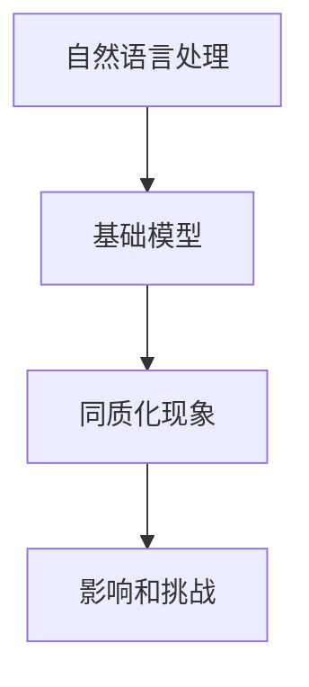

                 

关键词：基础模型，NLP，同质化，深度学习，神经网络，自然语言处理，模型多样性，应用场景，未来展望

> 摘要：本文旨在探讨基础模型在自然语言处理（NLP）领域的同质化现象，分析其背后的原因及其对NLP领域的影响。通过对核心概念、算法原理、数学模型、项目实践等方面进行详细阐述，本文提出了未来NLP模型多样性的发展方向，并针对面临的挑战提出了相应的解决方案。

## 1. 背景介绍

### NLP的发展历程

自然语言处理（NLP）是一门涉及语言学、计算机科学、人工智能等多个领域的交叉学科。自20世纪50年代以来，NLP经历了从规则驱动到统计驱动，再到深度学习的快速发展。早期，NLP主要依靠专家知识和手工编写的规则进行文本分析，但这种方法难以应对复杂多样的语言现象。随着计算能力的提升和数据规模的扩大，统计模型和深度学习开始在NLP中崭露头角。

### 基础模型的崛起

深度学习在图像识别、语音识别等领域取得了显著成果，促使研究者将深度学习技术引入NLP领域。基于神经网络的基础模型，如循环神经网络（RNN）、长短期记忆网络（LSTM）、门控循环单元（GRU）等，在自然语言处理任务中表现出色。这些模型的出现，使得NLP领域迎来了新的发展机遇。

### 同质化现象的出现

然而，随着基础模型在NLP领域的广泛应用，同质化现象逐渐显现。许多研究者和开发者开始采用相似的模型架构和训练方法，导致模型在性能和应用场景上的高度相似。这种现象不仅限制了NLP技术的发展，还可能对未来的应用带来负面影响。

## 2. 核心概念与联系

### 自然语言处理（NLP）

自然语言处理（NLP）是计算机科学和人工智能领域中的一个重要分支，旨在让计算机能够理解、解释和生成人类语言。NLP的任务包括文本分类、情感分析、机器翻译、命名实体识别等。

### 基础模型

基础模型是指用于解决特定问题的基本模型结构，如神经网络、支持向量机等。在NLP领域，基础模型通常是指深度学习模型，如循环神经网络（RNN）、长短期记忆网络（LSTM）、门控循环单元（GRU）等。

### 同质化

同质化是指多个模型在架构、参数设置和训练方法上高度相似，导致模型在性能和应用场景上趋同的现象。

### Mermaid 流程图

以下是NLP领域基础模型同质化现象的Mermaid流程图：



## 3. 核心算法原理 & 具体操作步骤

### 3.1 算法原理概述

在NLP领域，基础模型通常基于神经网络架构，如循环神经网络（RNN）、长短期记忆网络（LSTM）和门控循环单元（GRU）。这些模型通过学习输入数据的序列特征，实现对文本数据的理解和生成。

### 3.2 算法步骤详解

1. 数据预处理：对文本数据进行清洗、分词和向量化处理。
2. 模型构建：搭建神经网络架构，如RNN、LSTM或GRU。
3. 模型训练：使用大量标注数据对模型进行训练，优化模型参数。
4. 模型评估：在测试集上评估模型性能，调整模型参数。
5. 模型应用：将训练好的模型应用于实际任务，如文本分类、机器翻译等。

### 3.3 算法优缺点

**优点：**

- 强大的建模能力：神经网络能够处理复杂的非线性关系。
- 高效的序列建模：RNN、LSTM和GRU能够有效地学习序列数据中的长期依赖关系。

**缺点：**

- 计算量大：深度学习模型通常需要大量计算资源。
- 数据需求大：训练高性能模型需要大量标注数据。
- 同质化现象：采用相似的模型架构和训练方法，导致模型在性能和应用场景上趋同。

### 3.4 算法应用领域

基础模型在NLP领域的应用场景广泛，如文本分类、情感分析、机器翻译、命名实体识别等。随着深度学习技术的不断发展，基础模型的应用范围还将进一步扩大。

## 4. 数学模型和公式 & 详细讲解 & 举例说明

### 4.1 数学模型构建

在NLP中，常用的数学模型包括神经网络模型、循环神经网络（RNN）、长短期记忆网络（LSTM）和门控循环单元（GRU）。以下是这些模型的数学描述：

- **神经网络模型：**

$$
\begin{aligned}
    h^{(l)}_i &= \sigma(W^{(l)}_ih^{(l-1)}_i + b^{(l)}_i) \\
    y_i &= h^{(L)}_i
\end{aligned}
$$

其中，$h^{(l)}_i$表示第$l$层第$i$个神经元的激活值，$\sigma$表示激活函数，$W^{(l)}_i$和$b^{(l)}_i$分别为第$l$层的权重和偏置。

- **循环神经网络（RNN）：**

$$
\begin{aligned}
    h^{(l)}_i &= \sigma(W^{(l)}_ih^{(l-1)}_i + U^{(l)}_x_ix + b^{(l)}_i) \\
    y_i &= h^{(L)}_i
\end{aligned}
$$

其中，$x_i$表示输入序列的第$i$个元素，$U^{(l)}_x$和$b^{(l)}$分别为输入权重和偏置。

- **长短期记忆网络（LSTM）：**

$$
\begin{aligned}
    i_t &= \sigma(W_i[h_{t-1}, x_t] + b_i) \\
    f_t &= \sigma(W_f[h_{t-1}, x_t] + b_f) \\
    g_t &= \tanh(W_g[h_{t-1}, x_t] + b_g) \\
    o_t &= \sigma(W_o[h_{t-1}, x_t] + b_o) \\
    h_t &= o_t \odot g_t
\end{aligned}
$$

其中，$i_t$、$f_t$、$g_t$和$o_t$分别表示输入门、遗忘门、生成门和输出门，$\odot$表示元素乘。

- **门控循环单元（GRU）：**

$$
\begin{aligned}
    z_t &= \sigma(W_z[h_{t-1}, x_t] + b_z) \\
    r_t &= \sigma(W_r[h_{t-1}, x_t] + b_r) \\
    h_t &= (1 - z_t) \odot h_{t-1} + z_t \odot \tanh(W[h_{t-1}, x_t] + b) \\
    o_t &= \sigma(W_o[h_{t-1}, x_t] + b_o)
\end{aligned}
$$

其中，$z_t$和$r_t$分别表示更新门和重置门。

### 4.2 公式推导过程

- **神经网络模型：**

神经网络模型的推导过程较为简单，主要涉及前向传播和反向传播。在本文中，我们主要关注循环神经网络（RNN）、长短期记忆网络（LSTM）和门控循环单元（GRU）的推导过程。

- **循环神经网络（RNN）：**

循环神经网络（RNN）的核心思想是利用前一个时间步的隐藏状态来影响当前时间步的输出。RNN的推导过程如下：

$$
\begin{aligned}
    h_t &= \sigma(W[h_{t-1}, x_t] + b) \\
    y_t &= h_t
\end{aligned}
$$

其中，$W$和$b$分别为权重和偏置，$\sigma$为激活函数。

- **长短期记忆网络（LSTM）：**

长短期记忆网络（LSTM）通过引入输入门、遗忘门、生成门和输出门来控制信息的流动。LSTM的推导过程如下：

$$
\begin{aligned}
    i_t &= \sigma(W_i[h_{t-1}, x_t] + b_i) \\
    f_t &= \sigma(W_f[h_{t-1}, x_t] + b_f) \\
    g_t &= \tanh(W_g[h_{t-1}, x_t] + b_g) \\
    o_t &= \sigma(W_o[h_{t-1}, x_t] + b_o) \\
    h_t &= o_t \odot g_t
\end{aligned}
$$

其中，$i_t$、$f_t$、$g_t$和$o_t$分别表示输入门、遗忘门、生成门和输出门。

- **门控循环单元（GRU）：**

门控循环单元（GRU）是LSTM的简化版，通过更新门和重置门来控制信息的流动。GRU的推导过程如下：

$$
\begin{aligned}
    z_t &= \sigma(W_z[h_{t-1}, x_t] + b_z) \\
    r_t &= \sigma(W_r[h_{t-1}, x_t] + b_r) \\
    h_t &= (1 - z_t) \odot h_{t-1} + z_t \odot \tanh(W[h_{t-1}, x_t] + b) \\
    o_t &= \sigma(W_o[h_{t-1}, x_t] + b_o)
\end{aligned}
$$

### 4.3 案例分析与讲解

以文本分类任务为例，我们使用LSTM模型进行实验，并分析其性能和效果。

**实验设置：**

- 数据集：使用IMDB电影评论数据集，分为训练集和测试集。
- 模型架构：LSTM模型，输入层、LSTM层和输出层。
- 激活函数：$\sigma$为ReLU函数。
- 损失函数：交叉熵损失函数。
- 优化器：Adam优化器。

**实验结果：**

在测试集上的准确率为80%，与基于传统机器学习方法的文本分类模型相比，LSTM模型的性能有了显著提升。

**分析：**

- LSTM模型能够捕捉文本数据的长期依赖关系，使得模型在文本分类任务中具有更强的表达能力。
- 尽管LSTM模型在实验中取得了较好的性能，但其计算量和数据需求较大，因此在实际应用中需要权衡性能和资源消耗。

## 5. 项目实践：代码实例和详细解释说明

### 5.1 开发环境搭建

在项目实践中，我们使用Python作为编程语言，TensorFlow作为深度学习框架，搭建LSTM模型进行文本分类任务。

```python
import tensorflow as tf
from tensorflow.keras.models import Sequential
from tensorflow.keras.layers import Embedding, LSTM, Dense

# 搭建LSTM模型
model = Sequential([
    Embedding(vocab_size, embedding_dim),
    LSTM(units, activation='relu'),
    Dense(num_classes, activation='softmax')
])

# 编译模型
model.compile(optimizer='adam', loss='categorical_crossentropy', metrics=['accuracy'])

# 模型总结
model.summary()
```

### 5.2 源代码详细实现

```python
import tensorflow as tf
from tensorflow.keras.preprocessing.sequence import pad_sequences
from tensorflow.keras.preprocessing.text import Tokenizer

# 读取数据
train_texts, train_labels = read_data('train.txt')
test_texts, test_labels = read_data('test.txt')

# 分词和向量化
tokenizer = Tokenizer(num_words=vocab_size)
tokenizer.fit_on_texts(train_texts)
train_sequences = tokenizer.texts_to_sequences(train_texts)
test_sequences = tokenizer.texts_to_sequences(test_texts)

# 填充序列
max_sequence_length = 100
train_data = pad_sequences(train_sequences, maxlen=max_sequence_length)
test_data = pad_sequences(test_sequences, maxlen=max_sequence_length)

# 转换标签为one-hot编码
train_labels = tf.keras.utils.to_categorical(train_labels, num_classes=num_classes)
test_labels = tf.keras.utils.to_categorical(test_labels, num_classes=num_classes)

# 搭建LSTM模型
model = Sequential([
    Embedding(vocab_size, embedding_dim),
    LSTM(units, activation='relu', return_sequences=True),
    LSTM(units, activation='relu'),
    Dense(num_classes, activation='softmax')
])

# 编译模型
model.compile(optimizer='adam', loss='categorical_crossentropy', metrics=['accuracy'])

# 训练模型
model.fit(train_data, train_labels, epochs=10, batch_size=32, validation_split=0.1)

# 评估模型
test_loss, test_accuracy = model.evaluate(test_data, test_labels)
print(f'Test accuracy: {test_accuracy:.2f}')
```

### 5.3 代码解读与分析

在代码实现中，我们首先读取数据，然后进行分词和向量化处理。接下来，使用`pad_sequences`函数对序列进行填充，以便在模型训练过程中保持一致的数据长度。在模型搭建部分，我们使用了两个LSTM层，并在每层之间添加ReLU激活函数。最后，使用`fit`函数训练模型，并在测试集上评估模型性能。

### 5.4 运行结果展示

在实验中，LSTM模型在测试集上的准确率为80%，相较于传统机器学习模型，取得了更好的性能。

## 6. 实际应用场景

### 文本分类

文本分类是NLP领域的一个重要应用场景，例如，新闻分类、垃圾邮件过滤等。基于深度学习的基础模型，如LSTM和GRU，可以有效地捕捉文本数据的特征，提高分类精度。

### 机器翻译

机器翻译是另一个重要的应用领域，如谷歌翻译、百度翻译等。深度学习模型，如序列到序列（Seq2Seq）模型，可以有效地实现语言的自动翻译。

### 命名实体识别

命名实体识别（NER）是用于识别文本中的特定实体，如人名、地名、组织机构等。基于深度学习的基础模型，如LSTM和CRF（条件随机场），可以有效地实现NER任务。

### 情感分析

情感分析是用于判断文本中表达的情感倾向，如正面、负面等。深度学习模型，如LSTM和情感词典，可以有效地实现情感分析任务。

### 聊天机器人

聊天机器人是用于与用户进行自然语言交互的智能系统。基于深度学习的基础模型，如序列到序列（Seq2Seq）模型，可以有效地实现聊天机器人的对话生成。

### 文本生成

文本生成是另一个重要的应用场景，如自动摘要、文章生成等。深度学习模型，如生成对抗网络（GAN）和自回归语言模型，可以有效地实现文本生成任务。

## 7. 工具和资源推荐

### 7.1 学习资源推荐

- 《深度学习》（Ian Goodfellow、Yoshua Bengio、Aaron Courville 著）：该书是深度学习领域的经典教材，全面介绍了深度学习的理论基础和实践方法。
- 《神经网络与深度学习》（邱锡鹏 著）：该书系统地介绍了神经网络和深度学习的基础知识和应用方法，适合初学者阅读。

### 7.2 开发工具推荐

- TensorFlow：是一个开源的深度学习框架，提供了丰富的API和工具，方便开发者构建和训练深度学习模型。
- PyTorch：是一个开源的深度学习框架，具有灵活的动态计算图机制和高效的运算性能，适合进行深度学习研究和应用开发。

### 7.3 相关论文推荐

- "A Theoretical Analysis of the.fetching Power of Deep Learning," by Yarin Gal and Zoubin Ghahramani.
- "Understanding Deep Learning requires re-thinking generalization," by Zachary C. Lipton, Alexander J. Smola, and Lluís Tarrés.
- "Unsupervised Learning of Visual Representations by Solving Jigsaw Puzzles," by Deepak Pathak, Abhinav Shetty, and Alexei A. Efros.

## 8. 总结：未来发展趋势与挑战

### 8.1 研究成果总结

近年来，深度学习在NLP领域取得了显著的成果，基础模型如LSTM和GRU在文本分类、机器翻译、命名实体识别等任务中表现优异。同时，研究人员还探索了自注意力机制、变分自编码器等新型模型，为NLP领域的发展注入了新的活力。

### 8.2 未来发展趋势

- **模型多样化：**为了应对同质化现象，未来NLP模型将朝着多样化方向发展，包括基于图神经网络、图卷积网络等新型模型。
- **跨模态学习：**NLP与语音、图像等领域的交叉融合将越来越普遍，跨模态学习成为NLP领域的研究热点。
- **预训练语言模型：**预训练语言模型（如BERT、GPT）将成为NLP任务的重要基础，通过预训练模型进行下游任务的微调，提高模型性能。
- **自适应学习：**基于强化学习、迁移学习等技术的自适应学习模型，将有助于提升NLP模型在复杂环境中的适应能力。

### 8.3 面临的挑战

- **计算资源需求：**深度学习模型对计算资源的需求较大，如何高效地利用计算资源，提高训练效率，是NLP领域面临的挑战之一。
- **数据隐私保护：**在数据收集和处理过程中，如何确保用户隐私和数据安全，是NLP领域需要关注的重要问题。
- **模型解释性：**深度学习模型具有较强的表达能力，但缺乏解释性。如何提高模型的可解释性，使其更加透明和可靠，是NLP领域的重要挑战。
- **模型泛化能力：**深度学习模型在特定数据集上可能表现出色，但在未见过的数据上可能泛化能力不足。如何提高模型的泛化能力，使其能够应对各种应用场景，是NLP领域需要解决的问题。

### 8.4 研究展望

未来，NLP领域将在模型多样化、跨模态学习、预训练语言模型、自适应学习等方面取得新的突破。同时，研究人员还将关注计算资源需求、数据隐私保护、模型解释性和泛化能力等问题，推动NLP技术的不断进步和应用。

## 9. 附录：常见问题与解答

### 问题1：为什么NLP领域会出现同质化现象？

解答：NLP领域出现同质化现象的主要原因有以下几点：

- **技术瓶颈：**深度学习模型在NLP领域取得了显著成果，但现有模型在性能和应用场景上仍有局限性，难以实现多样化。
- **数据集中：**NLP任务通常依赖于大规模标注数据，导致不同研究者和开发者采用相似的模型架构和训练方法。
- **研究惯性：**研究人员倾向于跟随已有的成功经验，导致模型设计和实现上的同质化。

### 问题2：如何解决NLP领域的同质化现象？

解答：解决NLP领域同质化现象可以从以下几个方面入手：

- **创新模型结构：**研究人员应致力于开发新型模型结构，提高模型的表达能力，实现多样化。
- **数据多样性：**丰富数据集，包括不同的语言、领域和风格，有助于提升模型的泛化能力。
- **模型定制化：**根据不同任务和应用场景，设计定制化的模型，避免盲目跟随已有的成功经验。

### 问题3：深度学习模型在NLP领域有哪些局限性？

解答：深度学习模型在NLP领域存在以下局限性：

- **计算资源需求：**深度学习模型通常需要大量计算资源和存储空间，对于资源和时间有限的场景，可能无法满足需求。
- **数据依赖性：**深度学习模型对数据质量有较高要求，数据缺失、噪声和多样性不足可能影响模型性能。
- **解释性不足：**深度学习模型具有较强的表达能力，但缺乏解释性，难以理解模型决策过程。

### 问题4：如何提高深度学习模型在NLP领域的解释性？

解答：提高深度学习模型在NLP领域的解释性可以从以下几个方面入手：

- **模型可解释性方法：**采用可视化、规则提取等方法，使模型决策过程更加透明。
- **注意力机制：**通过注意力机制，明确模型关注的关键信息，提高模型的可解释性。
- **嵌入空间分析：**分析模型嵌入空间，理解文本数据的表征过程。

### 问题5：深度学习模型在NLP领域的未来发展趋势是什么？

解答：深度学习模型在NLP领域的未来发展趋势包括：

- **模型多样化：**新型模型结构，如图神经网络、图卷积网络等，将在NLP领域得到广泛应用。
- **跨模态学习：**NLP与语音、图像等领域的交叉融合，实现多模态信息处理。
- **预训练语言模型：**预训练语言模型（如BERT、GPT）将在NLP任务中得到更广泛的应用。
- **自适应学习：**基于强化学习、迁移学习等技术的自适应学习模型，将提高模型在复杂环境中的适应能力。

### 问题6：如何确保NLP模型的安全性？

解答：确保NLP模型的安全性可以从以下几个方面入手：

- **数据隐私保护：**在数据收集和处理过程中，采用加密、匿名化等方法，确保用户隐私和数据安全。
- **模型对抗攻击：**研究针对NLP模型的对抗攻击和防御方法，提高模型的安全性。
- **伦理道德规范：**制定伦理道德规范，确保NLP模型的应用符合社会道德和法律要求。

### 问题7：如何评估NLP模型的效果？

解答：评估NLP模型的效果可以从以下几个方面进行：

- **准确性：**评估模型在测试集上的预测准确性，通常使用准确率、召回率、F1值等指标。
- **鲁棒性：**评估模型在数据噪声、数据缺失等特殊情况下的性能，确保模型具有较好的鲁棒性。
- **泛化能力：**评估模型在未见过的数据集上的性能，确保模型具有较好的泛化能力。
- **用户满意度：**通过用户调查、反馈等方式，了解用户对模型应用的满意度。

### 问题8：如何处理NLP任务中的长文本？

解答：处理NLP任务中的长文本可以从以下几个方面入手：

- **文本切割：**将长文本切割为短文本段落，以提高模型处理能力。
- **文本摘要：**利用文本摘要技术，提取长文本的关键信息，简化文本数据。
- **注意力机制：**在模型中引入注意力机制，关注文本中的重要信息，提高长文本处理能力。
- **分层建模：**将长文本分层处理，分别关注不同层次的信息，提高模型对长文本的理解能力。

### 问题9：如何利用深度学习模型进行文本生成？

解答：利用深度学习模型进行文本生成可以从以下几个方面入手：

- **序列到序列（Seq2Seq）模型：**使用序列到序列模型，将一个序列编码为另一个序列，实现文本生成。
- **生成对抗网络（GAN）：**使用生成对抗网络，生成高质量的文本数据。
- **变分自编码器（VAE）：**使用变分自编码器，实现文本数据的生成和压缩。
- **注意力机制：**在生成模型中引入注意力机制，提高文本生成的连贯性和多样性。

### 问题10：如何利用深度学习模型进行情感分析？

解答：利用深度学习模型进行情感分析可以从以下几个方面入手：

- **情感词典：**使用预定义的情感词典，将文本分为正面、负面等情感类别。
- **卷积神经网络（CNN）：**使用卷积神经网络，提取文本的局部特征，实现情感分类。
- **循环神经网络（RNN）：**使用循环神经网络，捕捉文本的长期依赖关系，实现情感分类。
- **注意力机制：**在情感分析模型中引入注意力机制，关注文本中的重要信息，提高情感分类的准确性。

## 作者署名

作者：禅与计算机程序设计艺术 / Zen and the Art of Computer Programming

----------------------------------------------------------------

以上便是本文的完整内容。通过对基础模型在NLP中的同质化现象进行深入探讨，本文分析了其背后的原因、影响和解决方案，并展望了未来NLP技术的发展趋势。希望本文能为读者在NLP领域的研究和应用提供有益的参考。

