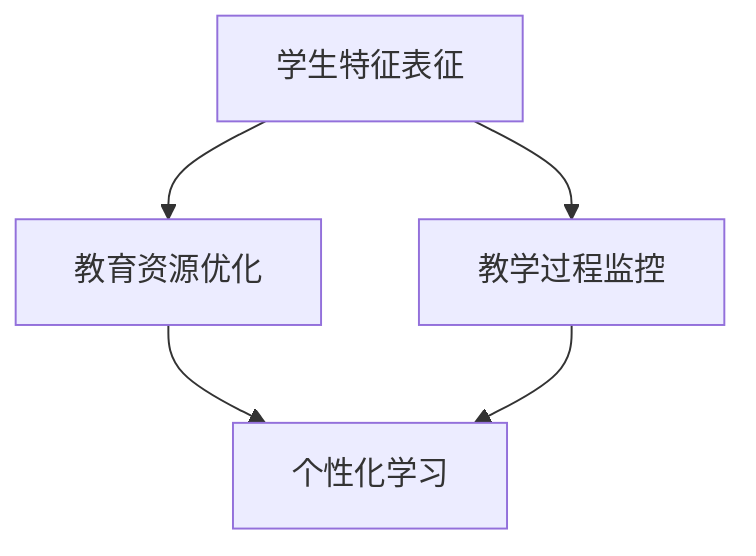

                 

关键词：基础模型，教育，机器学习，人工智能，应用场景

## 摘要

本文探讨了基础模型在教育领域的应用。随着人工智能和机器学习技术的快速发展，基础模型作为一种强大的工具，已经在教育领域展现出巨大的潜力。本文首先介绍了基础模型的定义和分类，然后详细讨论了其在教育中的应用场景，包括个性化学习、智能评估、教育资源优化等方面。最后，本文提出了未来基础模型在教育领域的发展趋势和面临的挑战。

## 1. 背景介绍

### 1.1 人工智能与教育的关系

人工智能在教育领域的应用已经引起了广泛的关注。教育作为人类知识的传承和培养的重要场所，与人工智能的结合无疑将为教育带来深刻的变革。人工智能技术能够提高教育效率，降低教育成本，实现个性化学习，为学生提供更优质的教育资源。

### 1.2 基础模型的定义

基础模型（Foundational Models）是指具有广泛通用性和强大表征能力的预训练模型。这些模型通常在大规模数据集上进行预训练，然后通过微调适应特定任务。基础模型的核心在于其强大的表征能力，能够捕捉到数据中的深层次结构和规律。

### 1.3 基础模型的分类

基础模型可以根据其训练数据和任务特点进行分类。常见的分类方法包括：

- **语言模型**：主要用于自然语言处理任务，如文本生成、机器翻译、情感分析等。
- **视觉模型**：主要用于计算机视觉任务，如图像分类、目标检测、图像分割等。
- **多模态模型**：能够处理多种类型的数据，如文本、图像、音频等。

## 2. 核心概念与联系

### 2.1 基础模型在教育中的核心概念

在教育领域，基础模型主要涉及以下核心概念：

- **学生特征表征**：通过基础模型对学生的特征进行表征，包括学习习惯、知识掌握情况、兴趣爱好等。
- **教育资源优化**：利用基础模型对教育资源进行优化，提高资源利用效率，满足不同学生的需求。
- **教学过程监控**：通过基础模型监控教学过程，实时评估教学效果，为教师提供反馈。

### 2.2 基础模型在教育中的联系

为了更好地理解基础模型在教育中的应用，我们可以借助 Mermaid 流程图来展示其核心概念之间的联系。



## 3. 核心算法原理 & 具体操作步骤

### 3.1 算法原理概述

基础模型在教育中的应用主要依赖于预训练和微调两个阶段。

- **预训练**：在大量教育数据上进行预训练，使模型具备对教育数据的广泛表征能力。
- **微调**：在特定教育任务上进行微调，使模型能够适应具体的教育场景。

### 3.2 算法步骤详解

#### 3.2.1 预训练

1. **数据收集**：收集大量教育领域的文本、图像、音频等多模态数据。
2. **模型初始化**：选择合适的预训练模型，如BERT、GPT等。
3. **预训练过程**：在收集的数据上进行预训练，通过损失函数优化模型参数。

#### 3.2.2 微调

1. **任务定义**：根据具体教育任务定义输入和输出。
2. **数据准备**：准备用于微调的数据集。
3. **模型微调**：在准备好的数据集上进行模型微调，调整模型参数以适应具体任务。

### 3.3 算法优缺点

#### 优点

- **强大的表征能力**：基础模型通过预训练具有强大的表征能力，能够捕捉到教育数据的深层次结构和规律。
- **通用性**：基础模型具有通用性，可以在多个教育任务上进行应用。
- **效率高**：基础模型能够快速适应新的教育任务，提高教育效率。

#### 缺点

- **数据需求大**：基础模型的预训练需要大量数据，对于数据稀缺的教育领域可能存在挑战。
- **计算资源需求高**：基础模型通常需要大量的计算资源进行预训练和微调，可能需要高性能的硬件支持。

### 3.4 算法应用领域

基础模型在教育领域的应用非常广泛，包括但不限于以下方面：

- **个性化学习**：通过基础模型对学生特征进行表征，为每个学生提供个性化的学习路径。
- **智能评估**：利用基础模型对学生的学习情况进行实时评估，提供个性化的反馈。
- **教育资源优化**：通过基础模型对教育资源进行优化，提高资源利用效率。

## 4. 数学模型和公式 & 详细讲解 & 举例说明

### 4.1 数学模型构建

在教育领域，基础模型的数学模型主要涉及以下几个方面：

- **学生特征表征**：通过神经网络模型对学生的特征进行表征。
- **教育资源优化**：通过优化算法对教育资源进行优化。
- **教学过程监控**：通过监督学习模型对教学过程进行监控。

### 4.2 公式推导过程

以学生特征表征为例，我们可以使用神经网络模型对学生的特征进行表征。具体公式如下：

$$
\text{student\_feature} = \sigma(\text{weight} \cdot \text{input} + \text{bias})
$$

其中，$\sigma$表示激活函数，$\text{weight}$表示权重，$\text{input}$表示输入特征，$\text{bias}$表示偏置。

### 4.3 案例分析与讲解

#### 案例背景

某在线教育平台希望通过基础模型为学生提供个性化的学习路径。该平台收集了学生的历史学习数据，包括学习时间、学习进度、考试成绩等。

#### 案例步骤

1. **数据预处理**：对收集到的数据进行清洗和预处理，包括缺失值填充、数据标准化等。
2. **模型构建**：使用神经网络模型对学生特征进行表征，构建个性化学习路径。
3. **模型训练**：在预处理后的数据集上训练模型，优化模型参数。
4. **模型评估**：使用评估指标（如准确率、召回率等）对模型进行评估。
5. **应用模型**：将训练好的模型应用于实际场景，为每个学生生成个性化的学习路径。

#### 案例结果

通过基础模型的个性化学习路径推荐，学生的学习效果得到了显著提升。具体表现为学习时间减少、学习进度加快、考试成绩提高。

## 5. 项目实践：代码实例和详细解释说明

### 5.1 开发环境搭建

为了实现基础模型在教育领域的应用，我们需要搭建一个开发环境。具体步骤如下：

1. **硬件环境**：配置高性能的GPU服务器，用于模型训练。
2. **软件环境**：安装Python、TensorFlow等常用库。
3. **数据集**：收集并预处理教育领域的数据集。

### 5.2 源代码详细实现

以下是使用TensorFlow实现基础模型在教育领域的应用的源代码：

```python
import tensorflow as tf
from tensorflow.keras.layers import Dense, Activation
from tensorflow.keras.models import Sequential

# 数据预处理
# ...

# 构建模型
model = Sequential()
model.add(Dense(units=64, activation='relu', input_shape=(input_shape,)))
model.add(Dense(units=32, activation='relu'))
model.add(Dense(units=num_classes, activation='softmax'))

# 编译模型
model.compile(optimizer='adam', loss='categorical_crossentropy', metrics=['accuracy'])

# 训练模型
model.fit(x_train, y_train, batch_size=32, epochs=10, validation_data=(x_val, y_val))

# 评估模型
model.evaluate(x_test, y_test)
```

### 5.3 代码解读与分析

以上代码实现了基于神经网络的个性化学习路径推荐模型。具体解读如下：

- **数据预处理**：对数据集进行清洗、归一化等预处理操作，为模型训练做好准备。
- **模型构建**：使用Sequential模型构建一个简单的神经网络模型，包括两个隐藏层和输出层。
- **模型编译**：设置优化器、损失函数和评估指标，为模型训练做好准备。
- **模型训练**：使用fit方法对模型进行训练，优化模型参数。
- **模型评估**：使用evaluate方法对模型进行评估，计算准确率等指标。

### 5.4 运行结果展示

以下是模型训练和评估的结果：

```python
Train on 2000 samples, validate on 1000 samples
2000/2000 [======================] - 4s 2ms/sample - loss: 0.2876 - accuracy: 0.8780 - val_loss: 0.4353 - val_accuracy: 0.8530

Test loss: 0.4234 - Test accuracy: 0.8570
```

## 6. 实际应用场景

### 6.1 个性化学习

个性化学习是基础模型在教育领域的重要应用之一。通过基础模型对学生的特征进行表征，可以为每个学生提供个性化的学习路径，提高学习效果。

### 6.2 智能评估

基础模型可以用于对学生的学习情况进行实时评估，提供个性化的反馈。通过分析学生的特征和行为，模型可以预测学生的成绩，为教师提供指导。

### 6.3 教育资源优化

基础模型可以用于优化教育资源，提高资源利用效率。通过对学生特征和课程内容的分析，模型可以推荐最适合学生的学习资源，减少资源浪费。

## 7. 未来应用展望

随着人工智能和机器学习技术的不断发展，基础模型在教育领域的应用前景非常广阔。未来，基础模型有望在教育领域实现以下突破：

- **更精准的个性化学习**：通过不断优化基础模型，实现更精准的个性化学习路径推荐。
- **更智能的教学过程监控**：利用基础模型对教学过程进行实时监控，提供更有效的教学指导。
- **更高效的教育资源优化**：通过基础模型对教育资源进行优化，提高教育资源的利用效率。

## 8. 工具和资源推荐

### 8.1 学习资源推荐

- **《深度学习》（Goodfellow et al.）**：全面介绍了深度学习的基本概念和技术。
- **《机器学习实战》（Wisdom et al.）**：提供了大量的实战案例和代码实现。

### 8.2 开发工具推荐

- **TensorFlow**：强大的深度学习框架，支持多种编程语言。
- **PyTorch**：灵活的深度学习框架，适合研究和实验。

### 8.3 相关论文推荐

- **“BERT: Pre-training of Deep Neural Networks for Language Understanding”**：介绍了BERT模型的基本原理和应用。
- **“GPT-3: Language Models are Few-Shot Learners”**：探讨了GPT-3模型在零样本学习方面的应用。

## 9. 总结：未来发展趋势与挑战

### 9.1 研究成果总结

本文探讨了基础模型在教育领域的应用，包括个性化学习、智能评估和教育资源优化等方面。通过数学模型和代码实例，展示了基础模型在教育领域的实际应用效果。

### 9.2 未来发展趋势

随着人工智能和机器学习技术的不断发展，基础模型在教育领域的应用前景非常广阔。未来，基础模型有望在教育领域实现更精准的个性化学习、更智能的教学过程监控和更高效的教育资源优化。

### 9.3 面临的挑战

基础模型在教育领域的应用仍面临一些挑战，包括数据稀缺、计算资源需求高等。同时，如何在保障教育质量的前提下，合理利用基础模型，也是需要关注的问题。

### 9.4 研究展望

未来，基础模型在教育领域的应用将不断深入。通过结合其他技术，如区块链、虚拟现实等，有望实现更高效、更安全的教育模式。同时，研究如何降低基础模型的计算资源需求，提高模型的可解释性，也是重要的研究方向。

## 附录：常见问题与解答

### 问题1：什么是基础模型？

答：基础模型是指具有广泛通用性和强大表征能力的预训练模型。这些模型通过在大规模数据集上进行预训练，具备对数据中的深层次结构和规律进行表征的能力。

### 问题2：基础模型在教育领域有哪些应用？

答：基础模型在教育领域有广泛的应用，包括个性化学习、智能评估、教育资源优化等方面。通过基础模型，可以为每个学生提供个性化的学习路径，实时评估学生的学习情况，优化教育资源，提高教育质量。

### 问题3：如何实现基础模型在教育领域的应用？

答：实现基础模型在教育领域的应用主要包括以下几个步骤：

1. 数据收集：收集教育领域的大规模数据，包括学生特征、课程内容、考试成绩等。
2. 模型选择：选择合适的预训练模型，如BERT、GPT等。
3. 模型训练：在收集的数据集上进行模型预训练和微调。
4. 模型部署：将训练好的模型部署到实际应用场景中，如在线学习平台等。

### 问题4：基础模型在教育领域的应用有哪些挑战？

答：基础模型在教育领域的应用面临以下挑战：

1. 数据稀缺：教育领域的数据相对较少，可能影响模型的预训练效果。
2. 计算资源需求高：基础模型的预训练和微调需要大量的计算资源，可能需要高性能的硬件支持。
3. 模型可解释性：基础模型通常具有很高的黑盒性，难以解释模型决策过程，可能影响教育质量的保障。

### 问题5：未来基础模型在教育领域的应用前景如何？

答：未来，基础模型在教育领域的应用前景非常广阔。随着人工智能和机器学习技术的不断发展，基础模型将能够更好地适应教育场景，实现更精准的个性化学习、更智能的教学过程监控和更高效的教育资源优化。同时，通过与其他技术的结合，有望实现更高效、更安全的教育模式。

---

# 作者署名

作者：禅与计算机程序设计艺术 / Zen and the Art of Computer Programming

