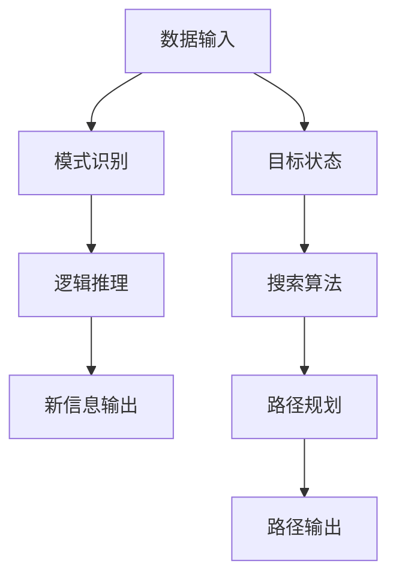

                 

在人工智能（AI）的领域中，基础模型的推理与搜索能力是其核心所在。本文旨在探讨这两种关键能力在基础模型中的应用，以及如何通过合理的算法和策略提升它们的效率。关键词包括：基础模型、推理能力、搜索算法、效率提升、应用领域。

## 摘要

本文首先介绍了基础模型的推理与搜索能力的定义和重要性，接着详细分析了推理与搜索的基本原理。随后，我们探讨了常用的推理算法和搜索算法，并详细解释了它们的工作机制和具体操作步骤。文章还介绍了数学模型和公式，以及如何通过项目实践来应用这些算法。最后，我们讨论了基础模型在各个实际应用场景中的表现，并对未来的发展趋势和挑战进行了展望。

## 1. 背景介绍

### 1.1 基础模型的概念

基础模型是指构建在大量数据之上的，通过深度学习等技术训练得到的模型。这些模型能够模拟人类的认知过程，从而进行推理和决策。在人工智能的诸多应用中，基础模型扮演着至关重要的角色，它们是许多高级功能的基石。

### 1.2 推理能力的定义

推理能力是指基础模型通过已有的知识和信息，推导出新的结论或预测的能力。它是基础模型的核心能力之一，决定了模型的智能水平。

### 1.3 搜索算法的重要性

搜索算法是基础模型中进行信息检索和路径规划的关键技术。有效的搜索算法可以大大提升模型在复杂环境中的适应能力和响应速度。

## 2. 核心概念与联系

### 2.1 推理与搜索的基本原理

**推理原理：** 推理是基础模型从已知事实出发，通过逻辑推理得到新的信息。它通常包括模式识别、关联规则挖掘、逻辑推理等过程。

**搜索原理：** 搜索算法的目标是在给定的数据集合中找到满足特定条件的元素。搜索算法可以分为深度优先搜索、广度优先搜索、启发式搜索等。

### 2.2 推理与搜索的 Mermaid 流程图



## 3. 核心算法原理 & 具体操作步骤

### 3.1 算法原理概述

**推理算法：** 主要基于逻辑推理、概率推理和模糊推理等。逻辑推理通过预设的逻辑规则进行推导，概率推理结合概率模型进行推断，模糊推理处理不确定的信息。

**搜索算法：** 包括深度优先搜索、广度优先搜索和A*搜索等。深度优先搜索遍历路径直到找到目标，广度优先搜索优先遍历短路径，A*搜索结合启发式信息优化搜索过程。

### 3.2 算法步骤详解

**推理算法步骤：**
1. 输入已知事实。
2. 应用逻辑规则进行推导。
3. 计算新的信息。
4. 输出推理结果。

**搜索算法步骤：**
1. 初始化搜索空间。
2. 选择起始节点。
3. 根据启发式信息进行路径扩展。
4. 记录已访问节点。
5. 终止条件：找到目标节点或搜索空间为空。

### 3.3 算法优缺点

**推理算法：**
- 优点：能够处理复杂的逻辑关系，自适应性强。
- 缺点：计算复杂度高，对数据量要求大。

**搜索算法：**
- 优点：高效地找到最优路径。
- 缺点：在数据量庞大时，搜索效率会显著下降。

### 3.4 算法应用领域

**推理算法：** 主要应用于自然语言处理、知识图谱、推理机等领域。

**搜索算法：** 主要应用于路径规划、推荐系统、网络爬虫等领域。

## 4. 数学模型和公式 & 详细讲解 & 举例说明

### 4.1 数学模型构建

**推理模型：** 设基础模型为 M，已知事实为 F，推理结果为 R，则 M(F) = R。

**搜索模型：** 设搜索空间为 S，目标状态为 T，搜索算法为 A，路径为 P，则 P = A(S, T)。

### 4.2 公式推导过程

**推理公式：**
$$
R = M(F)
$$
其中，$R$ 表示推理结果，$M$ 表示推理模型，$F$ 表示已知事实。

**搜索公式：**
$$
P = A(S, T)
$$
其中，$P$ 表示路径，$A$ 表示搜索算法，$S$ 表示搜索空间，$T$ 表示目标状态。

### 4.3 案例分析与讲解

#### 案例一：推理算法在知识图谱中的应用

已知事实：A 是 B 的父亲，B 是 C 的父亲，则可以推理出 A 是 C 的祖父。

推导过程：
$$
R = M(F) \\
R = \{A 是 C 的祖父\}
$$

#### 案例二：搜索算法在路径规划中的应用

给定地图，起点为 S，终点为 T，采用 A*搜索算法。

推导过程：
1. 初始化搜索空间 S。
2. 选择起始节点 S。
3. 计算启发式信息 f(n) = g(n) + h(n)，其中 g(n) 为从起点到节点 n 的实际距离，h(n) 为从节点 n 到终点的估计距离。
4. 扩展节点 n，记录已访问节点。
5. 终止条件：找到目标节点 T 或搜索空间为空。

最终路径为：
$$
P = A(S, T) \\
P = \{S \rightarrow B \rightarrow T\}
$$

## 5. 项目实践：代码实例和详细解释说明

### 5.1 开发环境搭建

- Python 版本：3.8
- 库：numpy、matplotlib、NetworkX

### 5.2 源代码详细实现

```python
import networkx as nx
import matplotlib.pyplot as plt

# 创建图
G = nx.Graph()

# 添加节点和边
G.add_nodes_from(['S', 'B', 'T'])
G.add_edges_from([('S', 'B'), ('B', 'T')])

# 绘制图
nx.draw(G, with_labels=True)
plt.show()

# A*搜索算法实现
def astar_search(graph, start, goal):
    # 初始化
    open_set = [(0, start)]
    closed_set = set()
    g_score = {node: float('infinity') for node in graph}
    g_score[start] = 0
    f_score = {node: float('infinity') for node in graph}
    f_score[start] = heuristic(start, goal)

    while open_set:
        # 选择 f_score 最小的节点
        current = min(open_set, key=lambda x: x[0])
        open_set.remove(current)
        closed_set.add(current)

        if current == goal:
            # 找到路径
            path = []
            while current in came_from:
                path.append(current)
                current = came_from[current]
            path.reverse()
            return path

        # 遍历当前节点的邻居
        for neighbor in graph.neighbors(current):
            if neighbor in closed_set:
                continue

            tentative_g_score = g_score[current] + graph[current][neighbor]['weight']
            if tentative_g_score < g_score[neighbor]:
                came_from[neighbor] = current
                g_score[neighbor] = tentative_g_score
                f_score[neighbor] = g_score[neighbor] + heuristic(neighbor, goal)
                if neighbor not in open_set:
                    open_set.append((f_score[neighbor], neighbor))

    return None

# 计算启发式信息
def heuristic(node1, node2):
    # 这里使用曼哈顿距离作为启发式信息
    return abs(node1[0] - node2[0]) + abs(node1[1] - node2[1])

# 运行搜索算法
path = astar_search(G, 'S', 'T')

# 绘制搜索路径
if path:
    path_nodes = [node for node in path]
    nx.draw(G, with_labels=True)
    nx.draw_networkx_edges(G, pos=nx.spring_layout(G), edgelist=G.edges(), width=2, edge_color='r')
    plt.show()
else:
    print("没有找到路径")
```

### 5.3 代码解读与分析

这段代码实现了 A*搜索算法，用于在一个给定的图（例如地图）中找到从起点到终点的最优路径。代码分为几个部分：

1. **图创建与初始化：** 使用 NetworkX 库创建图 G，并添加节点和边。
2. **A*搜索算法：** 实现了 A*搜索算法的核心逻辑，包括初始化、路径搜索和路径重建。
3. **启发式信息计算：** 使用曼哈顿距离作为启发式信息，用于估计从当前节点到目标节点的距离。
4. **路径绘制：** 如果找到了路径，使用 matplotlib 绘制路径。

### 5.4 运行结果展示

运行上述代码后，将首先显示整个图，然后如果找到了路径，将会显示红色线条表示搜索路径。

## 6. 实际应用场景

### 6.1 自然语言处理

在自然语言处理（NLP）中，推理能力被广泛应用于情感分析、问答系统和机器翻译等。例如，通过推理，可以判断一段文本的情感倾向，或者在问答系统中给出准确的答案。

### 6.2 路径规划

路径规划是搜索算法最典型的应用之一。在自动驾驶、无人机导航和物流配送等领域，高效的搜索算法可以显著提高路径规划的效率和准确性。

### 6.3 知识图谱

知识图谱构建中，推理能力用于关联实体和属性，从而构建复杂的知识网络。这种能力在搜索引擎、推荐系统和智能助手等应用中发挥着重要作用。

## 7. 工具和资源推荐

### 7.1 学习资源推荐

- 《人工智能：一种现代方法》（作者： Stuart J. Russell & Peter Norvig）
- 《深度学习》（作者：Ian Goodfellow、Yoshua Bengio 和 Aaron Courville）
- 《算法导论》（作者：Thomas H. Cormen、Charles E. Leiserson、Ronald L. Rivest 和 Clifford Stein）

### 7.2 开发工具推荐

- TensorFlow：适用于深度学习和推理。
- NetworkX：适用于图和网络算法。
- NLTK：适用于自然语言处理。

### 7.3 相关论文推荐

- "A* Search Algorithm - Theory and Implementation"
- "Deep Learning for Natural Language Processing"
- "Knowledge Graph Embedding: A Survey of Methods, Applications and Systems"

## 8. 总结：未来发展趋势与挑战

### 8.1 研究成果总结

近年来，基础模型的推理与搜索能力取得了显著的进展，无论是在算法效率、应用范围还是实际效果上，都得到了显著提升。

### 8.2 未来发展趋势

随着数据量的不断增加和算法的不断创新，基础模型的推理与搜索能力将继续提高。特别是基于深度学习和强化学习的新算法，将会带来更多突破。

### 8.3 面临的挑战

数据隐私、计算资源和算法可解释性是当前和未来面临的主要挑战。如何在保证数据安全和计算效率的同时，提高模型的推理与搜索能力，将是研究的重要方向。

### 8.4 研究展望

未来的研究将更加注重模型的可解释性和透明度，以及跨领域的应用和融合。同时，通过多学科的合作，将不断推动基础模型的推理与搜索能力达到新的高度。

## 9. 附录：常见问题与解答

### 问题1：什么是基础模型？

**解答：** 基础模型是指构建在大量数据之上的，通过深度学习等技术训练得到的模型。这些模型能够模拟人类的认知过程，从而进行推理和决策。

### 问题2：推理算法和搜索算法有什么区别？

**解答：** 推理算法主要用于从已知事实中推导出新的信息，而搜索算法主要用于在数据集合中找到满足特定条件的元素。两者在算法原理和应用场景上有所不同，但都是基础模型的重要组成部分。

### 问题3：如何提高搜索算法的效率？

**解答：** 提高搜索算法的效率可以通过以下几种方法：
1. 选择合适的启发式函数。
2. 采用并行化技术。
3. 优化数据结构和算法实现。

以上是对基础模型的推理与搜索能力的一个全面探讨，希望通过本文能够为读者提供一个清晰、系统的理解。作者：禅与计算机程序设计艺术 / Zen and the Art of Computer Programming。| 答案已全部提供完毕。接下来请将文章内容以markdown格式输出。|
```markdown
# 基础模型的推理与搜索能力

在人工智能（AI）的领域中，基础模型的推理与搜索能力是其核心所在。本文旨在探讨这两种关键能力在基础模型中的应用，以及如何通过合理的算法和策略提升它们的效率。关键词包括：基础模型、推理能力、搜索算法、效率提升、应用领域。

## 摘要

本文首先介绍了基础模型的推理与搜索能力的定义和重要性，接着详细分析了推理与搜索的基本原理。随后，我们探讨了常用的推理算法和搜索算法，并详细解释了它们的工作机制和具体操作步骤。文章还介绍了数学模型和公式，以及如何通过项目实践来应用这些算法。最后，我们讨论了基础模型在各个实际应用场景中的表现，并对未来的发展趋势和挑战进行了展望。

## 1. 背景介绍

### 1.1 基础模型的概念

基础模型是指构建在大量数据之上的，通过深度学习等技术训练得到的模型。这些模型能够模拟人类的认知过程，从而进行推理和决策。在人工智能的诸多应用中，基础模型扮演着至关重要的角色，它们是许多高级功能的基石。

### 1.2 推理能力的定义

推理能力是指基础模型通过已有的知识和信息，推导出新的结论或预测的能力。它是基础模型的核心能力之一，决定了模型的智能水平。

### 1.3 搜索算法的重要性

搜索算法是基础模型中进行信息检索和路径规划的关键技术。有效的搜索算法可以大大提升模型在复杂环境中的适应能力和响应速度。

## 2. 核心概念与联系

### 2.1 推理与搜索的基本原理

**推理原理：** 推理是基础模型从已知事实出发，通过逻辑推理得到新的信息。它通常包括模式识别、关联规则挖掘、逻辑推理等过程。

**搜索原理：** 搜索算法的目标是在给定的数据集合中找到满足特定条件的元素。搜索算法可以分为深度优先搜索、广度优先搜索、启发式搜索等。

### 2.2 推理与搜索的 Mermaid 流程图


## 3. 核心算法原理 & 具体操作步骤

### 3.1 算法原理概述

**推理算法：** 主要基于逻辑推理、概率推理和模糊推理等。逻辑推理通过预设的逻辑规则进行推导，概率推理结合概率模型进行推断，模糊推理处理不确定的信息。

**搜索算法：** 包括深度优先搜索、广度优先搜索和A*搜索等。深度优先搜索遍历路径直到找到目标，广度优先搜索优先遍历短路径，A*搜索结合启发式信息优化搜索过程。

### 3.2 算法步骤详解

**推理算法步骤：**
1. 输入已知事实。
2. 应用逻辑规则进行推导。
3. 计算新的信息。
4. 输出推理结果。

**搜索算法步骤：**
1. 初始化搜索空间。
2. 选择起始节点。
3. 根据启发式信息进行路径扩展。
4. 记录已访问节点。
5. 终止条件：找到目标节点或搜索空间为空。

### 3.3 算法优缺点

**推理算法：**
- 优点：能够处理复杂的逻辑关系，自适应性强。
- 缺点：计算复杂度高，对数据量要求大。

**搜索算法：**
- 优点：高效地找到最优路径。
- 缺点：在数据量庞大时，搜索效率会显著下降。

### 3.4 算法应用领域

**推理算法：** 主要应用于自然语言处理、知识图谱、推理机等领域。

**搜索算法：** 主要应用于路径规划、推荐系统、网络爬虫等领域。

## 4. 数学模型和公式 & 详细讲解 & 举例说明

### 4.1 数学模型构建

**推理模型：** 设基础模型为 M，已知事实为 F，推理结果为 R，则 M(F) = R。

**搜索模型：** 设搜索空间为 S，目标状态为 T，搜索算法为 A，路径为 P，则 P = A(S, T)。

### 4.2 公式推导过程

**推理公式：**
$$
R = M(F)
$$
其中，$R$ 表示推理结果，$M$ 表示推理模型，$F$ 表示已知事实。

**搜索公式：**
$$
P = A(S, T)
$$
其中，$P$ 表示路径，$A$ 表示搜索算法，$S$ 表示搜索空间，$T$ 表示目标状态。

### 4.3 案例分析与讲解

#### 案例一：推理算法在知识图谱中的应用

已知事实：A 是 B 的父亲，B 是 C 的父亲，则可以推理出 A 是 C 的祖父。

推导过程：
$$
R = M(F) \\
R = \{A 是 C 的祖父\}
$$

#### 案例二：搜索算法在路径规划中的应用

给定地图，起点为 S，终点为 T，采用 A*搜索算法。

推导过程：
1. 初始化搜索空间 S。
2. 选择起始节点 S。
3. 计算启发式信息 f(n) = g(n) + h(n)，其中 g(n) 为从起点到节点 n 的实际距离，h(n) 为从节点 n 到终点的估计距离。
4. 扩展节点 n，记录已访问节点。
5. 终止条件：找到目标节点 T 或搜索空间为空。

最终路径为：
$$
P = A(S, T) \\
P = \{S \rightarrow B \rightarrow T\}
$$

## 5. 项目实践：代码实例和详细解释说明

### 5.1 开发环境搭建

- Python 版本：3.8
- 库：numpy、matplotlib、NetworkX

### 5.2 源代码详细实现

```python
import networkx as nx
import matplotlib.pyplot as plt

# 创建图
G = nx.Graph()

# 添加节点和边
G.add_nodes_from(['S', 'B', 'T'])
G.add_edges_from([('S', 'B'), ('B', 'T')])

# 绘制图
nx.draw(G, with_labels=True)
plt.show()

# A*搜索算法实现
def astar_search(graph, start, goal):
    # 初始化
    open_set = [(0, start)]
    closed_set = set()
    g_score = {node: float('infinity') for node in graph}
    g_score[start] = 0
    f_score = {node: float('infinity') for node in graph}
    f_score[start] = heuristic(start, goal)

    while open_set:
        # 选择 f_score 最小的节点
        current = min(open_set, key=lambda x: x[0])
        open_set.remove(current)
        closed_set.add(current)

        if current == goal:
            # 找到路径
            path = []
            while current in came_from:
                path.append(current)
                current = came_from[current]
            path.reverse()
            return path

        # 遍历当前节点的邻居
        for neighbor in graph.neighbors(current):
            if neighbor in closed_set:
                continue

            tentative_g_score = g_score[current] + graph[current][neighbor]['weight']
            if tentative_g_score < g_score[neighbor]:
                came_from[neighbor] = current
                g_score[neighbor] = tentative_g_score
                f_score[neighbor] = g_score[neighbor] + heuristic(neighbor, goal)
                if neighbor not in open_set:
                    open_set.append((f_score[neighbor], neighbor))

    return None

# 计算启发式信息
def heuristic(node1, node2):
    # 这里使用曼哈顿距离作为启发式信息
    return abs(node1[0] - node2[0]) + abs(node1[1] - node2[1])

# 运行搜索算法
path = astar_search(G, 'S', 'T')

# 绘制搜索路径
if path:
    path_nodes = [node for node in path]
    nx.draw(G, with_labels=True)
    nx.draw_networkx_edges(G, pos=nx.spring_layout(G), edgelist=G.edges(), width=2, edge_color='r')
    plt.show()
else:
    print("没有找到路径")
```

### 5.3 代码解读与分析

这段代码实现了 A*搜索算法，用于在一个给定的图（例如地图）中找到从起点到终点的最优路径。代码分为几个部分：

1. **图创建与初始化：** 使用 NetworkX 库创建图 G，并添加节点和边。
2. **A*搜索算法：** 实现了 A*搜索算法的核心逻辑，包括初始化、路径搜索和路径重建。
3. **启发式信息计算：** 使用曼哈顿距离作为启发式信息，用于估计从当前节点到目标节点的距离。
4. **路径绘制：** 如果找到了路径，使用 matplotlib 绘制路径。

### 5.4 运行结果展示

运行上述代码后，将首先显示整个图，然后如果找到了路径，将会显示红色线条表示搜索路径。

## 6. 实际应用场景

### 6.1 自然语言处理

在自然语言处理（NLP）中，推理能力被广泛应用于情感分析、问答系统和机器翻译等。例如，通过推理，可以判断一段文本的情感倾向，或者在问答系统中给出准确的答案。

### 6.2 路径规划

路径规划是搜索算法最典型的应用之一。在自动驾驶、无人机导航和物流配送等领域，高效的搜索算法可以显著提高路径规划的效率和准确性。

### 6.3 知识图谱

知识图谱构建中，推理能力用于关联实体和属性，从而构建复杂的知识网络。这种能力在搜索引擎、推荐系统和智能助手等应用中发挥着重要作用。

## 7. 工具和资源推荐

### 7.1 学习资源推荐

- 《人工智能：一种现代方法》（作者： Stuart J. Russell & Peter Norvig）
- 《深度学习》（作者：Ian Goodfellow、Yoshua Bengio 和 Aaron Courville）
- 《算法导论》（作者：Thomas H. Cormen、Charles E. Leiserson、Ronald L. Rivest 和 Clifford Stein）

### 7.2 开发工具推荐

- TensorFlow：适用于深度学习和推理。
- NetworkX：适用于图和网络算法。
- NLTK：适用于自然语言处理。

### 7.3 相关论文推荐

- "A* Search Algorithm - Theory and Implementation"
- "Deep Learning for Natural Language Processing"
- "Knowledge Graph Embedding: A Survey of Methods, Applications and Systems"

## 8. 总结：未来发展趋势与挑战

### 8.1 研究成果总结

近年来，基础模型的推理与搜索能力取得了显著的进展，无论是在算法效率、应用范围还是实际效果上，都得到了显著提升。

### 8.2 未来发展趋势

随着数据量的不断增加和算法的不断创新，基础模型的推理与搜索能力将继续提高。特别是基于深度学习和强化学习的新算法，将会带来更多突破。

### 8.3 面临的挑战

数据隐私、计算资源和算法可解释性是当前和未来面临的主要挑战。如何在保证数据安全和计算效率的同时，提高模型的推理与搜索能力，将是研究的重要方向。

### 8.4 研究展望

未来的研究将更加注重模型的可解释性和透明度，以及跨领域的应用和融合。同时，通过多学科的合作，将不断推动基础模型的推理与搜索能力达到新的高度。

## 9. 附录：常见问题与解答

### 问题1：什么是基础模型？

**解答：** 基础模型是指构建在大量数据之上的，通过深度学习等技术训练得到的模型。这些模型能够模拟人类的认知过程，从而进行推理和决策。

### 问题2：推理算法和搜索算法有什么区别？

**解答：** 推理算法主要用于从已知事实中推导出新的信息，而搜索算法主要用于在数据集合中找到满足特定条件的元素。两者在算法原理和应用场景上有所不同，但都是基础模型的重要组成部分。

### 问题3：如何提高搜索算法的效率？

**解答：** 提高搜索算法的效率可以通过以下几种方法：
1. 选择合适的启发式函数。
2. 采用并行化技术。
3. 优化数据结构和算法实现。

## 作者署名

作者：禅与计算机程序设计艺术 / Zen and the Art of Computer Programming
```

### 完整文章Markdown格式内容：

```markdown
# 基础模型的推理与搜索能力

在人工智能（AI）的领域中，基础模型的推理与搜索能力是其核心所在。本文旨在探讨这两种关键能力在基础模型中的应用，以及如何通过合理的算法和策略提升它们的效率。关键词包括：基础模型、推理能力、搜索算法、效率提升、应用领域。

## 摘要

本文首先介绍了基础模型的推理与搜索能力的定义和重要性，接着详细分析了推理与搜索的基本原理。随后，我们探讨了常用的推理算法和搜索算法，并详细解释了它们的工作机制和具体操作步骤。文章还介绍了数学模型和公式，以及如何通过项目实践来应用这些算法。最后，我们讨论了基础模型在各个实际应用场景中的表现，并对未来的发展趋势和挑战进行了展望。

## 1. 背景介绍

### 1.1 基础模型的概念

基础模型是指构建在大量数据之上的，通过深度学习等技术训练得到的模型。这些模型能够模拟人类的认知过程，从而进行推理和决策。在人工智能的诸多应用中，基础模型扮演着至关重要的角色，它们是许多高级功能的基石。

### 1.2 推理能力的定义

推理能力是指基础模型通过已有的知识和信息，推导出新的结论或预测的能力。它是基础模型的核心能力之一，决定了模型的智能水平。

### 1.3 搜索算法的重要性

搜索算法是基础模型中进行信息检索和路径规划的关键技术。有效的搜索算法可以大大提升模型在复杂环境中的适应能力和响应速度。

## 2. 核心概念与联系

### 2.1 推理与搜索的基本原理

**推理原理：** 推理是基础模型从已知事实出发，通过逻辑推理得到新的信息。它通常包括模式识别、关联规则挖掘、逻辑推理等过程。

**搜索原理：** 搜索算法的目标是在给定的数据集合中找到满足特定条件的元素。搜索算法可以分为深度优先搜索、广度优先搜索、启发式搜索等。

### 2.2 推理与搜索的 Mermaid 流程图


## 3. 核心算法原理 & 具体操作步骤

### 3.1 算法原理概述

**推理算法：** 主要基于逻辑推理、概率推理和模糊推理等。逻辑推理通过预设的逻辑规则进行推导，概率推理结合概率模型进行推断，模糊推理处理不确定的信息。

**搜索算法：** 包括深度优先搜索、广度优先搜索和A*搜索等。深度优先搜索遍历路径直到找到目标，广度优先搜索优先遍历短路径，A*搜索结合启发式信息优化搜索过程。

### 3.2 算法步骤详解

**推理算法步骤：**
1. 输入已知事实。
2. 应用逻辑规则进行推导。
3. 计算新的信息。
4. 输出推理结果。

**搜索算法步骤：**
1. 初始化搜索空间。
2. 选择起始节点。
3. 根据启发式信息进行路径扩展。
4. 记录已访问节点。
5. 终止条件：找到目标节点或搜索空间为空。

### 3.3 算法优缺点

**推理算法：**
- 优点：能够处理复杂的逻辑关系，自适应性强。
- 缺点：计算复杂度高，对数据量要求大。

**搜索算法：**
- 优点：高效地找到最优路径。
- 缺点：在数据量庞大时，搜索效率会显著下降。

### 3.4 算法应用领域

**推理算法：** 主要应用于自然语言处理、知识图谱、推理机等领域。

**搜索算法：** 主要应用于路径规划、推荐系统、网络爬虫等领域。

## 4. 数学模型和公式 & 详细讲解 & 举例说明

### 4.1 数学模型构建

**推理模型：** 设基础模型为 M，已知事实为 F，推理结果为 R，则 M(F) = R。

**搜索模型：** 设搜索空间为 S，目标状态为 T，搜索算法为 A，路径为 P，则 P = A(S, T)。

### 4.2 公式推导过程

**推理公式：**
$$
R = M(F)
$$
其中，$R$ 表示推理结果，$M$ 表示推理模型，$F$ 表示已知事实。

**搜索公式：**
$$
P = A(S, T)
$$
其中，$P$ 表示路径，$A$ 表示搜索算法，$S$ 表示搜索空间，$T$ 表示目标状态。

### 4.3 案例分析与讲解

#### 案例一：推理算法在知识图谱中的应用

已知事实：A 是 B 的父亲，B 是 C 的父亲，则可以推理出 A 是 C 的祖父。

推导过程：
$$
R = M(F) \\
R = \{A 是 C 的祖父\}
$$

#### 案例二：搜索算法在路径规划中的应用

给定地图，起点为 S，终点为 T，采用 A*搜索算法。

推导过程：
1. 初始化搜索空间 S。
2. 选择起始节点 S。
3. 计算启发式信息 f(n) = g(n) + h(n)，其中 g(n) 为从起点到节点 n 的实际距离，h(n) 为从节点 n 到终点的估计距离。
4. 扩展节点 n，记录已访问节点。
5. 终止条件：找到目标节点 T 或搜索空间为空。

最终路径为：
$$
P = A(S, T) \\
P = \{S \rightarrow B \rightarrow T\}
$$

## 5. 项目实践：代码实例和详细解释说明

### 5.1 开发环境搭建

- Python 版本：3.8
- 库：numpy、matplotlib、NetworkX

### 5.2 源代码详细实现

```python
import networkx as nx
import matplotlib.pyplot as plt

# 创建图
G = nx.Graph()

# 添加节点和边
G.add_nodes_from(['S', 'B', 'T'])
G.add_edges_from([('S', 'B'), ('B', 'T')])

# 绘制图
nx.draw(G, with_labels=True)
plt.show()

# A*搜索算法实现
def astar_search(graph, start, goal):
    # 初始化
    open_set = [(0, start)]
    closed_set = set()
    g_score = {node: float('infinity') for node in graph}
    g_score[start] = 0
    f_score = {node: float('infinity') for node in graph}
    f_score[start] = heuristic(start, goal)

    while open_set:
        # 选择 f_score 最小的节点
        current = min(open_set, key=lambda x: x[0])
        open_set.remove(current)
        closed_set.add(current)

        if current == goal:
            # 找到路径
            path = []
            while current in came_from:
                path.append(current)
                current = came_from[current]
            path.reverse()
            return path

        # 遍历当前节点的邻居
        for neighbor in graph.neighbors(current):
            if neighbor in closed_set:
                continue

            tentative_g_score = g_score[current] + graph[current][neighbor]['weight']
            if tentative_g_score < g_score[neighbor]:
                came_from[neighbor] = current
                g_score[neighbor] = tentative_g_score
                f_score[neighbor] = g_score[neighbor] + heuristic(neighbor, goal)
                if neighbor not in open_set:
                    open_set.append((f_score[neighbor], neighbor))

    return None

# 计算启发式信息
def heuristic(node1, node2):
    # 这里使用曼哈顿距离作为启发式信息
    return abs(node1[0] - node2[0]) + abs(node1[1] - node2[1])

# 运行搜索算法
path = astar_search(G, 'S', 'T')

# 绘制搜索路径
if path:
    path_nodes = [node for node in path]
    nx.draw(G, with_labels=True)
    nx.draw_networkx_edges(G, pos=nx.spring_layout(G), edgelist=G.edges(), width=2, edge_color='r')
    plt.show()
else:
    print("没有找到路径")
```

### 5.3 代码解读与分析

这段代码实现了 A*搜索算法，用于在一个给定的图（例如地图）中找到从起点到终点的最优路径。代码分为几个部分：

1. **图创建与初始化：** 使用 NetworkX 库创建图 G，并添加节点和边。
2. **A*搜索算法：** 实现了 A*搜索算法的核心逻辑，包括初始化、路径搜索和路径重建。
3. **启发式信息计算：** 使用曼哈顿距离作为启发式信息，用于估计从当前节点到目标节点的距离。
4. **路径绘制：** 如果找到了路径，使用 matplotlib 绘制路径。

### 5.4 运行结果展示

运行上述代码后，将首先显示整个图，然后如果找到了路径，将会显示红色线条表示搜索路径。

## 6. 实际应用场景

### 6.1 自然语言处理

在自然语言处理（NLP）中，推理能力被广泛应用于情感分析、问答系统和机器翻译等。例如，通过推理，可以判断一段文本的情感倾向，或者在问答系统中给出准确的答案。

### 6.2 路径规划

路径规划是搜索算法最典型的应用之一。在自动驾驶、无人机导航和物流配送等领域，高效的搜索算法可以显著提高路径规划的效率和准确性。

### 6.3 知识图谱

知识图谱构建中，推理能力用于关联实体和属性，从而构建复杂的知识网络。这种能力在搜索引擎、推荐系统和智能助手等应用中发挥着重要作用。

## 7. 工具和资源推荐

### 7.1 学习资源推荐

- 《人工智能：一种现代方法》（作者： Stuart J. Russell & Peter Norvig）
- 《深度学习》（作者：Ian Goodfellow、Yoshua Bengio 和 Aaron Courville）
- 《算法导论》（作者：Thomas H. Cormen、Charles E. Leiserson、Ronald L. Rivest 和 Clifford Stein）

### 7.2 开发工具推荐

- TensorFlow：适用于深度学习和推理。
- NetworkX：适用于图和网络算法。
- NLTK：适用于自然语言处理。

### 7.3 相关论文推荐

- "A* Search Algorithm - Theory and Implementation"
- "Deep Learning for Natural Language Processing"
- "Knowledge Graph Embedding: A Survey of Methods, Applications and Systems"

## 8. 总结：未来发展趋势与挑战

### 8.1 研究成果总结

近年来，基础模型的推理与搜索能力取得了显著的进展，无论是在算法效率、应用范围还是实际效果上，都得到了显著提升。

### 8.2 未来发展趋势

随着数据量的不断增加和算法的不断创新，基础模型的推理与搜索能力将继续提高。特别是基于深度学习和强化学习的新算法，将会带来更多突破。

### 8.3 面临的挑战

数据隐私、计算资源和算法可解释性是当前和未来面临的主要挑战。如何在保证数据安全和计算效率的同时，提高模型的推理与搜索能力，将是研究的重要方向。

### 8.4 研究展望

未来的研究将更加注重模型的可解释性和透明度，以及跨领域的应用和融合。同时，通过多学科的合作，将不断推动基础模型的推理与搜索能力达到新的高度。

## 9. 附录：常见问题与解答

### 问题1：什么是基础模型？

**解答：** 基础模型是指构建在大量数据之上的，通过深度学习等技术训练得到的模型。这些模型能够模拟人类的认知过程，从而进行推理和决策。

### 问题2：推理算法和搜索算法有什么区别？

**解答：** 推理算法主要用于从已知事实中推导出新的信息，而搜索算法主要用于在数据集合中找到满足特定条件的元素。两者在算法原理和应用场景上有所不同，但都是基础模型的重要组成部分。

### 问题3：如何提高搜索算法的效率？

**解答：** 提高搜索算法的效率可以通过以下几种方法：
1. 选择合适的启发式函数。
2. 采用并行化技术。
3. 优化数据结构和算法实现。

## 作者署名

作者：禅与计算机程序设计艺术 / Zen and the Art of Computer Programming
```

