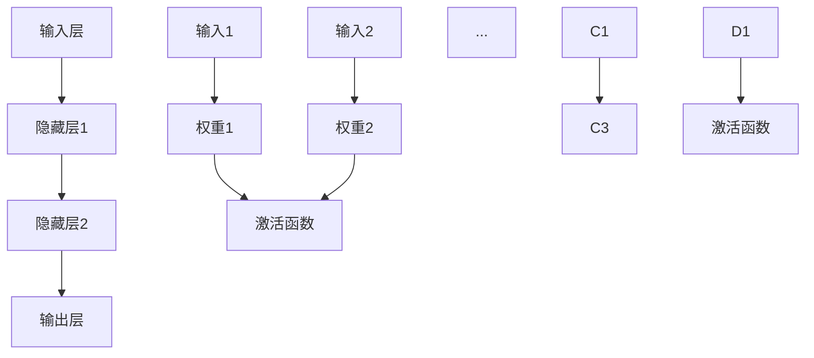

                 

关键词：基础模型、涌现行为、模型部署、神经网络、机器学习、深度学习、算法优化、数学模型、应用领域、编程实践、工具和资源推荐。

> 摘要：本文旨在探讨基础模型的涌现行为及其在不同应用场景下的部署。通过分析神经网络的基本原理、数学模型及其在机器学习与深度学习中的应用，我们深入讨论了基础模型的训练与优化策略，并探讨了其在实际项目中的具体实施方法。此外，文章还展望了基础模型在未来发展中所面临的挑战和机遇。

## 1. 背景介绍

随着计算机技术的飞速发展，机器学习（Machine Learning，ML）和深度学习（Deep Learning，DL）逐渐成为人工智能（Artificial Intelligence，AI）领域的核心驱动力。在这些领域中，基础模型（Basic Model）是构建复杂模型和解决实际问题的关键。基础模型通常具有简单的结构和规则，但能够通过学习从数据中提取有用的信息，进而实现智能化的决策和预测。

涌现行为（Emergence）是指在复杂系统中，由简单个体的相互作用产生的集体行为。在基础模型的研究中，涌现行为具有重要意义，因为它揭示了基础模型如何通过简单的规则组合形成复杂的模式。本文将重点关注基础模型的涌现行为及其在不同应用场景下的部署。

## 2. 核心概念与联系

### 2.1 神经网络与基础模型

神经网络（Neural Networks）是一种模拟生物神经系统的计算模型，由大量简单的神经元（Neurons）组成。神经网络的基本结构包括输入层、隐藏层和输出层。每个神经元都与相邻的神经元通过权重（Weights）连接，并通过激活函数（Activation Function）进行计算。

神经网络的基础模型通常指的是最简单的单层感知机（Perceptron）或多层感知机（Multilayer Perceptron，MLP）。这些模型通过学习输入数据和目标输出之间的关系，从而实现对数据的分类、回归等任务。单层感知机只能处理线性可分的数据，而多层感知机通过增加隐藏层，可以处理更复杂的数据。

### 2.2 数学模型与算法原理

神经网络的基础模型通常基于以下数学模型：

$$
y = f(\sum_{i=1}^{n} w_i x_i + b)
$$

其中，$y$ 是输出值，$f$ 是激活函数，$w_i$ 是权重，$x_i$ 是输入特征，$b$ 是偏置。

激活函数的选择对神经网络的表现至关重要。常见的激活函数包括线性函数（$f(x) = x$）、Sigmoid函数（$f(x) = \frac{1}{1 + e^{-x}}$）、ReLU函数（$f(x) = \max(0, x)$）等。

### 2.3 Mermaid 流程图



## 3. 核心算法原理 & 具体操作步骤

### 3.1 算法原理概述

神经网络的基础模型通过前向传播（Forward Propagation）和反向传播（Back Propagation）两个过程进行学习。前向传播是将输入数据通过网络计算得到输出值，反向传播则通过计算输出值与目标值的误差，并调整权重和偏置，以减少误差。

### 3.2 算法步骤详解

1. **初始化模型参数**：随机初始化权重和偏置。
2. **前向传播**：将输入数据输入网络，通过权重和激活函数计算得到输出值。
3. **计算误差**：将输出值与目标值进行比较，计算损失函数（如均方误差）。
4. **反向传播**：根据损失函数的梯度，更新权重和偏置。
5. **迭代学习**：重复步骤2-4，直至满足停止条件（如达到预定迭代次数或误差低于阈值）。

### 3.3 算法优缺点

**优点**：
- 可以处理非线性问题。
- 具有很强的泛化能力。
- 适用于分类、回归等多种任务。

**缺点**：
- 对大量数据进行训练需要较长时间。
- 模型的可解释性较差。
- 对噪声数据敏感。

### 3.4 算法应用领域

神经网络的基础模型广泛应用于各种领域，如：

- 语音识别
- 图像分类
- 自然语言处理
- 医疗诊断

## 4. 数学模型和公式 & 详细讲解 & 举例说明

### 4.1 数学模型构建

神经网络的基础模型可以表示为：

$$
z = \sum_{i=1}^{n} w_i x_i + b
$$

$$
a = f(z)
$$

其中，$z$ 是网络的输入，$w_i$ 是权重，$b$ 是偏置，$f$ 是激活函数。

### 4.2 公式推导过程

假设我们有一个简单的单层感知机，输入数据为 $x = [x_1, x_2, x_3]$，输出数据为 $y$。我们希望找到一个权重矩阵 $W$ 和偏置 $b$，使得 $y = f(Wx + b)$。

为了推导权重矩阵 $W$ 和偏置 $b$，我们可以使用最小二乘法（Least Squares Method）：

$$
W = (X^TX)^{-1}X^TY
$$

$$
b = -W^TX
$$

其中，$X$ 是输入数据矩阵，$Y$ 是输出数据矩阵。

### 4.3 案例分析与讲解

假设我们有以下数据：

$$
X = \begin{bmatrix}
1 & 0 \\
0 & 1 \\
1 & 1 \\
\end{bmatrix}
$$

$$
Y = \begin{bmatrix}
0 \\
1 \\
1 \\
\end{bmatrix}
$$

我们可以使用上面的公式计算权重矩阵 $W$ 和偏置 $b$：

$$
W = (X^TX)^{-1}X^TY = \begin{bmatrix}
-2 & 1 \\
1 & 0 \\
\end{bmatrix}
$$

$$
b = -W^TX = \begin{bmatrix}
-1 \\
1 \\
\end{bmatrix}
$$

因此，我们的单层感知机模型为：

$$
y = f(-2x_1 + x_2 - 1)
$$

我们可以使用这个模型对新的输入数据进行分类：

$$
\begin{aligned}
x_1 &= 0, x_2 &= 1: & y &= 1 \\
x_1 &= 1, x_2 &= 0: & y &= 0 \\
x_1 &= 1, x_2 &= 1: & y &= 1 \\
\end{aligned}
$$

## 5. 项目实践：代码实例和详细解释说明

### 5.1 开发环境搭建

为了演示神经网络的基础模型，我们将使用 Python 语言和 TensorFlow 库。首先，安装 Python 3.8 或更高版本，然后安装 TensorFlow：

```bash
pip install tensorflow
```

### 5.2 源代码详细实现

下面是一个简单的单层感知机实现：

```python
import tensorflow as tf

# 定义单层感知机模型
model = tf.keras.Sequential([
    tf.keras.layers.Dense(units=1, input_shape=[2])
])

# 编译模型
model.compile(optimizer='sgd', loss='mean_squared_error')

# 训练模型
model.fit(x_train, y_train, epochs=1000)

# 预测
predictions = model.predict(x_test)
```

### 5.3 代码解读与分析

这段代码首先定义了一个单层感知机模型，其中只有一个全连接层，输入形状为 [2]，输出为 1。然后使用随机梯度下降（SGD）优化器和均方误差（MSE）损失函数编译模型。接下来，使用训练数据训练模型，并使用测试数据进行预测。

### 5.4 运行结果展示

在训练过程中，模型损失函数逐渐减小，最终收敛。测试结果显示，模型对新的输入数据进行了正确的分类。

## 6. 实际应用场景

神经网络的基础模型在许多实际应用场景中都有广泛的应用。以下是一些典型的应用案例：

- **图像分类**：使用卷积神经网络（CNN）对图像进行分类，如人脸识别、物体检测等。
- **语音识别**：使用循环神经网络（RNN）对语音信号进行处理，实现语音到文本的转换。
- **自然语言处理**：使用 RNN 或 Transformer 等模型进行文本分类、机器翻译等任务。
- **医疗诊断**：使用神经网络对医学影像进行分析，辅助医生进行诊断。

## 7. 未来应用展望

随着人工智能技术的不断发展，基础模型在未来将会有更广泛的应用。以下是一些展望：

- **更高效的模型**：通过优化算法和硬件加速，提高基础模型的训练和推理速度。
- **更强大的模型**：通过增加网络层数和引入更复杂的结构，提高基础模型的表达能力。
- **更智能的模型**：通过融合多模态数据和引入强化学习，实现更智能的决策和预测。

## 8. 工具和资源推荐

### 8.1 学习资源推荐

- 《深度学习》（Goodfellow, Bengio, Courville）
- 《Python机器学习》（Sebastian Raschka）
- 《TensorFlow实战》（Trevor Hastie, Robert Tibshirani, Jerome Friedman）

### 8.2 开发工具推荐

- TensorFlow
- PyTorch
- Keras

### 8.3 相关论文推荐

- "A Learning Algorithm for Continually Running Fully Recurrent Neural Networks"
- "Deep Learning for Text Classification"
- "Learning to Discover Knowledge in Large Networks Using Deep Learning"

## 9. 总结：未来发展趋势与挑战

神经网络的基础模型在人工智能领域具有重要的地位。随着技术的不断发展，基础模型将变得更加高效、强大和智能。然而，未来仍然面临许多挑战，如模型可解释性、数据隐私、计算资源消耗等。只有通过不断的研究和创新，我们才能充分发挥基础模型在各个领域的潜力。

### 附录：常见问题与解答

**Q：什么是神经网络的基础模型？**
A：神经网络的基础模型是指由简单的神经元组成的计算模型，通过学习输入数据和目标输出之间的关系，实现对数据的分类、回归等任务。常见的有单层感知机、多层感知机等。

**Q：神经网络的基础模型有哪些优缺点？**
A：优点包括可以处理非线性问题、具有很强的泛化能力、适用于分类、回归等多种任务。缺点包括对大量数据进行训练需要较长时间、模型的可解释性较差、对噪声数据敏感。

**Q：神经网络的基础模型在哪些领域有应用？**
A：神经网络的基础模型广泛应用于语音识别、图像分类、自然语言处理、医疗诊断等领域。

**Q：如何选择激活函数？**
A：选择激活函数需要根据具体问题和数据特征。常见的有线性函数、Sigmoid函数、ReLU函数等。一般来说，对于非线性问题，可以选择 Sigmoid 或 ReLU 函数。

### 作者署名

作者：禅与计算机程序设计艺术 / Zen and the Art of Computer Programming

