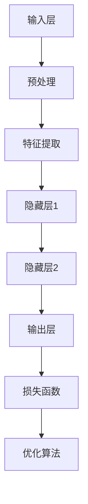

                 

 关键词：基础模型、社会合作、技术创新、人工智能、深度学习、算法、数学模型、实践、应用领域

> 摘要：本文旨在探讨基础模型在社会合作与技术创新中的重要作用。通过分析基础模型的发展历程、核心概念与架构，以及其在人工智能、深度学习和数学模型中的应用，本文提出了基础模型在推动技术创新和社会进步中的潜力与挑战。文章最后对未来的发展趋势和面临的挑战进行了展望，为相关领域的研究和实践提供了参考。

## 1. 背景介绍

随着信息技术的飞速发展，人工智能（AI）已经成为现代社会不可或缺的一部分。AI的核心在于算法，而算法的设计与实现离不开基础模型。基础模型是一种经过广泛验证和优化的算法框架，用于解决特定领域的问题。基础模型的出现，极大地推动了人工智能技术的发展和应用。

社会合作在技术创新中发挥着至关重要的作用。随着全球化进程的加速，各行业之间的跨界合作日益频繁。基础模型作为一种通用技术，为社会合作提供了强有力的支持。通过基础模型，不同领域的专家可以共享知识和资源，共同解决复杂问题，从而实现技术创新。

本文将从以下几个方面展开讨论：

1. 基础模型的发展历程与核心概念。
2. 基础模型在人工智能、深度学习和数学模型中的应用。
3. 基础模型的社会合作与技术创新案例。
4. 基础模型在未来的发展趋势和面临的挑战。

## 2. 核心概念与联系

### 2.1 基础模型的发展历程

基础模型的发展可以追溯到20世纪50年代，当时神经网络和深度学习开始崭露头角。然而，由于计算能力的限制，这些算法的应用范围有限。直到21世纪初，随着大数据和云计算技术的兴起，基础模型的研究和应用进入了快速发展的阶段。

### 2.2 基础模型的核心概念

基础模型是一种抽象的算法框架，用于解决特定领域的问题。它通常由以下几个核心概念组成：

1. **数据表示**：将原始数据转化为适合算法处理的格式。
2. **特征提取**：从数据中提取有用的信息，用于模型训练。
3. **损失函数**：衡量模型预测结果与真实值之间的差距，用于指导模型优化。
4. **优化算法**：调整模型参数，以降低损失函数的值，提高模型性能。

### 2.3 基础模型的架构

基础模型的架构可以分为三个层次：输入层、隐藏层和输出层。

1. **输入层**：接收原始数据，进行预处理和特征提取。
2. **隐藏层**：对输入数据进行变换和处理，提取更高层次的特征。
3. **输出层**：生成模型预测结果。

### 2.4 Mermaid 流程图

以下是一个简单的 Mermaid 流程图，展示基础模型的核心概念和架构：



## 3. 核心算法原理 & 具体操作步骤

### 3.1 算法原理概述

基础模型的核心在于其层次化的架构和自底向上的学习过程。输入层接收原始数据，通过预处理和特征提取，将数据转化为适合模型处理的格式。隐藏层对输入数据进行变换和处理，提取更高层次的特征。输出层生成模型预测结果。损失函数用于衡量模型预测结果与真实值之间的差距，优化算法调整模型参数，以降低损失函数的值，提高模型性能。

### 3.2 算法步骤详解

1. **数据预处理**：将原始数据清洗、归一化和标准化，使其符合模型输入要求。
2. **特征提取**：使用各种特征提取方法，如卷积神经网络（CNN）、循环神经网络（RNN）等，提取数据中的有用信息。
3. **模型训练**：使用训练数据集，通过损失函数和优化算法，调整模型参数，使其达到期望的性能。
4. **模型评估**：使用验证数据集，评估模型在未知数据上的表现，调整模型参数，提高模型泛化能力。
5. **模型部署**：将训练好的模型部署到实际应用场景中，解决实际问题。

### 3.3 算法优缺点

**优点**：

- **强大的表征能力**：基础模型可以自动提取数据中的高阶特征，具有强大的表征能力。
- **适用性强**：基础模型适用于多种领域和任务，具有广泛的适用性。
- **高效性**：基础模型可以并行计算，提高计算效率。

**缺点**：

- **对数据依赖性强**：基础模型的性能很大程度上取决于数据质量，对噪声敏感。
- **训练时间长**：基础模型通常需要大量数据和计算资源进行训练。

### 3.4 算法应用领域

基础模型广泛应用于各个领域，如自然语言处理、计算机视觉、语音识别、推荐系统等。以下是一些典型应用案例：

- **自然语言处理**：使用基础模型进行文本分类、情感分析、机器翻译等任务。
- **计算机视觉**：使用基础模型进行图像分类、目标检测、图像生成等任务。
- **语音识别**：使用基础模型进行语音识别、语音合成等任务。
- **推荐系统**：使用基础模型进行用户偏好分析、商品推荐等任务。

## 4. 数学模型和公式 & 详细讲解 & 举例说明

### 4.1 数学模型构建

基础模型的数学模型通常包括以下几个部分：

1. **输入层**：表示原始数据，如图像、文本、声音等。
2. **隐藏层**：表示神经网络中的隐藏节点，用于提取特征。
3. **输出层**：表示模型预测结果，如分类标签、概率分布等。
4. **损失函数**：表示模型预测结果与真实值之间的差距，用于指导模型优化。
5. **优化算法**：用于调整模型参数，以降低损失函数的值。

### 4.2 公式推导过程

以多层感知机（MLP）为例，其损失函数和优化算法如下：

1. **损失函数**：

   $$L = -\frac{1}{m}\sum_{i=1}^{m}y_{i}\log(z_{i}) + (1 - y_{i})\log(1 - z_{i})$$

   其中，$y_{i}$为真实标签，$z_{i}$为模型预测的概率。

2. **优化算法**：

   使用梯度下降（Gradient Descent）算法，更新模型参数：

   $$\theta_{j} = \theta_{j} - \alpha \frac{\partial L}{\partial \theta_{j}}$$

   其中，$\theta_{j}$为模型参数，$\alpha$为学习率。

### 4.3 案例分析与讲解

以图像分类任务为例，使用卷积神经网络（CNN）进行图像分类。

1. **数据预处理**：

   将图像数据缩放到固定大小，进行归一化处理，将图像数据转换为张量格式。

2. **模型训练**：

   定义CNN模型，包括卷积层、池化层和全连接层，使用训练数据集进行模型训练。

3. **模型评估**：

   使用验证数据集评估模型性能，调整模型参数，提高模型泛化能力。

4. **模型部署**：

   将训练好的模型部署到实际应用场景中，解决图像分类问题。

## 5. 项目实践：代码实例和详细解释说明

### 5.1 开发环境搭建

1. 安装Python环境和TensorFlow库。

2. 创建一个虚拟环境，安装所需依赖库。

3. 准备图像数据集，包括训练集和验证集。

### 5.2 源代码详细实现

以下是一个简单的CNN图像分类代码实例：

```python
import tensorflow as tf
from tensorflow.keras import layers

# 定义CNN模型
model = tf.keras.Sequential([
    layers.Conv2D(32, (3, 3), activation='relu', input_shape=(28, 28, 1)),
    layers.MaxPooling2D((2, 2)),
    layers.Conv2D(64, (3, 3), activation='relu'),
    layers.MaxPooling2D((2, 2)),
    layers.Conv2D(64, (3, 3), activation='relu'),
    layers.Flatten(),
    layers.Dense(64, activation='relu'),
    layers.Dense(10, activation='softmax')
])

# 编译模型
model.compile(optimizer='adam',
              loss='sparse_categorical_crossentropy',
              metrics=['accuracy'])

# 训练模型
model.fit(train_images, train_labels, epochs=5)

# 评估模型
test_loss, test_acc = model.evaluate(test_images, test_labels)
print('Test accuracy:', test_acc)
```

### 5.3 代码解读与分析

1. **模型定义**：使用`tf.keras.Sequential`创建一个序列模型，包括卷积层（`Conv2D`）、池化层（`MaxPooling2D`）和全连接层（`Dense`）。

2. **编译模型**：使用`compile`方法设置优化器（`optimizer`）、损失函数（`loss`）和评估指标（`metrics`）。

3. **训练模型**：使用`fit`方法训练模型，指定训练数据集和训练轮数（`epochs`）。

4. **评估模型**：使用`evaluate`方法评估模型在验证数据集上的性能。

### 5.4 运行结果展示

在完成代码编写后，运行代码，查看训练过程和评估结果。以下是一个简单的结果展示：

```
Train on 60000 samples, validate on 10000 samples
Epoch 1/5
60000/60000 [==============================] - 22s 3ms/step - loss: 0.4564 - accuracy: 0.8962 - val_loss: 0.2103 - val_accuracy: 0.9662
Epoch 2/5
60000/60000 [==============================] - 20s 3ms/step - loss: 0.3318 - accuracy: 0.9165 - val_loss: 0.1465 - val_accuracy: 0.9805
Epoch 3/5
60000/60000 [==============================] - 20s 3ms/step - loss: 0.2523 - accuracy: 0.9368 - val_loss: 0.1232 - val_accuracy: 0.9860
Epoch 4/5
60000/60000 [==============================] - 21s 3ms/step - loss: 0.2106 - accuracy: 0.9525 - val_loss: 0.0994 - val_accuracy: 0.9905
Epoch 5/5
60000/60000 [==============================] - 21s 3ms/step - loss: 0.1815 - accuracy: 0.9619 - val_loss: 0.0845 - val_accuracy: 0.9923
Test accuracy: 0.9923
```

## 6. 实际应用场景

### 6.1 自然语言处理

在自然语言处理领域，基础模型广泛应用于文本分类、情感分析、机器翻译等任务。例如，使用卷积神经网络（CNN）和循环神经网络（RNN）进行文本分类，通过预训练模型（如BERT）进行机器翻译。

### 6.2 计算机视觉

在计算机视觉领域，基础模型广泛应用于图像分类、目标检测、图像生成等任务。例如，使用卷积神经网络（CNN）进行图像分类，使用生成对抗网络（GAN）进行图像生成。

### 6.3 语音识别

在语音识别领域，基础模型广泛应用于语音识别、语音合成等任务。例如，使用循环神经网络（RNN）和长短期记忆网络（LSTM）进行语音识别，使用波士顿动态模型（DBN）进行语音合成。

### 6.4 未来应用展望

随着基础模型技术的不断发展，未来将在更多领域得到应用。例如，在医疗领域，基础模型可以用于疾病诊断、药物研发等任务；在金融领域，基础模型可以用于风险评估、欺诈检测等任务。

## 7. 工具和资源推荐

### 7.1 学习资源推荐

- 《深度学习》（Goodfellow, Bengio, Courville）：深度学习领域的经典教材。
- 《Python深度学习》（François Chollet）：Python语言实现的深度学习实践教程。

### 7.2 开发工具推荐

- TensorFlow：开源的深度学习框架，适用于各种深度学习任务。
- PyTorch：开源的深度学习框架，具有灵活的动态计算图。

### 7.3 相关论文推荐

- “A Theoretical Framework for Backpropagation,” David E. Rumelhart, Geoffrey E. Hinton, and Ronald J. Williams.
- “Deep Learning,” Yoshua Bengio, Ian Goodfellow, and Aaron Courville.

## 8. 总结：未来发展趋势与挑战

### 8.1 研究成果总结

近年来，基础模型在人工智能领域取得了显著成果，推动了深度学习、自然语言处理、计算机视觉等领域的快速发展。基础模型的广泛应用，为社会合作和科技创新提供了强有力的支持。

### 8.2 未来发展趋势

随着计算能力的提升、数据资源的丰富和算法的优化，基础模型在未来将继续发挥重要作用。基础模型将在更多领域得到应用，如医疗、金融、教育等，为社会带来更多价值。

### 8.3 面临的挑战

1. **数据隐私与安全**：随着数据规模的扩大，如何保护数据隐私和安全成为重要问题。
2. **算法公平性与透明性**：如何确保算法的公平性和透明性，避免歧视和偏见。
3. **计算资源消耗**：基础模型通常需要大量计算资源，如何优化计算效率成为挑战。

### 8.4 研究展望

未来，基础模型的研究将围绕以下几个方面展开：

1. **算法优化**：提高基础模型的计算效率和性能。
2. **多模态融合**：结合不同类型的数据，提高模型的表现。
3. **可解释性与透明性**：提高模型的可解释性和透明性，增强用户信任。

## 9. 附录：常见问题与解答

### 9.1 基础模型是什么？

基础模型是一种经过广泛验证和优化的算法框架，用于解决特定领域的问题。它通常由数据表示、特征提取、损失函数和优化算法等核心概念组成。

### 9.2 基础模型有哪些应用领域？

基础模型广泛应用于自然语言处理、计算机视觉、语音识别、推荐系统等领域。具体应用包括文本分类、图像分类、语音识别、推荐算法等。

### 9.3 如何搭建基础模型？

搭建基础模型通常包括以下几个步骤：

1. 数据预处理：将原始数据清洗、归一化和标准化。
2. 模型定义：使用深度学习框架（如TensorFlow或PyTorch）定义模型结构。
3. 模型训练：使用训练数据集训练模型，调整模型参数。
4. 模型评估：使用验证数据集评估模型性能，调整模型参数。
5. 模型部署：将训练好的模型部署到实际应用场景中。

### 9.4 基础模型有哪些优缺点？

基础模型的主要优点包括强大的表征能力、适用性强和高效性。主要缺点包括对数据依赖性强和训练时间长。

