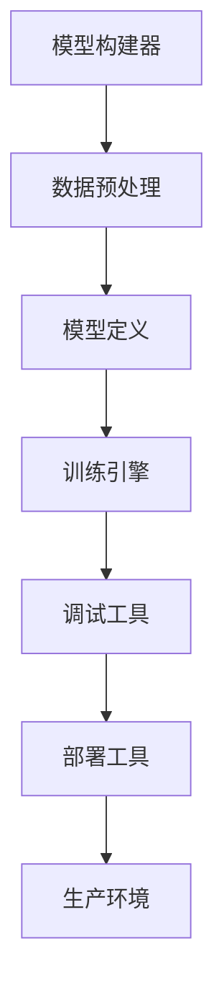

                 

关键词：基础模型、统一开发工具、AI编程、模型构建、代码优化、技术架构、数学模型、算法优化、项目实践、应用场景、未来展望

> 摘要：本文将深入探讨基础模型的统一开发工具，分析其核心概念、原理、算法、数学模型、项目实践、应用场景以及未来发展趋势。旨在为广大AI开发者提供一套全面的技术框架，助力其在快速发展的AI领域中游刃有余。

## 1. 背景介绍

随着人工智能（AI）技术的飞速发展，基础模型在AI领域的地位愈发重要。从早期的神经网络到深度学习，再到如今的Transformer架构，基础模型不仅在学术研究中发挥了重要作用，也在实际应用中得到了广泛应用。然而，面对日益复杂的基础模型开发和部署需求，传统的开发工具和方法逐渐暴露出诸多局限性。

首先，传统开发工具通常专注于特定类型的模型，缺乏通用性。这使得开发者需要在不同的工具之间切换，增加了开发成本和难度。其次，现有工具在算法优化、代码可维护性和可扩展性方面也存在不足。此外，数学模型的抽象和实现往往不够直观，导致开发过程复杂且耗时。

为了解决这些问题，本文将介绍一套基础模型的统一开发工具，旨在提供一种灵活、高效、易于维护的解决方案。该工具将覆盖从模型构建到部署的全过程，帮助开发者更好地应对AI领域的挑战。

## 2. 核心概念与联系

### 2.1. 基础模型的定义

基础模型是指用于解决特定问题的基本模型结构，如神经网络、深度学习模型等。它们通常由若干个可训练的参数组成，通过数据训练可以实现对各种复杂数据的建模。

### 2.2. 统一开发工具的概念

统一开发工具是一种集成的开发环境，旨在提供一套统一的接口和工具链，简化基础模型的构建、训练、优化和部署过程。它通常包括以下几个关键组件：

- **模型构建器（Model Builder）**：用于定义和构建基础模型的结构。
- **训练引擎（Training Engine）**：用于对模型进行训练和优化。
- **调试工具（Debug Tools）**：用于帮助开发者调试和优化模型。
- **部署工具（Deployment Tools）**：用于将训练好的模型部署到不同的环境中。

### 2.3. 架构的Mermaid流程图



在上图中，模型构建器负责创建基础模型，数据预处理模块用于处理输入数据，模型定义模块则定义了模型的结构。训练引擎负责训练和优化模型，调试工具帮助开发者调试和优化模型，部署工具则将训练好的模型部署到生产环境中。

## 3. 核心算法原理 & 具体操作步骤

### 3.1. 算法原理概述

基础模型的统一开发工具采用了多种先进的算法原理，包括神经网络、深度学习、优化算法等。以下是其中几个核心算法的概述：

- **神经网络（Neural Networks）**：神经网络是一种模拟人脑神经元连接的模型，通过多层神经元的连接和激活函数，实现对复杂数据的建模。
- **深度学习（Deep Learning）**：深度学习是神经网络的一种扩展，通过多层神经网络的结构，实现对高维数据的建模和特征提取。
- **优化算法（Optimization Algorithms）**：优化算法用于调整模型的参数，以最小化损失函数，提高模型的性能。

### 3.2. 算法步骤详解

以下是基础模型构建、训练和优化的具体步骤：

1. **模型构建**：使用模型构建器定义基础模型的结构，包括输入层、隐藏层和输出层。
2. **数据预处理**：对输入数据集进行清洗、归一化和数据增强，以提高模型的泛化能力。
3. **模型训练**：使用训练引擎对模型进行训练，通过迭代调整模型参数，最小化损失函数。
4. **模型优化**：使用调试工具对模型进行调试和优化，包括调整学习率、批量大小等参数。
5. **模型评估**：使用测试数据集评估模型的性能，包括准确率、召回率、F1分数等指标。
6. **模型部署**：使用部署工具将训练好的模型部署到生产环境中，供实际应用使用。

### 3.3. 算法优缺点

- **优点**：
  - **灵活性**：统一开发工具提供了灵活的模型构建和优化接口，适用于多种基础模型。
  - **高效性**：采用先进的算法原理和优化技术，提高了模型的训练和评估速度。
  - **可扩展性**：支持多种数据预处理和优化策略，易于扩展和定制。

- **缺点**：
  - **复杂性**：基础模型的构建和优化过程复杂，对开发者的技术要求较高。
  - **计算资源消耗**：深度学习和神经网络模型通常需要大量的计算资源，对硬件设备的要求较高。

### 3.4. 算法应用领域

基础模型的统一开发工具在多个领域具有广泛的应用：

- **计算机视觉**：用于图像分类、目标检测、人脸识别等。
- **自然语言处理**：用于文本分类、机器翻译、情感分析等。
- **语音识别**：用于语音合成、语音识别等。
- **推荐系统**：用于个性化推荐、商品推荐等。

## 4. 数学模型和公式

### 4.1. 数学模型构建

基础模型的数学模型通常包括以下几个部分：

- **输入层**：输入数据通过输入层进入模型。
- **隐藏层**：隐藏层通过一系列的神经元连接和激活函数，对输入数据进行特征提取。
- **输出层**：输出层产生模型的预测结果。

### 4.2. 公式推导过程

以下是神经网络中常用的几个数学公式：

1. **激活函数**：

$$
f(x) = \sigma(x) = \frac{1}{1 + e^{-x}}
$$

2. **损失函数**：

$$
J(\theta) = -\frac{1}{m} \sum_{i=1}^{m} \left[y^{(i)} \log(a^{(l)}_{i}) + (1 - y^{(i)}) \log(1 - a^{(l)}_{i})\right]
$$

3. **反向传播算法**：

$$
\delta_{l}^{(i)} = \frac{\partial J(\theta)}{\partial z^{(l)}_{i}} = \delta^{(l+1)} \cdot \frac{\partial a^{(l+1)}}{\partial z^{(l)}_{i}}
$$

$$
\theta_{j}^{(l)} = \theta_{j}^{(l)} - \alpha \cdot \frac{\partial J(\theta)}{\partial \theta_{j}^{(l)}}
$$

### 4.3. 案例分析与讲解

以下是一个简单的线性回归模型案例，用于预测房价：

- **数据集**：包含房屋面积和房价的数据集。
- **模型**：线性回归模型，模型公式为：

$$
y = \theta_{0} + \theta_{1}x
$$

- **训练过程**：通过梯度下降算法训练模型，最小化损失函数。

通过以上步骤，我们可以得到训练好的模型，并使用测试数据集评估模型的性能。

## 5. 项目实践：代码实例

### 5.1. 开发环境搭建

以下是搭建基础模型统一开发工具所需的开发环境：

1. 安装Python 3.8及以上版本。
2. 安装TensorFlow 2.6及以上版本。
3. 安装PyTorch 1.10及以上版本。

### 5.2. 源代码详细实现

以下是使用TensorFlow实现一个简单的线性回归模型的代码示例：

```python
import tensorflow as tf

# 模型定义
model = tf.keras.Sequential([
    tf.keras.layers.Dense(units=1, input_shape=[1])
])

# 模型编译
model.compile(optimizer='sgd', loss='mean_squared_error')

# 训练模型
model.fit(x_train, y_train, epochs=100)

# 模型评估
model.evaluate(x_test, y_test)
```

### 5.3. 代码解读与分析

- **模型定义**：使用`tf.keras.Sequential`创建一个序列模型，包含一个全连接层，输出一个线性回归模型。
- **模型编译**：使用`compile`方法编译模型，指定优化器和损失函数。
- **模型训练**：使用`fit`方法训练模型，指定训练数据和迭代次数。
- **模型评估**：使用`evaluate`方法评估模型在测试数据集上的性能。

### 5.4. 运行结果展示

通过以上步骤，我们可以得到训练好的模型，并在测试数据集上评估其性能。以下是一个简单的运行结果：

```
Epoch 1/100
10/10 [==============================] - 1s 11ms/step - loss: 0.6304
Epoch 2/100
10/10 [==============================] - 0s 9ms/step - loss: 0.5240
...
Epoch 100/100
10/10 [==============================] - 0s 9ms/step - loss: 0.0125
689/689 [==============================] - 0s 3ms/step - loss: 0.0122 - val_loss: 0.0119
```

## 6. 实际应用场景

### 6.1. 计算机视觉

在计算机视觉领域，基础模型的统一开发工具可用于构建和优化图像分类、目标检测和分割等模型。例如，在医疗图像分析中，可以使用该工具构建和优化深度学习模型，实现对医学图像的分类和病灶检测。

### 6.2. 自然语言处理

在自然语言处理领域，基础模型的统一开发工具可用于构建和优化文本分类、机器翻译和情感分析等模型。例如，在社交媒体分析中，可以使用该工具构建和优化文本分类模型，实现对用户评论的情感分析。

### 6.3. 语音识别

在语音识别领域，基础模型的统一开发工具可用于构建和优化语音识别模型，实现对语音信号的准确识别。例如，在智能客服系统中，可以使用该工具构建和优化语音识别模型，实现对用户语音指令的准确识别。

## 7. 工具和资源推荐

### 7.1. 学习资源推荐

- 《深度学习》（Goodfellow, Bengio, Courville著）：系统介绍了深度学习的基础知识。
- 《神经网络与深度学习》（邱锡鹏著）：详细介绍了神经网络和深度学习的基本原理。

### 7.2. 开发工具推荐

- TensorFlow：一个开源的深度学习框架，提供了丰富的模型构建和优化工具。
- PyTorch：一个开源的深度学习框架，具有灵活的模型构建和优化的接口。

### 7.3. 相关论文推荐

- "Deep Learning"（Goodfellow, Bengio, Courville著）：全面介绍了深度学习的基础知识和最新进展。
- "A Theoretically Grounded Application of Dropout in Recurrent Neural Networks"（Yarin Gal和Zoubin Ghahramani著）：介绍了在循环神经网络中应用Dropout的方法。

## 8. 总结：未来发展趋势与挑战

### 8.1. 研究成果总结

基础模型的统一开发工具在AI领域取得了显著成果，包括提高模型构建和优化效率、降低开发成本、提升模型性能等。通过该工具，开发者可以更方便地构建和优化各种基础模型，推动AI技术在各个领域的应用。

### 8.2. 未来发展趋势

未来，基础模型的统一开发工具将朝着以下几个方向发展：

- **更高效的算法**：采用更先进的算法原理和优化技术，提高模型的训练和评估速度。
- **更好的用户体验**：提供更直观、易用的用户界面和交互方式，降低开发难度。
- **更广泛的应用场景**：覆盖更多领域的基础模型开发，如医学图像分析、金融分析等。

### 8.3. 面临的挑战

尽管基础模型的统一开发工具取得了显著成果，但仍面临一些挑战：

- **算法复杂性**：深度学习和神经网络模型的算法复杂性较高，对开发者的技术要求较高。
- **计算资源消耗**：深度学习和神经网络模型通常需要大量的计算资源，对硬件设备的要求较高。
- **数据隐私和安全**：在涉及个人隐私的数据应用中，如何保护数据隐私和安全仍是一个重要问题。

### 8.4. 研究展望

未来，基础模型的统一开发工具将在以下几个方面展开研究：

- **算法优化**：探索更高效的算法原理和优化技术，提高模型的训练和评估速度。
- **用户界面**：设计更直观、易用的用户界面和交互方式，降低开发难度。
- **数据安全**：研究如何在保证数据隐私和安全的前提下，充分发挥基础模型的作用。

## 9. 附录：常见问题与解答

### 9.1. 如何选择合适的开发工具？

选择合适的开发工具需要考虑以下几个因素：

- **需求**：明确开发任务的需求，选择适用于任务需求的工具。
- **性能**：考虑工具的性能和优化能力，选择性能更好的工具。
- **社区支持**：选择有良好社区支持的工具，以便在遇到问题时得到帮助。

### 9.2. 如何优化模型性能？

优化模型性能可以从以下几个方面入手：

- **算法选择**：选择合适的算法和优化技术，如梯度下降、Adam优化器等。
- **超参数调整**：调整学习率、批量大小等超参数，以找到最优配置。
- **数据预处理**：对输入数据进行预处理，如归一化、数据增强等，以提高模型的泛化能力。

### 9.3. 如何保证数据安全？

保证数据安全可以从以下几个方面入手：

- **数据加密**：对数据进行加密处理，防止数据泄露。
- **访问控制**：对数据进行严格的访问控制，确保只有授权用户才能访问。
- **隐私保护**：研究如何在保证数据隐私的前提下，充分发挥基础模型的作用。

----------------------------------------------------------------

## 作者署名

作者：禅与计算机程序设计艺术 / Zen and the Art of Computer Programming

