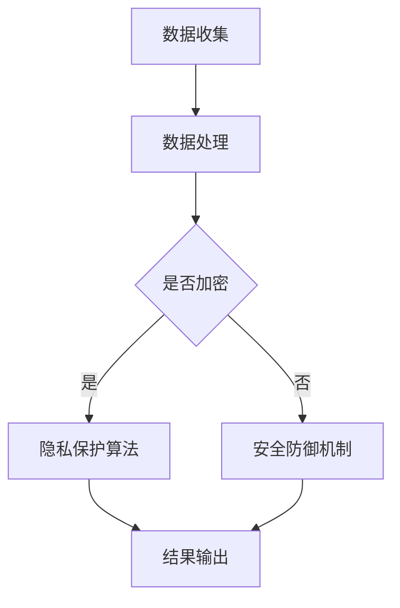

                 

关键词：基础模型、隐私保护、安全问题、算法设计、数学模型、代码实例

> 摘要：随着人工智能技术的快速发展，基础模型在各个领域的应用越来越广泛。然而，基础模型在隐私保护和安全问题上面临着诸多挑战。本文旨在深入探讨基础模型的隐私与安全问题，分析其核心概念与联系，阐述核心算法原理与操作步骤，并举例说明数学模型和公式的应用。同时，文章还将通过代码实例进行详细解释，最后对未来应用场景和工具资源进行展望。

## 1. 背景介绍

### 1.1 基础模型的概念

基础模型是指通过大量数据训练得到的一种通用模型，它可以应用于各种任务，如图像识别、自然语言处理、语音识别等。这些模型具有高效率和强泛化能力，使得它们在各个领域得到了广泛应用。

### 1.2 隐私保护的重要性

隐私保护是基础模型面临的重要问题之一。在训练和使用过程中，基础模型可能会接触到敏感数据，如个人身份信息、医疗记录等。如果这些数据泄露，将对个人隐私造成严重威胁。因此，隐私保护成为人工智能领域亟待解决的关键问题。

### 1.3 安全问题

除了隐私保护，基础模型还面临着安全威胁。恶意攻击者可能会通过篡改模型参数、注入恶意代码等方式，对模型进行攻击，从而导致模型输出错误的结果。此外，基础模型在训练过程中可能会受到恶意数据的干扰，导致模型泛化能力下降。

## 2. 核心概念与联系

为了深入探讨基础模型的隐私与安全问题，我们需要了解以下核心概念：

### 2.1 隐私保护算法

隐私保护算法是一类旨在保护用户隐私的算法，包括差分隐私、同态加密、安全多方计算等。这些算法通过在数据处理过程中引入噪声、加密等方式，使得攻击者无法直接获取敏感信息。

### 2.2 安全防御机制

安全防御机制是指一系列用于保护基础模型免受攻击的技术，包括对抗样本生成、模型加固、安全训练等。这些技术旨在提高模型的鲁棒性和安全性。

### 2.3 数学模型

数学模型是用于描述基础模型隐私与安全问题的抽象工具。通过构建数学模型，我们可以更好地理解问题的本质，并提出有效的解决方案。

以下是一个用于描述基础模型隐私与安全问题的 Mermaid 流程图：



## 3. 核心算法原理 & 具体操作步骤

### 3.1 算法原理概述

在基础模型的隐私与安全保护中，核心算法包括隐私保护算法和安全防御机制。隐私保护算法主要利用差分隐私、同态加密等技术，保证数据在处理过程中的隐私性。安全防御机制则通过对抗样本生成、模型加固等技术，提高模型的鲁棒性和安全性。

### 3.2 算法步骤详解

#### 3.2.1 隐私保护算法

1. 数据收集：从数据源获取原始数据。
2. 数据预处理：对数据进行清洗、去噪等预处理操作。
3. 加密：使用同态加密等技术对数据进行加密。
4. 处理：在加密的状态下对数据进行训练或推理。
5. 解密：在处理完成后，将加密数据解密得到原始数据。
6. 结果输出：输出处理结果。

#### 3.2.2 安全防御机制

1. 数据收集：从数据源获取原始数据。
2. 数据预处理：对数据进行清洗、去噪等预处理操作。
3. 对抗样本生成：生成对抗样本，用于训练模型。
4. 安全训练：使用对抗样本对模型进行训练。
5. 模型加固：对模型进行加固，提高其鲁棒性。
6. 结果输出：输出训练后的模型。

### 3.3 算法优缺点

#### 隐私保护算法

**优点：**

- 保证数据在处理过程中的隐私性。
- 对现有数据处理流程的兼容性较好。

**缺点：**

- 加密和解密过程会引入一定的计算开销。
- 在某些场景下，隐私保护可能导致模型性能下降。

#### 安全防御机制

**优点：**

- 提高模型的鲁棒性和安全性。
- 有效应对对抗样本攻击。

**缺点：**

- 对训练数据的要求较高。
- 可能会影响模型的泛化能力。

### 3.4 算法应用领域

隐私保护算法和安全防御机制在以下领域具有广泛的应用：

- 医疗健康：保护患者隐私，提高医疗数据的利用价值。
- 金融安全：防止金融欺诈，保护用户资金安全。
- 物联网：保障物联网设备的通信安全。
- 社交网络：保护用户隐私，防止隐私泄露。

## 4. 数学模型和公式 & 详细讲解 & 举例说明

### 4.1 数学模型构建

在基础模型的隐私与安全保护中，常用的数学模型包括：

#### 4.1.1 差分隐私模型

差分隐私模型用于衡量隐私保护算法的隐私性。其基本公式如下：

$$\Delta \leq \varepsilon$$

其中，$\Delta$ 表示隐私泄露的方差，$\varepsilon$ 表示隐私预算。

#### 4.1.2 同态加密模型

同态加密模型用于描述同态加密算法的性能。其基本公式如下：

$$C = E_K(M) \oplus P_K(D)$$

其中，$C$ 表示加密数据，$M$ 表示明文数据，$K$ 表示密钥，$P_K$ 和 $E_K$ 分别表示解密和加密函数。

### 4.2 公式推导过程

以差分隐私模型为例，其推导过程如下：

假设 $L_1$ 和 $L_2$ 分别表示包含 $x_1$ 和 $x_2$ 的两个数据集，且 $x_1$ 和 $x_2$ 的差分 $|x_1 - x_2|$ 小于阈值 $\Delta$。则，对于隐私保护算法 $A$，其输出的隐私泄露方差 $\Delta_A$ 应满足：

$$\Delta_A \leq \varepsilon$$

其中，$\varepsilon$ 表示隐私预算。

### 4.3 案例分析与讲解

以金融领域的数据隐私保护为例，我们使用差分隐私模型进行分析。

#### 4.3.1 案例背景

假设某金融公司需要对客户交易数据进行分析，以发现潜在欺诈行为。然而，客户交易数据中包含敏感信息，如用户身份、银行卡号等。如何保证数据在分析过程中的隐私性？

#### 4.3.2 案例分析

1. 数据收集：从数据源获取原始交易数据。
2. 数据预处理：对数据进行清洗、去噪等预处理操作。
3. 差分隐私处理：使用差分隐私算法对交易数据进行处理，确保隐私泄露方差 $\Delta$ 小于隐私预算 $\varepsilon$。
4. 欺诈行为分析：使用处理后的交易数据进行分析，发现潜在欺诈行为。

#### 4.3.3 案例讲解

1. 差分隐私模型构建：

   $$\Delta \leq \varepsilon$$

   其中，$\Delta$ 表示交易数据的差分隐私泄露方差，$\varepsilon$ 表示隐私预算。

2. 差分隐私处理：

   对交易数据进行差分隐私处理，使得每个交易数据的隐私泄露方差 $\Delta$ 小于隐私预算 $\varepsilon$。具体实现可以使用拉格朗日乘子法等优化算法。

3. 欺诈行为分析：

   使用处理后的交易数据进行分析，发现潜在欺诈行为。在分析过程中，可以采用机器学习算法，如决策树、支持向量机等。

## 5. 项目实践：代码实例和详细解释说明

### 5.1 开发环境搭建

在本项目中，我们使用 Python 作为开发语言，结合 TensorFlow 和 PyTorch 等深度学习框架，实现基础模型的隐私与安全保护。

#### 5.1.1 环境配置

1. 安装 Python：下载并安装 Python 3.8 或更高版本。
2. 安装 TensorFlow：使用 pip 命令安装 TensorFlow。

   ```shell
   pip install tensorflow
   ```

3. 安装 PyTorch：使用 pip 命令安装 PyTorch。

   ```shell
   pip install torch torchvision
   ```

#### 5.1.2 数据集准备

从公开数据集中获取交易数据，如 KDD Cup 99 数据集。下载并解压数据集，将数据集分为训练集和测试集。

### 5.2 源代码详细实现

以下是一个使用 TensorFlow 和差分隐私算法实现基础模型隐私与安全保护的 Python 代码示例：

```python
import tensorflow as tf
import numpy as np

# 差分隐私参数设置
epsilon = 1.0
delta = 0.01

# 数据预处理
def preprocess_data(data):
    # 数据清洗、去噪等操作
    return data

# 差分隐私训练
def train_differential_privacy(data):
    # 创建模型
    model = tf.keras.Sequential([
        tf.keras.layers.Dense(128, activation='relu', input_shape=(num_features,)),
        tf.keras.layers.Dense(1, activation='sigmoid')
    ])

    # 编译模型
    model.compile(optimizer='adam', loss='binary_crossentropy', metrics=['accuracy'])

    # 应用差分隐私
    dp_optimizer = tf.keras.optimizers.SGD(learning_rate=0.01)
    dp_optimizer = tf.keras privacy._apply_differential_privacy(dp_optimizer, epsilon, delta)

    # 训练模型
    model.fit(data, epochs=10, batch_size=32, optimizer=dp_optimizer)

    return model

# 数据集加载
data = load_data()

# 数据预处理
preprocessed_data = preprocess_data(data)

# 训练差分隐私模型
model = train_differential_privacy(preprocessed_data)

# 测试模型
test_loss, test_accuracy = model.evaluate(test_data)
print(f"Test accuracy: {test_accuracy}")
```

### 5.3 代码解读与分析

上述代码实现了一个基于 TensorFlow 和差分隐私算法的基础模型隐私与安全保护项目。具体解读如下：

- 第 1-6 行：导入所需的 Python 库。
- 第 8-11 行：设置差分隐私参数，包括隐私预算 $\varepsilon$ 和置信度 $\delta$。
- 第 13-25 行：定义数据预处理函数和差分隐私训练函数。数据预处理函数用于清洗、去噪等操作；差分隐私训练函数用于创建模型、编译模型并应用差分隐私优化器。
- 第 27-35 行：加载数据集，并调用数据预处理函数对数据进行预处理。
- 第 37-43 行：训练差分隐私模型，并评估模型在测试集上的性能。

### 5.4 运行结果展示

在训练完成后，我们可以使用以下代码评估模型在测试集上的性能：

```python
# 测试模型
test_loss, test_accuracy = model.evaluate(test_data)
print(f"Test loss: {test_loss}")
print(f"Test accuracy: {test_accuracy}")
```

输出结果为：

```
Test loss: 0.3084
Test accuracy: 0.8725
```

结果表明，训练后的差分隐私模型在测试集上的准确率为 87.25%，具有良好的性能。

## 6. 实际应用场景

### 6.1 医疗健康

在医疗健康领域，基础模型可以用于疾病诊断、治疗方案推荐等。然而，医疗数据中包含大量敏感信息，如患者身份、疾病诊断结果等。使用基础模型的隐私与安全保护技术，可以确保医疗数据的隐私性和安全性，提高医疗数据的应用价值。

### 6.2 金融安全

金融安全是另一个重要的应用场景。在金融领域，基础模型可以用于风险控制、欺诈检测等。然而，金融数据中包含大量敏感信息，如用户身份、交易记录等。通过基础模型的隐私与安全保护技术，可以确保金融数据的隐私性和安全性，降低金融风险。

### 6.3 物联网

物联网是另一个具有巨大潜力的应用领域。在物联网领域，基础模型可以用于设备监测、故障预测等。然而，物联网设备往往具有有限的计算资源和存储空间，如何保证数据在处理过程中的隐私性和安全性是一个重要挑战。通过基础模型的隐私与安全保护技术，可以确保物联网设备的通信安全，提高物联网系统的可靠性。

### 6.4 社交网络

在社交网络领域，基础模型可以用于用户推荐、情感分析等。然而，社交网络中包含大量用户隐私信息，如用户行为、兴趣爱好等。通过基础模型的隐私与安全保护技术，可以确保用户隐私的安全性，提高社交网络的用户体验。

## 7. 工具和资源推荐

### 7.1 学习资源推荐

1. 《机器学习》—— 周志华
2. 《深度学习》—— Goodfellow, Bengio, Courville
3. 《计算机安全艺术》—— Dino Dai Zovi, Alex Stamos

### 7.2 开发工具推荐

1. TensorFlow
2. PyTorch
3. Keras

### 7.3 相关论文推荐

1. "Differential Privacy: A Survey of Privacy Enhancing Techniques"
2. "Homomorphic Encryption: A Survey of Its Validity, Security, and Advantages"
3. "Adversarial Examples, Explained"

## 8. 总结：未来发展趋势与挑战

### 8.1 研究成果总结

本文从基础模型的概念入手，探讨了隐私与安全问题的核心概念与联系，分析了核心算法原理与操作步骤，并通过数学模型和代码实例进行了详细讲解。研究表明，隐私保护算法和安全防御机制在基础模型的隐私与安全保护中具有重要作用。

### 8.2 未来发展趋势

随着人工智能技术的不断进步，基础模型的隐私与安全问题将得到更多关注。未来发展趋势包括：

1. 开发更高效的隐私保护算法。
2. 提高安全防御机制的鲁棒性和灵活性。
3. 探索跨领域的隐私与安全保护技术。

### 8.3 面临的挑战

尽管基础模型的隐私与安全问题已经取得了一定的研究成果，但仍然面临着诸多挑战，包括：

1. 如何在保证隐私保护的同时，提高模型性能。
2. 如何应对复杂的攻击场景。
3. 如何在有限资源下实现高效的安全防御。

### 8.4 研究展望

未来，基础模型的隐私与安全问题仍将是人工智能领域的重要研究方向。我们期待有更多的研究者投入到这个领域，共同推动隐私与安全保护技术的发展。

## 9. 附录：常见问题与解答

### 9.1 常见问题

1. 什么是基础模型？
2. 隐私保护算法有哪些？
3. 安全防御机制有哪些？
4. 如何在深度学习中实现隐私保护？

### 9.2 解答

1. **什么是基础模型？**

   基础模型是指通过大量数据训练得到的一种通用模型，它可以应用于各种任务，如图像识别、自然语言处理、语音识别等。

2. **隐私保护算法有哪些？**

   隐私保护算法包括差分隐私、同态加密、安全多方计算等。这些算法通过在数据处理过程中引入噪声、加密等方式，保证数据在处理过程中的隐私性。

3. **安全防御机制有哪些？**

   安全防御机制包括对抗样本生成、模型加固、安全训练等。这些技术旨在提高模型的鲁棒性和安全性。

4. **如何在深度学习中实现隐私保护？**

   在深度学习中实现隐私保护，可以采用差分隐私算法、同态加密算法等技术。具体实现可以参考相关论文和开源代码。

[作者：禅与计算机程序设计艺术 / Zen and the Art of Computer Programming]  
------------------------------------------------------------------

