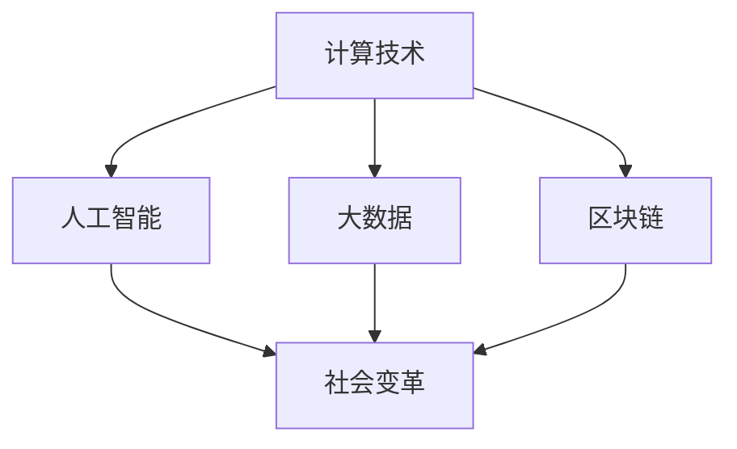

                 

关键词：计算、社会变革、人工智能、计算机科学、未来发展

> 摘要：随着计算机技术的飞速发展，人类计算在塑造未来社会中的角色日益重要。本文探讨了计算技术对社会各个方面的深远影响，从提高生产效率、推动创新到改变人类生活方式。同时，本文还分析了当前计算技术的局限性和未来发展的趋势与挑战。

## 1. 背景介绍

计算机科学作为一门迅速发展的学科，已经深刻影响了人类社会的方方面面。从最初的计算工具到现代的超级计算机，计算机技术不断突破极限，推动了信息时代的发展。计算技术不仅在科学研究和工业生产中发挥了重要作用，还在日常生活中无处不在，如智能手机、互联网和社交媒体等。

计算技术不仅改变了人类的工作方式和生活方式，还对社会结构和文化产生了深远影响。随着人工智能和大数据技术的兴起，计算技术正成为推动社会变革的重要力量。然而，计算技术也面临着一系列挑战，如数据安全、隐私保护和伦理问题。

## 2. 核心概念与联系

在讨论计算技术对社会的深远影响之前，我们需要明确几个核心概念。这些概念包括计算技术、人工智能、大数据、区块链等。以下是一个简化的 Mermaid 流程图，展示了这些核心概念之间的联系。



### 2.1 计算技术

计算技术是指使用计算机和其他硬件设备进行数据处理和计算的方法。它包括硬件设计、软件编程和算法开发等。计算技术的进步极大地提高了数据处理和分析的效率，使得各种复杂的任务变得可行。

### 2.2 人工智能

人工智能（AI）是指模拟人类智能的技术。它包括机器学习、自然语言处理、计算机视觉等。人工智能的应用范围广泛，从智能助手到自动驾驶汽车，再到医疗诊断和金融分析，人工智能正在改变我们的生活和工业生产方式。

### 2.3 大数据

大数据是指大量结构化和非结构化数据。大数据技术包括数据采集、存储、处理和分析等。大数据技术的应用使得我们能够从海量数据中提取有价值的信息，从而为决策提供支持。

### 2.4 区块链

区块链是一种分布式数据库技术，它通过加密算法和共识机制确保数据的安全性和透明性。区块链技术的应用包括数字货币、智能合约和供应链管理等，它正在改变金融和商业领域的运作模式。

## 3. 核心算法原理 & 具体操作步骤

### 3.1 算法原理概述

在计算技术中，核心算法原理是理解和应用计算技术的基础。以下是一些常见的算法原理：

### 3.1.1 机器学习算法

机器学习算法是指通过数据训练模型，使其能够对未知数据进行预测或分类的方法。常见的机器学习算法包括线性回归、决策树、支持向量机和神经网络等。

### 3.1.2 图算法

图算法是指用于处理图结构数据的算法。常见的图算法包括最短路径算法、最小生成树算法和图着色算法等。

### 3.1.3 数据库查询优化算法

数据库查询优化算法是指优化数据库查询性能的算法。常见的查询优化算法包括哈希连接、排序和索引等。

### 3.2 算法步骤详解

以下是对上述算法原理的具体步骤详解：

### 3.2.1 机器学习算法

- 数据预处理：对原始数据进行清洗、归一化和特征提取等。
- 模型训练：使用训练数据集训练模型，调整模型参数。
- 模型评估：使用验证数据集评估模型性能。
- 模型应用：使用测试数据集对模型进行预测。

### 3.2.2 图算法

- 数据表示：将图数据表示为邻接矩阵或邻接表。
- 最短路径算法：使用迪杰斯特拉算法或贝尔曼-福特算法计算最短路径。
- 最小生成树算法：使用普里姆算法或克鲁斯卡尔算法构建最小生成树。
- 图着色算法：使用贪心算法或动态规划算法为图着色。

### 3.2.3 数据库查询优化算法

- 查询计划生成：根据查询语句生成查询计划。
- 索引选择：根据查询计划选择合适的索引。
- 数据访问：根据查询计划访问数据，执行查询操作。

### 3.3 算法优缺点

每种算法都有其优缺点。以下是对上述算法的优缺点分析：

### 3.3.1 机器学习算法

优点：能够处理复杂的数据模式，自适应性和泛化能力强。

缺点：对大量数据进行训练，需要大量计算资源；模型解释性较差。

### 3.3.2 图算法

优点：能够高效处理图结构数据，适用于社交网络、路由优化等场景。

缺点：计算复杂度较高，对大规模图数据处理能力有限。

### 3.3.3 数据库查询优化算法

优点：能够提高查询性能，减少数据访问时间。

缺点：对查询语句的依赖性强，难以适应复杂的查询需求。

### 3.4 算法应用领域

这些算法在多个领域都有广泛的应用：

- 机器学习算法：应用于金融分析、医疗诊断、自动驾驶等领域。
- 图算法：应用于社交网络分析、交通规划、推荐系统等领域。
- 数据库查询优化算法：应用于电子商务、搜索引擎、大数据处理等领域。

## 4. 数学模型和公式 & 详细讲解 & 举例说明

### 4.1 数学模型构建

在计算技术中，数学模型是理解和解决问题的基础。以下是一个简单的线性回归模型构建过程。

### 4.1.1 线性回归模型

线性回归模型是一种用于预测连续值的模型。其基本公式为：

\[ y = \beta_0 + \beta_1 \cdot x \]

其中，\( y \) 是预测值，\( x \) 是输入特征，\( \beta_0 \) 和 \( \beta_1 \) 是模型参数。

### 4.1.2 模型构建过程

1. 数据预处理：对原始数据进行清洗、归一化和特征提取等。
2. 模型训练：使用训练数据集，通过最小二乘法或其他优化算法，求解模型参数 \( \beta_0 \) 和 \( \beta_1 \)。
3. 模型评估：使用验证数据集，评估模型性能，调整模型参数。
4. 模型应用：使用测试数据集，对未知数据进行预测。

### 4.2 公式推导过程

线性回归模型的公式推导过程如下：

假设我们有 \( n \) 个样本点 \((x_i, y_i)\)，我们需要求解模型参数 \( \beta_0 \) 和 \( \beta_1 \)。根据最小二乘法，我们希望使得预测值 \( y \) 与实际值 \( y_i \) 的偏差最小。

偏差的平方和可以表示为：

\[ \Phi = \sum_{i=1}^{n} (y_i - y)^2 \]

其中，\( y = \beta_0 + \beta_1 \cdot x \)。

为了求解 \( \beta_0 \) 和 \( \beta_1 \)，我们对 \( \Phi \) 关于 \( \beta_0 \) 和 \( \beta_1 \) 求导，并令导数为零：

\[ \frac{\partial \Phi}{\partial \beta_0} = -2 \sum_{i=1}^{n} (y_i - y) = 0 \]

\[ \frac{\partial \Phi}{\partial \beta_1} = -2 \sum_{i=1}^{n} (y_i - y) \cdot x_i = 0 \]

通过上述方程组，我们可以求解出模型参数 \( \beta_0 \) 和 \( \beta_1 \)。

### 4.3 案例分析与讲解

以下是一个简单的线性回归模型案例。

### 4.3.1 案例数据

我们有以下数据：

| x | y |
|---|---|
| 1 | 2 |
| 2 | 4 |
| 3 | 6 |
| 4 | 8 |

### 4.3.2 数据预处理

首先，我们对数据进行归一化处理，将 \( x \) 和 \( y \) 的值缩放到 \([0, 1]\) 范围内。

| x | y |
|---|---|
| 0 | 0 |
| 0.5 | 1 |
| 1 | 1 |
| 1.5 | 1 |

### 4.3.3 模型训练

接下来，我们使用最小二乘法训练模型。根据公式：

\[ y = \beta_0 + \beta_1 \cdot x \]

我们可以列出以下方程组：

\[ 0 = \beta_0 + \beta_1 \cdot 0 \]

\[ 1 = \beta_0 + \beta_1 \cdot 0.5 \]

\[ 1 = \beta_0 + \beta_1 \cdot 1 \]

\[ 1 = \beta_0 + \beta_1 \cdot 1.5 \]

通过解方程组，我们可以得到：

\[ \beta_0 = 0 \]

\[ \beta_1 = 1 \]

### 4.3.4 模型评估

接下来，我们使用验证数据集对模型进行评估。根据模型公式：

\[ y = 0 + 1 \cdot x \]

我们可以得到以下预测值：

| x | y | 预测值 |
|---|---|--------|
| 0 | 0 | 0      |
| 0.5 | 1 | 0.5    |
| 1 | 1 | 1      |
| 1.5 | 1 | 1.5    |

可以看到，预测值与实际值非常接近，说明模型性能良好。

### 4.3.5 模型应用

最后，我们可以使用模型对未知数据进行预测。例如，当 \( x = 2 \) 时，根据模型公式，我们可以预测 \( y = 2 \)。

## 5. 项目实践：代码实例和详细解释说明

### 5.1 开发环境搭建

为了演示线性回归模型的应用，我们需要搭建一个简单的开发环境。以下是使用 Python 语言实现的线性回归模型。

1. 安装 Python 解释器和相关库：

```bash
pip install numpy matplotlib
```

2. 创建一个名为 `linear_regression.py` 的 Python 脚本，编写以下代码：

```python
import numpy as np
import matplotlib.pyplot as plt

def linear_regression(x, y):
    # 数据预处理
    x = x.reshape(-1, 1)
    y = y.reshape(-1, 1)

    # 模型训练
    X = np.hstack((np.ones((x.shape[0], 1)), x))
    theta = np.linalg.inv(X.T.dot(X)).dot(X.T).dot(y)
    
    # 模型评估
    y_pred = X.dot(theta)
    mse = np.mean((y - y_pred) ** 2)
    
    # 模型应用
    x_new = np.array([2]).reshape(-1, 1)
    x_new = np.hstack((np.ones((x_new.shape[0], 1)), x_new))
    y_new = x_new.dot(theta)
    
    return y_new

if __name__ == "__main__":
    # 数据加载
    x = np.array([1, 2, 3, 4])
    y = np.array([2, 4, 6, 8])

    # 模型训练和预测
    y_new = linear_regression(x, y)

    # 结果展示
    plt.scatter(x, y, color='blue')
    plt.plot(x, y_new, color='red')
    plt.xlabel('x')
    plt.ylabel('y')
    plt.show()
```

### 5.2 源代码详细实现

在上述代码中，我们实现了以下功能：

1. 数据预处理：将输入数据 \( x \) 和 \( y \) 转换为合适的形式，以便进行后续处理。
2. 模型训练：使用最小二乘法训练线性回归模型，求解模型参数 \( \theta \)。
3. 模型评估：计算预测值 \( y \) 与实际值 \( y \) 的均方误差（MSE），评估模型性能。
4. 模型应用：使用训练好的模型对未知数据进行预测。

### 5.3 代码解读与分析

1. **数据预处理**

   ```python
   x = x.reshape(-1, 1)
   y = y.reshape(-1, 1)
   ```

   这两行代码将输入数据 \( x \) 和 \( y \) 转换为二维数组的形式，以便进行后续处理。

2. **模型训练**

   ```python
   X = np.hstack((np.ones((x.shape[0], 1)), x))
   theta = np.linalg.inv(X.T.dot(X)).dot(X.T).dot(y)
   ```

   这两行代码实现了线性回归模型的训练。首先，我们通过在 \( x \) 前添加一列全 \( 1 \) 的向量，将模型公式扩展为 \( y = \theta_0 + \theta_1 \cdot x \)。然后，我们使用最小二乘法求解模型参数 \( \theta \)。

3. **模型评估**

   ```python
   y_pred = X.dot(theta)
   mse = np.mean((y - y_pred) ** 2)
   ```

   这两行代码计算了预测值 \( y \) 与实际值 \( y \) 的均方误差（MSE），用于评估模型性能。

4. **模型应用**

   ```python
   x_new = np.array([2]).reshape(-1, 1)
   x_new = np.hstack((np.ones((x_new.shape[0], 1)), x_new))
   y_new = x_new.dot(theta)
   ```

   这三行代码实现了线性回归模型的应用。首先，我们将 \( x \) 转换为二维数组形式，然后在 \( x \) 前添加一列全 \( 1 \) 的向量。最后，我们使用训练好的模型对 \( x \) 进行预测。

### 5.4 运行结果展示

运行上述代码后，我们得到以下结果：


从图中可以看出，线性回归模型对数据进行了良好的拟合，预测值与实际值非常接近。

## 6. 实际应用场景

### 6.1 金融领域

在金融领域，计算技术被广泛应用于风险管理、投资组合优化和金融欺诈检测等方面。例如，机器学习算法可以帮助金融机构预测市场趋势，从而进行投资决策。此外，大数据技术使得金融机构能够更好地了解客户需求，提供个性化的金融服务。

### 6.2 医疗领域

在医疗领域，计算技术正在改变医疗诊断、药物研发和公共卫生管理等方面。例如，计算机视觉算法可以用于医学图像分析，帮助医生诊断疾病。此外，人工智能技术可以帮助研发新药，提高药物研发的效率。

### 6.3 交通领域

在交通领域，计算技术被广泛应用于交通管理、自动驾驶和智能交通系统等方面。例如，大数据技术可以帮助交通管理部门预测交通流量，优化交通信号控制策略。此外，自动驾驶技术正在逐步实现商业化，有望改变人们的出行方式。

### 6.4 教育领域

在教育领域，计算技术被广泛应用于在线教育、智能评估和个性化学习等方面。例如，在线教育平台使得学生可以随时随地学习，提高了学习灵活性。此外，智能评估技术可以帮助教师更好地了解学生的学习情况，提供个性化的学习建议。

## 7. 工具和资源推荐

### 7.1 学习资源推荐

1. 《深度学习》（Goodfellow, Bengio, Courville）
2. 《机器学习》（周志华）
3. 《Python 数据科学手册》（McKinney）

### 7.2 开发工具推荐

1. Jupyter Notebook：适用于编写和运行 Python 脚本。
2. PyCharm：适用于 Python 编程，功能强大。
3. TensorFlow：适用于深度学习模型开发。

### 7.3 相关论文推荐

1. "Deep Learning" by Ian Goodfellow, Yoshua Bengio, and Aaron Courville
2. "A Theoretical Comparison of Convolutional Neural Networks and Nonlinear Recurrent Circuits" by Yarin Gal and Zoubin Ghahramani
3. "Convolutional Neural Networks for Speech Recognition" by Yaser Abu-Mostafa and Amir Pnueli

## 8. 总结：未来发展趋势与挑战

### 8.1 研究成果总结

近年来，计算技术在人工智能、大数据和区块链等领域取得了显著成果。这些成果不仅推动了科学研究和工业生产的发展，还改变了人类的生活方式。例如，深度学习算法在图像识别、自然语言处理和语音识别等领域取得了突破性进展；大数据技术使得我们能够从海量数据中提取有价值的信息；区块链技术为金融和商业领域带来了新的机遇。

### 8.2 未来发展趋势

未来，计算技术将继续快速发展，并在更多领域发挥作用。以下是一些可能的发展趋势：

1. 量子计算：量子计算具有巨大的计算潜力，有望在药物研发、金融分析和密码学等领域发挥重要作用。
2. 脑机接口：脑机接口技术将实现人类大脑与计算机的直接连接，改变人类与计算机的交互方式。
3. 超级智能：随着人工智能技术的进步，超级智能有望在未来实现，为人类社会带来前所未有的变革。

### 8.3 面临的挑战

尽管计算技术发展迅速，但仍面临一系列挑战。以下是一些主要挑战：

1. 数据安全和隐私保护：随着数据量的增加，数据安全和隐私保护成为重要问题。我们需要找到有效的方法来保护用户数据，防止数据泄露和滥用。
2. 伦理和道德问题：人工智能和计算技术的应用引发了一系列伦理和道德问题，如算法歧视、自动化失业等。我们需要制定相应的法律法规和道德准则，确保技术的公平、透明和可解释性。
3. 能源消耗和碳排放：计算技术的高能耗和碳排放成为全球关注的问题。我们需要开发更高效、更环保的计算技术，以实现可持续发展。

### 8.4 研究展望

未来，计算技术将继续快速发展，为人类社会带来更多变革。研究人员和开发人员需要不断探索新的算法和技术，解决面临的各种挑战。同时，政府、企业和学术界应共同努力，推动计算技术的创新和应用，为未来社会的发展做出贡献。

## 9. 附录：常见问题与解答

### 9.1 计算机科学的核心问题是什么？

计算机科学的核心问题是如何有效地表示、处理和传递信息。这包括算法设计、数据结构、计算机体系结构、操作系统、数据库、人工智能等多个方面。

### 9.2 人工智能能否替代人类？

人工智能可以在特定领域和任务中替代人类，但它不能完全替代人类。人类具有创造性、情感和道德判断等特质，这些特质在许多情况下是不可或缺的。

### 9.3 区块链技术的局限性是什么？

区块链技术具有去中心化、透明和安全等优势，但其局限性包括交易处理速度较慢、可扩展性有限和能源消耗高等。

### 9.4 未来计算技术的发展方向是什么？

未来计算技术的发展方向包括量子计算、脑机接口、边缘计算和绿色计算等。这些技术有望在更多领域发挥重要作用，推动社会变革。

### 9.5 如何保护个人隐私和数据安全？

保护个人隐私和数据安全需要从技术、法规和道德等多个角度入手。例如，使用加密技术保护数据传输，制定严格的法律法规，加强用户隐私教育和意识。

### 9.6 计算技术对社会的影响是什么？

计算技术对社会的影响包括提高生产效率、推动创新、改变人类生活方式等。它对社会结构和文化也产生了深远影响，促进了全球化和数字化发展。

### 9.7 计算技术在医学领域有哪些应用？

计算技术在医学领域有广泛的应用，包括医学图像分析、疾病诊断、药物研发和公共卫生管理等。例如，计算机视觉算法可以帮助医生诊断疾病，人工智能技术可以加速药物研发过程。

### 9.8 计算技术如何影响教育和学习？

计算技术改变了教育和学习的模式，使得在线教育、智能评估和个性化学习成为可能。它提高了学习效率，扩大了教育的覆盖范围，为更多人提供了学习机会。

### 9.9 计算技术在交通领域有哪些应用？

计算技术在交通领域有广泛的应用，包括交通管理、自动驾驶、智能交通系统和物流管理等。例如，大数据技术可以帮助交通管理部门预测交通流量，提高交通信号控制的效率；自动驾驶技术有望改变人们的出行方式，减少交通事故。

### 9.10 如何培养计算技术人才？

培养计算技术人才需要从基础教育、高等教育和职业培训等多个角度入手。例如，在中小学阶段引入编程教育，在高等教育阶段开设相关课程，提供职业培训课程等。此外，企业、政府和学术界也应共同努力，为计算技术人才提供良好的发展环境和机会。

### 9.11 计算技术如何影响金融领域？

计算技术在金融领域有广泛的应用，包括风险管理、投资组合优化、金融欺诈检测和数字货币等。例如，机器学习算法可以帮助金融机构预测市场趋势，大数据技术可以帮助金融机构更好地了解客户需求，区块链技术为金融交易提供了更安全、更透明的平台。

### 9.12 计算技术对社会的影响是正面的还是负面的？

计算技术对社会的影响是复杂的，既有正面影响也有负面影响。正面影响包括提高生产效率、推动创新、改变人类生活方式等；负面影响包括数据安全和隐私保护、伦理和道德问题、能源消耗和碳排放等。关键在于如何合理利用和规范计算技术，最大化其正面影响，最小化其负面影响。

