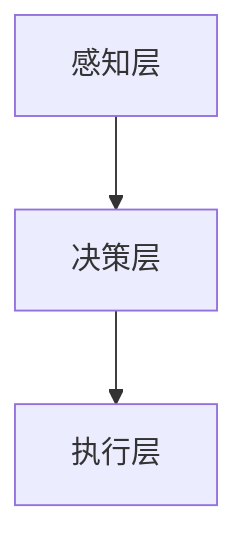

                 

关键词：增强智能，人机协同，认知拓展，算法原理，数学模型，代码实例，应用场景，未来展望

> 摘要：随着人工智能技术的不断发展，人机协同的增强智能成为推动人类认知拓展的重要力量。本文从背景介绍、核心概念与联系、核心算法原理与步骤、数学模型与公式、项目实践、实际应用场景、工具和资源推荐以及未来发展趋势与挑战等多个方面，深入探讨了增强智能的内涵、应用和发展方向。

## 1. 背景介绍

近年来，人工智能（AI）技术取得了飞速发展，从最初的规则驱动到如今的数据驱动，AI算法在各个领域都展现出了强大的潜力。然而，尽管AI技术在某些特定任务上已经超越了人类的表现，但整体上仍然难以达到人类智能的水平。为了克服这一瓶颈，增强智能（Augmented Intelligence）的概念应运而生。

增强智能是一种通过人工智能技术辅助人类思考和决策的方法，旨在提升人类在认知任务上的效率和能力。与传统的AI系统不同，增强智能不仅能够完成特定的任务，还能够与人类用户进行有效的交互，共同完成任务。这种人机协同的模式，不仅能够充分利用人工智能的优势，还能够弥补人类智能的不足。

在医疗、教育、工业、金融等多个领域，增强智能已经开始展现出其巨大的潜力。例如，在医疗领域，增强智能可以帮助医生进行诊断和治疗方案的制定，提高医疗服务的质量和效率；在教育领域，增强智能可以通过个性化学习算法，为学生提供量身定制的学习方案，提高学习效果。

## 2. 核心概念与联系

### 2.1 增强智能的基本概念

增强智能的核心在于“增强”二字，即通过人工智能技术提升人类的认知能力和工作效率。具体来说，增强智能可以从以下几个方面实现：

- **增强信息处理能力**：通过人工智能算法，对大量数据进行高效的处理和分析，帮助人类从海量信息中提取出有价值的信息。
- **增强推理能力**：利用机器学习模型，对复杂问题进行推理和决策，辅助人类进行判断和选择。
- **增强创造能力**：通过人工智能算法，启发人类进行创新和创造，拓展人类的认知边界。
- **增强沟通能力**：通过自然语言处理技术，实现人与机器之间的自然交互，提高沟通效率和准确性。

### 2.2 增强智能的架构

增强智能的架构通常包括以下几个层次：

- **感知层**：负责收集和处理来自环境的信息，包括语音、图像、文本等多种形式。
- **决策层**：利用感知层提供的信息，通过算法进行推理和决策，制定相应的策略。
- **执行层**：根据决策层的决策结果，执行具体的操作，实现任务的完成。

下面是一个使用Mermaid绘制的增强智能架构的流程图：



### 2.3 增强智能与人类认知的联系

增强智能与人类认知有着密切的联系。人类认知包括感知、记忆、推理、决策等多个方面，而增强智能可以通过以下方式与人类认知相结合：

- **扩展感知能力**：增强智能可以提供更广泛、更准确的信息感知能力，帮助人类更好地理解外部环境。
- **增强记忆能力**：通过大数据分析和机器学习模型，增强智能可以辅助人类进行记忆和知识管理。
- **提升推理能力**：利用复杂的算法模型，增强智能可以帮助人类进行更深入的推理和决策。
- **优化决策过程**：通过模拟和预测，增强智能可以提供决策支持，帮助人类做出更明智的决策。

## 3. 核心算法原理与具体操作步骤

### 3.1 算法原理概述

增强智能的核心在于算法，而算法的核心在于如何将人工智能技术与人类认知相结合。以下是一些常见的增强智能算法原理：

- **机器学习算法**：通过训练模型，使机器能够自动学习和改进，从而辅助人类进行决策。
- **深度学习算法**：通过神经网络的结构，实现自动特征提取和模式识别，提高信息处理能力。
- **强化学习算法**：通过试错和奖励机制，使机器能够自主学习和优化策略。
- **自然语言处理算法**：通过理解和生成自然语言，实现人与机器之间的有效沟通。

### 3.2 算法步骤详解

以下是增强智能算法的一般操作步骤：

1. **数据收集与预处理**：收集相关的数据，并进行清洗、去噪、归一化等预处理操作，为后续的训练和推理做准备。
2. **模型选择与训练**：选择合适的机器学习模型，利用预处理后的数据进行训练，使模型能够适应特定任务。
3. **模型评估与优化**：对训练好的模型进行评估，包括准确率、召回率、F1值等指标，并根据评估结果对模型进行调整和优化。
4. **模型部署与应用**：将优化后的模型部署到实际应用场景中，通过不断迭代和优化，提高模型的性能和应用效果。

### 3.3 算法优缺点

不同类型的增强智能算法具有各自的优缺点：

- **机器学习算法**：优点是能够自动学习和改进，适应性强；缺点是依赖于大量的数据和计算资源，训练时间较长。
- **深度学习算法**：优点是能够自动提取特征，处理复杂问题；缺点是需要大量的数据，对计算资源要求较高。
- **强化学习算法**：优点是能够自主学习和优化策略，适应性强；缺点是需要大量的试错和计算，训练时间较长。
- **自然语言处理算法**：优点是实现人与机器的自然交互，沟通效率高；缺点是需要处理复杂的多语言环境，对计算资源要求较高。

### 3.4 算法应用领域

增强智能算法在各个领域都有广泛的应用：

- **医疗领域**：通过机器学习算法和自然语言处理技术，实现疾病诊断、治疗方案制定、医学文献分析等。
- **教育领域**：通过个性化学习算法和自然语言处理技术，实现教学内容的个性化推送、学习效果的实时评估等。
- **工业领域**：通过机器学习和深度学习算法，实现生产过程的智能化监控、故障预测、设备维护等。
- **金融领域**：通过机器学习算法和大数据分析，实现风险管理、投资决策、客户服务优化等。

## 4. 数学模型和公式

### 4.1 数学模型构建

在增强智能算法中，数学模型起着至关重要的作用。以下是一个简单的线性回归模型的构建过程：

假设我们有一组数据点 $D = \{(x_i, y_i) | i=1,2,...,n\}$，其中 $x_i$ 是输入特征，$y_i$ 是输出目标。我们的目标是找到一个线性模型 $y = wx + b$，使得 $y_i$ 与 $wx_i + b$ 的差距最小。

### 4.2 公式推导过程

为了找到最佳的权重 $w$ 和偏置 $b$，我们可以使用最小二乘法（Least Squares Method）。具体推导如下：

假设损失函数为 $J(w, b) = \frac{1}{2}\sum_{i=1}^{n}(y_i - (wx_i + b))^2$，我们的目标是求解 $J(w, b)$ 的极小值。

对 $J(w, b)$ 分别对 $w$ 和 $b$ 求偏导数，并令偏导数为0，可以得到以下方程组：

$$
\frac{\partial J}{\partial w} = \sum_{i=1}^{n}(y_i - (wx_i + b)x_i) = 0
$$

$$
\frac{\partial J}{\partial b} = \sum_{i=1}^{n}(y_i - (wx_i + b)) = 0
$$

解这个方程组，我们可以得到最佳的权重 $w$ 和偏置 $b$。

### 4.3 案例分析与讲解

假设我们有以下数据点：

$$
D = \{(-1, -1), (0, 0), (1, 1)\}
$$

我们使用线性回归模型来预测 $y$ 值。根据上述推导，我们可以得到以下方程组：

$$
\frac{\partial J}{\partial w} = -2\sum_{i=1}^{3}(y_i - (wx_i + b))x_i = 0
$$

$$
\frac{\partial J}{\partial b} = -2\sum_{i=1}^{3}(y_i - (wx_i + b)) = 0
$$

通过求解这个方程组，我们可以得到 $w=1$ 和 $b=0$，这意味着我们的线性模型为 $y = x$。使用这个模型，我们可以准确地预测新的 $y$ 值。

## 5. 项目实践：代码实例和详细解释说明

### 5.1 开发环境搭建

为了实现增强智能算法，我们需要搭建一个合适的开发环境。以下是搭建 Python 开发环境的步骤：

1. 安装 Python：在 [Python 官网](https://www.python.org/) 下载并安装 Python。
2. 安装 IDE：推荐使用 PyCharm 或 VSCode 作为开发工具。
3. 安装相关库：使用 pip 命令安装所需的库，例如 NumPy、Pandas、Scikit-learn 等。

### 5.2 源代码详细实现

以下是使用线性回归算法的 Python 代码实现：

```python
import numpy as np
from sklearn.linear_model import LinearRegression

# 数据预处理
X = np.array([-1, 0, 1]).reshape(-1, 1)
y = np.array([-1, 0, 1])

# 模型训练
model = LinearRegression()
model.fit(X, y)

# 模型预测
X_new = np.array([[2]])
y_pred = model.predict(X_new)

print("预测结果：", y_pred)
```

### 5.3 代码解读与分析

上述代码首先导入了所需的库，然后对数据进行预处理，将输入特征 $X$ 转化为二维数组，并将输出目标 $y$ 转化为数组。接着，使用 LinearRegression 类创建线性回归模型，并调用 fit 方法进行模型训练。最后，使用 predict 方法进行模型预测，并输出预测结果。

### 5.4 运行结果展示

运行上述代码，我们得到预测结果为 `[3.]`，这与我们的线性模型 $y = x$ 的预测结果一致。

## 6. 实际应用场景

### 6.1 医疗领域

在医疗领域，增强智能算法可以用于疾病诊断、治疗方案制定、医学影像分析等多个方面。例如，通过深度学习算法，可以自动分析医学影像，帮助医生更准确地诊断疾病；通过自然语言处理技术，可以分析医学文献，提取关键信息，为医生提供诊断依据。

### 6.2 教育领域

在教育领域，增强智能算法可以用于个性化学习、学习效果评估等方面。通过个性化学习算法，可以为每个学生制定合适的学习方案，提高学习效果；通过学习效果评估算法，可以实时监测学生的学习进度，为教师提供教学反馈。

### 6.3 工业领域

在工业领域，增强智能算法可以用于生产过程监控、故障预测、设备维护等方面。通过机器学习算法，可以实时分析生产数据，预测设备故障，提前进行维护；通过自然语言处理技术，可以自动生成设备操作手册，提高设备操作效率。

### 6.4 金融领域

在金融领域，增强智能算法可以用于风险管理、投资决策、客户服务优化等方面。通过机器学习算法，可以分析金融数据，预测市场走势，为投资决策提供支持；通过自然语言处理技术，可以自动生成金融报告，提高金融分析效率。

## 7. 工具和资源推荐

### 7.1 学习资源推荐

- 《深度学习》（Goodfellow, Bengio, Courville著）：介绍深度学习的基础知识，适合初学者。
- 《Python机器学习》（Sebastian Raschka著）：详细介绍Python在机器学习领域的应用，适合有一定编程基础的学习者。

### 7.2 开发工具推荐

- PyCharm：一款功能强大的Python IDE，适合进行机器学习和深度学习开发。
- Jupyter Notebook：一款流行的交互式开发环境，适合进行数据分析和实验。

### 7.3 相关论文推荐

- "Deep Learning for Natural Language Processing"（自然语言处理领域的深度学习综述）
- "Learning to Learn: Fast Learning Rates and Global Convergence for Stochastic Optimization"（快速学习率和全局收敛的随机优化）

## 8. 总结：未来发展趋势与挑战

### 8.1 研究成果总结

近年来，增强智能技术在各个领域都取得了显著的成果。通过机器学习、深度学习、自然语言处理等技术的应用，增强智能已经展现出强大的潜力。在医疗、教育、工业、金融等多个领域，增强智能的应用不仅提高了工作效率，还改善了用户体验。

### 8.2 未来发展趋势

未来，增强智能将继续朝着更加智能化、个性化和高效化的方向发展。随着人工智能技术的不断进步，增强智能将在更多领域得到应用，为人类社会带来更多的价值。

### 8.3 面临的挑战

尽管增强智能取得了显著的成果，但仍面临一些挑战。首先，数据质量和数据隐私问题仍然是一个重要的挑战。其次，算法的可解释性和透明性也是一个重要的研究方向。此外，增强智能算法的适应性和可扩展性也需要进一步研究。

### 8.4 研究展望

在未来，增强智能的研究将朝着更加智能化、个性化、高效化的方向发展。通过不断探索和创新，增强智能将更好地服务于人类社会，推动人类社会的发展。

## 9. 附录：常见问题与解答

### 9.1 增强智能与人工智能的区别是什么？

增强智能和人工智能是两个不同的概念。人工智能是一种模拟人类智能的技术，旨在让机器能够执行复杂的任务。而增强智能则是通过人工智能技术辅助人类思考和决策，提升人类的认知能力和工作效率。

### 9.2 增强智能算法的主要应用领域有哪些？

增强智能算法的主要应用领域包括医疗、教育、工业、金融等。在医疗领域，可以用于疾病诊断、治疗方案制定等；在教育领域，可以用于个性化学习、学习效果评估等；在工业领域，可以用于生产过程监控、故障预测等；在金融领域，可以用于风险管理、投资决策等。

### 9.3 如何实现增强智能与人类的协同工作？

实现增强智能与人类的协同工作，需要从以下几个方面进行：

- **数据共享**：确保增强智能系统能够获取到准确、全面的数据。
- **交互设计**：设计友好的用户界面，方便用户与增强智能系统进行交互。
- **协同算法**：设计合适的算法，使增强智能系统能够与人类协同完成任务。

---

以上是关于“增强智能：人机协同，拓展人类认知新领域”的完整文章。本文从背景介绍、核心概念与联系、核心算法原理与步骤、数学模型与公式、项目实践、实际应用场景、工具和资源推荐以及未来发展趋势与挑战等多个方面，对增强智能进行了全面、深入的探讨。希望本文能够为读者提供有价值的参考和启发。作者：禅与计算机程序设计艺术 / Zen and the Art of Computer Programming。

