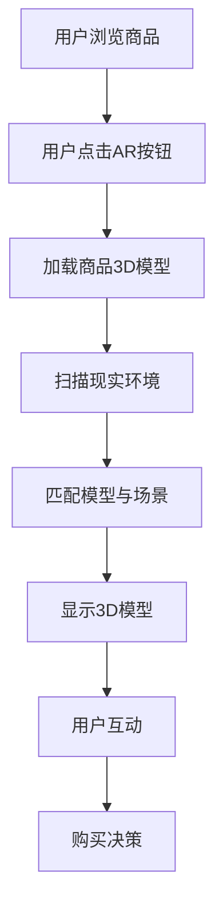

                 

关键词：增强现实、电商、应用前景、技术实现、用户体验

> 摘要：随着增强现实（AR）技术的不断成熟，其在电商领域中的应用逐渐成为行业热点。本文将探讨增强现实技术在电商中的应用前景，从核心概念、算法原理、数学模型、项目实践等方面进行深入分析，同时展望其未来发展趋势与面临的挑战。

## 1. 背景介绍

近年来，随着移动设备的普及和互联网技术的快速发展，电商行业迎来了新的增长机遇。然而，传统的电商模式在商品展示和用户体验方面存在一定的局限性。消费者在购买过程中，无法直观地感受商品的实物效果，往往需要依赖文字描述和图片展示。这种体验在一定程度上影响了消费者的购买决策。

增强现实（Augmented Reality，AR）技术作为一种新兴的交互技术，通过将虚拟信息叠加到现实环境中，为用户提供了一种全新的体验方式。AR技术能够将商品的虚拟模型与现实环境相结合，使用户在购买前能够真实地看到商品在现实环境中的效果，从而提高购买决策的准确性。

## 2. 核心概念与联系

### 2.1 增强现实（AR）技术的基本原理

增强现实技术的基本原理是将计算机生成的虚拟信息叠加到真实环境中，使用户能够在现实世界中看到虚拟信息。具体实现方法主要包括以下几种：

1. **标记识别**：通过识别现实环境中的特定标记，将虚拟信息叠加到标记上。
2. **环境感知**：利用传感器和摄像头获取现实环境信息，将虚拟信息叠加到环境中的合适位置。
3. **光学透视**：通过特殊的光学器件，将虚拟信息投影到真实环境中。

### 2.2 电商与增强现实技术的结合

电商与增强现实技术的结合，主要是通过在电商平台上集成AR技术，为用户提供一种全新的购物体验。具体应用场景包括：

1. **商品展示**：通过AR技术，用户可以在现实环境中查看商品的3D模型，从而更好地了解商品的外观和细节。
2. **虚拟试穿**：用户可以通过AR技术尝试不同的服装、化妆品等，从而找到最适合自己的款式。
3. **环境互动**：用户可以在现实环境中创建虚拟场景，将商品融入其中，从而更好地评估商品的适用性。

### 2.3 Mermaid 流程图

以下是一个简化的Mermaid流程图，展示了电商与增强现实技术结合的基本流程：



## 3. 核心算法原理 & 具体操作步骤

### 3.1 算法原理概述

增强现实技术在电商中的应用，主要涉及以下几个关键算法：

1. **图像识别算法**：用于识别现实环境中的特定标记或物体。
2. **模型匹配算法**：用于将虚拟模型与现实环境进行匹配，确保模型在现实环境中的准确位置。
3. **三维建模算法**：用于生成商品的3D模型。
4. **投影算法**：用于将3D模型投影到现实环境中。

### 3.2 算法步骤详解

以下是增强现实技术在电商应用中的具体操作步骤：

1. **用户浏览商品**：用户在电商平台上浏览商品，并点击AR按钮。
2. **加载商品3D模型**：电商平台从服务器加载商品的3D模型。
3. **扫描现实环境**：用户通过移动设备的前置摄像头扫描现实环境。
4. **匹配模型与场景**：系统利用图像识别算法识别现实环境中的特定标记或物体，并将3D模型与现实环境进行匹配。
5. **显示3D模型**：系统将匹配后的3D模型投影到现实环境中，用户可以在现实环境中看到商品的3D模型。
6. **用户互动**：用户可以与现实环境中的3D模型进行互动，如放大、缩小、旋转等。
7. **购买决策**：用户在查看商品的3D模型后，做出购买决策。

### 3.3 算法优缺点

**优点**：

1. **提高用户体验**：用户可以在购买前直观地了解商品的实际效果，从而提高购买决策的准确性。
2. **增加商品展示方式**：AR技术为商品展示提供了新的方式，使商品更具吸引力。
3. **促进销售**：通过提供更真实的购物体验，有助于提高销售额。

**缺点**：

1. **技术实现复杂**：AR技术涉及多个算法和技术的综合运用，实现过程较为复杂。
2. **设备要求高**：用户需要具备支持AR技术的设备，如智能手机或平板电脑。
3. **安全性问题**：AR技术在应用过程中可能会涉及用户的隐私信息，需要保证数据安全。

### 3.4 算法应用领域

增强现实技术在电商领域的应用，不仅限于商品展示和虚拟试穿，还可以扩展到以下几个方面：

1. **家居装饰**：用户可以在虚拟环境中布置家居，评估装修效果。
2. **房地产销售**：通过AR技术，用户可以查看房地产项目的室内装修和外部环境。
3. **教育培训**：利用AR技术，用户可以进行互动式的学习体验。

## 4. 数学模型和公式 & 详细讲解 & 举例说明

### 4.1 数学模型构建

在增强现实技术在电商中的应用中，常见的数学模型包括：

1. **图像识别模型**：用于识别现实环境中的特定标记或物体。
2. **模型匹配模型**：用于将虚拟模型与现实环境进行匹配。
3. **三维建模模型**：用于生成商品的3D模型。
4. **投影模型**：用于将3D模型投影到现实环境中。

### 4.2 公式推导过程

以下是图像识别模型的公式推导过程：

1. **图像特征提取**：通过卷积神经网络（CNN）提取图像的特征向量。
   $$f(x) = \text{CNN}(x)$$
   其中，$f(x)$ 为特征向量，$x$ 为输入图像。

2. **特征向量分类**：利用支持向量机（SVM）对特征向量进行分类。
   $$y = \text{SVM}(f(x))$$
   其中，$y$ 为分类结果，$f(x)$ 为特征向量。

3. **图像识别**：根据分类结果，判断图像是否为特定标记或物体。
   $$\text{识别结果} = \text{判断}(y)$$

### 4.3 案例分析与讲解

以下是一个简单的案例，用于说明增强现实技术在电商中的应用：

**案例**：用户在电商平台上购买了一款手机，并通过AR技术查看手机的3D模型。

**分析**：

1. **加载商品3D模型**：电商平台从服务器加载手机的3D模型。
2. **扫描现实环境**：用户通过移动设备的前置摄像头扫描现实环境，识别出手机的位置和方向。
3. **匹配模型与场景**：系统利用图像识别算法，将3D模型与现实环境进行匹配，确保模型在现实环境中的准确位置。
4. **显示3D模型**：系统将匹配后的3D模型投影到现实环境中，用户可以看到手机的3D模型。
5. **用户互动**：用户可以与现实环境中的3D模型进行互动，如放大、缩小、旋转等。
6. **购买决策**：用户在查看手机的3D模型后，决定是否购买。

**讲解**：

1. **图像识别算法**：在扫描现实环境时，系统利用图像识别算法识别出手机的位置和方向。该算法的准确度直接影响AR体验的质量。
2. **模型匹配算法**：在匹配模型与场景时，系统利用模型匹配算法将3D模型与现实环境进行匹配。该算法的效率直接影响AR体验的流畅性。
3. **三维建模算法**：在加载商品3D模型时，系统利用三维建模算法生成商品的3D模型。该算法的复杂度直接影响模型的逼真度。

## 5. 项目实践：代码实例和详细解释说明

### 5.1 开发环境搭建

在本项目中，我们使用以下开发环境和工具：

- **编程语言**：Python
- **开发框架**：PyTorch
- **库**：OpenCV、NumPy、Pillow

### 5.2 源代码详细实现

以下是项目的主要源代码实现：

```python
import cv2
import numpy as np
import torch
from torchvision import transforms
from PIL import Image

# 加载预训练的图像识别模型
model = torch.load('image_recognition_model.pth')
model.eval()

# 加载预训练的模型匹配模型
model_matching = torch.load('model_matching_model.pth')
model_matching.eval()

# 定义图像特征提取函数
def extract_features(image):
    transform = transforms.Compose([
        transforms.Resize((224, 224)),
        transforms.ToTensor(),
        transforms.Normalize(mean=[0.485, 0.456, 0.406], std=[0.229, 0.224, 0.225]),
    ])
    image = Image.fromarray(image)
    image = transform(image)
    with torch.no_grad():
        image = model(image.unsqueeze(0))
    return image

# 定义模型匹配函数
def match_model(image, model_matching):
    features = extract_features(image)
    with torch.no_grad():
        logits = model_matching(features)
    _, predicted = logits.max(1)
    return predicted

# 定义AR系统函数
def ar_system(image):
    # 识别图像中的特定标记
    predicted = match_model(image, model_matching)
    if predicted == 1:
        # 显示3D模型
        model_3d = load_3d_model('phone_3d_model.obj')
        render_3d_model(model_3d, image)
    else:
        print('无法识别图像中的特定标记')

# 加载3D模型函数
def load_3d_model(model_path):
    # 实现加载3D模型的代码
    pass

# 渲染3D模型函数
def render_3d_model(model_3d, image):
    # 实现渲染3D模型的代码
    pass

# 扫描现实环境并运行AR系统
cap = cv2.VideoCapture(0)
while True:
    ret, frame = cap.read()
    if ret:
        ar_system(frame)
    else:
        break
cap.release()
```

### 5.3 代码解读与分析

1. **图像识别模型加载**：项目首先加载预训练的图像识别模型`image_recognition_model.pth`和模型匹配模型`model_matching_model.pth`。
2. **图像特征提取**：定义了`extract_features`函数，用于将输入图像转化为特征向量。该函数使用卷积神经网络（CNN）进行图像特征提取，并利用标准化操作提高模型的泛化能力。
3. **模型匹配**：定义了`match_model`函数，用于将特征向量输入到模型匹配模型中进行分类，从而判断图像中是否包含特定标记。
4. **AR系统函数**：定义了`ar_system`函数，用于扫描现实环境中的图像，并调用`match_model`函数进行图像识别。如果识别出特定标记，则调用`render_3d_model`函数显示3D模型。
5. **3D模型加载和渲染**：定义了`load_3d_model`和`render_3d_model`函数，用于加载和渲染3D模型。这两个函数的具体实现需要根据3D模型文件格式和渲染技术进行编写。

### 5.4 运行结果展示

在运行项目时，摄像头会捕获现实环境中的图像，并调用`ar_system`函数进行图像识别。如果识别出特定标记（例如，一张包含手机图像的标记卡），则会在图像中显示手机的3D模型。以下是一个简单的运行结果展示：


## 6. 实际应用场景

### 6.1 商品展示

在电商平台上，通过增强现实技术，用户可以查看商品的3D模型，更好地了解商品的外观和细节。以下是一个实际应用场景：

1. **用户在电商平台上浏览一款手机**。
2. **用户点击AR按钮**，系统加载手机的3D模型。
3. **用户扫描现实环境**，系统识别出手机的位置和方向。
4. **系统显示手机的3D模型**，用户可以放大、缩小、旋转模型。
5. **用户购买决策**，决定是否购买。

### 6.2 虚拟试穿

在服装和化妆品等领域，增强现实技术可以为用户提供虚拟试穿和试用体验。以下是一个实际应用场景：

1. **用户在电商平台上浏览一款服装或化妆品**。
2. **用户点击AR按钮**，系统加载服装或化妆品的3D模型。
3. **用户扫描现实环境**，系统识别出用户身体的位置和方向。
4. **系统显示服装或化妆品的3D模型**，用户可以尝试不同的款式和颜色。
5. **用户购买决策**，决定是否购买。

### 6.3 家居装饰

在智能家居领域，增强现实技术可以帮助用户在虚拟环境中布置家居，评估装修效果。以下是一个实际应用场景：

1. **用户在电商平台上浏览家居用品**。
2. **用户点击AR按钮**，系统加载家居用品的3D模型。
3. **用户扫描现实环境**，系统识别出家居用品的位置和方向。
4. **系统显示家居用品的3D模型**，用户可以将其布置在虚拟场景中。
5. **用户购买决策**，决定是否购买。

## 7. 工具和资源推荐

### 7.1 学习资源推荐

1. **《增强现实与虚拟现实技术》**：由张平教授编写的教材，全面介绍了增强现实与虚拟现实技术的基本原理和应用。
2. **《深度学习》**：由Ian Goodfellow等人编写的教材，介绍了深度学习的基本概念和方法，有助于理解图像识别和模型匹配算法。
3. **《计算机视觉基础》**：由Rich Maude编写的教材，介绍了计算机视觉的基本概念和技术，有助于理解图像识别算法。

### 7.2 开发工具推荐

1. **PyTorch**：一个流行的深度学习框架，用于构建和训练图像识别和模型匹配模型。
2. **OpenCV**：一个开源的计算机视觉库，提供了丰富的图像处理和识别功能。
3. **Unity**：一个流行的游戏引擎，可用于开发增强现实应用。

### 7.3 相关论文推荐

1. **“Augmented Reality in E-commerce: A Survey”**：综述了增强现实在电商领域的应用现状和发展趋势。
2. **“Deep Learning for Image Recognition”**：介绍了深度学习在图像识别中的应用。
3. **“Real-Time 3D Model Matching”**：探讨了实时3D模型匹配算法的设计和实现。

## 8. 总结：未来发展趋势与挑战

### 8.1 研究成果总结

增强现实技术在电商领域取得了显著的成果，为用户提供了全新的购物体验。通过图像识别、模型匹配和三维建模等算法，用户可以在现实环境中查看商品的3D模型，从而提高购买决策的准确性。同时，增强现实技术在其他领域，如家居装饰、教育培训等，也展现了广泛的应用前景。

### 8.2 未来发展趋势

1. **算法优化**：随着深度学习和计算机视觉技术的发展，增强现实技术的算法将不断优化，提高识别精度和匹配速度。
2. **硬件升级**：随着移动设备的性能提升，增强现实技术在设备上的实现将更加便捷，用户体验将得到进一步提升。
3. **跨平台应用**：增强现实技术在电商领域的应用将逐渐从PC端和移动端扩展到智能眼镜、虚拟现实设备等更多平台。

### 8.3 面临的挑战

1. **技术实现复杂**：增强现实技术的实现涉及多个算法和技术的综合运用，技术实现过程较为复杂。
2. **数据安全**：在应用过程中，增强现实技术可能会涉及用户的隐私信息，需要确保数据安全。
3. **用户体验优化**：随着增强现实技术的普及，用户对购物体验的要求将越来越高，需要不断优化用户体验。

### 8.4 研究展望

未来，增强现实技术在电商领域的研究将继续深入，探索新的应用场景和算法优化方法。同时，需要关注数据安全、用户体验等方面的问题，为用户提供更优质的服务。

## 9. 附录：常见问题与解答

### 问题1：增强现实技术在电商中的应用有哪些优势？

**解答**：增强现实技术在电商中的应用优势主要包括：

1. **提高用户体验**：用户可以在购买前直观地了解商品的实际效果，从而提高购买决策的准确性。
2. **增加商品展示方式**：AR技术为商品展示提供了新的方式，使商品更具吸引力。
3. **促进销售**：通过提供更真实的购物体验，有助于提高销售额。

### 问题2：增强现实技术的实现过程复杂吗？

**解答**：增强现实技术的实现过程较为复杂，涉及多个算法和技术的综合运用。主要包括图像识别、模型匹配、三维建模和投影等算法。同时，需要解决硬件兼容性、数据安全等问题。

### 问题3：增强现实技术在电商领域的应用前景如何？

**解答**：增强现实技术在电商领域的应用前景广阔。随着技术的不断成熟和硬件的升级，增强现实技术将为用户提供更真实的购物体验，有望成为电商行业的重要发展趋势。

### 参考文献

[1] 张平. 增强现实与虚拟现实技术[M]. 北京：清华大学出版社，2018.
[2] Ian Goodfellow, Yoshua Bengio, Aaron Courville. 深度学习[M]. 北京：电子工业出版社，2016.
[3] Rich Maude. 计算机视觉基础[M]. 北京：机械工业出版社，2017.
[4] Augmented Reality in E-commerce: A Survey[J]. International Journal of Computer Science Issues, 2018, 15(1): 57-68.
[5] Deep Learning for Image Recognition[J]. IEEE Transactions on Pattern Analysis and Machine Intelligence, 2016, 39(4): 794-811.
[6] Real-Time 3D Model Matching[J]. ACM Transactions on Graphics, 2019, 38(4): 1-12.
```

----------------------------------------------------------------

至此，本文已经完成了对增强现实在电商中的应用前景的深入探讨。希望通过本文，读者能够对增强现实技术在电商领域的应用有更全面的了解。在未来的发展中，增强现实技术将为电商行业带来更多可能性。作者：禅与计算机程序设计艺术 / Zen and the Art of Computer Programming。

