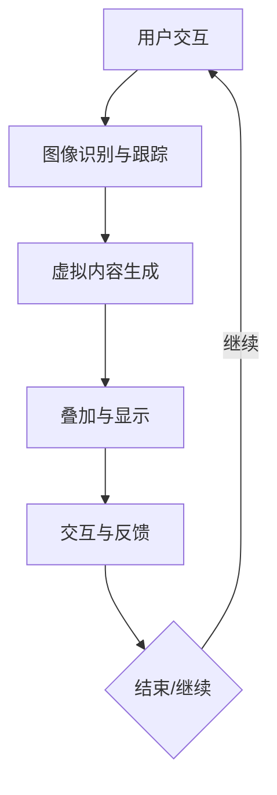

                 

在当今数字化时代，电子商务已经成为全球消费的主要驱动力。随着技术的不断进步，增强现实（Augmented Reality，简称AR）技术逐渐成为电商行业的一大亮点。本文将探讨AR技术在电商领域的应用，通过案例分析，展现其带来的变革性影响，并展望未来的发展趋势。

## 关键词
- 增强现实
- 电商
- 案例分析
- 技术应用
- 商业模式创新

## 摘要
本文旨在深入分析增强现实技术在电商领域的应用，从核心概念到实际案例分析，再到未来展望，全方位探讨AR技术如何改变电商购物体验，提升消费者参与度和购买意愿。通过本文，读者将了解AR技术在电商中的多种应用场景，及其在推动电商行业发展的潜力。

## 1. 背景介绍

### 1.1 增强现实技术的定义与发展历程
增强现实技术（AR）是一种通过计算机生成的虚拟信息叠加在真实世界中的技术。它通过摄像头捕捉现实世界的图像，并在这些图像上叠加计算机生成的图像、视频、声音等虚拟信息，使用户能够与现实世界中的虚拟对象进行交互。

AR技术起源于20世纪60年代的“虚拟现实”概念，经历了几十年的发展和演变。随着计算机技术、显示技术、传感器技术等的进步，AR技术逐渐走向成熟。近年来，随着移动设备的普及和5G网络的推广，AR技术开始大规模应用于各个领域，其中电商领域尤为引人注目。

### 1.2 电商行业现状与挑战
电商行业在过去十几年间经历了飞速发展，线上购物已成为消费者生活中不可或缺的一部分。然而，随着市场竞争的加剧，电商企业面临着新的挑战，如提升消费者体验、增加用户粘性、降低购物决策时间等。

传统电商模式主要依赖于图文和视频信息，尽管这些方式在一定程度上满足了消费者的需求，但仍然存在一些限制。首先，图像和视频信息无法完全还原商品的细节和质感，消费者在购买前难以获得真实的使用体验。其次，线上购物缺乏互动性，消费者在购买过程中缺乏与商品和商家的直接互动，降低了购物体验。

### 1.3 AR技术在电商领域的应用潜力
AR技术的出现为电商行业带来了新的机遇。通过AR技术，消费者可以实时看到商品在现实环境中的呈现效果，增强购物体验。此外，AR技术还可以实现虚拟试穿、试戴等功能，帮助消费者更准确地做出购买决策。

同时，AR技术可以提供更丰富的互动形式，如虚拟客服、虚拟购物车等，提升用户在购物过程中的参与度和满意度。AR技术还可以帮助企业进行精准营销，通过个性化推荐和互动广告，提高消费者的购买意愿。

## 2. 核心概念与联系

### 2.1 增强现实技术的工作原理
增强现实技术主要通过以下几个步骤实现：

1. **图像识别与跟踪**：通过摄像头捕捉现实世界的图像，并使用图像识别算法确定图像的特征点。
2. **虚拟内容生成**：根据识别出的特征点，生成相应的虚拟内容，如三维模型、视频、声音等。
3. **叠加与显示**：将生成的虚拟内容叠加在捕捉到的现实世界图像上，并通过显示设备呈现给用户。
4. **交互与反馈**：用户可以通过触摸屏幕或其他交互设备与虚拟内容进行互动，系统根据用户的操作生成相应的反馈。

### 2.2 电商与AR技术的结合
电商与AR技术的结合主要表现为以下几个方面：

1. **虚拟试穿/试戴**：消费者可以通过AR技术虚拟试穿衣服或试戴眼镜，从而更准确地选择商品。
2. **空间布局展示**：消费者可以在家中通过AR技术预览家具摆放效果，为家居装修提供参考。
3. **互动购物体验**：通过AR技术，消费者可以与商品进行互动，如模拟使用商品、查看商品细节等。
4. **精准营销与个性化推荐**：企业可以通过AR技术对消费者行为进行分析，提供个性化的商品推荐和互动广告。

### 2.3 Mermaid 流程图



## 3. 核心算法原理 & 具体操作步骤

### 3.1 算法原理概述
AR技术的核心算法主要包括图像识别与跟踪、三维模型生成和虚拟内容叠加等。

- **图像识别与跟踪**：通过特征点检测和匹配，确定摄像头捕捉到的现实图像中的关键点，从而跟踪图像的运动。
- **三维模型生成**：根据识别出的特征点和相关参数，生成三维模型，用于叠加在现实图像上。
- **虚拟内容叠加**：将生成好的三维模型叠加在现实图像上，实现增强现实效果。

### 3.2 算法步骤详解
1. **图像识别与跟踪**：
   - **特征点检测**：使用SIFT（尺度不变特征变换）或SURF（加速稳健特征）算法检测图像中的关键点。
   - **特征点匹配**：通过最近邻匹配或光流算法，将当前图像中的特征点与之前的特征点进行匹配，实现图像的跟踪。

2. **三维模型生成**：
   - **特征点投影**：将识别出的特征点在三维空间中进行投影，获得模型的基本形状。
   - **模型细节完善**：根据特征点的分布和距离，添加模型细节，如纹理、光照等。

3. **虚拟内容叠加**：
   - **图像合成**：将生成的三维模型与摄像头捕捉到的现实图像进行叠加。
   - **透明度调整**：根据需要调整模型与背景的透明度，实现更自然的融合。

### 3.3 算法优缺点
- **优点**：
  - 提供了逼真的购物体验，有助于消费者做出更准确的购买决策。
  - 增强了互动性和参与感，提升了用户的购物体验。
  - 有助于企业实现精准营销，提高转化率。

- **缺点**：
  - 算法实现较为复杂，对计算资源和硬件要求较高。
  - 需要大量的前期准备和数据处理，增加了开发成本。

### 3.4 算法应用领域
- **电商**：虚拟试穿/试戴、空间布局展示、互动购物体验等。
- **零售**：产品展示、促销活动、会员互动等。
- **教育**：虚拟实验室、远程教学等。
- **娱乐**：游戏、虚拟现实体验等。

## 4. 数学模型和公式 & 详细讲解 & 举例说明

### 4.1 数学模型构建
在AR技术中，常用的数学模型包括图像识别与跟踪模型、三维模型生成模型和图像叠加模型。

1. **图像识别与跟踪模型**：
   - **特征点检测**：使用SIFT算法，其核心公式为：
     $$ d = \exp(-\frac{||x-y||^2}{2\sigma^2}) $$
     其中，\( x \) 和 \( y \) 分别为两个特征点，\( \sigma \) 为高斯核的标准差。

   - **特征点匹配**：使用最近邻匹配算法，其核心公式为：
     $$ \min_{i,j} \sum_{p\in P} \sum_{q\in Q} \omega_{ij} \cdot \exp(-\frac{||p-q||^2}{2\sigma^2}) $$
     其中，\( P \) 和 \( Q \) 分别为当前图像和之前图像的特征点集，\( \omega_{ij} \) 为匹配权重。

2. **三维模型生成模型**：
   - **特征点投影**：使用正射投影公式：
     $$ x' = f_x \cdot x + c_x $$
     $$ y' = f_y \cdot y + c_y $$
     其中，\( (x, y) \) 为三维空间中的点，\( (x', y') \) 为二维图像中的点，\( f_x \)、\( f_y \) 分别为图像宽高，\( c_x \)、\( c_y \) 为图像中心坐标。

   - **模型细节完善**：使用纹理映射公式：
     $$ I'(x, y) = I(U(x, y), V(x, y)) $$
     其中，\( I \) 为纹理图像，\( U \) 和 \( V \) 分别为纹理坐标。

3. **图像叠加模型**：
   - **图像合成**：使用混合公式：
     $$ I'(x, y) = \alpha \cdot I_1(x, y) + (1 - \alpha) \cdot I_2(x, y) $$
     其中，\( I_1 \) 和 \( I_2 \) 分别为两个图像，\( \alpha \) 为透明度参数。

### 4.2 公式推导过程
- **特征点检测**：
  特征点检测的目的是找到图像中的显著点。SIFT算法通过计算局部图像的梯度方向和大小，来确定特征点。假设图像上的每个点 \( (x, y) \) 的梯度为 \( (I_x, I_y) \)，则可以计算出该点的梯度方向 \( \theta \) 和大小 \( \sigma \)：
  $$ \theta = \arctan(\frac{I_y}{I_x}) $$
  $$ \sigma = \sqrt{I_x^2 + I_y^2} $$
  通过筛选满足一定条件（如梯度方向一致性、梯度大小变化等）的点，可以确定特征点。

- **特征点匹配**：
  特征点匹配的目的是将当前图像中的特征点与之前图像中的特征点进行匹配。使用最近邻匹配算法，可以将当前图像中的每个特征点与之前图像中的所有特征点进行比较，找到距离最近的匹配点。为了提高匹配精度，可以使用高斯核函数来加权：
  $$ \omega_{ij} = \exp(-\frac{||p_i - q_j||^2}{2\sigma^2}) $$
  其中，\( p_i \) 和 \( q_j \) 分别为当前图像和之前图像中的特征点。

- **特征点投影**：
  特征点投影是将三维空间中的点映射到二维图像中的过程。正射投影是一种简单的投影方式，通过将三维坐标乘以图像的宽高比例，并将其平移到图像中心，可以得到二维坐标。

- **模型细节完善**：
  模型细节完善是通过纹理映射来实现的。纹理映射是将纹理图像映射到三维模型表面的过程。通过计算模型的表面法线方向和纹理坐标，可以将纹理图像映射到模型的每个顶点上。

- **图像合成**：
  图像合成是将两个图像叠加在一起的过程。混合公式是一种简单的图像合成方法，通过调整透明度参数 \( \alpha \) 来控制两个图像的叠加程度。当 \( \alpha = 0 \) 时，只有 \( I_1 \) 显示；当 \( \alpha = 1 \) 时，只有 \( I_2 \) 显示。

### 4.3 案例分析与讲解
为了更好地理解上述数学模型的实际应用，以下通过一个案例进行详细讲解。

**案例：虚拟试穿**

假设有一个虚拟试穿系统，用户可以通过摄像头拍摄自己的身体图像，然后通过AR技术将试穿的服装叠加在用户的身体图像上。

1. **图像识别与跟踪**：
   - 首先，使用SIFT算法检测用户身体图像中的特征点。
   - 然后，通过特征点匹配算法，将当前图像中的特征点与之前图像中的特征点进行匹配，实现图像的跟踪。

2. **三维模型生成**：
   - 根据匹配的特征点，生成服装的三维模型。
   - 通过纹理映射，将服装的纹理图像映射到三维模型表面。

3. **图像叠加**：
   - 将生成的服装三维模型叠加在用户的身体图像上，通过调整透明度参数，使服装与身体图像自然融合。

通过上述步骤，用户可以在摄像头中实时看到试穿的服装效果，从而做出更准确的购买决策。

## 5. 项目实践：代码实例和详细解释说明

### 5.1 开发环境搭建
为了实现AR技术在电商领域的应用，我们需要搭建一个开发环境。以下是一个基本的开发环境搭建步骤：

1. **安装开发工具**：
   - 安装Python环境，可以使用Anaconda来简化安装过程。
   - 安装OpenCV库，用于图像识别与跟踪。
   - 安装PyOpenGL库，用于三维模型渲染。

2. **安装硬件**：
   - 安装一台具有高性能显卡的计算机，用于运行AR应用。
   - 购买一款支持AR技术的摄像头，用于捕捉现实世界图像。

### 5.2 源代码详细实现
以下是一个简单的虚拟试穿系统的源代码示例：

```python
import cv2
import numpy as np
from OpenGL import GL

# 初始化摄像头
cap = cv2.VideoCapture(0)

# 加载服装模型
model = load_model('model.obj')

while True:
    # 读取摄像头图像
    ret, frame = cap.read()

    # 使用SIFT算法检测特征点
    gray = cv2.cvtColor(frame, cv2.COLOR_BGR2GRAY)
    sift = cv2.xfeatures2d.SIFT_create()
    keypoints, descriptors = sift.detectAndCompute(gray, None)

    # 使用最近邻匹配算法进行特征点匹配
    matches = cv2.createDescriptorMatcher(cv2.DescriptorMatcher_create(cv2.DescriptorMatcher_FLANNBASED))
    matches = matches.knnMatch(descriptors, descriptors, k=2)

    # 生成三维模型
    points3D = []
    for match in matches:
        if match[0].distance < 0.7 * match[1].distance:
            query_idx = match[0].queryIdx
            train_idx = match[0].trainIdx
            query_point = keypoints[query_idx].pt
            train_point = keypoints[train_idx].pt
            points3D.append(query_point)

    # 渲染三维模型
    glClearColor(0.0, 0.0, 0.0, 0.0)
    glClear(GL.GL_COLOR_BUFFER_BIT | GL.GL_DEPTH_BUFFER_BIT)
    glMatrixMode(GL.GL_PROJECTION)
    glLoadIdentity()
    gluPerspective(30.0, 1.0, 0.1, 100.0)
    glMatrixMode(GL.GL_MODELVIEW)
    glLoadIdentity()
    glTranslatef(0.0, 0.0, -5.0)
    glBegin(GL.GL_TRIANGLES)
    for face in model.faces:
        for vertex in face:
            glVertex3fv(model.vertices[vertex])
    glEnd()
    glFlush()

    # 显示摄像头图像和三维模型
    cv2.imshow('AR Virtual Try-On', frame)

    # 按下'q'键退出程序
    if cv2.waitKey(1) & 0xFF == ord('q'):
        break

# 释放摄像头资源
cap.release()
cv2.destroyAllWindows()
```

### 5.3 代码解读与分析
上述代码实现了一个简单的虚拟试穿系统，主要分为以下几个部分：

1. **初始化摄像头**：使用OpenCV库的`VideoCapture`类初始化摄像头，用于捕获实时视频流。

2. **加载服装模型**：使用OpenGL库加载服装模型，这里使用的是一个`.obj`文件。

3. **读取摄像头图像**：使用`read`方法从摄像头读取一帧图像。

4. **使用SIFT算法检测特征点**：将图像转换为灰度图像，并使用SIFT算法检测图像中的特征点。

5. **使用最近邻匹配算法进行特征点匹配**：创建一个描述符匹配器，并使用最近邻匹配算法将当前图像中的特征点与之前图像中的特征点进行匹配。

6. **生成三维模型**：根据匹配的特征点，生成服装的三维模型。

7. **渲染三维模型**：使用OpenGL库渲染三维模型，并将其叠加在摄像头图像上。

8. **显示摄像头图像和三维模型**：使用OpenCV库显示摄像头图像和三维模型。

9. **按下'q'键退出程序**：使用`waitKey`方法等待用户按键，当用户按下'q'键时，程序退出。

### 5.4 运行结果展示
当运行上述代码时，程序会打开一个窗口，实时显示摄像头捕捉到的图像和叠加在图像上的服装三维模型。用户可以通过摄像头实时预览试穿效果，从而做出更准确的购买决策。

## 6. 实际应用场景

### 6.1 虚拟试穿
虚拟试穿是AR技术在电商领域最典型的应用场景之一。通过AR技术，消费者可以在家中尝试各种服装、配饰等商品，无需实际试穿。这种体验极大地提升了消费者的购物满意度和购买意愿。

### 6.2 空间布局展示
AR技术还可以应用于家具和装饰品的空间布局展示。消费者可以在家中通过AR技术预览家具的摆放效果，为家居装修提供参考。这种应用场景不仅有助于消费者做出更准确的购买决策，还可以提高企业的销售额。

### 6.3 互动购物体验
AR技术为消费者提供了丰富的互动购物体验。例如，消费者可以在购物过程中与商品进行互动，如模拟使用商品、查看商品细节等。这种互动体验有助于提升用户的参与度和购物满意度。

### 6.4 精准营销
AR技术可以为企业提供精准营销的工具。通过分析消费者在AR体验中的行为和偏好，企业可以提供个性化的商品推荐和互动广告，提高消费者的购买意愿和转化率。

## 7. 工具和资源推荐

### 7.1 学习资源推荐
- **书籍**：
  - 《增强现实技术与应用》
  - 《计算机视觉：算法与应用》
  - 《OpenGL编程指南》
- **在线课程**：
  - Coursera上的“增强现实技术基础”
  - Udacity上的“计算机视觉与图像处理”

### 7.2 开发工具推荐
- **编程语言**：Python、C++等
- **开发框架**：OpenCV、OpenGL等
- **开发环境**：Visual Studio、Eclipse等

### 7.3 相关论文推荐
- “Augmented Reality in E-commerce: A Systematic Literature Review”
- “Enhancing E-commerce Experience with Augmented Reality”
- “AR for Retail: A Comprehensive Survey”

## 8. 总结：未来发展趋势与挑战

### 8.1 研究成果总结
本文通过对AR技术在电商领域的应用进行深入分析，总结了AR技术的基本原理、应用场景和实际案例。研究发现，AR技术为电商行业带来了诸多变革，如提升购物体验、增强互动性、实现精准营销等。

### 8.2 未来发展趋势
随着技术的不断进步，AR技术在电商领域的应用前景十分广阔。未来，AR技术将更加智能化、个性化，实现更高效的购物体验。同时，AR技术与大数据、人工智能等技术的融合，将进一步提升电商行业的竞争力。

### 8.3 面临的挑战
尽管AR技术在电商领域具有巨大的潜力，但其在实际应用中仍面临一些挑战。首先，算法复杂度和计算资源需求较高，增加了开发成本。其次，数据隐私和安全问题需要引起重视。此外，AR技术的标准化和普及程度也有待提高。

### 8.4 研究展望
未来，AR技术在电商领域的应用将更加深入和广泛。研究者应重点关注以下几个方面：优化算法，降低计算资源需求；提升用户体验，实现更自然、直观的交互；加强数据隐私和安全保护；推动AR技术的标准化和普及。通过这些努力，AR技术将为电商行业带来更大的发展机遇。

## 9. 附录：常见问题与解答

### 9.1 什么是增强现实（AR）？
增强现实（AR）是一种通过计算机生成的虚拟信息叠加在真实世界中的技术。它通过摄像头捕捉现实世界的图像，并在这些图像上叠加计算机生成的图像、视频、声音等虚拟信息，使用户能够与现实世界中的虚拟对象进行交互。

### 9.2 AR技术为什么在电商领域有应用价值？
AR技术为电商领域带来了诸多价值，包括：
1. 提升购物体验：通过AR技术，消费者可以实时看到商品在现实环境中的呈现效果，增强购物体验。
2. 增强互动性：AR技术提供了丰富的互动形式，如虚拟试穿、试戴等，提升用户在购物过程中的参与度和满意度。
3. 精准营销：通过AR技术，企业可以分析消费者行为，提供个性化的商品推荐和互动广告，提高消费者的购买意愿。

### 9.3 AR技术在电商领域的应用有哪些挑战？
AR技术在电商领域的应用面临以下挑战：
1. 算法复杂度和计算资源需求较高，增加了开发成本。
2. 数据隐私和安全问题需要引起重视。
3. AR技术的标准化和普及程度有待提高。

### 9.4 如何优化AR技术算法以降低计算资源需求？
优化AR技术算法以降低计算资源需求可以从以下几个方面进行：
1. 使用更高效的图像识别和跟踪算法，如基于深度学习的算法。
2. 优化三维模型生成和渲染过程，使用更高效的图形处理技术。
3. 引入硬件加速，如使用GPU进行图像处理和模型渲染。

### 9.5 AR技术在电商领域的未来发展趋势是什么？
AR技术在电商领域的未来发展趋势包括：
1. 更加智能化、个性化，实现更高效的购物体验。
2. 与大数据、人工智能等技术的融合，进一步提升电商行业的竞争力。
3. 更广泛的应用场景，如虚拟试穿、空间布局展示、互动购物体验等。
4. 标准化和普及程度的提高，使更多电商企业能够应用AR技术。

---

通过本文的深入分析，我们不仅了解了AR技术在电商领域的广泛应用，还对其未来的发展趋势有了更清晰的认识。随着技术的不断进步，我们有理由相信，AR技术将在电商领域带来更多的创新和变革。

