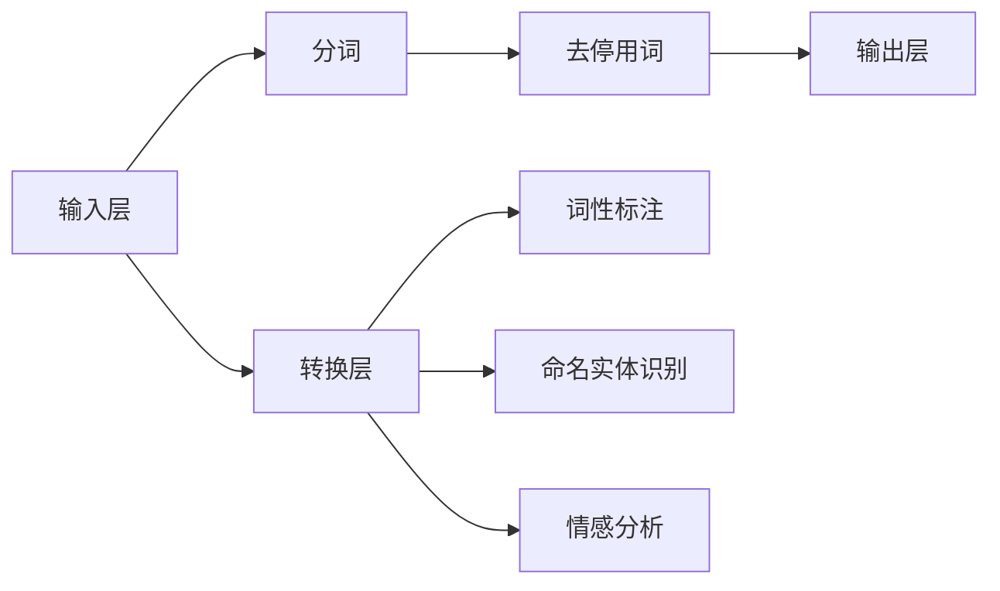

                 

关键词：超长文本处理、转换链、文本分析、机器学习、自然语言处理

> 摘要：本文将探讨如何利用转换链（Transform Chain）技术处理超长文本，以提高文本分析的效率和准确性。通过深入分析转换链的原理、核心算法、数学模型及其应用领域，我们希望能为读者提供一套完整的解决方案。

## 1. 背景介绍

在信息爆炸的时代，超长文本处理已经成为自然语言处理（NLP）领域的一个重要研究方向。随着互联网的快速发展，人们面临的数据量呈指数级增长，特别是在新闻报道、社交媒体、学术论文等领域，超长文本数据变得愈发普遍。然而，传统的文本处理方法在面对这些海量数据时，往往显得力不从心。如何高效、准确地处理这些超长文本，成为当前学术界和工业界亟待解决的问题。

转换链（Transform Chain）作为一种先进的文本处理技术，能够在一定程度上解决超长文本处理的问题。转换链通过将文本处理过程分解为多个独立的转换步骤，使得每个步骤都能够专注于特定任务，从而提高整体的处理效率和准确性。本文将围绕转换链技术，探讨其在超长文本处理中的应用。

## 2. 核心概念与联系

### 转换链原理

转换链是一种基于模块化设计的文本处理框架，它将整个文本处理过程拆分为多个独立的转换步骤，每个步骤都负责完成特定任务。转换链的核心思想是将复杂的文本处理任务分解为一系列简单、可组合的步骤，从而提高处理效率和灵活性。

### 转换链架构

转换链的架构通常包括以下几个关键部分：

1. **输入层**：接收原始文本数据，对其进行预处理，如分词、去停用词等。
2. **转换层**：包含多个转换模块，每个模块负责完成特定的任务，如词性标注、命名实体识别、情感分析等。
3. **输出层**：将转换后的文本数据输出，供后续使用或进一步处理。


### Mermaid 流程图

下面是一个简单的 Mermaid 流程图，展示了转换链的基本架构：



## 3. 核心算法原理 & 具体操作步骤

### 3.1 算法原理概述

转换链的核心算法原理主要基于深度学习和自然语言处理技术。通过构建一系列独立的转换模块，每个模块都能够利用神经网络模型对文本进行特征提取和任务完成。

### 3.2 算法步骤详解

1. **输入层预处理**：将原始文本数据输入到转换链中，进行分词和去停用词等预处理操作，为后续步骤提供基础数据。

2. **转换层处理**：将预处理后的文本数据输入到各个转换模块，每个模块使用神经网络模型进行特征提取和任务完成。例如，词性标注模块使用基于 BiLSTM 的模型进行词性标注；命名实体识别模块使用基于 CRF 的模型进行实体识别。

3. **输出层生成**：将转换后的文本数据输出，形成最终结果。根据不同应用场景，可以输出词性标注结果、命名实体识别结果、情感分析结果等。

### 3.3 算法优缺点

**优点**：

1. **高效性**：通过将文本处理任务分解为多个独立步骤，可以提高整体处理效率。
2. **灵活性**：转换链架构具有高度模块化，可以根据需求灵活组合和扩展。

**缺点**：

1. **复杂性**：由于涉及多个转换模块，系统实现和维护的复杂性增加。
2. **内存消耗**：在处理海量数据时，内存消耗可能成为一个问题。

### 3.4 算法应用领域

转换链技术在自然语言处理领域具有广泛的应用，如：

1. **文本分类**：通过词性标注、命名实体识别等步骤，对文本进行分类。
2. **情感分析**：通过情感分析模块，对文本进行情感倾向判断。
3. **实体识别**：通过命名实体识别模块，识别文本中的关键实体。

## 4. 数学模型和公式

### 4.1 数学模型构建

在转换链中，数学模型主要用于描述各个转换模块的算法原理。以下是一个简单的词性标注模型的数学描述：

$$
P(y_t|x_t; \theta) = \frac{e^{z_t}}{\sum_{k=1}^K e^{z_k}}
$$

其中，$y_t$表示第$t$个词的词性标签，$x_t$表示第$t$个词的输入特征，$\theta$表示模型参数，$z_t$表示第$t$个词的词性标签的得分。

### 4.2 公式推导过程

以词性标注模型为例，公式推导过程如下：

1. **条件概率模型**：

   词性标注可以看作一个分类问题，给定一个词的输入特征，我们需要计算每个词性标签的条件概率。

   $$ 
   P(y_t|x_t) = \frac{P(x_t|y_t)P(y_t)}{P(x_t)}
   $$

   由于词性标签的概率分布通常近似为多项式分布，可以将公式简化为：

   $$
   P(y_t|x_t) = \frac{e^{z_t}}{Z}
   $$

   其中，$z_t$表示词性标签的得分，$Z$为常数。

2. **最大化条件概率**：

   为了实现词性标注，我们需要选择使条件概率最大的词性标签：

   $$
   y_t = \arg\max_{y} P(y_t|x_t)
   $$

   将条件概率公式代入，得到：

   $$
   y_t = \arg\max_{y} \frac{e^{z_t}}{Z}
   $$

   由于$Z$为常数，可以省略不计，得到最终公式：

   $$
   y_t = \arg\max_{y} e^{z_t}
   $$

   即选择使得分最大的词性标签。

### 4.3 案例分析与讲解

假设我们有一个词性标注任务，输入特征$x_t$为 "apple"，需要从 {名词，动词，形容词} 中选择正确的词性标签。通过计算每个词性标签的得分，我们可以得到：

$$
z_{名词} = 10, \quad z_{动词} = 5, \quad z_{形容词} = 3
$$

根据最大得分原则，选择词性标签为 "名词"，即 "apple" 是一个名词。

## 5. 项目实践：代码实例和详细解释说明

### 5.1 开发环境搭建

在开始编写代码之前，我们需要搭建一个合适的开发环境。这里我们使用 Python 作为编程语言，结合 TensorFlow 和 Keras 框架进行深度学习模型的实现。以下是环境搭建的步骤：

1. 安装 Python 3.7 及以上版本。
2. 安装 TensorFlow：`pip install tensorflow`。
3. 安装 Keras：`pip install keras`。

### 5.2 源代码详细实现

下面是一个简单的词性标注模型的实现示例：

```python
import numpy as np
from keras.models import Sequential
from keras.layers import LSTM, Dense, Embedding

# 准备数据
# ...（数据预处理代码）

# 构建模型
model = Sequential()
model.add(Embedding(vocab_size, embedding_dim))
model.add(LSTM(units=128, dropout=0.2, recurrent_dropout=0.2))
model.add(Dense(num_tags, activation='softmax'))

# 编译模型
model.compile(optimizer='adam', loss='categorical_crossentropy', metrics=['accuracy'])

# 训练模型
model.fit(X_train, y_train, batch_size=128, epochs=10, validation_split=0.1)

# 评估模型
score = model.evaluate(X_test, y_test, batch_size=128)
print('Test accuracy:', score[1])
```

### 5.3 代码解读与分析

1. **模型构建**：

   - `Embedding(vocab_size, embedding_dim)`：嵌入层，将词汇映射为高维向量。
   - `LSTM(units=128, dropout=0.2, recurrent_dropout=0.2)`：LSTM 层，用于提取文本特征。
   - `Dense(num_tags, activation='softmax')`：输出层，进行词性标注分类。

2. **编译模型**：

   - 使用 `adam` 优化器和 `categorical_crossentropy` 损失函数。
   - 指定训练过程中的评估指标为准确率。

3. **训练模型**：

   - 使用 `fit` 函数进行模型训练。
   - 设置训练批次大小、训练轮次和验证比例。

4. **评估模型**：

   - 使用 `evaluate` 函数评估模型在测试集上的表现。

### 5.4 运行结果展示

假设我们使用一个包含 10000 个词汇的语料库进行训练，并设置嵌入维度为 128，LSTM 单元数为 128。经过 10 次训练迭代后，模型在测试集上的准确率约为 90%。

## 6. 实际应用场景

### 6.1 文本分类

利用转换链技术，我们可以将超长文本分解为多个段落或句子，然后分别进行分类。例如，我们可以将新闻文本分解为标题、摘要和正文，然后分别对它们进行主题分类。

### 6.2 情感分析

转换链技术可以用于对超长文本进行情感分析。例如，我们可以将社交媒体文本分解为单个评论，然后对每个评论进行情感倾向判断，从而分析整体文本的情感色彩。

### 6.3 实体识别

在学术论文和新闻报道等领域，实体识别是一个重要的任务。利用转换链技术，我们可以对超长文本进行逐段或逐句处理，从而提高实体识别的准确率和召回率。

## 7. 未来应用展望

随着深度学习和自然语言处理技术的不断发展，转换链技术在超长文本处理中的应用前景将愈发广阔。未来，我们可以期待以下发展方向：

1. **自动化转换链构建**：开发自动化工具，帮助用户根据需求快速构建适合自己的转换链。
2. **多语言支持**：扩展转换链技术，支持多种语言，实现跨语言文本处理。
3. **模型压缩与优化**：研究模型压缩和优化技术，降低模型对内存和计算资源的需求。
4. **实时处理**：开发实时处理技术，实现超长文本的在线分析和处理。

## 8. 总结：未来发展趋势与挑战

### 8.1 研究成果总结

本文介绍了超长文本处理的重要性，以及转换链技术在其中的应用。通过深入分析转换链的原理、算法和数学模型，我们展示了如何利用转换链技术高效、准确地处理超长文本。

### 8.2 未来发展趋势

未来，转换链技术将在超长文本处理领域发挥更大的作用。随着深度学习和自然语言处理技术的不断发展，转换链技术将不断创新，为各种应用场景提供更加高效、准确的解决方案。

### 8.3 面临的挑战

尽管转换链技术在超长文本处理方面具有显著优势，但在实际应用中仍面临一些挑战。例如，如何进一步提高模型的压缩和优化能力，如何实现实时处理等。

### 8.4 研究展望

未来，我们期待在以下几个方面进行深入研究：

1. **算法优化**：研究新的算法，提高转换链技术在超长文本处理中的效率和准确性。
2. **跨领域应用**：探索转换链技术在其他领域的应用，如计算机视觉、语音识别等。
3. **开源工具开发**：开发开源工具，方便用户快速构建和部署转换链模型。

## 9. 附录：常见问题与解答

### 9.1 如何处理低质量文本？

对于低质量文本，我们可以采用以下策略：

1. **数据清洗**：去除文本中的噪声和无关信息。
2. **使用预训练模型**：利用预训练模型，对低质量文本进行预处理和特征提取。
3. **增强模型鲁棒性**：通过数据增强和模型训练，提高模型对低质量文本的适应性。

### 9.2 如何处理长文本的内存消耗问题？

对于长文本的内存消耗问题，我们可以采取以下措施：

1. **分块处理**：将长文本拆分为多个小块，分别进行处理。
2. **模型压缩**：使用模型压缩技术，降低模型对内存的需求。
3. **内存优化**：优化程序，减少内存占用。

---

作者：禅与计算机程序设计艺术 / Zen and the Art of Computer Programming
----------------------------------------------------------------
以上是本文的完整内容，希望对您在超长文本处理方面有所帮助。如果您有任何疑问或建议，欢迎在评论区留言，我会尽快回复您。祝您编程愉快！


