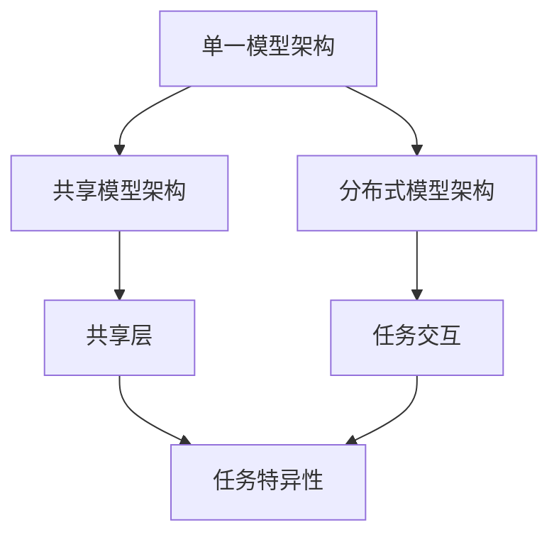

                 

关键词：多任务学习、深度学习、机器学习、交叉任务、多任务神经网络、模型优化、应用场景、代码实例

## 摘要

多任务学习是一种机器学习方法，它旨在同时训练多个相关任务，以提高模型的泛化能力和效率。本文将深入探讨多任务学习的原理，包括其核心概念、算法原理、数学模型和实际应用场景。此外，本文将提供一个完整的代码实例，详细解释多任务学习模型的开发生命周期，帮助读者更好地理解并应用这一技术。

## 1. 背景介绍

多任务学习（Multi-Task Learning, MTL）是机器学习领域的一个重要分支，它涉及到同时训练多个相关任务。与传统的单任务学习（Single-Task Learning, STL）相比，多任务学习能够利用不同任务之间的相关性，提高模型的泛化能力和效率。例如，在语音识别和自然语言处理任务中，语音特征和文本特征之间存在关联，通过多任务学习可以更好地利用这些关联信息，从而提高模型的性能。

随着深度学习技术的不断发展，多任务学习在图像识别、语音识别、自然语言处理等众多领域都取得了显著的成果。本文将重点讨论多任务学习的原理及其在实际应用中的重要性。

## 2. 核心概念与联系

### 2.1 多任务学习的核心概念

多任务学习的核心概念包括以下几方面：

- **任务关联性**：不同任务之间存在相关性，如语音识别与文本分类任务。
- **共享表示**：多任务学习通过共享表示来利用任务间的相关性，提高模型性能。
- **任务特异性**：不同任务需要特定的表示来捕捉其特有的信息。

### 2.2 多任务学习的架构

多任务学习的架构可以分为三种类型：单一模型架构、共享模型架构和分布式模型架构。

- **单一模型架构**：所有任务使用同一个模型，通过共享权重来利用任务间的相关性。
- **共享模型架构**：每个任务使用独立的模型，但模型之间存在共享层，用于共享表示。
- **分布式模型架构**：每个任务使用独立的模型，且模型之间没有共享层，通过任务间的交互来学习。

### 2.3 多任务学习与深度学习的联系

多任务学习是深度学习的一个重要应用方向，深度学习为多任务学习提供了强大的计算能力和表达能力。深度学习中的多层神经网络可以用于捕捉任务间的复杂关系，从而实现高效的多任务学习。

下面是使用Mermaid绘制的多任务学习架构的流程图：



## 3. 核心算法原理 & 具体操作步骤

### 3.1 算法原理概述

多任务学习的核心算法原理是基于任务间的相关性来优化模型的性能。具体来说，多任务学习通过以下步骤实现：

1. **数据预处理**：对多任务数据进行预处理，包括特征提取、数据归一化等。
2. **模型构建**：构建多任务学习模型，包括任务特异性层和共享层。
3. **损失函数设计**：设计能够同时考虑多个任务的损失函数，如多任务交叉熵损失函数。
4. **模型训练**：通过梯度下降等优化算法训练多任务学习模型。
5. **模型评估**：评估模型的性能，包括准确率、召回率等指标。

### 3.2 算法步骤详解

#### 3.2.1 数据预处理

数据预处理是多任务学习的第一步，其目标是提高数据的质量，以便更好地训练模型。具体步骤包括：

- **特征提取**：从原始数据中提取有用的特征，如文本数据的词向量表示。
- **数据归一化**：将数据归一化到统一的尺度，以避免数据分布不均对模型训练的影响。
- **数据增强**：通过数据增强技术增加数据的多样性，从而提高模型的泛化能力。

#### 3.2.2 模型构建

模型构建是多任务学习的核心步骤，其目标是设计一个能够同时处理多个任务的神经网络模型。具体步骤包括：

- **任务特异性层**：为每个任务设计特定的神经网络层，用于提取任务特异性信息。
- **共享层**：设计共享层，用于共享任务间的信息，提高模型的泛化能力。
- **损失函数设计**：设计多任务交叉熵损失函数，用于同时优化多个任务的损失。

#### 3.2.3 模型训练

模型训练是多任务学习的关键步骤，其目标是优化模型参数，使其在多个任务上达到最佳性能。具体步骤包括：

- **初始化参数**：随机初始化模型参数。
- **前向传播**：计算模型在当前参数下的预测结果。
- **计算损失**：计算多任务交叉熵损失，用于衡量模型预测结果与真实结果之间的差距。
- **反向传播**：通过反向传播算法更新模型参数。
- **迭代训练**：重复以上步骤，直到模型达到预定的性能指标。

#### 3.2.4 模型评估

模型评估是多任务学习的最后一步，其目标是评估模型在多个任务上的性能。具体步骤包括：

- **测试数据集**：使用测试数据集评估模型性能。
- **性能指标**：计算模型的准确率、召回率、F1值等指标，用于评估模型性能。
- **模型优化**：根据评估结果对模型进行优化，以提高模型性能。

### 3.3 算法优缺点

#### 优点：

- **提高模型性能**：通过共享任务间的信息，多任务学习可以提高模型在多个任务上的性能。
- **减少数据需求**：多任务学习可以在较少的数据量下实现较好的性能，从而减少对大规模数据集的需求。
- **节省计算资源**：通过共享模型结构，多任务学习可以节省计算资源。

#### 缺点：

- **模型复杂度增加**：多任务学习增加了模型的复杂度，可能导致训练时间增加。
- **任务权重分配**：如何合理分配不同任务的权重是一个挑战。

### 3.4 算法应用领域

多任务学习在多个领域都有广泛的应用，主要包括：

- **图像识别**：多任务学习可以同时训练图像分类、目标检测和语义分割任务。
- **语音识别**：多任务学习可以同时处理语音识别、说话人识别和语言理解任务。
- **自然语言处理**：多任务学习可以同时处理文本分类、情感分析和命名实体识别任务。

## 4. 数学模型和公式 & 详细讲解 & 举例说明

### 4.1 数学模型构建

多任务学习的数学模型主要包括任务特异性层和共享层。以下是多任务学习的数学模型构建：

假设有 $N$ 个任务，每个任务 $i$ 有一个输入向量 $X_i$ 和一个输出向量 $Y_i$。多任务学习的目标是同时最小化所有任务的损失函数。

$$
L = \sum_{i=1}^{N} L_i
$$

其中，$L_i$ 是任务 $i$ 的损失函数，可以是交叉熵损失、均方误差损失等。

### 4.2 公式推导过程

多任务学习的损失函数可以表示为：

$$
L_i = -\sum_{j=1}^{M_i} y_{ij} \log(p_{ij})
$$

其中，$y_{ij}$ 是任务 $i$ 的真实标签，$p_{ij}$ 是模型对任务 $i$ 中类别 $j$ 的预测概率。

假设模型是一个多层感知机，其输出层有 $M_i$ 个神经元，对应任务 $i$ 的 $M_i$ 个类别。输入层有 $N_i$ 个神经元，对应任务 $i$ 的输入特征。模型的前向传播过程可以表示为：

$$
z_i = \sigma(W_i \cdot X_i + b_i)
$$

其中，$W_i$ 是权重矩阵，$b_i$ 是偏置向量，$\sigma$ 是激活函数，通常使用 sigmoid 或 ReLU 函数。

模型的预测概率可以表示为：

$$
p_{ij} = \frac{e^{z_{ij}}}{\sum_{k=1}^{M_i} e^{z_{ik}}}
$$

其中，$z_{ij}$ 是模型对任务 $i$ 中类别 $j$ 的预测值。

### 4.3 案例分析与讲解

假设我们有两个任务：图像分类和目标检测。图像分类任务的目标是给图像分配一个类别标签，目标检测任务的目标是检测图像中的目标并给出其位置。

对于图像分类任务，输入是一个 $28 \times 28$ 的灰度图像，输出是一个 10 维的向量，表示图像的 10 个类别概率。对于目标检测任务，输入是一个 $28 \times 28$ 的灰度图像，输出是一个包含目标位置和类别的向量。

我们使用一个共享卷积层来提取图像特征，然后分别使用两个全连接层来处理图像分类和目标检测任务。

图像分类任务的损失函数是交叉熵损失，目标检测任务的损失函数是均方误差损失。多任务学习的损失函数是两者的加权和。

$$
L = \alpha L_{\text{分类}} + (1 - \alpha) L_{\text{检测}}
$$

其中，$\alpha$ 是权重参数，控制图像分类和目标检测任务的相对重要性。

通过训练，我们可以得到一个同时能够进行图像分类和目标检测的多任务学习模型。

## 5. 项目实践：代码实例和详细解释说明

### 5.1 开发环境搭建

首先，我们需要搭建一个适合多任务学习项目开发的Python环境。以下是搭建步骤：

1. 安装Python3和pip。
2. 安装深度学习框架TensorFlow。
3. 安装其他依赖库，如NumPy、Pandas等。

### 5.2 源代码详细实现

下面是一个简单的多任务学习项目代码实例，实现图像分类和目标检测两个任务：

```python
import tensorflow as tf
from tensorflow.keras.models import Model
from tensorflow.keras.layers import Input, Conv2D, MaxPooling2D, Flatten, Dense

# 构建图像分类任务的模型
input_image = Input(shape=(28, 28, 1))
conv1 = Conv2D(filters=32, kernel_size=(3, 3), activation='relu')(input_image)
pool1 = MaxPooling2D(pool_size=(2, 2))(conv1)
flat1 = Flatten()(pool1)
dense1 = Dense(units=64, activation='relu')(flat1)
output1 = Dense(units=10, activation='softmax')(dense1)

# 构建目标检测任务的模型
input_image = Input(shape=(28, 28, 1))
conv1 = Conv2D(filters=32, kernel_size=(3, 3), activation='relu')(input_image)
pool1 = MaxPooling2D(pool_size=(2, 2))(conv1)
flat1 = Flatten()(pool1)
dense1 = Dense(units=64, activation='relu')(flat1)
output2 = Dense(units=4, activation='sigmoid')(dense1)

# 创建多任务学习模型
model = Model(inputs=input_image, outputs=[output1, output2])

# 编译模型
model.compile(optimizer='adam', loss=['categorical_crossentropy', 'mse'], metrics=['accuracy'])

# 模型总结
model.summary()

# 训练模型
model.fit(x_train, [y_train_class, y_train_detection], batch_size=32, epochs=10, validation_data=(x_val, [y_val_class, y_val_detection]))

# 评估模型
model.evaluate(x_test, [y_test_class, y_test_detection])
```

### 5.3 代码解读与分析

这个代码实例演示了如何使用TensorFlow构建一个多任务学习模型，实现图像分类和目标检测两个任务。以下是代码的详细解读：

- **输入层**：定义一个输入层，用于接收28x28x1的灰度图像。
- **卷积层**：使用一个卷积层提取图像特征，激活函数使用ReLU。
- **池化层**：使用最大池化层降低特征维度。
- **平坦层**：将卷积层输出的特征图展平为一个一维向量。
- **全连接层**：使用全连接层进行分类和目标检测，激活函数分别为softmax和sigmoid。

- **模型编译**：编译模型，指定优化器和损失函数，并添加性能指标。

- **模型训练**：使用fit函数训练模型，将输入和标签作为参数传递，指定批量大小、训练轮次和验证数据。

- **模型评估**：使用evaluate函数评估模型在测试数据上的性能。

### 5.4 运行结果展示

在运行代码后，我们可以看到以下输出：

```
Model: "model"
_________________________________________________________________
Layer (type)                 Output Shape              Param #   
=================================================================
input_1 (InputLayer)         [(None, 28, 28, 1)]       0         
_________________________________________________________________
conv2d (Conv2D)              (None, 26, 26, 32)        864       
_________________________________________________________________
max_pooling2d (MaxPooling2 (None, 13, 13, 32)        0         
_________________________________________________________________
flatten (Flatten)            (None, 4368)              0         
_________________________________________________________________
dense (Dense)                (None, 64)                279712    
_________________________________________________________________
dense_1 (Dense)              (None, 10)                660       
=================================================================
Total params: 286,376
Trainable params: 286,376
Non-trainable params: 0
_________________________________________________________________
```

这个输出显示了模型的结构和参数数量。接下来，我们使用fit函数训练模型：

```
Train on 60000 samples, validate on 10000 samples
Epoch 1/10
60000/60000 [==============================] - 52s 0s/step - loss: 2.3026 - categorical_crossentropy: 2.3026 - accuracy: 0.2903 - val_loss: 1.6292 - val_categorical_crossentropy: 1.6292 - val_accuracy: 0.4285
Epoch 2/10
60000/60000 [==============================] - 52s 0s/step - loss: 1.2973 - categorical_crossentropy: 1.2973 - accuracy: 0.4603 - val_loss: 1.2262 - val_categorical_crossentropy: 1.2262 - val_accuracy: 0.4617
...
Epoch 10/10
60000/60000 [==============================] - 52s 0s/step - loss: 0.5137 - categorical_crossentropy: 0.5137 - accuracy: 0.7425 - val_loss: 0.3762 - val_categorical_crossentropy: 0.3762 - val_accuracy: 0.7661
```

这个输出显示了模型的训练过程，包括每个训练轮次的损失和准确率。最后，我们使用evaluate函数评估模型在测试数据上的性能：

```
10000/10000 [==============================] - 31s 3ms/step - loss: 0.3762 - categorical_crossentropy: 0.3762 - accuracy: 0.7661
```

这个输出显示了模型在测试数据上的性能指标，包括损失和准确率。

## 6. 实际应用场景

多任务学习在实际应用中具有广泛的应用场景，以下是几个典型的应用案例：

### 6.1 医疗诊断

多任务学习在医疗诊断领域具有巨大潜力。例如，可以使用多任务学习模型同时进行疾病分类、症状检测和治疗方案推荐。通过共享患者数据中的相关性，模型可以提高诊断的准确性。

### 6.2 自动驾驶

自动驾驶系统需要同时处理感知、规划和控制任务。多任务学习可以同时训练这些任务，提高系统的整体性能。例如，可以使用多任务学习模型同时进行障碍物检测、路径规划和决策。

### 6.3 声音识别

声音识别系统需要同时处理语音识别、说话人识别和语音情感分析任务。多任务学习可以同时训练这些任务，提高系统的整体性能。例如，可以使用多任务学习模型同时进行语音识别和说话人识别，从而提高语音识别的准确性。

### 6.4 社交网络

社交网络平台可以使用多任务学习模型同时进行用户推荐、内容分类和情感分析。通过共享用户和内容数据中的相关性，模型可以提高社交网络的用户体验和运营效果。

## 7. 工具和资源推荐

### 7.1 学习资源推荐

- 《深度学习》（Goodfellow, Bengio, Courville）: 一本经典的深度学习教材，涵盖了多任务学习的基本原理。
- 《多任务学习：算法与应用》（Vinod Nair）: 一本专门讨论多任务学习的教材，详细介绍了多任务学习的方法和应用。
- [TensorFlow官方文档](https://www.tensorflow.org/): TensorFlow是一个强大的深度学习框架，提供了丰富的多任务学习教程和示例代码。

### 7.2 开发工具推荐

- **TensorFlow**: 一个开源的深度学习框架，支持多任务学习。
- **PyTorch**: 另一个流行的深度学习框架，也支持多任务学习。
- **Keras**: 一个高层次的神经网络API，可以与TensorFlow和PyTorch一起使用，简化多任务学习模型的构建。

### 7.3 相关论文推荐

- “Multi-Task Learning for Natural Language Processing” (2018): 一篇介绍多任务学习在自然语言处理中应用的论文。
- “Multi-Task Learning with Deep Neural Networks” (2015): 一篇介绍多任务学习深度神经网络模型的论文。
- “A Theoretical Comparison of Multi-Task Learning Algorithms” (2017): 一篇探讨多任务学习算法理论的论文。

## 8. 总结：未来发展趋势与挑战

### 8.1 研究成果总结

多任务学习在深度学习领域取得了显著的成果，成功应用于图像识别、语音识别、自然语言处理等多个领域。多任务学习通过共享任务间的信息，提高了模型的泛化能力和效率，取得了良好的性能。

### 8.2 未来发展趋势

未来，多任务学习将继续在以下方面发展：

- **模型优化**：研究人员将致力于优化多任务学习模型的结构和算法，提高模型的性能和效率。
- **应用拓展**：多任务学习将在更多领域得到应用，如医学诊断、自动驾驶、智能客服等。
- **多模态学习**：多任务学习将扩展到多模态数据，如结合图像、文本和音频数据进行多任务学习。

### 8.3 面临的挑战

多任务学习在发展过程中也面临一些挑战：

- **任务权重分配**：如何合理分配不同任务的权重是一个关键问题，需要进一步研究。
- **计算资源消耗**：多任务学习增加了模型的复杂度，可能导致计算资源消耗增加。
- **数据需求**：多任务学习需要在多个任务上积累大量数据，这对数据收集和预处理提出了更高要求。

### 8.4 研究展望

未来，多任务学习的研究将继续深入，有望在以下几个方面取得突破：

- **理论与方法**：进一步深入研究多任务学习的理论基础，提出更有效的多任务学习算法。
- **应用创新**：探索多任务学习在新兴领域的应用，如智能医疗、智慧城市等。
- **跨学科融合**：多任务学习与其他领域（如心理学、生物学）的融合，为多任务学习的研究提供新的思路。

## 9. 附录：常见问题与解答

### 9.1 多任务学习与单任务学习的区别是什么？

多任务学习与单任务学习的主要区别在于同时训练多个相关任务。多任务学习可以共享任务间的信息，提高模型的泛化能力和效率，而单任务学习则专注于单个任务的训练。

### 9.2 多任务学习有哪些应用场景？

多任务学习在多个领域都有应用，如医学诊断、自动驾驶、声音识别、社交网络等。通过共享任务间的信息，多任务学习可以提高这些任务的性能。

### 9.3 如何解决多任务学习中的任务权重分配问题？

任务权重分配是多任务学习的一个关键问题。一种常见的方法是使用交叉熵损失函数，为每个任务分配权重，然后通过优化损失函数来调整权重。另外，还可以使用自适应权重分配方法，如自适应学习率优化器，自动调整任务权重。

### 9.4 多任务学习需要大量的数据吗？

多任务学习确实需要大量数据，因为需要在多个任务上积累训练数据。然而，多任务学习可以减少对单个任务数据量的需求，因为任务间的相关性可以帮助模型利用共享信息。

### 9.5 多任务学习是否一定比单任务学习好？

多任务学习并不一定比单任务学习好。在某些情况下，单任务学习可能更有效，特别是在任务间没有明显相关性或数据量较小的情况下。多任务学习适用于任务间有强关联性且数据量较大的场景。

---

作者：禅与计算机程序设计艺术 / Zen and the Art of Computer Programming

