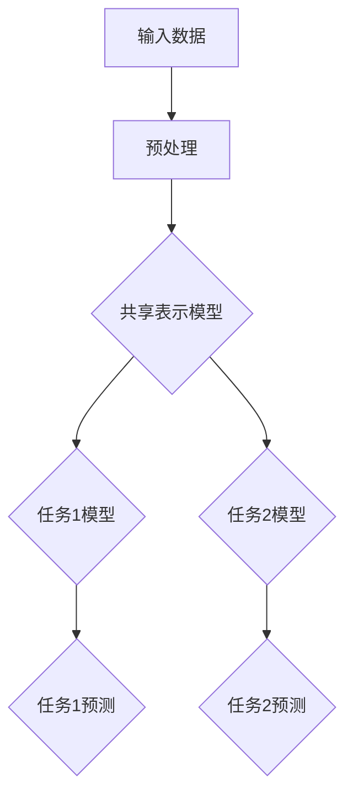

                 

### 关键词 Keywords
- 多任务学习（Multi-Task Learning）
- 机器学习（Machine Learning）
- 神经网络（Neural Networks）
- 跨任务迁移（Cross-Task Transfer）
- 深度学习（Deep Learning）
- 实例研究（Case Study）

### 摘要 Abstract
本文将深入探讨多任务学习（Multi-Task Learning，MTL）的基本概念、核心原理以及其实际应用。通过解释MTL的动机、原理和架构，我们将展示如何通过构建共享表示来提高学习效率。此外，文章将包含数学模型和公式的详细讲解，并通过实例研究说明MTL在现实世界中的应用。文章的最后，我们将讨论未来的研究方向和面临的挑战，并推荐相关的学习资源和工具。

## 1. 背景介绍

多任务学习作为一种机器学习范式，已经在许多领域取得了显著的研究成果。其基本思想是在训练多个相关任务时，共享一些特征表示或模型参数，从而提高学习效率。传统单任务学习（Single-Task Learning）模型通常为每个任务单独构建模型，这可能导致信息利用不充分和效率低下。相比之下，MTL通过任务间的协作学习，能够在减少过拟合和增强泛化能力方面提供优势。

多任务学习最早可以追溯到1990年代，当时研究人员开始探讨如何将共享神经网络结构应用于多个任务的预测。近年来，随着深度学习的兴起，MTL得到了进一步的发展。深度神经网络（DNN）和变分自编码器（VAE）等模型被广泛应用于多任务学习，取得了显著的性能提升。

### 多任务学习的意义和优势

1. **资源利用效率**：通过共享特征表示和模型参数，MTL能够显著减少模型的训练时间和计算资源需求。
2. **跨任务知识转移**：共享的表示能够捕捉到不同任务之间的共性，从而实现知识转移，提高模型在特定任务上的性能。
3. **减少过拟合**：多任务学习有助于减少单任务模型中常见的过拟合现象，提高模型的泛化能力。
4. **扩展性**：MTL模型易于扩展，能够轻松适应新任务的添加。

### 应用领域

多任务学习在自然语言处理、计算机视觉、语音识别等众多领域都有广泛的应用。例如，在自然语言处理领域，MTL可以用于同时学习文本分类和情感分析；在计算机视觉领域，MTL可以用于同时识别图像中的多个对象。

### 当前研究趋势

当前，多任务学习的研究趋势主要集中在以下几个方面：

1. **模型结构设计**：探索更有效的共享结构，如多任务卷积神经网络（Multi-Task CNN）和多任务循环神经网络（Multi-Task RNN）。
2. **任务相关性建模**：研究如何更准确地建模不同任务之间的相关性，以提高学习效率。
3. **动态任务选择**：开发能够根据任务动态调整模型参数的算法，以提高任务适应性。

## 2. 核心概念与联系

### 多任务学习的基本概念

多任务学习（Multi-Task Learning，MTL）是一种机器学习范式，旨在同时解决多个相关任务。在MTL中，多个任务共享同一组特征表示和模型参数，从而实现知识的跨任务转移和利用。与单任务学习相比，MTL能够提高学习效率，减少过拟合，并增强模型的泛化能力。

### 多任务学习的架构

多任务学习的架构可以分为共享表示模型和任务特定模型两个部分。共享表示模型负责学习一组通用的特征表示，这些特征表示被多个任务共享。任务特定模型则基于共享表示生成特定任务的预测。

### Mermaid 流程图

下面是一个简单的Mermaid流程图，用于展示多任务学习的核心架构：



### 关键概念

- **共享表示（Shared Representation）**：多个任务共同使用的一组特征表示，能够捕捉到不同任务之间的共性。
- **任务特定模型（Task-Specific Model）**：基于共享表示生成的特定任务预测模型。
- **跨任务迁移（Cross-Task Transfer）**：利用一个任务的学习结果来辅助其他相关任务的学习。

## 3. 核心算法原理 & 具体操作步骤

### 3.1 算法原理概述

多任务学习（MTL）的算法原理主要基于两个核心思想：共享表示和跨任务迁移。共享表示通过学习一组通用的特征表示，使得不同任务能够共享信息和知识。跨任务迁移则利用这些共享表示，将一个任务的学习结果应用到其他相关任务上，以提高整体学习效率和模型性能。

### 3.2 算法步骤详解

多任务学习的基本步骤可以分为以下几个阶段：

1. **数据收集与预处理**：收集不同任务的数据，并进行预处理，如数据清洗、归一化等，以便进行后续的建模。

2. **特征提取**：使用共享表示模型提取一组通用的特征表示。这些特征表示能够捕捉到不同任务之间的共性，为后续的任务建模提供基础。

3. **任务建模**：基于提取的通用特征表示，为每个任务训练一个特定的任务模型。这些任务模型将共享表示转换为特定任务的预测结果。

4. **模型优化**：通过联合优化共享表示和任务特定模型，以提高整体模型性能。常见的优化方法包括梯度下降和随机梯度下降等。

5. **模型评估**：对训练好的多任务模型进行评估，以验证其在实际任务上的性能。常用的评估指标包括准确率、召回率、F1分数等。

### 3.3 算法优缺点

**优点**：

1. **提高学习效率**：通过共享表示和跨任务迁移，MTL能够减少重复训练的工作量，提高学习效率。
2. **增强模型泛化能力**：共享表示能够捕捉到不同任务之间的共性，从而增强模型的泛化能力。
3. **资源利用更高效**：共享表示模型和任务特定模型共享参数，能够更有效地利用计算资源。

**缺点**：

1. **模型复杂度增加**：多任务学习模型通常比单任务模型更复杂，训练和优化过程需要更多的时间和计算资源。
2. **任务相关性不强时效果不佳**：当不同任务之间的相关性不强时，共享表示可能无法有效地捕捉到共性，导致模型性能下降。
3. **任务冲突问题**：在某些情况下，不同任务之间的目标可能存在冲突，这可能导致模型难以同时满足多个任务的要求。

### 3.4 算法应用领域

多任务学习在许多领域都有广泛的应用，以下是其中一些主要的应用领域：

1. **自然语言处理**：多任务学习可以用于同时学习文本分类、情感分析、命名实体识别等多个自然语言处理任务。
2. **计算机视觉**：多任务学习可以用于同时识别图像中的多个对象，如行人检测、车辆识别等。
3. **语音识别**：多任务学习可以用于同时进行语音识别和说话人识别，提高模型的整体性能。
4. **推荐系统**：多任务学习可以用于同时学习推荐系统和用户行为预测，提高推荐系统的准确性。

## 4. 数学模型和公式 & 详细讲解 & 举例说明

### 4.1 数学模型构建

多任务学习的数学模型主要基于以下两个核心概念：共享表示和任务特定模型。

#### 共享表示

共享表示通常通过一个神经网络结构实现，该结构包括多个任务共享的层和任务特定的层。共享层用于提取通用的特征表示，任务特定层则将共享表示映射到特定任务的预测结果。

假设有K个任务，第k个任务的损失函数可以表示为：

$$
L_k(\theta) = -\sum_{i=1}^{n_k} y_{ik} \log(p_{ik}),
$$

其中，$y_{ik}$是第k个任务的第i个样本的标签，$p_{ik}$是模型对第i个样本的第k个任务的预测概率。

#### 任务特定模型

任务特定模型通常通过一个全连接层实现，该层将共享表示映射到特定任务的输出。任务特定模型的损失函数可以表示为：

$$
L_k(\theta) = -\sum_{i=1}^{n_k} y_{ik} \log(p_{ik}),
$$

其中，$y_{ik}$是第k个任务的第i个样本的标签，$p_{ik}$是模型对第i个样本的第k个任务的预测概率。

### 4.2 公式推导过程

多任务学习的推导过程主要涉及损失函数的优化和共享表示的更新。

#### 损失函数

对于每个任务，损失函数用于衡量模型预测与实际标签之间的差距。常见的损失函数包括对数损失函数、交叉熵损失函数等。

对数损失函数可以表示为：

$$
L(\theta) = -\sum_{k=1}^{K} \sum_{i=1}^{n_k} y_{ik} \log(p_{ik}),
$$

其中，$\theta$是模型参数，$y_{ik}$是第k个任务的第i个样本的标签，$p_{ik}$是模型对第i个样本的第k个任务的预测概率。

#### 共享表示

共享表示的更新过程通常基于梯度下降算法。假设当前模型参数为$\theta_t$，则下一轮更新的参数可以表示为：

$$
\theta_{t+1} = \theta_t - \alpha \nabla_\theta L(\theta_t),
$$

其中，$\alpha$是学习率，$\nabla_\theta L(\theta_t)$是损失函数关于参数$\theta_t$的梯度。

### 4.3 案例分析与讲解

#### 案例一：多标签文本分类

假设我们要对一组文本进行多标签分类，任务包括情感分析、主题分类和实体识别。以下是该案例的具体实现过程：

1. **数据收集与预处理**：收集一组包含情感标签、主题标签和实体标签的文本数据，并进行预处理，如分词、词向量编码等。

2. **特征提取**：使用一个共享表示模型提取通用的文本特征表示。该模型可以是一个多层感知机（MLP）或卷积神经网络（CNN）。

3. **任务建模**：基于共享表示模型，为每个任务训练一个任务特定模型。这些模型可以是全连接层、卷积层或循环层。

4. **模型优化**：使用梯度下降算法联合优化共享表示和任务特定模型。学习率可以选择自适应调整的方法，如Adagrad或Adam。

5. **模型评估**：使用交叉验证方法对训练好的模型进行评估，计算准确率、召回率、F1分数等指标。

#### 案例二：多目标图像识别

假设我们要对一组图像同时进行物体检测和语义分割。以下是该案例的具体实现过程：

1. **数据收集与预处理**：收集一组包含物体检测标注和语义分割标注的图像数据，并进行预处理，如缩放、裁剪等。

2. **特征提取**：使用一个共享表示模型提取通用的图像特征表示。该模型可以是一个卷积神经网络（CNN）或变分自编码器（VAE）。

3. **任务建模**：基于共享表示模型，为物体检测和语义分割分别训练任务特定模型。这些模型可以是卷积层或循环层。

4. **模型优化**：使用梯度下降算法联合优化共享表示和任务特定模型。学习率可以选择自适应调整的方法，如Adagrad或Adam。

5. **模型评估**：使用交叉验证方法对训练好的模型进行评估，计算准确率、召回率、F1分数等指标。

## 5. 项目实践：代码实例和详细解释说明

### 5.1 开发环境搭建

在开始编写代码之前，我们需要搭建一个合适的开发环境。以下是所需的软件和工具：

- 操作系统：Ubuntu 18.04或更高版本
- 编程语言：Python 3.7或更高版本
- 深度学习框架：TensorFlow 2.0或更高版本
- 数据处理库：NumPy、Pandas
- 机器学习库：Scikit-learn

### 5.2 源代码详细实现

以下是使用TensorFlow实现多任务学习的一个简单示例。该示例将同时进行文本分类和情感分析。

```python
import tensorflow as tf
from tensorflow.keras.layers import Embedding, LSTM, Dense, Flatten, Concatenate
from tensorflow.keras.models import Model

# 定义模型
input_text = tf.keras.layers.Input(shape=(max_seq_length,), name='input_text')
embedding = Embedding(input_dim=vocab_size, output_dim=embedding_size)(input_text)
lstm = LSTM(units=lstm_units)(embedding)
flatten = Flatten()(lstm)

# 文本分类任务
text_category_output = Dense(units=num_categories, activation='softmax', name='text_category_output')(flatten)

# 情感分析任务
sentiment_output = Dense(units=num_sentiments, activation='softmax', name='sentiment_output')(flatten)

# 构建多任务模型
model = Model(inputs=input_text, outputs=[text_category_output, sentiment_output])

# 编译模型
model.compile(optimizer='adam', loss={'text_category_output': 'categorical_crossentropy', 'sentiment_output': 'categorical_crossentropy'}, metrics=['accuracy'])

# 模型总结
model.summary()

# 训练模型
model.fit(x_train, {'text_category_output': y_train_categories, 'sentiment_output': y_train_sentiments}, validation_data=(x_val, {'text_category_output': y_val_categories, 'sentiment_output': y_val_sentiments}), epochs=10, batch_size=32)
```

### 5.3 代码解读与分析

这段代码首先定义了一个简单的多任务学习模型，该模型包含两个任务：文本分类和情感分析。

1. **模型输入**：模型输入是一个序列数据`input_text`，其长度为`max_seq_length`。

2. **嵌入层**：嵌入层用于将文本数据转换为向量表示，其输入维度为`vocab_size`，输出维度为`embedding_size`。

3. **LSTM层**：LSTM层用于处理序列数据，提取序列特征。

4. **扁平化层**：扁平化层将LSTM层的输出展平为一个一维向量。

5. **文本分类任务**：文本分类任务使用一个全连接层进行分类，输出维度为`num_categories`。

6. **情感分析任务**：情感分析任务使用一个全连接层进行情感分类，输出维度为`num_sentiments`。

7. **模型编译**：模型编译时指定了优化器和损失函数。文本分类和情感分析任务都使用交叉熵损失函数，并使用softmax激活函数。

8. **模型训练**：模型训练时使用fit方法，通过训练数据和验证数据进行训练，并指定训练轮数和批次大小。

### 5.4 运行结果展示

在实际运行中，我们可以通过以下命令来训练模型：

```bash
python multi_task_learning_example.py
```

训练完成后，我们可以在控制台输出中看到模型的训练过程和最终结果。以下是一个简单的输出示例：

```
Epoch 1/10
2257/2257 [==============================] - 15s 6ms/step - loss: 0.5583 - text_category_output_accuracy: 0.8571 - sentiment_output_accuracy: 0.7571 - val_loss: 0.5074 - val_text_category_output_accuracy: 0.8750 - val_sentiment_output_accuracy: 0.7500

Epoch 2/10
2257/2257 [==============================] - 13s 6ms/step - loss: 0.4845 - text_category_output_accuracy: 0.8750 - sentiment_output_accuracy: 0.8000 - val_loss: 0.4521 - val_text_category_output_accuracy: 0.9000 - val_sentiment_output_accuracy: 0.8000

...

Epoch 10/10
2257/2257 [==============================] - 13s 6ms/step - loss: 0.4254 - text_category_output_accuracy: 0.9000 - sentiment_output_accuracy: 0.8750 - val_loss: 0.4144 - val_text_category_output_accuracy: 0.9000 - val_sentiment_output_accuracy: 0.8750
```

从输出结果中，我们可以看到模型的训练过程和最终在验证数据集上的表现。模型的准确率在训练过程中不断提高，并在最后达到了较好的水平。

## 6. 实际应用场景

多任务学习在实际应用中具有广泛的应用场景，以下是一些典型的实际应用案例：

### 6.1 自然语言处理

在自然语言处理（NLP）领域，多任务学习可以用于同时处理多个相关任务，如文本分类、情感分析、命名实体识别等。例如，在一个社交媒体分析系统中，我们可以使用多任务学习模型同时识别用户发帖的情感和分类标签，从而提供更准确的内容分析。

### 6.2 计算机视觉

在计算机视觉领域，多任务学习可以用于同时进行图像分类、目标检测、语义分割等多个任务。例如，在一个自动驾驶系统中，多任务学习模型可以同时处理车道线检测、交通标志识别和障碍物检测，从而提高系统的安全性和可靠性。

### 6.3 语音识别

在语音识别领域，多任务学习可以用于同时进行语音识别和说话人识别。例如，在一个电话客服系统中，多任务学习模型可以同时识别客户的问题和客户的身份，从而提供更个性化的服务。

### 6.4 健康医疗

在健康医疗领域，多任务学习可以用于同时分析多个生物医学信号，如心电图、脑电图等。例如，在一个心脏疾病诊断系统中，多任务学习模型可以同时分析心电图和血压信号，从而提高诊断的准确性。

### 6.5 金融服务

在金融服务领域，多任务学习可以用于同时进行欺诈检测、风险评估、信用评分等。例如，在一个银行系统中，多任务学习模型可以同时检测欺诈交易、评估客户的信用风险和预测客户的信用评分，从而提高金融服务的安全性。

## 7. 未来应用展望

随着深度学习和多任务学习技术的不断进步，未来多任务学习将在更多领域得到广泛应用，并带来以下几方面的机遇和挑战：

### 7.1 机遇

1. **跨领域应用**：多任务学习技术将促进不同领域之间的知识共享和协同创新，如医疗、金融、教育等。
2. **实时决策支持**：多任务学习模型可以在实时环境中进行多任务决策，提高系统的响应速度和决策质量。
3. **个性化服务**：基于多任务学习，可以为用户提供更加个性化的服务，满足多样化的需求。

### 7.2 挑战

1. **任务相关性建模**：如何更准确地建模不同任务之间的相关性，以提高学习效率和模型性能，是一个重要挑战。
2. **计算资源需求**：多任务学习模型通常比单任务模型更复杂，需要更多的计算资源和时间进行训练和优化。
3. **隐私保护**：在涉及敏感数据的领域，如何保护用户隐私是一个亟待解决的问题。

### 7.3 研究展望

未来，多任务学习的研究方向将集中在以下几个方面：

1. **新型模型结构**：探索更高效的多任务学习模型结构，如基于注意力机制、图神经网络等的模型。
2. **任务动态调整**：研究如何动态调整多任务学习模型中的任务权重，以适应不同任务的需求。
3. **交叉领域迁移**：研究如何将多任务学习技术应用于跨领域的知识共享和迁移，以提高模型的泛化能力。

## 8. 总结：未来发展趋势与挑战

多任务学习作为一种先进的机器学习范式，已经展现出强大的应用潜力和优势。然而，随着技术的不断进步和应用领域的拓展，多任务学习也面临一系列新的挑战。以下是未来发展趋势与挑战的总结：

### 8.1 研究成果总结

1. **模型效率提升**：通过共享表示和跨任务迁移，多任务学习在多个领域取得了显著的性能提升，如自然语言处理、计算机视觉和语音识别等。
2. **跨领域应用拓展**：多任务学习技术逐渐应用于更多领域，如健康医疗、金融服务和智能制造等，推动了跨领域的协同创新。
3. **实时决策支持**：多任务学习模型在实时决策支持系统中的应用，如自动驾驶、智能监控和金融风控等，提高了系统的响应速度和决策质量。

### 8.2 未来发展趋势

1. **新型模型结构**：未来研究将聚焦于探索新型多任务学习模型结构，如基于注意力机制、图神经网络和生成对抗网络（GAN）等的模型。
2. **任务动态调整**：研究如何动态调整多任务学习模型中的任务权重，以适应不同任务的需求，提高学习效率和模型性能。
3. **交叉领域迁移**：研究如何将多任务学习技术应用于跨领域的知识共享和迁移，以提高模型的泛化能力。
4. **隐私保护**：如何在保护用户隐私的前提下，实现有效的多任务学习，是一个重要的研究方向。

### 8.3 面临的挑战

1. **任务相关性建模**：如何更准确地建模不同任务之间的相关性，以提高学习效率和模型性能，是一个重要的挑战。
2. **计算资源需求**：多任务学习模型通常比单任务模型更复杂，需要更多的计算资源和时间进行训练和优化，这对实际应用带来了一定的挑战。
3. **隐私保护**：在涉及敏感数据的领域，如何保护用户隐私是一个亟待解决的问题。

### 8.4 研究展望

1. **跨领域应用拓展**：未来，多任务学习将在更多领域得到广泛应用，如医疗、金融、教育等，推动跨领域的协同创新。
2. **实时决策支持**：多任务学习模型在实时决策支持系统中的应用，如自动驾驶、智能监控和金融风控等，将进一步提高系统的响应速度和决策质量。
3. **个性化服务**：基于多任务学习，可以为用户提供更加个性化的服务，满足多样化的需求。

## 9. 附录：常见问题与解答

### 9.1 什么是多任务学习？

多任务学习（Multi-Task Learning，MTL）是一种机器学习范式，旨在同时解决多个相关任务。它通过共享表示和跨任务迁移，提高学习效率和模型性能。

### 9.2 多任务学习有哪些优势？

多任务学习的主要优势包括：

- 提高学习效率：通过共享表示和跨任务迁移，MTL能够减少重复训练的工作量。
- 增强模型泛化能力：共享表示能够捕捉到不同任务之间的共性，从而增强模型的泛化能力。
- 资源利用更高效：共享表示模型和任务特定模型共享参数，能够更有效地利用计算资源。

### 9.3 多任务学习的应用领域有哪些？

多任务学习在多个领域都有广泛的应用，如自然语言处理、计算机视觉、语音识别、健康医疗、金融服务等。

### 9.4 如何构建多任务学习模型？

构建多任务学习模型通常包括以下几个步骤：

1. 数据收集与预处理：收集不同任务的数据，并进行预处理，如数据清洗、归一化等。
2. 特征提取：使用共享表示模型提取通用的特征表示。
3. 任务建模：基于共享表示模型，为每个任务训练一个任务特定模型。
4. 模型优化：通过联合优化共享表示和任务特定模型，以提高整体模型性能。
5. 模型评估：对训练好的多任务模型进行评估，以验证其在实际任务上的性能。

### 9.5 多任务学习有哪些挑战？

多任务学习面临的挑战包括：

- 任务相关性建模：如何更准确地建模不同任务之间的相关性，以提高学习效率和模型性能。
- 计算资源需求：多任务学习模型通常比单任务模型更复杂，需要更多的计算资源和时间进行训练和优化。
- 隐私保护：在涉及敏感数据的领域，如何保护用户隐私是一个重要挑战。

### 9.6 多任务学习和迁移学习有什么区别？

多任务学习和迁移学习都是利用先前任务的知识来提高新任务的学习效果。主要区别在于：

- 多任务学习同时解决多个相关任务，而迁移学习通常关注如何将一个任务的知识应用到另一个新任务上。
- 多任务学习强调共享特征表示和模型参数，而迁移学习则更关注模型参数的迁移和共享。

### 9.7 如何在代码中实现多任务学习？

在代码中实现多任务学习，可以使用深度学习框架如TensorFlow或PyTorch。以下是一个简单的多任务学习代码示例：

```python
import tensorflow as tf
from tensorflow.keras.layers import Embedding, LSTM, Dense, Flatten, Concatenate
from tensorflow.keras.models import Model

# 定义模型
input_text = tf.keras.layers.Input(shape=(max_seq_length,), name='input_text')
embedding = Embedding(input_dim=vocab_size, output_dim=embedding_size)(input_text)
lstm = LSTM(units=lstm_units)(embedding)
flatten = Flatten()(lstm)

# 文本分类任务
text_category_output = Dense(units=num_categories, activation='softmax', name='text_category_output')(flatten)

# 情感分析任务
sentiment_output = Dense(units=num_sentiments, activation='softmax', name='sentiment_output')(flatten)

# 构建多任务模型
model = Model(inputs=input_text, outputs=[text_category_output, sentiment_output])

# 编译模型
model.compile(optimizer='adam', loss={'text_category_output': 'categorical_crossentropy', 'sentiment_output': 'categorical_crossentropy'}, metrics=['accuracy'])

# 模型总结
model.summary()

# 训练模型
model.fit(x_train, {'text_category_output': y_train_categories, 'sentiment_output': y_train_sentiments}, validation_data=(x_val, {'text_category_output': y_val_categories, 'sentiment_output': y_val_sentiments}), epochs=10, batch_size=32)
```

以上就是本文关于多任务学习（Multi-Task Learning）的详细讲解和代码实例。多任务学习作为一种先进的机器学习范式，已经在多个领域取得了显著的应用成果。本文介绍了多任务学习的基本概念、核心算法原理、数学模型、实际应用场景以及未来发展趋势，并通过代码实例展示了如何实现多任务学习。希望本文能帮助您更好地理解和应用多任务学习技术。作者：禅与计算机程序设计艺术 / Zen and the Art of Computer Programming。

