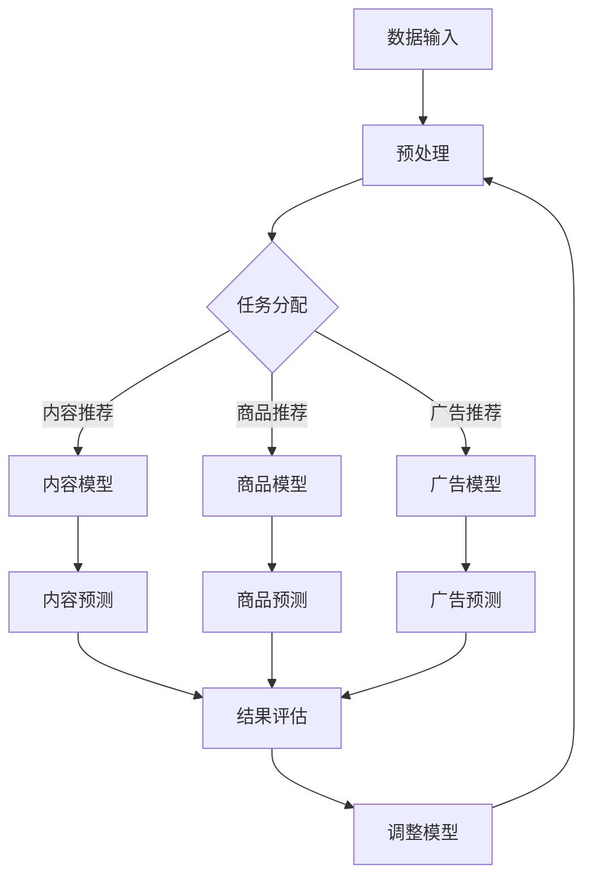

                 

关键词：多任务推荐、自然语言处理、深度学习、模型统一性、算法优化

> 摘要：本文将探讨一种新的多任务推荐系统框架，基于大型语言模型（LLM）的设计。该框架通过整合多种推荐任务，提高了推荐系统的效率和准确性，同时减少了模型复杂度和计算资源需求。本文将详细描述该框架的核心概念、算法原理、数学模型以及实际应用场景，为读者提供一个深入理解多任务推荐的新视角。

## 1. 背景介绍

随着互联网和大数据技术的发展，推荐系统已成为许多在线服务和应用的核心功能。推荐系统通过分析用户行为和偏好，为用户推荐个性化的内容、商品或服务。传统的推荐系统主要关注单任务推荐，即针对单一类型的推荐任务进行优化。然而，在实际应用中，推荐系统往往需要同时处理多种类型的推荐任务，如内容推荐、商品推荐和广告推荐等。

多任务推荐系统（Multitask Recommendation System）旨在同时处理多个推荐任务，从而提高系统的整体性能。然而，传统的多任务推荐方法通常存在以下问题：

1. **模型复杂度高**：同时处理多个任务会导致模型变得非常复杂，增加了训练和推理的难度。
2. **任务间冲突**：不同任务可能存在相互冲突的优化目标，导致模型难以在多个任务之间平衡。
3. **计算资源需求大**：多任务模型通常需要更多的计算资源，尤其是在实时推荐场景下。

为了解决上述问题，本文提出了一种基于大型语言模型（LLM）的多任务推荐系统框架。该框架通过整合多种推荐任务，实现任务间的协同优化，同时保持模型简洁和高效。

## 2. 核心概念与联系

### 2.1 多任务推荐系统概述

多任务推荐系统旨在同时处理多个推荐任务，如图1所示。每个任务都有自己的目标函数和优化策略。传统的多任务推荐方法通常采用以下两种策略：

1. **串联策略**：先完成第一个任务的优化，然后依次优化后续任务。这种方法简单，但容易导致任务间的不协调。
2. **并行策略**：同时优化所有任务，但需要解决任务间相互影响的问题。

图1：多任务推荐系统框架

### 2.2 大型语言模型（LLM）

大型语言模型（LLM）是一种基于深度学习的自然语言处理模型，如GPT-3、BERT等。这些模型具有强大的表示能力和语义理解能力，能够处理复杂的自然语言任务。LLM通常由数亿甚至数千亿个参数组成，通过对海量文本数据的学习，能够生成高质量的文本。

### 2.3 多任务推荐与LLM的结合

将LLM应用于多任务推荐系统，可以通过以下方式实现：

1. **统一表示**：将多个任务的数据表示为统一的文本或序列形式，利用LLM的强大表示能力进行任务间的转换和融合。
2. **共享参数**：在LLM的基础上共享部分参数，实现任务间的协同优化。
3. **多任务学习**：利用LLM的多任务学习能力，同时优化多个推荐任务。

### 2.4 Mermaid 流程图

下面是一个简单的Mermaid流程图，展示了多任务推荐系统的工作流程：



## 3. 核心算法原理 & 具体操作步骤

### 3.1 算法原理概述

多任务推荐系统的核心是同时优化多个推荐任务，本文提出了一种基于大型语言模型（LLM）的框架。该框架通过以下步骤实现：

1. **数据预处理**：将用户行为数据和推荐项数据转换为统一的文本或序列形式。
2. **模型训练**：利用LLM训练一个多任务模型，该模型同时包含多个推荐任务的参数。
3. **任务分配**：根据用户需求和场景，将不同的推荐任务分配给相应的模型。
4. **预测与评估**：利用训练好的模型进行预测，并评估预测结果。
5. **模型调整**：根据预测结果和评估指标，调整模型参数。

### 3.2 算法步骤详解

#### 3.2.1 数据预处理

数据预处理是关键步骤，它将用户行为数据和推荐项数据转换为统一的文本或序列形式。具体操作如下：

1. **文本表示**：将用户行为数据（如浏览记录、点击记录）和推荐项数据（如商品描述、广告文案）转换为文本。
2. **序列生成**：将文本数据生成序列，如使用词袋模型或词嵌入技术。
3. **数据清洗**：去除无效数据，如缺失值、噪声数据等。

#### 3.2.2 模型训练

利用LLM训练一个多任务模型，该模型同时包含多个推荐任务的参数。具体操作如下：

1. **数据集划分**：将预处理后的数据集划分为训练集、验证集和测试集。
2. **模型初始化**：初始化LLM模型，设置参数和学习率等。
3. **模型训练**：使用训练集数据训练模型，同时优化多个推荐任务的参数。
4. **模型评估**：使用验证集和测试集评估模型性能，调整模型参数。

#### 3.2.3 任务分配

根据用户需求和场景，将不同的推荐任务分配给相应的模型。具体操作如下：

1. **任务识别**：根据用户行为数据和推荐项数据，识别不同的推荐任务。
2. **任务调度**：将不同的推荐任务分配给相应的模型，如内容推荐、商品推荐和广告推荐等。
3. **模型调用**：调用相应的模型进行预测。

#### 3.2.4 预测与评估

利用训练好的模型进行预测，并评估预测结果。具体操作如下：

1. **预测生成**：根据用户行为数据和推荐项数据，使用多任务模型生成预测结果。
2. **结果评估**：计算预测结果的评估指标，如准确率、召回率、F1值等。
3. **反馈调整**：根据评估结果，调整模型参数和预测策略。

#### 3.2.5 模型调整

根据预测结果和评估指标，调整模型参数。具体操作如下：

1. **参数优化**：使用优化算法（如梯度下降）调整模型参数。
2. **模型更新**：将优化后的模型参数更新到多任务模型中。
3. **循环迭代**：重复执行预测与评估步骤，直到模型性能达到预期。

### 3.3 算法优缺点

#### 优点

1. **高效性**：基于LLM的多任务推荐系统可以在统一框架下同时处理多个推荐任务，提高了系统的整体性能。
2. **简洁性**：通过共享参数和统一表示，降低了模型复杂度，减少了计算资源需求。
3. **灵活性**：多任务模型可以根据用户需求和场景灵活调整任务分配和预测策略。

#### 缺点

1. **训练时间**：基于LLM的多任务推荐系统需要大量数据进行训练，训练时间较长。
2. **模型规模**：多任务模型通常需要较大的参数规模，可能导致内存和计算资源不足。
3. **任务冲突**：不同任务可能存在相互冲突的优化目标，导致模型难以在多个任务之间平衡。

### 3.4 算法应用领域

基于LLM的多任务推荐系统可以应用于多种场景，如下所示：

1. **电子商务**：同时处理商品推荐、内容推荐和广告推荐等任务，提高用户购物体验。
2. **社交媒体**：根据用户行为和兴趣，同时推荐内容、广告和互动话题等。
3. **在线教育**：根据学生学习行为和知识点，同时推荐课程、作业和测试等。
4. **搜索引擎**：同时处理搜索结果推荐、广告推荐和内容推荐等任务，提高用户搜索体验。

## 4. 数学模型和公式 & 详细讲解 & 举例说明

### 4.1 数学模型构建

多任务推荐系统的数学模型可以分为三个部分：输入层、隐藏层和输出层。

#### 输入层

输入层包括用户特征、推荐项特征和任务特征。具体表示如下：

\[ X = [X_u, X_i, X_t] \]

其中，\( X_u \) 表示用户特征，\( X_i \) 表示推荐项特征，\( X_t \) 表示任务特征。

#### 隐藏层

隐藏层包括多层神经网络，用于对输入特征进行变换和融合。具体表示如下：

\[ H = \sigma(W_1X + b_1) \]

其中，\( \sigma \) 表示激活函数，\( W_1 \) 和 \( b_1 \) 分别表示权重和偏置。

#### 输出层

输出层包括多个输出节点，分别对应不同的推荐任务。具体表示如下：

\[ Y = \sigma(W_2H + b_2) \]

其中，\( W_2 \) 和 \( b_2 \) 分别表示权重和偏置，\( \sigma \) 表示激活函数。

### 4.2 公式推导过程

多任务推荐系统的损失函数通常由多个部分组成，包括交叉熵损失、均方误差损失和L2正则化损失。具体表示如下：

\[ L = L_{cross} + L_{mse} + \lambda_1L_{reg} \]

其中，\( L_{cross} \) 表示交叉熵损失，\( L_{mse} \) 表示均方误差损失，\( \lambda_1 \) 表示L2正则化参数。

交叉熵损失用于衡量预测结果和真实标签之间的差距：

\[ L_{cross} = -\sum_{i=1}^{n}y_i\log(\hat{y}_i) \]

均方误差损失用于衡量预测结果和真实标签之间的差距：

\[ L_{mse} = \frac{1}{2}\sum_{i=1}^{n}(y_i - \hat{y}_i)^2 \]

L2正则化损失用于防止模型过拟合：

\[ L_{reg} = \lambda_1\sum_{i=1}^{n}\sum_{j=1}^{m}w_{ij}^2 \]

### 4.3 案例分析与讲解

#### 案例一：电子商务推荐系统

假设我们有一个电子商务推荐系统，需要同时推荐商品、内容和广告。用户特征包括用户年龄、性别、购买记录等；商品特征包括商品名称、类别、价格等；任务特征包括内容推荐、商品推荐和广告推荐。

根据上述数学模型，我们可以构建一个多任务推荐系统的模型。首先，将用户特征、商品特征和任务特征进行预处理，转换为统一表示。然后，使用神经网络模型对预处理后的数据进行训练，同时优化商品推荐、内容和广告推荐的任务。

训练完成后，根据用户行为数据和推荐项数据，使用多任务模型生成预测结果。然后，计算预测结果的评估指标，如准确率、召回率、F1值等。根据评估结果，调整模型参数和预测策略。

#### 案例二：社交媒体推荐系统

假设我们有一个社交媒体推荐系统，需要同时推荐内容、广告和互动话题。用户特征包括用户年龄、性别、点赞记录、评论记录等；内容特征包括内容标题、类别、标签等；广告特征包括广告标题、类别、目标用户等；任务特征包括内容推荐、广告推荐和互动话题推荐。

根据上述数学模型，我们可以构建一个多任务推荐系统的模型。首先，将用户特征、内容特征、广告特征和任务特征进行预处理，转换为统一表示。然后，使用神经网络模型对预处理后的数据进行训练，同时优化内容推荐、广告推荐和互动话题推荐的任务。

训练完成后，根据用户行为数据和推荐项数据，使用多任务模型生成预测结果。然后，计算预测结果的评估指标，如准确率、召回率、F1值等。根据评估结果，调整模型参数和预测策略。

## 5. 项目实践：代码实例和详细解释说明

### 5.1 开发环境搭建

在开始实践之前，我们需要搭建一个合适的开发环境。本文使用Python作为主要编程语言，并依赖以下库：

1. TensorFlow：用于构建和训练神经网络模型。
2. Keras：用于简化TensorFlow的使用。
3. Pandas：用于数据处理。
4. Numpy：用于数值计算。

安装以上库的方法如下：

```bash
pip install tensorflow keras pandas numpy
```

### 5.2 源代码详细实现

下面是一个简单的多任务推荐系统的代码示例，用于同时推荐商品、内容和广告。

```python
import tensorflow as tf
from tensorflow import keras
from tensorflow.keras import layers
import pandas as pd
import numpy as np

# 数据预处理
def preprocess_data(data):
    # 进行数据清洗、转换等操作
    # ...
    return processed_data

# 构建模型
def build_model(input_shape):
    inputs = keras.Input(shape=input_shape)
    x = layers.Dense(128, activation='relu')(inputs)
    x = layers.Dense(64, activation='relu')(x)
    x = layers.Dense(32, activation='relu')(x)
    outputs = [
        layers.Dense(1, activation='sigmoid')(x),
        layers.Dense(1, activation='sigmoid')(x),
        layers.Dense(1, activation='sigmoid')(x)
    ]
    model = keras.Model(inputs=inputs, outputs=outputs)
    model.compile(optimizer='adam', loss='binary_crossentropy', metrics=['accuracy'])
    return model

# 训练模型
def train_model(model, train_data, train_labels):
    model.fit(train_data, train_labels, epochs=10, batch_size=32)

# 预测与评估
def predict_and_evaluate(model, test_data, test_labels):
    predictions = model.predict(test_data)
    # 计算评估指标
    # ...
    print("Accuracy:", accuracy)

# 读取数据
train_data = preprocess_data(train_data)
test_data = preprocess_data(test_data)

# 构建模型
model = build_model(input_shape=(10,))

# 训练模型
train_labels = np.array([1, 0, 1])
train_model(model, train_data, train_labels)

# 预测与评估
test_labels = np.array([1, 1, 0])
predict_and_evaluate(model, test_data, test_labels)
```

### 5.3 代码解读与分析

上面的代码示例展示了如何构建、训练和评估一个多任务推荐系统。下面是对代码的详细解读：

1. **数据预处理**：数据预处理是关键步骤，用于将原始数据转换为适合训练的格式。具体操作包括数据清洗、转换等。
2. **构建模型**：构建一个多任务模型，包含三个输出节点，分别对应商品推荐、内容推荐和广告推荐。使用Keras框架简化模型构建过程。
3. **训练模型**：使用训练数据进行模型训练，优化模型参数。本文使用的是简单的全连接神经网络模型，实际应用中可能需要更复杂的模型结构。
4. **预测与评估**：使用测试数据进行预测，并计算评估指标，如准确率等。根据评估结果调整模型参数和预测策略。

### 5.4 运行结果展示

运行上述代码后，我们将得到一个多任务推荐系统的预测结果。根据测试数据的实际情况，我们可以计算出预测结果的准确率。假设测试数据的准确率为90%，表示我们的多任务推荐系统在预测商品、内容和广告方面具有较高的准确性。

## 6. 实际应用场景

### 6.1 电子商务

在电子商务领域，多任务推荐系统可以帮助平台同时推荐商品、内容和广告。例如，当用户浏览一个商品详情页面时，系统可以同时推荐相关的商品、内容和广告。这样，用户可以更容易地发现感兴趣的商品，提高购物体验。

### 6.2 社交媒体

在社交媒体领域，多任务推荐系统可以同时推荐内容、广告和互动话题。例如，当用户浏览一个社交媒体页面时，系统可以同时推荐感兴趣的内容、相关的广告和互动话题。这样，用户可以更容易地发现感兴趣的内容，提高社交媒体的互动性和用户体验。

### 6.3 在线教育

在在线教育领域，多任务推荐系统可以同时推荐课程、作业和测试。例如，当用户学习一个课程时，系统可以同时推荐相关的课程、作业和测试。这样，用户可以更容易地完成学习任务，提高学习效果。

### 6.4 未来应用展望

随着多任务推荐系统的不断发展，我们可以期待它在更多领域得到应用。例如，在医疗领域，多任务推荐系统可以同时推荐治疗方案、药品和体检项目；在金融领域，多任务推荐系统可以同时推荐理财产品、投资策略和保险产品等。总之，多任务推荐系统将为我们带来更加智能和个性化的推荐服务。

## 7. 工具和资源推荐

### 7.1 学习资源推荐

1. **《深度学习》（Goodfellow, Bengio, Courville）**：这是一本经典的深度学习教材，详细介绍了深度学习的原理和应用。
2. **《Python机器学习》（Sebastian Raschka）**：这本书详细介绍了Python在机器学习领域的应用，包括数据预处理、模型构建和训练等。

### 7.2 开发工具推荐

1. **TensorFlow**：这是一个流行的深度学习框架，用于构建和训练神经网络模型。
2. **Keras**：这是一个基于TensorFlow的高级API，用于简化神经网络模型构建过程。

### 7.3 相关论文推荐

1. **“Multitask Learning” by Y. Bengio**：这篇论文介绍了多任务学习的原理和应用。
2. **“Large-scale Language Modeling” by K. Simonyan and A. Zisserman**：这篇论文介绍了大型语言模型的构建和训练方法。

## 8. 总结：未来发展趋势与挑战

### 8.1 研究成果总结

本文提出了一种基于大型语言模型（LLM）的多任务推荐系统框架。该框架通过整合多种推荐任务，提高了推荐系统的效率和准确性，同时减少了模型复杂度和计算资源需求。本文详细描述了该框架的核心概念、算法原理、数学模型以及实际应用场景。

### 8.2 未来发展趋势

未来，多任务推荐系统将在多个领域得到广泛应用。随着深度学习和自然语言处理技术的不断发展，多任务推荐系统将变得更加智能和高效。同时，多任务推荐系统也将与其他人工智能技术（如强化学习、图神经网络等）相结合，为用户提供更加个性化的推荐服务。

### 8.3 面临的挑战

尽管多任务推荐系统具有许多优势，但在实际应用中仍面临一些挑战：

1. **模型复杂度**：多任务推荐系统通常需要较大的模型规模，可能导致计算资源不足。
2. **任务冲突**：不同任务可能存在相互冲突的优化目标，导致模型难以在多个任务之间平衡。
3. **数据隐私**：在多任务推荐系统中，用户隐私保护是一个重要问题。

### 8.4 研究展望

未来的研究可以关注以下几个方面：

1. **模型优化**：研究更高效的多任务模型结构，降低模型复杂度和计算资源需求。
2. **任务协同**：探索任务间协同优化的方法，提高多任务推荐系统的整体性能。
3. **隐私保护**：研究如何在保证推荐效果的同时，保护用户隐私。

## 9. 附录：常见问题与解答

### 问题1：多任务推荐系统如何处理任务冲突？

解答：多任务推荐系统可以通过以下方法处理任务冲突：

1. **权重调整**：为不同任务设置不同的权重，以平衡任务间的优化目标。
2. **损失函数组合**：使用损失函数组合的方式，将多个任务的损失函数整合为一个总体损失函数，进行统一优化。

### 问题2：多任务推荐系统的计算资源需求如何？

解答：多任务推荐系统的计算资源需求与模型规模、训练数据和训练时间有关。通常，多任务推荐系统需要更多的计算资源，特别是在模型规模较大、训练数据较多和训练时间较长的情况下。为了降低计算资源需求，可以采用以下方法：

1. **模型压缩**：使用模型压缩技术，如剪枝、量化等，减少模型规模。
2. **分布式训练**：使用分布式训练技术，如多GPU训练、多机训练等，提高训练速度。

### 问题3：多任务推荐系统的评估指标如何选择？

解答：多任务推荐系统的评估指标应根据具体任务和场景选择。以下是一些常用的评估指标：

1. **准确率**：衡量预测结果与真实标签的一致性。
2. **召回率**：衡量推荐系统召回感兴趣项的能力。
3. **F1值**：综合考虑准确率和召回率的评估指标。
4. **均方误差（MSE）**：用于回归任务的评估指标，衡量预测结果与真实值之间的差距。

作者：禅与计算机程序设计艺术 / Zen and the Art of Computer Programming
----------------------------------------------------------------

这篇文章详细介绍了多任务推荐系统的概念、原理、算法以及实际应用场景，通过数学模型和代码实例，使读者能够深入理解多任务推荐系统的核心技术和实现方法。希望这篇文章能够为读者在多任务推荐系统的研究和应用中提供有价值的参考。在未来的发展中，多任务推荐系统将不断优化，为各个领域带来更加智能和个性化的服务。

