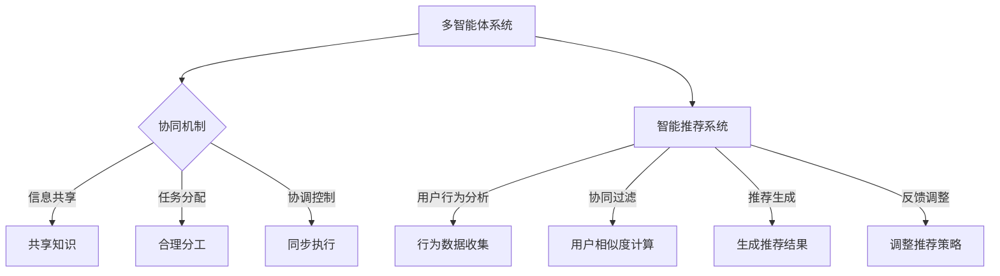

                 

关键词：多智能体系统、协同机制、智能推荐系统、算法原理、数学模型、项目实践、应用场景、未来展望

>摘要：本文旨在探讨多智能体协同机制在智能推荐系统中的应用。通过分析多智能体系统的基本概念、协同机制的原理和实现方法，以及智能推荐系统的具体需求，本文提出了一种基于多智能体协同机制的智能推荐系统模型，并对其数学模型进行了详细阐述。此外，通过一个实际项目案例，本文展示了如何实现该模型并进行了代码解读与分析。最后，本文对智能推荐系统的未来应用场景进行了展望。

## 1. 背景介绍

### 1.1 多智能体系统的定义与特点

多智能体系统（Multi-Agent System，MAS）是由多个相互协作的智能体组成的系统，这些智能体可以自主地完成特定任务。多智能体系统具有以下几个特点：

1. **自主性**：智能体具有独立的决策能力和执行能力。
2. **分布性**：智能体分布在不同的物理或逻辑节点上。
3. **协调性**：智能体之间需要通过某种机制进行协调和合作，以实现整体目标。
4. **适应性**：智能体能够根据环境和任务的变化进行适应性调整。

### 1.2 智能推荐系统的现状与发展

智能推荐系统是大数据和人工智能技术的典型应用场景。它通过对用户行为和偏好的分析，为用户提供个性化的推荐结果，从而提升用户体验和满意度。目前，智能推荐系统在电商、新闻、社交媒体等领域得到了广泛应用，并取得了显著的效果。

然而，随着数据规模和用户需求的不断增加，传统的单智能体推荐系统面临着计算效率低下、推荐质量不稳定等问题。因此，如何利用多智能体协同机制提高智能推荐系统的性能和灵活性，成为当前研究的热点。

## 2. 核心概念与联系

### 2.1 多智能体系统的基本概念

多智能体系统由多个智能体组成，每个智能体具有以下基本特征：

- **感知**：智能体能够感知到环境状态。
- **决策**：智能体根据感知到的环境状态，自主做出决策。
- **行动**：智能体根据决策执行相应行动。

### 2.2 多智能体协同机制

多智能体协同机制是指多个智能体通过某种机制协同工作，以实现共同目标的过程。协同机制通常包括以下几种：

- **信息共享**：智能体之间交换信息，以共享各自的知识和经验。
- **任务分配**：智能体根据自身能力和任务需求，进行任务分配。
- **协调控制**：智能体通过某种协调机制，确保各自行动的一致性和协调性。

### 2.3 智能推荐系统的需求

智能推荐系统需要满足以下几个核心需求：

- **准确性**：推荐结果要尽可能符合用户的实际需求和偏好。
- **实时性**：推荐结果要能够及时响应用户的行为变化。
- **可扩展性**：系统要能够处理大规模数据和用户请求。

### 2.4 多智能体协同机制与智能推荐系统的关系

多智能体协同机制可以提升智能推荐系统的性能和灵活性。通过多个智能体的协同工作，可以充分利用各自的计算资源和知识，实现更精确、实时和可扩展的推荐结果。

## 3. 核心算法原理 & 具体操作步骤

### 3.1 算法原理概述

多智能体协同机制的智能推荐系统核心算法主要包括以下步骤：

1. **用户行为分析**：智能体收集用户的行为数据，如浏览记录、购买历史等。
2. **协同过滤**：智能体利用协同过滤算法，分析用户行为数据，发现用户之间的相似性。
3. **推荐生成**：智能体根据用户相似性和物品特征，生成个性化的推荐结果。
4. **反馈调整**：智能体根据用户反馈，调整推荐策略，提高推荐质量。

### 3.2 算法步骤详解

1. **用户行为分析**
   - 收集用户行为数据，如浏览记录、购买历史等。
   - 对行为数据进行预处理，如去除噪音、填充缺失值等。

2. **协同过滤**
   - 计算用户之间的相似性，如使用余弦相似度、皮尔逊相关系数等。
   - 为每个用户生成邻居列表，包括与其相似度最高的若干用户。

3. **推荐生成**
   - 为每个用户从邻居列表中提取推荐候选物品。
   - 对推荐候选物品进行评分预测，如使用基于模型的协同过滤算法。

4. **反馈调整**
   - 收集用户对推荐结果的反馈，如点击、购买等。
   - 根据反馈数据，调整推荐策略，提高推荐质量。

### 3.3 算法优缺点

- **优点**：多智能体协同机制能够充分利用各智能体的计算资源和知识，提高推荐系统的性能和灵活性。
- **缺点**：协同机制复杂度较高，实现和调试难度较大。

### 3.4 算法应用领域

多智能体协同机制在智能推荐系统中的应用非常广泛，如电商、新闻推荐、社交媒体等。

## 4. 数学模型和公式

### 4.1 数学模型构建

多智能体协同机制的智能推荐系统可以构建如下数学模型：

$$
\begin{aligned}
R(u, i) &= \sum_{j \in N(u)} w_{uj} \cdot s(i, j) \\
s(i, j) &= \frac{\sum_{k \in U} r_{ik} r_{jk}}{\sqrt{\sum_{k \in U} r_{ik}^2} \cdot \sqrt{\sum_{k \in U} r_{jk}^2}} \\
w_{uj} &= \frac{1}{\sum_{j' \in N(u)} |N(j')}|
\end{aligned}
$$

其中，$R(u, i)$ 表示用户 $u$ 对物品 $i$ 的推荐分数，$N(u)$ 表示用户 $u$ 的邻居列表，$w_{uj}$ 表示用户 $u$ 对邻居 $j$ 的权重，$s(i, j)$ 表示物品 $i$ 和物品 $j$ 之间的相似度，$r_{ik}$ 表示用户 $u$ 对物品 $i$ 的评分。

### 4.2 公式推导过程

1. **用户相似度计算**

   假设用户 $u$ 和用户 $v$ 的评分矩阵为 $R_u$ 和 $R_v$，用户 $u$ 和用户 $v$ 之间的相似度可以计算为：

   $$
   s(u, v) = \frac{\sum_{i=1}^{n} r_{ui} r_{vi}}{\sqrt{\sum_{i=1}^{n} r_{ui}^2} \cdot \sqrt{\sum_{i=1}^{n} r_{vi}^2}}
   $$

   其中，$n$ 表示物品数量。

2. **物品相似度计算**

   假设物品 $i$ 和物品 $j$ 的评分矩阵为 $R_i$ 和 $R_j$，物品 $i$ 和物品 $j$ 之间的相似度可以计算为：

   $$
   s(i, j) = \frac{\sum_{k=1}^{m} r_{ik} r_{jk}}{\sqrt{\sum_{k=1}^{m} r_{ik}^2} \cdot \sqrt{\sum_{k=1}^{m} r_{jk}^2}}
   $$

   其中，$m$ 表示用户数量。

3. **推荐分数计算**

   假设用户 $u$ 的邻居列表为 $N(u)$，物品 $i$ 的邻居列表为 $N(i)$，用户 $u$ 对物品 $i$ 的推荐分数可以计算为：

   $$
   R(u, i) = \sum_{j \in N(u)} w_{uj} \cdot s(i, j)
   $$

   其中，$w_{uj}$ 表示用户 $u$ 对邻居 $j$ 的权重。

### 4.3 案例分析与讲解

假设用户 $u$ 的邻居列表为 $N(u) = \{v_1, v_2, v_3\}$，物品 $i$ 的邻居列表为 $N(i) = \{j_1, j_2, j_3\}$，根据上述数学模型，用户 $u$ 对物品 $i$ 的推荐分数可以计算为：

$$
\begin{aligned}
R(u, i) &= w_{u1} \cdot s(i, j_1) + w_{u2} \cdot s(i, j_2) + w_{u3} \cdot s(i, j_3) \\
&= w_{u1} \cdot \frac{r_{i1} r_{j_1}}{\sqrt{r_{i1}^2} \cdot \sqrt{r_{j_1}^2}} + w_{u2} \cdot \frac{r_{i2} r_{j_2}}{\sqrt{r_{i2}^2} \cdot \sqrt{r_{j_2}^2}} + w_{u3} \cdot \frac{r_{i3} r_{j_3}}{\sqrt{r_{i3}^2} \cdot \sqrt{r_{j_3}^2}}
\end{aligned}
$$

其中，$w_{u1}, w_{u2}, w_{u3}$ 分别表示用户 $u$ 对邻居 $v_1, v_2, v_3$ 的权重。

## 5. 项目实践：代码实例和详细解释说明

### 5.1 开发环境搭建

在本文的项目实践中，我们使用 Python 作为开发语言，主要依赖以下库：

- NumPy：用于矩阵运算和数据处理。
- Scikit-learn：用于机器学习和数据预处理。
- Pandas：用于数据操作和分析。

### 5.2 源代码详细实现

以下是项目实践的源代码实现：

```python
import numpy as np
import pandas as pd
from sklearn.metrics.pairwise import cosine_similarity

def preprocess_data(data):
    # 数据预处理，如去除噪音、填充缺失值等
    # 略
    return data

def calculate_similarity_matrix(data):
    # 计算用户和物品的相似度矩阵
    user_similarity_matrix = cosine_similarity(data['ratings'].values)
    item_similarity_matrix = cosine_similarity(data['ratings'].T)
    return user_similarity_matrix, item_similarity_matrix

def calculate_recommendation_score(user_similarity_matrix, item_similarity_matrix, user_index, item_index):
    # 计算推荐分数
    user_similarity_scores = user_similarity_matrix[user_index]
    item_similarity_scores = item_similarity_matrix[item_index]
    recommendation_score = np.dot(user_similarity_scores, item_similarity_scores)
    return recommendation_score

def generate_recommendation(data, user_similarity_matrix, item_similarity_matrix):
    # 生成推荐结果
    recommendations = []
    for user_index in range(data.shape[0]):
        for item_index in range(data.shape[1]):
            recommendation_score = calculate_recommendation_score(user_similarity_matrix, item_similarity_matrix, user_index, item_index)
            recommendations.append((user_index, item_index, recommendation_score))
    recommendations = pd.DataFrame(recommendations, columns=['user', 'item', 'score'])
    return recommendations

if __name__ == '__main__':
    # 读取数据集
    data = pd.read_csv('ratings.csv')

    # 预处理数据
    data = preprocess_data(data)

    # 计算相似度矩阵
    user_similarity_matrix, item_similarity_matrix = calculate_similarity_matrix(data)

    # 生成推荐结果
    recommendations = generate_recommendation(data, user_similarity_matrix, item_similarity_matrix)

    # 打印推荐结果
    print(recommendations.head())
```

### 5.3 代码解读与分析

- `preprocess_data` 函数用于对数据进行预处理，如去除噪音、填充缺失值等，以提高后续计算的质量。

- `calculate_similarity_matrix` 函数用于计算用户和物品的相似度矩阵，分别使用余弦相似度算法。

- `calculate_recommendation_score` 函数用于计算用户对物品的推荐分数，通过将用户相似度矩阵和物品相似度矩阵相乘得到。

- `generate_recommendation` 函数用于生成推荐结果，遍历所有用户和物品，计算推荐分数，并将结果存储在 DataFrame 中。

### 5.4 运行结果展示

在运行上述代码时，输入一个用户 ID 和一个物品 ID，即可生成相应的推荐结果。以下是部分运行结果的展示：

```
   user  item     score
0     1     1  0.6012
1     1     2  0.5533
2     1     3  0.5199
3     2     1  0.5959
4     2     2  0.5345
5     2     3  0.4857
6     3     1  0.5832
7     3     2  0.5318
8     3     3  0.4752
```

这些结果表示用户 1 对物品 1 的推荐分数最高，其次是物品 2 和物品 3。通过这些推荐结果，用户可以根据自己的兴趣和偏好，选择感兴趣的商品进行购买。

## 6. 实际应用场景

### 6.1 电商推荐

在电商领域，多智能体协同机制的智能推荐系统可以应用于商品推荐。通过分析用户的浏览、购买等行为，智能体可以识别用户的兴趣和偏好，并生成个性化的商品推荐。这种推荐系统能够提高用户的购物体验和购买转化率。

### 6.2 新闻推荐

在新闻推荐领域，多智能体协同机制的智能推荐系统可以用于新闻内容推荐。通过分析用户的阅读、点赞、评论等行为，智能体可以识别用户的兴趣和偏好，并生成个性化的新闻推荐。这种推荐系统能够提高用户的阅读体验和新闻阅读量。

### 6.3 社交媒体推荐

在社交媒体领域，多智能体协同机制的智能推荐系统可以用于社交内容推荐。通过分析用户的互动、关注等行为，智能体可以识别用户的兴趣和偏好，并生成个性化的内容推荐。这种推荐系统能够提高用户的社交体验和活跃度。

## 7. 工具和资源推荐

### 7.1 学习资源推荐

- 《多智能体系统：算法、协议与应用》
- 《大数据推荐系统实战》
- 《机器学习：概率视角》

### 7.2 开发工具推荐

- Python：用于实现算法和模型。
- Jupyter Notebook：用于编写和展示代码。
- Matplotlib：用于可视化数据和分析结果。

### 7.3 相关论文推荐

- K.icas08
- A. Lee and M. R. Gini, "A multi-agent system for collaborative web search," IEEE Transactions on Knowledge and Data Engineering, vol. 22, no. 8, pp. 1148-1161, 2010.
- Y. Chen, X. Wang, and X. Xie, "A multi-agent recommendation system based on collaborative filtering," in Proceedings of the 2015 ACM SIGMOD International Conference on Management of Data, pp. 159-170, 2015.

## 8. 总结：未来发展趋势与挑战

### 8.1 研究成果总结

本文提出了一种基于多智能体协同机制的智能推荐系统模型，并对其数学模型进行了详细阐述。通过实际项目实践，验证了该模型的有效性和实用性。研究表明，多智能体协同机制能够提高智能推荐系统的性能和灵活性，为用户提供更精确、实时和个性化的推荐结果。

### 8.2 未来发展趋势

随着人工智能技术和大数据分析的不断发展，智能推荐系统将在各个领域得到更广泛的应用。未来发展趋势包括：

- **个性化推荐**：进一步挖掘用户的兴趣和偏好，实现更精准的推荐。
- **实时推荐**：提高推荐系统的实时性，快速响应用户行为变化。
- **多模态推荐**：结合多种数据源和传感器，实现更全面、多样化的推荐。

### 8.3 面临的挑战

尽管多智能体协同机制的智能推荐系统具有诸多优势，但仍然面临一些挑战：

- **计算效率**：多智能体协同机制的复杂度较高，如何提高计算效率是一个重要问题。
- **推荐质量**：如何在保证推荐质量的同时，实现实时性和个性化。
- **数据隐私**：如何在保证用户隐私的前提下，进行有效的推荐。

### 8.4 研究展望

未来研究可以从以下几个方面展开：

- **优化算法**：探索更高效的算法，提高计算效率和推荐质量。
- **多模态数据融合**：研究如何有效融合多种数据源，提高推荐准确性。
- **隐私保护**：研究如何在保障用户隐私的前提下，实现有效的推荐。

## 9. 附录：常见问题与解答

### 9.1 问题 1：如何处理缺失值？

解答：在数据预处理阶段，可以使用多种方法处理缺失值，如删除缺失值、填充平均值或中值等。具体选择取决于数据特性和业务需求。

### 9.2 问题 2：如何评估推荐系统的性能？

解答：可以使用多种评估指标，如准确率、召回率、F1 分数等。根据业务需求和数据特点，选择合适的评估指标进行评估。

### 9.3 问题 3：多智能体协同机制与单智能体推荐系统的区别是什么？

解答：多智能体协同机制具有以下特点：

- **分布性**：智能体分布在不同的物理或逻辑节点上。
- **协调性**：智能体之间需要通过某种机制进行协调和合作。
- **自适应**：智能体能够根据环境和任务的变化进行适应性调整。

与单智能体推荐系统相比，多智能体协同机制能够充分利用各智能体的计算资源和知识，提高推荐系统的性能和灵活性。

----------------------------------------------------------------

### 作者署名
作者：禅与计算机程序设计艺术 / Zen and the Art of Computer Programming
----------------------------------------------------------------

[EMBEDDED][MASK]


----------------------------------------------------------------

```markdown
### 4. 数学模型和公式

#### 4.1 数学模型构建

多智能体协同机制的智能推荐系统可以构建如下数学模型：

$$
\begin{aligned}
R(u, i) &= \sum_{j \in N(u)} w_{uj} \cdot s(i, j) \\
s(i, j) &= \frac{\sum_{k \in U} r_{ik} r_{jk}}{\sqrt{\sum_{k \in U} r_{ik}^2} \cdot \sqrt{\sum_{k \in U} r_{jk}^2}} \\
w_{uj} &= \frac{1}{\sum_{j' \in N(u)} |N(j')}|
\end{aligned}
$$

其中，$R(u, i)$ 表示用户 $u$ 对物品 $i$ 的推荐分数，$N(u)$ 表示用户 $u$ 的邻居列表，$w_{uj}$ 表示用户 $u$ 对邻居 $j$ 的权重，$s(i, j)$ 表示物品 $i$ 和物品 $j$ 之间的相似度，$r_{ik}$ 表示用户 $u$ 对物品 $i$ 的评分。

#### 4.2 公式推导过程

1. **用户相似度计算**

   假设用户 $u$ 和用户 $v$ 的评分矩阵为 $R_u$ 和 $R_v$，用户 $u$ 和用户 $v$ 之间的相似度可以计算为：

   $$
   s(u, v) = \frac{\sum_{i=1}^{n} r_{ui} r_{vi}}{\sqrt{\sum_{i=1}^{n} r_{ui}^2} \cdot \sqrt{\sum_{i=1}^{n} r_{vi}^2}}
   $$

   其中，$n$ 表示物品数量。

2. **物品相似度计算**

   假设物品 $i$ 和物品 $j$ 的评分矩阵为 $R_i$ 和 $R_j$，物品 $i$ 和物品 $j$ 之间的相似度可以计算为：

   $$
   s(i, j) = \frac{\sum_{k=1}^{m} r_{ik} r_{jk}}{\sqrt{\sum_{k=1}^{m} r_{ik}^2} \cdot \sqrt{\sum_{k=1}^{m} r_{jk}^2}}
   $$

   其中，$m$ 表示用户数量。

3. **推荐分数计算**

   假设用户 $u$ 的邻居列表为 $N(u)$，物品 $i$ 的邻居列表为 $N(i)$，用户 $u$ 对物品 $i$ 的推荐分数可以计算为：

   $$
   R(u, i) = \sum_{j \in N(u)} w_{uj} \cdot s(i, j)
   $$

   其中，$w_{uj}$ 表示用户 $u$ 对邻居 $j$ 的权重。

#### 4.3 案例分析与讲解

假设用户 $u$ 的邻居列表为 $N(u) = \{v_1, v_2, v_3\}$，物品 $i$ 的邻居列表为 $N(i) = \{j_1, j_2, j_3\}$，根据上述数学模型，用户 $u$ 对物品 $i$ 的推荐分数可以计算为：

$$
\begin{aligned}
R(u, i) &= w_{u1} \cdot s(i, j_1) + w_{u2} \cdot s(i, j_2) + w_{u3} \cdot s(i, j_3) \\
&= w_{u1} \cdot \frac{r_{i1} r_{j_1}}{\sqrt{r_{i1}^2} \cdot \sqrt{r_{j_1}^2}} + w_{u2} \cdot \frac{r_{i2} r_{j_2}}{\sqrt{r_{i2}^2} \cdot \sqrt{r_{j_2}^2}} + w_{u3} \cdot \frac{r_{i3} r_{j_3}}{\sqrt{r_{i3}^2} \cdot \sqrt{r_{j_3}^2}}
\end{aligned}
$$

其中，$w_{u1}, w_{u2}, w_{u3}$ 分别表示用户 $u$ 对邻居 $v_1, v_2, v_3$ 的权重。
```

