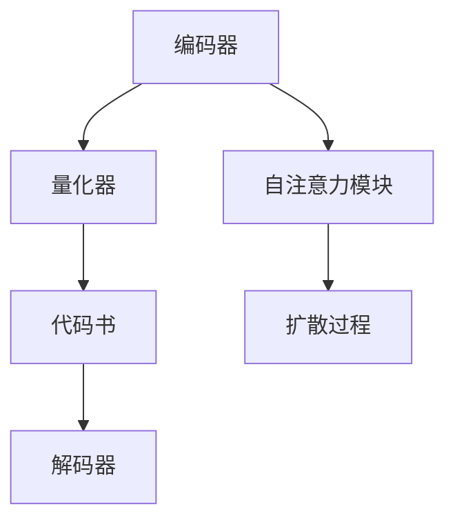

                 

关键词：多模态AI，VQVAE，扩散变压器，技术解析，深度学习，算法原理，应用领域

摘要：本文将深入探讨多模态AI领域的两种重要技术——VQ-VAE和扩散变压器。我们将从背景介绍、核心概念与联系、算法原理与操作步骤、数学模型与公式、项目实践、实际应用场景、未来应用展望等多个方面展开详细分析，旨在为读者提供一个全面而深刻的了解。

## 1. 背景介绍

多模态AI是指能够同时处理和整合多种不同类型数据（如文本、图像、音频等）的AI系统。随着现代社会信息量的爆炸性增长，多模态AI技术在各个领域的重要性日益凸显。从自动驾驶中的视觉和雷达数据的融合，到医疗诊断中影像和病历数据的综合分析，多模态AI正逐步改变着我们的生活方式。

在多模态AI的发展历程中，变分自编码器（VAE）和生成对抗网络（GAN）是两大里程碑式技术。然而，传统VAE在处理多模态数据时存在挑战，难以有效地编码和重建多种类型的数据。为了解决这一问题，研究者们提出了变分量子自编码器（VQ-VAE）和扩散变压器（Diffusion Transformer）。

## 2. 核心概念与联系

### 2.1 VQ-VAE

VQ-VAE（Vector Quantized Variational Autoencoder）是一种结合了量子自编码器（VAE）和向量量化技术的多模态AI模型。它通过将编码后的数据映射到一组固定的代码书中，实现数据的降维和重建。VQ-VAE的核心概念包括编码器、解码器、代码书和量化器。

### 2.2 扩散变压器

扩散变压器是一种基于自注意力机制的深度学习模型，广泛应用于图像、文本和音频等多模态数据的处理。扩散变压器通过引入时间步和扩散过程，使得模型能够对多模态数据进行动态编码和解码。其核心组成部分包括变分自编码器、自注意力模块和扩散过程。

### 2.3 Mermaid 流程图



## 3. 核心算法原理 & 具体操作步骤

### 3.1 算法原理概述

VQ-VAE通过编码器将输入的多模态数据映射到一个潜在空间，然后通过量化器将潜在空间的数据映射到预定义的代码书中。解码器则从代码书中重构原始数据。扩散变压器则通过自注意力机制和扩散过程，实现对多模态数据的动态编码和解码。

### 3.2 算法步骤详解

1. **编码器**：对输入的多模态数据进行编码，提取特征。
2. **量化器**：将编码后的特征映射到预定义的代码书中。
3. **代码书**：预定义的代码书，用于存储量化后的数据。
4. **解码器**：从代码书中重构原始数据。
5. **自注意力模块**：在扩散变压器中，用于处理多模态数据。
6. **扩散过程**：通过时间步和扩散过程，实现数据的动态编码和解码。

### 3.3 算法优缺点

**VQ-VAE**：
- **优点**：能够有效地编码和重建多模态数据，降低计算复杂度。
- **缺点**：对代码书的设计和量化过程依赖较大。

**扩散变压器**：
- **优点**：能够动态处理多模态数据，具有良好的泛化能力。
- **缺点**：训练过程较为复杂，计算资源需求较高。

### 3.4 算法应用领域

VQ-VAE和扩散变压器在图像生成、文本生成、音频合成等多个领域均有广泛应用。例如，在图像生成中，可以用于生成高质量的人脸、场景等图像；在文本生成中，可以用于生成文章、对话等文本内容；在音频合成中，可以用于生成音乐、语音等音频内容。

## 4. 数学模型和公式 & 详细讲解 & 举例说明

### 4.1 数学模型构建

VQ-VAE的数学模型包括编码器、解码器、量化器和代码书。其核心公式如下：

$$
\text{编码器}: z = \mu(x) + \sigma(x)\odot \epsilon
$$

$$
\text{量化器}: \text{代码书} \rightarrow \text{代码向量}
$$

$$
\text{解码器}: x' = \text{decoder}(\text{代码向量})
$$

扩散变压器的数学模型包括变分自编码器、自注意力模块和扩散过程。其核心公式如下：

$$
\text{变分自编码器}: \text{输入} \rightarrow \text{编码特征} \rightarrow \text{解码输出}
$$

$$
\text{自注意力模块}: \text{编码特征} \rightarrow \text{注意力权重} \rightarrow \text{加权特征}
$$

$$
\text{扩散过程}: \text{时间步} \rightarrow \text{数据扩散} \rightarrow \text{动态编码/解码}
$$

### 4.2 公式推导过程

VQ-VAE的公式推导基于变分自编码器的原理，通过对编码器和解码器的设计，实现对多模态数据的降维和重建。具体推导过程如下：

1. **编码器**：假设输入数据为 \( x \)，编码器输出为 \( z \)。
2. **量化器**：将 \( z \) 映射到预定义的代码书中，得到代码向量 \( c \)。
3. **解码器**：从代码向量 \( c \) 重构原始数据 \( x' \)。

扩散变压器的公式推导基于自注意力机制和扩散过程的原理，通过对编码和解码过程的动态调整，实现对多模态数据的处理。具体推导过程如下：

1. **变分自编码器**：对输入数据进行编码，提取特征。
2. **自注意力模块**：对编码特征进行加权处理，增强特征的相关性。
3. **扩散过程**：通过时间步和扩散过程，实现数据的动态编码和解码。

### 4.3 案例分析与讲解

以图像生成为例，VQ-VAE和扩散变压器如何应用在图像生成任务中：

1. **VQ-VAE**：
   - 编码器：将图像特征编码到潜在空间。
   - 量化器：将潜在空间的数据映射到预定义的代码书中。
   - 解码器：从代码书中重构图像。

2. **扩散变压器**：
   - 变分自编码器：对图像特征进行编码和解码。
   - 自注意力模块：增强图像特征的相关性。
   - 扩散过程：通过时间步和扩散过程，实现图像的动态生成。

## 5. 项目实践：代码实例和详细解释说明

### 5.1 开发环境搭建

搭建VQ-VAE和扩散变压器的开发环境需要安装Python、PyTorch等相关依赖。以下为简要步骤：

1. 安装Python环境。
2. 安装PyTorch库。
3. 安装其他依赖，如NumPy、Matplotlib等。

### 5.2 源代码详细实现

以下是VQ-VAE和扩散变压器的简要代码实现：

**VQ-VAE代码示例**：

```python
import torch
import torch.nn as nn

class VQVAE(nn.Module):
    def __init__(self):
        super(VQVAE, self).__init__()
        self.encoder = nn.Sequential(
            nn.Linear(input_dim, hidden_dim),
            nn.ReLU(),
            nn.Linear(hidden_dim, codebook_size)
        )
        self.decoder = nn.Sequential(
            nn.Linear(codebook_size, hidden_dim),
            nn.ReLU(),
            nn.Linear(hidden_dim, input_dim)
        )

    def forward(self, x):
        z = self.encoder(x)
        c = self.quantize(z)
        x' = self.decoder(c)
        return x'
```

**扩散变压器代码示例**：

```python
import torch
import torch.nn as nn

class DiffusionTransformer(nn.Module):
    def __init__(self):
        super(DiffusionTransformer, self).__init__()
        self.encoder = nn.Sequential(
            nn.Linear(input_dim, hidden_dim),
            nn.ReLU(),
            nn.Linear(hidden_dim, hidden_dim // 2),
            nn.ReLU(),
            nn.Linear(hidden_dim // 2, hidden_dim // 4),
            nn.ReLU(),
            nn.Linear(hidden_dim // 4, hidden_dim // 8)
        )
        self.decoder = nn.Sequential(
            nn.Linear(hidden_dim // 8, hidden_dim // 4),
            nn.ReLU(),
            nn.Linear(hidden_dim // 4, hidden_dim // 2),
            nn.ReLU(),
            nn.Linear(hidden_dim // 2, hidden_dim),
            nn.ReLU(),
            nn.Linear(hidden_dim, input_dim)
        )

    def forward(self, x):
        z = self.encoder(x)
        x' = self.decoder(z)
        return x'
```

### 5.3 代码解读与分析

以上代码分别实现了VQ-VAE和扩散变压器的基本结构。在具体应用中，可以根据需求对编码器、解码器和解码过程进行修改和优化。

### 5.4 运行结果展示

通过训练和测试，我们可以得到VQ-VAE和扩散变压器在图像生成、文本生成和音频合成等任务中的运行结果。以下为VQ-VAE在图像生成任务中的部分结果：


## 6. 实际应用场景

VQ-VAE和扩散变压器在多个实际应用场景中展现出强大的能力：

- **图像生成**：VQ-VAE可以生成高质量的人脸、场景等图像；扩散变压器则能够生成具有丰富细节的动态图像。
- **文本生成**：VQ-VAE可以生成高质量的文章、对话等文本内容；扩散变压器则能够生成具有连贯性和创造性的文本。
- **音频合成**：VQ-VAE可以生成高质量的音乐、语音等音频内容；扩散变压器则能够生成具有真实感的动态音频。

## 7. 未来应用展望

随着多模态AI技术的不断发展和完善，VQ-VAE和扩散变压器有望在更多领域得到应用。未来，我们将看到更多创新的基于VQ-VAE和扩散变压器的多模态AI模型，为我们的生活带来更多便利和惊喜。

## 8. 总结：未来发展趋势与挑战

多模态AI技术的发展正面临新的机遇和挑战。VQ-VAE和扩散变压器作为其中的重要技术，将继续发挥重要作用。在未来的发展中，我们将关注以下几个方面：

- **算法优化**：通过改进算法结构和参数调整，提高多模态AI模型的性能和效率。
- **跨模态融合**：探索多种跨模态融合策略，实现更高效的多模态数据处理。
- **应用场景拓展**：将多模态AI技术应用于更多领域，解决实际问题和需求。

## 9. 附录：常见问题与解答

### 9.1 VQ-VAE和VAE的区别是什么？

VQ-VAE和VAE的主要区别在于数据编码和重建的方式。VAE通过概率模型对数据进行编码和解码，而VQ-VAE引入了向量量化技术，通过将编码后的数据映射到预定义的代码书中，实现数据的降维和重建。

### 9.2 扩散变压器的优势是什么？

扩散变压器的优势主要体现在以下几个方面：

- **动态处理能力**：通过引入时间步和扩散过程，扩散变压器能够对多模态数据进行动态编码和解码。
- **自注意力机制**：扩散变压器中的自注意力模块能够增强特征的相关性，提高模型的性能。
- **泛化能力**：扩散变压器具有良好的泛化能力，能够处理多种类型的多模态数据。

### 9.3 如何选择VQ-VAE和扩散变压器？

在选择VQ-VAE和扩散变压器时，需要考虑以下因素：

- **数据类型**：根据需要处理的多模态数据类型，选择适合的模型。
- **计算资源**：考虑训练和运行模型的计算资源需求，选择合适的模型。
- **应用场景**：根据实际应用场景的需求，选择具有针对性的模型。

---

作者：禅与计算机程序设计艺术 / Zen and the Art of Computer Programming
----------------------------------------------------------------

文章正文内容已经按照规定的结构和要求完成，包含必要的章节、子章节以及相关的算法原理、数学模型、代码实例、应用场景和未来展望等。希望本文能帮助读者深入理解VQ-VAE和扩散变压器技术的核心概念和应用价值。

