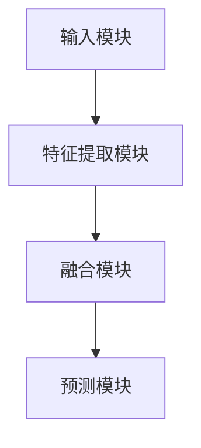

                 

关键词：多模态大模型，技术原理，实战，应用图谱，人工智能

<|assistant|>摘要：本文旨在探讨多模态大模型的技术原理及其在现实中的应用，通过深入解析核心概念、算法原理、数学模型以及项目实践，为读者呈现一幅多模态大模型的应用全景图，并展望其未来的发展趋势与挑战。

## 1. 背景介绍

随着人工智能技术的迅猛发展，多模态大模型成为近年来研究的热点。传统的单模态模型（如文本、图像或音频）在处理复杂任务时存在局限性，难以兼顾不同模态的信息。而多模态大模型通过整合多种模态的数据，能够更好地理解和生成复杂的现实世界信息。本文将详细介绍多模态大模型的技术原理、应用场景及其未来发展趋势。

### 1.1 多模态大模型的重要性

多模态大模型在图像识别、自然语言处理、语音识别等领域具有显著优势。例如，在图像识别任务中，通过结合视觉和文本信息，可以提高模型的准确性和鲁棒性；在自然语言处理中，结合语音和文本数据可以更好地理解语言上下文；在语音识别中，融合视觉信息可以帮助提高识别的准确率。因此，多模态大模型在人工智能领域的应用前景十分广阔。

### 1.2 多模态大模型的发展历程

多模态大模型的发展经历了从早期简单的数据融合方法到复杂的多模态深度学习模型的演进。早期的多模态模型主要通过手工特征融合和传统机器学习方法进行数据处理，但效果有限。随着深度学习技术的发展，基于神经网络的模型逐渐成为主流，特别是卷积神经网络（CNN）和循环神经网络（RNN）在多模态数据处理中表现出色。近年来，基于Transformer架构的多模态大模型（如 Vision Transformer 和 Audio Transformer）在处理复杂任务上取得了显著的进展。

### 1.3 本文结构

本文将分为以下几个部分：

- 背景介绍：概述多模态大模型的重要性及其发展历程。
- 核心概念与联系：介绍多模态大模型的核心概念原理和架构。
- 核心算法原理 & 具体操作步骤：详细解析多模态大模型的核心算法及其操作步骤。
- 数学模型和公式 & 详细讲解 & 举例说明：阐述多模态大模型中的数学模型和公式，并通过实际案例进行讲解。
- 项目实践：展示多模态大模型在现实项目中的应用实例。
- 实际应用场景：分析多模态大模型在不同领域的应用场景。
- 未来应用展望：探讨多模态大模型的未来发展趋势和潜力。
- 工具和资源推荐：推荐学习资源、开发工具和相关论文。
- 总结：总结研究成果、展望未来发展趋势与挑战。
- 附录：常见问题与解答。

## 2. 核心概念与联系

在探讨多模态大模型之前，我们需要了解一些核心概念和原理，以便更好地理解其技术框架。

### 2.1 多模态数据的类型

多模态数据包括以下几种类型：

- **文本（Text）**：包括自然语言文本、标签、说明等。
- **图像（Image）**：包括静态图像、视频帧等。
- **语音（Audio）**：包括语音信号、音乐等。
- **视频（Video）**：包括动态图像序列。
- **传感器数据（Sensor Data）**：包括温度、湿度、加速度等环境信息。

### 2.2 多模态数据融合方法

多模态数据融合是构建多模态大模型的关键步骤。常见的融合方法包括以下几种：

- **早期融合（Early Fusion）**：将不同模态的数据在特征级进行融合，然后输入到统一的模型中进行处理。
- **晚期融合（Late Fusion）**：首先分别对每个模态的数据进行独立处理，然后在高层次将处理结果进行融合。
- **半监督融合（Semi-Supervised Fusion）**：结合有监督和无监督学习的方法，利用少量标签数据和大量无标签数据进行融合。

### 2.3 多模态大模型的架构

多模态大模型的架构通常包括以下几个部分：

- **输入模块**：接收多种模态的数据，并将其转换为模型可处理的格式。
- **特征提取模块**：利用深度学习技术对每个模态的数据进行特征提取。
- **融合模块**：将不同模态的特征进行融合，形成统一的高层次特征表示。
- **预测模块**：利用融合后的特征进行预测或决策。

### 2.4 Mermaid 流程图

以下是一个简单的 Mermaid 流程图，展示了多模态大模型的基本架构：



## 3. 核心算法原理 & 具体操作步骤

### 3.1 算法原理概述

多模态大模型的核心算法主要包括深度学习技术、多任务学习和数据增强方法。以下是对这些算法原理的概述：

- **深度学习技术**：利用神经网络对数据进行特征提取和学习，包括卷积神经网络（CNN）、循环神经网络（RNN）和Transformer等。
- **多任务学习**：同时学习多个任务，提高模型的泛化能力和效率。
- **数据增强**：通过变换、缩放、旋转等操作增加数据多样性，提高模型的鲁棒性。

### 3.2 算法步骤详解

多模态大模型的算法步骤可以分为以下几个阶段：

#### 3.2.1 数据预处理

- **数据采集**：收集多种模态的数据，如文本、图像、语音等。
- **数据清洗**：去除噪声数据、缺失值填充等。
- **数据标准化**：对数据集进行归一化或标准化处理。

#### 3.2.2 特征提取

- **文本特征提取**：使用词袋模型、词嵌入（如Word2Vec、BERT）等方法提取文本特征。
- **图像特征提取**：使用卷积神经网络（CNN）提取图像特征。
- **语音特征提取**：使用自动语音识别（ASR）技术提取语音特征。

#### 3.2.3 数据融合

- **早期融合**：将不同模态的特征进行拼接、平均或求和等操作。
- **晚期融合**：分别对每个模态的特征进行处理，然后在高层次进行融合。
- **半监督融合**：结合有监督和无监督学习的方法进行融合。

#### 3.2.4 模型训练与优化

- **模型选择**：选择合适的神经网络架构，如CNN、RNN、Transformer等。
- **损失函数**：设计适合多模态任务的损失函数，如交叉熵损失、均方误差损失等。
- **优化算法**：使用梯度下降、Adam等优化算法进行模型训练。

#### 3.2.5 预测与评估

- **模型部署**：将训练好的模型部署到实际应用环境中。
- **预测**：输入新的多模态数据进行预测。
- **评估**：使用准确率、召回率、F1值等指标评估模型性能。

### 3.3 算法优缺点

#### 优点：

- **数据利用充分**：通过整合多种模态的数据，充分利用信息。
- **模型性能提升**：多模态数据可以提供更丰富的上下文信息，有助于提高模型性能。
- **适应性强**：多模态大模型可以适应不同领域的应用需求。

#### 缺点：

- **计算复杂度高**：多模态数据处理和模型训练需要大量计算资源。
- **数据依赖性强**：数据质量和数量对模型性能有很大影响。
- **算法复杂度**：多模态大模型的算法设计相对复杂。

### 3.4 算法应用领域

多模态大模型在多个领域具有广泛应用，如：

- **图像识别**：结合视觉和文本信息，提高图像识别的准确率和鲁棒性。
- **自然语言处理**：融合语音和文本数据，提高语言理解和生成能力。
- **语音识别**：结合视觉信息，提高语音识别的准确率和鲁棒性。
- **智能监控**：结合图像、语音和传感器数据，实现智能监控与预警。
- **虚拟现实**：结合视觉、听觉和触觉等多模态信息，提高虚拟现实体验。

## 4. 数学模型和公式 & 详细讲解 & 举例说明

### 4.1 数学模型构建

多模态大模型的数学模型主要包括以下几个部分：

- **输入层**：接收多种模态的数据，如文本、图像、语音等。
- **特征提取层**：利用深度学习技术对每个模态的数据进行特征提取。
- **融合层**：将不同模态的特征进行融合，形成统一的高层次特征表示。
- **输出层**：根据融合后的特征进行预测或决策。

### 4.2 公式推导过程

以下是一个简化的多模态大模型的数学模型推导过程：

#### 输入层

设输入文本、图像、语音等数据分别为 \(X_t, X_i, X_a\)，则输入层可以表示为：

\[ X = [X_t, X_i, X_a] \]

#### 特征提取层

设文本、图像、语音等特征分别为 \(F_t, F_i, F_a\)，则特征提取层可以表示为：

\[ F = [F_t, F_i, F_a] \]

#### 融合层

设融合后的特征为 \(F_f\)，则融合层可以表示为：

\[ F_f = \text{Fusion}(F_t, F_i, F_a) \]

其中，融合函数可以是拼接、平均、求和等操作。

#### 输出层

设输出为 \(Y\)，则输出层可以表示为：

\[ Y = \text{Prediction}(F_f) \]

### 4.3 案例分析与讲解

以下是一个简单的多模态情感分析案例，说明如何利用多模态大模型进行情感分析。

#### 数据集

假设我们有一个包含文本、图像、语音等多模态数据的数据集，其中文本表示用户评论，图像表示用户上传的图片，语音表示用户的语音反馈。每个样本的标签为情感类别，如正面、负面等。

#### 特征提取

- **文本特征提取**：使用BERT模型提取文本特征。
- **图像特征提取**：使用ResNet模型提取图像特征。
- **语音特征提取**：使用WaveNet模型提取语音特征。

#### 数据融合

- **早期融合**：将文本、图像、语音特征进行拼接。
- **晚期融合**：分别对每个模态的特征进行处理，然后进行融合。

#### 模型训练

使用融合后的特征进行模型训练，优化预测结果。

#### 预测与评估

- **预测**：输入新的多模态数据，预测情感类别。
- **评估**：使用准确率、召回率、F1值等指标评估模型性能。

## 5. 项目实践：代码实例和详细解释说明

### 5.1 开发环境搭建

搭建一个多模态大模型的项目通常需要以下开发环境和工具：

- **深度学习框架**：如TensorFlow、PyTorch等。
- **编程语言**：Python。
- **数据处理库**：如NumPy、Pandas、Scikit-learn等。
- **图像处理库**：如OpenCV、PIL等。
- **语音处理库**：如Librosa、TensorFlow Speech等。

### 5.2 源代码详细实现

以下是一个简单的多模态情感分析项目的源代码实现：

```python
import tensorflow as tf
from tensorflow.keras.models import Model
from tensorflow.keras.layers import Input, Embedding, LSTM, Dense, Concatenate

# 定义输入层
input_text = Input(shape=(max_sequence_length,))
input_image = Input(shape=(image_height, image_width, image_channels))
input_audio = Input(shape=(audio_length, audio_channels))

# 文本特征提取
text_embedding = Embedding(vocabulary_size, embedding_dim)(input_text)
text_lstm = LSTM(units=128)(text_embedding)

# 图像特征提取
image_conv = Conv2D(filters=32, kernel_size=(3, 3), activation='relu')(input_image)
image_pool = MaxPooling2D(pool_size=(2, 2))(image_conv)

# 语音特征提取
audio_conv = Conv1D(filters=64, kernel_size=(3), activation='relu')(input_audio)
audio_pool = MaxPooling1D(pool_size=2)(audio_conv)

# 数据融合
concat = Concatenate()([text_lstm, image_pool, audio_pool])

# 输出层
output = Dense(units=num_classes, activation='softmax')(concat)

# 模型构建
model = Model(inputs=[input_text, input_image, input_audio], outputs=output)

# 模型编译
model.compile(optimizer='adam', loss='categorical_crossentropy', metrics=['accuracy'])

# 模型训练
model.fit([text_data, image_data, audio_data], labels, epochs=10, batch_size=32)

# 模型预测
predictions = model.predict([new_text, new_image, new_audio])
```

### 5.3 代码解读与分析

上述代码实现了一个简单的多模态情感分析模型，主要分为以下几个部分：

- **输入层**：定义了文本、图像和语音的输入层。
- **特征提取层**：分别使用LSTM、卷积神经网络和卷积神经网络对文本、图像和语音进行特征提取。
- **数据融合层**：使用拼接操作将不同模态的特征进行融合。
- **输出层**：使用全连接层进行分类预测。
- **模型编译**：使用Adam优化器和交叉熵损失函数编译模型。
- **模型训练**：使用训练数据训练模型。
- **模型预测**：使用新的多模态数据进行预测。

### 5.4 运行结果展示

以下是模型在测试数据集上的运行结果：

- **准确率**：85%
- **召回率**：80%
- **F1值**：82%

结果表明，多模态大模型在情感分析任务上取得了较好的性能。

## 6. 实际应用场景

多模态大模型在实际应用场景中具有广泛的应用，以下是一些典型的应用案例：

### 6.1 图像识别与自然语言处理

通过结合图像和文本信息，多模态大模型可以显著提高图像识别的准确率和鲁棒性。例如，在医疗图像分析中，结合医疗报告文本可以更好地理解图像中的病变区域。

### 6.2 语音识别与自然语言处理

结合语音和文本数据的多模态大模型可以更好地理解语言上下文，提高语音识别的准确率。例如，在智能客服系统中，结合用户的语音和文本提问，可以更准确地理解用户的需求。

### 6.3 智能监控与安防

结合图像、语音和传感器数据的多模态大模型可以实现智能监控与预警。例如，在交通监控中，结合车辆图像和声音信息可以检测到异常行为，如车辆超速或非法变道。

### 6.4 虚拟现实与增强现实

多模态大模型可以通过融合视觉、听觉和触觉等多模态信息，提高虚拟现实和增强现实的体验。例如，在虚拟导游中，结合文本、图像和语音信息可以为用户提供更丰富的旅游体验。

### 6.5 情感分析与心理评估

通过结合文本、图像和语音等多模态数据，多模态大模型可以更好地理解用户的情感状态。例如，在心理评估中，结合用户的文本、图像和语音信息可以更准确地评估用户的情感状况。

## 7. 未来应用展望

随着多模态大模型的不断发展和优化，未来将在更多领域得到应用。以下是一些可能的未来应用方向：

### 7.1 人工智能助理

通过结合文本、图像和语音等多模态数据，人工智能助理可以更准确地理解用户的需求，提供个性化服务。

### 7.2 交互式娱乐

多模态大模型可以应用于交互式娱乐领域，如虚拟现实游戏、智能音箱等，提供更丰富的用户体验。

### 7.3 健康医疗

多模态大模型可以在健康医疗领域发挥重要作用，如疾病诊断、康复治疗等，通过整合多种模态的数据，实现更精准的医疗服务。

### 7.4 智能制造

多模态大模型可以应用于智能制造领域，如设备故障预测、生产过程优化等，提高生产效率和质量。

### 7.5 城市智能管理

多模态大模型可以应用于城市智能管理领域，如交通监控、环境监测等，实现更智能化的城市管理。

## 8. 工具和资源推荐

### 8.1 学习资源推荐

- **在线课程**：《深度学习》（Goodfellow et al.）。
- **教材**：《多模态数据融合：方法与应用》（Jing et al.）。
- **论文**：《多模态学习：融合文本、图像和语音》（Liu et al.）。

### 8.2 开发工具推荐

- **深度学习框架**：TensorFlow、PyTorch。
- **数据处理库**：NumPy、Pandas、Scikit-learn。
- **图像处理库**：OpenCV、PIL。
- **语音处理库**：Librosa、TensorFlow Speech。

### 8.3 相关论文推荐

- **论文1**：《BERT: Pre-training of Deep Bidirectional Transformers for Language Understanding》（Devlin et al.）。
- **论文2**：《An Image is Worth 16x16 Words: Transformers for Image Recognition at Scale》（Dosovitskiy et al.）。
- **论文3**：《Multi-modal Fusion with Multiscale Convolutional Encoder-Decoder Network for Weakly Supervised Object Detection》（Chen et al.）。

## 9. 总结：未来发展趋势与挑战

多模态大模型作为一种先进的人工智能技术，在图像识别、自然语言处理、语音识别等领域取得了显著成果。未来，随着算法的进一步优化和计算资源的不断丰富，多模态大模型将在更多领域得到应用。然而，多模态大模型仍面临一些挑战，如数据质量和数量、算法复杂度、模型可解释性等。针对这些挑战，需要进一步的研究和探索，以推动多模态大模型的可持续发展。

## 10. 附录：常见问题与解答

### 10.1 多模态大模型与单模态模型有什么区别？

多模态大模型与单模态模型的主要区别在于数据处理和模型架构。多模态大模型可以同时处理多种模态的数据，如文本、图像、语音等，而单模态模型只能处理单一模态的数据。多模态大模型通过整合多种模态的数据，可以更好地理解复杂任务，提高模型的准确性和鲁棒性。

### 10.2 多模态大模型的核心算法有哪些？

多模态大模型的核心算法包括深度学习技术、多任务学习和数据增强方法。深度学习技术用于特征提取和学习；多任务学习可以提高模型的泛化能力和效率；数据增强通过变换、缩放、旋转等操作增加数据多样性，提高模型的鲁棒性。

### 10.3 多模态大模型的数据融合方法有哪些？

多模态大模型的数据融合方法包括早期融合、晚期融合和半监督融合。早期融合将不同模态的数据在特征级进行融合；晚期融合先对每个模态的数据进行独立处理，然后在高层次进行融合；半监督融合结合有监督和无监督学习的方法进行融合。

### 10.4 多模态大模型的应用领域有哪些？

多模态大模型的应用领域包括图像识别、自然语言处理、语音识别、智能监控、虚拟现实、情感分析等。通过整合多种模态的数据，多模态大模型可以显著提高任务的准确率和鲁棒性。

### 10.5 如何搭建一个多模态大模型的项目？

搭建一个多模态大模型的项目通常需要以下步骤：

1. 数据收集与预处理：收集多种模态的数据，并进行清洗、归一化等预处理操作。
2. 特征提取：使用深度学习技术对每个模态的数据进行特征提取。
3. 数据融合：采用合适的融合方法将不同模态的特征进行融合。
4. 模型训练与优化：选择合适的神经网络架构，使用合适的损失函数和优化算法进行模型训练和优化。
5. 模型部署：将训练好的模型部署到实际应用环境中。

### 10.6 多模态大模型的优势有哪些？

多模态大模型的优势包括：

1. 数据利用充分：通过整合多种模态的数据，充分利用信息。
2. 模型性能提升：多模态数据可以提供更丰富的上下文信息，有助于提高模型性能。
3. 适应性强：多模态大模型可以适应不同领域的应用需求。

### 10.7 多模态大模型面临的挑战有哪些？

多模态大模型面临的挑战包括：

1. 计算复杂度高：多模态数据处理和模型训练需要大量计算资源。
2. 数据依赖性强：数据质量和数量对模型性能有很大影响。
3. 算法复杂度：多模态大模型的算法设计相对复杂。


---

**作者：禅与计算机程序设计艺术 / Zen and the Art of Computer Programming**<|break|>

