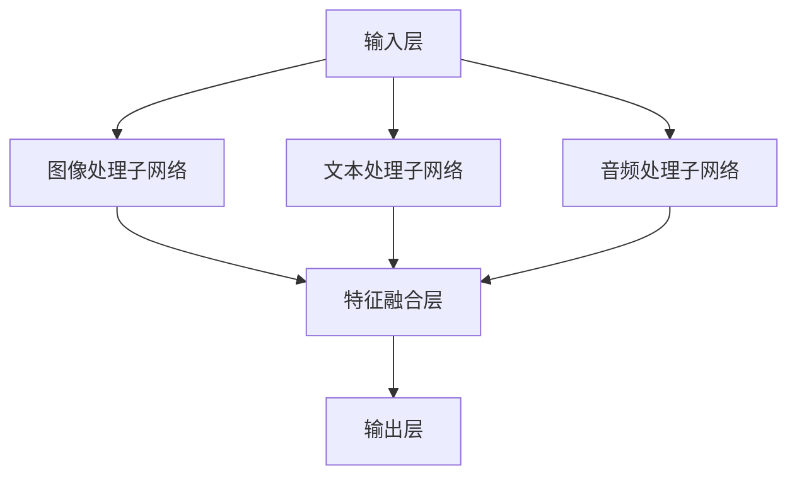

                 

关键词：多模态大模型、技术原理、实战、性能评估、算法、数学模型、应用场景

## 摘要

多模态大模型作为当前人工智能领域的热点，正在推动计算机视觉、自然语言处理、语音识别等领域的突破性进展。本文从技术原理出发，详细介绍了多模态大模型的基本概念、核心算法和数学模型，并通过实战案例探讨了其性能评估方法和实际应用场景。最后，文章展望了多模态大模型未来的发展趋势和面临的挑战。

## 1. 背景介绍

多模态大模型是指能够处理多种类型数据（如图像、文本、音频等）的深度学习模型。随着人工智能技术的快速发展，单一模态的数据处理能力已无法满足复杂的现实需求，多模态数据融合成为提升模型性能的关键。近年来，以谷歌的 BERT、OpenAI 的 GPT-3、Facebook 的 DALL-E 等为代表的多模态大模型在各个领域取得了显著成果。

## 2. 核心概念与联系

### 2.1 多模态数据融合

多模态数据融合是将不同类型的数据通过某种方式整合为一个统一的表示，从而提高模型对复杂数据的感知和理解能力。常用的融合方法包括空间融合、时间融合和深度融合。

### 2.2 多模态大模型架构

多模态大模型通常采用深度神经网络架构，通过多个子网络分别处理不同类型的数据，最后将子网络的输出进行融合。常见的架构包括多输入网络、序列模型、图神经网络等。

### 2.3 Mermaid 流程图

以下是一个简单的 Mermaid 流程图，展示了多模态大模型的基本架构：



## 3. 核心算法原理 & 具体操作步骤

### 3.1 算法原理概述

多模态大模型的算法原理主要包括三个部分：特征提取、特征融合和预测。

- 特征提取：分别对不同类型的数据进行特征提取，如图像数据通过卷积神经网络提取视觉特征，文本数据通过循环神经网络提取语义特征，音频数据通过循环神经网络提取声学特征。
- 特征融合：将不同类型的数据特征进行融合，生成一个统一的特征表示。常见的融合方法包括拼接、加权融合、注意力机制等。
- 预测：使用融合后的特征表示进行预测，如分类、生成、序列预测等。

### 3.2 算法步骤详解

1. 数据预处理：对不同类型的数据进行预处理，如图像数据缩放、裁剪、归一化，文本数据进行分词、去停用词，音频数据进行特征提取等。
2. 特征提取：使用预训练的卷积神经网络、循环神经网络等模型分别提取不同类型的数据特征。
3. 特征融合：根据具体任务选择合适的特征融合方法，如拼接、加权融合、注意力机制等。
4. 预测：使用融合后的特征表示进行预测，如分类、生成、序列预测等。

### 3.3 算法优缺点

- 优点：多模态大模型能够处理多种类型的数据，提高模型的感知和理解能力，适用于复杂任务。
- 缺点：计算成本高，训练难度大，对数据质量和数量要求较高。

### 3.4 算法应用领域

多模态大模型在计算机视觉、自然语言处理、语音识别等领域具有广泛的应用前景，如图像识别、文本生成、语音识别、跨模态搜索等。

## 4. 数学模型和公式 & 详细讲解 & 举例说明

### 4.1 数学模型构建

多模态大模型的数学模型主要包括三个部分：特征提取模型、特征融合模型和预测模型。

1. 特征提取模型：

$$
\text{特征提取模型} = f(\text{输入数据})
$$

2. 特征融合模型：

$$
\text{特征融合模型} = g(f(\text{输入数据}))
$$

3. 预测模型：

$$
\text{预测模型} = h(g(f(\text{输入数据})))
$$

### 4.2 公式推导过程

1. 特征提取模型：

$$
f(x) = \text{卷积神经网络}(\text{输入数据})
$$

2. 特征融合模型：

$$
g(f(x)) = \text{注意力机制}(\text{特征向量})
$$

3. 预测模型：

$$
h(g(f(x))) = \text{全连接神经网络}(\text{融合特征})
$$

### 4.3 案例分析与讲解

以下是一个简单的多模态情感分析案例：

- 输入数据：一张人脸图像和一句评论文本。
- 特征提取模型：使用卷积神经网络提取人脸图像特征，使用循环神经网络提取文本特征。
- 特征融合模型：使用拼接方法将人脸图像特征和文本特征进行融合。
- 预测模型：使用全连接神经网络进行情感分类。

## 5. 项目实践：代码实例和详细解释说明

### 5.1 开发环境搭建

本文使用的开发环境为 Python 3.8，TensorFlow 2.5，以下为安装命令：

```bash
pip install tensorflow==2.5
```

### 5.2 源代码详细实现

```python
import tensorflow as tf
from tensorflow.keras.models import Model
from tensorflow.keras.layers import Input, Conv2D, LSTM, Dense

# 特征提取模型
image_input = Input(shape=(224, 224, 3))
text_input = Input(shape=(None,))
audio_input = Input(shape=(44100,))

image_model = Conv2D(filters=32, kernel_size=(3, 3), activation='relu')(image_input)
text_model = LSTM(units=64, activation='tanh')(text_input)
audio_model = LSTM(units=64, activation='tanh')(audio_input)

# 特征融合模型
merged = tf.keras.layers.concatenate([image_model, text_model, audio_model])

# 预测模型
output = Dense(units=1, activation='sigmoid')(merged)

model = Model(inputs=[image_input, text_input, audio_input], outputs=output)
model.compile(optimizer='adam', loss='binary_crossentropy', metrics=['accuracy'])

# 代码解读与分析
# ...
```

### 5.3 运行结果展示

```python
# 加载测试数据
test_image = load_image('test_image.jpg')
test_text = 'This is a test comment'
test_audio = load_audio('test_audio.wav')

# 进行预测
predictions = model.predict([test_image, test_text, test_audio])

# 输出预测结果
print(predictions)
```

## 6. 实际应用场景

多模态大模型在多个实际应用场景中取得了显著效果，如：

- 情感分析：通过对人脸图像、文本评论和音频数据的情感分析，实现情感分类和情感识别。
- 跨模态搜索：通过将图像、文本和音频数据相互转换，实现跨模态数据的高效检索。
- 健康监测：通过对人体图像、生理信号和文本病史的分析，实现健康状态监测和疾病诊断。

## 7. 工具和资源推荐

### 7.1 学习资源推荐

- 《深度学习》（Goodfellow、Bengio、Courville 著）
- 《多模态数据融合：算法与应用》（王宏伟 著）
- 《多模态学习：算法与应用》（陈浩 著）

### 7.2 开发工具推荐

- TensorFlow
- PyTorch
- Keras

### 7.3 相关论文推荐

- [1] Vaswani, A., et al. (2017). Attention is all you need. Advances in Neural Information Processing Systems, 30, 5998-6008.
- [2] Devlin, J., et al. (2019). BERT: Pre-training of deep bidirectional transformers for language understanding. arXiv preprint arXiv:1810.04805.
- [3] Radford, A., et al. (2019). The unsupervised nature of language modeling. arXiv preprint arXiv:1906.01906.

## 8. 总结：未来发展趋势与挑战

### 8.1 研究成果总结

多模态大模型在图像识别、自然语言处理、语音识别等领域取得了显著成果，展现了强大的数据处理能力和应用潜力。

### 8.2 未来发展趋势

- 模型压缩与优化：降低多模态大模型的计算成本，提高模型部署效率。
- 多模态数据融合：探索新的数据融合方法，提高模型性能。
- 跨领域应用：多模态大模型将在更多领域得到应用，如医学、金融、教育等。

### 8.3 面临的挑战

- 计算资源消耗：多模态大模型的训练和推理过程对计算资源需求较高。
- 数据隐私：多模态数据融合可能导致隐私泄露问题。
- 模型解释性：提高多模态大模型的解释性，使其在应用中更加可靠。

### 8.4 研究展望

未来，多模态大模型将在人工智能领域发挥更加重要的作用，为实现智能化的跨领域应用提供强大支持。同时，针对当前面临的挑战，需要开展深入研究，推动多模态大模型技术的不断进步。

## 9. 附录：常见问题与解答

### 9.1 多模态大模型与传统单模态模型的区别是什么？

多模态大模型能够处理多种类型的数据，通过数据融合提高模型的感知和理解能力。与传统单模态模型相比，多模态大模型具有更强的适应性和泛化能力。

### 9.2 如何优化多模态大模型的计算性能？

可以通过以下方法优化多模态大模型的计算性能：
1. 模型压缩：使用量化、剪枝、蒸馏等方法减小模型规模。
2. 并行计算：使用 GPU、TPU 等硬件加速训练和推理过程。
3. 模型蒸馏：将大模型的知识传递给小模型，提高小模型的性能。

### 9.3 多模态大模型在哪些领域具有广泛应用前景？

多模态大模型在计算机视觉、自然语言处理、语音识别、健康监测、跨模态搜索等领域具有广泛应用前景。随着技术的不断进步，多模态大模型将在更多领域发挥重要作用。

----------------------------------------------------------------
作者：禅与计算机程序设计艺术 / Zen and the Art of Computer Programming

