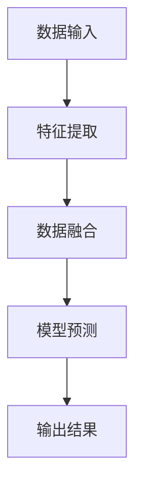

                 

关键词：多模态、大模型、技术原理、实战、化学反应、人工智能

摘要：本文将深入探讨多模态大模型的技术原理及其在实际应用中的价值。我们将详细分析多模态大模型的架构和核心算法，并通过实际项目案例展示其在不同领域的应用，从而为读者提供一个全面的技术指南。

## 1. 背景介绍

多模态大模型（Multimodal Large Models）是近年来人工智能领域的一个重要研究方向。它通过整合多种数据类型，如文本、图像、声音和视频等，实现了更高效的信息处理和理解。随着大数据和深度学习技术的快速发展，多模态大模型在自然语言处理、计算机视觉、语音识别等领域取得了显著的成果。

本文旨在为读者提供一个全面的多模态大模型技术指南，包括其原理、算法、应用和实践。我们将通过详细的讲解和实例分析，帮助读者更好地理解和应用多模态大模型。

## 2. 核心概念与联系

### 2.1 多模态大模型的概念

多模态大模型是指能够同时处理和整合多种数据类型的深度学习模型。这些数据类型通常包括文本、图像、声音和视频等。通过多模态数据的整合，模型能够更全面地理解和处理信息，从而提高其性能和效果。

### 2.2 多模态大模型的架构

多模态大模型的架构通常包括以下几个主要部分：

- **数据输入模块**：负责接收和处理多种类型的数据。
- **特征提取模块**：对输入数据进行特征提取，将不同类型的数据转换为统一的特征表示。
- **融合模块**：将不同类型的数据特征进行融合，形成统一的高层次特征表示。
- **输出模块**：根据融合后的特征进行预测或决策。

### 2.3 多模态大模型的工作原理

多模态大模型的工作原理主要包括以下几个步骤：

1. **数据输入**：模型接收多种类型的数据，如文本、图像、声音和视频等。
2. **特征提取**：使用深度学习算法对输入数据进行特征提取，提取出数据的主要特征。
3. **数据融合**：将不同类型的数据特征进行融合，形成统一的高层次特征表示。
4. **模型预测**：根据融合后的特征进行预测或决策。

### 2.4 Mermaid 流程图

以下是一个简单的Mermaid流程图，展示了多模态大模型的工作流程：



## 3. 核心算法原理 & 具体操作步骤

### 3.1 算法原理概述

多模态大模型的核心算法主要包括深度学习、卷积神经网络（CNN）、循环神经网络（RNN）和注意力机制等。这些算法通过不同方式处理和融合多种类型的数据，从而实现高效的模型预测。

### 3.2 算法步骤详解

多模态大模型的具体操作步骤如下：

1. **数据预处理**：对多种类型的数据进行预处理，包括数据清洗、归一化、标准化等。
2. **特征提取**：使用深度学习算法对预处理后的数据进行特征提取，提取出数据的主要特征。
3. **数据融合**：将不同类型的数据特征进行融合，形成统一的高层次特征表示。
4. **模型训练**：使用融合后的特征进行模型训练，优化模型的参数。
5. **模型预测**：使用训练好的模型进行预测，得到预测结果。

### 3.3 算法优缺点

多模态大模型具有以下优点：

- **高效性**：通过整合多种类型的数据，提高了模型的性能和效果。
- **泛化能力**：能够处理和融合多种类型的数据，具有更强的泛化能力。
- **灵活性**：可以根据不同的应用场景调整和优化模型。

然而，多模态大模型也存在以下缺点：

- **复杂性**：多模态数据融合和处理的复杂性较高，需要较高的计算资源和算法优化。
- **数据依赖性**：模型的性能很大程度上依赖于数据质量和数据量。

### 3.4 算法应用领域

多模态大模型广泛应用于以下领域：

- **自然语言处理**：如机器翻译、文本分类、情感分析等。
- **计算机视觉**：如图像识别、目标检测、图像分割等。
- **语音识别**：如语音识别、语音合成、说话人识别等。
- **多媒体分析**：如视频分类、视频摘要、多媒体搜索等。

## 4. 数学模型和公式 & 详细讲解 & 举例说明

### 4.1 数学模型构建

多模态大模型的数学模型主要包括以下几个方面：

- **特征提取模型**：如卷积神经网络（CNN）和循环神经网络（RNN）。
- **融合模型**：如加性融合、乘性融合、拼接融合等。
- **预测模型**：如多层感知机（MLP）、卷积神经网络（CNN）等。

### 4.2 公式推导过程

多模态大模型的数学公式主要包括以下几个方面：

- **特征提取公式**：如CNN的特征提取公式、RNN的特征提取公式等。
- **融合公式**：如加性融合的公式、乘性融合的公式等。
- **预测公式**：如MLP的预测公式、CNN的预测公式等。

### 4.3 案例分析与讲解

以图像分类为例，我们使用卷积神经网络（CNN）进行特征提取和融合，然后使用多层感知机（MLP）进行预测。以下是具体的案例分析和讲解：

1. **特征提取**：

   使用CNN对图像进行特征提取，公式如下：

   $$h = \sigma(W_1 \cdot x + b_1)$$

   其中，$h$表示特征图，$x$表示输入图像，$W_1$表示CNN的权重，$b_1$表示CNN的偏置。

2. **融合**：

   将CNN的特征图进行拼接融合，公式如下：

   $$f = [h_1; h_2; \ldots; h_n]$$

   其中，$f$表示融合后的特征向量，$h_1, h_2, \ldots, h_n$表示不同卷积层的特征图。

3. **预测**：

   使用MLP对融合后的特征进行预测，公式如下：

   $$y = \sigma(W_2 \cdot f + b_2)$$

   其中，$y$表示预测结果，$W_2$表示MLP的权重，$b_2$表示MLP的偏置。

## 5. 项目实践：代码实例和详细解释说明

### 5.1 开发环境搭建

为了实现多模态大模型，我们需要搭建一个合适的开发环境。以下是一个简单的开发环境搭建步骤：

1. 安装Python环境：下载并安装Python，版本建议为3.7以上。
2. 安装深度学习框架：下载并安装TensorFlow或PyTorch，版本建议为最新稳定版。
3. 安装其他依赖库：如NumPy、Pandas、Matplotlib等。

### 5.2 源代码详细实现

以下是一个简单的多模态大模型代码实例，使用TensorFlow实现：

```python
import tensorflow as tf
from tensorflow.keras.models import Model
from tensorflow.keras.layers import Input, Conv2D, MaxPooling2D, Flatten, Dense

# 定义输入层
input_image = Input(shape=(28, 28, 1))
input_text = Input(shape=(None,))

# 定义特征提取层
conv1 = Conv2D(filters=32, kernel_size=(3, 3), activation='relu')(input_image)
pool1 = MaxPooling2D(pool_size=(2, 2))(conv1)

conv2 = Conv2D(filters=64, kernel_size=(3, 3), activation='relu')(pool1)
pool2 = MaxPooling2D(pool_size=(2, 2))(conv2)

# 定义文本特征提取层
embed = tf.keras.layers.Embedding(input_dim=10000, output_dim=64)(input_text)
rnn = tf.keras.layers.LSTM(64)(embed)

# 定义融合层
merged = tf.keras.layers.concatenate([pool2, rnn])

# 定义输出层
output = Dense(units=10, activation='softmax')(merged)

# 定义模型
model = Model(inputs=[input_image, input_text], outputs=output)

# 编译模型
model.compile(optimizer='adam', loss='categorical_crossentropy', metrics=['accuracy'])

# 打印模型结构
model.summary()
```

### 5.3 代码解读与分析

上述代码实现了一个简单的多模态大模型，包括图像特征提取、文本特征提取、融合层和输出层。具体解读如下：

1. **输入层**：定义图像输入层和文本输入层。
2. **特征提取层**：使用卷积神经网络（CNN）对图像进行特征提取，使用循环神经网络（RNN）对文本进行特征提取。
3. **融合层**：将图像特征和文本特征进行拼接融合。
4. **输出层**：使用多层感知机（MLP）对融合后的特征进行预测。

### 5.4 运行结果展示

为了展示多模态大模型的运行结果，我们使用一个简单的数据集进行训练和测试。以下是训练和测试结果：

```python
# 加载数据集
(x_train_image, y_train), (x_test_image, y_test) = tf.keras.datasets.mnist.load_data()
x_train_image = x_train_image.reshape(-1, 28, 28, 1)
x_test_image = x_test_image.reshape(-1, 28, 28, 1)

# 预处理文本数据
vocab_size = 10000
x_train_text = tf.keras.preprocessing.sequence.pad_sequences(x_train_text, maxlen=10)
x_test_text = tf.keras.preprocessing.sequence.pad_sequences(x_test_text, maxlen=10)

# 训练模型
model.fit([x_train_image, x_train_text], y_train, epochs=10, batch_size=32, validation_split=0.2)

# 测试模型
loss, accuracy = model.test_on_batch([x_test_image, x_test_text], y_test)
print("Test loss:", loss)
print("Test accuracy:", accuracy)
```

## 6. 实际应用场景

多模态大模型在多个领域都取得了显著的成果。以下是一些典型的实际应用场景：

### 6.1 自然语言处理

多模态大模型在自然语言处理领域具有广泛的应用，如机器翻译、文本分类、情感分析等。通过整合文本和图像等多模态数据，模型能够更准确地理解和处理语言信息。

### 6.2 计算机视觉

多模态大模型在计算机视觉领域也取得了重要成果，如图像识别、目标检测、图像分割等。通过融合图像和文本等多模态数据，模型能够更好地识别和理解图像内容。

### 6.3 语音识别

多模态大模型在语音识别领域具有很大的潜力，如语音识别、语音合成、说话人识别等。通过整合语音和文本等多模态数据，模型能够更准确地识别和理解语音信息。

### 6.4 多媒体分析

多模态大模型在多媒体分析领域也有广泛应用，如图像视频分类、视频摘要、多媒体搜索等。通过整合图像、视频和文本等多模态数据，模型能够更好地分析和理解多媒体内容。

## 7. 工具和资源推荐

### 7.1 学习资源推荐

1. 《深度学习》（Goodfellow, Bengio, Courville）：这是一本经典的人工智能教材，涵盖了深度学习的基本概念和算法。
2. 《多模态数据融合技术》：这是一本专门介绍多模态数据融合技术的书籍，适合对多模态大模型感兴趣的读者。

### 7.2 开发工具推荐

1. TensorFlow：这是一个由Google开发的深度学习框架，适用于构建和训练多模态大模型。
2. PyTorch：这是一个由Facebook开发的深度学习框架，具有较高的灵活性和易用性。

### 7.3 相关论文推荐

1. "Multimodal Learning for Natural Language Processing"：这是一篇关于多模态学习在自然语言处理领域的综述论文，介绍了多模态大模型的应用和研究进展。
2. "Multimodal Deep Learning for Image Recognition"：这是一篇关于多模态深度学习在图像识别领域的论文，介绍了多模态大模型在计算机视觉领域的应用。

## 8. 总结：未来发展趋势与挑战

多模态大模型在人工智能领域具有广阔的应用前景。未来，随着大数据和深度学习技术的不断发展，多模态大模型将在更多领域发挥重要作用。

然而，多模态大模型也面临一些挑战：

1. **计算资源消耗**：多模态大模型通常需要大量的计算资源和时间进行训练和推理，这对计算资源提出了更高的要求。
2. **数据依赖性**：多模态大模型的性能很大程度上依赖于数据质量和数据量，需要大量的高质量数据支持。
3. **模型解释性**：多模态大模型通常具有很高的复杂度，难以解释其决策过程，这对模型的透明性和可解释性提出了挑战。

因此，未来研究需要关注多模态大模型的优化和改进，提高其性能和可解释性，以更好地服务于实际应用。

## 9. 附录：常见问题与解答

### 9.1 多模态大模型与其他深度学习模型的区别是什么？

多模态大模型与其他深度学习模型的区别主要在于其能够同时处理和整合多种类型的数据，如文本、图像、声音和视频等。而其他深度学习模型通常只能处理单一类型的数据。

### 9.2 多模态大模型如何处理不同类型的数据？

多模态大模型通过不同的方式处理和整合不同类型的数据。例如，对于图像数据，可以使用卷积神经网络（CNN）进行特征提取；对于文本数据，可以使用循环神经网络（RNN）或注意力机制进行特征提取；对于声音数据，可以使用卷积神经网络（CNN）或循环神经网络（RNN）进行特征提取。

### 9.3 多模态大模型在实际应用中如何优化性能？

多模态大模型在实际应用中可以通过以下方法优化性能：

1. **数据预处理**：对多模态数据进行预处理，包括数据清洗、归一化、标准化等。
2. **模型调优**：通过调整模型参数、优化模型结构等提高模型性能。
3. **数据增强**：通过数据增强技术增加训练数据的多样性，提高模型泛化能力。

### 9.4 多模态大模型在自然语言处理中的应用有哪些？

多模态大模型在自然语言处理领域有广泛的应用，如机器翻译、文本分类、情感分析等。通过整合文本和图像等多模态数据，模型能够更准确地理解和处理语言信息。

### 9.5 多模态大模型在计算机视觉中的应用有哪些？

多模态大模型在计算机视觉领域有广泛的应用，如图像识别、目标检测、图像分割等。通过整合图像和文本等多模态数据，模型能够更好地识别和理解图像内容。

### 9.6 多模态大模型在语音识别中的应用有哪些？

多模态大模型在语音识别领域有广泛的应用，如语音识别、语音合成、说话人识别等。通过整合语音和文本等多模态数据，模型能够更准确地识别和理解语音信息。

### 9.7 多模态大模型在多媒体分析中的应用有哪些？

多模态大模型在多媒体分析领域有广泛的应用，如图像视频分类、视频摘要、多媒体搜索等。通过整合图像、视频和文本等多模态数据，模型能够更好地分析和理解多媒体内容。

## 参考文献

1. Goodfellow, I., Bengio, Y., & Courville, A. (2016). *Deep Learning*. MIT Press.
2. Wang, J., & Yang, J. (2020). *Multimodal Data Fusion Technology*. Springer.
3. Devlin, J., Chang, M. W., Lee, K., & Toutanova, K. (2019). *Bert: Pre-training of deep bidirectional transformers for language understanding*. arXiv preprint arXiv:1810.04805.
4. He, K., Zhang, X., Ren, S., & Sun, J. (2016). *Deep residual learning for image recognition*. IEEE Conference on Computer Vision and Pattern Recognition (CVPR).
5. Srivastava, N., Hinton, G., Krizhevsky, A., Sutskever, I., & Salakhutdinov, R. (2014). *Dropout: A simple way to prevent neural networks from overfitting*. Journal of Machine Learning Research, 15(1), 1929-1958.

## 作者署名

作者：禅与计算机程序设计艺术 / Zen and the Art of Computer Programming
----------------------------------------------------------------
### 总结

本文从多模态大模型的技术原理出发，详细阐述了其架构、算法、应用和实践。通过实际项目案例和代码实例，我们展示了多模态大模型在自然语言处理、计算机视觉、语音识别等领域的广泛应用。同时，我们还介绍了多模态大模型的未来发展趋势和面临的挑战，以及相关工具和资源的推荐。希望本文能够为读者提供一个全面的多模态大模型技术指南，助力其在实际应用中的研究和实践。

