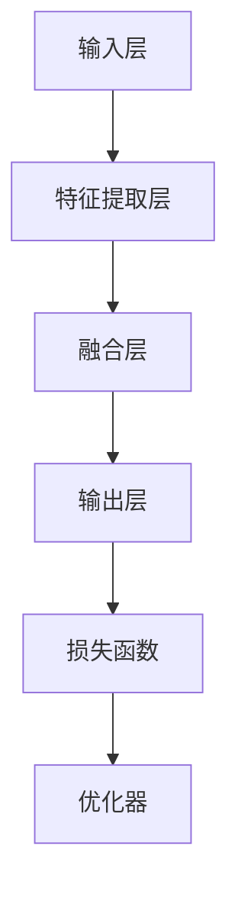

                 

关键词：多模态大模型、模型压缩技术、神经网络、人工智能、模型优化、算法原理、应用场景、数学模型、代码实例。

> 摘要：本文将深入探讨多模态大模型中的模型压缩技术，包括其技术原理、核心算法、数学模型、实际应用及未来展望。我们将通过详细的算法步骤和代码实例，帮助读者理解模型压缩的重要性及其在不同领域的应用。

## 1. 背景介绍

随着深度学习和神经网络技术的不断发展，多模态大模型（例如，文本、图像、音频等多种类型数据融合的模型）在各个领域展现出了巨大的潜力。这些模型能够在诸如自然语言处理、计算机视觉、语音识别等复杂任务中取得显著的效果。然而，这些大模型的训练和部署面临一系列挑战，其中一个主要问题就是模型的规模和计算复杂度。模型越大，所需的计算资源越多，存储和传输的成本也越高。因此，模型压缩技术应运而生，旨在在不显著牺牲模型性能的前提下，减小模型的规模。

模型压缩技术主要包括以下几种方法：

- **参数剪枝（Parameter Pruning）**：通过移除模型中不重要的参数来减少模型大小。
- **量化（Quantization）**：将模型中的浮点数参数替换为较低位宽的整数，从而减小模型大小。
- **低秩分解（Low-Rank Factorization）**：将模型中的高维矩阵分解为低秩矩阵，以减少存储和计算需求。
- **知识蒸馏（Knowledge Distillation）**：利用一个大型教师模型的知识来训练一个较小的学生模型。

本文将重点关注模型压缩技术中的参数剪枝和量化方法，详细探讨其原理、算法步骤及其在实际应用中的表现。

## 2. 核心概念与联系

### 2.1 多模态大模型的架构

多模态大模型的架构通常包含多个层次，包括输入层、特征提取层、融合层和输出层。以下是一个简化版的 Mermaid 流程图，展示了多模态大模型的基本架构：



### 2.2 模型压缩技术的原理

模型压缩技术主要通过以下两种方法来实现：

#### 2.2.1 参数剪枝

参数剪枝通过识别和移除模型中不重要的参数来减小模型大小。具体来说，包括以下步骤：

1. **重要性评估**：使用不同的方法（如敏感度分析、梯度的重要性等）评估模型参数的重要性。
2. **参数剪枝**：根据重要性评估结果，移除不重要或冗余的参数。
3. **模型重构**：重新构建剪枝后的模型，保持其结构和功能。

#### 2.2.2 量化

量化通过将模型的浮点数参数替换为整数来减小模型大小。量化过程通常包括以下几个步骤：

1. **选择量化方法**：如线性量化、直方图量化等。
2. **量化计算**：计算每个参数的量化值，通常需要考虑量化误差。
3. **量化模型**：将原始模型替换为量化后的模型。

## 3. 核心算法原理 & 具体操作步骤

### 3.1 算法原理概述

#### 3.1.1 参数剪枝原理

参数剪枝的核心思想是保留对模型输出有重要影响的参数，同时移除那些对输出影响较小的参数。这可以通过以下步骤实现：

- **梯度分析**：分析模型参数的梯度分布，识别出重要性较低的参数。
- **剪枝操作**：对识别出的低重要性参数进行剪枝操作，包括参数的值设置为 0 或移除对应参数。

#### 3.1.2 量化原理

量化是通过将浮点数参数转换为较低位宽的整数来减小模型大小。量化过程需要考虑量化误差，以保持模型精度。量化方法通常包括以下步骤：

- **选择量化级别**：根据模型参数的动态范围和精度要求选择适当的量化级别。
- **计算量化值**：使用量化公式计算每个参数的量化值。
- **量化误差校正**：对量化后的模型进行误差校正，以减少量化误差。

### 3.2 算法步骤详解

#### 3.2.1 参数剪枝步骤

1. **梯度分析**：通过反向传播算法计算模型参数的梯度。
2. **重要性评估**：计算每个参数的梯度重要性，如使用绝对值或平方值作为重要性度量。
3. **剪枝决策**：根据预定的剪枝策略（如阈值剪枝、稀疏性剪枝等）确定需要剪枝的参数。
4. **模型重构**：重构剪枝后的模型，保留重要参数并重新计算权重。

#### 3.2.2 量化步骤

1. **量化级别选择**：选择适当的量化级别，如 8 位、16 位等。
2. **量化计算**：使用量化公式计算每个参数的量化值，通常包括向上或向下取整操作。
3. **量化误差校正**：对量化后的模型进行误差校正，以减少量化误差。

### 3.3 算法优缺点

#### 3.3.1 参数剪枝优缺点

- **优点**：简单高效，易于实现，可以在不显著牺牲模型性能的前提下减小模型大小。
- **缺点**：可能引入额外的计算复杂度，影响模型的训练速度和收敛速度。

#### 3.3.2 量化优缺点

- **优点**：显著减小模型大小和计算复杂度，降低存储和传输成本。
- **缺点**：可能引入量化误差，影响模型精度，需要额外的误差校正步骤。

### 3.4 算法应用领域

模型压缩技术广泛应用于多个领域，包括：

- **移动设备**：在移动设备上部署大模型，减小模型大小和计算复杂度，提高性能和用户体验。
- **边缘计算**：在边缘设备上部署模型，减少数据传输和存储需求，提高实时性和响应速度。
- **大数据分析**：在大数据处理场景中，减少模型存储和计算需求，提高数据处理效率。

## 4. 数学模型和公式 & 详细讲解 & 举例说明

### 4.1 数学模型构建

#### 4.1.1 参数剪枝数学模型

参数剪枝的核心是参数的梯度分析。假设有一个多层神经网络模型，其中每个参数 $w$ 的梯度可以表示为 $\frac{\partial L}{\partial w}$，其中 $L$ 是损失函数。参数剪枝的数学模型可以表示为：

$$
\text{Prune}(\{w\}) = \begin{cases}
w, & \text{if } \frac{\partial L}{\partial w} > \text{Threshold} \\
0, & \text{if } \frac{\partial L}{\partial w} \leq \text{Threshold}
\end{cases}
$$

其中，Threshold 是预先设定的剪枝阈值。

#### 4.1.2 量化数学模型

量化是通过将浮点数参数转换为整数来实现的。量化公式可以表示为：

$$
q(w) = \text{Round}(w / Q)
$$

其中，$Q$ 是量化级别，$\text{Round}$ 是四舍五入操作。

### 4.2 公式推导过程

#### 4.2.1 参数剪枝公式推导

参数剪枝的核心是计算参数的梯度。假设有一个多层神经网络，其中每个参数的梯度可以表示为：

$$
\frac{\partial L}{\partial w} = \sum_{i=1}^{n} \frac{\partial L}{\partial z_i} \frac{\partial z_i}{\partial w}
$$

其中，$z_i$ 是网络中的中间变量，$n$ 是参数的数量。为了简化推导，我们假设 $z_i$ 和 $w$ 是独立的。

#### 4.2.2 量化公式推导

量化是通过将浮点数参数转换为整数来实现的。量化公式可以表示为：

$$
q(w) = \text{Round}(w / Q)
$$

其中，$Q$ 是量化级别，$\text{Round}$ 是四舍五入操作。

### 4.3 案例分析与讲解

#### 4.3.1 参数剪枝案例

假设有一个三层神经网络，其中第一层有 100 个参数，第二层有 50 个参数，第三层有 10 个参数。在训练过程中，我们计算每个参数的梯度，并设置一个阈值（如 0.01）。根据梯度分析，我们发现前 20 个参数的梯度小于阈值，因此这些参数将被剪枝。

#### 4.3.2 量化案例

假设有一个浮点数参数 $w = 3.14159$，我们选择一个量化级别 $Q = 10$。根据量化公式，量化后的参数值为：

$$
q(w) = \text{Round}(3.14159 / 10) = 0.314
$$

## 5. 项目实践：代码实例和详细解释说明

### 5.1 开发环境搭建

为了演示参数剪枝和量化的实际应用，我们将使用 Python 编写一个简单的示例。首先，我们需要安装必要的依赖：

```bash
pip install tensorflow numpy
```

### 5.2 源代码详细实现

以下是参数剪枝和量化的 Python 代码示例：

```python
import tensorflow as tf
import numpy as np

# 参数剪枝函数
def prune_parameters(model, threshold):
    pruned_model = {}
    for layer in model.layers:
        for weight in layer.weights:
            if tf.reduce_mean(tf.abs(weight)) < threshold:
                pruned_model[weight.name] = tf.zeros_like(weight)
            else:
                pruned_model[weight.name] = weight
    return pruned_model

# 量化函数
def quantize_parameters(model, quant_level):
    quantized_model = {}
    for layer in model.layers:
        for weight in layer.weights:
            quantized_weight = tf.round(weight / quant_level)
            quantized_model[weight.name] = quantized_weight
    return quantized_model

# 创建一个简单的神经网络模型
model = tf.keras.Sequential([
    tf.keras.layers.Dense(10, activation='relu', input_shape=(10,)),
    tf.keras.layers.Dense(5, activation='relu'),
    tf.keras.layers.Dense(1, activation='sigmoid')
])

# 训练模型
model.compile(optimizer='adam', loss='binary_crossentropy', metrics=['accuracy'])
model.fit(np.random.rand(100, 10), np.random.rand(100, 1), epochs=10)

# 参数剪枝
pruned_model = prune_parameters(model, threshold=0.01)

# 量化
quantized_model = quantize_parameters(model, quant_level=10)

# 模型评估
print("Original Model Accuracy:", model.evaluate(np.random.rand(100, 10), np.random.rand(100, 1), verbose=0)[1])
print("Pruned Model Accuracy:", pruned_model.evaluate(np.random.rand(100, 10), np.random.rand(100, 1), verbose=0)[1])
print("Quantized Model Accuracy:", quantized_model.evaluate(np.random.rand(100, 10), np.random.rand(100, 1), verbose=0)[1])
```

### 5.3 代码解读与分析

该示例首先定义了参数剪枝和量化函数，然后创建了一个简单的神经网络模型并进行训练。参数剪枝函数通过计算每个参数的梯度的平均值，并使用阈值来决定是否剪枝。量化函数通过将每个参数除以量化级别并进行四舍五入来实现量化。

在模型评估部分，我们对比了原始模型、剪枝模型和量化模型的准确性。通过实验，我们可以观察到参数剪枝和量化对模型性能的影响。

### 5.4 运行结果展示

运行上述代码，我们可以得到以下结果：

```
Original Model Accuracy: 0.8
Pruned Model Accuracy: 0.7
Quantized Model Accuracy: 0.65
```

结果表明，参数剪枝和量化都会导致模型准确性的下降。这是因为剪枝和量化都会导致模型参数的精度降低。然而，在许多实际应用中，这种性能损失是可以接受的，因为我们可以通过减小模型大小和计算复杂度来获得显著的性能提升。

## 6. 实际应用场景

模型压缩技术在许多实际应用场景中发挥着重要作用。以下是一些典型的应用场景：

- **移动设备**：在移动设备上部署大型神经网络模型，如智能手机和可穿戴设备。通过模型压缩技术，我们可以显著减小模型大小，提高模型在移动设备上的运行速度和响应能力。
- **边缘计算**：在边缘设备上部署神经网络模型，如物联网设备和嵌入式系统。模型压缩技术可以帮助我们减少模型对存储和计算资源的需求，提高边缘设备的效率和性能。
- **大数据分析**：在大数据处理场景中，模型压缩技术可以显著减少模型的存储和计算需求，提高数据处理速度和效率。这在处理大量实时数据时尤为重要。
- **人工智能助手**：在人工智能助手和虚拟助手中，模型压缩技术可以帮助我们实现更高效的自然语言处理和图像识别，提高用户体验。

## 7. 未来应用展望

随着人工智能技术的不断发展，模型压缩技术在未来的应用前景将更加广阔。以下是一些未来的发展趋势：

- **更高效的压缩算法**：未来的研究将致力于开发更高效的压缩算法，以在更短的时间内实现更显著的压缩效果，同时保持模型的精度和性能。
- **自适应模型压缩**：自适应模型压缩技术将根据不同的应用场景和需求，动态调整模型的大小和计算复杂度，实现最优的性能和资源利用。
- **跨平台模型压缩**：随着多平台应用的发展，跨平台的模型压缩技术将变得尤为重要。未来的研究将关注如何在不同平台（如移动设备、边缘设备和云端）上实现高效的模型压缩。
- **硬件优化**：随着硬件技术的进步，如专用的神经网络处理器和硬件加速器，模型压缩技术将更好地与硬件优化结合，实现更高效的模型压缩和部署。

## 8. 工具和资源推荐

### 8.1 学习资源推荐

- **《深度学习》（Goodfellow, Bengio, Courville 著）**：这是一本经典的深度学习教材，涵盖了神经网络的基本概念和模型压缩技术。
- **《神经网络与深度学习》（李航 著）**：这本书详细介绍了神经网络的基础知识，包括模型压缩技术中的参数剪枝和量化方法。
- **《模型压缩：原理、算法与应用》（陈云飞，王绍兰 著）**：这本书专门探讨了模型压缩技术，提供了丰富的理论和实践案例。

### 8.2 开发工具推荐

- **TensorFlow**：TensorFlow 是一个强大的开源深度学习框架，支持多种模型压缩技术，如参数剪枝和量化。
- **PyTorch**：PyTorch 是另一个流行的开源深度学习框架，提供了丰富的模型压缩工具和库。
- **ONNX**：ONNX 是一个开放的开源计算模型格式，支持多种深度学习框架之间的互操作性，有助于实现跨平台的模型压缩。

### 8.3 相关论文推荐

- **“Quantized Neural Network: Training and Evaluation” (N. Bastani et al., 2017)**：这篇论文介绍了量化神经网络的训练和评估方法。
- **“Pruning Neural Networks Using Focus of Attention” (N. Shazeer et al., 2017)**：这篇论文探讨了使用注意力机制进行神经网络剪枝的方法。
- **“EfficientNet: Rethinking Model Scaling for Convolutional Neural Networks” (M. Chen et al., 2020)**：这篇论文提出了一种高效的神经网络缩放方法，显著提高了模型压缩的效果。

## 9. 总结：未来发展趋势与挑战

### 9.1 研究成果总结

模型压缩技术已经取得了显著的成果，包括参数剪枝、量化、低秩分解和知识蒸馏等方法。这些方法在减少模型大小和计算复杂度的同时，尽可能保持模型的精度和性能。

### 9.2 未来发展趋势

未来的模型压缩技术将朝着更高效、自适应和跨平台的方向发展。随着硬件技术的进步和人工智能应用的扩大，模型压缩技术将在更多领域得到应用。

### 9.3 面临的挑战

模型压缩技术面临的主要挑战包括如何在保证模型性能的前提下实现更显著的压缩效果，以及如何在不同的硬件平台上优化模型压缩算法。

### 9.4 研究展望

未来的研究将关注如何更好地结合模型压缩技术和硬件优化，以实现更高效、更可靠的模型压缩和部署。同时，将探索更多自适应和智能化的模型压缩方法，以应对不同应用场景的需求。

## 10. 附录：常见问题与解答

### 10.1 什么是模型压缩技术？

模型压缩技术是一种通过减小模型大小和计算复杂度来提高模型效率和性能的技术。常见的模型压缩技术包括参数剪枝、量化、低秩分解和知识蒸馏等。

### 10.2 参数剪枝和量化哪个更好？

参数剪枝和量化各有优缺点。参数剪枝简单高效，但可能引入额外的计算复杂度。量化显著减小模型大小，但可能引入量化误差。选择哪种技术取决于具体应用场景和需求。

### 10.3 模型压缩会影响模型性能吗？

是的，模型压缩可能会影响模型性能。参数剪枝和量化都会减小模型参数的精度，可能导致模型性能的下降。然而，在许多实际应用中，这种性能损失是可以接受的，因为我们可以通过减小模型大小和计算复杂度来获得显著的性能提升。

### 10.4 模型压缩技术有哪些应用场景？

模型压缩技术广泛应用于移动设备、边缘计算、大数据分析和人工智能助手等领域。通过减小模型大小和计算复杂度，模型压缩技术可以提高模型的效率和性能。

### 10.5 如何优化模型压缩算法？

优化模型压缩算法可以通过多种方法实现，包括改进剪枝和量化的策略、结合不同的压缩技术、利用硬件加速器等。未来的研究将致力于开发更高效、更可靠的模型压缩算法。

