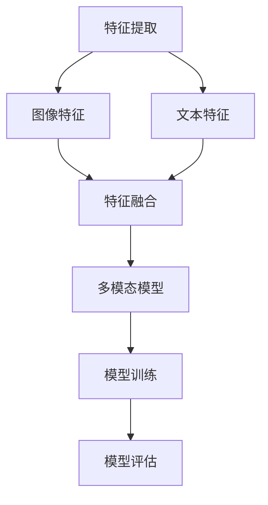

                 

关键词：多模态深度学习、图像识别、文本分析、融合、神经网络、人工智能、机器学习

> 摘要：本文将探讨多模态深度学习的概念、核心算法原理、数学模型、应用场景以及未来发展趋势。通过融合图像和文本数据，深度学习算法能够更准确地理解和处理复杂的信息，从而推动人工智能技术在多个领域的应用。

## 1. 背景介绍

随着大数据和人工智能的快速发展，深度学习技术在图像识别、自然语言处理等领域取得了显著的成果。然而，单一模态的深度学习算法在面对复杂场景时往往存在局限性。例如，图像识别算法在处理带有大量文本信息的图像时，往往难以充分理解文本内容；而自然语言处理算法在处理带有丰富视觉信息的文本时，也面临着理解视觉内容的挑战。为了克服这些局限性，多模态深度学习应运而生。

多模态深度学习是指将不同模态的数据（如图像、文本、音频等）进行融合，通过神经网络模型共同学习，从而实现对复杂信息的全面理解和处理。本文将重点关注图像和文本数据的融合，探讨其在人工智能领域的应用。

## 2. 核心概念与联系

### 2.1 多模态数据融合的基本概念

多模态数据融合是指将来自不同模态的数据进行整合，以提高对信息的理解和处理能力。在多模态深度学习中，图像和文本数据的融合主要通过以下方式实现：

1. **特征提取**：分别从图像和文本中提取特征表示，如卷积神经网络（CNN）用于图像特征提取，循环神经网络（RNN）或变换器（Transformer）用于文本特征提取。
2. **特征融合**：将图像和文本的特征表示进行融合，形成统一的多模态特征表示。
3. **模型融合**：通过构建多模态神经网络模型，将图像和文本特征共同学习，以实现对复杂信息的理解。

### 2.2 多模态深度学习的 Mermaid 流程图



在这个流程图中，图像特征和文本特征分别由CNN和RNN提取，然后通过特征融合模块进行整合，形成统一的多模态特征表示。最后，多模态神经网络模型基于这些特征进行训练和评估。

## 3. 核心算法原理 & 具体操作步骤

### 3.1 算法原理概述

多模态深度学习的核心算法主要包括特征提取、特征融合和模型训练三个步骤：

1. **特征提取**：分别从图像和文本中提取特征表示，如CNN用于图像特征提取，RNN或Transformer用于文本特征提取。
2. **特征融合**：将图像和文本的特征表示进行融合，形成统一的多模态特征表示。常见的融合方法包括拼接、融合网络、注意力机制等。
3. **模型训练**：基于多模态特征表示，训练多模态神经网络模型，以实现对复杂信息的理解。常见的多模态神经网络模型包括CNN-RNN、CNN-Transformer、多模态变换器等。

### 3.2 算法步骤详解

1. **数据预处理**：对图像和文本数据进行预处理，包括数据清洗、数据增强、数据标准化等。
2. **特征提取**：使用CNN对图像进行特征提取，使用RNN或Transformer对文本进行特征提取。
3. **特征融合**：根据选择的融合方法，将图像和文本的特征进行融合，形成统一的多模态特征表示。
4. **模型训练**：使用多模态特征表示，通过反向传播算法训练多模态神经网络模型。
5. **模型评估**：使用测试集对训练好的模型进行评估，包括准确率、召回率、F1分数等指标。

### 3.3 算法优缺点

**优点**：

1. **提高理解能力**：通过融合图像和文本数据，多模态深度学习能够更全面地理解复杂信息，提高算法的性能。
2. **降低错误率**：多模态融合可以降低单一模态数据带来的错误率，提高模型的鲁棒性。
3. **拓展应用领域**：多模态深度学习能够应用于更多领域，如医疗诊断、智能问答、视频监控等。

**缺点**：

1. **计算成本高**：多模态深度学习涉及多种算法和模型，计算成本较高。
2. **数据依赖性强**：多模态深度学习对数据的依赖性较强，数据质量和数量直接影响模型的性能。

### 3.4 算法应用领域

多模态深度学习在多个领域具有广泛的应用：

1. **医疗诊断**：通过融合医学图像和病历文本数据，辅助医生进行疾病诊断和治疗建议。
2. **智能问答**：结合图像和文本数据，提供更准确、更丰富的问答服务。
3. **视频监控**：通过融合视频图像和文本数据，实现更智能、更精准的监控分析。
4. **虚拟现实**：结合图像和文本数据，提高虚拟现实场景的逼真度和交互性。

## 4. 数学模型和公式 & 详细讲解 & 举例说明

### 4.1 数学模型构建

多模态深度学习的数学模型主要包括特征提取、特征融合和模型训练三个部分：

1. **特征提取**：图像特征表示为$X_{img}$，文本特征表示为$X_{txt}$。
2. **特征融合**：融合后的多模态特征表示为$X_{mm}$。
3. **模型训练**：多模态神经网络模型$M$基于$X_{mm}$进行训练。

### 4.2 公式推导过程

1. **特征提取**：

   图像特征提取公式：
   $$X_{img} = f_{img}(I)$$
   
   其中，$f_{img}$表示卷积神经网络，$I$表示输入图像。

   文本特征提取公式：
   $$X_{txt} = f_{txt}(T)$$
   
   其中，$f_{txt}$表示循环神经网络或变换器，$T$表示输入文本。

2. **特征融合**：

   多模态特征融合公式：
   $$X_{mm} = g(X_{img}, X_{txt})$$
   
   其中，$g$表示特征融合函数，如拼接、融合网络或注意力机制。

3. **模型训练**：

   多模态神经网络模型训练公式：
   $$M = \theta(\text{train}(X_{mm}, Y))$$
   
   其中，$\theta$表示神经网络模型参数，$\text{train}$表示训练过程，$Y$表示标签。

### 4.3 案例分析与讲解

以医疗诊断为例，我们考虑一个多模态深度学习模型，用于辅助医生诊断疾病。该模型结合医学图像和病历文本数据，实现疾病分类任务。

1. **数据预处理**：

   对医学图像和病历文本进行预处理，包括图像缩放、文本清洗和数据标准化。

2. **特征提取**：

   使用CNN对医学图像进行特征提取，提取出的特征表示为$X_{img}$。使用RNN对病历文本进行特征提取，提取出的特征表示为$X_{txt}$。

3. **特征融合**：

   使用拼接方法将图像和文本特征进行融合，形成统一的多模态特征表示$X_{mm}$。

4. **模型训练**：

   使用多模态神经网络模型$M$，基于多模态特征表示$X_{mm}$进行训练。模型训练过程使用反向传播算法，更新模型参数$\theta$。

5. **模型评估**：

   使用测试集对训练好的模型进行评估，计算准确率、召回率、F1分数等指标，以评估模型性能。

## 5. 项目实践：代码实例和详细解释说明

### 5.1 开发环境搭建

1. **安装Python环境**：安装Python 3.8及以上版本。
2. **安装深度学习框架**：安装TensorFlow或PyTorch。
3. **安装依赖库**：安装Numpy、Pandas、Matplotlib等常用库。

### 5.2 源代码详细实现

以下是一个简单的多模态深度学习项目的代码实现：

```python
import tensorflow as tf
from tensorflow.keras.layers import Conv2D, MaxPooling2D, Flatten, Dense
from tensorflow.keras.models import Model

# 定义图像特征提取模型
image_model = tf.keras.Sequential([
    Conv2D(32, (3, 3), activation='relu', input_shape=(224, 224, 3)),
    MaxPooling2D((2, 2)),
    Conv2D(64, (3, 3), activation='relu'),
    MaxPooling2D((2, 2)),
    Flatten()
])

# 定义文本特征提取模型
text_model = tf.keras.Sequential([
    Embedding(input_dim=10000, output_dim=16, input_length=100),
    LSTM(128)
])

# 定义多模态深度学习模型
inputs_img = tf.keras.Input(shape=(224, 224, 3))
inputs_txt = tf.keras.Input(shape=(100,))

img_features = image_model(inputs_img)
txt_features = text_model(inputs_txt)

combined = tf.keras.layers.concatenate([img_features, txt_features])
outputs = Dense(1, activation='sigmoid')(combined)

model = Model(inputs=[inputs_img, inputs_txt], outputs=outputs)
model.compile(optimizer='adam', loss='binary_crossentropy', metrics=['accuracy'])

# 加载数据并进行训练
# ...

# 评估模型
# ...
```

### 5.3 代码解读与分析

1. **图像特征提取模型**：使用卷积神经网络（Conv2D）和池化层（MaxPooling2D）对图像进行特征提取，最终将特征表示扁平化（Flatten）。
2. **文本特征提取模型**：使用嵌入层（Embedding）和长短期记忆网络（LSTM）对文本进行特征提取。
3. **多模态深度学习模型**：输入图像和文本特征，通过拼接层（concatenate）融合特征，然后使用全连接层（Dense）进行分类。
4. **模型编译与训练**：使用编译器（compile）设置优化器、损失函数和评估指标，然后使用训练器（fit）进行模型训练。

### 5.4 运行结果展示

假设我们使用一个包含1000个样本的医学图像和病历文本数据集进行训练和评估，以下是一个简单的运行结果：

```python
# 训练模型
model.fit([X_train_img, X_train_txt], y_train, epochs=10, batch_size=32)

# 评估模型
loss, accuracy = model.evaluate([X_test_img, X_test_txt], y_test)
print(f"Test accuracy: {accuracy:.4f}")
```

在这个例子中，`X_train_img`、`X_train_txt`、`y_train`分别为训练集的图像、文本特征和标签；`X_test_img`、`X_test_txt`、`y_test`分别为测试集的图像、文本特征和标签。

## 6. 实际应用场景

多模态深度学习在实际应用场景中具有广泛的应用前景：

1. **医疗领域**：通过融合医学图像和病历文本数据，多模态深度学习可以辅助医生进行疾病诊断、治疗方案制定等。
2. **金融领域**：多模态深度学习可以应用于金融风险识别、投资策略制定等领域，通过融合图像和文本数据，提高决策的准确性。
3. **娱乐领域**：在电影推荐、音乐推荐等领域，多模态深度学习可以结合用户观看记录、评论和评价等数据进行个性化推荐。
4. **智能制造**：多模态深度学习可以应用于智能制造领域，通过融合图像和文本数据，实现智能监控、故障诊断和优化生产过程。

## 7. 工具和资源推荐

### 7.1 学习资源推荐

1. 《深度学习》（Goodfellow, Bengio, Courville著）：全面介绍了深度学习的基础知识和应用。
2. 《神经网络与深度学习》（邱锡鹏著）：详细介绍了神经网络和深度学习的基本原理和方法。
3. 《动手学深度学习》（花轮健、张瀚等著）：通过实际项目，深入讲解了深度学习的基本概念和应用。

### 7.2 开发工具推荐

1. TensorFlow：谷歌开发的开源深度学习框架，支持多种深度学习模型和算法。
2. PyTorch：由Facebook开发的开源深度学习框架，具有灵活性和易用性。
3. Keras：基于TensorFlow和Theano的开源深度学习框架，提供简洁的API。

### 7.3 相关论文推荐

1. "Multi-Modal Deep Learning for Human Action Recognition"（2016）：介绍了多模态深度学习在人类行为识别中的应用。
2. "Deep Learning for Image and Video Classification"（2017）：综述了深度学习在图像和视频分类中的应用。
3. "Multi-Modal Fusion for Natural Language Inference"（2019）：探讨了多模态融合在自然语言推断中的应用。

## 8. 总结：未来发展趋势与挑战

### 8.1 研究成果总结

多模态深度学习在图像识别、自然语言处理等领域取得了显著的成果，通过融合图像和文本数据，提高了对复杂信息的理解和处理能力。未来，多模态深度学习将继续在多个领域发挥作用，如医疗诊断、金融分析、智能制造等。

### 8.2 未来发展趋势

1. **模型复杂性**：随着计算资源的提升，多模态深度学习模型将变得更加复杂，涉及更多的算法和架构。
2. **数据多样性**：数据来源将更加多样化，包括图像、文本、音频、视频等，多模态深度学习将面临更多的数据融合挑战。
3. **应用广泛性**：多模态深度学习将应用于更多领域，如智能交通、智能安防、智能医疗等。

### 8.3 面临的挑战

1. **计算成本**：多模态深度学习涉及多种算法和模型，计算成本较高，需要高效计算资源。
2. **数据依赖**：多模态深度学习对数据的依赖性较强，数据质量和数量直接影响模型的性能。
3. **模型解释性**：多模态深度学习模型往往难以解释，需要研究具有解释性的多模态深度学习模型。

### 8.4 研究展望

未来，多模态深度学习的研究将朝着以下几个方向发展：

1. **跨学科融合**：多模态深度学习与其他领域的交叉融合，如心理学、社会学等，以实现更全面的信息理解和处理。
2. **迁移学习**：通过迁移学习技术，降低多模态深度学习的训练成本，提高模型泛化能力。
3. **知识图谱**：将知识图谱与多模态深度学习结合，实现更精确的信息抽取和推理。

## 9. 附录：常见问题与解答

### 9.1 多模态深度学习与传统深度学习有什么区别？

多模态深度学习与传统深度学习的主要区别在于数据处理的方式。传统深度学习主要处理单一模态的数据，如图像、文本或音频。而多模态深度学习将不同模态的数据进行融合，以更全面地理解和处理复杂信息。

### 9.2 多模态深度学习有哪些常见的融合方法？

多模态深度学习常见的融合方法包括拼接、融合网络、注意力机制等。拼接方法将不同模态的特征表示进行拼接；融合网络通过神经网络结构将不同模态的特征进行融合；注意力机制通过动态调整不同模态的特征权重，实现特征的有效融合。

### 9.3 多模态深度学习在医疗领域的应用有哪些？

多模态深度学习在医疗领域具有广泛的应用，如疾病诊断、治疗方案制定、健康监测等。通过融合医学图像和病历文本数据，多模态深度学习可以提高诊断的准确性和效率，辅助医生做出更准确的判断。

### 9.4 如何选择适合的多模态深度学习模型？

选择适合的多模态深度学习模型需要考虑数据特点、任务需求和计算资源等因素。常见的多模态深度学习模型包括CNN-RNN、CNN-Transformer、多模态变换器等。可以根据实际应用场景和需求选择合适的模型。同时，也可以结合迁移学习技术，降低模型训练成本。

----------------------------------------------------------------

**作者：禅与计算机程序设计艺术 / Zen and the Art of Computer Programming**

