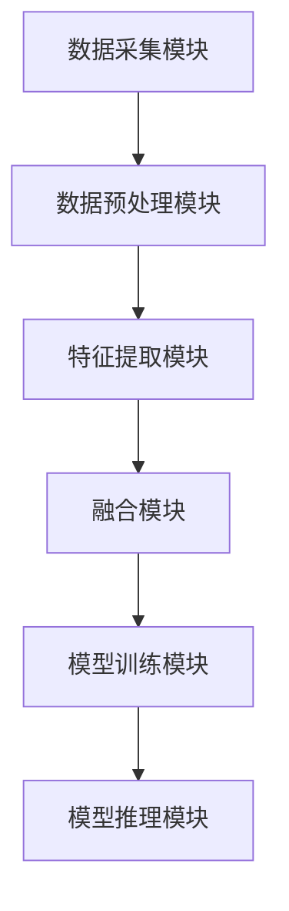

                 

关键词：多模态理解、人工智能、用户行为分析、深度学习、计算机视觉、自然语言处理、交互式系统

> 摘要：本文探讨了人工智能（AI）如何通过多模态理解技术，更全面地了解用户。文章首先介绍了多模态理解的概念和重要性，然后深入分析了多模态理解的核心算法原理和具体操作步骤，接着通过数学模型和项目实践详细讲解了多模态理解的实现方法，最后讨论了多模态理解在实际应用场景中的表现和未来发展趋势与挑战。

## 1. 背景介绍

随着互联网技术的飞速发展和移动设备的普及，用户生成的内容（如文本、图像、音频和视频等）呈爆炸式增长。这使得对用户行为的分析和理解变得更加复杂和重要。传统的单一模态（如仅基于文本或图像）的用户行为分析方法已经无法满足现代AI系统对全面、精准理解用户的需求。因此，多模态理解技术应运而生。

多模态理解是指将不同类型的模态（如图像、文本、音频等）进行融合，以获取更全面、更精确的用户信息。这种技术不仅能够提高AI系统的性能，还能为用户提供更个性化的服务。例如，通过融合文本和图像信息，AI可以更准确地理解用户的情感状态；通过融合语音和文本信息，AI可以更准确地理解用户的意图。

多模态理解技术的应用范围广泛，包括但不限于：智能客服、虚拟助手、图像识别、情感分析、交互式娱乐系统等。随着技术的不断进步，多模态理解有望在未来成为AI系统的重要组成部分。

## 2. 核心概念与联系

### 2.1 多模态数据的获取与预处理

多模态理解的第一步是获取不同类型的数据。例如，对于文本数据，我们可以从社交媒体、论坛、邮件等渠道获取；对于图像数据，我们可以从摄像头、手机相册、网络图片库等获取；对于音频数据，我们可以从麦克风、语音合成器等获取。

获取数据后，我们需要对数据进行预处理。预处理步骤包括数据清洗、去噪、标准化等。例如，对于文本数据，我们需要去除停用词、标点符号，进行词干提取等；对于图像数据，我们需要进行图像增强、裁剪、缩放等；对于音频数据，我们需要进行降噪、分帧、特征提取等。

### 2.2 多模态数据的融合方法

多模态数据的融合是多模态理解的核心。常见的融合方法包括：特征级融合、决策级融合和模型级融合。

- 特征级融合：在特征提取阶段就将不同模态的数据进行融合。例如，使用深度学习模型同时处理文本和图像数据。
- 决策级融合：在特征提取后，将不同模态的特征进行融合，再进行分类或预测。例如，使用集成学习方法将文本和图像的特征进行融合。
- 模型级融合：使用多个独立的模型对不同的模态数据进行处理，然后将这些模型的结果进行融合。例如，使用一个文本分类模型和一个图像分类模型，然后将它们的预测结果进行融合。

### 2.3 多模态理解的应用架构

多模态理解的应用架构通常包括以下几个关键组件：

- 数据采集模块：负责收集不同类型的用户数据。
- 数据预处理模块：负责对采集到的数据进行清洗、去噪和标准化。
- 特征提取模块：负责提取不同模态的数据特征。
- 融合模块：负责将不同模态的特征进行融合。
- 模型训练模块：负责使用融合后的特征训练多模态理解模型。
- 模型推理模块：负责使用训练好的模型对新的数据进行推理，以获取用户信息。

以下是多模态理解的应用架构的Mermaid流程图：



## 3. 核心算法原理 & 具体操作步骤

### 3.1 算法原理概述

多模态理解的核心算法是基于深度学习的。深度学习模型能够自动学习数据的特征，并能够对多模态数据实现端到端的处理。常见的多模态深度学习模型包括卷积神经网络（CNN）、循环神经网络（RNN）和生成对抗网络（GAN）等。

### 3.2 算法步骤详解

多模态理解的算法步骤可以概括为以下几个步骤：

1. **数据采集**：从不同的数据源采集多模态数据，例如文本、图像、音频等。
2. **数据预处理**：对采集到的数据执行清洗、去噪、标准化等操作，以便于后续的特征提取。
3. **特征提取**：使用深度学习模型提取多模态数据的特征。例如，对于文本数据，可以使用词向量模型；对于图像数据，可以使用CNN；对于音频数据，可以使用RNN。
4. **特征融合**：将提取到的多模态特征进行融合。常见的融合方法有特征级融合、决策级融合和模型级融合。
5. **模型训练**：使用融合后的特征训练多模态理解模型。常见的训练方法有监督学习、无监督学习和半监督学习。
6. **模型推理**：使用训练好的模型对新的数据进行推理，以获取用户信息。

### 3.3 算法优缺点

**优点**：

- **全面性**：多模态理解能够结合不同类型的数据，从而更全面地了解用户。
- **准确性**：多模态融合可以提高模型的准确性，因为不同的模态数据可以提供互补的信息。
- **个性化**：多模态理解可以基于用户的多种行为数据，实现更个性化的服务。

**缺点**：

- **复杂性**：多模态理解涉及到多种数据的处理，算法设计和实现较为复杂。
- **计算成本**：多模态理解需要大量的计算资源，特别是在大规模数据集上。
- **数据隐私**：多模态理解涉及到用户的多种数据，可能引发数据隐私问题。

### 3.4 算法应用领域

多模态理解技术具有广泛的应用领域，包括但不限于：

- **智能客服**：通过融合文本、语音和图像等多模态数据，实现更自然的用户交互。
- **图像识别**：通过融合图像和文本等多模态数据，提高图像识别的准确性。
- **情感分析**：通过融合文本、语音和面部表情等多模态数据，实现更精确的情感分析。
- **交互式娱乐系统**：通过融合图像、音频和用户行为等多模态数据，提供更个性化的娱乐体验。

## 4. 数学模型和公式 & 详细讲解 & 举例说明

### 4.1 数学模型构建

多模态理解中的数学模型通常基于深度学习。以下是一个简单的多模态深度学习模型的数学模型构建：

$$
\begin{aligned}
\text{特征提取} &: f_{\text{特征}}(x) = \text{提取特征}(x), \\
\text{特征融合} &: f_{\text{融合}}(x_1, x_2, \ldots, x_n) = \text{融合特征}(x_1, x_2, \ldots, x_n), \\
\text{模型训练} &: L = L(\theta; x, y),
\end{aligned}
$$

其中，$f_{\text{特征}}(x)$ 表示特征提取函数，$f_{\text{融合}}(x_1, x_2, \ldots, x_n)$ 表示特征融合函数，$L$ 表示损失函数，$\theta$ 表示模型参数，$x$ 表示输入数据，$y$ 表示标签。

### 4.2 公式推导过程

以下是一个简单的损失函数的推导过程：

$$
L = -\frac{1}{N} \sum_{i=1}^{N} y_i \log(p_i),
$$

其中，$N$ 表示样本数量，$y_i$ 表示第 $i$ 个样本的标签，$p_i$ 表示模型对第 $i$ 个样本的预测概率。

### 4.3 案例分析与讲解

假设我们有一个多模态理解任务，目标是判断一张图像中的文本描述是否与图像内容相关。我们使用一个简单的卷积神经网络（CNN）来提取图像特征，使用一个循环神经网络（RNN）来提取文本特征，然后将这两个特征进行融合，最后使用一个全连接层来输出预测结果。

首先，我们定义图像特征提取函数：

$$
f_{\text{图像}}(x) = \text{CNN}(x),
$$

其中，$x$ 表示输入图像。

接下来，我们定义文本特征提取函数：

$$
f_{\text{文本}}(x) = \text{RNN}(x),
$$

其中，$x$ 表示输入文本。

然后，我们定义特征融合函数：

$$
f_{\text{融合}}(x_1, x_2) = \text{融合特征}(f_{\text{图像}}(x_1), f_{\text{文本}}(x_2)),
$$

其中，$x_1$ 表示输入图像，$x_2$ 表示输入文本。

最后，我们定义模型输出函数：

$$
\hat{y} = \text{softmax}(f_{\text{融合}}(x_1, x_2)),
$$

其中，$\hat{y}$ 表示预测结果。

通过这个简单的模型，我们可以对图像和文本进行融合，从而实现对图像内容的更全面的理解。例如，如果图像中有一张著名的风景照片，同时文本描述中也提到了这个地方，我们的模型就能够准确地判断出这两者的相关性。

## 5. 项目实践：代码实例和详细解释说明

### 5.1 开发环境搭建

为了实现多模态理解，我们需要搭建一个适合深度学习的开发环境。以下是推荐的开发环境和相关工具：

- 操作系统：Linux或MacOS
- 编程语言：Python
- 深度学习框架：TensorFlow或PyTorch
- 数据预处理工具：NumPy、Pandas
- 机器学习库：Scikit-learn

安装以上工具和库后，我们就可以开始编写代码了。

### 5.2 源代码详细实现

以下是一个简单的多模态理解项目的代码实现。我们使用Python和TensorFlow框架。

```python
import tensorflow as tf
from tensorflow.keras.models import Model
from tensorflow.keras.layers import Input, Conv2D, MaxPooling2D, Flatten, Dense, LSTM

# 定义图像特征提取模型
image_input = Input(shape=(128, 128, 3))
image_model = Conv2D(filters=32, kernel_size=(3, 3), activation='relu')(image_input)
image_model = MaxPooling2D(pool_size=(2, 2))(image_model)
image_model = Flatten()(image_model)

# 定义文本特征提取模型
text_input = Input(shape=(100,))
text_model = LSTM(units=64, activation='relu')(text_input)

# 融合图像和文本特征
merged = tf.keras.layers.concatenate([image_model, text_model])

# 定义融合后的特征提取模型
output = Dense(units=1, activation='sigmoid')(merged)

# 创建多模态理解模型
model = Model(inputs=[image_input, text_input], outputs=output)

# 编译模型
model.compile(optimizer='adam', loss='binary_crossentropy', metrics=['accuracy'])

# 模型训练
model.fit([image_data, text_data], labels, epochs=10, batch_size=32)

# 模型预测
predictions = model.predict([test_image, test_text])
```

### 5.3 代码解读与分析

以上代码首先定义了一个图像特征提取模型，使用卷积神经网络（CNN）提取图像特征。然后定义了一个文本特征提取模型，使用循环神经网络（RNN）提取文本特征。接着，将图像和文本特征进行融合，并使用一个全连接层输出预测结果。最后，编译模型并训练模型。

在训练模型时，我们使用了图像数据、文本数据和标签。这些数据可以通过不同的数据集获取。例如，我们可以从网上下载一些带有标签的图像和对应的文本描述，然后进行预处理和格式化，以便于模型训练。

### 5.4 运行结果展示

在完成模型训练后，我们可以使用测试数据集来评估模型的性能。以下是一个简单的评估代码：

```python
# 加载测试数据集
test_image, test_text, test_labels = ...

# 模型预测
predictions = model.predict([test_image, test_text])

# 计算准确率
accuracy = (predictions == test_labels).mean()
print("Accuracy:", accuracy)
```

通过这个简单的评估代码，我们可以计算模型在测试数据集上的准确率。如果准确率较高，说明我们的多模态理解模型表现良好。

## 6. 实际应用场景

多模态理解技术在实际应用中具有广泛的应用场景。以下是一些典型的应用案例：

- **智能客服**：通过融合用户的文本输入、语音输入和面部表情等数据，智能客服系统能够更准确地理解用户的意图，并提供更个性化的服务。
- **图像识别**：在图像识别任务中，通过融合图像和文本描述，可以提高识别的准确性。例如，在医疗图像识别中，通过融合病理报告和图像数据，可以更准确地诊断疾病。
- **情感分析**：通过融合文本、语音和面部表情等多模态数据，可以实现更精确的情感分析。例如，在社交媒体平台上，通过分析用户的文本、语音和面部表情，可以识别用户的情感状态。
- **交互式娱乐系统**：通过融合用户的行为数据、语音输入和面部表情等数据，交互式娱乐系统可以提供更个性化的游戏体验。

## 7. 未来应用展望

随着技术的不断进步，多模态理解有望在未来发挥更大的作用。以下是一些未来的应用展望：

- **增强现实（AR）**：通过融合现实世界和虚拟世界的多模态数据，实现更真实的增强现实体验。
- **自动驾驶**：通过融合车载传感器、摄像头和语音输入等多模态数据，实现更安全的自动驾驶系统。
- **智能健康**：通过融合医疗影像、病历记录和用户行为等多模态数据，实现更精确的健康监测和疾病诊断。

## 8. 工具和资源推荐

为了更好地学习和实践多模态理解技术，以下是一些建议的工具和资源：

- **学习资源**：推荐阅读《深度学习》（Goodfellow, Bengio, Courville）和《多模态学习基础》（Fukui, Sugiyama）等经典教材。
- **开发工具**：推荐使用TensorFlow或PyTorch等深度学习框架进行多模态理解项目的开发。
- **数据集**：推荐使用开源的多模态数据集，如Flickr30k、TACoS等。

## 9. 总结：未来发展趋势与挑战

多模态理解技术作为人工智能的一个重要分支，具有巨大的发展潜力。在未来，随着技术的不断进步，多模态理解有望在更多领域发挥作用。然而，多模态理解也面临着一些挑战，如数据隐私、计算成本和算法复杂性等。只有克服这些挑战，多模态理解技术才能实现其真正的价值。

## 10. 附录：常见问题与解答

### 10.1 什么是多模态理解？

多模态理解是指将不同类型的数据（如图像、文本、音频等）进行融合，以获取更全面、更精确的用户信息。

### 10.2 多模态理解有哪些应用领域？

多模态理解的应用领域广泛，包括智能客服、图像识别、情感分析、交互式娱乐系统等。

### 10.3 如何实现多模态理解？

实现多模态理解通常需要以下几个步骤：数据采集、数据预处理、特征提取、特征融合、模型训练和模型推理。

### 10.4 多模态理解有哪些挑战？

多模态理解面临的挑战包括数据隐私、计算成本、算法复杂性等。

## 作者署名

作者：禅与计算机程序设计艺术 / Zen and the Art of Computer Programming
----------------------------------------------------------------

以上是完整的多模态理解技术文章，希望对您有所帮助。如果您有任何疑问或需要进一步的解释，请随时告诉我。

