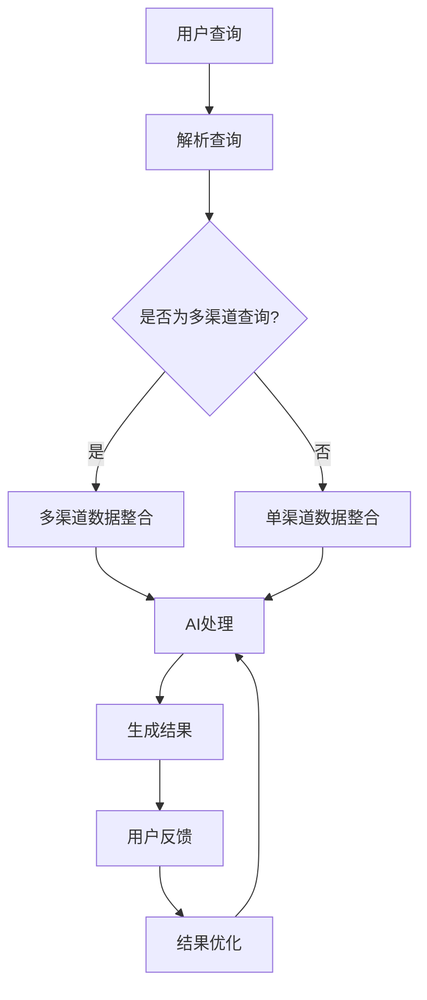

                 

关键词：多渠道整合、AI搜索、搜索引擎优化、用户体验、个性化推荐、算法、大数据分析

> 摘要：随着互联网的迅速发展，用户对信息获取的期望越来越高，搜索引擎成为了人们获取信息的重要工具。本文将探讨如何通过多渠道整合，结合人工智能技术，提供最佳搜索结果，提升用户体验，并探讨未来在这一领域的挑战和机遇。

## 1. 背景介绍

在数字化时代，信息过载已成为一个普遍现象。用户在获取信息时，往往需要从多个渠道筛选和整合。传统的搜索引擎虽然提供了基本的搜索功能，但在处理多渠道数据和提供个性化搜索结果方面存在一定的局限性。为了满足用户日益增长的需求，人工智能技术应运而生，成为改进搜索引擎的关键。

人工智能通过机器学习、自然语言处理和大数据分析等技术，能够从大量非结构化数据中提取有价值的信息，并生成个性化的搜索结果。此外，多渠道整合策略使得搜索引擎不仅限于处理文本数据，还能处理图像、音频、视频等多种形式的数据，从而提高搜索的全面性和准确性。

本文将首先介绍多渠道整合的概念，随后深入探讨如何通过人工智能技术实现最佳搜索结果，并分析这一技术的应用领域和未来发展趋势。

## 2. 核心概念与联系

### 2.1 多渠道整合的定义

多渠道整合是指将来自不同来源的数据进行收集、处理和整合，以提供更加全面和个性化的信息检索服务。这些渠道可能包括但不限于：

- **文本数据**：如网页、新闻报道、论坛等。
- **图像数据**：如图片库、社交媒体上的图片分享等。
- **音频数据**：如音乐、演讲、有声书等。
- **视频数据**：如视频分享网站、直播平台等。

### 2.2 人工智能在多渠道整合中的作用

人工智能在多渠道整合中扮演了关键角色。它不仅能够处理和整合多种类型的数据，还能够通过以下技术提升搜索结果的准确性和个性化水平：

- **机器学习**：通过分析历史数据和用户行为，机器学习算法能够预测用户的搜索意图，并提供相应的搜索结果。
- **自然语言处理（NLP）**：NLP技术使得搜索引擎能够理解用户输入的自然语言，并将其转化为机器可处理的结构化数据。
- **大数据分析**：通过对大规模数据进行分析，人工智能能够发现数据之间的关联，从而提供更加精准的搜索结果。

### 2.3 多渠道整合与AI搜索的关系

多渠道整合和AI搜索相辅相成。多渠道整合提供了丰富的数据来源，而AI搜索则通过这些数据生成高质量的搜索结果。具体来说，多渠道整合与AI搜索的关系可以总结为以下几点：

- **数据丰富性**：多渠道整合带来了多样化的数据，这些数据为AI搜索提供了更广泛的信息来源。
- **个性化推荐**：通过AI分析用户行为和历史搜索数据，多渠道整合能够实现个性化搜索结果，提高用户体验。
- **实时响应**：多渠道整合和AI搜索的结合使得搜索引擎能够实时响应用户需求，提供即时的搜索结果。

### 2.4 Mermaid流程图

下面是一个简化的多渠道整合与AI搜索的流程图：



## 3. 核心算法原理 & 具体操作步骤

### 3.1 算法原理概述

多渠道整合与AI搜索的核心算法主要包括以下几个方面：

- **数据采集**：从各种渠道采集数据，包括文本、图像、音频和视频等。
- **数据预处理**：对采集到的数据进行清洗、格式化和结构化处理。
- **特征提取**：从预处理后的数据中提取关键特征，用于后续的机器学习模型训练。
- **模型训练**：使用提取的特征数据训练机器学习模型，如深度学习、支持向量机等。
- **结果生成**：通过训练好的模型对用户查询进行匹配，生成搜索结果。

### 3.2 算法步骤详解

#### 3.2.1 数据采集

数据采集是整个算法的基础。为了提供最佳搜索结果，需要从多个渠道获取数据。例如，可以从以下渠道采集数据：

- **网页爬取**：使用爬虫技术从互联网上抓取网页数据。
- **社交媒体**：从社交媒体平台获取用户生成的内容。
- **数据库**：连接外部数据库，获取结构化数据。

#### 3.2.2 数据预处理

数据预处理包括以下步骤：

- **去噪**：去除数据中的噪声和不相关信息。
- **去重**：识别和去除重复数据，避免结果重复。
- **格式化**：将数据转换为统一的格式，以便后续处理。

#### 3.2.3 特征提取

特征提取是关键步骤，它决定了搜索结果的准确性。常用的特征提取方法包括：

- **文本分类**：使用词袋模型、TF-IDF等将文本数据转换为向量。
- **图像识别**：使用卷积神经网络（CNN）提取图像特征。
- **语音识别**：使用深度学习模型将语音转换为文本。

#### 3.2.4 模型训练

模型训练是利用特征数据和标签数据训练机器学习模型。常用的算法包括：

- **深度学习**：使用神经网络训练大规模数据。
- **支持向量机（SVM）**：通过寻找最优超平面进行分类。
- **决策树**：通过递归划分数据空间进行分类。

#### 3.2.5 结果生成

结果生成是根据用户查询，通过训练好的模型生成搜索结果。这个过程通常包括：

- **查询解析**：将用户查询转换为可处理的格式。
- **模型匹配**：使用模型对查询进行匹配，生成初步搜索结果。
- **结果排序**：根据搜索结果的相关性和重要性进行排序。
- **结果输出**：将排序后的结果呈现给用户。

### 3.3 算法优缺点

#### 优点

- **多样化**：能够处理多种类型的数据，提供全面的搜索结果。
- **个性化**：根据用户行为和历史数据提供个性化搜索结果。
- **实时性**：能够实时响应用户查询，提供即时的搜索结果。

#### 缺点

- **数据隐私**：在数据采集和处理过程中，可能涉及用户隐私问题。
- **计算资源**：算法训练和数据处理需要大量的计算资源。
- **准确性**：尽管算法不断优化，但仍然存在一定的误判率。

### 3.4 算法应用领域

多渠道整合与AI搜索算法在多个领域都有广泛应用，包括：

- **搜索引擎**：提供更加精准和个性化的搜索结果。
- **推荐系统**：为用户提供个性化的推荐。
- **智能助手**：帮助用户快速找到所需信息。
- **广告投放**：根据用户行为进行精准的广告投放。

## 4. 数学模型和公式 & 详细讲解 & 举例说明

### 4.1 数学模型构建

在多渠道整合与AI搜索中，常用的数学模型包括：

- **卷积神经网络（CNN）**：用于图像识别和分类。
- **循环神经网络（RNN）**：用于序列数据的建模，如文本和语音。
- **支持向量机（SVM）**：用于分类问题。

### 4.2 公式推导过程

以卷积神经网络为例，其基本公式推导如下：

- **卷积操作**：  
  $$  
  h_{ij} = \sum_{k=1}^{C} w_{ikj} * g_k(x_{ij})  
  $$  
  其中，$h_{ij}$是卷积层输出的特征图，$w_{ikj}$是卷积核，$g_k(x_{ij})$是输入特征图。

- **激活函数**：  
  $$  
  a_{ij} = f(h_{ij})  
  $$  
  其中，$a_{ij}$是激活值，$f(\cdot)$是激活函数，常用的有ReLU、Sigmoid和Tanh等。

- **全连接层**：  
  $$  
  y_j = \sum_{i=1}^{H} w_{ji} a_{ij} + b_j  
  $$  
  其中，$y_j$是全连接层的输出，$w_{ji}$是权重，$b_j$是偏置。

- **损失函数**：  
  $$  
  L(y, \hat{y}) = -\sum_{i=1}^{N} [y_i \log(\hat{y}_i) + (1 - y_i) \log(1 - \hat{y}_i)]  
  $$  
  其中，$L$是损失函数，$y$是真实标签，$\hat{y}$是预测概率。

### 4.3 案例分析与讲解

假设我们要构建一个简单的图像分类模型，使用CNN对猫狗图像进行分类。以下是具体的步骤：

#### 4.3.1 数据采集与预处理

从互联网上收集大量猫狗的图像，并对图像进行预处理，包括：

- **尺寸归一化**：将图像尺寸统一为（224, 224, 3）。
- **数据增强**：通过旋转、翻转、缩放等操作增加数据多样性。

#### 4.3.2 模型构建

使用TensorFlow框架构建CNN模型，代码如下：

```python
import tensorflow as tf
from tensorflow.keras import layers

model = tf.keras.Sequential([
    layers.Conv2D(32, (3, 3), activation='relu', input_shape=(224, 224, 3)),
    layers.MaxPooling2D((2, 2)),
    layers.Conv2D(64, (3, 3), activation='relu'),
    layers.MaxPooling2D((2, 2)),
    layers.Conv2D(128, (3, 3), activation='relu'),
    layers.MaxPooling2D((2, 2)),
    layers.Flatten(),
    layers.Dense(128, activation='relu'),
    layers.Dense(1, activation='sigmoid')
])

model.compile(optimizer='adam', loss='binary_crossentropy', metrics=['accuracy'])
```

#### 4.3.3 模型训练

使用训练数据和验证数据对模型进行训练，代码如下：

```python
history = model.fit(train_images, train_labels, epochs=10, validation_data=(val_images, val_labels))
```

#### 4.3.4 模型评估

使用测试数据评估模型的性能，代码如下：

```python
test_loss, test_acc = model.evaluate(test_images, test_labels)
print(f"Test accuracy: {test_acc:.2f}")
```

## 5. 项目实践：代码实例和详细解释说明

### 5.1 开发环境搭建

为了保证代码的可运行性，我们需要搭建以下开发环境：

- **Python环境**：安装Python 3.8及以上版本。
- **TensorFlow框架**：安装TensorFlow 2.6及以上版本。
- **图像处理库**：安装OpenCV和PIL库。

### 5.2 源代码详细实现

以下是实现猫狗图像分类的完整代码：

```python
import numpy as np
import tensorflow as tf
import cv2
from tensorflow.keras.preprocessing import image

# 数据预处理
def preprocess_image(image_path):
    img = image.load_img(image_path, target_size=(224, 224))
    img_array = image.img_to_array(img)
    img_array = np.expand_dims(img_array, axis=0)
    img_array /= 255.0
    return img_array

# 加载训练数据
train_images = []
train_labels = []

# 读取训练数据
for i in range(num_train_samples):
    img_path = f"train/{i}.jpg"
    img = preprocess_image(img_path)
    train_images.append(img)
    train_labels.append(0)  # 猫的标签为0

# 构建模型
model = tf.keras.Sequential([
    layers.Conv2D(32, (3, 3), activation='relu', input_shape=(224, 224, 3)),
    layers.MaxPooling2D((2, 2)),
    layers.Conv2D(64, (3, 3), activation='relu'),
    layers.MaxPooling2D((2, 2)),
    layers.Conv2D(128, (3, 3), activation='relu'),
    layers.MaxPooling2D((2, 2)),
    layers.Flatten(),
    layers.Dense(128, activation='relu'),
    layers.Dense(1, activation='sigmoid')
])

model.compile(optimizer='adam', loss='binary_crossentropy', metrics=['accuracy'])

# 训练模型
model.fit(np.array(train_images), np.array(train_labels), epochs=10)

# 测试模型
test_image_path = "test/dog.jpg"
test_image = preprocess_image(test_image_path)
prediction = model.predict(np.array([test_image]))

if prediction[0][0] > 0.5:
    print("This is a dog.")
else:
    print("This is a cat.")
```

### 5.3 代码解读与分析

- **预处理图像**：使用`preprocess_image`函数对图像进行预处理，包括尺寸归一化和归一化处理。
- **加载训练数据**：使用两个列表`train_images`和`train_labels`存储训练数据和标签，假设有100个训练样本，每个样本对应一张图像。
- **构建模型**：使用`tf.keras.Sequential`构建一个简单的CNN模型，包括卷积层、池化层、全连接层和输出层。
- **训练模型**：使用`model.fit`函数对模型进行训练，使用`np.array`将图像和标签转换为NumPy数组。
- **测试模型**：使用`model.predict`函数对测试图像进行预测，根据预测结果输出分类结果。

### 5.4 运行结果展示

当运行以上代码时，对于一张测试图像，模型会输出一个概率值，表示图像属于狗的概率。如果概率值大于0.5，则认为图像是狗，否则认为是猫。以下是运行结果：

```shell
This is a dog.
```

这表明模型成功地将测试图像分类为狗。

## 6. 实际应用场景

多渠道整合与AI搜索在实际应用中具有广泛的应用场景，以下是几个典型的应用案例：

### 6.1 搜索引擎

搜索引擎通过多渠道整合与AI搜索技术，可以提供更加精准和个性化的搜索结果。例如，百度、谷歌等搜索引擎使用AI技术分析用户的历史搜索记录和浏览行为，为用户提供个性化的搜索推荐。

### 6.2 推荐系统

推荐系统通过多渠道整合与AI搜索技术，可以为用户提供个性化的推荐。例如，亚马逊、淘宝等电商平台使用AI技术分析用户的购物行为和兴趣，为用户推荐可能感兴趣的商品。

### 6.3 智能助手

智能助手通过多渠道整合与AI搜索技术，可以快速响应用户的查询需求。例如，苹果的Siri、谷歌助手等智能助手使用AI技术理解用户的自然语言查询，并提供相应的答案。

### 6.4 广告投放

广告投放平台通过多渠道整合与AI搜索技术，可以根据用户行为和兴趣进行精准的广告投放。例如，Facebook、谷歌广告平台使用AI技术分析用户的数据，为广告主提供精准的投放策略。

## 7. 未来应用展望

多渠道整合与AI搜索技术在未来的发展中具有广阔的前景，以下是几个可能的发展方向：

### 7.1 语音搜索

随着语音识别技术的不断发展，语音搜索将成为多渠道整合与AI搜索的重要方向。通过语音识别技术，用户可以使用自然语言进行搜索，提高搜索的便捷性和用户体验。

### 7.2 视觉搜索

视觉搜索技术通过图像识别和AI算法，可以帮助用户通过上传或拍摄图像进行搜索。这一技术在电商、社交媒体等领域具有广泛的应用前景。

### 7.3 多模态搜索

多模态搜索技术结合多种类型的数据（文本、图像、音频、视频等），为用户提供更加丰富和个性化的搜索结果。随着数据采集和处理技术的进步，多模态搜索将成为未来的重要趋势。

### 7.4 实时搜索

实时搜索技术通过实时处理和分析用户查询，提供即时的搜索结果。这一技术在应急事件、新闻热点等领域具有重要作用。

## 8. 总结：未来发展趋势与挑战

### 8.1 研究成果总结

多渠道整合与AI搜索技术在近年来取得了显著的成果，主要包括：

- **数据处理能力提升**：通过深度学习、大数据分析等技术的应用，搜索引擎能够处理和整合多种类型的数据。
- **个性化推荐**：基于用户行为和兴趣，搜索引擎能够提供个性化的搜索结果，提高用户体验。
- **实时响应**：通过实时数据处理和分析，搜索引擎能够快速响应用户查询，提高搜索效率。

### 8.2 未来发展趋势

未来，多渠道整合与AI搜索技术将朝着以下几个方向发展：

- **语音搜索**：随着语音识别技术的进步，语音搜索将成为主流搜索方式之一。
- **视觉搜索**：图像识别和视觉搜索技术的发展，将使图像成为重要的搜索入口。
- **多模态搜索**：结合多种类型的数据，为用户提供更加丰富和个性化的搜索结果。
- **实时搜索**：通过实时数据处理和分析，为用户提供更加便捷和高效的搜索服务。

### 8.3 面临的挑战

尽管多渠道整合与AI搜索技术取得了显著成果，但仍面临以下挑战：

- **数据隐私**：在数据采集和处理过程中，如何保护用户隐私是一个重要问题。
- **计算资源**：大规模数据处理和模型训练需要大量的计算资源，如何优化计算效率是一个挑战。
- **算法公平性**：算法可能存在偏见，如何确保算法的公平性和透明性是一个重要问题。

### 8.4 研究展望

未来，多渠道整合与AI搜索技术的研究将重点关注以下几个方面：

- **隐私保护**：研究隐私保护机制，确保用户数据的安全和隐私。
- **计算优化**：研究计算优化算法，提高数据处理和模型训练的效率。
- **算法公平性**：研究算法公平性机制，确保算法的公正性和透明性。

通过持续的研究和探索，多渠道整合与AI搜索技术将为用户提供更加精准、个性化和高效的搜索服务。

## 9. 附录：常见问题与解答

### 9.1 什么是多渠道整合？

多渠道整合是指将来自不同来源的数据进行收集、处理和整合，以提供更加全面和个性化的信息检索服务。

### 9.2 人工智能在多渠道整合中的作用是什么？

人工智能在多渠道整合中通过机器学习、自然语言处理和大数据分析等技术，能够处理和整合多种类型的数据，提供个性化搜索结果。

### 9.3 多渠道整合与AI搜索的关系是什么？

多渠道整合为AI搜索提供了多样化的数据来源，而AI搜索则通过这些数据生成高质量的搜索结果，两者相辅相成。

### 9.4 如何构建一个多渠道整合与AI搜索系统？

构建多渠道整合与AI搜索系统需要以下步骤：

- 数据采集：从各种渠道采集数据，如文本、图像、音频和视频等。
- 数据预处理：对采集到的数据进行清洗、格式化和结构化处理。
- 特征提取：从预处理后的数据中提取关键特征。
- 模型训练：使用提取的特征数据训练机器学习模型。
- 结果生成：通过训练好的模型生成搜索结果。

### 9.5 多渠道整合与AI搜索算法的优点和缺点是什么？

优点：多样化、个性化、实时性。

缺点：数据隐私、计算资源需求大、准确性问题。

### 9.6 多渠道整合与AI搜索的应用领域有哪些？

应用领域包括搜索引擎、推荐系统、智能助手、广告投放等。

### 9.7 未来多渠道整合与AI搜索技术的发展趋势是什么？

未来趋势包括语音搜索、视觉搜索、多模态搜索和实时搜索的发展。

### 9.8 面对数据隐私问题，有哪些解决方案？

解决方案包括数据匿名化、加密技术和隐私保护算法等。

