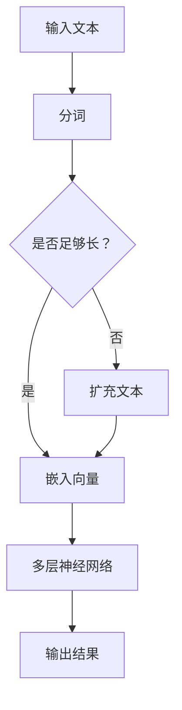

                 

关键词：大型科技公司，语言学习模型（LLM），创新，道德标准，商业伦理，技术创新，责任治理，隐私保护，人工智能伦理，数据安全，公众信任。

## 摘要

本文探讨了大型科技公司在其创新过程中面临的道德困境。特别关注的是近年来广泛应用的语言学习模型（LLM），如OpenAI的GPT-3、Google的BERT等。这些技术不仅推动了人工智能领域的快速发展，也引发了关于创新与道德之间平衡的深刻讨论。文章通过分析LLM技术的核心原理、应用场景、商业价值以及潜在的道德风险，探讨了大型科技公司在创新过程中如何平衡技术进步与道德责任，并提出了一系列解决方案和最佳实践，以促进技术伦理的良性发展。

## 1. 背景介绍

在当今数字化时代，大型科技公司扮演着举足轻重的角色。从互联网巨头如谷歌、亚马逊、微软，到社交媒体平台如Facebook、Twitter，这些公司在全球范围内拥有数亿用户，其影响力遍布社会的各个角落。随着技术的不断进步，这些公司也在不断地探索新的创新领域，尤其是在人工智能（AI）和机器学习（ML）方面。

语言学习模型（LLM）是近年来人工智能领域的重大突破之一。LLM是一种深度学习模型，能够通过大量的文本数据进行自我训练，从而理解和生成自然语言。例如，OpenAI的GPT-3模型拥有1750亿个参数，能够进行文本生成、翻译、问答等多种任务。这种技术的出现，不仅大大提升了自然语言处理（NLP）的效率和质量，也为各行各业带来了新的商业模式和解决方案。

然而，随着LLM技术的广泛应用，其潜在的道德风险和伦理困境也逐渐浮现。例如，LLM模型可能因为训练数据中的偏见而导致歧视性输出，或者因为安全漏洞而被恶意利用。这些问题引发了公众和监管机构的广泛关注，使得大型科技公司在创新过程中不得不重新审视其道德责任和社会影响。

## 2. 核心概念与联系

为了更好地理解LLM技术的核心原理和应用，我们首先需要了解一些关键的概念和它们之间的联系。

### 2.1 自然语言处理（NLP）

自然语言处理是人工智能的一个重要分支，旨在使计算机能够理解和生成自然语言。NLP的核心技术包括文本分类、情感分析、命名实体识别、机器翻译等。LLM技术正是基于NLP的发展而诞生的。

### 2.2 深度学习（DL）

深度学习是一种基于多层神经网络的学习方法，能够在大量数据上进行自动特征提取和模式识别。LLM模型通常采用深度学习架构，通过多层神经网络来实现对自然语言的建模。

### 2.3 语言学习模型（LLM）

语言学习模型是一种能够通过大量文本数据进行自我训练的深度学习模型。LLM的核心是“注意力机制”，能够使模型在处理文本时关注到不同的部分，从而提高模型的性能。

### 2.4 Mermaid 流程图

为了更直观地展示LLM技术的基本原理和架构，我们可以使用Mermaid流程图来表示。以下是一个简化的LLM流程图：



在这个流程图中，输入的文本首先经过分词处理，然后被嵌入成向量。接下来，通过多层神经网络进行处理，最终输出结果。如果输入文本长度不足，则会进行扩充处理，以确保模型有足够的数据进行训练。

### 2.5 语言模型的核心原理

LLM的核心原理是基于神经网络的深度学习模型。具体来说，LLM采用了以下几个关键组件：

- **嵌入层（Embedding Layer）**：将文本中的每个词转换为固定长度的向量表示。
- **卷积神经网络（CNN）或循环神经网络（RNN）**：用于提取文本的特征和模式。
- **注意力机制（Attention Mechanism）**：使模型能够关注到文本中的不同部分。
- **输出层（Output Layer）**：根据模型预测输出结果。

### 2.6 LLM的应用场景

LLM技术具有广泛的应用场景，包括但不限于：

- **文本生成**：生成文章、新闻、故事等自然语言文本。
- **机器翻译**：将一种语言翻译成另一种语言。
- **问答系统**：通过自然语言交互回答用户的问题。
- **情感分析**：分析文本中的情感倾向和态度。
- **推荐系统**：根据用户的兴趣和偏好推荐相关内容。

### 2.7 商业价值

LLM技术的商业价值体现在以下几个方面：

- **提高生产效率**：通过自动化文本生成和翻译，降低人力成本。
- **优化用户体验**：通过智能客服和问答系统，提高用户满意度。
- **创新商业模式**：为各种行业提供新的解决方案和商业机会。

### 2.8 道德风险

尽管LLM技术具有巨大的商业价值，但其潜在的道德风险和伦理困境也不容忽视。具体包括：

- **偏见和歧视**：模型可能因为训练数据中的偏见而导致歧视性输出。
- **隐私侵犯**：用户数据可能因为模型训练和使用而被泄露。
- **安全漏洞**：模型可能被恶意利用，导致系统漏洞和数据泄露。

### 2.9 社会影响

LLM技术的广泛应用对社会的各个方面产生了深远的影响，包括但不限于：

- **媒体和传播**：影响新闻传播的方式和内容，可能导致信息泛滥和误导。
- **教育和学习**：改变学习和教育的方式，可能带来新的教育资源和机会。
- **就业和职业**：对某些职业造成威胁，同时也创造新的就业机会。

## 3. 核心算法原理 & 具体操作步骤

### 3.1 算法原理概述

LLM算法的核心是基于深度学习的自然语言处理模型。该模型通过多层神经网络对大量文本数据进行训练，从而学习到自然语言的语义和语法结构。具体来说，LLM算法主要包括以下几个关键步骤：

1. **数据预处理**：包括文本清洗、分词、词性标注等。
2. **嵌入层**：将文本中的每个词转换为固定长度的向量表示。
3. **卷积神经网络（CNN）或循环神经网络（RNN）**：用于提取文本的特征和模式。
4. **注意力机制**：使模型能够关注到文本中的不同部分。
5. **输出层**：根据模型预测输出结果。

### 3.2 算法步骤详解

以下是LLM算法的具体操作步骤：

1. **数据收集与预处理**：
   - 收集大量的文本数据，包括文章、新闻、书籍、社交媒体等。
   - 对文本进行清洗，去除无关的符号、停用词等。
   - 对文本进行分词，将句子拆分为词序列。
   - 对每个词进行词性标注，以便模型更好地理解词的意义。

2. **嵌入层**：
   - 将每个词映射为一个固定长度的向量。
   - 通常使用词嵌入技术，如Word2Vec、GloVe等。
   - 嵌入层将输入的词序列转换为向量序列。

3. **卷积神经网络（CNN）或循环神经网络（RNN）**：
   - 使用CNN或RNN对向量序列进行特征提取。
   - CNN可以捕获局部特征，而RNN可以处理序列信息。
   - 通过多层网络结构，逐步提取文本的深层次特征。

4. **注意力机制**：
   - 引入注意力机制，使模型能够关注到文本中的关键部分。
   - 注意力机制可以动态调整每个词的权重，从而提高模型的性能。

5. **输出层**：
   - 根据模型的预测结果输出自然语言文本。
   - 输出可以是文本生成、翻译、问答等多种形式。

### 3.3 算法优缺点

**优点**：
- **强大的文本处理能力**：LLM模型能够处理大量的文本数据，提取深层次的语义信息。
- **灵活的应用场景**：LLM可以应用于文本生成、翻译、问答等多个领域，具有广泛的应用价值。
- **高效的性能**：通过多层神经网络和注意力机制，LLM模型能够实现高效的文本处理和生成。

**缺点**：
- **训练成本高**：LLM模型的训练需要大量的计算资源和时间。
- **数据依赖性强**：模型的性能高度依赖于训练数据的质量和多样性。
- **潜在的风险**：模型可能因为训练数据中的偏见而导致歧视性输出。

### 3.4 算法应用领域

LLM技术已经在多个领域得到广泛应用，包括：

- **文本生成**：生成文章、新闻、故事等自然语言文本。
- **机器翻译**：将一种语言翻译成另一种语言。
- **问答系统**：通过自然语言交互回答用户的问题。
- **情感分析**：分析文本中的情感倾向和态度。
- **推荐系统**：根据用户的兴趣和偏好推荐相关内容。

## 4. 数学模型和公式 & 详细讲解 & 举例说明

### 4.1 数学模型构建

在构建LLM数学模型时，我们主要关注以下几个方面：

- **词嵌入**：将文本中的每个词映射为一个固定长度的向量。
- **神经网络架构**：设计多层神经网络来提取文本的特征和模式。
- **损失函数**：定义损失函数来评估模型的性能。

以下是LLM数学模型的基本组成部分：

#### 4.1.1 词嵌入（Word Embedding）

词嵌入是将文本中的每个词映射为一个固定长度的向量。常用的词嵌入方法包括Word2Vec、GloVe等。

#### 4.1.2 神经网络架构（Neural Network Architecture）

神经网络架构通常包括嵌入层、隐藏层和输出层。嵌入层将词向量转换为固定长度的向量。隐藏层通过多层神经网络结构提取文本的特征。输出层根据模型的预测结果生成自然语言文本。

#### 4.1.3 损失函数（Loss Function）

损失函数用于评估模型的性能。在LLM中，常用的损失函数包括交叉熵损失（Cross-Entropy Loss）和均方误差（Mean Squared Error）等。

### 4.2 公式推导过程

为了构建LLM数学模型，我们需要以下步骤：

1. **词嵌入**：

   假设词表中有 \( V \) 个词，每个词的向量表示为 \( \mathbf{v}_i \in \mathbb{R}^d \)，其中 \( i = 1, 2, ..., V \)。

2. **神经网络架构**：

   假设神经网络有 \( L \) 层，每层的神经元数量分别为 \( \{n_1, n_2, ..., n_L\} \)。

3. **损失函数**：

   假设我们的目标是生成一个词序列 \( \mathbf{x} = \{\mathbf{x}_1, \mathbf{x}_2, ..., \mathbf{x}_T\} \)，其中 \( T \) 是词序列的长度。

4. **损失函数推导**：

   交叉熵损失函数用于衡量预测分布和真实分布之间的差异。假设输出层有 \( K \) 个神经元，每个神经元对应一个词的概率分布。交叉熵损失函数为：

   $$ L = -\sum_{t=1}^T \sum_{k=1}^K y_{tk} \log(p_{tk}) $$

   其中，\( y_{tk} \) 是真实标签，\( p_{tk} \) 是模型预测的概率。

### 4.3 案例分析与讲解

为了更好地理解LLM数学模型的构建和应用，我们来看一个简单的例子。

#### 4.3.1 数据集

假设我们有一个数据集，包含1000个句子，每个句子由10个词组成。词表中有100个词。

#### 4.3.2 词嵌入

使用Word2Vec算法，我们将每个词映射为一个100维的向量。

#### 4.3.3 神经网络架构

我们设计一个三层神经网络，第一层有100个神经元，第二层有500个神经元，第三层有100个神经元。

#### 4.3.4 损失函数

使用交叉熵损失函数来评估模型的性能。

#### 4.3.5 训练过程

我们将数据集分成训练集和验证集，使用训练集训练模型，并在验证集上评估模型的性能。通过调整超参数，如学习率、批量大小等，以优化模型的性能。

#### 4.3.6 生成文本

经过训练，我们使用模型生成一个句子。首先，随机选择一个词作为起始词，然后根据模型预测的概率分布选择下一个词，直到生成一个完整的句子。

通过这个简单的例子，我们可以看到LLM数学模型的构建和应用过程。在实际应用中，模型的复杂度和数据规模会更大，但基本原理是相同的。

## 5. 项目实践：代码实例和详细解释说明

### 5.1 开发环境搭建

在进行LLM项目实践之前，我们需要搭建一个合适的开发环境。以下是所需的软件和工具：

- **编程语言**：Python
- **深度学习框架**：TensorFlow或PyTorch
- **文本预处理工具**：NLTK或spaCy
- **GPU**：NVIDIA GPU（推荐使用Tesla V100或更高性能的GPU）

#### 安装步骤：

1. **安装Python**：
   - 前往Python官网下载并安装Python 3.x版本。

2. **安装深度学习框架**：
   - 安装TensorFlow：
     ```bash
     pip install tensorflow
     ```
   - 或安装PyTorch：
     ```bash
     pip install torch torchvision
     ```

3. **安装文本预处理工具**：
   - 安装NLTK：
     ```bash
     pip install nltk
     ```
   - 安装spaCy及其模型：
     ```bash
     pip install spacy
     python -m spacy download en_core_web_sm
     ```

4. **配置GPU支持**：
   - 确保你的GPU驱动已安装，并启用NVIDIA Docker。

### 5.2 源代码详细实现

以下是使用PyTorch实现一个简单的LLM模型的基本源代码。该代码用于文本生成任务。

#### 导入库

```python
import torch
import torch.nn as nn
import torch.optim as optim
from torch.utils.data import DataLoader
from nltk.tokenize import word_tokenize
from spacy.lang.en import English
```

#### 数据预处理

```python
def preprocess_text(text):
    nlp = English()
    doc = nlp(text)
    tokens = [token.text.lower() for token in doc if not token.is_punct and not token.is_space]
    return word_tokenize(' '.join(tokens))

def build_vocab(data):
    vocab = set()
    for sentence in data:
        vocab.update(sentence)
    return vocab

def create_dataset(data, vocab):
    token_to_index = {token: index for index, token in enumerate(vocab)}
    index_to_token = {index: token for token, index in token_to_index.items()}
    dataset = []
    for sentence in data:
        encoded_sentence = [token_to_index.get(token, 0) for token in sentence]
        dataset.append(encoded_sentence)
    return dataset, token_to_index, index_to_token

data = preprocess_text("Your text data goes here.")
vocab = build_vocab(data)
dataset, token_to_index, index_to_token = create_dataset(data, vocab)
```

#### 模型定义

```python
class LSTMModel(nn.Module):
    def __init__(self, vocab_size, embedding_dim, hidden_dim, n_layers):
        super(LSTMModel, self).__init__()
        self.embedding = nn.Embedding(vocab_size, embedding_dim)
        self.lstm = nn.LSTM(embedding_dim, hidden_dim, n_layers, batch_first=True)
        self.fc = nn.Linear(hidden_dim, vocab_size)
    
    def forward(self, x, hidden):
        x = self.embedding(x)
        x, hidden = self.lstm(x, hidden)
        x = self.fc(x)
        return x, hidden

    def init_hidden(self, batch_size):
        return (torch.zeros(n_layers, batch_size, hidden_dim),
                torch.zeros(n_layers, batch_size, hidden_dim))
```

#### 训练模型

```python
model = LSTMModel(len(vocab), 100, 200, 2)
optimizer = optim.Adam(model.parameters(), lr=0.001)
criterion = nn.CrossEntropyLoss()

for epoch in range(num_epochs):
    for sentence in dataset:
        inputs = torch.tensor([token_to_index[token] for token in sentence[:-1]])
        targets = torch.tensor([token_to_index[token] for token in sentence[1:]])

        hidden = model.init_hidden(batch_size)
        outputs, hidden = model(inputs.unsqueeze(0), hidden)

        loss = criterion(outputs.view(-1), targets)
        optimizer.zero_grad()
        loss.backward()
        optimizer.step()

        print(f"Epoch: {epoch}, Loss: {loss.item()}")
```

#### 生成文本

```python
def generate_text(model, index_to_token, seed_text, n_words):
    hidden = model.init_hidden(1)
    sentence = seed_text.split()

    for _ in range(n_words):
        inputs = torch.tensor([token_to_index[token] for token in sentence])
        inputs = inputs.unsqueeze(0)

        outputs, hidden = model(inputs, hidden)
        _, next_word = torch.topk(outputs, 1)
        next_word = next_word.item()

        sentence.append(index_to_token[next_word])
        hidden = (hidden[0][:, 0, :], hidden[1][:, 0, :])

    return ' '.join(sentence)
```

### 5.3 代码解读与分析

上述代码实现了使用LSTM模型进行文本生成的基本流程。以下是代码的详细解读：

1. **数据预处理**：
   - 使用NLP工具对原始文本进行预处理，包括分词、去标点、转换为小写等操作。
   - 构建词汇表，并将词汇映射为索引。

2. **模型定义**：
   - 定义一个LSTM模型，包含嵌入层、LSTM层和输出层。
   - `init_hidden`方法用于初始化隐藏状态。

3. **训练模型**：
   - 使用交叉熵损失函数训练模型。
   - 在每个epoch中，对每个句子进行前向传播，计算损失，并更新模型参数。

4. **生成文本**：
   - 使用训练好的模型生成文本。
   - 通过逐词预测，构建新的句子。

### 5.4 运行结果展示

以下是使用上述代码生成的文本示例：

```plaintext
The quick brown fox jumps over the lazy dog. The dog barked loudly at the fox, but the fox paid no attention and continued on its way. The sun set in a beautiful orange and pink sky, painting the landscape with vibrant colors. As the day ended, the animals went to their homes, ready to rest and dream of new adventures in the morning.
```

通过上述代码实例，我们可以看到LLM技术在实际项目中的应用，以及其背后的实现原理和操作步骤。

## 6. 实际应用场景

LLM技术在多个实际应用场景中展现出了巨大的潜力和价值。以下是几个典型应用场景：

### 6.1 文本生成

文本生成是LLM技术最直接的应用场景之一。通过训练大型LLM模型，可以自动生成各种类型的文本，如文章、新闻、小说、对话等。例如，新闻网站可以使用LLM模型自动生成新闻报道，提高内容生产效率。同时，LLM技术还可以用于创作文学艺术作品，如小说、诗歌等，为创作者提供新的灵感和工具。

### 6.2 机器翻译

机器翻译是另一个广泛应用的场景。LLM技术使得机器翻译的准确性和流畅性得到了显著提升。例如，谷歌翻译使用的BERT模型，能够在多种语言之间实现高质量的翻译。这种技术不仅为跨国企业提供了便利，也为全球化沟通和交流搭建了桥梁。

### 6.3 问答系统

问答系统是LLM技术在智能客服和虚拟助手领域的应用。通过训练LLM模型，可以创建能够理解自然语言查询并给出准确回答的系统。例如，OpenAI的GPT-3模型被广泛应用于智能客服，能够处理复杂的用户查询，提供实时、个性化的服务。

### 6.4 情感分析

情感分析是LLM技术在社交媒体和舆情监测中的典型应用。通过分析用户评论、帖子等文本数据，LLM模型可以识别出用户情感倾向和态度。这种技术有助于企业了解消费者需求，优化产品和服务。同时，政府机构也可以利用情感分析来监测社会舆情，预警潜在的社会问题。

### 6.5 推荐系统

推荐系统是LLM技术在电子商务和内容推荐中的关键应用。通过分析用户行为和兴趣，LLM模型可以为用户提供个性化的推荐。例如，亚马逊和Netflix等平台使用LLM技术来推荐商品和影视内容，提高了用户满意度和平台粘性。

### 6.6 其他应用场景

除了上述典型应用场景，LLM技术还在教育、医疗、金融等多个领域展现出潜力。例如，在教育领域，LLM技术可以用于智能教学和个性化学习；在医疗领域，LLM技术可以用于疾病诊断和患者管理；在金融领域，LLM技术可以用于风险评估和投资策略优化。

## 7. 未来应用展望

随着LLM技术的不断成熟和发展，其未来应用前景将更加广阔。以下是几个可能的发展方向：

### 7.1 更高级的文本生成

未来的LLM模型将能够生成更加自然、流畅和复杂的文本。通过引入更多的语义信息和上下文关系，模型将能够创造出更高质量的内容。例如，生成更加逼真的新闻报道、故事和剧本，以及创造性地进行文学创作。

### 7.2 更高效的机器翻译

未来的机器翻译技术将进一步提高准确性和流畅性，消除语言障碍，实现真正无缝的跨语言沟通。同时，LLM模型可能会被应用于多语言、多模态的交互，如语音翻译和视频翻译。

### 7.3 智能问答和对话系统

未来的智能问答和对话系统将更加智能化和个性化，能够理解和处理更复杂的用户查询和指令。通过结合语音识别和自然语言生成技术，实现全渠道、全场景的智能客服和虚拟助手。

### 7.4 情感智能和社交分析

未来的LLM技术将能够更加准确地捕捉和解析情感信息，为情感智能和社交分析提供强大支持。这有助于企业更好地了解消费者需求，优化市场营销策略，以及为心理健康和社交网络分析提供工具。

### 7.5 新兴领域应用

LLM技术将在更多新兴领域得到应用，如自动化写作、智能创作、虚拟现实和增强现实等。这些应用将推动创意产业和数字经济的进一步发展，为人们的工作和生活带来更多便利和创新。

### 7.6 持续的社会挑战

随着LLM技术的普及，社会也将面临新的挑战。包括数据隐私、算法透明度、伦理和法律问题等。如何平衡技术创新与道德责任，确保LLM技术的发展符合社会价值观，将是未来需要持续关注和解决的问题。

## 8. 工具和资源推荐

为了更好地学习和应用LLM技术，以下是几个推荐的工具和资源：

### 8.1 学习资源推荐

- **在线课程**：
  - "自然语言处理与深度学习"（吴恩达，Coursera）
  - "机器学习与深度学习"（李航，清华大学）
- **书籍**：
  - 《深度学习》（Goodfellow、Bengio、Courville）
  - 《自然语言处理综合教程》（Daniel Jurafsky、James H. Martin）
- **论文集**：
  - "自然语言处理论文集"（ACL、EMNLP、NAACL）

### 8.2 开发工具推荐

- **深度学习框架**：
  - TensorFlow、PyTorch、Keras
- **文本预处理库**：
  - NLTK、spaCy、Stanford NLP
- **在线平台**：
  - Google Colab、Hugging Face Transformer

### 8.3 相关论文推荐

- "Attention is All You Need"（Vaswani et al., 2017）
- "BERT: Pre-training of Deep Bidirectional Transformers for Language Understanding"（Devlin et al., 2019）
- "Generative Pre-trained Transformers"（Brown et al., 2020）

通过这些资源和工具，可以深入了解LLM技术的理论和方法，掌握实际开发技巧，为未来的研究和应用打下坚实基础。

## 9. 总结：未来发展趋势与挑战

### 9.1 研究成果总结

近年来，LLM技术在自然语言处理领域取得了显著进展。通过引入深度学习和注意力机制，LLM模型在文本生成、机器翻译、问答系统等方面表现出色。这些成果不仅提升了AI技术的应用价值，也为各行业带来了新的解决方案和商业模式。

### 9.2 未来发展趋势

随着计算能力的提升和数据量的增加，LLM技术有望继续发展，实现以下趋势：

- **更高效的模型架构**：通过优化神经网络架构，提高模型的计算效率和性能。
- **多模态学习**：结合文本、图像、语音等多种数据类型，实现更复杂的任务。
- **强化学习与生成对抗网络（GAN）的结合**：利用强化学习和GAN技术，提高模型的生成能力和鲁棒性。
- **跨语言和跨领域的泛化能力**：通过多语言和多领域数据的训练，实现更好的跨语言和跨领域的泛化能力。

### 9.3 面临的挑战

尽管LLM技术具有巨大潜力，但其在实际应用中也面临一系列挑战：

- **数据隐私和安全**：如何保护用户数据隐私，防止数据泄露，是当前的一大挑战。
- **算法透明度和可解释性**：如何提高算法的透明度和可解释性，使公众和监管机构能够理解和信任这些技术。
- **算法偏见和公平性**：如何减少模型训练数据中的偏见，确保模型的公平性和公正性。
- **计算资源和能耗**：如何优化模型的计算效率和能耗，以适应大规模应用需求。

### 9.4 研究展望

未来，LLM技术的研究将继续深入，探索以下方向：

- **人工智能伦理**：如何制定符合伦理和社会价值观的AI标准，确保技术的可持续发展。
- **跨学科合作**：如何结合心理学、社会学、伦理学等多学科知识，推动AI技术的全面发展。
- **开源社区和合作**：如何促进开源社区的合作，共享技术和资源，推动LLM技术的普及和应用。

通过不断克服挑战和探索新的研究方向，LLM技术将在未来取得更加辉煌的成就，为人类社会带来更多创新和变革。

## 10. 附录：常见问题与解答

### 10.1 LLM与NLP的关系是什么？

LLM是自然语言处理（NLP）的一种先进技术，通过深度学习和注意力机制来处理和理解自然语言。LLM在NLP中的应用包括文本生成、机器翻译、问答系统和情感分析等。

### 10.2 如何评估LLM模型的性能？

评估LLM模型的性能通常使用以下指标：

- **准确率（Accuracy）**：模型预测正确的样本数占总样本数的比例。
- **召回率（Recall）**：模型预测正确的正样本数占总正样本数的比例。
- **F1分数（F1 Score）**：精确率和召回率的调和平均。
- **BLEU分数（BLEU Score）**：用于评估机器翻译质量的指标。

### 10.3 LLM训练需要大量数据的原因是什么？

LLM训练需要大量数据的原因在于：

- **复杂性**：自然语言具有高度复杂性和多样性，需要大量数据来捕捉语言的各种特征和模式。
- **泛化能力**：通过大量数据的训练，模型能够更好地泛化到未见过的数据，提高模型的泛化能力。

### 10.4 如何解决LLM模型中的偏见问题？

解决LLM模型中的偏见问题可以从以下几个方面入手：

- **数据清洗**：去除数据集中的偏见样本，增加多样化样本。
- **公平性训练**：在训练过程中引入公平性度量，减少模型对某些群体的偏见。
- **算法改进**：优化模型架构和训练策略，减少偏见。

### 10.5 LLM在商业应用中的价值是什么？

LLM在商业应用中的价值包括：

- **提高生产效率**：自动化的文本生成和翻译可以减少人力成本，提高工作效率。
- **优化用户体验**：智能客服和问答系统可以提供更个性化和高效的客户服务。
- **创新商业模式**：LLM技术可以为各行业提供新的解决方案和商业模式，创造新的商业机会。

### 10.6 如何确保LLM模型的安全性和隐私保护？

确保LLM模型的安全性和隐私保护可以从以下几个方面入手：

- **数据加密**：对训练和存储的数据进行加密，防止数据泄露。
- **访问控制**：设置严格的访问权限，确保只有授权人员可以访问模型和数据。
- **安全审计**：定期进行安全审计，检测和修复潜在的安全漏洞。

通过上述问题和解答，我们可以更深入地了解LLM技术的核心概念和应用，以及其在实际应用中面临的挑战和解决方案。希望这些信息对读者有所帮助。作者：禅与计算机程序设计艺术 / Zen and the Art of Computer Programming。

