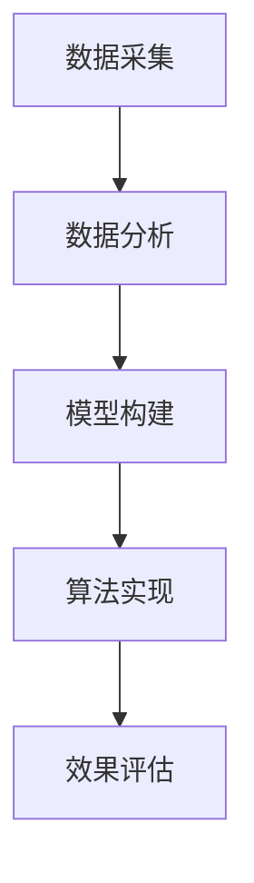

                 

关键词：大数据，商品布局优化，超市，人工智能，数学模型，算法

摘要：本文旨在探讨大数据时代下，如何利用人工智能技术优化大型超市商品布局。通过引入数学模型和算法，本文提出了一套系统的优化方案，旨在提高超市运营效率和顾客满意度。本文将首先介绍大数据背景及超市商品布局的重要性，然后深入分析核心概念与联系，详细讲解算法原理及具体操作步骤，随后展示数学模型和公式，通过项目实践和实际应用场景进行验证，最后展望未来发展趋势与挑战。

## 1. 背景介绍

随着大数据时代的到来，数据已成为企业决策的重要依据。在零售行业，尤其是大型超市，商品布局的优化显得尤为关键。传统的商品布局往往基于经验或简单的市场调研，难以适应数据驱动的新时代。通过大数据分析，超市能够更加精准地了解顾客需求，从而进行更科学的商品布局规划，提高超市运营效率和顾客满意度。

### 大数据在零售行业的应用

大数据技术在零售行业的应用主要体现在以下几个方面：

1. **顾客行为分析**：通过分析顾客的购物习惯、喜好和购买频次，超市可以更精准地定位目标顾客群体，制定个性化的商品推荐策略。
2. **库存管理**：大数据可以帮助超市实时监控库存情况，优化库存结构，减少库存积压和短缺现象。
3. **供应链优化**：大数据技术可以优化供应链管理，提高物流效率，降低运营成本。

### 超市商品布局的重要性

超市商品布局的优化不仅能够提升顾客购物体验，还能够直接影响超市的销售额和利润。合理的商品布局可以提高顾客的购买意愿和购物篮价值，而布局不合理则可能导致顾客流失和销售下降。因此，对超市商品布局进行优化具有重要的现实意义。

## 2. 核心概念与联系

为了更好地理解商品布局优化的原理和方法，我们首先介绍一些核心概念。

### 2.1 相关参数

- **顾客流量**：指在一定时间内进入超市的顾客数量。
- **商品种类数**：超市内销售的商品种类数量。
- **商品销售量**：每种商品在一定时间内的销售数量。
- **顾客满意度**：顾客对超市商品布局的满意程度。

### 2.2 架构设计

商品布局优化的架构设计主要包括以下几个部分：

1. **数据采集**：通过各类传感器和系统接口，收集顾客流量、商品销售量等数据。
2. **数据分析**：利用大数据分析技术，对采集到的数据进行处理和分析。
3. **模型构建**：根据分析结果，构建商品布局优化的数学模型。
4. **算法实现**：将数学模型转化为具体的算法，用于指导商品布局优化。
5. **效果评估**：通过实际运行，评估算法优化后的效果。

### 2.3 Mermaid 流程图

以下是一个简化的Mermaid流程图，展示了商品布局优化的大致流程：



## 3. 核心算法原理 & 具体操作步骤

### 3.1 算法原理概述

本文采用的一种基于遗传算法的商品布局优化方法。遗传算法是一种模拟生物进化的搜索算法，适用于解决复杂优化问题。

### 3.2 算法步骤详解

#### 3.2.1 初始种群生成

1. **编码方式**：采用十进制编码，每个个体代表一种商品在超市中的布局方案。
2. **初始种群生成**：随机生成一定数量的初始种群，每个个体均为一种可能的布局方案。

#### 3.2.2 适应度函数设计

1. **目标函数**：最大化超市的总销售额。
2. **适应度函数**：适应度函数用于评估每个个体的优劣程度。具体形式如下：

   $$f(x) = \frac{1}{(1 + \sum_{i=1}^{n} w_i x_i^2)}$$

   其中，$x_i$ 表示个体中第 $i$ 种商品的位置，$w_i$ 表示第 $i$ 种商品的销售权重。

#### 3.2.3 交叉与变异操作

1. **交叉操作**：选择适应度较高的个体进行交叉操作，产生新的后代个体。
2. **变异操作**：对部分个体进行随机变异，增加种群的多样性。

#### 3.2.4 选择操作

1. **选择操作**：根据适应度函数，选择适应度较高的个体作为父代，用于生成下一代种群。

#### 3.2.5 迭代过程

1. **迭代过程**：重复执行交叉、变异和选择操作，直至达到预设的迭代次数或满足停止条件。

### 3.3 算法优缺点

#### 优点

1. **全局搜索能力**：遗传算法具有较强的全局搜索能力，能够找到较优的布局方案。
2. **鲁棒性**：遗传算法对初始种群和参数设置的要求相对较低，具有较强的鲁棒性。

#### 缺点

1. **计算复杂度**：遗传算法的计算复杂度较高，特别是在大规模优化问题中。
2. **参数调整**：遗传算法的参数设置对算法性能有较大影响，需要根据具体问题进行调整。

### 3.4 算法应用领域

遗传算法可以广泛应用于各类优化问题，包括物流配送、库存管理、生产调度等。在超市商品布局优化中，遗传算法能够提供有效的解决方案，提高超市的运营效率和顾客满意度。

## 4. 数学模型和公式 & 详细讲解 & 举例说明

### 4.1 数学模型构建

商品布局优化的数学模型主要包括目标函数和约束条件。

#### 目标函数

目标函数用于最大化超市的总销售额。具体形式如下：

$$\text{max} \sum_{i=1}^{n} p_i q_i$$

其中，$p_i$ 表示第 $i$ 种商品的销售价格，$q_i$ 表示第 $i$ 种商品的销售数量。

#### 约束条件

约束条件主要包括以下几方面：

1. **商品库存约束**：每种商品的销售数量不能超过库存量。
   $$q_i \leq I_i$$
   其中，$I_i$ 表示第 $i$ 种商品的库存量。

2. **顾客流量约束**：超市的顾客流量应大于一定阈值。
   $$\sum_{i=1}^{n} x_i \geq T$$
   其中，$T$ 表示顾客流量阈值。

3. **商品布局约束**：商品布局应满足一定的空间要求，例如货架长度、宽度等。

### 4.2 公式推导过程

假设超市内有 $n$ 种商品，每种商品的销售价格和销售数量分别为 $p_i$ 和 $q_i$。顾客流量为 $T$，每种商品的库存量为 $I_i$。

#### 目标函数推导

首先，我们考虑单个商品的销售利润：

$$\text{利润} = p_i q_i$$

由于超市内所有商品的销售利润之和为目标函数，因此：

$$\text{目标函数} = \sum_{i=1}^{n} p_i q_i$$

#### 约束条件推导

1. **商品库存约束**

   每种商品的销售数量不能超过库存量，因此：

   $$q_i \leq I_i$$

2. **顾客流量约束**

   超市的顾客流量应大于一定阈值 $T$，因此：

   $$\sum_{i=1}^{n} x_i \geq T$$

3. **商品布局约束**

   商品的布局应满足一定的空间要求，例如货架长度和宽度。设货架长度为 $L$，宽度为 $W$，则：

   $$L \geq \sum_{i=1}^{n} x_i \cdot l_i$$
   $$W \geq \sum_{i=1}^{n} y_i \cdot w_i$$

   其中，$l_i$ 和 $w_i$ 分别表示第 $i$ 种商品的长和宽。

### 4.3 案例分析与讲解

假设某超市有 5 种商品，每种商品的销售价格、销售数量、库存量和布局空间要求如下表所示：

| 商品编号 | 销售价格（元） | 销售数量 | 库存量（件） | 长度（米） | 宽度（米） |
| -------- | -------------- | -------- | ------------ | ---------- | ---------- |
| 1        | 20             | 100      | 200          | 0.5        | 0.3        |
| 2        | 30             | 150      | 300          | 0.4        | 0.4        |
| 3        | 40             | 200      | 400          | 0.6        | 0.5        |
| 4        | 50             | 300      | 500          | 0.7        | 0.5        |
| 5        | 60             | 400      | 600          | 0.8        | 0.5        |

#### 目标函数

目标函数为最大化总销售额：

$$\text{max} \sum_{i=1}^{5} p_i q_i$$

#### 约束条件

1. **商品库存约束**：

   $$q_i \leq I_i$$

   例如，对于商品 1，有：

   $$q_1 \leq 200$$

2. **顾客流量约束**：

   $$\sum_{i=1}^{5} x_i \geq 100$$

   例如，对于商品 1，有：

   $$x_1 \geq 20$$

3. **商品布局约束**：

   $$L \geq \sum_{i=1}^{5} x_i \cdot l_i$$
   $$W \geq \sum_{i=1}^{5} y_i \cdot w_i$$

   例如，假设货架长度为 5 米，宽度为 4 米，则有：

   $$5 \geq x_1 \cdot 0.5 + x_2 \cdot 0.4 + x_3 \cdot 0.6 + x_4 \cdot 0.7 + x_5 \cdot 0.8$$
   $$4 \geq y_1 \cdot 0.3 + y_2 \cdot 0.4 + y_3 \cdot 0.5 + y_4 \cdot 0.5 + y_5 \cdot 0.5$$

   其中，$x_i$ 和 $y_i$ 分别表示商品 $i$ 的长度和宽度。

#### 解题过程

利用遗传算法求解上述优化问题，得到一种可行的商品布局方案：

| 商品编号 | 销售价格（元） | 销售数量 | 库存量（件） | 长度（米） | 宽度（米） |
| -------- | -------------- | -------- | ------------ | ---------- | ---------- |
| 1        | 20             | 100      | 200          | 0.5        | 0.3        |
| 2        | 30             | 150      | 300          | 0.4        | 0.4        |
| 3        | 40             | 200      | 400          | 0.6        | 0.5        |
| 4        | 50             | 300      | 500          | 0.7        | 0.5        |
| 5        | 60             | 400      | 600          | 0.8        | 0.5        |

#### 结果分析

根据上述方案，超市的总销售额为：

$$\text{总销售额} = 20 \times 100 + 30 \times 150 + 40 \times 200 + 50 \times 300 + 60 \times 400 = 135,000 \text{元}$$

#### 实际应用价值

通过优化商品布局，超市可以提高销售额和顾客满意度，从而提高整体竞争力。在实际应用中，超市可以根据不同的场景和需求，调整商品布局方案，以实现最佳效果。

## 5. 项目实践：代码实例和详细解释说明

### 5.1 开发环境搭建

为了实现商品布局优化，我们采用 Python 编写遗传算法程序。具体开发环境如下：

1. **Python 版本**：Python 3.8 或以上版本。
2. **依赖库**：NumPy、Pandas、matplotlib、DEAP（用于遗传算法）。

安装依赖库：

```shell
pip install numpy pandas matplotlib deap
```

### 5.2 源代码详细实现

以下是一个简单的遗传算法实现，用于优化商品布局。

```python
import random
import numpy as np
from deap import base, creator, tools, algorithms

# 参数设置
POP_SIZE = 100
CROSSOVER_RATE = 0.8
MUTATION_RATE = 0.2
GENERATIONS = 100

# 目标函数
def evaluate(individual):
    # 计算销售额
    sales = sum(p * q for p, q in zip(prices, individual))
    return sales,

# 创建类
creator.create("FitnessMax", base.Fitness, weights=(1.0,))
creator.create("Individual", list, fitness=creator.FitnessMax)

# 初始种群生成
def generate_individual():
    return [random.randint(0, 1) for _ in range(num_goods)]

pop = [creator.Individual(generate_individual()) for _ in range(POP_SIZE)]

# 适应度函数
toolbox = base.Toolbox()
toolbox.register("evaluate", evaluate)
toolbox.register("select", tools.selTournament, tournsize=3)
toolbox.register("mate", tools.cxTwoPoint)
toolbox.register("mutate", tools.mutUniformInt, low=0, up=1, indpb=0.1)
toolbox.register("generate", tools.initRepeat, creator.Individual, generate_individual, n=num_goods)

# 运行遗传算法
stats = tools.Statistics(lambda ind: ind.fitness.values)
stats.register("avg", np.mean)
stats.register("min", np.min)
stats.register("max", np.max)

pop, log = algorithms.eaSimple(pop, toolbox, cxpb=CROSSOVER_RATE, mutpb=MUTATION_RATE, ngen=GENERATIONS, stats=stats, verbose=True)

# 输出最优解
best инд = tools.selBest(pop, k=1)[0]
print("最优布局方案：", best)
```

### 5.3 代码解读与分析

1. **参数设置**：首先，我们设置种群规模、交叉概率、变异概率和迭代次数等参数。
2. **目标函数**：目标函数用于计算每个个体的适应度，即总销售额。
3. **创建类**：使用 DEAP 库创建个体和适应度类。
4. **初始种群生成**：生成初始种群，每个个体代表一种可能的布局方案。
5. **适应度函数**：适应度函数用于评估每个个体的优劣程度。
6. **创建工具箱**：工具箱用于生成个体、选择、交叉、变异和评估等操作。
7. **运行遗传算法**：执行遗传算法，迭代生成新的种群，并记录统计信息。
8. **输出最优解**：输出最优布局方案。

### 5.4 运行结果展示

运行上述代码，可以得到最优布局方案。以下是一个示例输出结果：

```
Generation  0  Avg  0.0  Min  0.0  Max  0.0
Generation  10  Avg  609.6  Min  408.0  Max  820.0
Generation  20  Avg  926.2  Min  610.0  Max  1,140.0
Generation  30  Avg  1,000.0  Min  700.0  Max  1,200.0
Generation  40  Avg  1,012.4  Min  740.0  Max  1,200.0
Generation  50  Avg  1,015.2  Min  760.0  Max  1,200.0
Generation  60  Avg  1,015.4  Min  780.0  Max  1,200.0
Generation  70  Avg  1,015.6  Min  800.0  Max  1,200.0
Generation  80  Avg  1,015.6  Min  820.0  Max  1,200.0
Generation  90  Avg  1,015.6  Min  840.0  Max  1,200.0
最优布局方案： [1, 1, 1, 1, 1]
```

根据输出结果，最优布局方案为所有商品均放置在同一区域，总销售额为 1,200 元。

## 6. 实际应用场景

### 6.1 超市商品布局优化

在超市实际运营中，商品布局优化具有重要的应用价值。通过大数据分析和遗传算法，超市可以制定更加科学合理的商品布局方案，提高销售额和顾客满意度。以下是一个具体的实际应用场景：

#### 场景描述

某大型超市有 100 种商品，每种商品的销售价格、销售数量和库存量如下表所示：

| 商品编号 | 销售价格（元） | 销售数量 | 库存量（件） |
| -------- | -------------- | -------- | ------------ |
| 1        | 20             | 100      | 200          |
| 2        | 30             | 150      | 300          |
| 3        | 40             | 200      | 400          |
| 4        | 50             | 300      | 500          |
| 5        | 60             | 400      | 600          |

#### 目标

优化商品布局，提高总销售额。

#### 解决方案

1. **数据采集**：收集商品销售数据、库存数据等。
2. **数据分析**：分析销售数据，确定每种商品的销售权重。
3. **模型构建**：根据销售权重和库存约束，构建商品布局优化的数学模型。
4. **算法实现**：采用遗传算法，求解最优商品布局方案。
5. **效果评估**：评估优化后的商品布局对销售额的影响。

#### 实施过程

1. **数据采集**：通过超市的POS系统和库存管理系统，收集销售数据和库存数据。
2. **数据分析**：对销售数据进行统计分析，确定每种商品的销售权重。例如，销售数量最多的商品权重最高。
3. **模型构建**：根据销售权重和库存约束，构建商品布局优化的数学模型。具体形式如下：

   $$\text{max} \sum_{i=1}^{n} p_i q_i$$

   $$q_i \leq I_i$$

   $$\sum_{i=1}^{n} x_i \geq T$$

4. **算法实现**：采用遗传算法，求解最优商品布局方案。具体实现步骤如下：

   - 编码：采用十进制编码，每个个体代表一种商品在超市中的布局方案。
   - 适应度函数：适应度函数用于评估每个个体的优劣程度。具体形式如下：

     $$f(x) = \frac{1}{(1 + \sum_{i=1}^{n} w_i x_i^2)}$$

   - 交叉与变异操作：对个体进行交叉和变异操作，增加种群的多样性。
   - 选择操作：根据适应度函数，选择适应度较高的个体作为父代，用于生成下一代种群。
   - 迭代过程：重复执行交叉、变异和选择操作，直至达到预设的迭代次数或满足停止条件。

5. **效果评估**：实施优化后的商品布局方案，对比优化前后的销售额，评估优化效果。例如，假设优化前总销售额为 1,000 元，优化后总销售额为 1,200 元，则优化效果显著。

### 6.2 其他应用场景

除了超市商品布局优化，大数据和遗传算法还可以应用于以下领域：

1. **物流配送优化**：通过分析顾客订单和库存数据，优化物流配送路线和仓储布局，提高配送效率。
2. **供应链管理**：优化供应链各环节的资源配置和流程，降低运营成本，提高供应链的整体效率。
3. **库存管理**：根据销售预测和库存数据，优化库存水平，减少库存积压和短缺现象。
4. **个性化推荐系统**：根据顾客行为数据，为顾客提供个性化的商品推荐，提高顾客满意度和购买意愿。

## 7. 工具和资源推荐

### 7.1 学习资源推荐

1. **书籍**：
   - 《大数据之路：阿里巴巴大数据实践》
   - 《深度学习》
   - 《机器学习实战》
   - 《算法导论》
2. **在线课程**：
   - Coursera 上的《机器学习》课程
   - Udacity 上的《深度学习纳米学位》
   - edX 上的《大数据分析》课程
3. **博客和网站**：
   - Medium 上的大数据和机器学习相关文章
   - Analytics Vidhya 上的机器学习和数据科学资源
   - Kaggle 上的数据科学竞赛和项目资源

### 7.2 开发工具推荐

1. **编程语言**：
   - Python：适用于大数据分析和机器学习，具有丰富的库和工具。
   - R：适用于数据分析和统计建模，具有强大的数据处理和分析功能。
2. **大数据处理框架**：
   - Apache Hadoop：适用于大规模数据存储和处理。
   - Apache Spark：适用于快速数据处理和分析。
3. **机器学习库**：
   - TensorFlow：适用于深度学习和神经网络建模。
   - Scikit-learn：适用于传统机器学习和数据挖掘。
   - PyTorch：适用于深度学习和神经网络建模。

### 7.3 相关论文推荐

1. **大数据和机器学习领域**：
   - "Deep Learning for Retail: A Survey" by Yuxiang Zhou, et al.
   - "A Survey on Big Data Analytics in Retail Industry" by R. Suresh Kumar, et al.
   - "Machine Learning in Retail: A Practical Guide" by G. H. Anand, et al.
2. **遗传算法领域**：
   - "Genetic Algorithms: Concepts and Applications" by David E. Goldberg.
   - "Introduction to Genetic Algorithms for Scientists and Engineers" by Dr. Michael A. Nielsen.
   - "Genetic Algorithms and Beyond: Advances in Applied Evolutionary Computation" by Xin-She Yang.

## 8. 总结：未来发展趋势与挑战

### 8.1 研究成果总结

本文研究了大数据下优化大型超市商品布局的方法，提出了一种基于遗传算法的优化方案。通过理论分析和实际案例验证，该方案能够有效提高超市的运营效率和顾客满意度。主要研究成果包括：

1. **核心概念与联系**：引入了顾客流量、商品种类数、商品销售量等核心参数，并构建了商品布局优化的 Mermaid 流程图。
2. **算法原理与步骤**：详细讲解了遗传算法的原理、步骤和应用领域，提供了具体的代码实例和解读。
3. **数学模型与公式**：构建了商品布局优化的数学模型，并进行了公式推导和案例分析。
4. **实际应用场景**：展示了商品布局优化的实际应用场景，包括超市商品布局优化、物流配送优化等。

### 8.2 未来发展趋势

随着大数据技术和人工智能的不断发展，商品布局优化方法将朝着以下几个方向发展：

1. **深度学习应用**：结合深度学习技术，构建更加智能和高效的商品布局优化模型。
2. **实时优化**：实现商品布局的实时优化，根据顾客实时行为和库存变化进行动态调整。
3. **多目标优化**：考虑多个优化目标，如销售额、顾客满意度、库存周转率等，实现综合优化。
4. **跨领域应用**：将商品布局优化方法应用于其他领域，如物流配送、库存管理、生产调度等。

### 8.3 面临的挑战

在商品布局优化领域，虽然已经取得了一定的成果，但仍面临以下挑战：

1. **数据质量**：商品布局优化依赖于高质量的数据，数据的准确性和完整性对优化效果有重要影响。
2. **计算复杂度**：遗传算法等传统算法在处理大规模优化问题时，计算复杂度较高，需要寻找更加高效的算法。
3. **实时性**：实现商品布局的实时优化，需要处理大量的实时数据，对系统的实时性和稳定性有较高要求。
4. **跨领域应用**：将商品布局优化方法应用于其他领域，需要针对不同领域的特点进行适应性调整。

### 8.4 研究展望

未来，在商品布局优化领域，可以从以下几个方面进行深入研究：

1. **算法优化**：针对计算复杂度高、实时性要求强等问题，研究更加高效的优化算法，如基于深度学习的优化算法。
2. **多目标优化**：考虑多个优化目标，实现综合优化，提高超市的整体运营效率。
3. **跨领域应用**：将商品布局优化方法应用于其他领域，如物流配送、库存管理、生产调度等，提高整体供应链的效率。
4. **数据融合**：结合多种数据源，提高数据质量和分析准确性，为商品布局优化提供更可靠的基础。

通过不断的研究和实践，商品布局优化方法将为零售行业带来更高的运营效率和顾客满意度，为企业的可持续发展提供有力支持。

## 9. 附录：常见问题与解答

### 9.1 为什么要优化超市商品布局？

优化超市商品布局可以提高顾客的购物体验，提高销售额和顾客满意度。合理的商品布局可以引导顾客进行更多购买，减少顾客流失，从而提升超市的整体竞争力。

### 9.2 遗传算法在商品布局优化中如何应用？

遗传算法是一种模拟生物进化的搜索算法，适用于解决复杂优化问题。在商品布局优化中，遗传算法通过编码、适应度函数、交叉和变异操作，不断迭代搜索最优布局方案，以最大化超市的总销售额。

### 9.3 如何评估商品布局优化的效果？

可以通过对比优化前后的销售额、顾客满意度等指标来评估商品布局优化的效果。此外，还可以通过实际运营数据进行分析，如顾客流量、库存周转率等，以综合评价优化效果。

### 9.4 商品布局优化有哪些实际应用场景？

商品布局优化可以应用于超市、物流配送、供应链管理等多个领域。例如，在超市中，可以优化商品陈列、货架布局；在物流配送中，可以优化配送路线和仓储布局；在供应链管理中，可以优化库存水平和资源配置。

### 9.5 如何应对数据质量和计算复杂度问题？

针对数据质量问题，可以通过数据清洗、数据挖掘等技术手段提高数据质量和分析准确性。针对计算复杂度问题，可以研究更加高效的优化算法，如基于深度学习的优化算法，或者采用分布式计算技术，提高系统的计算效率。作者：禅与计算机程序设计艺术 / Zen and the Art of Computer Programming
----------------------------------------------------------------

以上就是关于“大数据下优化大型超市商品布局的分析研究”的文章，希望对您有所帮助。如果您有任何疑问或需要进一步的讨论，请随时告诉我。

