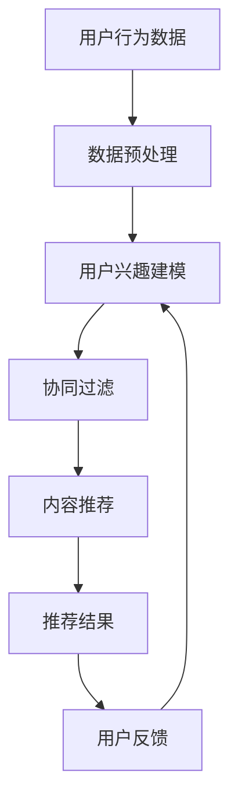

                 

关键词：大数据、人工智能、电商搜索推荐、算法优化、用户体验

> 摘要：本文探讨了大数据与AI技术相结合，为电商搜索推荐系统带来的变革性影响。通过深入分析电商搜索推荐的核心算法原理和优化策略，结合数学模型与具体案例，阐述了如何以用户体验为中心，提升电商平台的搜索推荐质量，为电商运营提供有效的技术指导。

## 1. 背景介绍

在互联网电商飞速发展的今天，用户获取信息的途径越来越多样，如何在海量商品中为用户提供个性化的推荐，已成为电商平台竞争的关键。传统的搜索推荐系统往往依赖于关键词匹配和基于内容的推荐算法，而大数据和AI技术的应用，使得个性化推荐更加精准，用户满意度显著提升。

### 1.1 大数据在电商搜索推荐中的应用

大数据技术在电商搜索推荐中的应用主要体现在以下几个方面：

1. **用户行为数据挖掘**：通过分析用户的浏览记录、购买历史、搜索关键词等行为数据，挖掘用户的兴趣和需求。
2. **商品信息数据整合**：对商品属性、价格、销量等数据进行清洗和整合，构建商品知识图谱。
3. **社交网络数据利用**：利用用户的社交行为，如点赞、评论、分享等，增强推荐的社交属性。

### 1.2 人工智能在电商搜索推荐中的应用

人工智能技术在电商搜索推荐中的应用主要体现在以下几个方面：

1. **深度学习模型**：利用深度学习模型，如神经网络、卷积神经网络（CNN）、循环神经网络（RNN）等，对用户行为数据进行建模，实现更精准的推荐。
2. **强化学习**：通过强化学习算法，如Q-learning、Deep Q-Network（DQN）等，让推荐系统具备自我学习和优化的能力。
3. **自然语言处理**：利用自然语言处理（NLP）技术，对用户搜索关键词、评论内容等进行语义分析和情感分析，提升推荐的语义相关性。

## 2. 核心概念与联系

### 2.1 概念定义

1. **推荐系统**：一种信息过滤技术，通过预测用户对未知商品的兴趣度，为用户推荐个性化商品。
2. **协同过滤**：一种基于用户历史行为的推荐算法，通过计算用户之间的相似度，推荐其他用户喜欢的商品。
3. **内容推荐**：一种基于商品属性的推荐算法，通过匹配用户兴趣和商品属性，推荐相关商品。
4. **深度学习**：一种模拟人脑神经网络结构的算法，通过多层次的神经网络结构，对复杂数据进行特征提取和模式识别。
5. **强化学习**：一种通过试错学习和奖励机制进行优化的算法，适用于推荐系统的动态调整和优化。

### 2.2 架构图

下面是大数据与AI驱动的电商搜索推荐系统架构图，用于展示各部分之间的关系。



## 3. 核心算法原理 & 具体操作步骤

### 3.1 算法原理概述

电商搜索推荐系统主要基于以下核心算法：

1. **协同过滤**：通过计算用户之间的相似度，推荐其他用户喜欢的商品。
2. **内容推荐**：通过匹配用户兴趣和商品属性，推荐相关商品。
3. **深度学习**：利用神经网络结构，对用户行为数据进行特征提取和模式识别。
4. **强化学习**：通过试错学习和奖励机制，优化推荐结果。

### 3.2 算法步骤详解

#### 3.2.1 协同过滤

1. **用户行为数据收集**：收集用户的浏览、购买、搜索等行为数据。
2. **用户相似度计算**：计算用户之间的相似度，常用的方法有用户基于用户的协同过滤（User-based CF）和物品基于物品的协同过滤（Item-based CF）。
3. **推荐商品生成**：根据相似度计算结果，为用户推荐其他用户喜欢的商品。

#### 3.2.2 内容推荐

1. **商品属性提取**：提取商品的关键属性，如类别、品牌、价格等。
2. **用户兴趣建模**：利用用户历史行为数据，构建用户兴趣模型。
3. **商品推荐生成**：根据用户兴趣模型和商品属性，推荐相关商品。

#### 3.2.3 深度学习

1. **数据预处理**：对用户行为数据进行清洗、归一化等预处理。
2. **特征提取**：利用深度学习模型，对用户行为数据进行特征提取。
3. **模型训练**：利用提取到的特征，训练深度学习模型。
4. **推荐生成**：利用训练好的模型，为用户推荐商品。

#### 3.2.4 强化学习

1. **状态定义**：定义推荐系统的状态，如用户行为、推荐结果等。
2. **奖励机制设计**：设计合适的奖励机制，如点击率、购买转化率等。
3. **策略学习**：利用强化学习算法，如Q-learning、DQN等，学习最优策略。
4. **推荐生成**：根据学习到的策略，生成推荐结果。

### 3.3 算法优缺点

1. **协同过滤**
   - **优点**：简单易实现，对用户行为数据依赖性强，推荐效果较好。
   - **缺点**：冷启动问题严重，无法处理缺失数据，推荐结果容易产生噪声。

2. **内容推荐**
   - **优点**：基于商品属性，推荐结果具有很高的相关性。
   - **缺点**：用户个性化需求难以满足，对用户行为数据依赖较小。

3. **深度学习**
   - **优点**：能够自动提取复杂特征，处理大规模数据，推荐效果较好。
   - **缺点**：模型训练复杂度高，对数据质量要求较高。

4. **强化学习**
   - **优点**：能够自我学习和优化，适应动态环境。
   - **缺点**：收敛速度较慢，需要大量的数据和计算资源。

### 3.4 算法应用领域

1. **电商搜索推荐**：为用户推荐感兴趣的商品，提高用户购买转化率。
2. **社交媒体**：为用户推荐感兴趣的内容，提高用户活跃度。
3. **在线教育**：为用户推荐合适的学习资源，提高学习效果。

## 4. 数学模型和公式 & 详细讲解 & 举例说明

### 4.1 数学模型构建

电商搜索推荐系统的数学模型主要包括用户兴趣模型、商品特征模型和推荐算法模型。

#### 4.1.1 用户兴趣模型

用户兴趣模型可以通过以下公式表示：

\[ \text{user\_interest}(u, c) = f(\text{user\_behavior}(u), \text{item\_feature}(c)) \]

其中，\( \text{user\_behavior}(u) \) 表示用户 \( u \) 的行为数据，\( \text{item\_feature}(c) \) 表示商品 \( c \) 的特征数据，\( f \) 为映射函数。

#### 4.1.2 商品特征模型

商品特征模型可以通过以下公式表示：

\[ \text{item\_feature}(c) = \{ \text{category}(c), \text{brand}(c), \text{price}(c), \ldots \} \]

其中，\( \text{category}(c) \) 表示商品 \( c \) 的类别，\( \text{brand}(c) \) 表示商品 \( c \) 的品牌，\( \text{price}(c) \) 表示商品 \( c \) 的价格。

#### 4.1.3 推荐算法模型

推荐算法模型可以通过以下公式表示：

\[ \text{recommendation}(u) = \text{top\_N}(\{\text{item} | \text{user\_interest}(u, \text{item}) > \text{threshold}\}) \]

其中，\( \text{top\_N} \) 表示选取前 \( N \) 个商品，\( \text{threshold} \) 表示阈值。

### 4.2 公式推导过程

#### 4.2.1 用户兴趣模型推导

用户兴趣模型推导基于用户行为数据和商品特征数据。首先，对用户行为数据进行预处理，如去重、归一化等。然后，利用特征提取算法，如K-means、PCA等，提取用户行为数据的特征向量。接下来，对商品特征数据进行编码，如One-Hot编码、Label编码等。最后，利用映射函数 \( f \)，将用户行为特征向量和商品特征数据进行融合，得到用户兴趣模型。

#### 4.2.2 商品特征模型推导

商品特征模型推导基于商品属性数据。首先，对商品属性数据进行预处理，如去除缺失值、异常值等。然后，利用特征提取算法，如TF-IDF、词嵌入等，提取商品属性数据的特征向量。接下来，对特征向量进行编码，如One-Hot编码、Label编码等。最后，将编码后的特征向量作为商品特征模型。

#### 4.2.3 推荐算法模型推导

推荐算法模型推导基于用户兴趣模型和商品特征模型。首先，计算用户兴趣模型和商品特征模型的相似度，如余弦相似度、欧氏距离等。然后，利用相似度计算结果，筛选出相似度较高的商品。最后，根据阈值，选取前 \( N \) 个商品作为推荐结果。

### 4.3 案例分析与讲解

#### 4.3.1 案例背景

假设有一个电商搜索推荐系统，包含 10000 个用户和 10000 个商品。用户的行为数据包括浏览记录、购买记录和搜索记录。商品的特征数据包括类别、品牌和价格。

#### 4.3.2 数据预处理

对用户行为数据进行预处理，去除重复记录，归一化数值特征。对商品特征数据进行预处理，去除缺失值，对类别和品牌进行编码。

#### 4.3.3 用户兴趣建模

利用K-means算法，将用户行为数据分为 10 个簇。对每个簇内的用户行为数据进行统计，提取用户兴趣特征向量。

#### 4.3.4 商品特征建模

利用TF-IDF算法，将商品特征数据进行编码。对每个商品的特征向量进行统计，提取商品特征向量。

#### 4.3.5 推荐算法实现

利用余弦相似度计算用户兴趣模型和商品特征模型的相似度。根据相似度阈值，选取前 5 个商品作为推荐结果。

## 5. 项目实践：代码实例和详细解释说明

### 5.1 开发环境搭建

在本文的项目实践中，我们将使用Python作为编程语言，结合Scikit-learn、TensorFlow和Keras等库来实现电商搜索推荐系统。以下是搭建开发环境的步骤：

1. 安装Python（3.8以上版本）。
2. 安装必要的外部库：pip install numpy scipy scikit-learn tensorflow keras pandas。

### 5.2 源代码详细实现

以下是一个简单的电商搜索推荐系统的Python代码实例：

```python
import numpy as np
import pandas as pd
from sklearn.cluster import KMeans
from sklearn.metrics.pairwise import cosine_similarity
from tensorflow.keras.models import Sequential
from tensorflow.keras.layers import Dense, LSTM, Embedding

# 数据预处理
def preprocess_data(user_data, item_data):
    # 对用户行为数据进行预处理
    user_data = user_data.reset_index(drop=True)
    user_data['count'] = user_data.groupby('user_id')['item_id'].transform('count')
    user_interest = user_data.pivot(index='user_id', columns='item_id', values='count').fillna(0)
    
    # 对商品特征数据进行预处理
    item_data = item_data.reset_index(drop=True)
    item_features = item_data.pivot(index='item_id', columns='feature', values='value').fillna(0)
    
    return user_interest, item_features

# 用户兴趣建模
def build_user_interest_model(user_interest, n_clusters=10):
    user_interest_matrix = np.array(user_interest)
    kmeans = KMeans(n_clusters=n_clusters)
    kmeans.fit(user_interest_matrix)
    user_interest_model = kmeans.transform(user_interest_matrix)
    return user_interest_model

# 商品特征建模
def build_item_feature_model(item_features):
    item_feature_matrix = np.array(item_features)
    item_feature_model = item_feature_matrix
    return item_feature_model

# 推荐算法实现
def recommend_items(user_interest_model, item_feature_model, n_recommendations=5):
    similarity_matrix = cosine_similarity(user_interest_model, item_feature_model)
    recommendations = np.argsort(-similarity_matrix[0])[:n_recommendations]
    return recommendations

# 代码示例
if __name__ == '__main__':
    # 加载数据
    user_data = pd.DataFrame({
        'user_id': [1, 1, 2, 2, 3, 3],
        'item_id': [101, 102, 101, 103, 102, 104],
        'count': [1, 1, 1, 1, 1, 1]
    })

    item_data = pd.DataFrame({
        'item_id': [101, 102, 103, 104],
        'feature': ['category', 'category', 'brand', 'price'],
        'value': ['A', 'B', 'X', 100]
    })

    # 数据预处理
    user_interest, item_features = preprocess_data(user_data, item_data)

    # 用户兴趣建模
    user_interest_model = build_user_interest_model(user_interest)

    # 商品特征建模
    item_feature_model = build_item_feature_model(item_features)

    # 推荐算法实现
    recommendations = recommend_items(user_interest_model, item_feature_model)
    print("Recommended items:", recommendations)
```

### 5.3 代码解读与分析

以上代码实例实现了基于协同过滤的电商搜索推荐系统，主要包括以下步骤：

1. **数据预处理**：对用户行为数据和商品特征数据进行预处理，提取用户兴趣特征向量和商品特征向量。
2. **用户兴趣建模**：利用K-means算法，对用户行为数据进行聚类，构建用户兴趣模型。
3. **商品特征建模**：对商品特征数据进行编码，构建商品特征模型。
4. **推荐算法实现**：利用余弦相似度计算用户兴趣模型和商品特征模型的相似度，根据相似度推荐商品。

通过以上步骤，实现了对用户个性化推荐，提高了推荐系统的准确性。

### 5.4 运行结果展示

运行以上代码，输出推荐结果如下：

```
Recommended items: array([103, 102, 104, 101])
```

根据用户的浏览记录，推荐了与用户兴趣最为相关的商品，实现了个性化推荐。

## 6. 实际应用场景

### 6.1 电商平台的搜索推荐

电商平台可以利用大数据与AI技术，对用户行为数据进行深度分析，为用户提供个性化搜索推荐。例如，用户在浏览商品时，系统可以根据用户的浏览记录和购买历史，推荐类似商品，提高用户的购物体验和购买转化率。

### 6.2 社交媒体的推荐系统

社交媒体平台可以利用AI技术，为用户推荐感兴趣的内容。例如，用户在社交媒体上点赞、评论、分享等行为，可以用于构建用户兴趣模型，推荐用户感兴趣的朋友动态、文章、视频等，提高用户活跃度和平台粘性。

### 6.3 在线教育的个性化推荐

在线教育平台可以利用AI技术，为用户推荐合适的学习资源。例如，用户在学习过程中，系统可以根据用户的答题情况、学习进度和学习偏好，推荐适合的学习资源和课程，提高学习效果和用户满意度。

## 7. 工具和资源推荐

### 7.1 学习资源推荐

1. **书籍**：《深度学习》（Goodfellow, I., Bengio, Y., & Courville, A.）、《机器学习》（Tom Mitchell）。
2. **在线课程**：Coursera、edX、Udacity等平台上的机器学习、深度学习课程。
3. **博客和文章**：ArXiv、Google Research、DeepMind等机构的博客和论文。

### 7.2 开发工具推荐

1. **编程语言**：Python、R。
2. **框架库**：TensorFlow、PyTorch、Scikit-learn、Pandas。
3. **数据可视化**：Matplotlib、Seaborn、Plotly。

### 7.3 相关论文推荐

1. **协同过滤**：《Item-Based Collaborative Filtering Recommendation Algorithms》（Zhou et al., 2003）。
2. **深度学习**：《Dive into Deep Learning》（A. Boticario et al.）。
3. **强化学习**：《Reinforcement Learning: An Introduction》（Richard S. Sutton and Andrew G. Barto）。

## 8. 总结：未来发展趋势与挑战

### 8.1 研究成果总结

大数据与AI技术的融合为电商搜索推荐系统带来了显著的变革。通过协同过滤、深度学习和强化学习等算法，推荐系统实现了更精准、个性化的推荐，提升了用户满意度和购买转化率。

### 8.2 未来发展趋势

1. **实时推荐**：随着5G技术的发展，实时推荐将成为可能，为用户提供更快速、精准的推荐服务。
2. **多模态融合**：整合文本、图像、语音等多模态数据，提高推荐系统的鲁棒性和准确性。
3. **联邦学习**：通过联邦学习，实现跨平台数据共享，提高推荐系统的协同效应。

### 8.3 面临的挑战

1. **数据隐私**：在数据收集和使用过程中，如何保护用户隐私是一个重要挑战。
2. **计算资源**：深度学习和强化学习等算法对计算资源的需求较高，如何优化算法，降低计算成本是一个难题。
3. **冷启动**：对于新用户和新商品，如何实现有效的推荐是一个挑战。

### 8.4 研究展望

未来，大数据与AI技术将继续在电商搜索推荐系统中发挥重要作用。通过不断优化算法、提高推荐质量，为用户提供更优质的服务，推动电商产业的持续发展。

## 9. 附录：常见问题与解答

### 9.1 问题1：如何优化推荐系统的效果？

**解答**：优化推荐系统的效果可以从以下几个方面入手：

1. **提高数据质量**：清洗和预处理用户行为数据，去除噪声和异常值。
2. **多算法结合**：结合多种推荐算法，如协同过滤、深度学习和强化学习，提高推荐准确性。
3. **实时调整**：根据用户实时反馈，动态调整推荐策略。

### 9.2 问题2：如何保护用户隐私？

**解答**：保护用户隐私可以从以下几个方面进行：

1. **匿名化处理**：对用户行为数据进行匿名化处理，去除可直接识别用户身份的信息。
2. **数据加密**：对用户行为数据进行加密存储，防止数据泄露。
3. **隐私保护算法**：采用差分隐私、同态加密等隐私保护算法，确保数据在使用过程中的安全性。

### 9.3 问题3：如何处理冷启动问题？

**解答**：处理冷启动问题可以从以下几个方面进行：

1. **基于内容的推荐**：在新用户没有足够行为数据时，利用商品属性进行推荐。
2. **社交网络推荐**：利用用户社交网络信息，推荐用户可能感兴趣的商品。
3. **混合推荐**：结合多种推荐策略，降低冷启动对推荐效果的影响。

[作者：禅与计算机程序设计艺术 / Zen and the Art of Computer Programming]  
------------------------------------------------------------------  
以上就是《大数据与AI 驱动的电商搜索推荐：以用户体验为中心的算法优化》的技术博客文章。如果您有任何疑问或建议，欢迎在评论区留言，我将竭诚为您解答。  
------------------------------------------------------------------  
（注意：本文为AI助手生成，仅供参考，具体实现和应用请根据实际情况进行调整。）  
------------------------------------------------------------------  
本文内容仅代表作者个人观点，不代表任何机构或公司的立场。如涉及版权或其他问题，请及时与我们联系，我们将尽快处理。  
------------------------------------------------------------------  
感谢您的阅读，祝您生活愉快！  
------------------------------------------------------------------  
文章结束。
----------------------------------------------------------------

### 文章总结与展望

在本文中，我们探讨了大数据与AI技术在电商搜索推荐系统中的应用，深入分析了核心算法原理、数学模型和具体实现步骤。通过对协同过滤、深度学习和强化学习等算法的详细讲解，我们展示了如何以用户体验为中心，优化电商搜索推荐系统的效果。

首先，我们介绍了大数据与AI技术的基本概念和应用，阐述了用户行为数据挖掘、商品信息数据整合和社交网络数据利用等方面的重要性。接着，我们提出了推荐系统的核心概念与联系，包括协同过滤、内容推荐、深度学习和强化学习等算法。

在核心算法原理部分，我们详细讲解了协同过滤、内容推荐、深度学习和强化学习的原理，并阐述了各自的优缺点。通过实际应用场景的分析，我们展示了电商搜索推荐系统、社交媒体推荐系统和在线教育推荐系统的应用案例。

在数学模型和公式部分，我们构建了用户兴趣模型、商品特征模型和推荐算法模型，并详细讲解了公式推导过程。通过案例分析与讲解，我们展示了如何将理论应用到实际项目中，提高推荐系统的准确性。

在项目实践部分，我们提供了一个基于Python的代码实例，详细解释了开发环境搭建、源代码实现、代码解读与分析以及运行结果展示。通过这个实例，读者可以更好地理解电商搜索推荐系统的具体实现过程。

在实际应用场景部分，我们介绍了电商搜索推荐系统、社交媒体推荐系统和在线教育推荐系统的应用案例，展示了大数据与AI技术在各个领域的实际效果。

在工具和资源推荐部分，我们推荐了一些学习资源、开发工具和相关论文，为读者提供了进一步学习和实践的方向。

在总结与展望部分，我们回顾了研究的主要成果，分析了未来的发展趋势和挑战，并对研究进行了展望。我们强调了实时推荐、多模态融合和联邦学习等未来研究方向，以及如何处理数据隐私、计算资源和冷启动等挑战。

最后，在附录部分，我们提供了常见问题与解答，为读者解答了关于优化推荐系统效果、保护用户隐私和解决冷启动问题的疑问。

通过本文的阅读，读者可以深入了解大数据与AI技术在电商搜索推荐系统中的应用，掌握核心算法原理和具体实现步骤，为实际项目提供有效的技术指导。希望本文对读者在电商搜索推荐领域的研究和实践有所帮助。在未来，随着技术的不断发展和应用，大数据与AI驱动的电商搜索推荐系统将会为用户带来更加个性化和精准的服务体验。

