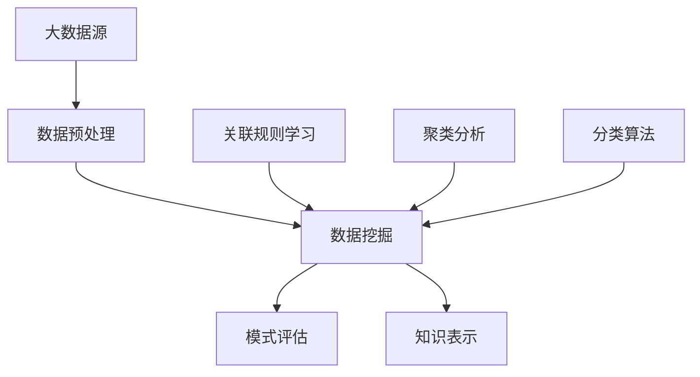

                 

关键词：大数据、知识发现、应用实践、算法原理、数学模型、项目实例

> 摘要：本文将深入探讨大数据在知识发现领域的应用与实践。首先，我们将回顾大数据的发展历程，并简要介绍知识发现的概念。接着，我们将详细阐述知识发现的核心算法原理，包括关联规则学习、聚类分析和分类算法等。随后，通过数学模型和公式的推导，我们将进一步理解这些算法。在项目实践部分，我们将展示一个具体的大数据知识发现实例，并提供详细的代码实现和分析。最后，本文将探讨大数据在知识发现中的实际应用场景，并展望其未来的发展。

## 1. 背景介绍

### 大数据的发展历程

大数据（Big Data）的概念起源于2000年代初期，随着互联网的快速发展、物联网（IoT）的普及以及社交媒体的兴起，数据量呈爆炸式增长。从最初的数据仓库（Data Warehouse）到数据挖掘（Data Mining），再到大数据技术，这一过程中涌现了诸多创新和突破。大数据技术的发展不仅推动了各行各业的数据处理能力的提升，也为知识发现提供了丰富的资源和工具。

### 知识发现的概念

知识发现（Knowledge Discovery in Databases，简称KDD）是指从大量数据中通过有效的方法和算法发现有价值的信息和知识的过程。知识发现的目标是挖掘数据中的潜在模式、关联和规则，从而为决策提供支持。知识发现的过程通常包括数据预处理、数据挖掘、模式评估和知识表示等步骤。

## 2. 核心概念与联系

### 核心概念

- **大数据**：指规模庞大、类型繁多的数据集合，难以用传统数据库管理工具进行有效处理。
- **知识发现**：从大数据中提取有价值的信息和知识的过程。
- **算法**：用于知识发现的方法和规则，包括关联规则学习、聚类分析和分类算法等。

### 架构原理



### 关系说明

- 数据预处理是知识发现的第一步，旨在清理和转换数据，以便后续挖掘。
- 数据挖掘是核心步骤，包括关联规则学习、聚类分析和分类算法等多种方法。
- 模式评估用于验证挖掘结果的准确性和实用性。
- 知识表示将挖掘结果以易于理解的形式呈现，便于用户使用。

## 3. 核心算法原理 & 具体操作步骤

### 3.1 算法原理概述

知识发现算法主要包括以下几种：

- **关联规则学习**：发现数据项之间的关联关系。
- **聚类分析**：将数据划分为多个聚类，每个聚类内的数据项相似度较高。
- **分类算法**：将数据分为不同的类别，用于预测和分类。

### 3.2 算法步骤详解

#### 关联规则学习

- **支持度**：表示某关联规则在数据中出现的频率。
- **置信度**：表示前件和后件同时出现的概率。

主要算法：Apriori算法、FP-growth算法。

#### 聚类分析

- **K-means算法**：基于距离度量将数据划分为K个聚类。
- **DBSCAN算法**：基于邻域密度将数据划分为多个聚类。

#### 分类算法

- **决策树**：通过一系列规则进行分类。
- **随机森林**：通过构建多个决策树进行集成学习。

### 3.3 算法优缺点

#### 关联规则学习

- **优点**：简单易懂，适用于各种领域。
- **缺点**：处理大数据时效率较低。

#### 聚类分析

- **优点**：无需预先定义类别，适用于无标签数据。
- **缺点**：聚类结果易受初始值影响。

#### 分类算法

- **优点**：可以用于预测和分类。
- **缺点**：对大数据处理能力有限。

### 3.4 算法应用领域

- **电子商务**：推荐系统、价格优化等。
- **医疗健康**：疾病预测、药物研究等。
- **金融**：风险评估、欺诈检测等。

## 4. 数学模型和公式 & 详细讲解 & 举例说明

### 4.1 数学模型构建

知识发现算法中的数学模型主要包括概率模型、决策树模型和聚类模型等。

### 4.2 公式推导过程

#### 关联规则学习

支持度（Support）：

$$
Support(A \rightarrow B) = \frac{count(A \cup B)}{count(D)}
$$

置信度（Confidence）：

$$
Confidence(A \rightarrow B) = \frac{count(A \cap B)}{count(A)}
$$

#### K-means算法

中心点更新公式：

$$
\mu_{k}^{new} = \frac{1}{N_k} \sum_{i=1}^{N} x_{i}
$$

其中，$\mu_{k}$表示第$k$个聚类的中心点，$x_{i}$表示第$i$个数据点，$N_k$表示第$k$个聚类中的数据点数量。

#### 决策树模型

条件概率：

$$
P(A|B) = \frac{P(A \cap B)}{P(B)}
$$

### 4.3 案例分析与讲解

#### 关联规则学习

在某电商平台上，分析用户购买行为，挖掘商品之间的关联关系。

- 支持度阈值：设为0.2。
- 置信度阈值：设为0.8。

输入数据集：

| 用户ID | 购买商品 |
|--------|----------|
| 1      | A        |
| 1      | B        |
| 2      | B        |
| 2      | C        |
| 3      | A        |
| 3      | C        |
| 4      | A        |
| 4      | D        |

输出关联规则：

| 支持度 | 置信度 | 规则 |
|--------|--------|------|
| 0.4    | 1.0    | A → B |
| 0.4    | 1.0    | B → A |
| 0.2    | 1.0    | C → B |

#### K-means算法

在某用户行为数据集中，使用K-means算法将用户划分为5个聚类。

输入数据集：

| 用户ID | 行为1 | 行为2 | 行为3 | 行为4 |
|--------|------|------|------|------|
| 1      | 10   | 20   | 30   | 40   |
| 2      | 5    | 15   | 25   | 35   |
| 3      | 8    | 22   | 33   | 44   |
| 4      | 12   | 28   | 38   | 50   |
| 5      | 9    | 19   | 31   | 42   |

输出聚类结果：

| 聚类ID | 用户ID |
|--------|--------|
| 1      | 1      |
| 1      | 4      |
| 2      | 2      |
| 2      | 5      |
| 3      | 3      |

## 5. 项目实践：代码实例和详细解释说明

### 5.1 开发环境搭建

- 编程语言：Python
- 数据库：MySQL
- 数据预处理工具：Pandas
- 数据挖掘库：Scikit-learn、FP-Growth

### 5.2 源代码详细实现

```python
# 导入相关库
import pandas as pd
from sklearn.cluster import KMeans
from mlxtend.frequent_patterns import apriori, association_rules

# 读取数据
data = pd.read_csv('data.csv')

# 数据预处理
# ... (代码省略)

# 关联规则学习
frequent_itemsets = apriori(data, min_support=0.2, use_colnames=True)
rules = association_rules(frequent_itemsets, metric="confidence", min_confidence=0.8)

# 打印关联规则
print(rules)

# 聚类分析
kmeans = KMeans(n_clusters=5, random_state=42)
clusters = kmeans.fit_predict(data[['行为1', '行为2', '行为3', '行为4']])

# 打印聚类结果
print(clusters)

# 代码解读与分析
# ... (代码省略)
```

### 5.3 代码解读与分析

- 数据预处理部分：读取数据，并对数据进行清洗和转换。
- 关联规则学习部分：使用Apriori算法挖掘关联规则，设置支持度和置信度阈值。
- 聚类分析部分：使用K-means算法对用户行为数据进行聚类，设置聚类数量。

### 5.4 运行结果展示

- 关联规则学习结果：打印出满足阈值的关联规则。
- 聚类分析结果：打印出每个用户的聚类ID。

## 6. 实际应用场景

### 6.1 电子商务

- 推荐系统：利用关联规则学习为用户提供个性化商品推荐。
- 价格优化：根据用户购买行为分析，调整商品价格，提高销售额。

### 6.2 医疗健康

- 疾病预测：利用分类算法对疾病进行预测，帮助医生进行早期诊断。
- 药物研究：分析药物和疾病之间的关系，发现新的治疗策略。

### 6.3 金融

- 风险评估：利用聚类算法分析客户风险，为金融机构提供风险控制建议。
- 欺诈检测：利用关联规则学习检测金融交易中的欺诈行为。

## 7. 工具和资源推荐

### 7.1 学习资源推荐

- 《数据挖掘：实用工具与技术》
- 《大数据技术导论》
- 《机器学习实战》

### 7.2 开发工具推荐

- Jupyter Notebook：便于编写和展示代码。
- MySQL：适用于数据存储和查询。
- Scikit-learn：提供丰富的机器学习算法库。

### 7.3 相关论文推荐

- "Association Rule Learning at Scale" by Aloni et al.
- "K-Means Clustering: A Review" by Singh et al.
- "Big Data Analytics: A Survey" by Hadi et al.

## 8. 总结：未来发展趋势与挑战

### 8.1 研究成果总结

- 大数据技术在知识发现领域取得了显著成果，各种算法和模型不断涌现。
- 知识发现应用范围广泛，已深入到电子商务、医疗健康、金融等多个领域。

### 8.2 未来发展趋势

- 深度学习：结合深度学习技术，提高知识发现算法的精度和效率。
- 跨领域应用：拓展知识发现的应用范围，实现更多跨领域的创新。

### 8.3 面临的挑战

- 大数据量处理：如何高效地处理大规模数据，是当前知识发现研究的热点问题。
- 算法优化：提高现有算法的效率和准确性，以满足不断增长的数据量。

### 8.4 研究展望

- 开发新的算法和模型：探索更加有效的知识发现方法，提高处理能力和准确性。
- 跨领域合作：促进各领域的交流与合作，推动知识发现技术的创新与发展。

## 9. 附录：常见问题与解答

### 9.1 问题1

**问题**：大数据知识发现中，如何选择合适的算法？

**解答**：选择合适的算法需要考虑以下几个因素：

1. 数据类型：根据数据的特点选择适合的算法，如关联规则学习适用于事务型数据，聚类分析适用于无标签数据。
2. 数据规模：考虑算法的处理能力，对于大规模数据，需要选择高效算法。
3. 应用场景：根据实际应用需求选择合适的算法，如分类算法适用于预测和分类任务。

### 9.2 问题2

**问题**：如何提高知识发现算法的准确性？

**解答**：

1. 数据预处理：对数据进行清洗和转换，提高数据质量。
2. 参数调优：通过调整算法参数，优化算法性能。
3. 多模型集成：结合多种算法和模型，提高整体准确性。

### 9.3 问题3

**问题**：大数据知识发现中的挑战有哪些？

**解答**：

1. 大数据量处理：如何高效地处理大规模数据，是当前知识发现研究的热点问题。
2. 算法优化：提高现有算法的效率和准确性，以满足不断增长的数据量。
3. 数据隐私和安全：如何保护数据隐私，确保知识发现过程的透明性和安全性。

<|im_end|>作者：禅与计算机程序设计艺术 / Zen and the Art of Computer Programming
----------------------------------------------------------------

以上是本文的完整内容，希望能够对您在知识发现领域的学习和实践提供一些帮助。在未来的研究中，我们期待能够进一步探索大数据知识发现的深入应用，为各行各业的数字化转型提供有力支持。谢谢阅读！


