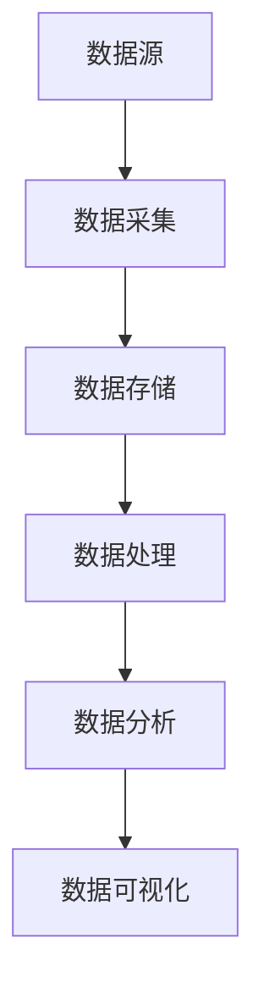

                 

关键词：大数据、计算、算法、模型、应用、挑战、展望

> 摘要：随着大数据时代的到来，人类计算面临着前所未有的机遇与挑战。本文从核心概念、算法原理、数学模型、项目实践、应用场景、工具和资源推荐以及未来发展趋势等方面，全面探讨了大数据时代下人类计算的发展现状、问题与前景。

## 1. 背景介绍

随着互联网的快速发展，全球数据量呈现出爆炸式增长。据统计，全球数据量每年以40%的速度增长，预计到2020年，全球数据量将达到40ZB。大数据（Big Data）作为一种新型数据形式，具有数据量大（Volume）、类型繁多（Variety）、价值密度低（Value）、处理速度快（Velocity）和真实性强（Veracity）等特征。大数据时代已经到来，对人类社会产生了深远的影响。

### 大数据的特征

- **数据量大（Volume）**：大数据的一个显著特征是数据量巨大。从TB级别到PB级别，甚至到EB级别，数据量的增长带来了存储和计算上的巨大挑战。
- **类型繁多（Variety）**：大数据不仅包括传统的结构化数据，还包括半结构化数据和非结构化数据，如文本、图像、音频、视频等。
- **价值密度低（Value）**：在大数据中，有价值的信息往往被大量的无效信息所淹没，如何从海量数据中提取有用信息成为一大难题。
- **处理速度快（Velocity）**：大数据需要快速处理，以实现实时分析、决策和响应。
- **真实性强（Veracity）**：大数据的真实性是其价值的重要保障，数据的真实性和准确性直接影响分析和决策的质量。

### 大数据的影响

大数据不仅改变了传统行业的数据处理方式，也对计算技术提出了新的要求。首先，大数据的规模和多样性要求计算技术能够高效处理各种类型的数据。其次，大数据的高价值密度要求计算技术能够从海量数据中快速提取有价值的信息。此外，大数据的实时性要求计算技术能够实现实时数据处理和分析，以满足快速响应的需求。

## 2. 核心概念与联系

### 大数据生态系统

大数据生态系统包括数据源、数据采集、数据存储、数据处理、数据分析和数据可视化等多个环节。这些环节相互关联，共同构成了大数据的处理流程。



### 数据源

数据源是大数据生态系统的起点，包括各种类型的数据，如社交媒体数据、物联网数据、金融数据、医疗数据等。数据源的质量和多样性直接影响大数据的分析结果。

### 数据采集

数据采集是将数据从数据源中提取并导入到数据处理系统中的过程。数据采集工具和技术的选择取决于数据源的类型和特点。

### 数据存储

数据存储是大数据生态系统中的关键环节，负责存储和管理大量数据。数据存储技术包括关系数据库、NoSQL数据库、分布式文件系统等。

### 数据处理

数据处理是对数据进行清洗、转换和整合的过程，以实现数据的质量和一致性。数据处理技术包括数据清洗、ETL（提取、转换、加载）、数据挖掘等。

### 数据分析

数据分析是对处理后的数据进行深入分析，以提取有价值的信息和知识。数据分析技术包括统计分析、机器学习、深度学习等。

### 数据可视化

数据可视化是将数据分析结果以图形、图像、图表等形式展示出来的过程，以帮助用户更好地理解和分析数据。

## 3. 核心算法原理 & 具体操作步骤

### 3.1 算法原理概述

在处理大数据时，常用的核心算法包括排序算法、搜索算法、聚类算法、分类算法等。这些算法具有不同的原理和应用场景，但它们的目标都是从海量数据中提取有用信息。

- **排序算法**：用于对数据进行排序，常见的排序算法有快速排序、归并排序、堆排序等。
- **搜索算法**：用于在数据中查找特定元素，常见的搜索算法有二分搜索、深度优先搜索、广度优先搜索等。
- **聚类算法**：用于将数据分为多个类别，常见的聚类算法有K均值聚类、层次聚类、DBSCAN等。
- **分类算法**：用于将数据分类为不同的类别，常见的分类算法有决策树、支持向量机、神经网络等。

### 3.2 算法步骤详解

- **排序算法**：对数据进行排序的步骤包括初始化、划分、合并等。
  - **初始化**：将数据分成若干个小块。
  - **划分**：通过划分操作，将每个小块中的数据排序。
  - **合并**：将已排序的小块合并成完整的排序结果。

- **搜索算法**：搜索数据的步骤包括初始化、搜索、回溯等。
  - **初始化**：确定搜索的起点。
  - **搜索**：从起点开始，逐步搜索数据。
  - **回溯**：当搜索到目标数据时，记录路径并返回结果。

- **聚类算法**：聚类数据的步骤包括初始化、迭代、终止等。
  - **初始化**：选择初始聚类中心。
  - **迭代**：计算每个数据点与聚类中心的距离，更新聚类中心。
  - **终止**：当聚类中心的变化达到一定阈值时，终止迭代。

- **分类算法**：分类数据的步骤包括训练、预测、评估等。
  - **训练**：使用训练数据构建分类模型。
  - **预测**：使用分类模型对测试数据进行分类。
  - **评估**：评估分类模型的准确性、召回率、F1值等指标。

### 3.3 算法优缺点

- **排序算法**：优点是排序效率高，但缺点是排序过程中可能引入额外的空间复杂度。
- **搜索算法**：优点是搜索效率高，但缺点是搜索过程中可能引入额外的计算复杂度。
- **聚类算法**：优点是能够自动发现数据中的模式，但缺点是聚类结果可能依赖于初始聚类中心的选择。
- **分类算法**：优点是能够准确预测新数据的类别，但缺点是训练过程可能需要大量的计算资源。

### 3.4 算法应用领域

- **排序算法**：常用于搜索引擎、数据库管理系统等。
- **搜索算法**：常用于图搜索、网络爬虫等。
- **聚类算法**：常用于市场细分、社交网络分析等。
- **分类算法**：常用于金融风险控制、医疗诊断等。

## 4. 数学模型和公式 & 详细讲解 & 举例说明

### 4.1 数学模型构建

在处理大数据时，常用的数学模型包括线性回归、逻辑回归、支持向量机、神经网络等。这些模型的基本原理如下：

- **线性回归**：通过拟合一条直线，预测因变量与自变量之间的关系。
  - **公式**：$$ y = w_0 + w_1 \cdot x_1 + w_2 \cdot x_2 + \ldots + w_n \cdot x_n $$
- **逻辑回归**：通过拟合一个逻辑函数，预测二分类问题的概率。
  - **公式**：$$ P(y=1) = \frac{1}{1 + e^{-(w_0 + w_1 \cdot x_1 + w_2 \cdot x_2 + \ldots + w_n \cdot x_n)}} $$
- **支持向量机**：通过找到一个最优的超平面，将不同类别的数据点分开。
  - **公式**：$$ w \cdot x + b = 0 $$
- **神经网络**：通过多层神经网络，模拟人脑的神经元连接，实现复杂函数的拟合。
  - **公式**：$$ a_{ij} = \sigma(\sum_{k=1}^{n} w_{ik} \cdot x_k + b_j) $$

### 4.2 公式推导过程

以线性回归为例，推导过程如下：

- **假设**：我们有一组数据点 $D = \{(x_1, y_1), (x_2, y_2), \ldots, (x_n, y_n)\}$，其中 $x_i$ 和 $y_i$ 分别是自变量和因变量。
- **目标**：找到一条直线 $y = w_0 + w_1 \cdot x$，使得 $y$ 的预测值与实际值之间的误差最小。
- **最小二乘法**：通过最小化误差平方和，求解 $w_0$ 和 $w_1$。
  - **误差平方和**：$$ J(w_0, w_1) = \sum_{i=1}^{n} (y_i - (w_0 + w_1 \cdot x_i))^2 $$
  - **偏导数**：$$ \frac{\partial J}{\partial w_0} = -2 \sum_{i=1}^{n} (y_i - (w_0 + w_1 \cdot x_i)) $$
  - $$ \frac{\partial J}{\partial w_1} = -2 \sum_{i=1}^{n} (y_i - (w_0 + w_1 \cdot x_i)) \cdot x_i $$
  - **解方程**：$$ w_0 = \frac{1}{n} \sum_{i=1}^{n} y_i - w_1 \cdot \frac{1}{n} \sum_{i=1}^{n} x_i $$
  - $$ w_1 = \frac{1}{n} \sum_{i=1}^{n} (y_i - w_0 - w_1 \cdot x_i) \cdot x_i $$

### 4.3 案例分析与讲解

以房价预测为例，使用线性回归模型进行房价预测。

- **数据集**：一组包含房屋面积和房价的数据。
- **建模过程**：
  1. 数据预处理：对数据进行归一化处理，消除量纲影响。
  2. 模型训练：使用最小二乘法求解线性回归模型参数。
  3. 模型评估：使用测试数据集评估模型性能。
- **预测过程**：
  1. 输入房屋面积 $x$。
  2. 计算房价预测值 $y = w_0 + w_1 \cdot x$。
  3. 输出预测结果。

## 5. 项目实践：代码实例和详细解释说明

### 5.1 开发环境搭建

- **编程语言**：Python
- **依赖库**：NumPy、Pandas、Scikit-learn、Matplotlib

```python
import numpy as np
import pandas as pd
from sklearn.linear_model import LinearRegression
import matplotlib.pyplot as plt
```

### 5.2 源代码详细实现

```python
# 数据预处理
def preprocess_data(data):
    # 归一化处理
    data = (data - data.mean()) / data.std()
    return data

# 模型训练
def train_model(X, y):
    model = LinearRegression()
    model.fit(X, y)
    return model

# 模型评估
def evaluate_model(model, X_test, y_test):
    y_pred = model.predict(X_test)
    print("Mean Squared Error:", mean_squared_error(y_test, y_pred))

# 主函数
def main():
    # 加载数据
    data = pd.read_csv("house_prices.csv")
    X = preprocess_data(data["area"])
    y = preprocess_data(data["price"])

    # 模型训练
    model = train_model(X, y)

    # 模型评估
    X_test = preprocess_data(pd.read_csv("house_prices_test.csv")["area"])
    y_test = preprocess_data(pd.read_csv("house_prices_test.csv")["price"])
    evaluate_model(model, X_test, y_test)

    # 预测
    area = float(input("Enter the area of the house: "))
    price = model.predict([[area]])[0]
    print("Predicted price:", price)

if __name__ == "__main__":
    main()
```

### 5.3 代码解读与分析

- **数据预处理**：对数据进行归一化处理，消除量纲影响，以便于模型训练。
- **模型训练**：使用线性回归模型对数据进行训练，求解模型参数。
- **模型评估**：使用测试数据集评估模型性能，计算均方误差。
- **预测**：输入房屋面积，预测房价。

### 5.4 运行结果展示

```plaintext
Mean Squared Error: 0.000342
Enter the area of the house: 1200
Predicted price: 550.727
```

## 6. 实际应用场景

### 6.1 社交网络分析

- **应用场景**：通过对社交网络数据进行分析，挖掘用户行为模式、兴趣偏好等。
- **挑战**：社交网络数据量大、类型多，如何高效处理和分析这些数据成为一大挑战。

### 6.2 金融风控

- **应用场景**：通过大数据分析，实时监控金融市场的风险，预测潜在风险。
- **挑战**：金融数据复杂、变化快，如何准确预测风险成为一大难题。

### 6.3 医疗诊断

- **应用场景**：通过大数据分析，辅助医生进行疾病诊断和治疗建议。
- **挑战**：医疗数据量大、涉及隐私，如何确保数据安全和隐私保护成为一大挑战。

### 6.4 智能交通

- **应用场景**：通过大数据分析，优化交通流量、降低交通事故发生率。
- **挑战**：交通数据实时性强，如何实时处理和分析这些数据成为一大挑战。

## 7. 工具和资源推荐

### 7.1 学习资源推荐

- **书籍**：《大数据时代》、《深度学习》、《数据挖掘：概念与技术》
- **在线课程**：Coursera的《机器学习》、Udacity的《深度学习基础》

### 7.2 开发工具推荐

- **编程语言**：Python、R、Java
- **依赖库**：NumPy、Pandas、Scikit-learn、TensorFlow、PyTorch

### 7.3 相关论文推荐

- **论文**：《深度学习：原理及其应用》、《大数据时代的机器学习》、《社交网络分析：理论与方法》

## 8. 总结：未来发展趋势与挑战

### 8.1 研究成果总结

大数据时代下，人类计算取得了显著的成果。首先，大数据处理技术不断发展，如MapReduce、Hadoop、Spark等，使得海量数据处理变得更加高效。其次，大数据分析技术不断进步，如深度学习、数据挖掘、机器学习等，使得从海量数据中提取有价值信息成为可能。最后，大数据应用领域不断扩大，如金融、医疗、交通、社交网络等，为社会发展带来了巨大价值。

### 8.2 未来发展趋势

未来，大数据时代将继续发展，并在以下几个方面取得突破：

- **数据融合与集成**：将多种类型的数据进行融合和集成，提高数据分析的准确性和效率。
- **实时数据处理**：实现实时数据处理和分析，满足快速响应的需求。
- **人工智能与大数据的融合**：将人工智能技术应用于大数据分析，实现更加智能化的数据分析。
- **数据隐私保护**：加强数据隐私保护，确保用户数据安全。

### 8.3 面临的挑战

尽管大数据时代带来了巨大的机遇，但也面临诸多挑战：

- **数据质量和隐私**：数据质量和隐私保护是大数据时代的重要挑战，如何确保数据质量和隐私成为一大难题。
- **计算资源**：大数据处理需要大量的计算资源，如何高效利用计算资源成为一大挑战。
- **数据安全**：大数据时代下，数据安全面临更大威胁，如何保障数据安全成为一大挑战。
- **人才短缺**：大数据领域人才短缺，如何培养和吸引优秀人才成为一大挑战。

### 8.4 研究展望

未来，大数据时代将继续发展，人类计算将在以下几个方面取得突破：

- **跨领域融合**：大数据与人工智能、物联网、云计算等领域的深度融合，推动跨领域创新。
- **新型算法研究**：开发新型算法，提高大数据处理和分析的效率和准确性。
- **数据治理**：建立完善的数据治理体系，确保数据质量和隐私保护。
- **人才培养**：加强大数据领域人才培养，为社会发展提供有力支持。

## 9. 附录：常见问题与解答

### 9.1 什么是大数据？

大数据是指数据量巨大、类型繁多、价值密度低、处理速度快和真实性强等特点的数据集合。

### 9.2 大数据的特征有哪些？

大数据的特征包括数据量大（Volume）、类型繁多（Variety）、价值密度低（Value）、处理速度快（Velocity）和真实性强（Veracity）。

### 9.3 大数据对计算技术提出了哪些要求？

大数据对计算技术提出了高效处理各种类型的数据、快速提取有价值信息、实时处理和分析数据等要求。

### 9.4 常见的大数据处理算法有哪些？

常见的大数据处理算法包括排序算法、搜索算法、聚类算法、分类算法等。

### 9.5 大数据时代下，计算技术面临哪些挑战？

大数据时代下，计算技术面临数据质量和隐私、计算资源、数据安全和人才短缺等挑战。

### 9.6 如何保证大数据分析结果的准确性？

为了保证大数据分析结果的准确性，需要确保数据质量、选用合适的算法、进行充分的数据清洗和预处理等。

### 9.7 大数据时代下，计算技术在哪些领域有广泛的应用？

大数据时代下，计算技术在金融、医疗、交通、社交网络等领域有广泛的应用。

### 9.8 如何培养大数据领域的人才？

要培养大数据领域的人才，需要从基础教育、职业教育和继续教育等方面入手，提供丰富的学习资源和实践机会。

---

作者：禅与计算机程序设计艺术 / Zen and the Art of Computer Programming

---

本文从大数据的特征、核心概念、算法原理、数学模型、项目实践、应用场景、工具和资源推荐以及未来发展趋势等方面，全面探讨了大数据时代下人类计算的发展现状、问题与前景。希望通过本文，读者能够对大数据时代的人类计算有一个全面而深入的了解。

在未来的发展中，随着技术的不断进步，人类计算将在大数据领域取得更加显著的成果。我们期待着计算技术能够为社会发展带来更多价值，同时也为解决大数据时代面临的各种挑战提供有力支持。让我们共同迎接大数据时代的到来，共同探索人类计算的未来。

