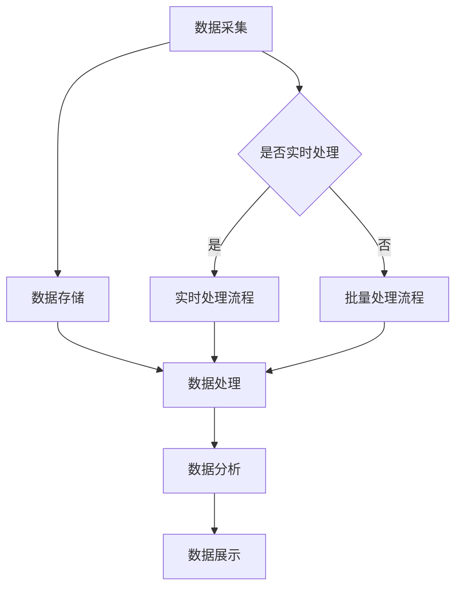

                 

### 1. 背景介绍

随着互联网的普及和信息爆炸时代的到来，数据已经成为企业和社会的核心资产。大数据技术以其强大的数据处理能力，在商业智能、数据挖掘、机器学习等领域发挥着重要作用。然而，要充分发挥大数据的潜力，首先需要构建一个稳定、高效、可扩展的大数据架构。本文旨在深入讲解大数据架构的原理，并结合代码实例，帮助读者理解并掌握大数据处理的核心技术和实践方法。

### 2. 核心概念与联系

#### 2.1 大数据概念

大数据（Big Data）是指无法用传统数据处理工具在合理时间内进行捕捉、管理和处理的数据集合。其特征通常被归纳为4个V，即：

- **Volume（大量）**：数据量大，通常PB级别；
- **Velocity（高速）**：数据产生和流转速度快；
- **Variety（多样）**：数据来源和类型多样化，包括结构化、半结构化和非结构化数据；
- **Veracity（真实性）**：数据的真实性和可靠性问题。

#### 2.2 大数据架构概念

大数据架构是指为了处理大规模数据集而设计的整体结构和技术方案，它通常包括数据采集、存储、处理、分析和展示等多个环节。一个典型的大数据架构通常涉及以下组件：

- **数据采集**：通过日志收集器、消息队列等工具收集数据；
- **数据存储**：使用HDFS、HBase、MongoDB等分布式存储系统存储数据；
- **数据处理**：使用MapReduce、Spark等计算框架处理数据；
- **数据分析**：利用SQL查询、机器学习算法等对数据进行深度分析；
- **数据展示**：通过可视化工具如Tableau、ECharts等展示分析结果。

#### 2.3 Mermaid 流程图

下面是一个大数据架构的 Mermaid 流程图，展示了数据从采集到处理再到展示的全过程：



### 3. 核心算法原理 & 具体操作步骤

#### 3.1 算法原理概述

大数据处理的核心算法包括MapReduce、Spark等。本文将以MapReduce为例，介绍其原理和具体操作步骤。

**MapReduce** 是一种编程模型，用于大规模数据的批量处理。其核心思想是将大规模数据集分成小块，并行处理后再合并结果。MapReduce 包括两个阶段：Map 阶段和 Reduce 阶段。

- **Map 阶段**：将输入数据分成键值对，对每个键值对进行处理，输出新的键值对。
- **Reduce 阶段**：将 Map 阶段输出的所有键值对根据键进行分组，对每组键值对进行聚合处理。

#### 3.2 算法步骤详解

**MapReduce 的操作步骤如下：**

1. **输入数据格式**：
    - Map 阶段的输入数据通常是文本文件，以行为单位；
    - Reduce 阶段的输入数据是 Map 阶段的输出结果，也是键值对。

2. **Map 阶段**：
    - 读取输入数据；
    - 对每个输入数据进行处理，输出键值对；
    - 将所有键值对输出到本地文件。

3. **Shuffle 阶段**：
    - 根据键对本地文件进行排序和分组；
    - 将分组后的数据发送到 Reduce 任务执行节点。

4. **Reduce 阶段**：
    - 读取 Shuffle 阶段发送的键值对；
    - 对每组键值对进行聚合处理，输出结果。

5. **输出结果**：
    - 将 Reduce 阶段的结果输出到指定的文件或存储系统。

#### 3.3 算法优缺点

**优点：**
- **可扩展性**：MapReduce 可以处理海量数据，通过增加节点数实现横向扩展；
- **容错性**：MapReduce 具有自动恢复功能，当任务失败时，可以重新执行；
- **灵活性**：MapReduce 可以处理多种数据类型和复杂的数据处理逻辑。

**缺点：**
- **实时性较差**：MapReduce 适用于批量处理，不适合实时处理；
- **资源利用率低**：由于 Shuffle 阶段的数据传输，可能导致资源浪费。

#### 3.4 算法应用领域

**MapReduce** 广泛应用于搜索引擎、分布式数据库、数据仓库等领域。例如，在搜索引擎中，MapReduce 用于索引构建和查询处理；在分布式数据库中，MapReduce 用于数据备份和恢复；在数据仓库中，MapReduce 用于数据清洗、转换和聚合。

### 4. 数学模型和公式 & 详细讲解 & 举例说明

#### 4.1 数学模型构建

**MapReduce** 的核心在于如何将大规模数据处理分解为可并行执行的任务。其数学模型可以表示为：

$$
MapReduce = \{Map, Shuffle, Reduce\}
$$

其中，Map 和 Reduce 为函数，Shuffle 为数据传输和分组过程。

#### 4.2 公式推导过程

**Map 阶段**：

$$
Map(\text{input}) = \{(\text{key}_i, \text{value}_i) | \text{input} = (\text{key}, \text{value})\}
$$

对于每个输入数据对 $(\text{key}, \text{value})$，Map 函数输出多个键值对。

**Shuffle 阶段**：

$$
Shuffle = \{(\text{key}_i, \{\text{value}_i\}) | \text{Map}(\text{input})\}
$$

将所有键值对按照键进行分组，形成多个有序列表。

**Reduce 阶段**：

$$
Reduce(\text{key}_i, \{\text{value}_i\}) = \{\text{output}_i | \text{Reduce}(\text{key}_i, \text{value}_i)\}
$$

对于每组键值对，Reduce 函数进行聚合处理，输出结果。

#### 4.3 案例分析与讲解

**案例**：计算单词出现次数。

**Map 阶段**：

```python
def map(line):
    words = line.split()
    for word in words:
        yield (word, 1)
```

输入一行文本，输出单词及其出现次数。

**Reduce 阶段**：

```python
def reduce(word, counts):
    return sum(counts)
```

输入单词及其出现次数列表，输出单词的总出现次数。

### 5. 项目实践：代码实例和详细解释说明

#### 5.1 开发环境搭建

在本节中，我们将使用 Hadoop 作为大数据处理平台，介绍如何搭建一个简单的 Hadoop 开发环境。

1. **安装 JDK**：

   Hadoop 需要 JDK 1.8 或更高版本。可以从 [Oracle 官网](https://www.oracle.com/java/technologies/javase-downloads.html) 下载 JDK，并按照提示进行安装。

2. **安装 Hadoop**：

   下载 Hadoop 的二进制包，解压到指定目录，并配置环境变量。

   ```bash
   tar -zxvf hadoop-3.2.1.tar.gz -C /opt/
   export HADOOP_HOME=/opt/hadoop-3.2.1
   export PATH=$PATH:$HADOOP_HOME/bin:$HADOOP_HOME/sbin
   ```

3. **配置 Hadoop**：

   编辑 `hadoop-env.sh` 文件，配置 JDK 路径；编辑 `core-site.xml` 和 `hdfs-site.xml` 文件，配置 HDFS 的工作目录和副本系数等。

#### 5.2 源代码详细实现

在本节中，我们将使用 Python 实现一个简单的 MapReduce 程序，计算单词出现次数。

```python
from mrjob.job import MRJob

class WordCount(MRJob):

    def mapper(self, _, line):
        words = line.split()
        for word in words:
            yield word, 1

    def reducer(self, word, counts):
        yield word, sum(counts)

if __name__ == '__main__':
    WordCount.run()
```

#### 5.3 代码解读与分析

- **Mapper**：读取输入文件中的每一行，将行中的单词分割并输出。
- **Reducer**：接收 Mapper 输出的单词及其出现次数，进行求和并输出结果。

#### 5.4 运行结果展示

运行 WordCount 程序，输出单词出现次数：

```bash
hadoop fs -cat output/* | sort | less
```

### 6. 实际应用场景

#### 6.1 数据采集

在社交媒体领域，大数据架构被用于实时采集用户生成的内容、行为数据等。例如，Twitter 使用 Apache Kafka 进行实时数据采集，并将数据存储到 Apache Hadoop 分布式文件系统（HDFS）中。

#### 6.2 数据分析

金融行业利用大数据架构进行风险控制、客户行为分析和市场预测。例如，银行使用 Apache Spark 进行大规模数据分析和处理，以提高业务决策的准确性。

#### 6.3 数据展示

电子商务平台使用大数据架构进行用户行为分析、推荐系统和广告投放。例如，Amazon 使用 Apache Hadoop 和 Apache Spark 进行数据分析，并将结果可视化展示给用户，以提高用户体验和销售额。

### 7. 工具和资源推荐

#### 7.1 学习资源推荐

- 《Hadoop权威指南》
- 《Spark技术内幕》
- 《大数据时代》

#### 7.2 开发工具推荐

- Eclipse/IntelliJ IDEA
- Hadoop命令行
- Python（用于MapReduce编程）

#### 7.3 相关论文推荐

- “MapReduce: Simplified Data Processing on Large Clusters”
- “Spark: Cluster Computing with Working Sets”

### 8. 总结：未来发展趋势与挑战

#### 8.1 研究成果总结

大数据技术在过去几年取得了显著的研究成果，包括分布式存储系统（如HDFS、Cassandra）、计算框架（如MapReduce、Spark）和实时数据处理技术（如Flink、Kafka）等。这些技术为大规模数据处理提供了强有力的支持。

#### 8.2 未来发展趋势

1. **实时数据处理**：随着物联网、移动应用的普及，实时数据处理需求日益增长，未来实时数据处理技术将更加成熟。
2. **机器学习和大数据的结合**：机器学习算法在大数据处理中的应用越来越广泛，未来将出现更多基于大数据的智能算法。
3. **隐私保护和数据安全**：随着数据隐私和安全问题的日益突出，如何在确保数据隐私和安全的前提下进行大数据处理将成为一个重要研究方向。

#### 8.3 面临的挑战

1. **数据质量管理**：大规模数据集往往存在噪声、错误和不一致性等问题，数据质量管理是大数据处理的重要挑战。
2. **资源管理和调度**：大规模分布式系统需要高效的资源管理和调度策略，以充分利用计算资源和提高系统性能。
3. **数据隐私和安全**：如何在保证数据隐私和安全的前提下进行数据处理，是一个需要解决的重要问题。

#### 8.4 研究展望

大数据技术在未来将继续快速发展，并将渗透到各个行业和应用领域。随着新技术的不断涌现，大数据架构将变得更加灵活、高效和智能。同时，数据隐私和安全问题也将得到更多关注和解决，为大数据技术的广泛应用提供坚实保障。

### 9. 附录：常见问题与解答

**Q：什么是Hadoop？**

A：Hadoop 是一个开源的分布式计算框架，用于处理大规模数据集。它包括分布式存储系统（HDFS）和分布式计算模型（MapReduce），以及许多与大数据处理相关的工具和组件。

**Q：Spark 和 MapReduce 有什么区别？**

A：Spark 是一种更高效、更快速的分布式计算框架，与 MapReduce 相比，Spark 具有内存计算、弹性调度和交互式查询等优势。然而，Spark 的资源管理和容错性相比 MapReduce 有所欠缺。

**Q：如何确保大数据处理的稳定性？**

A：确保大数据处理的稳定性需要综合考虑多个方面，包括数据质量、系统架构、容错性和性能优化等。通过合理设计数据存储和计算模型，以及采用高效的调度和负载均衡策略，可以确保大数据处理的稳定性。此外，定期进行系统监控和维护也是保证系统稳定性的重要措施。

---

本文通过对大数据架构原理的深入讲解，结合代码实例，帮助读者了解大数据处理的核心技术和实践方法。随着大数据技术的不断发展和应用，未来将迎来更加广阔的发展前景。作者：禅与计算机程序设计艺术 / Zen and the Art of Computer Programming。

