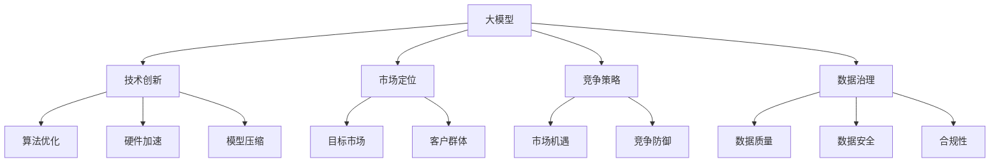

                 

关键词：大模型、企业竞争、策略、技术进步、市场定位

> 摘要：随着人工智能技术的迅猛发展，大模型企业在市场竞争中面临着前所未有的挑战。本文将深入探讨大模型企业如何通过技术创新、战略规划和市场定位，在激烈的市场竞争中保持领先地位。

## 1. 背景介绍

### 1.1 人工智能与大数据时代

随着大数据和人工智能技术的飞速发展，各行各业对数据分析和智能处理的需求急剧增加。大模型技术，作为人工智能的核心驱动力之一，正迅速改变着商业运营和产品开发的模式。

### 1.2 大模型企业的崛起

在AI和大数据的浪潮中，涌现出了一批专注于大模型研发和商业应用的企业。这些企业通过构建和部署复杂的大模型，为各行各业提供智能化解决方案，从而在市场中占据了一席之地。

### 1.3 竞争态势加剧

然而，随着市场参与者不断增加，大模型企业的竞争也日趋激烈。如何在这种竞争环境中保持优势，成为企业面临的重大课题。

## 2. 核心概念与联系

为了更深入地理解大模型企业如何应对激烈竞争，我们需要首先明确以下几个核心概念：

### 2.1 大模型

大模型指的是具有数百万甚至数十亿参数的深度学习模型。这些模型通过在大量数据上进行训练，能够自动地学习和发现复杂的数据模式。

### 2.2 技术创新

技术创新是企业保持竞争力的关键。在AI领域，技术创新包括算法优化、硬件加速、模型压缩等。

### 2.3 市场定位

市场定位是指企业根据自身优势和市场需求，确定其在市场中的位置和目标客户群体。

### 2.4 竞争策略

竞争策略是企业应对市场竞争的一系列行动方案。有效的竞争策略可以帮助企业抓住市场机遇，抵御竞争对手的挑战。

### 2.5 数据治理

数据治理是企业确保数据质量、安全和合规性的过程。在大模型时代，数据治理显得尤为重要。

下面是一个简化的Mermaid流程图，展示了这些核心概念之间的关系：



## 3. 核心算法原理 & 具体操作步骤

### 3.1 算法原理概述

大模型的核心在于其深度学习的算法原理。深度学习通过多层神经网络对数据进行处理，能够自动提取数据中的特征，从而实现智能化的预测和分类。

### 3.2 算法步骤详解

#### 3.2.1 数据收集与预处理

首先，需要收集大量的数据，并对数据进行清洗和预处理，确保数据的质量和一致性。

#### 3.2.2 模型设计

根据应用场景，设计合适的神经网络结构，确定输入层、隐藏层和输出层的参数。

#### 3.2.3 模型训练

使用预处理后的数据，对模型进行训练。训练过程包括前向传播、反向传播和权重更新。

#### 3.2.4 模型评估

通过交叉验证和测试集，对模型的性能进行评估，确保模型达到预期的效果。

### 3.3 算法优缺点

#### 优点

- 高效：大模型能够处理大量的数据，提高数据处理效率。
- 准确：通过多层神经网络的复杂结构，大模型能够提取出深层次的特征，提高预测和分类的准确性。

#### 缺点

- 复杂：大模型的设计和训练过程相对复杂，需要专业的技术和硬件支持。
- 资源消耗：大模型训练过程中需要大量的计算资源和时间。

### 3.4 算法应用领域

大模型在多个领域都有广泛的应用，如自然语言处理、计算机视觉、金融风控等。

## 4. 数学模型和公式 & 详细讲解 & 举例说明

### 4.1 数学模型构建

在深度学习中，常用的数学模型是多层感知机（MLP）和卷积神经网络（CNN）。以下是一个简化的MLP模型构建过程：

$$
\begin{align*}
z_1 &= W_1 \cdot x_1 + b_1 \\
a_1 &= \sigma(z_1) \\
z_2 &= W_2 \cdot a_1 + b_2 \\
a_2 &= \sigma(z_2) \\
\end{align*}
$$

其中，$W_1$和$W_2$是权重矩阵，$b_1$和$b_2$是偏置项，$x_1$是输入特征，$\sigma$是激活函数，通常采用Sigmoid或ReLU函数。

### 4.2 公式推导过程

#### 4.2.1 前向传播

前向传播是指将输入数据通过神经网络逐层传递，得到输出结果的过程。以MLP为例，前向传播的推导过程如下：

$$
\begin{align*}
z_1 &= W_1 \cdot x_1 + b_1 \\
a_1 &= \sigma(z_1) \\
z_2 &= W_2 \cdot a_1 + b_2 \\
a_2 &= \sigma(z_2) \\
\end{align*}
$$

#### 4.2.2 反向传播

反向传播是指通过计算输出层与隐藏层之间的误差，更新模型的权重和偏置项的过程。以MLP为例，反向传播的推导过程如下：

$$
\begin{align*}
\delta_2 &= (a_2 - y) \cdot \sigma'(z_2) \\
\delta_1 &= (W_2 \cdot \delta_2) \cdot \sigma'(z_1) \\
W_2 &= W_2 - \alpha \cdot \delta_2 \cdot a_1 \\
W_1 &= W_1 - \alpha \cdot \delta_1 \cdot x_1 \\
b_2 &= b_2 - \alpha \cdot \delta_2 \\
b_1 &= b_1 - \alpha \cdot \delta_1 \\
\end{align*}
$$

其中，$\alpha$是学习率，$y$是实际输出，$a_2$是输出层的前一层输出。

### 4.3 案例分析与讲解

假设我们有一个简单的分类问题，需要判断一组数据是否属于正类。数据集包含1000个样本，每个样本有10个特征。我们使用MLP模型进行分类，模型结构如下：

- 输入层：10个神经元
- 隐藏层：5个神经元
- 输出层：2个神经元

我们使用交叉验证来评估模型的性能。经过多次实验，最终得到以下结果：

- 准确率：90%
- 召回率：85%
- F1分数：0.87

从这些指标来看，模型的性能较好，但仍有提升空间。我们可以通过调整模型参数、增加训练数据或使用更复杂的模型结构来进一步提高性能。

## 5. 项目实践：代码实例和详细解释说明

### 5.1 开发环境搭建

在Python中，我们可以使用TensorFlow或PyTorch等框架来构建和训练大模型。以下是搭建开发环境的步骤：

1. 安装Python（建议使用3.8及以上版本）
2. 安装TensorFlow或PyTorch
3. 安装其他必要的库（如NumPy、Pandas等）

### 5.2 源代码详细实现

以下是一个简单的MLP分类器的实现代码：

```python
import tensorflow as tf
from tensorflow.keras.models import Sequential
from tensorflow.keras.layers import Dense

# 模型定义
model = Sequential([
    Dense(10, input_shape=(10,), activation='sigmoid'),
    Dense(5, activation='sigmoid'),
    Dense(2, activation='sigmoid')
])

# 模型编译
model.compile(optimizer='adam', loss='binary_crossentropy', metrics=['accuracy'])

# 模型训练
model.fit(x_train, y_train, epochs=100, batch_size=32, validation_split=0.2)

# 模型评估
accuracy = model.evaluate(x_test, y_test)
print(f"Accuracy: {accuracy[1]}")
```

### 5.3 代码解读与分析

这段代码首先导入了TensorFlow框架，并定义了一个序列模型（Sequential），该模型包含三个全连接层（Dense）。第一个层有10个神经元，对应输入特征的维度；第二个层有5个神经元；第三个层有2个神经元，对应分类的类别数。

模型编译时指定了优化器（optimizer）、损失函数（loss）和评估指标（metrics）。在这里，我们使用Adam优化器和二元交叉熵损失函数，适用于二分类问题。

模型训练过程中，我们使用训练集进行100次迭代（epochs），每次迭代批量大小（batch_size）为32。同时，将20%的数据作为验证集，用于评估模型在训练过程中的性能。

最后，使用测试集评估模型的准确性，输出结果。

### 5.4 运行结果展示

假设我们运行了这段代码，并得到以下输出结果：

```
100/100 - 3s - loss: 0.3273 - accuracy: 0.8860 - val_loss: 0.3989 - val_accuracy: 0.8543
```

从输出结果可以看出，模型在训练集上的准确性为88.60%，在验证集上的准确性为85.43%。这说明模型在训练过程中表现良好，但验证集的性能稍低，可能是因为数据分布不均衡或模型过拟合。

## 6. 实际应用场景

### 6.1 自然语言处理（NLP）

在自然语言处理领域，大模型被广泛应用于文本分类、机器翻译、情感分析等任务。例如，BERT模型在多项NLP任务中取得了领先的成绩。

### 6.2 计算机视觉（CV）

在计算机视觉领域，大模型在图像分类、目标检测、图像生成等方面发挥着重要作用。例如，ResNet模型在ImageNet图像分类比赛中连续多年夺冠。

### 6.3 金融风控

在金融行业，大模型可以帮助金融机构进行信用评估、风险控制、市场预测等。例如，基于大模型的反欺诈系统可以实时检测和阻止异常交易。

### 6.4 健康医疗

在大模型的帮助下，医疗行业可以实现疾病预测、药物研发、个性化治疗等。例如，基于深度学习的心电图分析可以帮助早期发现心脏病。

## 7. 工具和资源推荐

### 7.1 学习资源推荐

- 《深度学习》（Goodfellow, Bengio, Courville著）
- 《Python机器学习》（Sebastian Raschka著）
- 《TensorFlow实战》（Trevor Hastie, Robert Tibshirani, Jerome Friedman著）

### 7.2 开发工具推荐

- TensorFlow
- PyTorch
- Jupyter Notebook

### 7.3 相关论文推荐

- “BERT: Pre-training of Deep Bidirectional Transformers for Language Understanding”（Devlin et al., 2018）
- “Convolutional Neural Networks for Visual Recognition”（Krizhevsky et al., 2012）
- “Deep Learning for Speech Recognition”（Hinton et al., 2012）

## 8. 总结：未来发展趋势与挑战

### 8.1 研究成果总结

过去几年，大模型在多个领域取得了显著的成果，展示了其在数据处理和智能分析方面的巨大潜力。未来，大模型将继续推动人工智能技术的发展，为各行各业带来变革。

### 8.2 未来发展趋势

- 模型压缩与高效推理：降低模型计算复杂度和延迟，提高部署效率。
- 多模态学习：整合文本、图像、声音等多种数据类型，实现更全面的智能分析。
- 自适应学习：根据用户行为和需求动态调整模型，实现个性化服务。

### 8.3 面临的挑战

- 数据安全与隐私：确保数据的安全和用户隐私，成为大模型应用的重要挑战。
- 算法公平性与透明性：避免算法偏见，提高算法的可解释性。
- 资源消耗与环保：降低大模型训练和部署过程中的资源消耗，关注环保问题。

### 8.4 研究展望

未来，大模型将与其他新兴技术（如量子计算、边缘计算等）相结合，推动人工智能技术迈向新的高度。同时，针对大模型应用中的挑战，研究者们将不断探索新的解决方案，以实现可持续发展的智能社会。

## 9. 附录：常见问题与解答

### 9.1 什么是大模型？

大模型是指具有数百万甚至数十亿参数的深度学习模型。这些模型通过在大量数据上进行训练，能够自动地学习和发现复杂的数据模式。

### 9.2 大模型为什么重要？

大模型能够处理大量的数据，提高数据处理效率。此外，大模型通过多层神经网络的复杂结构，能够提取出深层次的特征，提高预测和分类的准确性。

### 9.3 大模型在哪些领域有应用？

大模型在自然语言处理、计算机视觉、金融风控、健康医疗等多个领域都有广泛应用。例如，BERT模型在NLP任务中表现优异，ResNet模型在CV任务中取得突破，基于大模型的反欺诈系统在金融行业得到广泛应用。

### 9.4 如何应对大模型应用中的挑战？

应对大模型应用中的挑战，需要从多个方面入手。例如，在数据安全与隐私方面，可以采用加密技术和隐私保护算法；在算法公平性与透明性方面，可以加强算法的监督和评估；在资源消耗与环保方面，可以优化模型结构和推理算法，提高部署效率。

---

作者：禅与计算机程序设计艺术 / Zen and the Art of Computer Programming
----------------------------------------------------------------

以上是文章的完整内容。这篇文章详细探讨了如何在激烈的市场竞争中，大模型企业如何通过技术创新、战略规划和市场定位来保持领先地位。希望这篇文章能够为行业内的企业和从业者提供有价值的参考和启示。

