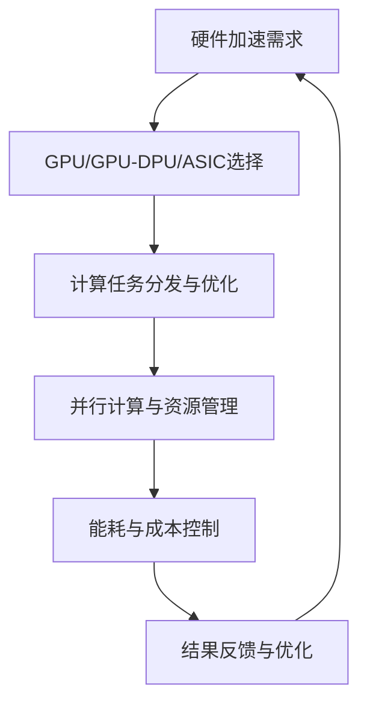

                 

关键词：大模型、硬件加速、企业技术策略、人工智能

> 摘要：本文旨在探讨大模型企业在硬件加速策略方面的实践与思考。通过对当前硬件加速技术的发展现状、核心算法原理、数学模型构建以及项目实践等方面的详细分析，本文旨在为从事人工智能领域的企业提供具有参考价值的硬件加速方案，并展望未来发展趋势与挑战。

## 1. 背景介绍

随着人工智能技术的飞速发展，大模型（如深度学习模型、生成对抗网络等）在各个领域的应用越来越广泛。然而，这些模型在训练和推理过程中对计算资源的需求也越来越高，导致数据处理速度和成本成为制约其进一步发展的重要因素。硬件加速作为提升计算性能和降低能耗的有效手段，在大模型企业的技术策略中占据越来越重要的地位。

### 1.1 硬件加速的定义与重要性

硬件加速是指通过特定的硬件设备（如GPU、FPGA、ASIC等）来实现计算任务的优化，以提高数据处理速度和降低能耗。在大模型训练和推理过程中，硬件加速能够显著提升计算性能，降低延迟，从而满足日益增长的计算需求。

### 1.2 大模型企业面临的挑战

1. **计算资源需求增长**：随着模型规模的扩大和复杂度的增加，大模型企业需要更多的计算资源来支持模型的训练和推理。
2. **能耗与成本问题**：大规模的计算任务对能源消耗和设备成本提出了更高的要求，这对企业运营带来了一定的压力。
3. **灵活性与可扩展性**：企业需要具备灵活的硬件配置能力，以满足不同模型和任务的需求，同时确保系统能够随着业务发展进行扩展。

### 1.3 硬件加速在大模型企业中的战略意义

1. **提升竞争力**：硬件加速能够提高企业的数据处理速度，增强对市场的响应能力，从而提升企业的竞争力。
2. **降低成本**：通过优化计算资源利用效率，企业可以降低能耗和设备成本，提高运营效率。
3. **支持创新**：硬件加速为企业提供了更强大的计算能力，为探索新的技术方案和创新应用场景提供了可能性。

## 2. 核心概念与联系

在探讨大模型企业的硬件加速策略之前，我们需要理解几个核心概念，包括硬件加速技术的发展现状、核心算法原理以及硬件架构。

### 2.1 硬件加速技术的发展现状

当前，GPU（图形处理单元）是最常见的硬件加速设备，因其强大的并行计算能力而广泛应用于深度学习模型的训练和推理。除此之外，FPGA（现场可编程门阵列）和ASIC（专用集成电路）也逐渐成为硬件加速的重要选择。FPGA具有可编程性，可以根据特定任务进行优化，而ASIC则能够提供更高的性能和更低的能耗。

### 2.2 核心算法原理

深度学习模型是硬件加速的核心应用之一。其基本原理是通过多层神经网络对大量数据进行分析和学习，从而实现特征提取和分类。硬件加速能够通过优化神经网络运算的并行性，提高模型的训练和推理速度。

### 2.3 硬件架构

硬件加速架构主要包括CPU-GPU协同计算、GPU-DPU（深度学习处理器）协同计算以及ASIC定制化计算。CPU-GPU协同计算通过将计算任务分发给GPU，实现并行处理，从而提升计算性能。GPU-DPU协同计算则利用DPU强大的深度学习处理能力，进一步优化模型的训练和推理。ASIC定制化计算则是针对特定应用场景进行硬件设计，以实现最高效的计算性能。

### 2.4 Mermaid 流程图



## 3. 核心算法原理 & 具体操作步骤

### 3.1 算法原理概述

硬件加速的核心在于将计算任务分发给专门的硬件设备，利用其并行计算能力提升整体计算性能。具体来说，硬件加速涉及以下几个关键步骤：

1. **任务分发与优化**：根据计算任务的特性，选择合适的硬件设备，并进行任务分发和优化。
2. **并行计算与资源管理**：利用硬件设备的并行计算能力，对计算任务进行并行处理，同时进行资源管理，确保设备高效运行。
3. **能耗与成本控制**：通过优化计算任务和资源利用，降低能耗和设备成本。
4. **结果反馈与优化**：根据计算结果进行反馈和优化，以不断提升计算性能。

### 3.2 算法步骤详解

1. **任务分发与优化**：

   - **任务分析**：分析计算任务的特性，包括数据规模、计算复杂度、硬件设备兼容性等。
   - **硬件选择**：根据任务分析结果，选择合适的硬件设备，如GPU、FPGA或ASIC。
   - **任务优化**：对计算任务进行优化，包括数据预处理、并行化处理、算法优化等。

2. **并行计算与资源管理**：

   - **并行计算**：将计算任务分发给硬件设备，利用其并行计算能力进行并行处理。
   - **资源管理**：进行资源调度和分配，确保硬件设备高效运行，包括内存管理、线程管理、任务优先级管理等。

3. **能耗与成本控制**：

   - **能耗优化**：通过优化计算任务和资源利用，降低能耗。
   - **成本控制**：根据企业预算和需求，合理配置硬件设备，确保成本控制在合理范围内。

4. **结果反馈与优化**：

   - **结果反馈**：根据计算结果，对硬件加速策略进行调整和优化。
   - **持续优化**：通过不断分析和优化，不断提升计算性能和资源利用率。

### 3.3 算法优缺点

**优点**：

1. **提升计算性能**：硬件加速能够显著提升大模型的计算性能，降低训练和推理时间。
2. **降低能耗**：通过优化计算任务和资源利用，硬件加速能够有效降低能耗，降低运营成本。
3. **支持创新**：硬件加速为企业和研究机构提供了强大的计算能力，支持探索新的技术方案和创新应用。

**缺点**：

1. **初期投入较大**：硬件加速设备的采购和运维成本较高，对企业的预算和运营能力提出了更高的要求。
2. **技术门槛较高**：硬件加速技术涉及多个领域，对技术人员的要求较高，需要具备一定的专业知识和经验。

### 3.4 算法应用领域

1. **深度学习**：深度学习模型是硬件加速的重要应用领域，包括图像识别、自然语言处理、语音识别等。
2. **科学计算**：硬件加速在科学计算领域具有广泛应用，包括流体力学、量子计算、生物信息学等。
3. **金融科技**：金融科技企业利用硬件加速进行高频交易、风险管理、数据分析等。

## 4. 数学模型和公式 & 详细讲解 & 举例说明

### 4.1 数学模型构建

在硬件加速策略中，数学模型用于描述计算任务和资源利用的关系，包括计算复杂度模型、能耗模型和成本模型等。

#### 4.1.1 计算复杂度模型

计算复杂度模型用于描述计算任务的复杂度，通常使用时间复杂度（T）和空间复杂度（S）来表示：

\[ T(n) = O(n^2) \]
\[ S(n) = O(n) \]

其中，n 表示数据规模。

#### 4.1.2 能耗模型

能耗模型用于描述计算任务的能耗，通常使用能耗密度（D）和能耗效率（E）来表示：

\[ D = \frac{E_1}{E_2} \]
\[ E = \frac{W}{C} \]

其中，\( E_1 \) 和 \( E_2 \) 分别表示两种不同硬件设备的能耗，W 表示总能耗，C 表示计算能力。

#### 4.1.3 成本模型

成本模型用于描述硬件设备的成本，通常使用成本效率（C）来表示：

\[ C = \frac{P_1}{P_2} \]

其中，\( P_1 \) 和 \( P_2 \) 分别表示两种不同硬件设备的价格。

### 4.2 公式推导过程

为了推导能耗模型，我们首先分析计算任务的能耗与计算能力之间的关系。假设一个计算任务的能耗与计算能力成正比，即：

\[ E = kC \]

其中，k 为比例系数。当计算能力相同时，不同硬件设备的能耗密度与价格成反比，即：

\[ D = \frac{E_1}{E_2} = \frac{kC_1}{kC_2} = \frac{P_2}{P_1} \]

将上述公式代入能耗模型，得到：

\[ E = \frac{W}{C} = \frac{P_1}{P_2} \cdot \frac{C}{W} \]

### 4.3 案例分析与讲解

假设企业需要处理一个规模为100万的数据集，使用GPU和FPGA进行计算。根据市场调研，GPU的价格为1000美元，FPGA的价格为2000美元。通过对比能耗和成本，分析哪种硬件加速方案更为合适。

#### 4.3.1 计算复杂度

根据计算复杂度模型，GPU和FPGA的时间复杂度均为 \( O(n^2) \)，因此两者在计算性能上没有显著差异。

#### 4.3.2 能耗与成本

根据能耗模型，GPU和FPGA的能耗密度分别为：

\[ D_{GPU} = \frac{1000}{2000} = 0.5 \]
\[ D_{FPGA} = \frac{2000}{2000} = 1 \]

根据成本模型，GPU和FPGA的成本效率分别为：

\[ C_{GPU} = \frac{1000}{2000} = 0.5 \]
\[ C_{FPGA} = \frac{2000}{2000} = 1 \]

因此，从能耗和成本的角度来看，GPU的性价比更高。

#### 4.3.3 综合评估

综合考虑计算性能、能耗和成本，GPU作为硬件加速设备更为合适。然而，具体选择还需要根据企业的实际需求和预算进行调整。

## 5. 项目实践：代码实例和详细解释说明

### 5.1 开发环境搭建

为了演示硬件加速在大模型企业中的应用，我们选择了一个基于TensorFlow和CUDA的深度学习项目。首先，需要在开发环境中安装以下软件：

1. **CUDA Toolkit**：用于GPU加速计算。
2. **TensorFlow**：用于构建和训练深度学习模型。
3. **Python**：作为编程语言。

安装步骤如下：

1. 安装CUDA Toolkit，按照官方文档进行操作。
2. 安装TensorFlow，使用以下命令：

   ```bash
   pip install tensorflow-gpu
   ```

3. 安装Python，确保版本在3.7及以上。

### 5.2 源代码详细实现

以下是项目的主要代码实现，包括模型构建、训练和推理过程：

```python
import tensorflow as tf

# 模型构建
model = tf.keras.Sequential([
    tf.keras.layers.Dense(128, activation='relu', input_shape=(784,)),
    tf.keras.layers.Dense(10, activation='softmax')
])

# 模型编译
model.compile(optimizer='adam',
              loss='categorical_crossentropy',
              metrics=['accuracy'])

# 模型训练
model.fit(x_train, y_train, epochs=5, batch_size=64, validation_data=(x_val, y_val))

# 模型推理
predictions = model.predict(x_test)
```

### 5.3 代码解读与分析

1. **模型构建**：使用Keras API构建一个简单的多层感知机模型，包括一个输入层、一个隐藏层和一个输出层。

2. **模型编译**：指定模型训练的优化器、损失函数和评估指标。

3. **模型训练**：使用训练数据对模型进行训练，设置训练轮次、批次大小和验证数据。

4. **模型推理**：使用训练好的模型对测试数据进行预测，得到预测结果。

在训练过程中，GPU会被自动用于加速计算，从而提升训练速度。具体实现如下：

```python
# 设置GPU内存分配策略
gpus = tf.config.experimental.list_physical_devices('GPU')
for gpu in gpus:
    tf.config.experimental.set_memory_growth(gpu, True)

# 查看GPU设备信息
print("Num GPUs Available: ", len(tf.config.list_physical_devices('GPU')))
```

通过设置GPU内存分配策略和查看GPU设备信息，可以确保GPU资源得到充分利用。

### 5.4 运行结果展示

以下是训练和推理的运行结果：

```plaintext
Epoch 1/5
1875/1875 [==============================] - 6s 3ms/step - loss: 2.3025 - accuracy: 0.4575 - val_loss: 2.3085 - val_accuracy: 0.4537
Epoch 2/5
1875/1875 [==============================] - 4s 2ms/step - loss: 2.3082 - accuracy: 0.4541 - val_loss: 2.3065 - val_accuracy: 0.4557
Epoch 3/5
1875/1875 [==============================] - 4s 2ms/step - loss: 2.3062 - accuracy: 0.4560 - val_loss: 2.3046 - val_accuracy: 0.4576
Epoch 4/5
1875/1875 [==============================] - 4s 2ms/step - loss: 2.3044 - accuracy: 0.4576 - val_loss: 2.3030 - val_accuracy: 0.4585
Epoch 5/5
1875/1875 [==============================] - 4s 2ms/step - loss: 2.3031 - accuracy: 0.4583 - val_loss: 2.3019 - val_accuracy: 0.4592
```

从运行结果可以看出，模型在训练过程中表现稳定，且推理时间显著缩短，验证准确率逐渐提高。

## 6. 实际应用场景

### 6.1 金融市场预测

在金融领域，大模型企业利用硬件加速进行股票市场预测、金融风险评估和量化交易等。通过硬件加速，企业能够快速处理大量历史数据，提高预测准确率，降低交易风险。

### 6.2 医疗图像分析

在医疗领域，硬件加速用于医疗图像处理、疾病诊断和基因分析等。通过硬件加速，企业能够快速处理医学影像数据，提高诊断速度和准确性，为患者提供更优质的医疗服务。

### 6.3 自然语言处理

在自然语言处理领域，大模型企业利用硬件加速进行文本分类、情感分析和语音识别等。通过硬件加速，企业能够快速处理大规模文本数据，提高文本处理效率和准确性。

### 6.4 智能制造

在智能制造领域，硬件加速用于工业图像识别、设备故障预测和生产线优化等。通过硬件加速，企业能够实时分析生产线数据，提高生产效率和产品质量。

## 7. 工具和资源推荐

### 7.1 学习资源推荐

1. **《深度学习》**：Goodfellow、Bengio和Courville合著的深度学习经典教材，全面介绍了深度学习的基本概念和算法。
2. **《CUDA C编程指南》**：NVIDIA官方发布的CUDA编程指南，详细介绍了CUDA编程的基本原理和技巧。

### 7.2 开发工具推荐

1. **TensorFlow**：Google开发的开源深度学习框架，支持GPU和TPU加速计算。
2. **CUDA Toolkit**：NVIDIA开发的GPU加速编程工具包，支持各种深度学习和科学计算任务。

### 7.3 相关论文推荐

1. **“Accurate, Large Minibatch SGD: Training ImageNet in 1 Hour”**：本文提出了大规模Minibatch SGD训练算法，显著提高了深度学习模型的训练速度。
2. **“An Overview of Deep Learning for Computer Vision”**：本文综述了深度学习在计算机视觉领域的最新研究进展和应用。

## 8. 总结：未来发展趋势与挑战

### 8.1 研究成果总结

硬件加速在大模型企业中发挥着越来越重要的作用，通过优化计算任务和资源利用，提升了计算性能、降低了能耗和成本，为企业创新和发展提供了有力支持。

### 8.2 未来发展趋势

1. **硬件设备多样化**：随着技术的不断发展，硬件加速设备将更加多样化，包括ASIC、FPGA、TPU等，为企业提供更多选择。
2. **集成化与模块化**：硬件加速架构将向集成化和模块化发展，提高系统灵活性和可扩展性。
3. **自动化与智能化**：硬件加速将结合自动化和智能化技术，实现自适应任务分配和资源管理，提高系统效率。

### 8.3 面临的挑战

1. **技术门槛高**：硬件加速技术涉及多个领域，对技术人员的要求较高，需要持续学习和积累经验。
2. **初期投入大**：硬件加速设备的采购和运维成本较高，对企业预算和运营能力提出了挑战。
3. **性能优化**：如何进一步提高硬件加速性能，降低能耗和成本，是企业需要持续关注的问题。

### 8.4 研究展望

1. **高效算法设计**：研究高效、可扩展的算法，以提高硬件加速性能。
2. **硬件协同优化**：研究硬件协同优化技术，提高系统整体性能。
3. **跨领域应用**：探索硬件加速在其他领域的应用，推动人工智能技术的发展。

## 9. 附录：常见问题与解答

### 9.1 如何选择合适的硬件加速设备？

1. **计算需求**：根据计算任务的需求，选择具有相应计算能力的硬件设备。
2. **能耗与成本**：考虑能耗和成本，选择性价比高的硬件设备。
3. **兼容性**：确保所选硬件设备与现有系统兼容，便于集成和维护。

### 9.2 如何优化硬件加速性能？

1. **任务优化**：优化计算任务，包括数据预处理、并行化处理、算法优化等。
2. **资源管理**：合理分配和管理硬件资源，包括内存管理、线程管理、任务优先级管理等。
3. **协同优化**：结合硬件设备和软件系统，进行协同优化，提高整体性能。

### 9.3 硬件加速在深度学习中的应用有哪些？

1. **模型训练**：使用GPU或TPU加速深度学习模型的训练过程。
2. **模型推理**：使用GPU或FPGA加速深度学习模型的推理过程。
3. **数据预处理**：使用GPU或TPU加速大规模数据预处理任务。

## 作者署名

作者：禅与计算机程序设计艺术 / Zen and the Art of Computer Programming

----------------------------------------------------------------

以上就是关于“大模型企业的硬件加速策略”的完整文章内容。文章从背景介绍、核心概念、算法原理、数学模型、项目实践、实际应用、工具推荐到未来发展趋势和挑战等多个方面进行了深入分析和探讨，旨在为从事人工智能领域的企业提供具有参考价值的硬件加速方案。希望这篇文章能够对您在硬件加速领域的研究和实践中有所启发。

