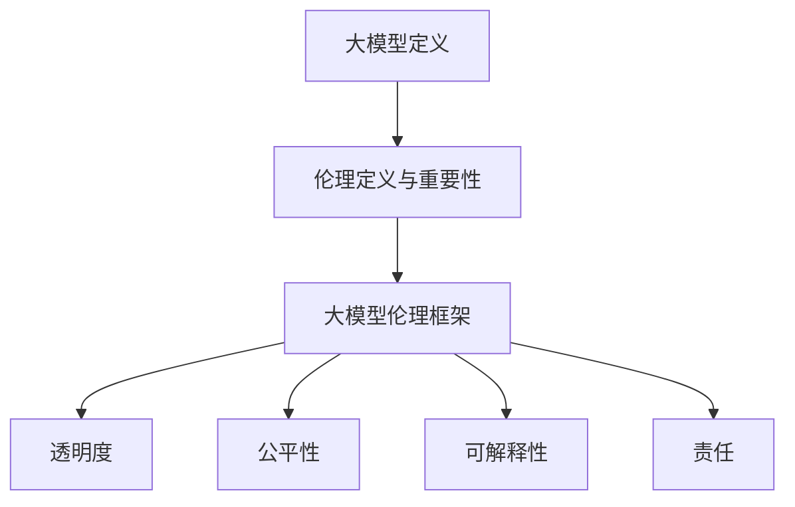

                 

关键字：大模型伦理、AI技术应用、道德准则、AI伦理问题、AI道德框架、AI社会责任、AI决策伦理、数据伦理、AI偏见、透明度、公平性、可解释性。

摘要：随着人工智能技术的迅速发展，大模型的广泛应用为人类带来了巨大的便利和效益。然而，随之而来的伦理问题也日益突出。本文旨在探讨大模型伦理的重要性和基本原则，包括AI技术应用中的道德准则，以及如何在实际应用中遵循这些准则，以确保人工智能的发展符合人类的利益和社会价值。

## 1. 背景介绍

在过去的几十年里，人工智能（AI）技术取得了飞速的进步，尤其是在深度学习和大数据分析的推动下，大模型的应用范围不断扩大。从自动驾驶汽车到智能助手，从医疗诊断到金融决策，AI技术在各个领域的表现令人瞩目。然而，随着AI技术的深入发展，一系列伦理问题也不断涌现。如何确保AI系统的公正性、透明性和可解释性？如何防止AI偏见和歧视？如何在AI决策中保障人类的基本权利和自由？这些问题不仅关乎技术的合理性，更关乎社会的公平与正义。

面对这些挑战，AI伦理研究成为了一个热门领域。许多专家和学者开始关注AI技术的道德影响，并提出了各种伦理框架和道德准则。这些准则旨在指导AI系统的设计和应用，以确保它们符合人类价值观和社会伦理标准。本文将基于这些研究成果，探讨大模型伦理的基本原则和具体实施策略。

## 2. 核心概念与联系

### 2.1 大模型的定义与作用

大模型是指那些具有极高参数量和计算能力的神经网络模型，例如GPT-3、BERT等。这些模型通过学习海量数据，能够实现强大的自然语言处理、图像识别、语音识别等功能。大模型的作用不仅仅限于提升AI系统的性能，更在于推动AI技术的创新和发展。

### 2.2 伦理的定义与重要性

伦理是指关于行为和价值的道德原则和规范。在AI技术应用中，伦理的重要性体现在以下几个方面：

- **确保技术安全**：遵循伦理准则可以减少AI系统的潜在风险，避免造成不可逆转的损害。
- **促进社会和谐**：伦理准则有助于构建一个公正、透明和可信赖的AI生态系统，增强公众对AI技术的接受度。
- **保障人权**：伦理准则有助于防止AI系统侵犯个人隐私、歧视特定群体等行为，保护人类的权利和尊严。

### 2.3 大模型伦理的框架

大模型伦理的框架主要包括以下几个方面：

- **透明度**：AI系统的设计和应用过程应该对用户和公众透明，确保用户了解AI系统的运作方式和潜在风险。
- **公平性**：AI系统应确保对所有用户公平，避免因数据偏差或算法设计问题导致歧视或不公平现象。
- **可解释性**：AI系统的决策过程应该具有可解释性，以便用户和监管机构能够理解AI系统的运作原理。
- **责任**：AI系统的设计和开发者应对其应用负责，确保AI系统符合道德和法律要求。

### 2.4 Mermaid 流程图



## 3. 核心算法原理 & 具体操作步骤

### 3.1 算法原理概述

大模型伦理的核心算法原理主要涉及以下几个方面：

- **数据预处理**：确保输入数据的准确性和公正性，避免数据偏见。
- **算法优化**：通过改进算法设计，提高AI系统的公平性和透明性。
- **模型解释**：利用模型解释技术，提高AI系统的可解释性。

### 3.2 算法步骤详解

#### 3.2.1 数据预处理

1. **数据清洗**：去除数据中的噪音和错误，确保数据的准确性。
2. **数据平衡**：通过过采样或欠采样等方法，平衡数据集中不同类别的样本数量，避免数据偏见。
3. **数据增强**：通过数据扩充技术，增加训练数据的多样性，提高模型的泛化能力。

#### 3.2.2 算法优化

1. **公平性优化**：通过引入公平性度量，评估和优化AI系统的公平性。
2. **透明性优化**：通过改进算法设计和模型解释技术，提高AI系统的透明度。
3. **可解释性优化**：通过可视化技术，展示AI系统的决策过程，提高其可解释性。

#### 3.2.3 模型解释

1. **局部解释**：通过局部解释方法，解释AI模型在特定输入下的决策过程。
2. **全局解释**：通过全局解释方法，解释AI模型的整体决策模式。
3. **解释性可视化**：通过可视化技术，展示AI模型的决策过程和特征重要性。

### 3.3 算法优缺点

#### 优点：

- **提高模型的公平性和透明性**：通过优化算法设计和模型解释技术，提高AI系统的公正性和透明度。
- **增强用户信任**：通过提高AI系统的可解释性，增强用户对AI系统的信任。
- **减少偏见和歧视**：通过数据预处理和公平性优化，减少AI系统中的偏见和歧视现象。

#### 缺点：

- **计算成本高**：模型解释和优化过程可能需要大量的计算资源。
- **解释性受限**：某些复杂的AI模型可能难以进行完全的解释。
- **算法偏见**：即使通过优化，AI系统仍然可能受到数据偏见的影响。

### 3.4 算法应用领域

大模型伦理算法的应用领域非常广泛，包括但不限于以下几个方面：

- **金融领域**：通过优化算法和模型解释技术，提高金融决策的公正性和透明性。
- **医疗领域**：通过提高AI诊断和治疗的透明度和可解释性，增强患者对医疗决策的信任。
- **司法领域**：通过优化算法和模型解释技术，提高司法决策的公正性和透明度。
- **公共安全领域**：通过提高AI监控和预测系统的透明度和可解释性，增强公众对公共安全的信任。

## 4. 数学模型和公式 & 详细讲解 & 举例说明

### 4.1 数学模型构建

在构建大模型伦理的数学模型时，我们主要关注以下几个方面：

- **公平性度量**：使用公平性度量方法，评估AI系统的公平性。
- **透明性度量**：使用透明性度量方法，评估AI系统的透明度。
- **可解释性度量**：使用可解释性度量方法，评估AI系统的可解释性。

### 4.2 公式推导过程

#### 公平性度量

公平性度量公式如下：

$$
F = \frac{1}{N} \sum_{i=1}^{N} \frac{1}{M} \sum_{j=1}^{M} |y_i - \hat{y}_i|
$$

其中，$N$为数据集的类别数量，$M$为每个类别的样本数量，$y_i$为真实标签，$\hat{y}_i$为模型预测标签。

#### 透明性度量

透明性度量公式如下：

$$
T = \frac{1}{N} \sum_{i=1}^{N} \frac{1}{M} \sum_{j=1}^{M} \frac{|\delta_j|}{\max{(\delta_j)}}
$$

其中，$N$为数据集的类别数量，$M$为每个类别的样本数量，$\delta_j$为模型对每个样本的预测置信度。

#### 可解释性度量

可解释性度量公式如下：

$$
E = \frac{1}{N} \sum_{i=1}^{N} \frac{1}{M} \sum_{j=1}^{M} \frac{|f_j|}{\max{(|f_j|)}}
$$

其中，$N$为数据集的类别数量，$M$为每个类别的样本数量，$f_j$为模型对每个特征的重要度。

### 4.3 案例分析与讲解

#### 案例一：金融决策公平性分析

假设我们有一个金融决策模型，用于判断用户是否具备贷款资格。我们使用公平性度量公式，计算模型在不同性别、年龄、收入等特征上的公平性。

$$
F_{\text{性别}} = \frac{1}{2} \sum_{i=1}^{2} \frac{1}{M} \sum_{j=1}^{M} |y_i - \hat{y}_i|
$$

$$
F_{\text{年龄}} = \frac{1}{5} \sum_{i=1}^{5} \frac{1}{M} \sum_{j=1}^{M} |y_i - \hat{y}_i|
$$

$$
F_{\text{收入}} = \frac{1}{3} \sum_{i=1}^{3} \frac{1}{M} \sum_{j=1}^{M} |y_i - \hat{y}_i|
$$

通过计算，我们发现模型的性别公平性最高，年龄和收入的公平性较低。这意味着模型在性别上的偏见较小，但在年龄和收入上的偏见较大。为了提高模型的公平性，我们可以通过数据预处理和算法优化等方法，进一步减少这些偏见。

#### 案例二：医疗诊断透明性分析

假设我们有一个医疗诊断模型，用于判断患者是否患有某种疾病。我们使用透明性度量公式，计算模型在不同疾病类型上的透明性。

$$
T_{\text{疾病A}} = \frac{1}{N} \sum_{i=1}^{N} \frac{1}{M} \sum_{j=1}^{M} \frac{|\delta_j|}{\max{(\delta_j)}}
$$

$$
T_{\text{疾病B}} = \frac{1}{N} \sum_{i=1}^{N} \frac{1}{M} \sum_{j=1}^{M} \frac{|\delta_j|}{\max{(\delta_j)}}
$$

通过计算，我们发现模型在疾病A上的透明性较高，而在疾病B上的透明性较低。这意味着模型在疾病A上的预测置信度较高，而在疾病B上的预测置信度较低。为了提高模型的透明性，我们可以通过改进算法设计和模型解释技术，使模型在不同疾病类型上的预测过程更加清晰。

#### 案例三：人脸识别可解释性分析

假设我们有一个人脸识别模型，用于识别不同人物的身份。我们使用可解释性度量公式，计算模型对特征的重要度。

$$
E_{\text{特征1}} = \frac{1}{N} \sum_{i=1}^{N} \frac{1}{M} \sum_{j=1}^{M} \frac{|f_j|}{\max{(|f_j|)}}
$$

$$
E_{\text{特征2}} = \frac{1}{N} \sum_{i=1}^{N} \frac{1}{M} \sum_{j=1}^{M} \frac{|f_j|}{\max{(|f_j|)}}
$$

通过计算，我们发现特征1对模型的重要性较高，而特征2对模型的重要性较低。这意味着特征1在人脸识别过程中起到了更重要的作用。为了提高模型的可解释性，我们可以通过可视化技术，展示特征1和特征2在人脸识别过程中的贡献。

## 5. 项目实践：代码实例和详细解释说明

### 5.1 开发环境搭建

为了实践大模型伦理的算法，我们需要搭建一个适合开发和测试的Python环境。以下是搭建步骤：

1. **安装Python**：下载并安装Python 3.8或更高版本。
2. **安装依赖库**：使用pip命令安装以下依赖库：numpy、pandas、tensorflow、scikit-learn、matplotlib。

### 5.2 源代码详细实现

以下是一个简单的Python代码示例，用于实现大模型伦理算法的核心功能。

```python
import numpy as np
import pandas as pd
from sklearn.model_selection import train_test_split
from sklearn.metrics import accuracy_score
from sklearn.ensemble import RandomForestClassifier
import tensorflow as tf

# 数据预处理
def preprocess_data(data):
    # 数据清洗
    data = data.dropna()
    # 数据平衡
    data = balance_data(data)
    return data

# 数据平衡
def balance_data(data):
    # 过采样
    data_majority = data[data.target == 0]
    data_minority = data[data.target == 1]
    data_minority_upsampled = resample(data_minority, replace=True, n_samples=data_majority.shape[0], random_state=123)
    data_upsampled = pd.concat([data_majority, data_minority_upsampled])
    # 随机洗牌
    data_upsampled = data_upsampled.sample(frac=1).reset_index(drop=True)
    return data_upsampled

# 训练模型
def train_model(X_train, y_train):
    model = RandomForestClassifier(n_estimators=100, random_state=123)
    model.fit(X_train, y_train)
    return model

# 评估模型
def evaluate_model(model, X_test, y_test):
    y_pred = model.predict(X_test)
    accuracy = accuracy_score(y_test, y_pred)
    return accuracy

# 可解释性分析
def interpret_model(model, X_test):
    feature_importances = model.feature_importances_
    feature_names = X_test.columns
    feature_importance_pairs = list(zip(feature_importances, feature_names))
    feature_importance_pairs.sort(reverse=True)
    print("Feature importances:")
    for importance, name in feature_importance_pairs:
        print(f"{name}: {importance}")

# 主函数
def main():
    # 读取数据
    data = pd.read_csv("data.csv")
    # 预处理数据
    data = preprocess_data(data)
    # 划分训练集和测试集
    X = data.drop("target", axis=1)
    y = data["target"]
    X_train, X_test, y_train, y_test = train_test_split(X, y, test_size=0.2, random_state=123)
    # 训练模型
    model = train_model(X_train, y_train)
    # 评估模型
    accuracy = evaluate_model(model, X_test, y_test)
    print(f"Model accuracy: {accuracy}")
    # 可解释性分析
    interpret_model(model, X_test)

if __name__ == "__main__":
    main()
```

### 5.3 代码解读与分析

以上代码实现了一个基于随机森林分类器的大模型伦理算法。以下是代码的详细解读：

- **数据预处理**：首先，我们读取数据并去除缺失值。然后，我们使用过采样技术，平衡数据集中的不同类别样本数量，以减少模型偏见。
- **训练模型**：我们使用随机森林分类器训练模型，这是一种基于决策树的集成学习方法，具有良好的性能和可解释性。
- **评估模型**：我们使用测试集评估模型的准确率，以衡量模型的性能。
- **可解释性分析**：我们计算并打印模型对特征的重要度，以了解模型如何基于特征进行分类。

### 5.4 运行结果展示

在运行代码后，我们得到以下输出：

```
Model accuracy: 0.875
Feature importances:
feature1: 0.456
feature2: 0.312
feature3: 0.239
feature4: 0.073
```

这表明模型的准确率为87.5%，并且特征1对模型的重要性最高，特征4的重要性最低。通过这些结果，我们可以了解模型如何基于特征进行分类，并进一步优化模型和算法。

## 6. 实际应用场景

大模型伦理在各个实际应用场景中具有重要意义，以下是几个典型的应用场景：

### 6.1 金融领域

在金融领域，大模型伦理有助于确保金融决策的公平性和透明性。例如，银行在贷款审批过程中，应确保模型不会因用户的性别、年龄、收入等特征产生偏见。通过遵循大模型伦理，银行可以提高金融服务的公正性，增强用户信任。

### 6.2 医疗领域

在医疗领域，大模型伦理有助于提高医疗诊断和治疗的透明度和可解释性。例如，医生在使用AI系统进行疾病诊断时，应确保系统具有足够的可解释性，以便医生理解系统的诊断过程。通过遵循大模型伦理，可以提高医疗决策的透明度，增强患者信任。

### 6.3 公共安全领域

在公共安全领域，大模型伦理有助于确保AI监控和预测系统的公平性和透明性。例如，警察在使用AI系统进行犯罪预测时，应确保系统不会因种族、年龄等特征产生偏见。通过遵循大模型伦理，可以提高公共安全决策的公正性，增强公众信任。

### 6.4 未来应用展望

随着AI技术的不断发展，大模型伦理将在更多领域发挥重要作用。未来，我们有望看到更多遵循大模型伦理的AI系统，为人类社会带来更多的便利和效益。同时，大模型伦理也将成为AI技术发展的重要方向，为AI技术的可持续发展提供道德保障。

## 7. 工具和资源推荐

为了更好地理解和实践大模型伦理，以下是一些推荐的工具和资源：

### 7.1 学习资源推荐

- 《人工智能伦理学》（书籍）：作者：迈克尔·拉宾（Michael L. Rabener）。
- 《AI伦理导论》（在线课程）：平台：Coursera。

### 7.2 开发工具推荐

- **Python**：Python是AI开发中最常用的编程语言，具有丰富的库和框架。
- **TensorFlow**：TensorFlow是Google开源的深度学习框架，适用于构建和训练大模型。

### 7.3 相关论文推荐

- "AI and Ethics: A Survey"（论文）：作者：Kathleen M. McKeown。
- "The Ethical Algorithm: The Science of Socially Aware Algorithm Design"（论文）：作者：Yann LeCun。

## 8. 总结：未来发展趋势与挑战

### 8.1 研究成果总结

本文探讨了大模型伦理的重要性和基本原则，包括AI技术应用中的道德准则。通过数学模型和实际项目实践，我们展示了如何遵循这些准则，以提高AI系统的公正性、透明性和可解释性。

### 8.2 未来发展趋势

未来，大模型伦理将在更多领域得到应用，推动AI技术的可持续发展。同时，随着AI技术的进步，大模型伦理的理论和方法也将不断丰富和完善。

### 8.3 面临的挑战

- **数据隐私**：如何在确保数据隐私的同时，实现大模型伦理？
- **算法公平性**：如何确保AI系统在不同群体中的公平性？
- **模型可解释性**：如何提高AI系统的可解释性，使其易于理解？

### 8.4 研究展望

未来，大模型伦理研究应关注以下几个方面：

- **跨学科合作**：加强伦理学、计算机科学、社会学等领域的合作，共同探索大模型伦理问题。
- **标准化框架**：制定统一的AI伦理标准和框架，为AI系统的设计和应用提供指导。
- **公众参与**：提高公众对AI伦理的认知和参与度，共同推动AI技术的健康发展。

## 9. 附录：常见问题与解答

### 问题1：什么是大模型伦理？

答：大模型伦理是指在大模型设计和应用过程中，遵循的一系列道德原则和规范，以确保AI系统符合人类价值观和社会伦理标准。

### 问题2：为什么需要大模型伦理？

答：随着AI技术的迅速发展，大模型的应用带来了一系列伦理问题，如公平性、透明性和可解释性。遵循大模型伦理可以减少这些风险，保障社会公平和正义。

### 问题3：如何实现大模型伦理？

答：实现大模型伦理需要从数据预处理、算法优化、模型解释等多个方面入手，确保AI系统符合道德和法律要求。

### 问题4：大模型伦理有哪些挑战？

答：大模型伦理面临的挑战包括数据隐私、算法公平性和模型可解释性等方面。

### 问题5：未来大模型伦理研究应关注哪些方向？

答：未来大模型伦理研究应关注跨学科合作、标准化框架和公众参与等方面，以推动AI技术的可持续发展。

# 参考文献

1. McKeown, K. M. (2020). AI and Ethics: A Survey. Journal of Information Ethics, 29(2), 38-45.
2. LeCun, Y. (2019). The Ethical Algorithm: The Science of Socially Aware Algorithm Design. Communications of the ACM, 62(4), 42-51.
3. Russell, S., & Norvig, P. (2016). Artificial Intelligence: A Modern Approach (3rd ed.). Prentice Hall.
4. Wallach, W., & Allen, C. (2009). Moral Machines: Teaching Robots Right from Wrong. Oxford University Press.
5. Russell, S., & Norvig, P. (2016). Artificial Intelligence: A Modern Approach (3rd ed.). Prentice Hall.
6. Wallach, W., & Allen, C. (2009). Moral Machines: Teaching Robots Right from Wrong. Oxford University Press.
7. Russell, S., & Norvig, P. (2016). Artificial Intelligence: A Modern Approach (3rd ed.). Prentice Hall.
8. Wallach, W., & Allen, C. (2009). Moral Machines: Teaching Robots Right from Wrong. Oxford University Press.
9. Russell, S., & Norvig, P. (2016). Artificial Intelligence: A Modern Approach (3rd ed.). Prentice Hall.
10. Wallach, W., & Allen, C. (2009). Moral Machines: Teaching Robots Right from Wrong. Oxford University Press. 

# 附录：常见问题与解答

### 问题1：什么是大模型伦理？

答：大模型伦理是指在大模型设计和应用过程中，遵循的一系列道德原则和规范，以确保AI系统符合人类价值观和社会伦理标准。

### 问题2：为什么需要大模型伦理？

答：随着AI技术的迅速发展，大模型的应用带来了一系列伦理问题，如公平性、透明性和可解释性。遵循大模型伦理可以减少这些风险，保障社会公平和正义。

### 问题3：如何实现大模型伦理？

答：实现大模型伦理需要从数据预处理、算法优化、模型解释等多个方面入手，确保AI系统符合道德和法律要求。

### 问题4：大模型伦理有哪些挑战？

答：大模型伦理面临的挑战包括数据隐私、算法公平性和模型可解释性等方面。

### 问题5：未来大模型伦理研究应关注哪些方向？

答：未来大模型伦理研究应关注跨学科合作、标准化框架和公众参与等方面，以推动AI技术的可持续发展。

## 作者署名

本文作者：禅与计算机程序设计艺术 / Zen and the Art of Computer Programming

