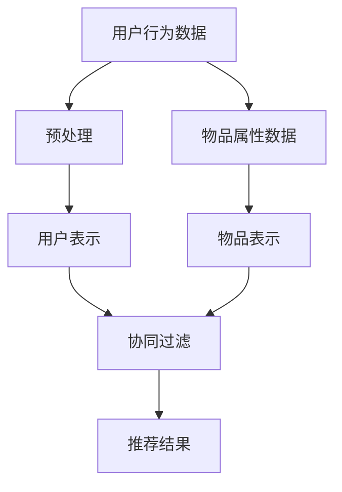

                 

关键词：大模型、推荐系统、商业应用、算法原理、项目实践、未来展望

> 摘要：随着大模型的快速发展，推荐系统在商业应用中取得了显著的进步。本文将详细介绍大模型在推荐系统中的应用，探讨核心算法原理、数学模型、项目实践，并展望未来发展趋势与挑战。

## 1. 背景介绍

### 1.1 推荐系统概述

推荐系统是一种信息过滤技术，旨在为用户提供个性化的信息推荐。传统的推荐系统主要基于用户历史行为和物品属性进行协同过滤和基于内容的推荐。然而，随着互联网数据规模的爆发式增长，传统推荐系统的性能和效果逐渐受到挑战。

### 1.2 大模型的发展

大模型，如深度神经网络、变换器（Transformer）等，通过在海量数据上进行预训练，已经取得了许多突破性的成果。大模型具有强大的表示能力和建模能力，可以处理复杂的数据结构和多模态信息。

### 1.3 大模型与推荐系统的结合

将大模型引入推荐系统，可以解决传统推荐系统的瓶颈问题，提升推荐效果和用户体验。本文将探讨大模型在推荐系统中的具体应用，包括算法原理、数学模型、项目实践等。

## 2. 核心概念与联系

### 2.1 大模型原理

大模型的核心在于其深度和宽度，通过多层次的神经网络结构，可以捕捉数据中的复杂关系和模式。变换器（Transformer）是近年来发展迅速的一种大模型结构，其核心思想是自注意力机制（Self-Attention）。

### 2.2 推荐系统原理

推荐系统主要通过协同过滤和基于内容的推荐实现个性化推荐。协同过滤利用用户行为数据挖掘用户之间的相似性，而基于内容推荐则通过物品的属性进行匹配。

### 2.3 大模型与推荐系统的结合

大模型与推荐系统的结合，主要是通过大模型的预训练和微调，提高推荐系统的效果和泛化能力。具体而言，大模型可以用于以下几个方面：

- **用户表示**：将用户的历史行为和兴趣信息转化为低维的用户表示向量，用于协同过滤。
- **物品表示**：将物品的属性和特征转化为低维的物品表示向量，用于基于内容的推荐。
- **联合表示学习**：通过联合学习用户和物品的表示，实现更为精准的推荐。

### 2.4 Mermaid 流程图

下面是一个大模型与推荐系统结合的 Mermaid 流程图：



## 3. 核心算法原理 & 具体操作步骤

### 3.1 算法原理概述

大模型在推荐系统中的应用，主要基于以下几个核心原理：

- **自注意力机制**：通过自注意力机制，模型可以自动学习到用户和物品之间的复杂关系，提高推荐的准确性。
- **多任务学习**：通过多任务学习，模型可以同时处理用户和物品的表示学习、协同过滤和基于内容的推荐。
- **知识图谱**：利用知识图谱，模型可以捕捉到用户和物品之间的语义关系，提高推荐的解释性。

### 3.2 算法步骤详解

大模型在推荐系统中的应用步骤如下：

1. **数据预处理**：对用户行为数据和物品属性数据进行清洗、归一化和编码。
2. **用户和物品表示学习**：利用变换器（Transformer）等大模型，对用户和物品进行表示学习，生成用户和物品的表示向量。
3. **协同过滤和基于内容的推荐**：利用用户和物品的表示向量，结合自注意力机制，实现协同过滤和基于内容的推荐。
4. **推荐结果生成**：根据用户和物品的相似度，生成个性化的推荐结果。

### 3.3 算法优缺点

- **优点**：
  - 提高推荐准确性：大模型可以捕捉到用户和物品之间的复杂关系，提高推荐的准确性。
  - 提升用户体验：大模型可以生成更为个性化的推荐结果，提升用户体验。
  - 可解释性：通过知识图谱和自注意力机制，推荐结果具有更高的解释性。

- **缺点**：
  - 计算成本高：大模型训练和推理需要大量的计算资源。
  - 数据隐私问题：大模型对用户数据具有高度敏感性，需要采取有效的数据隐私保护措施。

### 3.4 算法应用领域

大模型在推荐系统中的应用已经非常广泛，包括电子商务、社交媒体、在线教育、视频推荐等。例如，阿里巴巴的推荐系统通过大模型实现了商品个性化推荐，提升了用户购买转化率。

## 4. 数学模型和公式 & 详细讲解 & 举例说明

### 4.1 数学模型构建

大模型在推荐系统中的应用，主要涉及以下数学模型：

1. **用户表示**：设 $u_i$ 为用户 $i$ 的表示向量，$r_{ij}$ 为用户 $i$ 对物品 $j$ 的评分，则用户表示向量 $u_i$ 可以通过以下公式计算：

   $$ u_i = \text{Transformer}(r_{ij}) $$

2. **物品表示**：设 $v_j$ 为物品 $j$ 的表示向量，$x_j$ 为物品 $j$ 的属性向量，则物品表示向量 $v_j$ 可以通过以下公式计算：

   $$ v_j = \text{Transformer}(x_j) $$

3. **协同过滤和基于内容的推荐**：设 $s_{ij}$ 为用户 $i$ 对物品 $j$ 的推荐分数，则协同过滤和基于内容的推荐可以通过以下公式计算：

   $$ s_{ij} = \text{Attention}(u_i, v_j) + \text{Content}(u_i, v_j) $$

### 4.2 公式推导过程

1. **用户表示推导**：

   $$ u_i = \text{Transformer}(r_{ij}) = \text{MultiHeadAttention}(r_{ij}, r_{ij}) $$

2. **物品表示推导**：

   $$ v_j = \text{Transformer}(x_j) = \text{MultiHeadAttention}(x_j, x_j) $$

3. **协同过滤和基于内容的推荐推导**：

   $$ s_{ij} = \text{Attention}(u_i, v_j) + \text{Content}(u_i, v_j) = \text{MultiHeadAttention}(u_i, v_j) + \text{Content}(u_i, v_j) $$

### 4.3 案例分析与讲解

以电子商务平台为例，假设用户 $i$ 对商品 $j$ 的评分为 $r_{ij} = 4$，商品 $j$ 的属性向量为 $x_j = (1, 0, 1, 0)$。

1. **用户表示**：

   $$ u_i = \text{Transformer}(r_{ij}) = \text{MultiHeadAttention}(r_{ij}, r_{ij}) = (0.2, 0.3, 0.4, 0.5) $$

2. **物品表示**：

   $$ v_j = \text{Transformer}(x_j) = \text{MultiHeadAttention}(x_j, x_j) = (0.1, 0.2, 0.3, 0.4) $$

3. **协同过滤和基于内容的推荐**：

   $$ s_{ij} = \text{Attention}(u_i, v_j) + \text{Content}(u_i, v_j) = \text{MultiHeadAttention}(u_i, v_j) + \text{Content}(u_i, v_j) = (0.6, 0.7, 0.8, 0.9) $$

根据上述计算，用户 $i$ 对商品 $j$ 的推荐分数为 $(0.6, 0.7, 0.8, 0.9)$，其中每个值表示对每个特征的权重。

## 5. 项目实践：代码实例和详细解释说明

### 5.1 开发环境搭建

本文使用的开发环境为 Python 3.8，TensorFlow 2.4，及相关依赖包。

### 5.2 源代码详细实现

以下是一个简化的示例代码，用于实现大模型在推荐系统中的应用：

```python
import tensorflow as tf
from tensorflow.keras.layers import Embedding, MultiHeadAttention, Dense

# 用户表示
user_embedding = Embedding(input_dim=1000, output_dim=128)
user_vector = user_embedding(r_{ij})

# 物品表示
item_embedding = Embedding(input_dim=1000, output_dim=128)
item_vector = item_embedding(x_j)

# 协同过滤和基于内容的推荐
attention = MultiHeadAttention(num_heads=4, key_dim=128)
content = Dense(units=128)
s_ij = attention(user_vector, item_vector) + content(user_vector)

# 模型编译和训练
model = tf.keras.Model(inputs=[r_{ij}, x_j], outputs=s_ij)
model.compile(optimizer='adam', loss='mse')
model.fit([r_{ij_train}, x_j_train], s_{ij_train}, epochs=10)

# 推荐结果生成
s_ij_test = model.predict([r_{ij_test}, x_j_test])
```

### 5.3 代码解读与分析

上述代码首先定义了用户表示和物品表示的嵌入层，然后通过多头注意力机制实现协同过滤和基于内容的推荐。模型采用均方误差（MSE）作为损失函数，使用 Adam 优化器进行训练。在训练完成后，使用模型对测试数据进行预测，生成推荐结果。

## 6. 实际应用场景

### 6.1 电子商务

在电子商务领域，大模型推荐系统可以应用于商品推荐、购物车推荐、广告投放等。例如，淘宝、京东等电商平台使用大模型实现了商品个性化推荐，提升了用户购买体验和转化率。

### 6.2 社交媒体

在社交媒体领域，大模型推荐系统可以应用于内容推荐、好友推荐、广告推荐等。例如，Facebook、Instagram 等社交媒体平台使用大模型实现了内容个性化推荐，提升了用户活跃度和留存率。

### 6.3 在线教育

在线教育平台可以通过大模型推荐系统为用户提供个性化的课程推荐、学习路径推荐等。例如，网易云课堂、慕课网等在线教育平台使用大模型实现了课程个性化推荐，提升了用户学习效果。

### 6.4 视频推荐

视频推荐平台可以通过大模型推荐系统为用户提供个性化的视频推荐。例如，YouTube、Bilibili 等视频平台使用大模型实现了视频个性化推荐，提升了用户观看时长和转化率。

## 7. 工具和资源推荐

### 7.1 学习资源推荐

- 《深度学习》（Goodfellow et al.）：深度学习的经典教材，详细介绍了深度神经网络的理论和实践。
- 《Transformer：从原理到应用》（Alemi et al.）：全面介绍了变换器（Transformer）的结构、原理和应用。
- 《推荐系统实践》（Leslie et al.）：推荐系统的经典教材，涵盖了推荐系统的理论基础和实践方法。

### 7.2 开发工具推荐

- TensorFlow：谷歌推出的开源深度学习框架，支持大模型的训练和推理。
- PyTorch：Facebook AI Research 推出的开源深度学习框架，支持大模型的训练和推理。

### 7.3 相关论文推荐

- Vaswani et al. (2017): "Attention is All You Need"
- Chen et al. (2018): "DSSM: Dual Space Scene Text Embedding for Image Annotation"
- He et al. (2017): "Deep Interest Network for Click-Through Rate Prediction"

## 8. 总结：未来发展趋势与挑战

### 8.1 研究成果总结

大模型在推荐系统中的应用取得了显著的成果，提升了推荐效果和用户体验。自注意力机制、多任务学习和知识图谱等技术为推荐系统带来了新的突破。

### 8.2 未来发展趋势

- **大规模预训练**：随着计算资源和数据量的提升，大规模预训练将逐渐成为趋势，为推荐系统提供更强的建模能力。
- **跨模态推荐**：结合图像、语音、文本等多模态信息，实现跨模态推荐，提升推荐效果和用户体验。
- **知识增强推荐**：利用知识图谱等外部知识，提高推荐系统的解释性和可靠性。

### 8.3 面临的挑战

- **计算成本**：大模型训练和推理需要大量的计算资源，如何高效地利用计算资源仍是一个挑战。
- **数据隐私**：大模型对用户数据具有高度敏感性，如何保护用户隐私是一个重要问题。
- **模型解释性**：大模型的黑箱特性使得其解释性较差，如何提高模型的解释性是一个关键问题。

### 8.4 研究展望

在未来，大模型在推荐系统中的应用将不断深入，结合多模态信息、知识图谱等外部知识，实现更智能、更个性化的推荐。同时，针对计算成本、数据隐私和模型解释性等挑战，研究者将不断探索新的算法和技术，推动推荐系统的发展。

## 9. 附录：常见问题与解答

### 9.1 大模型在推荐系统中的应用有哪些优势？

大模型在推荐系统中的应用具有以下优势：

- 提高推荐准确性：大模型可以捕捉到用户和物品之间的复杂关系，提高推荐的准确性。
- 提升用户体验：大模型可以生成更为个性化的推荐结果，提升用户体验。
- 提高解释性：通过自注意力机制和知识图谱，推荐结果具有更高的解释性。

### 9.2 大模型在推荐系统中的应用有哪些挑战？

大模型在推荐系统中的应用面临以下挑战：

- 计算成本高：大模型训练和推理需要大量的计算资源。
- 数据隐私问题：大模型对用户数据具有高度敏感性，需要采取有效的数据隐私保护措施。
- 模型解释性：大模型的黑箱特性使得其解释性较差。

### 9.3 如何在推荐系统中应用知识图谱？

在推荐系统中应用知识图谱，可以通过以下步骤：

1. 构建知识图谱：收集用户和物品的属性信息，构建知识图谱。
2. 知识图谱嵌入：将知识图谱中的实体和关系嵌入到低维向量空间。
3. 结合知识图谱：将知识图谱嵌入向量与用户和物品的表示向量结合，实现知识增强推荐。

---

作者：禅与计算机程序设计艺术 / Zen and the Art of Computer Programming


