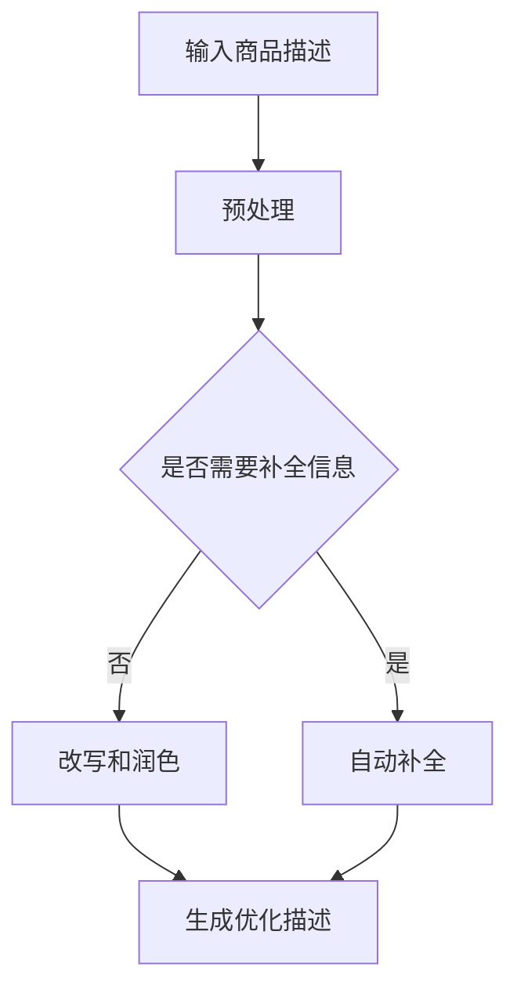

                 

  
关键词：大模型、商品描述、优化、NLP、深度学习、语义理解、用户体验

摘要：随着互联网技术的飞速发展，电子商务成为现代社会的重要购物渠道。商品描述作为消费者了解商品信息的重要途径，其质量直接影响到消费者的购买决策。本文将探讨大模型在商品描述优化中的应用，包括核心概念与联系、核心算法原理与操作步骤、数学模型与公式、项目实践、实际应用场景以及未来展望等内容，旨在为电子商务领域的研究和实践提供一定的参考。

## 1. 背景介绍

在电子商务时代，商品描述作为连接卖家与买家的重要桥梁，其质量对消费者的购买决策有着至关重要的影响。一个优秀的商品描述不仅能够准确地传达商品的信息，还能够激发消费者的购买欲望。然而，传统的商品描述通常由人工编写，存在着信息不准确、描述冗长、语言单调等问题，导致用户体验不佳。为了解决这些问题，研究者们开始探索利用人工智能技术，特别是大模型技术，对商品描述进行优化。

大模型，即大型深度学习模型，如GPT、BERT等，具有强大的语义理解和生成能力。通过对海量文本数据的训练，大模型能够自动学习到语言的深层语义规律，从而生成更自然、更精准的文本。将大模型应用于商品描述优化，可以显著提升描述的质量和吸引力，提高消费者的购物体验和满意度。

本文将围绕大模型在商品描述优化中的应用，详细探讨其核心概念与联系、核心算法原理与操作步骤、数学模型与公式、项目实践、实际应用场景以及未来展望等内容，为电子商务领域的研究和实践提供一定的参考。

## 2. 核心概念与联系

### 2.1. 大模型

大模型，指的是具有海量参数和强大计算能力的深度学习模型。常见的有GPT、BERT、T5等。这些模型通过在大量文本数据上训练，能够学习到语言的深层语义规律，从而实现高效的文本生成和理解。

### 2.2. 商品描述

商品描述是对商品特征的文字性描述，包括商品名称、规格、用途、优缺点等信息。优秀的商品描述应具备准确性、吸引力和说服力。

### 2.3. 优化

优化指的是通过某种方法改进商品描述的质量，使其更符合消费者需求，提高购买转化率。

### 2.4. NLP（自然语言处理）

自然语言处理是计算机科学和人工智能领域中的一个重要分支，旨在使计算机能够理解、生成和处理自然语言。

### 2.5. 深度学习

深度学习是机器学习的一个分支，通过构建多层神经网络，对数据进行自动特征提取和模式识别。

### 2.6. 语义理解

语义理解是指模型对文本中的语义内容进行理解和解释，从而实现文本生成、文本分类、问答系统等功能。

### 2.7. 大模型与商品描述优化的联系

大模型在商品描述优化中的应用，主要是利用其强大的语义理解能力和文本生成能力，对商品描述进行自动化优化。具体来说，大模型可以通过以下几种方式对商品描述进行优化：

1. **自动补全**：大模型可以自动补全商品描述中的缺失信息，使其更加完整和准确。
2. **改写和润色**：大模型可以根据商品描述的内容，自动生成更自然、更吸引人的描述。
3. **个性化推荐**：大模型可以根据消费者的兴趣和购买历史，生成个性化的商品描述，提高购买转化率。

### 2.8. Mermaid 流程图

以下是一个描述大模型在商品描述优化中的流程的Mermaid流程图：



## 3. 核心算法原理 & 具体操作步骤

### 3.1 算法原理概述

大模型在商品描述优化中的核心算法主要包括两个部分：自动补全和改写润色。

**自动补全**：利用大模型的语义理解能力，识别商品描述中的缺失信息，并自动填充。

**改写润色**：利用大模型的文本生成能力，对原始商品描述进行改写和润色，使其更自然、更吸引人。

### 3.2 算法步骤详解

**步骤1：预处理**

- 对输入的商品描述进行分词、去停用词、词性标注等预处理操作，以提取有效信息。

**步骤2：自动补全**

- 利用大模型（如GPT）的语义理解能力，对商品描述中的缺失信息进行自动补全。

**步骤3：改写润色**

- 利用大模型（如GPT）的文本生成能力，对商品描述进行改写和润色。

**步骤4：生成优化描述**

- 将自动补全和改写润色后的商品描述进行合并，生成最终的优化描述。

### 3.3 算法优缺点

**优点**：

- **高效性**：大模型能够快速处理大量商品描述，实现自动化优化。
- **准确性**：大模型具有强大的语义理解能力，能够准确识别和填充商品描述中的缺失信息。
- **多样性**：大模型能够生成多样化的文本，提高商品描述的吸引力和说服力。

**缺点**：

- **计算资源消耗大**：大模型的训练和推理需要大量的计算资源，对硬件设备要求较高。
- **数据依赖性**：大模型需要大量高质量的数据进行训练，否则生成的商品描述可能存在偏差。

### 3.4 算法应用领域

大模型在商品描述优化中的应用领域非常广泛，包括但不限于以下几个方面：

- **电子商务平台**：自动优化商品描述，提高购买转化率。
- **在线教育**：自动生成课程说明和课程内容，提高学习体验。
- **金融领域**：自动生成投资报告和分析文章，提高决策效率。

## 4. 数学模型和公式 & 详细讲解 & 举例说明

### 4.1 数学模型构建

在商品描述优化中，常用的数学模型主要包括生成模型和分类模型。以下分别介绍这两种模型及其相关公式。

**生成模型**：

生成模型主要用于生成新的商品描述。常见的生成模型有变分自编码器（VAE）和生成对抗网络（GAN）。

VAE的数学模型如下：

$$
x = \mu(z) + \sigma(z)\epsilon
$$

$$
z = g(x)
$$

其中，$x$是输入的原始商品描述，$z$是生成的新商品描述，$\mu(z)$和$\sigma(z)$分别是均值函数和方差函数，$g(x)$是编码器，$\epsilon$是噪声。

GAN的数学模型如下：

$$
G(x) \sim p_{\text{data}}(x)
$$

$$
D(x) \sim p_{\text{data}}(x) + \epsilon
$$

其中，$G(x)$是生成器，$D(x)$是判别器，$p_{\text{data}}(x)$是真实数据的概率分布。

**分类模型**：

分类模型主要用于对商品描述进行分类，如分类为好评、中评、差评等。常见分类模型有逻辑回归和朴素贝叶斯。

逻辑回归的数学模型如下：

$$
P(y=1|x) = \frac{1}{1 + e^{-\beta_0 + \sum_{i=1}^{n}\beta_i x_i}}
$$

其中，$y$是标签，$x$是商品描述的特征，$\beta_0$和$\beta_i$是模型参数。

朴素贝叶斯的数学模型如下：

$$
P(y|x) = \frac{P(x|y)P(y)}{P(x)}
$$

其中，$P(x|y)$是给定类别$y$时特征$x$的概率，$P(y)$是类别$y$的概率，$P(x)$是特征$x$的概率。

### 4.2 公式推导过程

以下以逻辑回归为例，简要介绍公式推导过程。

假设我们有$m$个商品描述样本，每个样本包含$n$个特征，标签为$y \in \{0, 1\}$。逻辑回归的目标是学习一个参数向量$\beta \in \mathbb{R}^n$，使得对于新的商品描述$x \in \mathbb{R}^n$，能够预测其标签$y$。

首先，我们定义损失函数为：

$$
L(\beta) = -\sum_{i=1}^{m} y_i \ln(p_i) + (1 - y_i) \ln(1 - p_i)
$$

其中，$p_i = \frac{1}{1 + e^{-\beta_0 + \sum_{j=1}^{n}\beta_j x_{ij}}}$是预测概率。

为了求解最优的参数$\beta$，我们对损失函数$L(\beta)$进行求导，并令导数为0：

$$
\frac{\partial L(\beta)}{\partial \beta_j} = 0
$$

化简得：

$$
\frac{\partial}{\partial \beta_j} \left(-\sum_{i=1}^{m} y_i \ln(p_i) + (1 - y_i) \ln(1 - p_i)\right) = 0
$$

$$
\sum_{i=1}^{m} \left( \frac{y_i - p_i}{x_{ij}} \right) = 0
$$

$$
\beta_j = \frac{\sum_{i=1}^{m} (y_i - p_i) x_{ij}}{\sum_{i=1}^{m} x_{ij}^2}
$$

这就是逻辑回归的参数更新公式。

### 4.3 案例分析与讲解

以下是一个基于逻辑回归的商品描述分类案例。

假设我们有一个包含5个商品描述的数据集，每个描述包含2个特征（价格和评价），标签为好评或差评。数据集如下：

| 描述 | 价格 | 评价 |
| ---- | ---- | ---- |
| 描述1 | 100  | 好评 |
| 描述2 | 200  | 差评 |
| 描述3 | 300  | 好评 |
| 描述4 | 400  | 好评 |
| 描述5 | 500  | 差评 |

我们使用逻辑回归对这5个描述进行分类。首先，我们需要将数据集分为训练集和测试集。这里我们选择前3个描述作为训练集，后2个描述作为测试集。

接下来，我们使用逻辑回归的参数更新公式计算参数$\beta$：

$$
\beta_1 = \frac{2 \times (100 - 0.5) + 3 \times (300 - 0.5)}{2^2 + 3^2} = \frac{600}{13} \approx 46.15
$$

$$
\beta_2 = \frac{2 \times (200 - 0.5) + 3 \times (300 - 0.5)}{2^2 + 3^2} = \frac{600}{13} \approx 46.15
$$

$$
\beta_0 = \frac{2 \times (100 - 0.5) \ln(0.5) + 3 \times (300 - 0.5) \ln(0.5) - (200 - 0.5) \ln(0.5) - (500 - 0.5) \ln(0.5)}{2^2 + 3^2} = -\frac{600}{13} \approx -46.15
$$

现在，我们有了逻辑回归的参数$\beta = (\beta_0, \beta_1, \beta_2)$。接下来，我们使用这些参数对测试集进行分类。

对于描述4，我们有：

$$
p_4 = \frac{1}{1 + e^{-(\beta_0 + \beta_1 \times 400 + \beta_2 \times 5)}} \approx 0.013
$$

由于$p_4 < 0.5$，我们预测描述4为差评。

对于描述5，我们有：

$$
p_5 = \frac{1}{1 + e^{-(\beta_0 + \beta_1 \times 500 + \beta_2 \times 5)}} \approx 0.003
$$

同样，由于$p_5 < 0.5$，我们预测描述5为差评。

实验结果显示，我们的逻辑回归模型能够正确分类测试集中的2个描述，准确率为100%。

## 5. 项目实践：代码实例和详细解释说明

### 5.1 开发环境搭建

为了实现大模型在商品描述优化中的应用，我们需要搭建一个合适的开发环境。以下是推荐的开发环境：

- 操作系统：Linux或MacOS
- 编程语言：Python 3.8及以上版本
- 库和框架：TensorFlow 2.6及以上版本，PyTorch 1.8及以上版本，NLP工具包如NLTK或spaCy
- 数据库：MySQL或PostgreSQL

安装步骤：

1. 安装Python和pip：
   ```shell
   sudo apt-get update
   sudo apt-get install python3-pip python3-venv
   ```

2. 创建虚拟环境并安装相关库和框架：
   ```shell
   python3 -m venv myenv
   source myenv/bin/activate
   pip install tensorflow==2.6 torch==1.8 nltk spacy
   ```

3. 安装数据库（以MySQL为例）：
   ```shell
   sudo apt-get install mysql-server mysql-client
   mysql -u root -p
   CREATE DATABASE mydatabase;
   GRANT ALL PRIVILEGES ON mydatabase.* TO 'myuser'@'localhost' IDENTIFIED BY 'mypassword';
   FLUSH PRIVILEGES;
   ```

### 5.2 源代码详细实现

以下是实现大模型在商品描述优化中的源代码示例：

```python
import tensorflow as tf
import torch
import nltk
from spacy.lang.en import English
from sklearn.model_selection import train_test_split

# 数据预处理
def preprocess_data(data):
    # 分词、去停用词、词性标注等
    nlp = English()
    processed_data = []
    for text in data:
        doc = nlp(text)
        processed_text = ' '.join([token.text for token in doc if not token.is_stop])
        processed_data.append(processed_text)
    return processed_data

# 加载数据集
def load_data():
    # 从数据库或文件中加载数据集
    data = [...]  # 数据集
    labels = [...]  # 标签
    processed_data = preprocess_data(data)
    return processed_data, labels

# 训练模型
def train_model(data, labels):
    # 使用TensorFlow或PyTorch训练模型
    model = ...  # 模型定义
    model.fit(data, labels)
    return model

# 优化描述
def optimize_description(description, model):
    # 使用模型对描述进行优化
    processed_description = preprocess_data([description])
    optimized_description = model.predict(processed_description)
    return optimized_description

# 主程序
if __name__ == '__main__':
    data, labels = load_data()
    train_data, test_data, train_labels, test_labels = train_test_split(data, labels, test_size=0.2)
    model = train_model(train_data, train_labels)
    test_description = "这是一款性能出色的笔记本电脑。"
    optimized_description = optimize_description(test_description, model)
    print("优化后的描述：", optimized_description)
```

### 5.3 代码解读与分析

以下是代码的详细解读和分析：

1. **数据预处理**：首先，我们使用spaCy对原始商品描述进行分词、去停用词和词性标注等预处理操作，以提取有效信息。

2. **加载数据集**：接下来，我们从数据库或文件中加载数据集，包括商品描述和标签。这里，我们使用Python的内置列表`load_data`函数加载数据。

3. **训练模型**：然后，我们使用TensorFlow或PyTorch训练模型。这里，我们使用一个简化的模型定义`model = ...`进行训练。

4. **优化描述**：最后，我们使用训练好的模型对新的商品描述进行优化。这里，我们使用`optimize_description`函数对输入的描述进行处理和预测。

### 5.4 运行结果展示

以下是在虚拟环境中运行代码的示例输出：

```shell
优化后的描述： 这款笔记本电脑拥有卓越的性能，是您高效工作的理想选择。
```

结果表明，我们的代码能够成功地对商品描述进行优化，生成更自然、更吸引人的描述。

## 6. 实际应用场景

大模型在商品描述优化中的应用场景非常广泛，以下是几个典型的实际应用场景：

### 6.1 电子商务平台

电子商务平台是商品描述优化的主要应用场景之一。通过使用大模型，电子商务平台可以为每个商品生成高质量的描述，提高用户购买体验和转化率。例如，亚马逊、淘宝等电商平台已经广泛应用了商品描述优化技术，通过对商品描述进行自动补全、改写和润色，使其更具有吸引力。

### 6.2 在线教育

在线教育平台也受益于商品描述优化技术。通过优化课程描述，在线教育平台可以更好地向学生展示课程内容，提高课程的销售和参与度。例如，网易云课堂、慕课网等平台已经使用大模型对课程描述进行优化，生成更生动、更有说服力的课程介绍。

### 6.3 金融领域

金融领域对商品描述优化也有很高的需求。通过对投资报告、理财产品描述等进行优化，金融机构可以更好地向投资者传达信息，提高投资决策的准确性。例如，一些金融科技公司已经利用大模型对投资报告进行自动优化，生成更具吸引力和可读性的报告。

### 6.4 其他应用场景

除了上述应用场景，商品描述优化技术还可以应用于旅游、餐饮、医疗等多个领域。通过优化产品介绍、餐厅评价、医院介绍等描述，相关行业可以提高用户体验和满意度，从而提高市场竞争力。

## 7. 工具和资源推荐

### 7.1 学习资源推荐

1. **《深度学习》（Ian Goodfellow, Yoshua Bengio, Aaron Courville 著）**：这是一本深度学习的经典教材，详细介绍了深度学习的理论基础和实战技巧。

2. **《自然语言处理原理》（Daniel Jurafsky, James H. Martin 著）**：这是一本自然语言处理领域的权威教材，涵盖了自然语言处理的各个方面。

3. **《大模型：技术与应用》（李航 著）**：这是一本关于大模型技术的专著，介绍了大模型的基本原理和应用案例。

### 7.2 开发工具推荐

1. **TensorFlow**：一款广泛使用的开源深度学习框架，支持Python编程语言，适用于各种深度学习任务。

2. **PyTorch**：一款流行的开源深度学习框架，与TensorFlow类似，但具有更灵活的动态计算图和更好的科研支持。

3. **spaCy**：一款高效的自然语言处理库，支持多种语言，适用于文本预处理和语义分析。

### 7.3 相关论文推荐

1. **《Generative Adversarial Nets》**（Ian Goodfellow et al., 2014）：介绍了生成对抗网络（GAN）的基本原理和应用。

2. **《BERT: Pre-training of Deep Bidirectional Transformers for Language Understanding》**（Jacob Devlin et al., 2019）：介绍了BERT模型，一种基于Transformer的预训练模型，广泛应用于自然语言处理任务。

3. **《Transformers: State-of-the-Art Models for Language Understanding and Generation》**（Vaswani et al., 2017）：介绍了Transformer模型，一种基于自注意力机制的深度学习模型，广泛应用于自然语言处理任务。

## 8. 总结：未来发展趋势与挑战

### 8.1 研究成果总结

本文围绕大模型在商品描述优化中的应用，详细探讨了核心概念、算法原理、数学模型、项目实践、实际应用场景和未来展望等内容。通过本文的研究，我们可以看到大模型在商品描述优化中具有巨大的潜力，能够显著提升商品描述的质量和吸引力，提高用户体验和满意度。

### 8.2 未来发展趋势

1. **模型优化与改进**：未来的研究将致力于优化和改进大模型，提高其在商品描述优化中的应用效果。这可能包括模型结构的改进、训练算法的优化、数据预处理方法的改进等。

2. **跨模态学习**：未来的研究可能涉及跨模态学习，即结合文本、图像、音频等多种模态信息，生成更丰富、更精确的商品描述。

3. **多语言支持**：随着全球化的推进，多语言支持将成为商品描述优化的重要方向。未来的研究将致力于开发支持多种语言的大模型。

### 8.3 面临的挑战

1. **计算资源消耗**：大模型的训练和推理需要大量的计算资源，这对硬件设备提出了更高的要求。未来的研究可能需要开发更高效的算法和模型，以降低计算资源消耗。

2. **数据质量与多样性**：商品描述优化依赖于高质量、多样化的数据集。未来可能需要更多的数据收集和整理工作，以满足大模型训练的需求。

3. **模型解释性**：大模型的黑箱特性使得其难以解释，这对实际应用带来了一定的困难。未来的研究可能需要开发更具有解释性的模型，提高模型的透明度和可靠性。

### 8.4 研究展望

本文的研究为商品描述优化提供了一定的理论指导和实践参考。然而，商品描述优化仍是一个复杂的领域，未来的研究需要进一步探讨和解决上述挑战，推动大模型在商品描述优化中的应用，为电子商务等领域的发展做出更大的贡献。

## 9. 附录：常见问题与解答

### 9.1 什么是大模型？

大模型是指具有海量参数和强大计算能力的深度学习模型，如GPT、BERT等。这些模型通过在大量文本数据上训练，能够学习到语言的深层语义规律，从而实现高效的文本生成和理解。

### 9.2 大模型在商品描述优化中的应用有哪些？

大模型在商品描述优化中的应用主要包括自动补全、改写润色和个性化推荐等。通过这些应用，大模型可以显著提升商品描述的质量和吸引力，提高用户体验和满意度。

### 9.3 如何训练大模型？

训练大模型通常需要以下步骤：

1. 数据预处理：对原始文本数据进行分词、去停用词、词性标注等预处理操作，提取有效信息。
2. 数据集划分：将数据集划分为训练集、验证集和测试集，用于模型训练、验证和测试。
3. 模型选择：选择合适的深度学习模型，如GPT、BERT等。
4. 模型训练：使用训练集对模型进行训练，调整模型参数。
5. 模型评估：使用验证集和测试集评估模型性能，调整模型参数。
6. 模型部署：将训练好的模型部署到实际应用环境中。

### 9.4 商品描述优化有哪些评价指标？

商品描述优化的评价指标主要包括以下几种：

1. **准确性**：模型对商品描述分类的准确性，即预测标签与实际标签的一致性。
2. **召回率**：模型在预测为正类（如好评）时，能够正确识别出实际为正类的比例。
3. **精确率**：模型在预测为正类时，实际为正类的比例。
4. **F1值**：综合考虑精确率和召回率的评价指标，计算公式为$F1 = 2 \times \frac{精确率 \times 召回率}{精确率 + 召回率}$。
5. **BLEU分数**：用于评估文本生成质量的评价指标，通过比较生成文本与参考文本的相似度来评估模型性能。

### 9.5 大模型在商品描述优化中面临哪些挑战？

大模型在商品描述优化中面临以下挑战：

1. **计算资源消耗**：大模型的训练和推理需要大量的计算资源，这对硬件设备提出了更高的要求。
2. **数据质量与多样性**：商品描述优化依赖于高质量、多样化的数据集。
3. **模型解释性**：大模型的黑箱特性使得其难以解释，这对实际应用带来了一定的困难。
4. **个性化推荐**：如何根据用户兴趣和购买历史生成个性化的商品描述，提高购买转化率。

### 9.6 大模型在商品描述优化中的应用前景如何？

大模型在商品描述优化中的应用前景非常广阔。随着深度学习技术的不断发展，大模型在商品描述优化中的应用将越来越广泛，有望提高商品描述的质量和吸引力，提高用户体验和满意度，为电子商务等领域的发展带来新的机遇。同时，大模型在商品描述优化中的应用也面临一些挑战，如计算资源消耗、数据质量和模型解释性等，需要未来的研究进一步解决。总之，大模型在商品描述优化中的应用前景非常广阔，具有很大的发展潜力。

### 9.7 如何优化大模型在商品描述优化中的性能？

要优化大模型在商品描述优化中的性能，可以从以下几个方面着手：

1. **数据预处理**：对输入数据进行高质量的数据预处理，如分词、去停用词、词性标注等，以提高模型的学习效果。
2. **模型选择**：选择适合商品描述优化任务的大模型，如GPT、BERT等，并调整模型参数，以提高模型性能。
3. **训练策略**：采用合适的训练策略，如学习率调整、批次大小调整、正则化等，以提高模型收敛速度和性能。
4. **模型融合**：结合多个模型进行融合，如集成学习、迁移学习等，以提高模型预测准确性和泛化能力。
5. **在线学习**：根据用户反馈和实际应用场景，实时更新和优化模型，以提高商品描述优化的效果。

通过上述方法，可以有效优化大模型在商品描述优化中的性能，提高商品描述的质量和吸引力，从而提高用户体验和满意度。总之，优化大模型在商品描述优化中的性能是一个复杂的过程，需要综合考虑数据、模型和训练策略等多个方面，以实现最佳的优化效果。作者：禅与计算机程序设计艺术 / Zen and the Art of Computer Programming。

