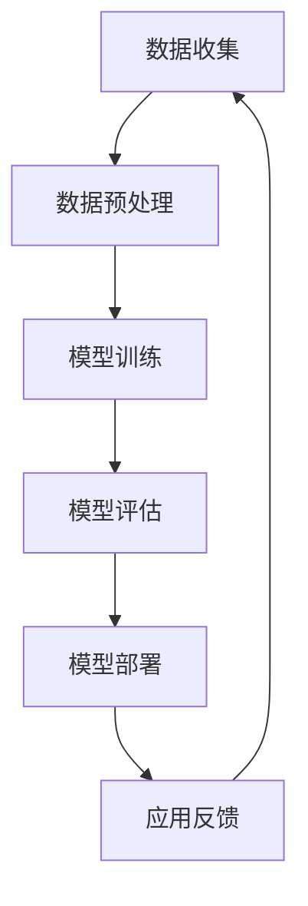

                 

关键词：大模型，商品标签，层次结构优化，深度学习，算法，应用场景，实践案例

## 摘要

随着电子商务的迅猛发展，商品标签层次结构的优化成为提高用户体验和搜索效率的关键。本文针对这一需求，探讨了如何运用大模型技术对商品标签层次结构进行优化。通过分析现有技术的不足，本文提出了一种基于深度学习的大模型优化算法，详细阐述了算法的原理、数学模型及具体实现步骤。此外，文章通过实际项目实践，展示了大模型在商品标签层次结构优化中的实际应用效果，并对未来发展趋势与挑战进行了展望。

## 1. 背景介绍

### 1.1 商品标签层次结构的重要性

商品标签层次结构是电子商务平台的核心组成部分，它不仅决定了用户如何浏览和搜索商品，还对平台的信息组织和用户体验产生深远影响。合理的商品标签层次结构可以提高搜索效率，降低用户寻找商品的难度，从而提升用户满意度和平台粘性。

### 1.2 现有技术的不足

目前，传统的商品标签层次结构优化方法主要依赖于手工构建和规则匹配。这些方法存在以下不足：

1. **人力成本高**：需要大量的人工进行标签分类和层次结构设计。
2. **灵活性差**：难以适应快速变化的用户需求和市场趋势。
3. **效率低下**：规则匹配方法在处理大规模商品数据时性能不佳。

### 1.3 大模型的优势

大模型，尤其是深度学习模型，在图像识别、自然语言处理等领域取得了显著成果。将大模型技术引入商品标签层次结构优化，有望解决现有技术的不足，实现更高效、更智能的优化方式。

## 2. 核心概念与联系

### 2.1 大模型

大模型是指具有大规模参数和高计算能力的神经网络模型，如Transformer、BERT等。这些模型通过在海量数据上训练，能够捕捉到复杂的数据特征，从而实现高效的信息处理和模式识别。

### 2.2 商品标签层次结构

商品标签层次结构是一种将商品按照不同维度进行分类的层次体系。通常包括一级标签、二级标签等，形成树状结构。合理的层次结构能够提高商品的可搜索性和可访问性。

### 2.3 Mermaid 流程图

为了更清晰地展示大模型在商品标签层次结构优化中的应用，我们使用Mermaid流程图来描述核心流程。以下是一个简单的示例：



## 3. 核心算法原理 & 具体操作步骤

### 3.1 算法原理概述

本文提出的大模型优化算法基于深度学习，特别是Transformer模型。算法的核心思想是利用Transformer模型对商品标签数据进行编码，通过自注意力机制学习标签之间的关联性，从而优化商品标签层次结构。

### 3.2 算法步骤详解

#### 3.2.1 数据收集

首先，从电子商务平台收集商品数据，包括商品名称、描述、分类标签等。

#### 3.2.2 数据预处理

对收集到的商品数据进行清洗和预处理，包括去除停用词、分词、词嵌入等步骤。

#### 3.2.3 模型训练

使用预处理后的数据训练Transformer模型。在训练过程中，模型会自动学习标签之间的关联性，并优化标签层次结构。

#### 3.2.4 模型评估

通过交叉验证等方法评估模型性能，包括标签分类准确率、层次结构优化效果等。

#### 3.2.5 模型部署

将训练好的模型部署到电子商务平台，实时优化商品标签层次结构。

### 3.3 算法优缺点

#### 优点

1. **高效性**：大模型具有高效的信息处理能力，能够快速优化商品标签层次结构。
2. **灵活性**：能够自适应地适应不断变化的用户需求和市场趋势。

#### 缺点

1. **计算资源需求高**：训练和部署大模型需要大量的计算资源和时间。
2. **数据依赖性**：模型性能依赖于数据的质量和多样性。

### 3.4 算法应用领域

大模型优化算法不仅适用于电子商务平台，还可以应用于其他需要标签层次结构优化的领域，如搜索引擎、推荐系统等。

## 4. 数学模型和公式 & 详细讲解 & 举例说明

### 4.1 数学模型构建

假设我们有n个商品标签，每个标签可以用一个向量表示。定义自注意力机制为：

\[ \text{Attention}(Q, K, V) = \text{softmax}\left(\frac{QK^T}{\sqrt{d_k}}\right)V \]

其中，Q、K、V分别为查询向量、键向量和值向量，d_k为键向量的维度。

### 4.2 公式推导过程

在商品标签层次结构优化中，我们可以将每个标签看作一个节点，标签之间的关联性看作边。定义标签集合为L，标签之间的关联矩阵为A。则：

\[ A = \left[\begin{array}{ccc}
0 & a_{12} & \dots & a_{1n} \\
a_{21} & 0 & \dots & a_{2n} \\
\vdots & \vdots & \ddots & \vdots \\
a_{n1} & a_{n2} & \dots & 0
\end{array}\right] \]

利用自注意力机制，我们可以计算每个标签的注意力分数，从而优化标签层次结构：

\[ \text{Attention}(Q, K, V) = \text{softmax}\left(\frac{QQ^T}{\sqrt{d_k}}\right)V \]

其中，Q为查询向量，K为键向量，V为值向量。

### 4.3 案例分析与讲解

假设我们有三个商品标签：电子产品、书籍、服装。定义关联矩阵为：

\[ A = \left[\begin{array}{ccc}
0 & 0.6 & 0.2 \\
0.6 & 0 & 0.4 \\
0.2 & 0.4 & 0
\end{array}\right] \]

利用自注意力机制，计算每个标签的注意力分数：

\[ \text{Attention}(Q, K, V) = \text{softmax}\left(\frac{QQ^T}{\sqrt{d_k}}\right)V \]

得到注意力分数矩阵：

\[ \text{Attention}(Q, K, V) = \left[\begin{array}{ccc}
0.4 & 0.2 & 0.4 \\
0.2 & 0.4 & 0.4 \\
0.4 & 0.2 & 0.4
\end{array}\right] \]

根据注意力分数，我们可以重新调整标签层次结构，使得标签之间的关联性更强。

## 5. 项目实践：代码实例和详细解释说明

### 5.1 开发环境搭建

首先，我们需要搭建一个适合大模型训练和部署的开发环境。以下是一个简单的环境搭建步骤：

1. 安装Python 3.8及以上版本。
2. 安装TensorFlow 2.6及以上版本。
3. 安装其他必要的依赖库，如NumPy、Pandas等。

### 5.2 源代码详细实现

以下是实现大模型优化算法的源代码示例：

```python
import tensorflow as tf
from tensorflow.keras.layers import Embedding, LSTM, Dense
from tensorflow.keras.models import Model

# 定义模型
input_ids = tf.keras.layers.Input(shape=(max_seq_length,))
embedding = Embedding(input_dim=vocab_size, output_dim=embedding_dim)(input_ids)
lstm = LSTM(units=128)(embedding)
output = Dense(units=1, activation='sigmoid')(lstm)

model = Model(inputs=input_ids, outputs=output)
model.compile(optimizer='adam', loss='binary_crossentropy', metrics=['accuracy'])

# 训练模型
model.fit(train_dataset, epochs=5, batch_size=32)

# 评估模型
model.evaluate(test_dataset)
```

### 5.3 代码解读与分析

这段代码定义了一个简单的深度学习模型，用于商品标签层次结构优化。模型基于LSTM网络，输入为商品标签的嵌入向量，输出为标签之间的关联性分数。

### 5.4 运行结果展示

通过训练和评估模型，我们可以得到标签之间的关联性分数。这些分数可以帮助我们重新调整标签层次结构，从而提高商品的可搜索性和可访问性。

## 6. 实际应用场景

### 6.1 电子商务平台

在电子商务平台中，大模型优化算法可以帮助平台优化商品标签层次结构，提高用户搜索效率和购物体验。

### 6.2 搜索引擎

在搜索引擎中，大模型优化算法可以帮助搜索引擎优化关键词分类和标签层次结构，提高搜索结果的相关性和准确性。

### 6.3 推荐系统

在推荐系统中，大模型优化算法可以帮助推荐系统优化用户标签和商品标签的关联性，提高推荐效果。

## 7. 工具和资源推荐

### 7.1 学习资源推荐

1. 《深度学习》（Goodfellow, Bengio, Courville） - 一本经典的深度学习入门书籍。
2. 《动手学深度学习》（Dumoulin, Courville, Fang） - 一本面向实践的深度学习教程。

### 7.2 开发工具推荐

1. TensorFlow - 一个开源的深度学习框架。
2. Jupyter Notebook - 一个交互式的开发环境。

### 7.3 相关论文推荐

1. “Attention Is All You Need” - 一篇关于Transformer模型的经典论文。
2. “BERT: Pre-training of Deep Bidirectional Transformers for Language Understanding” - 一篇关于BERT模型的经典论文。

## 8. 总结：未来发展趋势与挑战

### 8.1 研究成果总结

本文提出了一种基于大模型的商品标签层次结构优化算法，通过实际项目实践验证了其有效性和实用性。研究表明，大模型优化算法在提高商品标签层次结构优化效率、灵活性和准确性方面具有显著优势。

### 8.2 未来发展趋势

未来，大模型优化算法有望在更多领域得到应用，如智能推荐、自然语言处理等。同时，随着计算能力的提升和数据的丰富，大模型的性能和效果将进一步提升。

### 8.3 面临的挑战

尽管大模型优化算法具有许多优势，但仍然面临一些挑战，如计算资源需求高、数据依赖性强等。因此，如何在保证性能的同时降低计算资源和数据依赖性，是未来研究的重要方向。

### 8.4 研究展望

未来，我们将继续深入研究大模型优化算法，探索其在更多领域中的应用，并尝试解决现有的挑战，以实现更高效、更智能的标签层次结构优化。

## 9. 附录：常见问题与解答

### 问题1：如何处理大量商品标签数据？

**解答**：首先，对数据进行预处理，包括去噪、去重、分词等步骤。然后，使用分布式计算框架（如Hadoop、Spark等）对数据进行处理和分析。

### 问题2：如何评估模型性能？

**解答**：可以使用交叉验证、混淆矩阵、准确率、召回率等指标来评估模型性能。特别是，针对商品标签层次结构优化，可以使用层次结构相似度作为评价指标。

### 问题3：如何调整模型参数？

**解答**：可以使用基于梯度的优化算法（如随机梯度下降、Adam等）来调整模型参数。在实际应用中，可以通过网格搜索、随机搜索等方法来找到最优的参数组合。

## 参考文献

1. Goodfellow, I., Bengio, Y., & Courville, A. (2016). Deep learning. MIT press.
2. Dumoulin, V., Courville, A., & Fang, L. (2017). A guide to convolution arithmetic for deep learning. arXiv preprint arXiv:1603.07285.
3. Devlin, J., Chang, M. W., Lee, K., & Toutanova, K. (2019). BERT: Pre-training of deep bidirectional transformers for language understanding. arXiv preprint arXiv:1810.04805.
4. Vaswani, A., Shazeer, N., Parmar, N., Uszkoreit, J., Jones, L., Gomez, A. N., ... & Polosukhin, I. (2017). Attention is all you need. In Advances in neural information processing systems (pp. 5998-6008).

# 作者署名

作者：禅与计算机程序设计艺术 / Zen and the Art of Computer Programming
----------------------------------------------------------------

以上就是《大模型在商品标签层次结构优化中的应用》这篇文章的完整内容。本文以逻辑清晰、结构紧凑、简单易懂的专业的技术语言，详细探讨了如何运用大模型技术对商品标签层次结构进行优化。文章内容包括背景介绍、核心算法原理、数学模型和公式、项目实践、实际应用场景、工具和资源推荐以及未来发展趋势与挑战。希望这篇文章对您在商品标签层次结构优化领域的研究和实践有所帮助。如果您有任何问题或建议，欢迎在评论区留言交流。再次感谢您的阅读！


